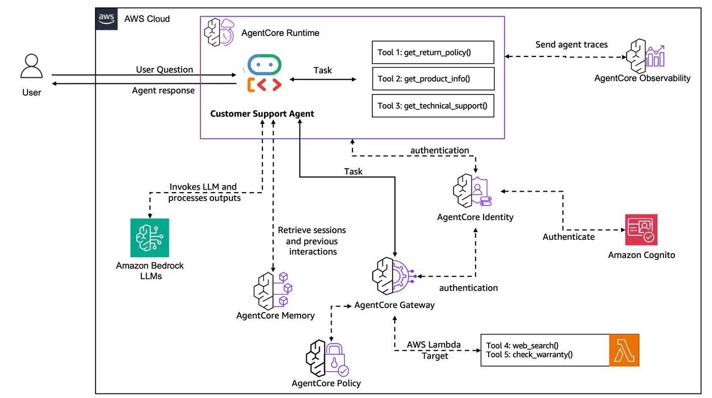
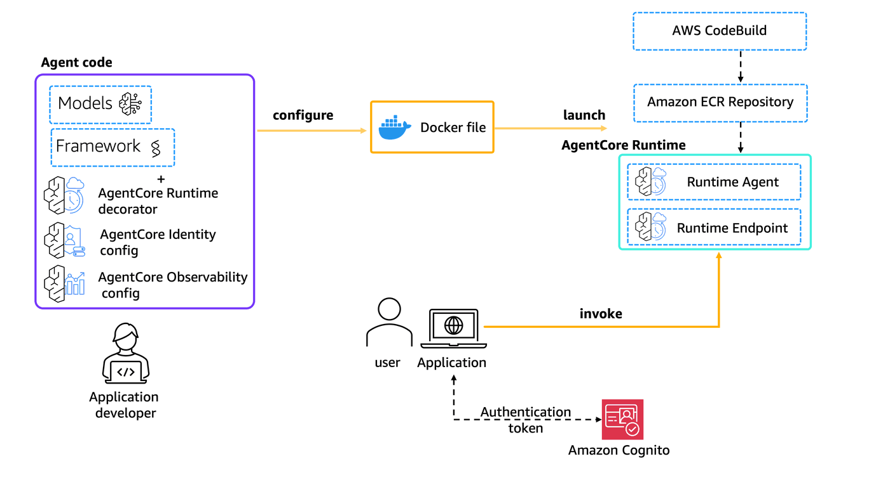
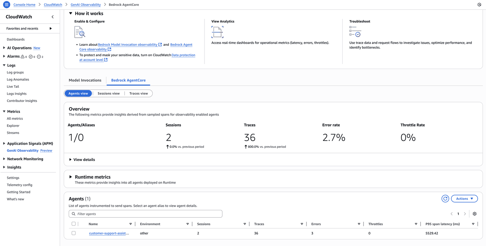
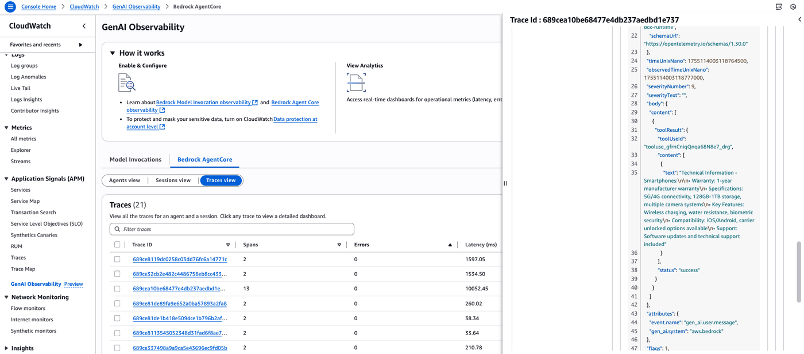

## Lab 4: Deploy to Production - Use AgentCore Runtime with Observability

### Overview

In Lab 3 we scaled our Customer Support Agent by centralizing tools through AgentCore Gateway with secure authentication. Now we'll complete the production journey by deploying our agent to AgentCore Runtime with comprehensive observability. This will transform our prototype into a production-ready system that can handle real-world traffic with full monitoring and automatic scaling.

[Amazon Bedrock AgentCore Runtime](https://docs.aws.amazon.com/bedrock-agentcore/latest/devguide/agents-tools-runtime.html) is a secure, fully managed runtime that empowers organizations to deploy and scale AI agents in production, regardless of framework, protocol, or model choice. It provides enterprise-grade reliability, automatic scaling, and comprehensive monitoring capabilities.

**Workshop Journey:**

- **Lab 1 (Done):** Create Agent Prototype - Built a functional customer support agent
- **Lab 2 (Done):** Enhance with Memory - Added conversation context and personalization
- **Lab 3 (Done):** Scale with Gateway & Identity - Shared tools across agents securely
- **Lab 4 (Current):** Deploy to Production - Used AgentCore Runtime with observability
- **Lab 5:** Build User Interface - Create a customer-facing application

### Why AgentCore Runtime & Production Deployment Matter

Current State (Lab 1-3): Agent runs locally with centralized tools but faces production challenges:

- Agent runs locally in a single session
- No comprehensive monitoring or debugging capabilities
- Cannot handle multiple concurrent users reliably

After this lab, we will have a production-ready agent infrastructure with:

- Serverless auto-scaling to handle variable demand
- Comprehensive observability with traces, metrics, and logging
- Enterprise reliability with automatic error recovery
- Secure deployment with proper access controls
- Easy management through AWS console and APIs and support for real-world production workloads.


### Adding comprehensive observability with AgentCore Observability

Additionally, AgentCore Runtime integrates seamlessly with [AgentCore Observability](https://docs.aws.amazon.com/bedrock-agentcore/latest/devguide/observability.html) to provide full visibility into your agent's behavior in production. AgentCore Observability automatically captures traces, metrics, and logs from your agent interactions, tool usage, and memory access patterns. In this lab we will see how AgentCore Runtime integrates with CloudWatch GenAI Observability to provide comprehensive monitoring and debugging capabilities.

For request tracing, AgentCore Observability captures the complete conversation flow including tool invocations, memory retrievals, and model interactions. For performance monitoring, it tracks response times, success rates, and resource utilization to help optimize your agent's performance.

During the observability flow, AgentCore Runtime automatically instruments your agent code and sends telemetry data to CloudWatch. You can then use CloudWatch dashboards and GenAI Observability features to analyze patterns, identify bottlenecks, and troubleshoot issues in real-time.

### Architecture for Lab 4
<div style="text-align:left"> 
     
</div>

*Agent now runs in AgentCore Runtime with full observability through CloudWatch, serving production traffic with auto-scaling and comprehensive monitoring. Memory and Gateway integrations from previous labs remain fully functional in the production environment.*

### Key Features

- **Serverless Agent Deployment:** Transform your local agent into a scalable production service using AgentCore Runtime with minimal code changes
- **Comprehensive Observability:** Full request tracing, performance metrics, and debugging capabilities through CloudWatch GenAI Observability

### Prerequisites

- Python 3.12+
- AWS account with appropriate permissions
- Docker, Finch or Podman installed and running
- Amazon Bedrock AgentCore SDK
- Google ADK framework
- **Lab 3 Completion:** This lab builds on Lab 3 (AgentCore Gateway). You MUST run [lab-03-agentcore-gateway](lab-03-agentcore-gateway.ipynb) to provision the gateway before running this lab.

**Note: You MUST enable [CloudWatch Transaction Search](https://docs.aws.amazon.com/AmazonCloudWatch/latest/monitoring/Enable-TransactionSearch.html) to be able to see AgentCore Observability traces in CloudWatch.**

### Step 1: Import Required Libraries

```python
# Import required libraries
import boto3
from lab_helpers.utils import get_ssm_parameter
from bedrock_agentcore_starter_toolkit.operations.memory.manager import MemoryManager
from bedrock_agentcore.memory.constants import StrategyType
from lab_helpers.lab2_memory import ACTOR_ID

boto_session = boto3.Session()
REGION = boto_session.region_name


memory_name = "CustomerSupportMemory"
memory_manager = MemoryManager(region_name=REGION)
memory = memory_manager.get_or_create_memory(  # Just in case the memory lab wasn't executed
    name=memory_name,
    strategies=[
        {
            StrategyType.USER_PREFERENCE.value: {
                "name": "CustomerPreferences",
                "description": "Captures customer preferences and behavior",
                "namespaces": ["support/customer/{actorId}/preferences/"],
            }
        },
        {
            StrategyType.SEMANTIC.value: {
                "name": "CustomerSupportSemantic",
                "description": "Stores facts from conversations",
                "namespaces": ["support/customer/{actorId}/semantic/"],
            }
        },
    ],
)
memory_id = memory["id"]
```

### Step 2: Preparing Your Agent for AgentCore Runtime

#### Creating the Runtime-Ready Agent

Let's first define the necessary AgentCore Runtime components via Python SDK within our previous local agent implementation.

Observe the #### AGENTCORE RUNTIME - LINE 1 #### comments below to see where is the relevant deployment code added. You'll find 4 such lines that prepare the runtime-ready agent:

1. Import the Runtime App with `from bedrock_agentcore.runtime import BedrockAgentCoreApp`
2. Initialize the App with `app = BedrockAgentCoreApp()`
3. Decorate our invocation function with `@app.entrypoint`
4. Let AgentCore Runtime control the execution with `app.run()`

##### Key Implementation Details:

The runtime-ready agent uses an entrypoint function that extracts user prompts from the payload and JWT tokens from request headers via 
context.request_headers.get('Authorization', ''). The authorization token is then propagated directly to the AgentCore Gateway by passing it in the 
MCP client headers: headers={"Authorization": auth_header}. The implementation includes error handling for missing authentication and returns plain 
text responses from the Google ADK agent invocation while preserving all memory and tool functionality from previous labs.

```python
%%writefile ./lab_helpers/lab4_runtime.py

import os
import uuid
import asyncio
import concurrent.futures
import concurrent.futures
from bedrock_agentcore.runtime import (
    BedrockAgentCoreApp,
)  #### AGENTCORE RUNTIME - LINE 1 ####

from mcp import ClientSession
from mcp.client.streamable_http import streamablehttp_client

from google.adk.agents import LlmAgent
from google.adk.models.lite_llm import LiteLlm
from google.adk.runners import Runner
from google.adk.sessions import InMemorySessionService
from google.genai import types

import boto3
from bedrock_agentcore.memory import MemoryClient
from lab_helpers.utils import get_ssm_parameter

# Initialize boto3 client
sts_client = boto3.client('sts')

# Get AWS account details
REGION = boto3.session.Session().region_name

ACTOR_ID = "customer_001"

# Lab2 import: Memory
memory_id = os.environ.get("MEMORY_ID")
if not memory_id:
    raise Exception("Environment variable MEMORY_ID is required")

memory_client = MemoryClient(region_name=REGION)

# ============================================================
# System prompt
# ============================================================
SYSTEM_PROMPT = """You are a helpful and professional customer support assistant for an electronics e-commerce company.
Your role is to:
- Provide accurate information using the tools available to you
- Support the customer with technical information and product specifications.
- Be friendly, patient, and understanding with customers
- Always offer additional help after answering questions
- If you can't help with something, direct customers to the appropriate contact

You have access to the following tools:
1. get_return_policy() - For warranty and return policy questions
2. get_product_info() - To get information about a specific product
3. get_technical_support() - To search the technical support knowledge base
4. check_warranty_status() - To check warranty status via serial number (via AgentCore Gateway)
5. web_search() - To access current technical documentation, or for updated information (via AgentCore Gateway)
Always use the appropriate tool to get accurate, up-to-date information rather than making assumptions about electronic products or specifications."""

# ============================================================
# Local tools (same as Lab 3)
# ============================================================

def get_return_policy(product_category: str) -> str:
    """Get return policy information for a specific product category.

    Args:
        product_category: Electronics category (e.g., 'smartphones', 'laptops', 'accessories')

    Returns:
        Formatted return policy details including timeframes and conditions
    """
    return_policies = {
        "smartphones": {
            "window": "30 days",
            "condition": "Original packaging, no physical damage, factory reset required",
            "process": "Online RMA portal or technical support",
            "refund_time": "5-7 business days after inspection",
            "shipping": "Free return shipping, prepaid label provided",
            "warranty": "1-year manufacturer warranty included",
        },
        "laptops": {
            "window": "30 days",
            "condition": "Original packaging, all accessories, no software modifications",
            "process": "Technical support verification required before return",
            "refund_time": "7-10 business days after inspection",
            "shipping": "Free return shipping with original packaging",
            "warranty": "1-year manufacturer warranty, extended options available",
        },
        "accessories": {
            "window": "30 days",
            "condition": "Unopened packaging preferred, all components included",
            "process": "Online return portal",
            "refund_time": "3-5 business days after receipt",
            "shipping": "Customer pays return shipping under $50",
            "warranty": "90-day manufacturer warranty",
        },
    }
    default_policy = {
        "window": "30 days",
        "condition": "Original condition with all included components",
        "process": "Contact technical support",
        "refund_time": "5-7 business days after inspection",
        "shipping": "Return shipping policies vary",
        "warranty": "Standard manufacturer warranty applies",
    }
    policy = return_policies.get(product_category.lower(), default_policy)
    return (
        f"Return Policy - {product_category.title()}:\n\n"
        f"\u2022 Return window: {policy['window']} from delivery\n"
        f"\u2022 Condition: {policy['condition']}\n"
        f"\u2022 Process: {policy['process']}\n"
        f"\u2022 Refund timeline: {policy['refund_time']}\n"
        f"\u2022 Shipping: {policy['shipping']}\n"
        f"\u2022 Warranty: {policy['warranty']}"
    )


def get_product_info(product_type: str) -> str:
    """Get detailed technical specifications and information for electronics products.

    Args:
        product_type: Electronics product type (e.g., 'laptops', 'smartphones', 'headphones', 'monitors')

    Returns:
        Formatted product information including warranty, features, and policies
    """
    products = {
        "laptops": {
            "warranty": "1-year standard, 3-year extended available",
            "specs": "Intel/AMD processors, 8-64GB RAM, SSD storage",
            "features": "Backlit keyboards, fingerprint readers, Thunderbolt ports",
            "compatibility": "Windows, Linux, macOS (Apple only)",
            "support": "24/7 technical support, on-site repair options",
        },
        "smartphones": {
            "warranty": "1-year manufacturer, 2-year extended",
            "specs": "Latest processors, 6-12GB RAM, 128GB-1TB storage",
            "features": "5G capable, water resistant, wireless charging",
            "compatibility": "iOS or Android ecosystem",
            "support": "In-store and mail-in repair services",
        },
        "headphones": {
            "warranty": "1-year standard warranty",
            "specs": "Bluetooth 5.0+, ANC, 20-40hr battery",
            "features": "Active noise cancellation, transparency mode, multipoint",
            "compatibility": "Universal Bluetooth, some with proprietary apps",
            "support": "Replacement program for defective units",
        },
        "monitors": {
            "warranty": "3-year standard, zero dead pixel guarantee",
            "specs": "4K/1440p resolution, 60-240Hz refresh rate",
            "features": "HDR support, high refresh rates, adjustable stands",
            "compatibility": "HDMI, DisplayPort, USB-C inputs",
            "support": "Color calibration and technical support",
        },
    }
    product = products.get(product_type.lower())
    if not product:
        return f"Technical specifications for {product_type} not available. Please contact our technical support team."
    return (
        f"Technical Information - {product_type.title()}:\n\n"
        f"\u2022 Warranty: {product['warranty']}\n"
        f"\u2022 Specifications: {product['specs']}\n"
        f"\u2022 Key Features: {product['features']}\n"
        f"\u2022 Compatibility: {product['compatibility']}\n"
        f"\u2022 Support: {product['support']}"
    )


def get_technical_support(issue_description: str) -> str:
    """Search the technical support knowledge base for troubleshooting help.

    Args:
        issue_description: Description of the technical issue or question.

    Returns:
        Relevant technical support documentation and troubleshooting steps.
    """
    try:
        ssm = boto3.client("ssm")
        acct = boto3.client("sts").get_caller_identity()["Account"]
        region = boto3.Session().region_name
        kb_id = ssm.get_parameter(Name=f"/{acct}-{region}/kb/knowledge-base-id")["Parameter"]["Value"]
        bedrock_agent_runtime = boto3.client("bedrock-agent-runtime", region_name=region)
        response = bedrock_agent_runtime.retrieve(
            knowledgeBaseId=kb_id,
            retrievalQuery={"text": issue_description},
            retrievalConfiguration={"vectorSearchConfiguration": {"numberOfResults": 3}},
        )
        results = response.get("retrievalResults", [])
        if not results:
            return "No relevant technical support documentation found for this issue."
        formatted_results = []
        for i, result in enumerate(results, 1):
            text = result.get("content", {}).get("text", "")
            score = result.get("score", 0)
            if score >= 0.4:
                formatted_results.append(f"--- Result {i} (relevance: {score:.2f}) ---\n{text}")
        if not formatted_results:
            return "No sufficiently relevant technical support documentation found."
        return "\n\n".join(formatted_results)
    except Exception as e:
        return f"Unable to access technical support documentation. Error: {str(e)}"


# ============================================================
# MCP Gateway tool wrappers (same pattern as Lab 3)
# ============================================================

async def _call_mcp_tool(tool_name: str, arguments: dict, gateway_url: str, auth_header: str) -> str:
    """Helper to call an MCP tool on the AgentCore Gateway."""
    async with streamablehttp_client(
        gateway_url,
        headers={"Authorization": auth_header},
    ) as (read_stream, write_stream, _):
        async with ClientSession(read_stream, write_stream) as session:
            await session.initialize()
            result = await session.call_tool(tool_name, arguments)
            if result.content:
                return "\n".join(
                    part.text for part in result.content if hasattr(part, "text")
                )
            return "No result returned."


def _run_async_in_thread(coro):
    """Run an async coroutine in a separate thread to avoid 'event loop already running' errors."""
    with concurrent.futures.ThreadPoolExecutor(max_workers=1) as executor:
        future = executor.submit(asyncio.run, coro)
        return future.result()


# These will be set per-request in the entrypoint
_gateway_url = None
_auth_header = None


def check_warranty_status(serial_number: str, customer_email: str) -> str:
    """Check the warranty status of a product using its serial number.

    Args:
        serial_number: The product serial number to look up.
        customer_email: Customer email for verification. Pass empty string if not available.

    Returns:
        Warranty status information for the product.
    """
    args = {"serial_number": serial_number}
    if customer_email:
        args["customer_email"] = customer_email
    return _run_async_in_thread(
        _call_mcp_tool("LambdaUsingSDK___check_warranty_status", args, _gateway_url, _auth_header)
    )


def web_search(keywords: str, region: str, max_results: int) -> str:
    """Search the web for updated information using DuckDuckGo.

    Args:
        keywords: The search query keywords.
        region: The search region (e.g., us-en, uk-en, ru-ru).
        max_results: The maximum number of results to return.

    Returns:
        Search results from the web.
    """
    args = {"keywords": keywords, "region": region, "max_results": max_results}
    return _run_async_in_thread(
        _call_mcp_tool("LambdaUsingSDK___web_search", args, _gateway_url, _auth_header)
    )


# Initialize the AgentCore Runtime App
app = BedrockAgentCoreApp()  #### AGENTCORE RUNTIME - LINE 2 ####

@app.entrypoint  #### AGENTCORE RUNTIME - LINE 3 ####
async def invoke(payload, context=None):
    """AgentCore Runtime entrypoint function"""
    global _gateway_url, _auth_header

    user_input = payload.get("prompt", "")
    session_id = context.session_id  # Get session_id from context
    actor_id = payload.get("actor_id", ACTOR_ID)
    # Access request headers - handle None case
    request_headers = context.request_headers or {}

    # Get Client JWT token
    auth_header = request_headers.get('Authorization', '')
    print(f"Authorization header: {auth_header}")

    # Get Gateway ID
    existing_gateway_id = get_ssm_parameter("/app/customersupport/agentcore/gateway_id")

    # Initialize Bedrock AgentCore Control client
    gateway_client = boto3.client(
        "bedrock-agentcore-control",
        region_name=REGION,
    )
    # Get existing gateway details
    gateway_response = gateway_client.get_gateway(gatewayIdentifier=existing_gateway_id)
    gateway_url = gateway_response['gatewayUrl']

    if gateway_url and auth_header:
        try:
            # Set module-level vars for MCP tool wrappers
            _gateway_url = gateway_url
            _auth_header = auth_header

            # All tools: local + MCP gateway wrappers
            all_tools = [
                get_product_info,
                get_return_policy,
                get_technical_support,
                check_warranty_status,
                web_search,
            ]

            # --- 1. Retrieve customer context from memory ---
            all_context = []
            namespaces = {
                "preferences": f"support/customer/{actor_id}/preferences/",
                "semantic": f"support/customer/{actor_id}/semantic/",
            }
            for context_type, namespace in namespaces.items():
                try:
                    memories = memory_client.retrieve_memories(
                        memory_id=memory_id,
                        namespace=namespace,
                        query=user_input,
                        top_k=3,
                    )
                    for mem in memories:
                        if isinstance(mem, dict):
                            text = mem.get("content", {}).get("text", "").strip()
                            if text:
                                all_context.append(f"[{context_type.upper()}] {text}")
                except Exception as e:
                    print(f"Warning: Could not retrieve {context_type} memories: {e}")

            # --- 2. Build enriched query with context ---
            if all_context:
                context_text = "\n".join(all_context)
                enriched_query = f"Customer Context:\n{context_text}\n\n{user_input}"
            else:
                enriched_query = user_input

            # --- 3. Create and run the ADK agent ---
            agent = LlmAgent(
                name="customer_support_agent",
                model=LiteLlm(model="bedrock/global.anthropic.claude-haiku-4-5-20251001-v1:0"),
                instruction=SYSTEM_PROMPT,
                tools=all_tools,
            )

            adk_session_id = str(uuid.uuid4())
            session_service = InMemorySessionService()
            adk_session = await session_service.create_session(
                app_name="customer_support_app", user_id="user_001", session_id=adk_session_id
            )
            runner = Runner(agent=agent, app_name="customer_support_app", session_service=session_service)
            content = types.Content(role="user", parts=[types.Part(text=enriched_query)])

            final_response = ""
            async for event in runner.run_async(
                user_id="user_001", session_id=adk_session_id, new_message=content
            ):
                if event.is_final_response():
                    final_response = event.content.parts[0].text

            # --- 4. Save interaction to memory ---
            if final_response:
                try:
                    memory_client.create_event(
                        memory_id=memory_id,
                        actor_id=actor_id,
                        session_id=str(session_id),
                        messages=[
                            (user_input, "USER"),
                            (final_response, "ASSISTANT"),
                        ],
                    )
                except Exception as e:
                    print(f"Warning: Could not save to memory: {e}")

            return final_response
        except Exception as e:
            print(f"Agent error: {str(e)}")
            return f"Error: {str(e)}"
    else:
        return "Error: Missing gateway URL or authorization header"

if __name__ == "__main__":
    app.run()  #### AGENTCORE RUNTIME - LINE 4 ####
```

#### What happens behind the scenes?

When you use `BedrockAgentCoreApp`, it automatically:

- Creates an HTTP server that listens on port 8080
- Implements the required `/invocations` endpoint for processing requests
- Implements the `/ping` endpoint for health checks
- Handles proper content types and response formats
- Manages error handling according to AWS standards

### Step 3: Deploying to AgentCore Runtime

Now let's deploy our agent to AgentCore Runtime using the [AgentCore Starter Toolkit](https://github.com/aws/bedrock-agentcore-starter-toolkit).

#### Configure the Secure Runtime Deployment (AgentCore Runtime + AgentCore Identity)

First we will use our starter toolkit to configure the AgentCore Runtime deployment with an entrypoint, the execution role we will create and a requirements file. We will also configure the identity authorization using an Amazon Cognito user pool and we will configure the starter kit to auto create the Amazon ECR repository on launch.

During the configure step, your docker file will be generated based on your application code

<div style="text-align:left"> 
     
</div>

**Note**: The Cognito access_token is valid for 2 hours only. If the access_token expires you can vend another access_token by using the `reauthenticate_user` method.

```python
from lab_helpers.utils import get_or_create_cognito_pool

access_token = get_or_create_cognito_pool(refresh_token=True)
print(f"Access token: {access_token['bearer_token']}")
```

#### AgentCore Runtime Configuration Summary:

Below code configures the AgentCore Runtime deployment using the starter toolkit. It creates an execution role for the runtime, then configures the 
deployment with the agent entrypoint file (lab_helpers/lab4_runtime.py), enables automatic ECR repository creation, and sets up JWT-based authentication using 
Cognito. The configuration specifies allowed client IDs and discovery URLs retrieved from SSM parameters, establishing secure access control for the 
production agent deployment. This step automatically generates the Dockerfile and .bedrock_agentcore.yaml configuration files needed for 
containerized deployment.

**Runtime Header Configuration** : Below code configures custom header allowlists for the deployed AgentCore Runtime. It extracts the runtime ID from the agent ARN, retrieves the 
current runtime configuration to preserve existing settings, then updates the runtime with a request header allowlist that includes the Authorization
header (required for OAuth token propagation) and custom headers. This ensures JWT tokens and other necessary headers are properly forwarded from 
client requests to the agent runtime code.

**Note: For the scope of the workshop, you can safely ignore the Platform Mismatch warning.**

```python
from bedrock_agentcore_starter_toolkit import Runtime
from lab_helpers.utils import create_agentcore_runtime_execution_role

# Initialize the runtime toolkit
boto_session = boto3.session.Session()
region = boto_session.region_name

execution_role_arn = create_agentcore_runtime_execution_role()

agentcore_runtime = Runtime()

# Configure the deployment
response = agentcore_runtime.configure(
    entrypoint="lab_helpers/lab4_runtime.py",
    execution_role=execution_role_arn,
    auto_create_ecr=True,
    requirements_file="requirements.txt",
    region=region,
    agent_name="customer_support_agent",
    authorizer_configuration={
        "customJWTAuthorizer": {
            "allowedClients": [get_ssm_parameter("/app/customersupport/agentcore/client_id")],
            "discoveryUrl": get_ssm_parameter("/app/customersupport/agentcore/cognito_discovery_url"),
        }
    },
    # Add custom header allowlist for Authorization and custom headers
    request_header_configuration={
        "requestHeaderAllowlist": [
            "Authorization",  # Required for OAuth propogation
            "X-Amzn-Bedrock-AgentCore-Runtime-Custom-H1",  # Custom header
        ]
    },
)

print("Configuration completed:", response)
```

```python
%store execution_role_arn

print(f"Agent Role ARN: {execution_role_arn}")
```

#### Launch the Agent

Now let's launch our agent to AgentCore Runtime. This will create an AWS CodeBuild pipeline, the Amazon ECR repository and the AgentCore Runtime components.

<div style="text-align:left"> 
     
</div>

*Note: This step might fail if the agent with the same name already exists. If you want to overwrite the existing Runtime, use this instead:*

``` launch_result = agentcore_runtime.launch(auto_update_on_conflict=True)```

```python
# Launch the agent (this will build and deploy the container)
from lab_helpers.utils import put_ssm_parameter

launch_result = agentcore_runtime.launch(env_vars={"MEMORY_ID": memory_id})
print("Launch completed:", launch_result.agent_arn)

agent_arn = put_ssm_parameter("/app/customersupport/agentcore/runtime_arn", launch_result.agent_arn)
```

#### Check Deployment Status

Let's wait for the deployment to complete:

```python
import time

# Wait for the agent to be ready
status_response = agentcore_runtime.status()
status = status_response.endpoint["status"]

end_status = ["READY", "CREATE_FAILED", "DELETE_FAILED", "UPDATE_FAILED"]
while status not in end_status:
    print(f"Waiting for deployment... Current status: {status}")
    time.sleep(10)
    status_response = agentcore_runtime.status()
    status = status_response.endpoint["status"]

print(f"Final status: {status}")
```

### Step 4: Invoking Your Deployed Agent

Now that our agent is deployed and ready, let's test it with some queries. We invoke the agent with the right authorization token type. In out case it'll be Cognito access token. Copy the access token from the cell above

<div style="text-align:left"> 
     
</div>

#### Using the AgentCore Starter Toolkit

We can validate that the agent works using the AgentCore Starter Toolkit for invocation. The starter toolkit can automatically create a session id for us to query our agent. Alternatively, you can also pass the session id as a parameter during invocation. For demonstration purpose, we will create our own session id.

```python
# Initialize the AgentCore Control client
client = boto3.client("bedrock-agentcore-control")

# Extract runtime ID from the ARN (format: arn:aws:bedrock-agentcore:region:account:runtime/runtime-id)
runtime_id = launch_result.agent_arn.split(":")[-1].split("/")[-1]

print(f"Runtime ID: {runtime_id}")
```

```python
import uuid
from IPython.display import display, Markdown

# Create a session ID for demonstrating session continuity
session_id = uuid.uuid4()

# Test different customer support scenarios
user_query = "List all of your tools"

response = agentcore_runtime.invoke(
    {"prompt": user_query, "actor_id": ACTOR_ID},
    bearer_token=access_token["bearer_token"],
    session_id=str(session_id),
)

display(Markdown(response["response"].replace("\\n", "\n")))
```

#### Invoking the agent with session continuity

Since we are using AgentCore Runtime, we can easily continue our conversation with the same `session id` and the same `Actor_id`

```python
user_query = "Tell me detailed information about the technical documentation on installing a new CPU"
response = agentcore_runtime.invoke(
    {"prompt": user_query, "actor_id": ACTOR_ID},
    bearer_token=access_token["bearer_token"],
    session_id=str(session_id),
)
display(Markdown(response["response"].replace("\\n", "\n")))
```

#### Invoking the agent with a new user
In the example below our agent still has the context of the Gaming Console Pro that the user bought. This is due to the AgentCore Memory persistence. The agent won't know the context for a new user.

```python
# Creating a new session ID for demonstrating new customer
session_id2 = uuid.uuid4()

user_query = (
    "I have a Gaming Console Pro device , I want to check my warranty status, warranty serial number is MNO33333333."
)
response = agentcore_runtime.invoke(
    {"prompt": user_query, "actor_id": ACTOR_ID},
    bearer_token=access_token["bearer_token"],
    session_id=str(session_id2),
)
display(Markdown(response["response"].replace("\\n", "\n")))
```

In this case our agent does not have the context anymore and needs more information. 

And it is all it takes to have a secure and scalable endpoint for our Agent with no need to manage all the underlying infrastructure!

### Step 5: AgentCore Observability

[AgentCore Observability](https://docs.aws.amazon.com/bedrock-agentcore/latest/devguide/observability.html) provides monitoring and tracing capabilities for AI agents using Amazon OpenTelemetry Python Instrumentation and Amazon CloudWatch GenAI Observability.

#### Agents

Default AgentCore Runtime configuration allows for logging our agent's traces on CloudWatch by means of **AgentCore Observability**. These traces can be seen on the AWS CloudWatch GenAI Observability dashboard. Navigate to Cloudwatch &rarr; GenAI Observability &rarr; Bedrock AgentCore.



#### Sessions

The Sessions view shows the list of all the sessions associated with all agents in your account.


#### Traces

Trace view lists all traces from your agents in this account. To work with traces:

- Choose Filter traces to search for specific traces.
- Sort by column name to organize results.
- Under Actions, select Logs Insights to refine your search by querying across your log and span data or select Export selected traces to export.



### Congratulations! 🎉

You have successfully completed **Lab 4: Deploy to Production - Use AgentCore Runtime with Observability!**

Here is what you accomplished:

##### Production-Ready Deployment:

- Prepared your agent for production with minimal code changes (only 4 lines added)
- Validated proper session isolation between different customers
- Confirmed session continuity + memory persistence and context awareness per session

##### Enterprise-Grade Security & Identity:

- Implemented secure authentication using Cognito integration with JWT tokens
- Configured proper IAM roles and execution permissions for production workloads
- Established identity-based access control for secure agent invocation

##### Comprehensive Observability:

- Enabled AgentCore Observability for full request tracing across all customer sessions
- Configured CloudWatch GenAI Observability dashboard monitoring

##### Current Limitations (We'll fix these next!):

- **Developer Focused Interaction** - Agent accessible via SDK/API calls but no user-friendly web interface
- **Manual Session Management** - Requires programmatic session creation rather than intuitive user experience

##### Next Up [Lab 5: Build the Frontend Application →](lab-05-frontend.ipynb)
In Lab 5, you'll set up continuous quality monitoring with AgentCore Evaluations to ensure your production agent maintains high performance standards!
