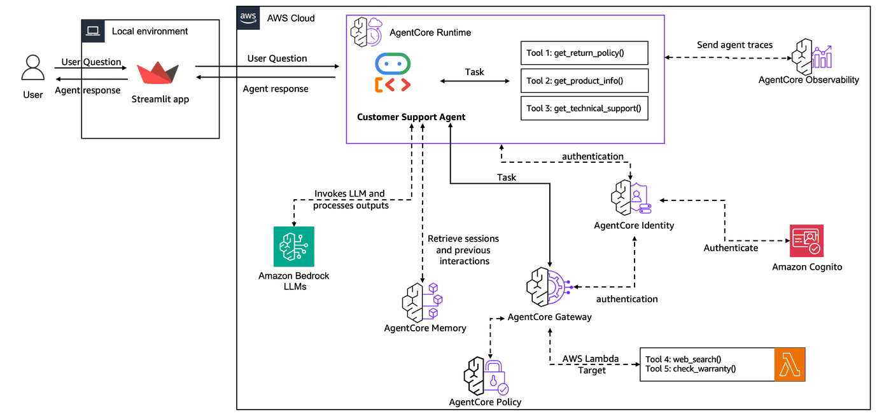
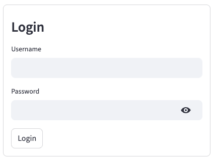
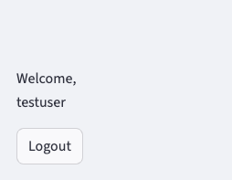
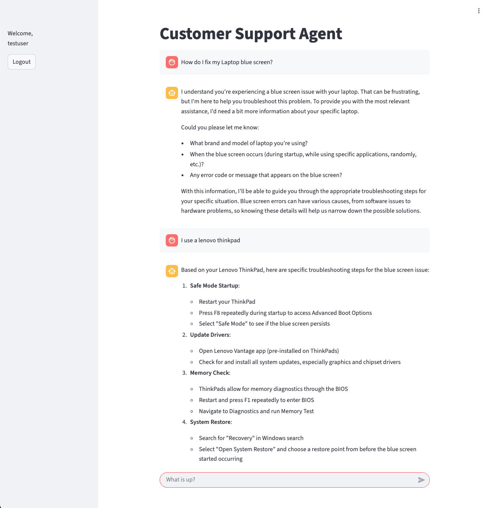
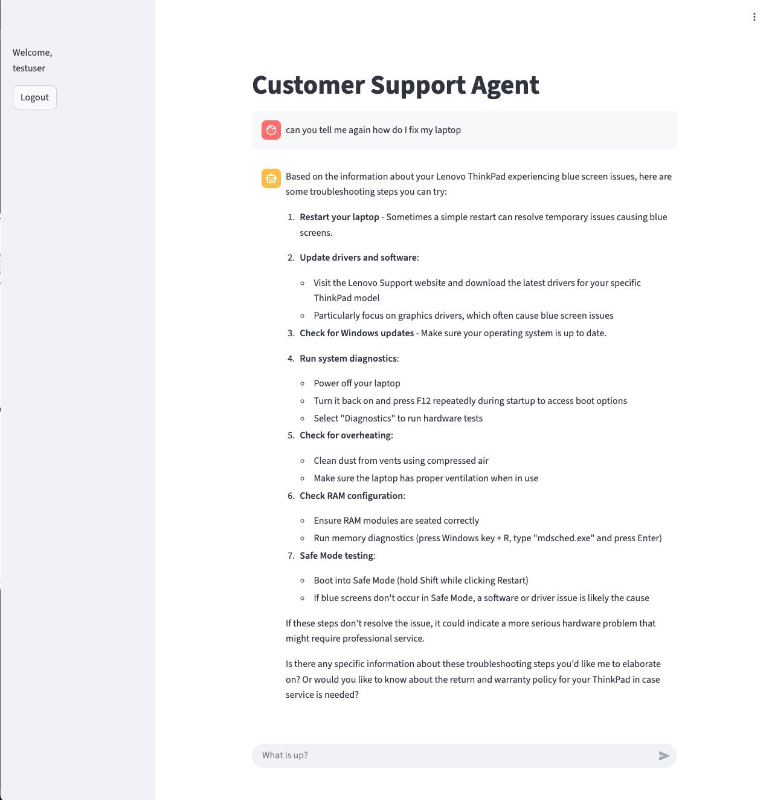

# Lab 5: Building a Customer-Facing Frontend Application

## Overview

In the previous labs, we've built a comprehensive Customer Support Agent with memory, shared tools, and production-grade deployment. With them we show cased the capabilities of AgentCore services to move an agentic use case from prototype to production. You can now invoke your agent runtime from any application. On real world applications, customers expect an user interface to be available. Now it's time to create a user-friendly frontend that customers can actually use to interact with our agent.

**Workshop Journey:**
- **Lab 1 (Done)**: Create Agent Prototype - Built a functional customer support agent
- **Lab 2 (Done)**: Enhance with Memory - Added conversation context and personalization
- **Lab 3 (Done)**: Scale with Gateway & Identity - Shared tools across agents securely
- **Lab 4 (Done)**: Deploy to Production - Used AgentCore Runtime with observability
- **Lab 5 (Current)**: Build User Interface - Create a customer-facing application

In this lab, we'll create a **Streamlit-based web application** that provides customers with an intuitive chat interface to interact with our deployed Customer Support Agent. The frontend will include:

- **Secure Authentication** - User login via Amazon Cognito
- **Real-time Chat Interface** - Streamlit-powered conversational UI
- **Streaming Responses** - Live response streaming for better user experience
- **Session Management** - Persistent conversations with memory
- **Response Timing** - Performance metrics for transparency

### Architecture for Lab 5

Our frontend application connects to the AgentCore Runtime endpoint we deployed in Lab 4, providing a complete end-to-end customer support solution:

<div style="text-align:left">
    
</div>


### What You'll learn

- How to integrate Secure Authentication with a frontend.
- How to implement real-time streaming responses
- How to manage user sessions and conversation context
- How to create an intuitive chat interface for customer support

### Lab Objectives

By the end of this lab, you will have:

- Deployed a customer-facing Streamlit web application
- Integrated secure user authentication with AgentCore Identity
- Implemented real-time streaming chat responses
- Created a complete end-to-end customer support solution
- Tested the full customer journey from login to support resolution

## Prerequisites

- **Completed Labs 1-4**
- **Python 3.10+** installed locally
- **Streamlit** and required frontend dependencies
- **AgentCore Runtime endpoint** from Lab 4 (deployed and ready)
- **Amazon Cognito** user pool configured for authentication

### Step 1: Install Frontend Dependencies

First, let's install the required packages for our Streamlit frontend application.

```python
# Install frontend-specific dependencies
%pip install -r lab_helpers/lab5_frontend/requirements.txt -q
print("✅ Frontend dependencies installed successfully!")
```

### Step 2: Understanding the Frontend Architecture

Our Streamlit application consists of several key components:

#### Core Components:

1. **main.py** - Main Streamlit application with UI and authentication
2. **chat.py** - Chat management and AgentCore Runtime integration
3. **chat_utils.py** - Utility functions for message formatting and display
4. **sagemaker_helper.py** - Helper for generating accessible URLs

#### Authentication Flow:

1. User accesses the Streamlit application
2. Amazon Cognito handles user authentication
3. Valid JWT tokens are used to authorize AgentCore Runtime requests
4. User can interact with the Customer Support Agent securely

### Step 3: Launch the Customer Support Frontend 🚀

Now let's start our Streamlit application. The application will:

1. **Generate an accessible URL** for the application
2. **Start the Streamlit server** on port 8501
3. **Connect to your deployed AgentCore Runtime** from Lab 4
4. **Provide a complete customer support interface**

**Important Notes:**
- The application will run continuously until you stop it (Ctrl+C)
- Make sure your AgentCore Runtime from Lab 4 is still deployed and running
- The Cognito authentication tokens are valid for 2 hours

```python
# Get the accessible URL for the Streamlit application
from lab_helpers.lab5_frontend.sagemaker_helper import get_streamlit_url

streamlit_url = get_streamlit_url()
print(f"\n🚀 Customer Support Streamlit Application URL:\n{streamlit_url}\n")

# Start the Streamlit application
!cd lab_helpers/lab5_frontend/ && streamlit run main.py
```

### Step 4: Testing Your Customer Support Application

Once your Streamlit application is running, you can test the complete customer support experience:

#### Authentication Testing:
1. **Access the application** using the Customer Support Streamlit Application URL provided above
2. **Sign in** with the test credentials provided in the output
3. **Verify** that you see the welcome message with your username

<div style="text-align:left">
    
</div>
<div>
    
</div>    


#### Customer Support Scenarios to Test:

Product Information Queries: "What are the specifications for your laptops?"

Return Policy Questions: "What's the return policy for electronics?"

Troubleshooting Support: "My iPhone is overheating, what should I do?"

<div style="text-align:left">    
    
</div>

Memory and Personalization Testing: Have a conversation, then refresh the page

<div style="text-align:left">
    
</div>

#### What to Observe:

- **Real-time streaming** - Responses appear as they're generated
- **Response timing** - Performance metrics displayed with each response
- **Memory persistence** - Agent remembers conversation context
- **Tool integration** - Agent uses appropriate tools for different queries
- **Professional UI** - Clean, intuitive customer support interface
- **Error handling** - Graceful handling of any issues

## 🎉 Lab 5 Complete!

Congratulations! You've successfully built and deployed a complete customer-facing frontend application for your AI-powered Customer Support Agent. Here's what you accomplished:

### What You Built

- **Web Interface** - Streamlit-based customer support application
- **Secure Authentication** - Amazon Cognito integration for user management
- **Real-time Streaming** - Live response streaming for better user experience
- **Session Management** - Persistent conversations with memory across interactions
- **Complete Integration** - Frontend connected to your AgentCore Runtime

### End-to-End Customer Support Solution

You now have a **complete, customer support system** that includes:

1. **Intelligent Agent** (Lab 1) - AI-powered support with custom tools
2. **Persistent Memory** (Lab 2) - Conversation context and personalization
3. **Shared Tools & Identity** (Lab 3) - Scalable tool sharing and access control
4. **Production Runtime** (Lab 4) - Secure, scalable deployment with observability
5. **Customer Frontend** (Lab 5) - web interface for end users

### Key Capabilities Demonstrated

- **Multi-turn Conversations** - Agent maintains context across interactions
- **Tool Integration** - Seamless use of product info, return policy, and web search
- **Memory Persistence** - Customer preferences and history maintained
- **Real-time Performance** - Streaming responses with performance metrics
- **Security & Identity** - Proper authentication and authorization
- **Observability** - Full tracing and monitoring of agent behavior

### Next Steps

To further enhance your customer support solution, consider:

- **Custom Styling** - Brand the frontend with your company's design system
- **Additional Tools** - Integrate with your existing CRM, ticketing, or knowledge base systems
- **Multi-language Support** - Add internationalization for global customers
- **Advanced Analytics** - Implement custom dashboards for support team insights
- **Mobile Optimization** - Ensure the interface works well on mobile devices

### Cleanup

When you're ready to clean up the resources created in this workshop:

**Ready to clean up?** [Proceed to Cleanup →](lab-06-cleanup.ipynb)

---

**🎊 Congratulations on completing the Amazon Bedrock AgentCore End-to-End Workshop!**

You've successfully built a complete, production-ready AI agent solution from prototype to customer-facing application using Amazon Bedrock AgentCore capabilities.
