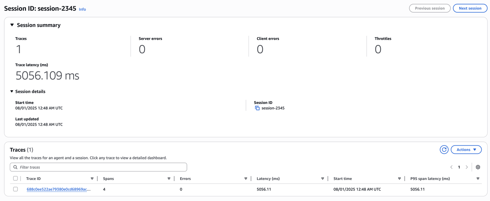

# Lab 5: Deeper look at GenAI Observability for Your Customer Support Agent

## Overview

In this lab, you will understand how AgentCore Observability works and how to set it up without using AgentCore Runtime.

## What You'll Add

🧠 **AgentCore Observability Features**:
- **Set up** Amazon OpenTelemetry Python Instrumentation  
- **Visualize and analyze** agent traces in Amazon CloudWatch GenAI Observability

## Tutorial Details

| Information | Details                                                          |
|-------------|------------------------------------------------------------------|
| **Tutorial type** | Incremental Enhancement                                          |
| **Agent type** | Single Agent                                                     |
| **Agentic Framework** | Strands Agents                                                   |
| **LLM model** | Amazon Nova 2 Lite                                               |
| **Tutorial vertical** | Customer Support                                                 |
| **Complexity** | Easy to Moderate                                                 |
| **SDK used** | Strands SDK, AgentCore Observability, Cloudwatch, Bedrock, boto3 |

## Prerequisites

- ✅ **Must complete Lab 1 first** - This lab builds directly on your Lab 1 agent 
- ✅ **Enable transaction search on Amazon CloudWatch** - First-time users must enable CloudWatch Transaction Search to view Bedrock AgentCore spans and traces. To enable transaction search, please refer to the our [documentation](https://docs.aws.amazon.com/AmazonCloudWatch/latest/monitoring/Enable-TransactionSearch.html).

## Learning Objectives

By the end of this lab, you will:
- Use the official Amazon CloudWatch GenAI Observability Dashboard


---

## 🚀 Let's Add Observability to your agent

Initialize clients

```python
import boto3
from botocore.exceptions import ClientError

session = boto3.Session()
region = session.region_name

logs_client = boto3.client("logs", region_name=region)
bedrock_client = boto3.client("bedrock", region_name=region)
sts_client = boto3.client("sts", region_name=region)

account_id = sts_client.get_caller_identity()["Account"]
```

Make sure to have `aws-opentelemetry-distro` installed

```python
%pip install strands-agents boto3 aws-opentelemetry-distro -q
```

# Step 2: Configure Environment for Observability

To enable observability for your Strands agent and send telemetry data to Amazon CloudWatch, you'll need to configure the following environment variables. We'll create a `.env` file to manage these settings securely, keeping sensitive AWS credentials separate from your code while making it easy to switch between different environments.

Required Environment Variables:

| Variable | Value | Purpose |
|----------|-------|---------|
| `OTEL_PYTHON_DISTRO` | `aws_distro` | Use AWS Distro for OpenTelemetry (ADOT) |
| `OTEL_PYTHON_CONFIGURATOR` | `aws_configurator` | Set AWS configurator for ADOT SDK |
| `OTEL_EXPORTER_OTLP_PROTOCOL` | `http/protobuf` | Configure export protocol |
| `OTEL_TRACES_EXPORTER` | `otlp` | Configure trace exporter |
| `OTEL_EXPORTER_OTLP_LOGS_HEADERS` | `x-aws-log-group=<YOUR-LOG-GROUP>,x-aws-log-stream=<YOUR-LOG-STREAM>,x-aws-metric-namespace=<YOUR-NAMESPACE>` | Direct logs to CloudWatch groups |
| `OTEL_RESOURCE_ATTRIBUTES` | `service.name=<YOUR-AGENT-NAME>` | Identify your agent in observability data |
| `AGENT_OBSERVABILITY_ENABLED` | `true` | Activate ADOT pipeline |

Also, ensure you set `AWS_REGION`, `AWS_DEFAULT_REGION` and `AWS_ACCOUNT_ID` environment variables as these will be picked up by the opentelemetry instrument script.

```python
log_group_name = "agents/customer-support-assistant-logs"  # Your log group name
log_stream_name = "default"  # Your log stream name

# Create log group
try:
    logs_client.create_log_group(logGroupName=log_group_name)
    print(f"✅ Log group '{log_group_name}' created successfully")
except ClientError as e:
    if e.response["Error"]["Code"] == "ResourceAlreadyExistsException":
        print(f"ℹ️  Log group '{log_group_name}' already exists")
    else:
        print(f"❌ Error creating log group: {e}")

# Create log stream
try:
    logs_client.create_log_stream(logGroupName=log_group_name, logStreamName=log_stream_name)
    print(f"✅ Log stream '{log_stream_name}' created successfully")
except ClientError as e:
    if e.response["Error"]["Code"] == "ResourceAlreadyExistsException":
        print(f"ℹ️  Log stream '{log_stream_name}' already exists")
    else:
        print(f"❌ Error creating log stream: {e}")
```

```python
# Create .env file
service_name = "customer-support-assistant-strands"

with open(".env", "w") as f:
    # AWS Configuration
    f.write(f"AWS_REGION={region}\n")
    f.write(f"AWS_DEFAULT_REGION={region}\n")
    f.write(f"AWS_ACCOUNT_ID={account_id}\n")

    # OpenTelemetry Configuration for AWS CloudWatch GenAI Observability
    f.write("OTEL_PYTHON_DISTRO=aws_distro\n")
    f.write("OTEL_PYTHON_CONFIGURATOR=aws_configurator\n")
    f.write("OTEL_EXPORTER_OTLP_PROTOCOL=http/protobuf\n")
    f.write("OTEL_TRACES_EXPORTER=otlp\n")
    f.write(
        f"OTEL_EXPORTER_OTLP_LOGS_HEADERS=x-aws-log-group={log_group_name},x-aws-log-stream={log_stream_name},x-aws-metric-namespace=agents\n"
    )
    f.write(f"OTEL_RESOURCE_ATTRIBUTES=service.name={service_name}\n")
    f.write("AGENT_OBSERVABILITY_ENABLED=true\n")
```

```python
import os
from dotenv import load_dotenv

# Load environment variables from .env file
load_dotenv()

# Display the OTEL-related environment variables
otel_vars = [
    "OTEL_PYTHON_DISTRO",
    "OTEL_PYTHON_CONFIGURATOR",
    "OTEL_EXPORTER_OTLP_PROTOCOL",
    "OTEL_EXPORTER_OTLP_LOGS_HEADERS",
    "OTEL_RESOURCE_ATTRIBUTES",
    "AGENT_OBSERVABILITY_ENABLED",
    "OTEL_TRACES_EXPORTER",
]

print("OpenTelemetry Configuration:\n")
for var in otel_vars:
    value = os.getenv(var)
    if value:
        print(f"{var}={value}")
```

# Step 3: Define Strands Agent

Now, let's redefine the same agent as before. 

To demonstrate that traces are created, we'll pass a simple greeting query to the agent.

We'll also ensure that the session id is registered.

```python
!cp lab_helpers/lab1_strands_agent.py customer_support_agent.py
```

```python
%%writefile -a customer_support_agent.py

import os
import argparse
from boto3.session import Session
from opentelemetry import baggage, context
from lab_helpers.utils import get_ssm_parameter

from strands import Agent
from strands.models import BedrockModel


def parse_arguments():
    parser = argparse.ArgumentParser(description="Customer Support Agent")
    parser.add_argument(
        "--session-id",
        type=str,
        required=True,
        help="Session ID to associate with this agent run",
    )
    return parser.parse_args()


def set_session_context(session_id):
    """Set the session ID in OpenTelemetry baggage for trace correlation"""
    ctx = baggage.set_baggage("session.id", session_id)
    token = context.attach(ctx)
    print(f"Session ID '{session_id}' attached to telemetry context")
    return token


def main():
    # Parse command line arguments
    args = parse_arguments()

    # Set session context for telemetry
    context_token = set_session_context(args.session_id)

    # Get region
    boto_session = Session()
    region = boto_session.region_name

    try:
        # Create the same basic agent from Lab 1
        MODEL = BedrockModel(
            model_id=MODEL_ID,
            temperature=0.3,
            region_name=region,
        )

        basic_agent = Agent(
            model=MODEL,
            tools=[
                get_product_info,
                get_return_policy,
            ],
            system_prompt=SYSTEM_PROMPT,
        )

        # Execute the travel research task
        query = """Greet the user and provide a financial advice."""

        result = basic_agent(query)
        print("Result:", result)

        print("✅ Agent executed successfully and trace was pushed to CloudWatch")
    finally:
        # Detach context when done
        context.detach(context_token)


if __name__ == "__main__":
    main()
```

# Step 4: AWS OpenTelemetry Python Distro

Now that your environment is configured and agent is created, let's understand how the observability happens. The [AWS OpenTelemetry Python Distro](https://pypi.org/project/aws-opentelemetry-distro/) automatically instruments your Strands agent to capture telemetry data without requiring code changes.

This distribution provides:
- **Auto-instrumentation** for your Strands Agent hosted outside of AgentCore Runtime (i.e. EC2, Lambda etc..)
- **AWS-optimized configuration** for seamless CloudWatch integration  

### Running Your Instrumented Agent

To capture traces from your Strands agent, use the `opentelemetry-instrument` command instead of running Python directly. This automatically applies instrumentation using the environment variables from your `.env` file:

```bash
opentelemetry-instrument python customer_support_assistant_agent.py
```

This command will:

- Load your OTEL configuration from the .env file
- Automatically instrument Strands, Amazon Bedrock calls, agent tool and databases, and other requests made by agent
- Send traces to CloudWatch
- Enable you to visualize the agent's decision-making process in the GenAI Observability dashboard

```python
!opentelemetry-instrument python customer_support_agent.py --session-id "session-1234"
```

# Step 5: Viewing on Gen AI Observability 

Now that we have configured Observability, let's check the traces in AWS CloudWatch's GenAI Observability dashboard. Navigate to Cloudwatch - GenAI Observability - Bedrock AgentCore.

#### Sessions View Page:


#### Traces View Page:


## Congratulations! 🎉

You have successfully **implemented AgentCore Observability with a Strands agent** (without AgentCore Runtime)!

### What You Accomplished:

- ✅ **Observability**: Configured our Strands agent to send telemetry data to Amazon CloudWatch
- ✅ **Session management**: Ensured traces are stored by session for easier debugging

## Next Steps

Ready to add more AgentCore capabilities? Continue with:

- **Lab 6**: Securely authenticate with external services using AgentCore Identity

## Resources

- [AgentCore Observability Documentation](https://docs.aws.amazon.com/bedrock-agentcore/latest/devguide/observability.html)
- [**Official AgentCore Observability Samples**](https://github.com/awslabs/amazon-bedrock-agentcore-samples/tree/main/06-workshops/06-AgentCore-observability) ⭐

---

**Excellent work! You can trace, debug, and monitor your customer support agent' performance in production environments! 🚀**
