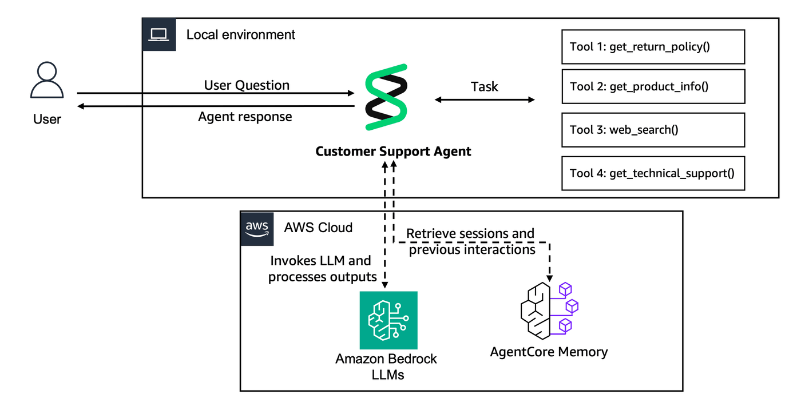

## Lab 2: Personalize our agent by adding memory

### Overview

In Lab 1, you built a Customer Support Agent that worked well for a single user in a local session. However, real-world customer support needs to scale beyond a single user running in a local environment.

When we run an **Agent in Production**, we'll need:
- **Multi-User Support**: Handle thousands of customers simultaneously
- **Persistent Storage**: Save conversations beyond session lifecycle
- **Long-Term Learning**: Extract customer preferences and behavioral patterns
- **Cross-Session Continuity**: Remember customers across different interactions

**Workshop Progress:**
- **Lab 1 (Done)**: Create Agent Prototype - Build a functional customer support agent
- **Lab 2 (Current)**: Enhance with Memory - Add conversation context and personalization
- **Lab 3**: Scale with Gateway & Identity - Share tools across agents securely
- **Lab 4**: Deploy to Production - Use AgentCore Runtime with observability
- **Lab 5**: Evaluate Agent Performance - Monitor quality with online evaluations
- **Lab 6**: Build User Interface - Create a customer-facing application

In this lab, you'll add the missing persistence and learning layer that transforms your Goldfish-Agent (forgets the conversation in seconds) into an smart personalized Assistant.

Memory is a critical component of intelligence. While Large Language Models (LLMs) have impressive capabilities, they lack persistent memory across conversations. [Amazon Bedrock AgentCore Memory](https://docs.aws.amazon.com/bedrock-agentcore/latest/devguide/memory-getting-started.html) addresses this limitation by providing a managed service that enables AI agents to maintain context over time, remember important facts, and deliver consistent, personalized experiences.

AgentCore Memory operates on two levels:
- **Short-Term Memory**: Immediate conversation context and session-based information that provides continuity within a single interaction or closely related sessions.
- **Long-Term Memory**: Persistent information extracted and stored across multiple conversations, including facts, preferences, and summaries that enable personalized experiences over time.

### Architecture for Lab 2
<div style="text-align:left">
    
</div>

*Multi-user agent with persistent short term and long term memory capabilities. *

### Prerequisites

* **AWS Account** with appropriate permissions
* **Python 3.10+** installed locally
* **AWS CLI configured** with credentials
* **Amazon Nova 2 Lite** enabled on [Amazon Bedrock](https://docs.aws.amazon.com/bedrock/latest/userguide/model-access.html)
* **Strands Agents** and other libraries installed in the next cells
* These resources are created for you within an AWS workshop account
    - AWS Lambda function 
    - AWS Lambda Execution IAM Role
    - AgentCore Gateway IAM Role
    - DynamoDB tables used by the AWS Lambda function. 
    - Cognito User Pool and User Pool Client

### Step 1: Import Libraries

Let's import the libraries for AgentCore Memory. For it, we will use the [Amazon Bedrock AgentCore Python SDK](https://github.com/aws/bedrock-agentcore-sdk-python), a lightweight wrapper that helps you working with AgentCore capabilities.

```python
import logging
from boto3.session import Session

from bedrock_agentcore_starter_toolkit.operations.memory.manager import MemoryManager
from bedrock_agentcore.memory import MemoryClient
from bedrock_agentcore.memory.constants import StrategyType

from lab_helpers.utils import put_ssm_parameter

boto_session = Session()
REGION = boto_session.region_name

logger = logging.getLogger(__name__)
```

### Step 2: Create Bedrock AgentCore Memory resources

Amazon Bedrock AgentCore Memory is a fully managed service that provides persistent memory capabilities for AI agents.

#### AgentCore Memory Concepts:

1. **Short-Term Memory (STM)**: Immediately stores conversation context within the session
2. **Long-Term Memory (LTM)**: Asynchronously processes STM to extract meaningful patterns, preferences and facts
3. **Memory Strategies**: Different approaches for extracting and organizing information:
   - **USER_PREFERENCE**: Learns customer preferences, behaviors, and patterns
   - **SEMANTIC**: Stores factual information using vector embeddings for similarity search
4. **Namespaces**: Logical grouping of memories by customer and context type. We'll create these two namespaces:
- `support/customer/{actorId}/preferences/`: Customer preferences and behavioral patterns
- `support/customer/{actorId}/semantic/`: Factual information and conversation history

This structure enables multi-tenant memory where each customer's information is isolated and easily retrievable.

#### Memory Creation Process:

Creating memory resources involves provisioning the underlying infrastructure (vector databases, processing pipelines, etc.). This typically takes 2-3 minutes as AWS sets up the managed services behind the scenes.

```python
memory_name = "CustomerSupportMemory"

memory_manager = MemoryManager(region_name=REGION)
memory = memory_manager.get_or_create_memory(
    name=memory_name,
    strategies=[
        {
            StrategyType.USER_PREFERENCE.value: {
                "name": "CustomerPreferences",
                "description": "Captures customer preferences and behavior",
                "namespaces": ["support/customer/{actorId}/preferences/"],
            }
        },
        {
            StrategyType.SEMANTIC.value: {
                "name": "CustomerSupportSemantic",
                "description": "Stores facts from conversations",
                "namespaces": ["support/customer/{actorId}/semantic/"],
            }
        },
    ],
)
memory_id = memory["id"]
put_ssm_parameter("/app/customersupport/agentcore/memory_id", memory_id)
```

```python
if memory_id:
    print("✅ AgentCore Memory created successfully!")
    print(f"Memory ID: {memory_id}")
else:
    print("Memory resource not created. Try Again !")
```

## Step 3: Seed previous customer interactions

**Why are we seeding memory?**

In production, agents accumulate memory naturally through customer interactions. However, for this lab, we're seeding historical conversations to demonstrate how Long-Term Memory (LTM) works without waiting for real conversations.

**How memory processing works:**
1. `create_event` stores interactions in **Short-Term Memory** (STM) instantly
2. STM is asynchronously processed by **Long-Term Memory** strategies
3. LTM extracts patterns, preferences, and facts for future retrieval

Let's seed some customer history to see this in action:

```python
from lab_helpers.lab2_memory import ACTOR_ID


# Seed with previous customer interactions
previous_interactions = [
    ("I'm having issues with my MacBook Pro overheating during video editing.", "USER"),
    (
        "I can help with that thermal issue. For video editing workloads, let's check your Activity Monitor and adjust performance settings. Your MacBook Pro order #MB-78432 is still under warranty.",
        "ASSISTANT",
    ),
    (
        "What's the return policy on gaming headphones? I need low latency for competitive FPS games",
        "USER",
    ),
    (
        "For gaming headphones, you have 30 days to return. Since you're into competitive FPS, I'd recommend checking the audio latency specs - most gaming models have <40ms latency.",
        "ASSISTANT",
    ),
    (
        "I need a laptop under $1200 for programming. Prefer 16GB RAM minimum and good Linux compatibility. I like ThinkPad models.",
        "USER",
    ),
    (
        "Perfect! For development work, I'd suggest looking at our ThinkPad E series or Dell XPS models. Both have excellent Linux support and 16GB RAM options within your budget.",
        "ASSISTANT",
    ),
]

# Save previous interactions
if memory_id:
    try:
        memory_client = MemoryClient(region_name=REGION)
        memory_client.create_event(
            memory_id=memory_id,
            actor_id=ACTOR_ID,
            session_id="previous_session",
            messages=previous_interactions,
        )
        print("✅ Seeded customer history successfully")
        print("📝 Interactions saved to Short-Term Memory")
        print("⏳ Long-Term Memory processing will begin automatically...")
    except Exception as e:
        print(f"⚠️ Error seeding history: {e}")
```

### Understanding Memory Processing

After creating events with `create_event`, AgentCore Memory processes the data in two stages:

1. **Immediate**: Messages stored in Short-Term Memory (STM)
2. **Asynchronous**: STM processed into Long-Term Memory (LTM) strategies

LTM processing typically takes 20-30 seconds as the system:
- Analyzes conversation patterns
- Extracts customer preferences and behaviors
- Creates semantic embeddings for factual information
- Organizes memories by namespace for efficient retrieval

Let's check if our Long-Term Memory processing is complete by retrieving customer preferences:

```python
import time

# Wait for Long-Term Memory processing to complete
print("🔍 Checking for processed Long-Term Memories...")
retries = 0
max_retries = 6  # 1 minute wait

while retries < max_retries:
    memories = memory_client.retrieve_memories(
        memory_id=memory_id,
        namespace=f"support/customer/{ACTOR_ID}/preferences/",
        query="can you summarize the support issue",
    )

    if memories:
        print(f"✅ Found {len(memories)} preference memories after {retries * 10} seconds!")
        break

    retries += 1
    if retries < max_retries:
        print(f"⏳ Still processing... waiting 10 more seconds (attempt {retries}/{max_retries})")
        time.sleep(10)
    else:
        print("⚠️ Memory processing is taking longer than expected. This can happen with overloading..")
        break

print("🎯 AgentCore Memory automatically extracted these customer preferences from our seeded conversations:")
print("=" * 80)

for i, memory in enumerate(memories, 1):
    if isinstance(memory, dict):
        content = memory.get("content", {})
        if isinstance(content, dict):
            text = content.get("text", "")
            print(f"  {i}. {text}")
```

### Exploring Semantic Memory

Semantic memory stores factual information from conversations using vector embeddings. This enables similarity-based retrieval of relevant facts and context.

```python
import time

# Retrieve semantic memories (factual information)
while True:
    semantic_memories = memory_client.retrieve_memories(
        memory_id=memory_id,
        namespace=f"support/customer/{ACTOR_ID}/semantic/",
        query="information on the technical support issue",
    )
    print("🧠 AgentCore Memory identified these factual details from conversations:")
    print("=" * 80)
    if semantic_memories:
        break
    time.sleep(10)
for i, memory in enumerate(semantic_memories, 1):
    if isinstance(memory, dict):
        content = memory.get("content", {})
        if isinstance(content, dict):
            text = content.get("text", "")
            print(f"  {i}. {text}")
```

## Step 4: Create a Customer Support Agent with memory

Next, we will implement the Customer Support Agent just as we did in Lab 1, but this time we will add AgentCoreMemoryConfig to the session manager of the Agent. It will let the agent to create new events and retrieve memories.

```python
import uuid

from strands import Agent
from strands.models import BedrockModel
from bedrock_agentcore.memory.integrations.strands.config import (
    AgentCoreMemoryConfig,
    RetrievalConfig,
)
from bedrock_agentcore.memory.integrations.strands.session_manager import (
    AgentCoreMemorySessionManager,
)

from lab_helpers.lab1_strands_agent import (
    SYSTEM_PROMPT,
    get_return_policy,
    web_search,
    get_product_info,
    get_technical_support,
    MODEL_ID,
)

session_id = uuid.uuid4()

memory_config = AgentCoreMemoryConfig(
    memory_id=memory_id,
    session_id=str(session_id),
    actor_id=ACTOR_ID,
    retrieval_config={
        "support/customer/{actorId}/semantic/": RetrievalConfig(top_k=3, relevance_score=0.2),
        "support/customer/{actorId}/preferences/": RetrievalConfig(top_k=3, relevance_score=0.2),
    },
)

# Initialize the Bedrock model (Amazon Nova 2 Lite)
model = BedrockModel(model_id=MODEL_ID, region_name=REGION)

# Create the customer support agent with all 5 tools
agent = Agent(
    model=model,
    session_manager=AgentCoreMemorySessionManager(memory_config, REGION),
    tools=[
        get_product_info,  # Tool 1: Simple product information lookup
        get_return_policy,  # Tool 2: Simple return policy lookup
        web_search,
        get_technical_support,
    ],
    system_prompt=SYSTEM_PROMPT,
)
```

## Step 5: Test Personalized Agent

Let's test our memory-enhanced agent! Watch how it uses the customer's historical preferences to provide personalized recommendations.

The agent will automatically:
1. Retrieve relevant customer context from memory
2. Use that context to personalize the response
3. Save this new interaction for future use

```python
print("🎧 Testing headphone recommendation with customer memory...\n\n")
response1 = agent("Which headphones would you recommend?")
```

```python
print("\n💻 Testing laptop preference recall...\n\n")
response2 = agent("What is my preferred laptop brand and requirements?")
```

Notice how the Agent remembers:

- Your gaming preferences (low latency headphones)
- Your laptop preferences (ThinkPad, 16GB RAM, Linux compatibility)
- Your budget constraints ($1200 for laptops)
- Previous technical issues (MacBook overheating) 

This is the power of AgentCore Memory - persistent, personalized customer experiences!

## Congratulations! 🎉

You have successfully completed **Lab 2: Add memory to the Customer Support Agent**!

### What You Accomplished:

- Created a serverless managed memory with Amazon Bedrock AgentCore Memory
- Implemented long-term memory to store User-Preferences and Semantic (Factual) information.
- Integrated AgentCore Memory with the customer support Agent using the sesssion management mechanism provided by Strands Agents

##### Next Up [Lab 3 - Scaling with Gateway and Identity  →](lab-03-agentcore-gateway.ipynb)

## Resources
- [Amazon Bedrock Agent Core Memory](https://docs.aws.amazon.com/bedrock-agentcore/latest/devguide/memory.html)
- [Amazon Bedrock AgentCore Memory Deep Dive blog](https://aws.amazon.com/blogs/machine-learning/amazon-bedrock-agentcore-memory-building-context-aware-agents/)
- [Strands Agent SDK - AgentCore Memory examples](https://docs.aws.amazon.com/bedrock-agentcore/latest/devguide/strands-sdk-memory.html)
