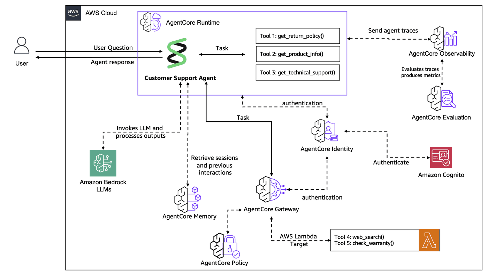
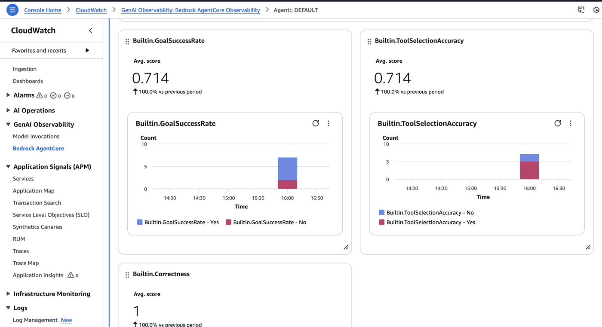

## Lab 5: AgentCore Evaluations - Online Evaluation for Customer Support Agent

### Overview

This lab demonstrates how to use AgentCore Evaluations to continuously monitor your production customer support agent from Lab 4. You'll configure online evaluation to automatically assess agent performance in real-time as customers interact with it.

**Workshop Journey:**

- **Lab 1 (Done):** Create Agent Prototype - Built a functional customer support agent
- **Lab 2 (Done):** Enhance with Memory - Added conversation context and personalization
- **Lab 3 (Done):** Scale with Gateway & Identity - Shared tools across agents securely
- **Lab 4 (Done):** Deploy to Production - Used AgentCore Runtime with observability
- **Lab 5 (Current):** Evaluate Agent Performance - Monitor quality with online evaluations
- **Lab 6:** Build User Interface - Create a customer-facing application

### What You'll Learn

You'll configure online evaluation with built-in evaluators, generate test interactions, and analyze quality metrics through AgentCore Observability dashboards to improve agent performance.

### Online Evaluation Overview

Online evaluation continuously monitors deployed agents in production, unlike on-demand evaluation which analyzes specific selected interactions. It consists of three components: session sampling with configurable rules, multiple evaluation methods (built-in or custom evaluators), and monitoring through dashboards with quality trends and low-scoring session investigation.

Since your agent runs on AgentCore Runtime, AgentCore Observability automatically instruments the code and provides comprehensive logs and traces using [OTEL](https://opentelemetry.io/) instrumentation.

### Prerequisites

Complete Lab 4 to have the customer support agent deployed. You'll need AWS account access to Amazon Bedrock AgentCore with Evaluations permissions.

### Architecture
<div style="text-align:left">
    
</div>

*Online evaluation automatically monitors agent interactions, applies evaluators based on sampling rules, and outputs results to CloudWatch for analysis.*

### Step 1: Import Required Libraries and Initialize Clients

```python
from bedrock_agentcore_starter_toolkit import Evaluation, Runtime
import json
import uuid
from pathlib import Path
from boto3.session import Session
from IPython.display import Markdown, display
from lab_helpers.utils import get_ssm_parameter, get_or_create_cognito_pool
```

```python
boto_session = Session()
region = boto_session.region_name
print(f"Region: {region}")
```

```python
eval_client = Evaluation(region=region)
runtime_client = Runtime()
```

### Step 2: Retrieve Agent Information from Lab 4

Retrieve the customer support agent ARN from SSM Parameter Store where it was saved during Lab 4 deployment.

```python
try:
    # Get agent ARN from SSM parameter store (saved in Lab 4)
    agent_arn = get_ssm_parameter("/app/customersupport/agentcore/runtime_arn")

    # Extract agent ID from ARN
    agent_id = agent_arn.split(":")[-1].split("/")[-1]

    # Set runtime client config path
    runtime_client._config_path = Path.cwd() / ".bedrock_agentcore.yaml"

    print("Agent ID:", agent_id)
    print("Agent ARN:", agent_arn)
except Exception as e:
    raise Exception(
        f"""Missing agent information from Lab 4. Please run lab-04-agentcore-runtime.ipynb first. Error: {str(e)}"""
    )
```

### Step 3: Create Online Evaluation Configuration

Now let's create an online evaluation configuration for our customer support agent. We'll use built-in evaluators to assess different aspects of agent performance:

- **Builtin.GoalSuccessRate** - Measures how well the agent achieves user goals
- **Builtin.Correctness** - Evaluates factual accuracy of responses
- **Builtin.ToolSelectionAccuracy** - Evaluates appropriate tool selection

We'll set the sampling rate to 100% for demonstration purposes, but in production you might use a lower rate (e.g., 10-20%) based on your traffic volume.

```python
response = eval_client.create_online_config(
    agent_id=agent_id,
    config_name="customer_support_agent_eval",
    sampling_rate=100,  # Evaluate 100% of sessions for demo
    evaluator_list=[
        "Builtin.GoalSuccessRate",
        "Builtin.Correctness",
        "Builtin.ToolSelectionAccuracy",
    ],
    config_description="Customer support agent online evaluation",
    auto_create_execution_role=True,
)

print("Online evaluation configuration created successfully!")
print(f"Configuration ID: {response['onlineEvaluationConfigId']}")
```

### Step 4: Verify Configuration Status

Verify the evaluation configuration is properly created and enabled by retrieving its details.

```python
config_details = eval_client.get_online_config(config_id=response["onlineEvaluationConfigId"])
print("Configuration Details:")
print(json.dumps(config_details, indent=2, default=str))
```

### Step 5: Generate Test Interactions

Invoke the customer support agent with various queries to generate traces for evaluation. Different test scenarios will demonstrate how the evaluators assess agent performance.

```python
# Get authentication token
access_token = get_or_create_cognito_pool(refresh_token=True)
print(f"Access token obtained: {access_token['bearer_token'][:20]}...")


def invoke_agent_runtime(prompt, session_id=None):
    """Invoke the agent runtime using starter toolkit"""
    if not session_id:
        session_id = str(uuid.uuid4())

    response = runtime_client.invoke(
        payload={"prompt": prompt},
        session_id=session_id,
        bearer_token=access_token["bearer_token"],
    )

    return response, session_id
```

#### Test Scenario 1: Product Information Query

```python
session1 = str(uuid.uuid4())
response, _ = invoke_agent_runtime(
    "I need information about the Gaming Console Pro. What are its specifications and price?",
    session1,
)
print("Customer Query: Product information request")
display(Markdown(response["response"].replace("\\n", "\n")))
```

#### Test Scenario 2: Technical Support Request

```python
session2 = str(uuid.uuid4())
response, _ = invoke_agent_runtime("My laptop won't start up. Can you help me troubleshoot this issue?", session2)
print("Customer Query: Technical support request")
display(Markdown(response["response"].replace("\\n", "\n")))
```

#### Test Scenario 3: Return Policy Inquiry

```python
session3 = str(uuid.uuid4())
response, _ = invoke_agent_runtime(
    "I bought a smartphone last week but it's not working properly. What's your return policy?",
    session3,
)
print("Customer Query: Return policy inquiry")
display(Markdown(response["response"].replace("\\n", "\n")))
```

#### Test Scenario 4: Complex Multi-Tool Query

```python
session4 = str(uuid.uuid4())
response, _ = invoke_agent_runtime(
    "I need help with my Gaming Console Pro. First, can you tell me about its warranty? Then I need technical support for connection issues.",
    session4,
)
print("Customer Query: Complex multi-tool request")
display(Markdown(response["response"].replace("\\n", "\n")))
```

#### Test Scenario 5: General Capability Query

```python
session5 = str(uuid.uuid4())
response, _ = invoke_agent_runtime(
    "What kind of support can you provide? List all your available tools and capabilities.",
    session5,
)
print("Customer Query: Capability inquiry")
display(Markdown(response["response"].replace("\\n", "\n")))
```

### Step 6: Monitor Evaluation Results

Monitor evaluation results through the AgentCore Observability console. Results may take a few minutes to appear as the system processes traces and applies evaluators.

#### Accessing the Dashboard

1. Navigate to the [AgentCore Observability console](https://console.aws.amazon.com/cloudwatch/home#gen-ai-observability/agent-core/agents)
2. Find your customer support agent in the agents list
3. Click on the `DEFAULT` endpoint to view evaluation metrics
4. Look for the evaluation scores in the traces and sessions views

#### What You'll See

The dashboard will show:
- **Goal Success Rate**: How well the agent achieves customer objectives
- **Correctness**: Accuracy of information provided
- **Tool Selection Accuracy**: Appropriate tool choices for queries



*Evaluation metrics displayed in the AgentCore Observability dashboard*

### Step 7: Understanding Evaluation Metrics

**Goal Success Rate** measures whether the agent successfully addresses the customer's primary intent. High scores indicate effective problem-solving; low scores suggest unmet needs, incomplete responses, or misunderstood requests.

**Correctness** evaluates factual accuracy of responses. High scores indicate accurate and reliable information; low scores suggest incorrect facts, outdated information, or misleading guidance.

**Tool Selection Accuracy** evaluates whether the agent chooses appropriate tools for each task. High scores indicate proper tool selection; low scores suggest wrong tools, unnecessary calls, or missing tool usage.

### Step 8: Analyzing Results and Next Steps

**For Low Goal Success Rates:** Refine the agent's system prompt, improve tool descriptions and parameters, and add specific training examples.

**For Low Correctness Scores:** Update the knowledge base with current information, improve fact-checking mechanisms, and review tool responses.

**For Tool-Related Issues:** Refine tool parameter schemas, improve tool selection logic, and enhance tool documentation.

**Continuous Monitoring:** Set up CloudWatch alarms for evaluation metrics, create dashboards for trend analysis, and implement automated alerts for quality degradation.

### Step 9: Clean Up (Optional)

Disable the online evaluation configuration if needed by uncommenting the code below.

```python
# Uncomment the following lines if you want to disable the evaluation configuration
# eval_client.delete_online_config(config_id=response['onlineEvaluationConfigId'])
# print("Online evaluation configuration disabled")
```

### Congratulations! 🎉

You have successfully completed **Lab 5: AgentCore Evaluations - Online Evaluation!**

### What You Accomplished

You configured automatic continuous online evaluation for your customer support agent with built-in evaluators assessing Goal Success Rate (customer satisfaction and problem resolution), Correctness (factual accuracy), and Tool Selection Accuracy (proper tool usage). Evaluation results are integrated with AgentCore Observability dashboards for real-time insights.

**Key Benefits:** Proactive quality assurance catches issues before customer impact, data-driven optimization guides improvements, production confidence through performance monitoring at scale, and continuous learning identifies patterns and opportunities.

**Next Steps:** Monitor your evaluation dashboard regularly, set up CloudWatch alarms for quality thresholds, use insights to iteratively improve your agent, and consider adding custom evaluators for domain-specific metrics.

### Next Up: [Lab 6: Build User Interface →](lab-06-frontend.ipynb)

Complete the customer experience by building a user-friendly web interface for customers to interact with your quality-monitored agent.

Your customer support agent is now production-ready with comprehensive quality monitoring! 🚀
