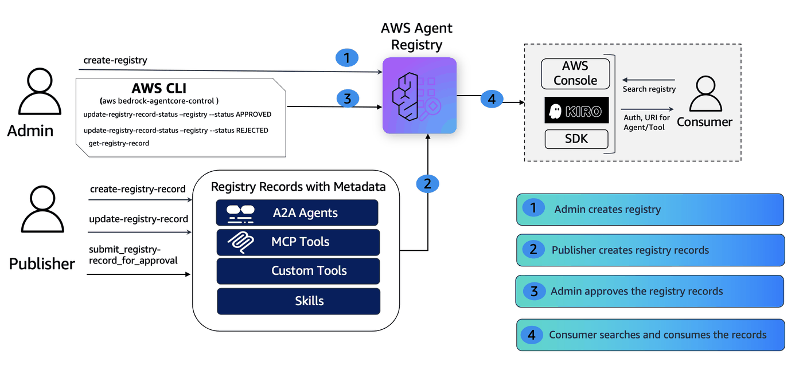

# Zero to Registry in 10 Minutes — Admin Setup & IAM Governance Guide

> **⚠️ CAUTION:** The examples provided in this repository are for experimental and educational purposes only. They demonstrate concepts and techniques but are not intended for direct use in production environments.

## Overview

When organizations adopt AI agents at scale — MCP tool servers, A2A agents, and custom skills across dozens of teams — they need a centralized, governed registry to prevent unvetted agents from reaching production and to make approved agents discoverable.

AWS Agent Registry provides a governance-first approach where every record must pass through an approval workflow (`DRAFT → PENDING_APPROVAL → APPROVED / REJECTED`) before it becomes searchable. This tutorial walks an IT/DevOps Admin through standing up the registry from scratch, configuring IAM policies for three personas (Admin, Publisher, Consumer), registering all three record types, proving governance guardrails work, and verifying semantic search — all in under 10 minutes.



### How It Works

1. **Admin creates a Registry** with `autoApproval: false` — nothing goes live without review.
2. **IAM policies** scope each persona to their allowed operations — Publishers cannot self-approve, Consumers are read-only.
3. **Publisher registers records** (MCP, A2A, CUSTOM) — all start in `DRAFT` status.
4. **Publisher submits for approval** — records move to `PENDING_APPROVAL`.
5. **Governance tests prove boundaries** — Publisher self-approval is denied, Consumer write access is denied.
6. **Admin approves records** — records become `APPROVED` and discoverable via semantic search.
7. **Consumer searches** — natural language queries return approved, vetted agents.

### Personas

| Persona       | Can Do                                                        | Cannot Do                                |
|:--------------|:--------------------------------------------------------------|:-----------------------------------------|
| Admin         | Create/delete registries, approve/reject/deprecate records    | —                                        |
| Publisher     | Create records, submit for approval, update DRAFT records     | Approve/reject records, create/delete registries |
| Consumer      | List, get, search records                                     | Create, modify, or approve anything      |

### Supported Record Types

| Type     | Description                                      | Descriptors              |
|:---------|:-------------------------------------------------|:-------------------------|
| MCP      | Model Context Protocol servers (tools)           | `server` + `tools`       |
| A2A      | Agent-to-Agent protocol agents                   | `agentCard`              |
| CUSTOM   | Skills, custom API resources, anything else      | `custom`                 |

## Tutorial Details

| Information              | Details                                                                |
|:-------------------------|:-----------------------------------------------------------------------|
| Tutorial type            | Interactive                                                            |
| AgentCore components     | AWS Agent Registry                                                     |
| Record types             | MCP, A2A, CUSTOM                                                       |
| Approval mode            | Manual (`autoApproval: false`)                                         |
| Tutorial components      | AWS Agent Registry, AWS IAM                                            |
| Tutorial vertical        | Cross-vertical (applicable to any enterprise agent governance workflow) |
| Example complexity       | Beginner                                                               |
| SDK used                 | boto3                                                                  |

## Tutorial Key Features

* Governance-first Agent registry with manual approval workflow (`DRAFT → PENDING_APPROVAL → APPROVED / REJECTED`).
* IAM policy configuration for three personas: Admin, Publisher, Consumer.
* Per-persona guardrail tests proving separation of duties (Publisher cannot self-approve, Consumer cannot write).
* All three record types registered in one pass: MCP server, A2A agent (inline agent card), CUSTOM skill.
* Semantic search verification via the data plane after approval.
* Production-readiness checklist and troubleshooting FAQ.
* Full cleanup of all created resources (records, registry, IAM users).

## Prerequisites

- IAM credentials with appropriate permissions (see `IAM_PERMISSIONS.md`). This tutorial requires admin-level permissions to create registries, IAM users, and inline policies.

  | Service | Permissions |
  |:--------|:------------|
  | **AWS Agent Registry** | `CreateRegistry`, `DeleteRegistry`, `GetRegistry`, `ListRegistries`, `CreateRegistryRecord`, `DeleteRegistryRecord`, `GetRegistryRecord`, `ListRegistryRecords`, `UpdateRegistryRecord`, `SubmitRegistryRecordForApproval`, `UpdateRegistryRecordStatus`, `SearchRegistryRecords` |
  | **AWS IAM** | `CreateUser`, `DeleteUser`, `PutUserPolicy`, `DeleteUserPolicy`, `CreateAccessKey`, `DeleteAccessKey`, `ListAccessKeys` |
  | **AWS STS** | `GetCallerIdentity` |

- Python 3.8+ with `boto3 >= 1.42.87` installed
- AWS CLI configured with a default region (`us-west-2`)

## AWS Resources Created

| Resource                        | Type                              | Purpose                                          |
|:--------------------------------|:----------------------------------|:-------------------------------------------------|
| Agent Registry                  | `bedrock-agentcore:registry`      | Central registry with manual approval workflow   |
| MCP Server Record               | `bedrock-agentcore:record`        | Code review MCP tool server (DRAFT → APPROVED)   |
| A2A Agent Record                | `bedrock-agentcore:record`        | Compliance agent with inline card (DRAFT → APPROVED) |
| CUSTOM Skill Record             | `bedrock-agentcore:record`        | Data pipeline skill (DRAFT → APPROVED)            |
| IAM User (Admin)                | `AWS::IAM::User`                  | Full registry access + approval authority         |
| IAM User (Publisher)            | `AWS::IAM::User`                  | Create/submit records, no approval authority      |
| IAM User (Consumer)             | `AWS::IAM::User`                  | Read-only access + semantic search                |

---
## Setup Clients

```python
%pip install "boto3>=1.42.87" --quiet
```

```python
import os
import boto3
import json
import time
from botocore.exceptions import ClientError

# Configuration - update these for your environment
AWS_REGION = "us-west-2"

# Set AWS credentials if not using Amazon SageMaker notebook
os.environ["AWS_PROFILE"] = "default"  # Comment this line on SageMaker

# Create boto3 session
session = boto3.Session(region_name=AWS_REGION)
ACCOUNT_ID = session.client("sts").get_caller_identity()["Account"]

# Control plane client (admin operations)
cp_client = session.client("bedrock-agentcore-control")
# Data plane client (search operations)
dp_client = session.client("bedrock-agentcore")
iam_client = session.client("iam")


def pp(response):
    """Pretty-print API response, stripping ResponseMetadata."""
    data = {k: v for k, v in response.items() if k != "ResponseMetadata"}
    print(json.dumps(data, indent=2, default=str))


print(f"Session ready | Region: {AWS_REGION} | Account: {ACCOUNT_ID}")
```

### Helpers

```python
# ANSI colors for terminal output
class C:
    GREEN = "\033[92m"
    RED = "\033[91m"
    YELLOW = "\033[93m"
    CYAN = "\033[96m"
    BOLD = "\033[1m"
    DIM = "\033[2m"
    RESET = "\033[0m"


def wait_for_registry_ready(client, registry_id, timeout=120):
    """Poll until registry reaches READY status."""
    start = time.time()
    while time.time() - start < timeout:
        r = client.get_registry(registryId=registry_id)
        if r["status"] == "READY":
            elapsed = int(time.time() - start)
            print(f"  {C.GREEN}✅ Registry READY{C.RESET} {C.DIM}({elapsed}s){C.RESET}")
            return r
        print(f"  {C.YELLOW}⏳ Status: {r['status']}...{C.RESET}")
        time.sleep(3)
    raise TimeoutError(f"Registry not READY after {timeout}s")


def test_action(desc, fn):
    """Run fn(), print ALLOWED on success or DENIED on AccessDenied."""
    try:
        result = fn()
        print(f"  {C.GREEN}✅ ALLOWED:{C.RESET} {desc}")
        return result
    except ClientError as e:
        code = e.response["Error"]["Code"]
        print(f"  {C.RED}🚫 DENIED:{C.RESET}  {desc} {C.DIM}({code}){C.RESET}")
        return None


# Track all record IDs and names for cleanup and display
RECORD_IDS = {}
RECORD_NAMES = {}


def mask_account(acct):
    """Mask account ID for display: 1234****5678"""
    if len(acct) >= 8:
        return acct[:4] + "****" + acct[-4:]
    return "****"


print(
    f"{C.GREEN}✅ Session ready{C.RESET} | Region: {C.CYAN}{AWS_REGION}{C.RESET} | Account: {C.CYAN}{mask_account(ACCOUNT_ID)}{C.RESET}"
)
```

---
## Step 1 — Create a Registry (Governance-First)

The first thing an Admin does is create a **Registry** with `autoApproval: false`.
This ensures every record must go through the approval workflow before it becomes discoverable.

> **Important**: After `CreateRegistry`, the registry enters `CREATING` state.
> You must wait for `READY` before creating records (typically 25-30s).

```python
create_resp = cp_client.create_registry(
    name="enterprise_agent_registry",
    description="Enterprise registry for MCP servers, A2A agents, and custom resources. Manual approval required.",
    approvalConfiguration={"autoApproval": False},
)

REGISTRY_ARN = create_resp["registryArn"]
REGISTRY_ID = REGISTRY_ARN.split("/")[-1]

print(f"{C.GREEN}✅ Registry created!{C.RESET}")
print(f"  {C.BOLD}Name:{C.RESET}          enterprise_agent_registry")
print(f"  {C.BOLD}ID:{C.RESET}            {C.CYAN}{REGISTRY_ID}{C.RESET}")
print(
    f"  {C.BOLD}Auto-Approval:{C.RESET}  {C.RED}{C.BOLD}False{C.RESET} {C.DIM}(all records require manual approval){C.RESET}"
)
print(f"\n{C.YELLOW}⏳ Waiting for READY status...{C.RESET}")

wait_for_registry_ready(cp_client, REGISTRY_ID)
```

### Verify: GetRegistry and ListRegistries

```python
registry = cp_client.get_registry(registryId=REGISTRY_ID)

print(f"{C.BOLD}=== Registry Details ==={C.RESET}\n")
print(f"  {C.BOLD}Name:{C.RESET}           {registry['name']}")
print(f"  {C.BOLD}Status:{C.RESET}         {C.GREEN}{registry['status']}{C.RESET}")
auto_val = registry.get("approvalConfiguration", {}).get("autoApproval", "N/A")
auto_color = C.RED if not auto_val else C.GREEN
print(f"  {C.BOLD}Auto-Approval:{C.RESET}  {auto_color}{C.BOLD}{auto_val}{C.RESET}")
print(f"  {C.BOLD}Created:{C.RESET}        {registry.get('createdAt', 'N/A')}")

print(f"\n{C.BOLD}=== All Registries ==={C.RESET}\n")
for reg in cp_client.list_registries()["registries"]:
    status_color = C.GREEN if reg["status"] == "READY" else C.YELLOW
    auto = reg.get("approvalConfiguration", {}).get("autoApproval", "N/A")
    print(f"  {status_color}[{reg['status']}]{C.RESET} {reg['name']} {C.DIM}(autoApproval={auto}){C.RESET}")
```

---
## Step 2 — IAM Policies for Each Persona

Each persona gets a scoped IAM policy. The key rule is simple:

> **Only Admins can approve or reject records.** Publishers can create and submit, but never approve their own work.

Here's what each persona can call:

| API Action | Admin | Publisher | Consumer |
|------------|:-----:|:---------:|:--------:|
| `CreateRegistry` / `DeleteRegistry` | ✅ | — | — |
| `CreateRegistryRecord` | ✅ | ✅ | — |
| `UpdateRegistryRecord` (DRAFT only) | ✅ | ✅ | — |
| `SubmitRegistryRecordForApproval` | ✅ | ✅ | — |
| `UpdateRegistryRecordStatus` (approve/reject) | ✅ | — | — |
| `GetRegistryRecord` / `ListRegistryRecords` | ✅ | ✅ | ✅ |
| `SearchRegistryRecords` | ✅ | — | ✅ |

We'll verify these boundaries in Step 5 (Governance Tests).

### 2.1 Admin Policy — full access + approval authority

```python
ADMIN_POLICY = {
    "Version": "2012-10-17",
    "Statement": [
        {
            "Sid": "AllowCreatingAndListingRegistries",
            "Effect": "Allow",
            "Action": [
                "bedrock-agentcore:CreateRegistry",
                "bedrock-agentcore:ListRegistries",
            ],
            "Resource": [f"arn:aws:bedrock-agentcore:{AWS_REGION}:{ACCOUNT_ID}:*"],
        },
        {
            "Sid": "AllowGetUpdateDeleteRegistry",
            "Effect": "Allow",
            "Action": [
                "bedrock-agentcore:GetRegistry",
                "bedrock-agentcore:UpdateRegistry",
                "bedrock-agentcore:DeleteRegistry",
            ],
            "Resource": [f"arn:aws:bedrock-agentcore:{AWS_REGION}:{ACCOUNT_ID}:registry/*"],
        },
        {
            "Sid": "AllowCreatingAndListingRegistryRecords",
            "Effect": "Allow",
            "Action": [
                "bedrock-agentcore:CreateRegistryRecord",
                "bedrock-agentcore:ListRegistryRecords",
            ],
            "Resource": [f"arn:aws:bedrock-agentcore:{AWS_REGION}:{ACCOUNT_ID}:registry/*"],
        },
        {
            "Sid": "AllowRecordLevelOperations",
            "Effect": "Allow",
            "Action": [
                "bedrock-agentcore:GetRegistryRecord",
                "bedrock-agentcore:UpdateRegistryRecord",
                "bedrock-agentcore:DeleteRegistryRecord",
                "bedrock-agentcore:SubmitRegistryRecordForApproval",
            ],
            "Resource": [f"arn:aws:bedrock-agentcore:{AWS_REGION}:{ACCOUNT_ID}:registry/*/record/*"],
        },
        {
            "Sid": "AllowApproveRejectDeprecateRecords",
            "Effect": "Allow",
            "Action": ["bedrock-agentcore:UpdateRegistryRecordStatus"],
            "Resource": [f"arn:aws:bedrock-agentcore:{AWS_REGION}:{ACCOUNT_ID}:registry/*/record/*"],
        },
    ],
}
print(f"{C.GREEN}✅ Admin policy defined{C.RESET} — includes {C.BOLD}ApprovalAuthority{C.RESET} (approve/reject).")
```

### 2.2 Publisher Policy — create & submit, but cannot approve

```python
PUBLISHER_POLICY = {
    "Version": "2012-10-17",
    "Statement": [
        {
            "Sid": "AllowListingAllRegistries",
            "Effect": "Allow",
            "Action": ["bedrock-agentcore:ListRegistries"],
            "Resource": [f"arn:aws:bedrock-agentcore:{AWS_REGION}:{ACCOUNT_ID}:*"],
        },
        {
            "Sid": "AllowGetRegistry",
            "Effect": "Allow",
            "Action": ["bedrock-agentcore:GetRegistry"],
            "Resource": [f"arn:aws:bedrock-agentcore:{AWS_REGION}:{ACCOUNT_ID}:registry/*"],
        },
        {
            "Sid": "AllowCreatingAndListingRegistryRecords",
            "Effect": "Allow",
            "Action": [
                "bedrock-agentcore:CreateRegistryRecord",
                "bedrock-agentcore:ListRegistryRecords",
            ],
            "Resource": [f"arn:aws:bedrock-agentcore:{AWS_REGION}:{ACCOUNT_ID}:registry/*"],
        },
        {
            "Sid": "AllowRecordLevelOperations",
            "Effect": "Allow",
            "Action": [
                "bedrock-agentcore:GetRegistryRecord",
                "bedrock-agentcore:UpdateRegistryRecord",
                "bedrock-agentcore:DeleteRegistryRecord",
                "bedrock-agentcore:SubmitRegistryRecordForApproval",
            ],
            "Resource": [f"arn:aws:bedrock-agentcore:{AWS_REGION}:{ACCOUNT_ID}:registry/*/record/*"],
        },
    ],
}
print(f"{C.GREEN}✅ Publisher policy defined{C.RESET} — {C.RED}NO ApprovalAuthority{C.RESET} (cannot self-approve).")
```

### 2.3 Consumer Policy — read-only

```python
CONSUMER_POLICY = {
    "Version": "2012-10-17",
    "Statement": [
        {
            "Sid": "AllowListingAllRegistries",
            "Effect": "Allow",
            "Action": ["bedrock-agentcore:ListRegistries"],
            "Resource": [f"arn:aws:bedrock-agentcore:{AWS_REGION}:{ACCOUNT_ID}:*"],
        },
        {
            "Sid": "AllowGetRegistry",
            "Effect": "Allow",
            "Action": ["bedrock-agentcore:GetRegistry"],
            "Resource": [f"arn:aws:bedrock-agentcore:{AWS_REGION}:{ACCOUNT_ID}:registry/*"],
        },
        {
            "Sid": "AllowSearchingForApprovedRecords",
            "Effect": "Allow",
            "Action": ["bedrock-agentcore:SearchRegistryRecords"],
            "Resource": [f"arn:aws:bedrock-agentcore:{AWS_REGION}:{ACCOUNT_ID}:registry/*"],
        },
        {
            "Sid": "AllowListingAndGettingRecords",
            "Effect": "Allow",
            "Action": [
                "bedrock-agentcore:ListRegistryRecords",
                "bedrock-agentcore:GetRegistryRecord",
            ],
            "Resource": [f"arn:aws:bedrock-agentcore:{AWS_REGION}:{ACCOUNT_ID}:registry/*"],
        },
    ],
}
print(f"{C.GREEN}✅ Consumer policy defined{C.RESET} — {C.CYAN}read-only{C.RESET}, no write access.")
```

---
## Step 3 — Create IAM Users and Attach Policies

We create three IAM users (one per persona) and attach the corresponding inline policies.
Each user gets an access key so we can test API calls from their perspective.

> **Note**: IAM policy propagation takes ~10 seconds. We wait after attaching policies.

```python
USERS = {
    "registry-admin-demo": ADMIN_POLICY,
    "registry-publisher-demo": PUBLISHER_POLICY,
    "registry-consumer-demo": CONSUMER_POLICY,
}

PERSONA_LABELS = {
    "registry-admin-demo": "Admin",
    "registry-publisher-demo": "Publisher",
    "registry-consumer-demo": "Consumer",
}

user_credentials = {}

for user_name, policy in USERS.items():
    try:
        iam_client.create_user(UserName=user_name)
    except iam_client.exceptions.EntityAlreadyExistsException:
        pass

    policy_name = f"{user_name}-policy"
    iam_client.put_user_policy(UserName=user_name, PolicyName=policy_name, PolicyDocument=json.dumps(policy))

    try:
        keys = iam_client.create_access_key(UserName=user_name)
    except ClientError as e:
        if "LimitExceeded" in str(e):
            for k in iam_client.list_access_keys(UserName=user_name)["AccessKeyMetadata"]:
                iam_client.delete_access_key(UserName=user_name, AccessKeyId=k["AccessKeyId"])
            keys = iam_client.create_access_key(UserName=user_name)
        else:
            raise

    user_credentials[user_name] = {
        "access_key": keys["AccessKey"]["AccessKeyId"],
        "secret_key": keys["AccessKey"]["SecretAccessKey"],
    }

# Display as a table (no secrets shown)
print(f"{C.BOLD}=== IAM Users Created ==={C.RESET}\n")
print(f"  {C.BOLD}{'Persona':<12} {'IAM User':<28} {'Policy':<35}{C.RESET}")
print(f"  {'─' * 12} {'─' * 28} {'─' * 35}")
for user_name in USERS:
    persona = PERSONA_LABELS[user_name]
    policy_name = f"{user_name}-policy"
    print(f"  {C.CYAN}{persona:<12}{C.RESET} {user_name:<28} {policy_name:<35}")

print(f"\n{C.YELLOW}⏳ Waiting 10s for IAM policy propagation...{C.RESET}")
time.sleep(10)
print(f"{C.GREEN}✅ All 3 users ready.{C.RESET}")
```

```python
def get_client_for_user(user_name, service="bedrock-agentcore-control"):
    """
    Create a boto3 client authenticated as a specific IAM user.

    Args:
        user_name: IAM user name (e.g. "registry-publisher-demo")
        service:   boto3 service name (control plane or data plane)
    Returns:
        boto3 client authenticated as the specified user
    """
    creds = user_credentials[user_name]
    s = boto3.Session(
        aws_access_key_id=creds["access_key"],
        aws_secret_access_key=creds["secret_key"],
        region_name=AWS_REGION,
    )
    return s.client(service)


# Create per-persona clients (used throughout the rest of the notebook)
publisher_cp = get_client_for_user("registry-publisher-demo")
admin_cp = get_client_for_user("registry-admin-demo")
consumer_cp = get_client_for_user("registry-consumer-demo")
consumer_dp = get_client_for_user("registry-consumer-demo", service="bedrock-agentcore")

print(f"{C.GREEN}✅ Per-persona clients ready:{C.RESET}")
print(f"  {C.CYAN}publisher_cp{C.RESET}  → Publisher (control plane)")
print(f"  {C.CYAN}admin_cp{C.RESET}      → Admin (control plane)")
print(f"  {C.CYAN}consumer_cp{C.RESET}   → Consumer (control plane)")
print(f"  {C.CYAN}consumer_dp{C.RESET}   → Consumer (data plane / search)")
```

---
## Step 4 — Create All Records (MCP, A2A, CUSTOM)

The Publisher creates one record of each type. All start in `DRAFT` status.
We'll use these same records for governance testing in the next step — no duplicates.

### 4a. MCP Server Record

```python
mcp_rec = publisher_cp.create_registry_record(
    registryId=REGISTRY_ID,
    name="enterprise_code_review_mcp",
    descriptorType="MCP",
    descriptors={
        "mcp": {
            "server": {
                "inlineContent": json.dumps(
                    {
                        "name": "io.enterprise/code-review",
                        "description": "MCP server for automated code review with security scanning",
                        "version": "2.1.0",
                        "packages": [
                            {
                                "registryType": "npm",
                                "identifier": "@enterprise/code-review-mcp",
                                "version": "2.1.0",
                                "transport": {"type": "stdio"},
                            }
                        ],
                    }
                )
            },
            "tools": {
                "inlineContent": json.dumps(
                    {
                        "tools": [
                            {
                                "name": "review_code",
                                "description": "Analyze code for security issues",
                                "inputSchema": {
                                    "type": "object",
                                    "properties": {"code": {"type": "string"}},
                                },
                            }
                        ]
                    }
                )
            },
        }
    },
    recordVersion="2.1",
)
RECORD_IDS["mcp"] = mcp_rec["recordArn"].split("/")[-1]
RECORD_NAMES["mcp"] = "enterprise_code_review_mcp"

print(f"{C.GREEN}✅ MCP record created{C.RESET}")
print(f"  {C.BOLD}Name:{C.RESET}     enterprise_code_review_mcp")
print(f"  {C.BOLD}Type:{C.RESET}     MCP")
print(f"  {C.BOLD}ID:{C.RESET}       {C.CYAN}{RECORD_IDS['mcp']}{C.RESET}")
print(f"  {C.BOLD}Status:{C.RESET}   {C.YELLOW}DRAFT{C.RESET}")
```

### 4b. A2A Agent Record (Inline Agent Card)

A2A records use an inline agent card descriptor — no external URL synchronization needed.
The agent card JSON is provided directly in the `descriptors` field.

```python
a2a_rec = publisher_cp.create_registry_record(
    registryId=REGISTRY_ID,
    name="enterprise_compliance_agent",
    descriptorType="A2A",
    descriptors={
        "a2a": {
            "agentCard": {
                "schemaVersion": "0.3",
                "inlineContent": json.dumps(
                    {
                        "protocolVersion": "0.3",
                        "name": "enterprise-compliance-agent",
                        "description": "A2A agent for compliance policy validation and audit checks",
                        "version": "1.0.0",
                        "url": "https://compliance-agent.internal.example.com/a2a",
                        "capabilities": {"streaming": True},
                        "skills": [
                            {
                                "id": "validate_compliance",
                                "name": "Compliance Validation",
                                "description": "Validates resources against compliance policies",
                                "tags": ["compliance"],
                            },
                            {
                                "id": "audit_check",
                                "name": "Audit Check",
                                "description": "Runs audit checks on infrastructure and configurations",
                                "tags": ["audit"],
                            },
                        ],
                        "defaultInputModes": ["text/plain"],
                        "defaultOutputModes": ["text/plain"],
                    }
                ),
            }
        }
    },
    recordVersion="1.0",
)
RECORD_IDS["a2a"] = a2a_rec["recordArn"].split("/")[-1]
RECORD_NAMES["a2a"] = "enterprise_compliance_agent"

print(f"{C.GREEN}\u2705 A2A record created{C.RESET}")
print(f"  {C.BOLD}Name:{C.RESET}     enterprise_compliance_agent")
print(f"  {C.BOLD}Type:{C.RESET}     A2A")
print(f"  {C.BOLD}ID:{C.RESET}       {C.CYAN}{RECORD_IDS['a2a']}{C.RESET}")
print(f"  {C.BOLD}Status:{C.RESET}   {C.YELLOW}DRAFT{C.RESET}")
```

### 4c. CUSTOM Resource Record

```python
custom_rec = publisher_cp.create_registry_record(
    registryId=REGISTRY_ID,
    name="enterprise_data_pipeline_skill",
    descriptorType="CUSTOM",
    descriptors={
        "custom": {
            "inlineContent": json.dumps(
                {
                    "name": "data-pipeline-orchestrator",
                    "description": "Custom skill for orchestrating cross-account data pipelines",
                    "version": "3.0.0",
                    "endpoint": "https://pipelines.internal.example.com/api/v3",
                    "auth": {
                        "type": "IAM",
                        "roleArn": "arn:aws:iam::123456789012:role/pipeline-invoker",
                    },
                }
            )
        }
    },
    recordVersion="3.0",
)
RECORD_IDS["custom"] = custom_rec["recordArn"].split("/")[-1]
RECORD_NAMES["custom"] = "enterprise_data_pipeline_skill"

print(f"{C.GREEN}✅ CUSTOM record created{C.RESET}")
print(f"  {C.BOLD}Name:{C.RESET}     enterprise_data_pipeline_skill")
print(f"  {C.BOLD}Type:{C.RESET}     CUSTOM")
print(f"  {C.BOLD}ID:{C.RESET}       {C.CYAN}{RECORD_IDS['custom']}{C.RESET}")
print(f"  {C.BOLD}Status:{C.RESET}   {C.YELLOW}DRAFT{C.RESET}")

# Summary table
print(f"\n{C.BOLD}=== All Records Created ==={C.RESET}\n")
print(f"  {C.BOLD}{'Type':<10} {'Name':<35} {'Status':<20}{C.RESET}")
print(f"  {'─' * 10} {'─' * 35} {'─' * 20}")
for rtype, rid in RECORD_IDS.items():
    name = RECORD_NAMES[rtype]
    print(f"  {C.CYAN}{rtype.upper():<10}{C.RESET} {name:<35} {C.YELLOW}DRAFT{C.RESET}")

print(f"\n{C.YELLOW}⏳ Waiting 5s for records to settle...{C.RESET}")
time.sleep(5)
print(f"{C.GREEN}✅ Ready for governance tests.{C.RESET}")
```

---
## Step 5 — Governance Guardrail Tests

This is the most important section of the notebook. We prove that IAM boundaries work correctly
by testing each persona against operations they **should** and **should not** be able to perform.

We use the MCP record created above as the test subject for the approval workflow.

### What we're proving

| Test | Persona | Expected |
|------|---------|----------|
| 5a. Publisher submits record for approval | Publisher | ✅ Allowed |
| 5b. Publisher tries to self-approve | Publisher | 🚫 Denied |
| 5c. Consumer tries to create a record | Consumer | 🚫 Denied |
| 5d. Consumer tries to approve a record | Consumer | 🚫 Denied |
| 5e. Consumer can read records | Consumer | ✅ Allowed |
| 5f. Admin approves the record | Admin | ✅ Allowed |

### 5a. Publisher submits the MCP record for approval

`DRAFT → PENDING_APPROVAL` — this is the Publisher's job.

```python
mcp_record_id = RECORD_IDS["mcp"]
mcp_name = RECORD_NAMES["mcp"]

print(f"{C.BOLD}=== 5a. Publisher submits MCP record for approval ==={C.RESET}")
print(f"  Record: {C.CYAN}{mcp_name}{C.RESET}\n")
test_action(
    "SubmitRegistryRecordForApproval (DRAFT → PENDING_APPROVAL)",
    lambda: publisher_cp.submit_registry_record_for_approval(registryId=REGISTRY_ID, recordId=mcp_record_id),
)

rec = admin_cp.get_registry_record(registryId=REGISTRY_ID, recordId=mcp_record_id)
print(f"\n  {C.BOLD}Record:{C.RESET} {mcp_name}  →  {C.YELLOW}{rec['status']}{C.RESET}")
```

### 5b. Publisher tries to self-approve (SHOULD FAIL)

This is the critical governance test. The Publisher's IAM policy does **not** include
`UpdateRegistryRecordStatus`, so this call must be denied.

```python
print(f"{C.BOLD}=== 5b. Publisher tries to self-approve (SHOULD FAIL) ==={C.RESET}")
print(f"  Record: {C.CYAN}{mcp_name}{C.RESET}\n")
test_action(
    "UpdateRegistryRecordStatus → APPROVED (self-approval attempt)",
    lambda: publisher_cp.update_registry_record_status(
        registryId=REGISTRY_ID,
        recordId=mcp_record_id,
        status="APPROVED",
        statusReason="Self-approval attempt",
    ),
)

rec = admin_cp.get_registry_record(registryId=REGISTRY_ID, recordId=mcp_record_id)
print(f"\n  {C.BOLD}Record:{C.RESET} {mcp_name}  →  Status still: {C.YELLOW}{rec['status']}{C.RESET}")
assert rec["status"] == "PENDING_APPROVAL", "GOVERNANCE FAILURE: Publisher was able to self-approve!"
print(f"  {C.GREEN}✅ Governance guardrail PASSED — Publisher cannot self-approve.{C.RESET}")
```

### 5c. Consumer tries to create a record (SHOULD FAIL)

The Consumer is read-only. They cannot create, modify, or approve anything.

```python
print(f"{C.BOLD}=== 5c. Consumer tries to create a record (SHOULD FAIL) ==={C.RESET}\n")
test_action(
    "CreateRegistryRecord",
    lambda: consumer_cp.create_registry_record(
        registryId=REGISTRY_ID,
        name="shouldFail",
        descriptorType="MCP",
        descriptors={"mcp": {"server": {"inlineContent": "{}"}}},
        recordVersion="1.0",
    ),
)

print(f"\n{C.BOLD}=== 5d. Consumer tries to approve a record (SHOULD FAIL) ==={C.RESET}")
print(f"  Record: {C.CYAN}{mcp_name}{C.RESET}\n")
test_action(
    "UpdateRegistryRecordStatus → APPROVED",
    lambda: consumer_cp.update_registry_record_status(
        registryId=REGISTRY_ID,
        recordId=mcp_record_id,
        status="APPROVED",
        statusReason="Consumer approval attempt",
    ),
)
```

### 5e. Consumer can read records (SHOULD SUCCEED)

Verify the Consumer's read-only access works as expected.

```python
print(f"{C.BOLD}=== 5e. Consumer read operations (SHOULD SUCCEED) ==={C.RESET}\n")

test_action("ListRegistries", lambda: consumer_cp.list_registries())
test_action("GetRegistry", lambda: consumer_cp.get_registry(registryId=REGISTRY_ID))
test_action(
    "ListRegistryRecords",
    lambda: consumer_cp.list_registry_records(registryId=REGISTRY_ID),
)

rec = test_action(
    f"GetRegistryRecord ({mcp_name})",
    lambda: consumer_cp.get_registry_record(registryId=REGISTRY_ID, recordId=mcp_record_id),
)

if rec:
    print(f"\n  {C.BOLD}Record Details (Consumer view):{C.RESET}")
    print(f"    Name:     {rec['name']}")
    print(f"    Type:     {rec['descriptorType']}")
    print(f"    Status:   {C.YELLOW}{rec['status']}{C.RESET}")
```

### 5f. Admin approves the MCP record (SHOULD SUCCEED)

Only the Admin has `UpdateRegistryRecordStatus`. This completes the approval workflow.

```python
print(f"{C.BOLD}=== 5f. Admin approves the MCP record ==={C.RESET}")
print(f"  Record: {C.CYAN}{mcp_name}{C.RESET}\n")
test_action(
    "Admin: UpdateRegistryRecordStatus → APPROVED",
    lambda: admin_cp.update_registry_record_status(
        registryId=REGISTRY_ID,
        recordId=mcp_record_id,
        status="APPROVED",
        statusReason="Approved by admin after review",
    ),
)

rec = admin_cp.get_registry_record(registryId=REGISTRY_ID, recordId=mcp_record_id)
print(f"\n  {C.BOLD}Record:{C.RESET} {mcp_name}  →  {C.GREEN}{rec['status']}{C.RESET}")
```

---
## Step 6 — Approve Remaining Records & Semantic Search

The MCP record was approved in the governance test above. Now we submit and approve the
A2A and CUSTOM records, then verify all three are discoverable via semantic search.

```python
# Submit A2A and CUSTOM for approval
print(f"{C.BOLD}=== Submit remaining records for approval ==={C.RESET}\n")
for rtype in ["a2a", "custom"]:
    rid = RECORD_IDS[rtype]
    name = RECORD_NAMES[rtype]
    test_action(
        f"Submit {name} ({rtype.upper()})",
        lambda rid=rid: publisher_cp.submit_registry_record_for_approval(registryId=REGISTRY_ID, recordId=rid),
    )

print(f"\n{C.YELLOW}⏳ Waiting 5s for records to settle...{C.RESET}")
time.sleep(5)

# Admin approves both
print(f"\n{C.BOLD}=== Admin approves remaining records ==={C.RESET}\n")
for rtype in ["a2a", "custom"]:
    rid = RECORD_IDS[rtype]
    name = RECORD_NAMES[rtype]
    test_action(
        f"Approve {name} ({rtype.upper()})",
        lambda rid=rid: admin_cp.update_registry_record_status(
            registryId=REGISTRY_ID,
            recordId=rid,
            status="APPROVED",
            statusReason="Approved by admin",
        ),
    )

# Final status table
print(f"\n{C.BOLD}=== Final Record Status ==={C.RESET}\n")
print(f"  {C.BOLD}{'Type':<10} {'Name':<35} {'Status':<15}{C.RESET}")
print(f"  {'─' * 10} {'─' * 35} {'─' * 15}")
for rtype, rid in RECORD_IDS.items():
    r = admin_cp.get_registry_record(registryId=REGISTRY_ID, recordId=rid)
    name = RECORD_NAMES[rtype]
    status = r["status"]
    sc = C.GREEN if status == "APPROVED" else C.YELLOW
    print(f"  {C.CYAN}{rtype.upper():<10}{C.RESET} {name:<35} {sc}{status}{C.RESET}")

print(f"\n{C.GREEN}✅ All records approved.{C.RESET}")
```

### Semantic Search Verification (Data Plane)

Once records are APPROVED, they become discoverable via the data plane's `SearchRegistryRecords` API.

> **Note**: Search uses eventual consistency. Results may take a few seconds to appear after approval.

```python
print(f"{C.YELLOW}⏳ Waiting 30s for search index propagation...{C.RESET}")
time.sleep(30)

queries = [
    "code review security scanning",
    "compliance policy validation",
    "data pipeline orchestration",
]

# Search uses the data plane client (bedrock-agentcore)

for q in queries:
    print(f"\n{C.BOLD}🔍 Search: '{q}'{C.RESET}")
    try:
        results = consumer_dp.search_registry_records(registryIds=[REGISTRY_ARN], searchQuery=q, maxResults=5)
        if results.get("registryRecords"):
            for r in results["registryRecords"]:
                print(f"  {C.GREEN}✅{C.RESET} [{C.CYAN}{r.get('descriptorType', 'N/A')}{C.RESET}] {r['name']}")
        else:
            print(f"  {C.YELLOW}⏳ No results yet (index may still be propagating){C.RESET}")
    except Exception as e:
        print(f"  {C.RED}Error: {e}{C.RESET}")
```

---
## Step 7 — Production-Readiness Checklist

Before going live, verify the following:

### Registry Configuration
- [ ] `autoApproval: false` is set on all production registries
- [ ] Registry name follows your org naming convention
- [ ] Registry description includes team ownership and purpose

### IAM Policies
- [ ] Admin policy includes `UpdateRegistryRecordStatus` for approval authority
- [ ] Publisher policy does **NOT** include `UpdateRegistryRecordStatus`
- [ ] Publisher policy has condition key on `UpdateRegistryRecord` to prevent editing approved records
- [ ] Consumer policy is strictly read-only (no `Create*`, `Update*`, `Delete*`, `Submit*`)
- [ ] All policies use resource ARN scoping (not `*`)
- [ ] Policies use inline policies or managed policies per your org standard

### Governance
- [ ] Tested self-approval prevention: Publisher cannot call `UpdateRegistryRecordStatus`
- [ ] Approval workflow tested end-to-end: DRAFT → PENDING_APPROVAL → APPROVED
- [ ] Rejection workflow tested: PENDING_APPROVAL → REJECTED
- [ ] Deprecation workflow tested: APPROVED → DEPRECATED

### Operational
- [ ] Search returns approved records via data plane
- [ ] CloudTrail logging enabled for audit trail
- [ ] Runbook documented for: record approval, rejection, deprecation, emergency record removal
- [ ] On-call team knows how to use `DeleteRegistryRecord` for emergency removal

### Record Types
- [ ] MCP server records tested with `server` + `tools` descriptors
- [ ] A2A agent records tested with `agentCard`
- [ ] CUSTOM records tested with `inlineContent` (if applicable)

---
## Step 8 — Troubleshooting FAQ

### Q: `ConflictException` when creating a record
**A**: The registry is still in `CREATING` or `UPDATING` state. Wait for `READY` status before creating records. Use the `wait_for_registry_ready()` helper.

### Q: `ConflictException` when submitting for approval
**A**: Wait ~5 seconds after `CreateRegistryRecord` before calling `SubmitRegistryRecordForApproval`. The record needs time to settle.

### Q: `ValidationException` when approving a record
**A**: The record is not in `PENDING_APPROVAL` status. Check with `GetRegistryRecord` first. You can only approve records that have been submitted.

### Q: Publisher can approve records (governance bypass)
**A**: The Publisher's IAM policy incorrectly includes `UpdateRegistryRecordStatus`. Remove it. Only the Admin policy should have this action.

### Q: Search returns 0 results after approving a record
**A**: Search uses eventual consistency. Wait 10-30 seconds after approval. In testing, results may take longer to propagate. Don't treat 0 results as a failure immediately.

### Q: `AccessDeniedException` for a user that should have access
**A**: IAM policy propagation takes ~10 seconds after `PutUserPolicy`. Wait and retry. Also verify the resource ARN pattern matches your registry.

### Q: How do I update an already-approved record?
**A**: Call `UpdateRegistryRecord` — this resets the record to `DRAFT` status. You'll need to go through the approval workflow again. The Publisher condition key prevents this if the policy uses `StringNotEqualsIfExists` on approved statuses.

---
## Step 9 — Cleanup

Remove all resources created during this guide. Order matters:
1. Registry records (all of them)
2. Registry
3. IAM access keys → inline policies → users

```python
print(f"{C.BOLD}=== Cleanup: Registry Records ==={C.RESET}\n")
for rtype, rid in RECORD_IDS.items():
    name = RECORD_NAMES.get(rtype, rtype)
    try:
        cp_client.delete_registry_record(registryId=REGISTRY_ID, recordId=rid)
        print(f"  {C.GREEN}✅{C.RESET} Deleted record: {C.CYAN}{name}{C.RESET} ({rtype.upper()})")
    except Exception as e:
        print(f"  {C.YELLOW}⚠️{C.RESET}  Record cleanup ({name}): {C.DIM}{e}{C.RESET}")

print(f"\n{C.BOLD}=== Cleanup: Registry ==={C.RESET}\n")
try:
    cp_client.delete_registry(registryId=REGISTRY_ID)
    print(f"  {C.GREEN}✅{C.RESET} Deleted registry: {C.CYAN}enterprise_agent_registry{C.RESET}")
except Exception as e:
    print(f"  {C.YELLOW}⚠️{C.RESET}  Registry cleanup: {C.DIM}{e}{C.RESET}")

print(f"\n{C.BOLD}=== Cleanup: IAM Users ==={C.RESET}\n")
for user_name in USERS.keys():
    persona = PERSONA_LABELS.get(user_name, user_name)
    try:
        for k in iam_client.list_access_keys(UserName=user_name)["AccessKeyMetadata"]:
            iam_client.delete_access_key(UserName=user_name, AccessKeyId=k["AccessKeyId"])
        iam_client.delete_user_policy(UserName=user_name, PolicyName=f"{user_name}-policy")
        iam_client.delete_user(UserName=user_name)
        print(f"  {C.GREEN}✅{C.RESET} Deleted user: {C.CYAN}{persona}{C.RESET} ({user_name})")
    except Exception as e:
        print(f"  {C.YELLOW}⚠️{C.RESET}  User cleanup ({persona}): {C.DIM}{e}{C.RESET}")

print(f"\n{C.GREEN}✅ Cleanup complete.{C.RESET}")
```
