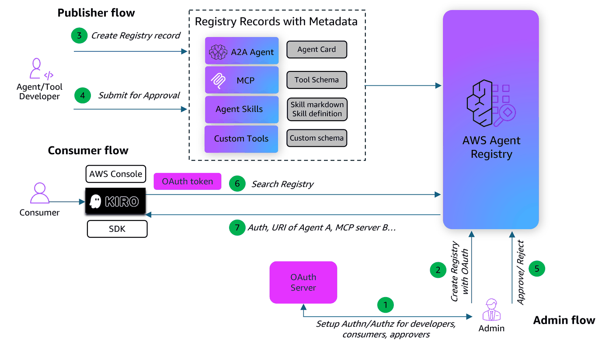

# AWS Agent Registry with OAuth Authentication

This notebook demonstrates how to configure and use OAuth authentication for AWS Agent Registry. OAuth provides secure, token-based authentication to AWS Agent Registry search operations.



## What You'll Learn

- Set up AWS Cognito as an OAuth provider (user pool, app client, test user)
- Create an **Agent Registry** with `CUSTOM_JWT` authorization (discovery URL and allowed clients)
- Create and manage **registry records** (MCP descriptor type)
- Manage record status transitions (DRAFT → PENDING_APPROVAL → APPROVED)
- Obtain a JWT access token from Cognito
- Perform **semantic search** on approved records using a Bearer token
- Verify that unauthenticated requests are rejected

## Authentication Types

An AWS Agent Registry supports two inbound authentication types:

| Type | Description |
|:-----|:------------|
| `AWS_IAM` | Default. Uses IAM SigV4 signing for all search requests. |
| `CUSTOM_JWT` | Uses JWT Bearer Token authentication. Requires an OpenID Connect discovery URL and a list of allowed client IDs. |

A single Agent Registry can use either IAM or JWT auth, but not both simultaneously. You can create separate registries with different auth types.

This notebook demonstrates the `CUSTOM_JWT` flow using AWS Cognito as the identity provider.

## Architecture Flow

```
Cognito                  Agent Registry                    Consumer
───────                  ──────────────                    ────────
  │                           │                               │
  │  1. Create user pool      │                               │
  │     + app client          │                               │
  │     + test user           │                               │
  │                           │                               │
  │                    2. Create registry                     │
  │                       (CUSTOM_JWT auth                    │
  │                        + discovery URL                    │
  │                        + allowed clients)                 │
  │                           │                               │
  │                    3. Create + approve                    │
  │                       MCP record                          │
  │                           │                               │
  │  4. Authenticate user     │                               │
  │<──────────────────────────────────────────────────────────│
  │                           │                               │
  │  5. Return JWT token      │                               │
  │──────────────────────────────────────────────────────────>│
  │                           │                               │
  │                           │  6. Search with Bearer token  │
  │                           │<──────────────────────────────│
  │                           │                               │
  │                           │  7. Validate token + return   │
  │                           │     APPROVED records          │
  │                           │──────────────────────────────>│
  │                           │                               │
```

## Setup

### Prerequisites

- AWS account with IAM credentials configured
- Python 3.10+
- `boto3 >= 1.42.87`
- IAM user or role with the permissions below (replace `ACCOUNT_ID` and `REGION` as needed)


<details>
<summary>Required IAM policy (click to expand)</summary>

```json
{
    "Version": "2012-10-17",
    "Statement": [
        {
            "Sid": "AllowCreateRegistry",
            "Effect": "Allow",
            "Action": ["bedrock-agentcore:CreateRegistry"],
            "Resource": ["arn:aws:bedrock-agentcore:REGION:ACCOUNT_ID:*"]
        },
        {
            "Sid": "AllowGetUpdateDeleteRegistry",
            "Effect": "Allow",
            "Action": [
                "bedrock-agentcore:GetRegistry",
                "bedrock-agentcore:DeleteRegistry"
            ],
            "Resource": ["arn:aws:bedrock-agentcore:REGION:ACCOUNT_ID:registry/*"]
        },
        {
            "Sid": "AllowCreateAndListRecords",
            "Effect": "Allow",
            "Action": [
                "bedrock-agentcore:CreateRegistryRecord",
                "bedrock-agentcore:SearchRegistryRecords"
            ],
            "Resource": ["arn:aws:bedrock-agentcore:REGION:ACCOUNT_ID:registry/*"]
        },
        {
            "Sid": "AllowRecordOperations",
            "Effect": "Allow",
            "Action": [
                "bedrock-agentcore:GetRegistryRecord",
                "bedrock-agentcore:DeleteRegistryRecord",
                "bedrock-agentcore:SubmitRegistryRecordForApproval"
            ],
            "Resource": ["arn:aws:bedrock-agentcore:REGION:ACCOUNT_ID:registry/*/record/*"]
        }
    ]
}
```

</details>

**Note:** This notebook creates Amazon Cognito resources (User Pool, App Client, test user) as part of the OAuth setup. No pre-existing Cognito configuration is required.

### Install Dependencies

```python
!pip install -r requirements.txt
```

### Initialize AWS Session and Clients

Configure boto3 clients for both registry management and search operations.

```python
import boto3
import json
import time
from boto3.session import Session

# Configuration
boto_session = Session()
AWS_REGION = boto_session.region_name

# AWS_PROFILE = "aws-profile"  # Change this to your profile. Comment this line if running on SageMaker

# Set AWS credentials if not using Amazon SageMaker notebook
# os.environ["AWS_PROFILE"] = AWS_PROFILE

# Create boto3 session
# boto_session = boto3.Session(profile_name=AWS_PROFILE, region_name=AWS_REGION)  # Use this if you are not running on SageMaker

# Client for registry management
registry_client = boto_session.client("bedrock-agentcore-control", region_name=AWS_REGION)

# Registry Search endpoint
REGISTRY_SEARCH_ENDPOINT = f"https://bedrock-agentcore.{AWS_REGION}.amazonaws.com/registry-records/search"

print(f"Session ready | Region: {AWS_REGION}")
```

### Helper Functions

Agent Registry creation is an asynchronous operation. This helper polls until the Agent Registry reaches `READY` status.

```python
# ANSI colors for terminal output
class C:
    GREEN = "\033[92m"
    RED = "\033[91m"
    YELLOW = "\033[93m"
    CYAN = "\033[96m"
    BOLD = "\033[1m"
    DIM = "\033[2m"
    RESET = "\033[0m"


def wait_for_registry(registry_id, interval=5):
    while True:
        resp = registry_client.get_registry(registryId=registry_id)
        status = resp["status"]
        if status == "READY":
            print(f"  {C.GREEN}✅ Registry Status: {status}{C.RESET}")
            resp.pop("ResponseMetadata", None)
            print(json.dumps(resp, indent=2, default=str))
            return resp
        if status.endswith("_FAILED"):
            print(f"  {C.RED}❌ Registry Status: {status}{C.RESET}")
            raise Exception(f"Registry failed: {status} - {resp.get('statusReason')}")
        print(f"  {C.YELLOW}⏳ Registry Status: {status}{C.RESET}")
        time.sleep(interval)


def pretty_print_response(response):
    """Pretty-print API response, stripping ResponseMetadata."""
    data = {k: v for k, v in response.items() if k != "ResponseMetadata"}
    print(json.dumps(data, indent=2, default=str))
```

---
## 1. Configure OAuth Provider (AWS Cognito)

To use JWT authentication with the Agent Registry, you need an OpenID Connect (OIDC) identity provider. Here we use AWS Cognito, which provides:
- A **User Pool** — the identity store that issues JWT tokens
- An **App Client** — the application registration that defines allowed auth flows
- A **Discovery URL** — the OIDC endpoint the Agent Registry uses to validate tokens

### 1.1 Create or Retrieve Cognito User Pool

Create a Cognito User Pool (or reuse an existing one). The pool's OIDC discovery URL will be configured on the Agent Registry to validate incoming JWT tokens.

```python
USER_POOL_NAME = "agentcore-registry-pool"

cognito = boto3.client("cognito-idp", region_name=AWS_REGION)

# Find existing pool
pools = cognito.list_user_pools(MaxResults=60)["UserPools"]
existing_pool = next((p for p in pools if p["Name"] == USER_POOL_NAME), None)

if existing_pool:
    user_pool_id = existing_pool["Id"]
    print(f"  {C.YELLOW}⚠️  Using existing pool: {user_pool_id}{C.RESET}")
else:
    # Create new pool
    user_pool = cognito.create_user_pool(PoolName=USER_POOL_NAME)["UserPool"]
    user_pool_id = user_pool["Id"]

    cognito.create_user_pool_domain(Domain=user_pool_id.replace("_", "").lower(), UserPoolId=user_pool_id)
    print(f"  {C.GREEN}✅ User pool created{C.RESET}")

discovery_url = f"https://cognito-idp.{AWS_REGION}.amazonaws.com/{user_pool_id}/.well-known/openid-configuration"

print(f"  {C.BOLD}Pool ID:{C.RESET}       {C.CYAN}{user_pool_id}{C.RESET}")
print(f"  {C.BOLD}Discovery URL:{C.RESET}  {C.CYAN}{discovery_url}{C.RESET}")
```

### 1.2 Create an App Client

Create a Cognito App Client with `USER_PASSWORD_AUTH` flow enabled. The client ID will be added to the Agent Registry's `allowedClients` list — only tokens issued to allowed clients can access the registry.

```python
CLIENT_NAME = "agentcore-registry-client"

# Create or get app client
clients = cognito.list_user_pool_clients(UserPoolId=user_pool_id)["UserPoolClients"]
existing_client = next((c for c in clients if c["ClientName"] == CLIENT_NAME), None)

if existing_client:
    client_id = existing_client["ClientId"]
    print(f"  {C.YELLOW}⚠️  Using existing client: {client_id}{C.RESET}")
else:
    client = cognito.create_user_pool_client(
        UserPoolId=user_pool_id,
        ClientName=CLIENT_NAME,
        GenerateSecret=False,
        ExplicitAuthFlows=["ALLOW_USER_PASSWORD_AUTH", "ALLOW_REFRESH_TOKEN_AUTH"],
    )
    client_id = client["UserPoolClient"]["ClientId"]
    print(f"  {C.GREEN}✅ App client created{C.RESET}")

print(f"  {C.BOLD}Client ID:{C.RESET}  {C.CYAN}{client_id}{C.RESET}")
```

### 1.3 Create Test User

Create a test user in the Cognito User Pool. This user will authenticate and obtain a JWT token for searching the Agent Registry.

```python
TEST_USERNAME = "testuser"
TEST_PASSWORD = "TempPass123!"

# Create test user
try:
    cognito.admin_create_user(
        UserPoolId=user_pool_id,
        Username=TEST_USERNAME,
        TemporaryPassword=TEST_PASSWORD,
        MessageAction="SUPPRESS",
    )
    cognito.admin_set_user_password(
        UserPoolId=user_pool_id,
        Username=TEST_USERNAME,
        Password=TEST_PASSWORD,
        Permanent=True,
    )
    print(f"  {C.GREEN}✅ Test user created: {TEST_USERNAME}{C.RESET}")
except cognito.exceptions.UsernameExistsException:
    print(f"  {C.YELLOW}⚠️  User {TEST_USERNAME} already exists{C.RESET}")
```

---
## 2. Create an Agent Registry with OAuth Configuration

Create an Agent Registry with `CUSTOM_JWT` authorizer type. This configures the Agent Registry to validate incoming search requests using JWT tokens.

The `authorizerConfiguration` requires:
- **`discoveryUrl`** — The OIDC discovery endpoint (e.g., Cognito's `.well-known/openid-configuration` URL). The Agent Registry uses this to fetch the JWKS (JSON Web Key Set) for token signature verification.
- **`allowedClients`** — List of app client IDs whose tokens are accepted. Tokens from unlisted clients will be rejected.

```python
create_registry_respone = registry_client.create_registry(
    name="RegistryWithOauth",
    description="Registry created from Jupyter notebook with OAuth",
    approvalConfiguration={"autoApproval": False},
    authorizerType="CUSTOM_JWT",
    authorizerConfiguration={
        "customJWTAuthorizer": {
            "discoveryUrl": discovery_url,
            "allowedClients": [client_id],
        }
    },
)

REGISTRY_ARN = create_registry_respone["registryArn"]
REGISTRY_ID = REGISTRY_ARN.split("/")[-1]

wait_for_registry(REGISTRY_ID)

print(f"  {C.GREEN}✅ Registry created!{C.RESET}")
print(f"  {C.BOLD}ARN:{C.RESET}        {C.CYAN}{REGISTRY_ARN}{C.RESET}")
print(f"  {C.BOLD}ID:{C.RESET}         {C.CYAN}{REGISTRY_ID}{C.RESET}")
print(f"  {C.BOLD}Auth Type:{C.RESET}   {C.CYAN}CUSTOM_JWT{C.RESET}")
```

---
## 3. Create and Approve Registry Records

### 3.1 Create an MCP Record

Register a sample MCP server record in the Agent Registry. An MCP record contains:
- **`server`** — Server metadata (name, description, version, packages, transport configuration)
- **`tools`** — Tool definitions with input schemas that describe the server's capabilities

The record will be searchable after it goes through the approval workflow.

```python
mcp_server_schema = json.dumps(
    {
        "name": "io.example/weather-server",
        "description": "A weather data MCP server that provides current conditions and forecasts",
        "version": "1.0.0",
        "title": "Weather Server",
        "websiteUrl": "https://example.com/weather",
        "packages": [
            {
                "registryType": "npm",
                "identifier": "@example/weather-mcp",
                "version": "1.0.0",
                "registryBaseUrl": "https://registry.npmjs.org",
                "runtimeHint": "npx",
                "transport": {"type": "stdio"},
                "environmentVariables": [
                    {
                        "name": "WEATHER_API_KEY",
                        "description": "API key for the weather service",
                        "isSecret": True,
                    }
                ],
            }
        ],
    }
)

mcp_tool_schema = json.dumps(
    {
        "tools": [
            {
                "name": "get_current_weather",
                "description": "Get current weather for a city",
                "inputSchema": {
                    "type": "object",
                    "properties": {"city": {"type": "string", "description": "City name"}},
                    "required": ["city"],
                },
            },
            {
                "name": "get_forecast",
                "description": "Get 5-day weather forecast",
                "inputSchema": {
                    "type": "object",
                    "properties": {
                        "city": {"type": "string", "description": "City name"},
                        "days": {
                            "type": "integer",
                            "description": "Number of forecast days",
                        },
                    },
                    "required": ["city"],
                },
            },
        ]
    }
)

mcp_record_response = registry_client.create_registry_record(
    registryId=REGISTRY_ID,
    name="weather_server",
    description="MCP server providing weather data and forecasts",
    descriptorType="MCP",
    descriptors={
        "mcp": {
            "server": {
                "schemaVersion": "2025-12-11",
                "inlineContent": mcp_server_schema,
            },
            "tools": {
                "protocolVersion": "2025-11-25",
                "inlineContent": mcp_tool_schema,
            },
        }
    },
    recordVersion="1.0",
)

MCP_RECORD_ARN = mcp_record_response["recordArn"]
MCP_RECORD_ID = MCP_RECORD_ARN.split("/")[-1]
print(f"  {C.GREEN}✅ MCP Record created: {C.CYAN}{MCP_RECORD_ID}{C.RESET}")
```

### 3.2 List Records

Verify the record was created in the Agent Registry. Note that it starts in `DRAFT` status — it is not yet searchable.

```python
records_response = registry_client.list_registry_records(registryId=REGISTRY_ID)

print(f"{C.BOLD}=== Registry Records ==={C.RESET}")
print(f"Found {len(records_response['registryRecords'])} record(s):\n")
for rec in records_response["registryRecords"]:
    status = rec["status"]
    sc = C.GREEN if status == "APPROVED" else C.YELLOW if status in ("DRAFT", "PENDING_APPROVAL") else C.RED
    print(
        f"  {sc}[{status}]{C.RESET} {rec['name']} | {C.CYAN}{rec['descriptorType']}{C.RESET} | {C.DIM}{rec['recordId']}{C.RESET}"
    )
```

### 3.3 Approve Record

Submit the record for approval and then approve it. Only `APPROVED` records are searchable.

```
DRAFT → PENDING_APPROVAL → APPROVED (now searchable)
                         → REJECTED
                         → DEPRECATED (after approval, if retired)
```

In a production environment, the publisher submits the record and a separate admin reviews and approves it. Here we perform both steps.

```python
# Step 1: Publisher submits for approval
registry_client.submit_registry_record_for_approval(registryId=REGISTRY_ID, recordId=MCP_RECORD_ID)
print(f"  {C.YELLOW}⏳ MCP record → PENDING_APPROVAL{C.RESET}")

# Step 2: Admin approves
registry_client.update_registry_record_status(
    registryId=REGISTRY_ID,
    recordId=MCP_RECORD_ID,
    statusReason="Approved by admin",
    status="APPROVED",
)
print(f"  {C.GREEN}✅ MCP record → APPROVED{C.RESET}")
```

### 3.4 Verify Record Status

Confirm the record is now in `APPROVED` status and ready for authenticated searches via the Agent Registry.

```python
record_response = registry_client.get_registry_record(registryId=REGISTRY_ID, recordId=MCP_RECORD_ID)
status = record_response["status"]
sc = C.GREEN if status == "APPROVED" else C.YELLOW if status in ("DRAFT", "PENDING_APPROVAL") else C.RED
print(f"{C.BOLD}=== Record Details ==={C.RESET}")
print(f"  {C.BOLD}Name:{C.RESET}      {C.CYAN}{record_response['name']}{C.RESET}")
print(f"  {C.BOLD}Protocol:{C.RESET}   {C.CYAN}{record_response['descriptorType']}{C.RESET}")
print(f"  {C.BOLD}Status:{C.RESET}     {sc}{status}{C.RESET}")
print(f"  {C.BOLD}Version:{C.RESET}    {C.CYAN}{record_response['recordVersion']}{C.RESET}")
print(f"\n{C.BOLD}Full descriptor:{C.RESET}")
pretty_print_response(record_response)
```

---
## 4. Authenticate and Obtain Access Token

Authenticate the test user with Cognito using the `USER_PASSWORD_AUTH` flow to obtain a JWT access token.

This token must be included in the `Authorization` header as `Bearer {token}` for all search requests to the Agent Registry.

```python
# Authenticate user and get access token
try:
    cognito = boto3.client("cognito-idp", region_name=AWS_REGION)
    auth_response = cognito.initiate_auth(
        ClientId=client_id,
        AuthFlow="USER_PASSWORD_AUTH",
        AuthParameters={"USERNAME": TEST_USERNAME, "PASSWORD": TEST_PASSWORD},
    )

    bearer_token = auth_response["AuthenticationResult"]["AccessToken"]

    print(f"  {C.GREEN}✅ Authentication successful!{C.RESET}")
    print(f"  {C.BOLD}Access Token:{C.RESET}  {C.DIM}{bearer_token[:50]}...{C.RESET}")
    print(f"  {C.BOLD}Token Type:{C.RESET}    {C.CYAN}Bearer{C.RESET}")

except cognito.exceptions.NotAuthorizedException:
    print(f"  {C.RED}❌ Authentication failed: Invalid username or password{C.RESET}")
except cognito.exceptions.UserNotConfirmedException:
    print(f"  {C.RED}❌ User not confirmed. Please confirm user first.{C.RESET}")
except Exception as e:
    print(f"  {C.RED}❌ Authentication error: {e}{C.RESET}")
```

---
## 5. Perform Authenticated Search

Search the Agent Registry using the JWT access token. The Agent Registry validates the token before returning results:

1. Verifies the token signature using JWKS fetched from the discovery URL
2. Checks token expiration
3. Validates that the `client_id` claim is in the `allowedClients` list
4. Returns only `APPROVED` records matching the search query

Without a valid token, the search request will be rejected with a `401 Unauthorized` error.

```python
import requests
import json


def search_registry_records(access_token, search_query, registry_identifiers, max_results=10):
    headers = {
        "Content-Type": "application/json",
        "Authorization": f"Bearer {access_token}",
    }

    payload = {
        "searchQuery": search_query,
        "registryIds": registry_identifiers,
        "maxResults": max_results,
    }

    response = requests.post(f"{REGISTRY_SEARCH_ENDPOINT}", headers=headers, json=payload, timeout=30)
    return response.json()


# Wait for search index to update
print(f"  {C.YELLOW}⏳ Waiting 100s for search index...{C.RESET}")
time.sleep(100)

# Example usage
access_token = bearer_token  # From your Cognito authentication
registry_arn = REGISTRY_ARN

results = search_registry_records(access_token, "weather", [registry_arn], 10)

print(f"{C.BOLD}🔍 Search: 'weather'{C.RESET}")
records = results.get("registryRecords", [])
if records:
    print(f"  {C.GREEN}✅ Found {len(records)} result(s){C.RESET}")
else:
    print(f"  {C.YELLOW}⚠️  No results found{C.RESET}")
print(json.dumps(results, indent=2))
```

### 5.1 Search without Valid Token (Negative Test)

Verify that the Agent Registry enforces authentication by attempting searches without a valid Bearer token. Both requests should return an error.

```python
import json

# Attempt search without token
print(f"{C.BOLD}=== Negative Auth Tests ==={C.RESET}")
print(f"\n{C.BOLD}Test 1: Search without Authorization header{C.RESET}")
headers_no_auth = {"Content-Type": "application/json"}
payload = {"searchQuery": "weather", "registryIds": [REGISTRY_ARN], "maxResults": 10}

response = requests.post(f"{REGISTRY_SEARCH_ENDPOINT}", headers=headers_no_auth, json=payload, timeout=30)
sc = C.GREEN if response.status_code in (401, 403) else C.RED
print(f"  {sc}Status Code: {response.status_code}{C.RESET}")
print(f"  {C.DIM}{response.text}{C.RESET}\n")

# Attempt search with invalid token
print(f"{C.BOLD}Test 2: Search with invalid token{C.RESET}")
headers_invalid = {
    "Content-Type": "application/json",
    "Authorization": "Bearer invalid-token-12345",
}

response = requests.post(f"{REGISTRY_SEARCH_ENDPOINT}", headers=headers_invalid, json=payload, timeout=30)
sc = C.GREEN if response.status_code in (401, 403) else C.RED
print(f"  {sc}Status Code: {response.status_code}{C.RESET}")
print(f"  {C.DIM}{response.text}{C.RESET}\n")

print(f"  {C.GREEN}✅ Both requests correctly rejected{C.RESET}")
```

---
## 6. Cleanup (Optional)

### 6.1 Delete Agent Registry and Records

Delete all records and the Agent Registry to clean up resources. This step is optional — you may want to keep the Agent Registry for further experimentation.

```python
# Delete all records in the registry
records = registry_client.list_registry_records(registryId=REGISTRY_ID)
for rec in records.get("registryRecords", []):
    record_id = rec["recordId"]
    registry_client.delete_registry_record(registryId=REGISTRY_ID, recordId=record_id)
    print(f"  {C.GREEN}✅ Deleted record: {C.DIM}{record_id}{C.RESET}")

# Delete registry
registry_client.delete_registry(registryId=REGISTRY_ID)
print(f"  {C.GREEN}✅ Deleted registry: {C.DIM}{REGISTRY_ID}{C.RESET}")

print(f"\n{C.GREEN}✅ Registry cleanup complete!{C.RESET}")
```

### 6.2 Delete Cognito Resources

Delete the Cognito User Pool, App Client, and test user. This is optional — these resources can be reused for testing multiple Agent Registries with OAuth.

```python
# Delete test user
try:
    cognito.admin_delete_user(UserPoolId=user_pool_id, Username=TEST_USERNAME)
    print(f"  {C.GREEN}✅ Deleted user: {TEST_USERNAME}{C.RESET}")
except Exception as e:
    print(f"  {C.RED}❌ Error deleting user: {e}{C.RESET}")

# Delete app client
try:
    cognito.delete_user_pool_client(UserPoolId=user_pool_id, ClientId=client_id)
    print(f"  {C.GREEN}✅ Deleted app client: {C.DIM}{client_id}{C.RESET}")
except Exception as e:
    print(f"  {C.RED}❌ Error deleting app client: {e}{C.RESET}")

# Delete user pool domain (required before deleting pool)
try:
    domain = user_pool_id.replace("_", "").lower()
    cognito.delete_user_pool_domain(Domain=domain, UserPoolId=user_pool_id)
    print(f"  {C.GREEN}✅ Deleted user pool domain: {C.DIM}{domain}{C.RESET}")
except Exception as e:
    print(f"  {C.RED}❌ Error deleting domain: {e}{C.RESET}")

# Delete user pool
try:
    cognito.delete_user_pool(UserPoolId=user_pool_id)
    print(f"  {C.GREEN}✅ Deleted user pool: {C.DIM}{user_pool_id}{C.RESET}")
except Exception as e:
    print(f"  {C.RED}❌ Error deleting user pool: {e}{C.RESET}")

print(f"\n{C.GREEN}✅ Cognito cleanup complete!{C.RESET}")
```
