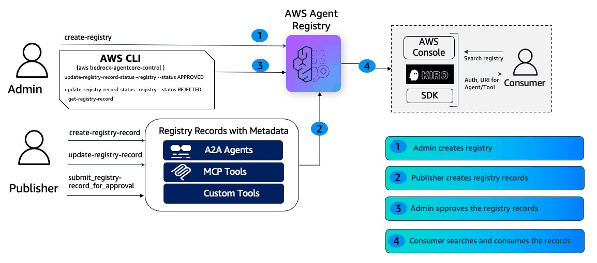

# 01 — User Personas and IAM Setup

This notebook provides instructions for provisioning IAM persona roles required to interact with AWS Agent Registry. The roles facilitate core registry operations: registry creation, publishing records, approvals, and search functionality.

## What You'll Learn

- What AWS Agent Registry is
- The persona roles (Admin, Publisher, Consumer) and why separation of duties matters
- How to create IAM roles with scoped permissions for each persona
- How to assume them
- How to verify the setup before moving onto the next Getting Started notebook (02*)


---

### Use Case: Enterprise Payment Processing

#### Overview

AnyCompany runs an e-commerce platform that handles thousands of daily transactions alongside a lending arm that processes loan applications, credit checks, and installment plans. Rather than building separate integrations for every AI agent across both domains, they want a central registry where payment and loan processing capabilities are published and discoverable by any agent at runtime.

#### Business Context

| | |
|---|---|
| **Challenge** | Customer service agents need real-time payment processing capabilities, refund handling, and transaction status lookup|
| **Goal** | Centralize payment processing capabilities that any AI agent can discover and use |
| **Benefit** | Reduce integration complexity, ensure consistent payment handling, and enable rapid deployment of agents, skills, MCP and custom tools |

### Solution: What is AWS Agent Registry?

[AWS Agent Registry](https://docs.aws.amazon.com/bedrock-agentcore/latest/devguide/registry.html#registry-what-is) is a unified catalog for discovering, governing, and managing agents & tools. 

#### Core Capabilities

- **Discovery:** Hybrid search (keyword & semantic) for discovering agents and tools. Keyword filtering on structured attributes.
- **Governance:** Integrate approval workflows for registered agents and tools  and apply policy validations for registered agents.
- **Semantic Search:** Consumers can find the right tools by describing what they need.
- **Security:** Secure access to view/update Registry and Registry records. Cross-account Registry access with IAM and OAuth support.
- **Observability:** Usage statistics, performance metrics, and error rates. Audit trails for compliance (⚠️ Coming Soon)

## End-to-End Workflow
The diagram below shows the end-to-end workflow:

1. **Admin creates a registry**
2. **Publisher creates registry records** containing metadata for A2A agents, MCP tools, Agent Skills or custom tools
3. **Admin approves or rejects** the submitted records
4. **Consumer searches and discovers** approved records via the AWS Console, Kiro, or SDK



## Registry Persona Roles

The workshop uses three IAM roles to demonstrate separation of duties:

| Persona | Role Name | Purpose | Notebooks |
|---------|-----------|---------|----------|
| **Admin** | `admin_persona` | Creates registries, approves/rejects records, manages workload identities | 02, 04 |
| **Publisher** | `publisher_persona` | Creates and submits registry records for approval | 03 |
| **Consumer** | `consumer_persona` | Searches and discovers approved records | 05 |

Each role has only the permissions it needs — no more, no less.

## Notebook Series

```
01 IAM Setup          Create persona roles and permissions
 └─▶ 02 Create Registry    Admin creates a registry with approval workflow
      └─▶ 03 Publish Records   Publisher submits tool records
           └─▶ 04 Approval Workflows   Admin approves/rejects submissions
                └─▶ 05 Semantic Search   Consumer discovers approved tools
```

Run the notebooks in the order above. This **notebook (01)** must be completed first.

## How Your Current Identity Is Used

This notebook detects your identity (IAM role / user, sagemaker role) you are using and:

1. Creates three IAM Roles (Admin, Publisher, Consumer)
2. Adds your current identity as a **trusted principal** in each persona role's trust policy, allowing you to call `sts:AssumeRole` to switch into any of them
3. Attaches an **inline permissions policy** to each persona role granting scoped `bedrock-agentcore` actions

Each subsequent notebook (02–05) assumes the relevant persona role via `sts.assume_role()`, so every API call runs with only the permissions that persona needs — mirroring how separate teams would operate in production.

## Prerequisites

- **boto3 >= 1.42.87**
- **IAM permissions** — Your IAM user or role needs the ability to create roles, attach policies, and assume them. The minimum policy required is shown below.

> **Note:** `bedrock-agentcore` permissions are not needed on your identity — they are attached to the persona roles that this notebook creates. Your identity only needs IAM management and STS permissions.

```json
{
    "Version": "2012-10-17",
    "Statement": [
        {
            "Sid": "IAMRoleManagement",
            "Effect": "Allow",
            "Action": [
                "iam:CreateRole",
                "iam:GetRole",
                "iam:PutRolePolicy",
                "iam:UpdateAssumeRolePolicy",
                "iam:DeleteRole",
                "iam:DeleteRolePolicy",
                "iam:ListRolePolicies",
                "iam:ListAttachedRolePolicies",
                "iam:DetachRolePolicy",
                "iam:ListInstanceProfilesForRole",
                "iam:RemoveRoleFromInstanceProfile",
                "iam:PassRole"
            ],
            "Resource": "arn:aws:iam::*:role/*"
        },
        {
            "Sid": "STS",
            "Effect": "Allow",
            "Action": [
                "sts:AssumeRole",
                "sts:GetCallerIdentity"
            ],
            "Resource": "*"
        }
    ]
}
```

---
## 1. Install boto3 SDK and dependencies

Install the required Python packages.

```python
!pip install boto3 python-dotenv --force-reinstall
```

## 2. Auto-Detect Current Identity

This works with both **Amazon SageMaker notebooks** (which have a role attached automatically) and environments with configured AWS credentials. If you are not using a SageMaker notebook, make sure your AWS credentials are set (e.g., via `aws configure`, environment variables, or a credentials file).

Detect the current caller identity and extract the IAM principal ARN. If running as an assumed role or service role (e.g., SageMaker), the ARN is resolved to the base IAM role ARN format required by trust policies.

```python
import boto3
import time
import botocore.exceptions
import utils
import os

AWS_REGION = os.environ.get("AWS_DEFAULT_REGION", "us-west-2")
ACCOUNT_ID = ""
try:
    sts = boto3.client("sts", region_name=AWS_REGION)
    identity = sts.get_caller_identity()
    ACCOUNT_ID = identity["Account"]
    CALLER_ARN = identity["Arn"]
    print(f"Account ID : {ACCOUNT_ID}")
    print(f"Caller ARN : {CALLER_ARN}")
except (botocore.exceptions.NoCredentialsError, botocore.exceptions.ClientError) as e:
    print(f"ERROR: Could not retrieve caller identity — {e}")
    print("Make sure your AWS credentials are configured.")
    raise SystemExit(1)
```

Resolve the caller ARN to the base IAM principal ARN. This handles assumed-role and service-role ARN formats.

```python
ROLE_ARN = utils.extract_role_arn(CALLER_ARN)
print(f"Principal ARN: {ROLE_ARN}")
```

Create an IAM client for role and policy management.

```python
iam_client = boto3.client("iam", region_name=AWS_REGION)
print(f"IAM client ready — region: {AWS_REGION}")
```

## 3. Create Persona Roles

### Define Persona Permissions

Each persona is defined with a policy name and a list of allowed `bedrock-agentcore` actions. The **admin** has full registry control, the **publisher** can create and submit records, and the **consumer** can only search and read.

```python
PERSONA_DEFINITIONS = {
    "admin_persona": {
        "policy_name": "AdminPolicy",
        "actions": [
            "bedrock-agentcore:CreateRegistry",
            "bedrock-agentcore:ListRegistries",
            "bedrock-agentcore:GetRegistry",
            "bedrock-agentcore:UpdateRegistry",
            "bedrock-agentcore:DeleteRegistry",
            "bedrock-agentcore:CreateRegistryRecord",
            "bedrock-agentcore:ListRegistryRecords",
            "bedrock-agentcore:GetRegistryRecord",
            "bedrock-agentcore:UpdateRegistryRecord",
            "bedrock-agentcore:DeleteRegistryRecord",
            "bedrock-agentcore:SubmitRegistryRecordForApproval",
            "bedrock-agentcore:UpdateRegistryRecordStatus",
            "bedrock-agentcore:*WorkloadIdentity",
        ],
    },
    "publisher_persona": {
        "policy_name": "PublisherPolicy",
        "actions": [
            "bedrock-agentcore:ListRegistries",
            "bedrock-agentcore:GetRegistry",
            "bedrock-agentcore:CreateRegistryRecord",
            "bedrock-agentcore:ListRegistryRecords",
            "bedrock-agentcore:GetRegistryRecord",
            "bedrock-agentcore:DeleteRegistryRecord",
            "bedrock-agentcore:UpdateRegistryRecord",
            "bedrock-agentcore:SubmitRegistryRecordForApproval",
        ],
    },
    "consumer_persona": {
        "policy_name": "ConsumerPolicy",
        "actions": [
            "bedrock-agentcore:ListRegistries",
            "bedrock-agentcore:GetRegistry",
            "bedrock-agentcore:GetRegistryRecord",
            "bedrock-agentcore:ListRegistryRecords",
            "bedrock-agentcore:SearchRegistryRecords",
        ],
    },
}
```

### Create or Update All Persona Roles

Loop through each persona definition, create the role (or update if it exists), and attach the permissions policy. A brief pause between roles avoids IAM throttling.

```python
trust_policy = utils.build_trust_policy(ROLE_ARN)
persona_role_arns = {}

for role_name, config in PERSONA_DEFINITIONS.items():
    print(f"\n{'=' * 60}")
    print(f"Setting up: {role_name}")
    print(f"{'=' * 60}")
    role_arn = utils.create_or_update_persona_role(
        iam_client,
        role_name,
        config["policy_name"],
        config["actions"],
        trust_policy,
        ACCOUNT_ID,
    )
    persona_role_arns[role_name] = role_arn
    time.sleep(1)  # Brief pause between role creations

print("\n✅ All persona roles ready:")
for name, arn in persona_role_arns.items():
    print(f"  {name}: {arn}")
```

---
## 4. Verification — Test Assuming Each Persona Role

We wait 10 seconds for IAM propagation, then test assuming each persona role. All three should succeed.

```python
print("Waiting 10 seconds for IAM propagation...")
time.sleep(10)
print("Done.")
```

### Test Role Assumption

Attempt to assume each persona role using sts.assume_role(). A successful assumption confirms the trust policy and AssumeRole permission are correctly configured.

```python
results = {}

for role_name, role_arn in persona_role_arns.items():
    print(f"\nAssuming {role_name} ({role_arn})...")
    try:
        resp = utils.assume_role_only(AWS_REGION, role_arn, session_name=f"{role_name}-verify")
        utils.pp(resp)
        assumed_arn = resp["AssumedRoleUser"]["Arn"]
        expiration = resp["Credentials"]["Expiration"]
        print(f"  ✅ Success — assumed: {assumed_arn}")
        print(f"     Expires: {expiration}")
        results[role_name] = "PASS"
    except botocore.exceptions.ClientError as e:
        print(f"  ❌ Failed — {e}")
        print("     Try waiting a few more seconds for IAM propagation and re-run this cell.")
        results[role_name] = "FAIL"

print(f"\n{'=' * 60}")
print("Verification Summary")
print(f"{'=' * 60}")
for name, status in results.items():
    icon = "✅" if status == "PASS" else "❌"
    print(f"  {icon} {name}: {status}")

if all(s == "PASS" for s in results.values()):
    print("\n🎉 All roles verified! You are ready to proceed to notebook 02.")
else:
    print("\n⚠️  Some roles failed. Check the errors above and re-run after a brief wait.")
```

---
## 5. Manual IAM Setup (Alternative)

If you cannot create roles programmatically (e.g., restricted environment), follow these steps in the AWS IAM console.

### Step 1: Create each persona role

For each of the three roles (`admin_persona`, `publisher_persona`, `consumer_persona`):

1. Go to **IAM → Roles → Create role**
2. Select **Custom trust policy**
3. Paste the trust policy JSON below (replace `<YOUR_IDENTITY_ARN>` with your IAM user or role ARN)
4. Click **Next**, then **Create policy** to add the permissions policy
5. Name the role exactly as shown

### Trust Policy (same for all three roles)

```json
{
  "Version": "2012-10-17",
  "Statement": [
    {
      "Effect": "Allow",
      "Principal": {
        "Service": "bedrock-agentcore.amazonaws.com"
      },
      "Action": "sts:AssumeRole"
    },
    {
      "Effect": "Allow",
      "Principal": {
        "AWS": "<YOUR_IDENTITY_ARN>"
      },
      "Action": "sts:AssumeRole"
    }
  ]
}
```

### Step 2: Attach permissions policies

#### AdminPolicy (for `admin_persona`)

```json
{
  "Version": "2012-10-17",
  "Statement": [
    {
      "Effect": "Allow",
      "Action": [
        "bedrock-agentcore:CreateRegistry",
        "bedrock-agentcore:ListRegistries",
        "bedrock-agentcore:GetRegistry",
        "bedrock-agentcore:UpdateRegistry",
        "bedrock-agentcore:DeleteRegistry",
        "bedrock-agentcore:CreateRegistryRecord",
        "bedrock-agentcore:ListRegistryRecords",
        "bedrock-agentcore:GetRegistryRecord",
        "bedrock-agentcore:UpdateRegistryRecord",
        "bedrock-agentcore:DeleteRegistryRecord",
        "bedrock-agentcore:SubmitRegistryRecordForApproval",
        "bedrock-agentcore:UpdateRegistryRecordStatus",
        "bedrock-agentcore:*WorkloadIdentity"
      ],
      "Resource": "*"
    }
  ]
}
```

#### PublisherPolicy (for `publisher_persona`)

```json
{
  "Version": "2012-10-17",
  "Statement": [
    {
      "Effect": "Allow",
      "Action": [
        "bedrock-agentcore:ListRegistries",
        "bedrock-agentcore:GetRegistry",
        "bedrock-agentcore:CreateRegistryRecord",
        "bedrock-agentcore:ListRegistryRecords",
        "bedrock-agentcore:GetRegistryRecord",
        "bedrock-agentcore:DeleteRegistryRecord",
        "bedrock-agentcore:UpdateRegistryRecord",
        "bedrock-agentcore:SubmitRegistryRecordForApproval"
      ],
      "Resource": "*"
    }
  ]
}
```

#### ConsumerPolicy (for `consumer_persona`)

```json
{
  "Version": "2012-10-17",
  "Statement": [
    {
      "Effect": "Allow",
      "Action": [
        "bedrock-agentcore:ListRegistries",
        "bedrock-agentcore:GetRegistry",
        "bedrock-agentcore:GetRegistryRecord",
        "bedrock-agentcore:ListRegistryRecords",
        "bedrock-agentcore:SearchRegistryRecords"
      ],
      "Resource": "*"
    }
  ]
}
```

---
## 6. Cleanup

⚠️ **WARNING: Only run this section after you have completed ALL notebooks (02–05).** Deleting these roles will break the other notebooks.

```python
# cleanup_results = {}

# for role_name, config in PERSONA_DEFINITIONS.items():
#     print(f"\nCleaning up: {role_name}")
#     try:
#         # 1. Delete ALL inline policies (not just the one we created)
#         try:
#             inline_policies = iam_client.list_role_policies(RoleName=role_name)
#             for policy_name in inline_policies.get("PolicyNames", []):
#                 iam_client.delete_role_policy(
#                     RoleName=role_name,
#                     PolicyName=policy_name,
#                 )
#                 print(f"  Deleted inline policy: {policy_name}")
#         except iam_client.exceptions.NoSuchEntityException:
#             print(f"  No inline policies found")

#         # 2. Detach managed policies
#         try:
#             attached = iam_client.list_attached_role_policies(RoleName=role_name)
#             for policy in attached.get("AttachedPolicies", []):
#                 iam_client.detach_role_policy(
#                     RoleName=role_name,
#                     PolicyArn=policy["PolicyArn"],
#                 )
#                 print(f"  Detached managed policy: {policy['PolicyArn']}")
#         except iam_client.exceptions.NoSuchEntityException:
#             pass

#         # 3. Remove from instance profiles
#         try:
#             profiles = iam_client.list_instance_profiles_for_role(RoleName=role_name)
#             for profile in profiles.get("InstanceProfiles", []):
#                 iam_client.remove_role_from_instance_profile(
#                     InstanceProfileName=profile["InstanceProfileName"],
#                     RoleName=role_name,
#                 )
#                 print(f"  Removed from instance profile: {profile['InstanceProfileName']}")
#         except iam_client.exceptions.NoSuchEntityException:
#             pass

#         # 4. Delete the role
#         iam_client.delete_role(RoleName=role_name)
#         print(f"  ✅ Deleted role: {role_name}")
#         cleanup_results[role_name] = "DELETED"

#     except iam_client.exceptions.NoSuchEntityException:
#         print(f"  Role {role_name} not found — already absent")
#         cleanup_results[role_name] = "ABSENT"
#     except botocore.exceptions.ClientError as e:
#         print(f"  ❌ Error: {e}")
#         cleanup_results[role_name] = "ERROR"
```

### Cleanup Summary

Display which resources were successfully deleted and which were already absent.

```python
# print(f"\n{'='*60}")
# print("Cleanup Summary")
# print(f"{'='*60}")
# for name, status in cleanup_results.items():
#     icon = "✅" if status == "DELETED" else "⚪" if status == "ABSENT" else "❌"
#     print(f"  {icon} {name}: {status}")
# print(f"\nCleanup complete.")
```

---
## What happens next?

Now that the three persona roles are created and verified, proceed to **notebook 02 — Creating a Registry** to create your first AWS Agent Registry as the admin persona.

The roles created here will be used across all remaining notebooks:

- **Notebook 02** — [Creating Registry](02-creating-registry-workflow.ipynb): Admin creates a registry
- **Notebook 03** — [Publishing Records](03-publishing-records-workflow.ipynb): Publish records as a Publisher
- **Notebook 04** — [Admin Approval](04-admin-approval-workflow.ipynb): Admin Approval workflow 
- **Notebook 05** — [Semantic Search](05-search-registry-workflow.ipynb): Search approved records using NLQ as a Consumer
