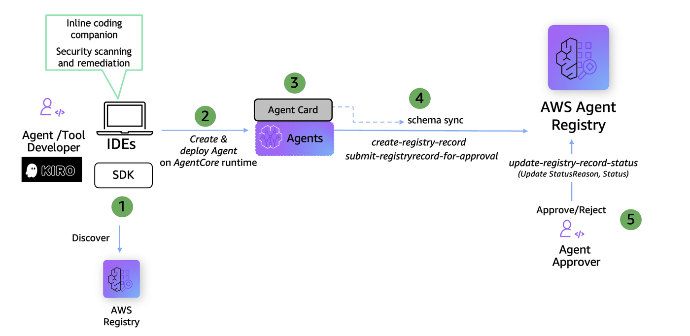

# 03 - Publishing Records as Publisher

This notebook demonstrates the **Publisher** persona workflow for AWS Agent Registry.
A Publisher can create MCP/A2A/Custom/Agent Skills records, list and inspect records, update record content,
and submit records for admin approval — but **cannot** approve, reject, or deprecate records.

### What You'll Learn 

1. **List & inspect** — Browse registries and records visible to the publisher
2. **Create records** — Creating MCP/A2A/CUSTOM records with metadata and descriptors
3. **Update records** — Modify descriptors on a DRAFT record
4. **Submit for approval** — Transition a record from DRAFT → PENDING_APPROVAL

### Prerequisites

- boto3 >= 1.42.87
- Execute [notebook 01](01-create-user-personas-workflow.ipynb) to create IAM roles for admin, publisher and consumer personas
- Execute [notebook 02](02-creating-registry-workflow.ipynb) to create registry as Admin


### Publisher Workflow


### Publisher API References

| # | API | Description |
|---|-----|-------------|
| 1 | [ListRegistries](https://docs.aws.amazon.com/boto3/latest/reference/services/bedrock-agentcore-control/client/list_registries.html) | Discover available registries to publish into |
| 2 | [GetRegistry](https://docs.aws.amazon.com/boto3/latest/reference/services/bedrock-agentcore-control/client/get_registry.html) | Get registry details (name, status, approval config) |
| 3 | [CreateRegistryRecord](https://docs.aws.amazon.com/boto3/latest/reference/services/bedrock-agentcore-control/client/create_registry_record.html) | Create a new MCP or A2A record (CREATING → DRAFT) |
| 4 | [ListRegistryRecords](https://docs.aws.amazon.com/boto3/latest/reference/services/bedrock-agentcore-control/client/list_registry_records.html) | List records, optionally filtered by status |
| 5 | [GetRegistryRecord](https://docs.aws.amazon.com/boto3/latest/reference/services/bedrock-agentcore-control/client/get_registry_record.html) | Get full record details including descriptors |
| 6 | [UpdateRegistryRecord](https://docs.aws.amazon.com/boto3/latest/reference/services/bedrock-agentcore-control/client/update_registry_record.html) | Update a DRAFT record (PATCH with `optionalValue` wrappers) |
| 7 | [SubmitRegistryRecordForApproval](https://docs.aws.amazon.com/boto3/latest/reference/services/bedrock-agentcore-control/client/submit_registry_record_for_approval.html) | Move a record from DRAFT → PENDING_APPROVAL |
| 8 | [DeleteRegistryRecord](https://docs.aws.amazon.com/boto3/latest/reference/services/bedrock-agentcore-control/client/delete_registry_record.html) | Delete a record (publisher can delete their own) |

### Notebook Chain

02 (create registry) → **03 (this notebook)** → 04 (admin approval) → 05 (semantic search)

#### Use Case: Enterprise Payment Processing
**Publisher Persona:** AnyCompany's payment services team has built a Payment Processing MCP Server, a Loan Processing A2A Agent and other tools. They can submit all records to the agent registry for admin approval, ensuring that payment, loan and other capabilities undergo review before becoming discoverable by other agents across the enterprise.

---
## 1. Install boto3 SDK and dependencies

Install core dependencies (`boto3` and `python-dotenv`).

```python
!pip install boto3 python-dotenv --force-reinstall
```

## 2. Initialize boto3 session assuming Publisher Role

Assume the `publisher_persona` IAM role and create a boto3 session with temporary credentials. All subsequent API calls use this session.

```python
import boto3
import json
import utils
import os
from botocore.exceptions import ClientError

AWS_REGION = os.environ.get("AWS_DEFAULT_REGION", "us-west-2")

# Auto-detect account ID from current credentials
sts = boto3.client("sts", region_name=AWS_REGION)
ACCOUNT_ID = sts.get_caller_identity()["Account"]
CALLER_ARN = sts.get_caller_identity()["Arn"]

PUBLISHER_ROLE_ARN = f"arn:aws:iam::{ACCOUNT_ID}:role/publisher_persona"

print(f"Account:  {PUBLISHER_ROLE_ARN}")

# Assume the Admin role
creds = utils.assume_role(
    role_arn=PUBLISHER_ROLE_ARN,
    session_name="publisher_session",
)

publisher_session = boto3.Session(
    aws_access_key_id=creds["AccessKeyId"],
    aws_secret_access_key=creds["SecretAccessKey"],
    aws_session_token=creds["SessionToken"],
    region_name=AWS_REGION,
)
```

## 3. Initialize the Control Plane Client

The control plane (`bedrock-agentcore-control`) handles CRUD operations for registries and records.

```python
# Control plane client (admin operations)
cp_client = publisher_session.client("bedrock-agentcore-control")
```

---
## 4. Publisher Lists Registries

Discover available registries to publish records into.

```python
registries = cp_client.list_registries()
print(f"Publisher can see {len(registries.get('registries', []))} registries:\n")
for reg in registries.get("registries", []):
    utils.pp(reg)
```

## 5. Select a Registry

Find an existing READY registry to work with. If you set REGISTRY_ID, we validate it. Otherwise, we pick the first READY registry from list_registries.

If no READY registry is found, you need to run notebook 02 first to create one.

```python
REGISTRY_ID = ""  # Populate this placeholder in case you want to manually pick from above list

## if REGISTRY_ID is left empty, we pick the first READY registry from list_registries
registry_details = utils.get_or_select_registry(cp_client, REGISTRY_ID, AWS_REGION)
REGISTRY_ID = registry_details[0]
REGISTRY_ARN = registry_details[1]
```


## 6. Create an MCP Record

Create an MCP registry record with server and tool descriptors. The record starts in `CREATING` and transitions to `DRAFT` once ready.

> This is sample data for demonstration purposes.

### 6.1 Define MCP Descriptor Schemas

Define the MCP server metadata and tool input schemas. These describe the payment processing capabilities that consumers will discover.

```python
mcp_server_schema = json.dumps(
    {
        "name": "io.novacorp/payment-processing-server",
        "description": "A payment processing MCP server for handling transactions, refunds, and payment status queries",
        "version": "1.0.0",
        "title": "Payment Processing Server",
        "packages": [
            {
                "registryType": "npm",
                "identifier": "@novacorp/payment-processing-mcp",
                "version": "1.0.0",
                "registryBaseUrl": "https://registry.npmjs.org",
                "runtimeHint": "npx",
                "transport": {"type": "stdio"},
            }
        ],
    }
)

mcp_tool_schema = json.dumps(
    {
        "tools": [
            {
                "name": "process_payment",
                "description": "Process a new payment transaction for a given amount and currency",
                "inputSchema": {
                    "type": "object",
                    "properties": {
                        "amount": {"type": "number", "description": "Payment amount"},
                        "currency": {
                            "type": "string",
                            "description": "ISO 4217 currency code (e.g. USD, EUR)",
                        },
                        "customer_id": {
                            "type": "string",
                            "description": "Unique customer identifier",
                        },
                        "payment_method": {
                            "type": "string",
                            "description": "Payment method type",
                            "enum": [
                                "credit_card",
                                "debit_card",
                                "bank_transfer",
                                "digital_wallet",
                            ],
                        },
                        "description": {
                            "type": "string",
                            "description": "Optional payment description",
                        },
                    },
                    "required": ["amount", "currency", "customer_id", "payment_method"],
                },
            },
            {
                "name": "get_payment_status",
                "description": "Retrieve the current status of a payment by transaction ID",
                "inputSchema": {
                    "type": "object",
                    "properties": {
                        "transaction_id": {
                            "type": "string",
                            "description": "Unique transaction identifier",
                        },
                    },
                    "required": ["transaction_id"],
                },
            },
            {
                "name": "process_refund",
                "description": "Initiate a full or partial refund for a completed transaction",
                "inputSchema": {
                    "type": "object",
                    "properties": {
                        "transaction_id": {
                            "type": "string",
                            "description": "Original transaction ID to refund",
                        },
                        "amount": {
                            "type": "number",
                            "description": "Refund amount (omit for full refund)",
                        },
                        "reason": {
                            "type": "string",
                            "description": "Reason for the refund",
                        },
                    },
                    "required": ["transaction_id", "reason"],
                },
            },
        ]
    }
)
```

### 6.2 Create the MCP Registry Record

Submit the MCP record to the registry. 

> Note: Running this cell multiple times creates duplicate records with unique IDs.

```python
MCP_RECORD_ID = None

try:
    mcp_resp = cp_client.create_registry_record(
        registryId=REGISTRY_ID,
        name="mcp_payment_processing_server",
        description="MCP server for processing payments, refunds, and transaction queries",
        descriptorType="MCP",
        descriptors={
            "mcp": {
                "server": {
                    "schemaVersion": "2025-12-11",
                    "inlineContent": mcp_server_schema,
                },
                "tools": {
                    "inlineContent": mcp_tool_schema,
                },
            }
        },
        recordVersion="1.0",
    )
    MCP_RECORD_ID = mcp_resp["recordArn"].split("/")[-1]
    print(f"Created MCP record: {MCP_RECORD_ID}")
    record = utils.wait_for_record_ready(cp_client, REGISTRY_ID, MCP_RECORD_ID)
    print(f"Status: {record.get('status', 'UNKNOWN')}")

except ClientError as e:
    if e.response["Error"]["Code"] == "ConflictException":
        print("Record 'payment_processing_server' already exists — looking it up...")
        records = cp_client.list_registry_records(registryId=REGISTRY_ID)
        for rec in records.get("registryRecords", []):
            if rec["name"] == "payment_processing_server":
                MCP_RECORD_ID = rec["registryRecordId"]
                break
        print(f"  Using existing record: {MCP_RECORD_ID}")
    else:
        raise

print(f"\nMCP_RECORD_ID = {MCP_RECORD_ID}")
```

## 7. Create an A2A Record

Create an A2A (Agent-to-Agent) registry record with an agent card descriptor for the Loan Processing Agent.

> Note: Running this cell multiple times creates duplicate records with unique IDs.

```python
from botocore.exceptions import ClientError

a2a_agent_card = json.dumps(
    {
        "protocolVersion": "0.3.0",
        "name": "Loan Processing Agent",
        "description": "Publishes loan processing capabilities for agent discovery, including loan applications, credit checks, and installment plan support.",
        "url": "https://example.com/agents/loan",
        "version": "1.0.0",
        "capabilities": {"streaming": True},
        "defaultInputModes": ["text"],
        "defaultOutputModes": ["text"],
        "preferredTransport": "JSONRPC",
        "skills": [
            {
                "id": "loan_application_processing",
                "name": "Loan Application Processing",
                "description": "Process loan applications and validate required information.",
                "tags": [],
            },
            {
                "id": "credit_check_review",
                "name": "Credit Check Review",
                "description": "Support credit check workflows and eligibility review.",
                "tags": [],
            },
            {
                "id": "installment_plan_management",
                "name": "Installment Plan Management",
                "description": "Manage installment plan setup and repayment schedule inquiries.",
                "tags": [],
            },
        ],
    }
)

try:
    a2a_resp = cp_client.create_registry_record(
        registryId=REGISTRY_ID,
        name="a2a_loan_agent",
        description="A2A agent for loan processing capabilities including loan applications, credit checks, and installment plan support.",
        descriptorType="A2A",
        descriptors={
            "a2a": {
                "agentCard": {
                    "schemaVersion": "0.3",
                    "inlineContent": a2a_agent_card,
                }
            }
        },
        recordVersion="1.0",
    )
    A2A_RECORD_ID = a2a_resp["recordArn"].split("/")[-1]  # recordArn, not registryRecordArn
    print(f"Created A2A record: {A2A_RECORD_ID}")
    utils.wait_for_record_ready(cp_client, REGISTRY_ID, A2A_RECORD_ID)

except ClientError as e:
    if e.response["Error"]["Code"] == "ConflictException":
        print("Record 'payment_agent' already exists — looking it up...")
        records = cp_client.list_registry_records(registryId=REGISTRY_ID)
        for rec in records.get("registryRecords", []):
            if rec["name"] == "payment_agent":
                A2A_RECORD_ID = rec["recordId"]  # recordId, not registryRecordId
                break
        print(f"  Using existing record: {A2A_RECORD_ID}")
    else:
        raise

print(f"\nA2A_RECORD_ID = {A2A_RECORD_ID}")
```

## 8. Create Additional Records

Create 5 more records covering refund analytics, credit scoring, fraud detection, billing disputes, and payment reconciliation. These enrich the registry for search demonstrations in notebook 05.

> Note: Running this cell multiple times creates duplicate records with unique IDs.

```python
ADDITIONAL_RECORDS = [
    {
        "name": "mcp_refund_analytics_server",
        "description": "MCP server for refund trend analysis, chargeback reporting, and refund policy compliance checks.",
        "descriptorType": "MCP",
        "descriptors": {
            "mcp": {
                "server": {
                    "schemaVersion": "2025-12-11",
                    "inlineContent": json.dumps(
                        {
                            "name": "io.novacorp/refund-analytics-server",
                            "description": "Analyzes refund patterns, chargeback rates, and policy compliance",
                            "version": "1.0.0",
                        }
                    ),
                },
                "tools": {
                    "inlineContent": json.dumps(
                        {
                            "tools": [
                                {
                                    "name": "get_refund_trends",
                                    "description": "Analyze refund trends over a date range",
                                    "inputSchema": {
                                        "type": "object",
                                        "properties": {
                                            "start_date": {"type": "string"},
                                            "end_date": {"type": "string"},
                                        },
                                        "required": ["start_date"],
                                    },
                                },
                                {
                                    "name": "check_chargeback_rate",
                                    "description": "Get chargeback rate for a merchant",
                                    "inputSchema": {
                                        "type": "object",
                                        "properties": {"merchant_id": {"type": "string"}},
                                        "required": ["merchant_id"],
                                    },
                                },
                            ]
                        }
                    ),
                },
            }
        },
        "recordVersion": "1.0",
    },
    {
        "name": "a2a_credit_score_agent",
        "description": "A2A agent for real-time credit score retrieval, credit history analysis, and risk assessment for lending decisions.",
        "descriptorType": "A2A",
        "descriptors": {
            "a2a": {
                "agentCard": {
                    "schemaVersion": "0.3",
                    "inlineContent": json.dumps(
                        {
                            "protocolVersion": "0.3.0",
                            "name": "Credit Score Agent",
                            "description": "Retrieves credit scores, analyzes credit history, and provides risk assessments for lending workflows.",
                            "url": "https://example.com/agents/credit-score",
                            "version": "1.0.0",
                            "capabilities": {"streaming": False},
                            "defaultInputModes": ["text"],
                            "defaultOutputModes": ["text"],
                            "skills": [
                                {
                                    "id": "get_credit_score",
                                    "name": "Get Credit Score",
                                    "description": "Retrieve current credit score for a customer.",
                                    "tags": [],
                                },
                                {
                                    "id": "credit_risk_assessment",
                                    "name": "Credit Risk Assessment",
                                    "description": "Evaluate lending risk based on credit history.",
                                    "tags": [],
                                },
                            ],
                        }
                    ),
                }
            }
        },
        "recordVersion": "1.0",
    },
    {
        "name": "mcp_fraud_detection_server",
        "description": "MCP server for real-time transaction fraud detection, suspicious activity flagging, and fraud case management.",
        "descriptorType": "MCP",
        "descriptors": {
            "mcp": {
                "server": {
                    "schemaVersion": "2025-12-11",
                    "inlineContent": json.dumps(
                        {
                            "name": "io.novacorp/fraud-detection-server",
                            "description": "Detects fraudulent transactions and manages fraud cases",
                            "version": "1.0.0",
                        }
                    ),
                },
                "tools": {
                    "inlineContent": json.dumps(
                        {
                            "tools": [
                                {
                                    "name": "scan_transaction",
                                    "description": "Scan a transaction for fraud indicators",
                                    "inputSchema": {
                                        "type": "object",
                                        "properties": {"transaction_id": {"type": "string"}},
                                        "required": ["transaction_id"],
                                    },
                                },
                                {
                                    "name": "flag_suspicious_activity",
                                    "description": "Flag an account for suspicious activity review",
                                    "inputSchema": {
                                        "type": "object",
                                        "properties": {
                                            "account_id": {"type": "string"},
                                            "reason": {"type": "string"},
                                        },
                                        "required": ["account_id", "reason"],
                                    },
                                },
                            ]
                        }
                    ),
                },
            }
        },
        "recordVersion": "1.0",
    },
    {
        "name": "a2a_billing_dispute_agent",
        "description": "A2A agent for handling billing disputes, charge contestations, and resolution tracking across customer accounts.",
        "descriptorType": "A2A",
        "descriptors": {
            "a2a": {
                "agentCard": {
                    "schemaVersion": "0.3",
                    "inlineContent": json.dumps(
                        {
                            "protocolVersion": "0.3.0",
                            "name": "Billing Dispute Agent",
                            "description": "Manages billing disputes, charge contestations, and tracks resolution status.",
                            "url": "https://example.com/agents/billing-dispute",
                            "version": "1.0.0",
                            "capabilities": {"streaming": True},
                            "defaultInputModes": ["text"],
                            "defaultOutputModes": ["text"],
                            "skills": [
                                {
                                    "id": "open_dispute",
                                    "name": "Open Dispute",
                                    "description": "Open a new billing dispute for a customer charge.",
                                    "tags": [],
                                },
                                {
                                    "id": "track_resolution",
                                    "name": "Track Resolution",
                                    "description": "Check the status of an ongoing billing dispute.",
                                    "tags": [],
                                },
                            ],
                        }
                    ),
                }
            }
        },
        "recordVersion": "1.0",
    },
    {
        "name": "mcp_payment_reconciliation_server",
        "description": "MCP server for reconciling payment records across systems, identifying discrepancies, and generating settlement reports.",
        "descriptorType": "MCP",
        "descriptors": {
            "mcp": {
                "server": {
                    "schemaVersion": "2025-12-11",
                    "inlineContent": json.dumps(
                        {
                            "name": "io.novacorp/payment-reconciliation-server",
                            "description": "Reconciles payments across systems and generates settlement reports",
                            "version": "1.0.0",
                        }
                    ),
                },
                "tools": {
                    "inlineContent": json.dumps(
                        {
                            "tools": [
                                {
                                    "name": "reconcile_payments",
                                    "description": "Reconcile payment records between two systems for a date range",
                                    "inputSchema": {
                                        "type": "object",
                                        "properties": {
                                            "source_system": {"type": "string"},
                                            "target_system": {"type": "string"},
                                            "date": {"type": "string"},
                                        },
                                        "required": [
                                            "source_system",
                                            "target_system",
                                            "date",
                                        ],
                                    },
                                },
                                {
                                    "name": "generate_settlement_report",
                                    "description": "Generate a settlement report for a merchant",
                                    "inputSchema": {
                                        "type": "object",
                                        "properties": {
                                            "merchant_id": {"type": "string"},
                                            "period": {"type": "string"},
                                        },
                                        "required": ["merchant_id", "period"],
                                    },
                                },
                            ]
                        }
                    ),
                },
            }
        },
        "recordVersion": "1.0",
    },
    {
        "name": "custom_payment_gateway_config",
        "description": "Custom descriptor for AnyCompany's payment gateway configuration, including supported providers, retry policies, and regional routing rules.",
        "descriptorType": "CUSTOM",
        "descriptors": {
            "custom": {
                "inlineContent": json.dumps(
                    {
                        "gatewayName": "NovaCorp Payment Gateway",
                        "version": "2.1.0",
                        "supportedProviders": ["stripe", "adyen", "square"],
                        "endpoint": "https://gateway.novacorp.example.com/v2",
                        "retryPolicy": {"maxRetries": 3, "backoffMs": 500},
                        "regionalRouting": {
                            "us": "us-east-1",
                            "eu": "eu-west-1",
                            "apac": "ap-southeast-1",
                        },
                    }
                ),
            }
        },
        "recordVersion": "1.0",
    },
]

additional_record_ids = []
for rec in ADDITIONAL_RECORDS:
    try:
        resp = cp_client.create_registry_record(registryId=REGISTRY_ID, **rec)
        rid = resp["recordArn"].split("/")[-1]
        additional_record_ids.append(rid)
        print(f"  ✅ Created [{rec['descriptorType']}] {rec['name']} — {rid}")
        utils.wait_for_record_ready(cp_client, REGISTRY_ID, rid)
    except ClientError as e:
        if e.response["Error"]["Code"] == "ConflictException":
            print(f"  ⚠️  {rec['name']} already exists — skipping.")
        else:
            print(f"  ❌ Failed: {rec['name']} — {e}")

print(f"\nCreated {len(additional_record_ids)} additional records.")
```


## 9. List Records in the Registry

List all records in the registry. Filter by status or descriptor type to narrow results.

```python
# List all records

records_resp = cp_client.list_registry_records(registryId=REGISTRY_ID)

print(f"Total records in registry: {len(records_resp.get('registryRecords', []))}\n")
for rec in records_resp.get("registryRecords", []):
    print(f"  {rec['name']} | {rec['recordId']} |  {rec['descriptorType']} | {rec['status']}")
```


## 10. Get Record Details

Retrieve full details for a specific record, including its descriptors.

```python
# Get a single MCP record detail
mcp_detail = cp_client.get_registry_record(
    registryId=REGISTRY_ID,
    recordId=MCP_RECORD_ID,
)

print("MCP Record Details:")
utils.pp(mcp_detail)
```

Retrieve the A2A record details, including the agent card descriptor.

```python
# Get a single A2A record detail
a2a_detail = cp_client.get_registry_record(
    registryId=REGISTRY_ID,
    recordId=A2A_RECORD_ID,
)

print("A2A Record Details:")
utils.pp(a2a_detail)
```


## 11. Update a Record

Records can be updated while in `DRAFT` status. The `UpdateRegistryRecord` API uses PATCH semantics with `optionalValue` wrappers.

Here we update the MCP tool schema to add a `list_transactions` tool.

```python
updated_tool_schema = json.dumps(
    {
        "tools": [
            {
                "name": "list_transactions",
                "description": "List payment transactions for a customer with optional date filtering",
                "inputSchema": {
                    "type": "object",
                    "properties": {
                        "customer_id": {
                            "type": "string",
                            "description": "Unique customer identifier",
                        },
                        "start_date": {
                            "type": "string",
                            "description": "Start date filter (ISO 8601)",
                        },
                        "end_date": {
                            "type": "string",
                            "description": "End date filter (ISO 8601)",
                        },
                        "status": {
                            "type": "string",
                            "description": "Filter by transaction status",
                            "enum": ["pending", "completed", "failed", "refunded"],
                        },
                    },
                    "required": ["customer_id"],
                },
            }
        ]
    }
)

update_resp = cp_client.update_registry_record(
    registryId=REGISTRY_ID,
    recordId=MCP_RECORD_ID,
    descriptors={
        "optionalValue": {
            "mcp": {
                "optionalValue": {
                    "tools": {
                        "optionalValue": {
                            "inlineContent": updated_tool_schema,
                        }
                    }
                }
            }
        }
    },
)

print("Update submitted — waiting for record to settle...")
updated_record = utils.wait_for_record_ready(cp_client, REGISTRY_ID, MCP_RECORD_ID)
print("\nUpdated record:")
utils.pp(updated_record)
```


## 12. Publisher Submits All Records in "DRAFT" status for Admin Approval 

Use `SubmitRegistryRecordForApproval` to transition a record from `DRAFT` → `PENDING_APPROVAL`.

```python
# Submit all DRAFT records for approval (MCP + A2A)
draft_resp = cp_client.list_registry_records(
    registryId=REGISTRY_ID,
    status="DRAFT",
)
draft_records = draft_resp.get("registryRecords", [])
print(f"Found {len(draft_records)} DRAFT records\n")

for rec in draft_records:
    record_id = rec["recordId"]
    try:
        submit_resp = cp_client.submit_registry_record_for_approval(
            registryId=REGISTRY_ID,
            recordId=record_id,
        )
        print(f"Submitted: {rec['name']} ({rec['descriptorType']}) — {record_id}")
        utils.wait_for_record_ready(cp_client, REGISTRY_ID, record_id)
    except ClientError as e:
        error_code = e.response["Error"]["Code"]
        error_msg = e.response["Error"].get("Message", "")
        print(f"Failed: {rec['name']} ({record_id}) — {error_code}: {error_msg}")
    print()
```

### Verify Pending Records

Confirm that all submitted records are now in `PENDING_APPROVAL` status.

```python
# Verify all records that are in PENDING_APPROVAL

pending_resp = cp_client.list_registry_records(
    registryId=REGISTRY_ID,
    status="PENDING_APPROVAL",
)
pending_records = pending_resp.get("registryRecords", [])
print(f"Records in PENDING_APPROVAL: {len(pending_records)}\n")

for rec in pending_records:
    print(f"  {rec['name']} ({rec['descriptorType']}) — {rec['recordId']}: {rec['status']}")
```


## 13. Cleanup

Remove demo resources created in this notebook.

⚠️ Uncomment the code below to proceed with deletion.

```python
# # Delete records (publisher can delete their own records)
# for rid, label in [(MCP_RECORD_ID, "MCP"), (A2A_RECORD_ID, "A2A")]:
#     try:
#         cp_client.delete_registry_record(
#             registryId=REGISTRY_ID, recordId=rid
#         )
#         print(f"Deleted {label} record: {rid}")
#     except Exception as e:
#         print(f"Record cleanup ({label}): {e}")

# print("\nCleanup complete!")
```

### Delete Specific Records by ID

Use this cell to delete specific records by their record IDs. Update `IDS_TO_DELETE` with the IDs you want to remove.

```python
# IDS_TO_DELETE = ["EtW5lsG3TFBk"]  # Replace with your record IDs

# # Fetch current records from the registry
# all_records = cp_client.list_registry_records(registryId=REGISTRY_ID).get("registryRecords", [])

# targets = [r for r in all_records if r.get("recordId") in IDS_TO_DELETE]
# print(f"{len(targets)} record(s) matched\n")
# for r in targets:
#     print(f"  {r.get('name')} — {r.get('recordId')}")

# # Delete matched records
# for r in targets:
#     try:
#         cp_client.delete_registry_record(registryId=REGISTRY_ID, recordId=r["recordId"])
#         print(f"  Deleted: {r['name']} ({r['recordId']})")
#     except Exception as e:
#         print(f"  FAILED:  {r['name']} ({r['recordId']}) — {e}")
```

## Pre-requisites
- **Notebook 01** — [Create User Personas](01-create-user-personas-workflow.ipynb): Set up user personas: admin, publisher, consumer
- **Notebook 02** — [Creating Registry](02-creating-registry-workflow.ipynb): Admin creates a registry

## Next Steps
- **Notebook 04** — [Admin Approval](04-admin-approval-workflow.ipynb): Admin Approval workflow 
- **Notebook 05** — [Semantic Search](05-search-registry-workflow.ipynb): Search approved records using NLQ as a Consumer
