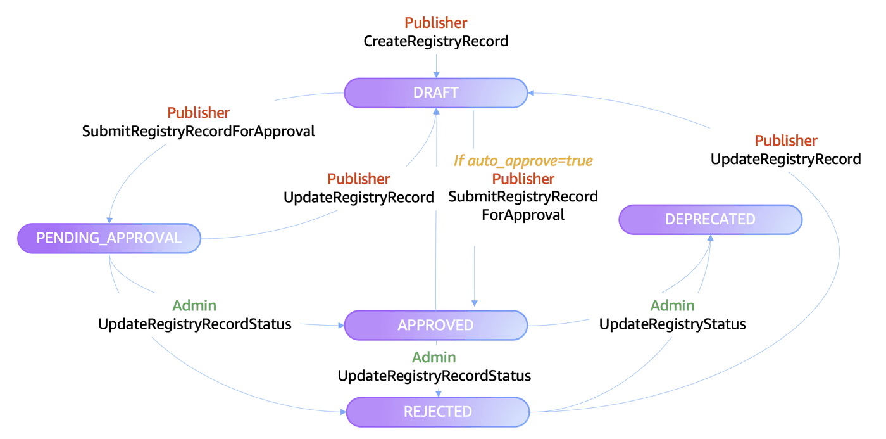

# 04 - Approval Workflows for Registry as Admin

This notebook demonstrates how to **approve and reject**  Registry records using two approaches:

1. **Manual approval** — Using the AWS Agent Registry SDK to list pending records, inspect them, and approve or reject with a reason
2. **Automated approval** — Using the registry's built-in `autoApproval` flag to automatically approve new submissions

## What You'll Learn

- Authenticate as the **Admin** persona and discover an existing registry
- List records pending approval and inspect their details
- **Approve** or **reject** records via the SDK with status reasons
- Create test records for the automation demo
- Enable the **autoApproval** flag on a registry to automatically approve new submissions
- Run an **end-to-end test** of the autoApproval workflow
- Compare manual vs autoApproval approaches and best practices

## Prerequisites

- boto3 >= 1.42.87
- Execute [notebook 01](01-create-user-personas-workflow.ipynb) to create IAM roles for admin, publisher and consumer personas
- Execute [notebook 02](02-creating-registry-workflow.ipynb) to create registry as Admin
- Execute [notebook 03](03-publishing-records-workflow.ipynb) to publish records to registry as Publisher

## Admin Approval Workflow


## Admin Approval API References

| # | API | Description |
|---|-----|-------------|
| 1 | [ListRegistryRecords](https://docs.aws.amazon.com/boto3/latest/reference/services/bedrock-agentcore-control/client/list_registry_records.html) | List all records in a registry and filter by status |
| 2 | [GetRegistryRecord](https://docs.aws.amazon.com/boto3/latest/reference/services/bedrock-agentcore-control/client/get_registry_record.html) | Inspect record details and verify status changes |
| 3 | [UpdateRegistryRecordStatus](https://docs.aws.amazon.com/boto3/latest/reference/services/bedrock-agentcore-control/client/update_registry_record_status.html) | Approve or reject a pending record with a status reason |
| 4 | [CreateRegistryRecord](https://docs.aws.amazon.com/boto3/latest/reference/services/bedrock-agentcore-control/client/create_registry_record.html) | Create a test record for the approval/rejection demo |
| 5 | [SubmitRegistryRecordForApproval](https://docs.aws.amazon.com/boto3/latest/reference/services/bedrock-agentcore-control/client/submit_registry_record_for_approval.html) | Submit a draft record for admin review |
| 6 | [GetRegistry](https://docs.aws.amazon.com/boto3/latest/reference/services/bedrock-agentcore-control/client/get_registry.html) | Check current registry configuration (autoApproval flag) |
| 7 | [UpdateRegistry](https://docs.aws.amazon.com/boto3/latest/reference/services/bedrock-agentcore-control/client/update_registry.html) | Toggle the autoApproval setting on a registry |
| 8 | [DeleteRegistryRecord](https://docs.aws.amazon.com/boto3/latest/reference/services/bedrock-agentcore-control/client/delete_registry_record.html) | Clean up test records after the demo |


### Notebook Chain

02 (create registry) → 03 (publish records) → **04 (this notebook)** → 05 (semantic search)

#### Use Case: Enterprise Payment Processing 
**Admin Persona:** AnyCompany registry administrator reviews submitted records through a human-in-the-loop approval process, where they evaluate each submission against security, compliance, and quality standards before deciding to approve or reject the record. Upon approval, the validated capabilities are published to the registry and become discoverable to authorized AI agents across the enterprise, while rejected submissions are returned to development teams with feedback for remediation.

---
## 1. Install boto3 SDK and dependencies

Install core dependencies (`boto3` and `python-dotenv`).

```python
!pip install boto3 python-dotenv --force-reinstall
```

## 2. Initialize boto3 Session as Admin

Assume the `admin_persona` IAM role and create a boto3 session with temporary credentials.

```python
import boto3
import json
import time
import os
import botocore.exceptions
import utils

AWS_REGION = os.environ.get("AWS_DEFAULT_REGION", "us-west-2")

# Auto-detect account ID from current credentials
sts = boto3.client("sts", region_name=AWS_REGION)
ACCOUNT_ID = sts.get_caller_identity()["Account"]
CALLER_ARN = sts.get_caller_identity()["Arn"]

ADMIN_ROLE_ARN = f"arn:aws:iam::{ACCOUNT_ID}:role/admin_persona"

print(f"Account:  {ADMIN_ROLE_ARN}")

# Assume the Admin role
creds = utils.assume_role(
    role_arn=ADMIN_ROLE_ARN,
    session_name="admin-session",
)

admin_session = boto3.Session(
    aws_access_key_id=creds["AccessKeyId"],
    aws_secret_access_key=creds["SecretAccessKey"],
    aws_session_token=creds["SessionToken"],
    region_name=AWS_REGION,
)
```

## 3. Initialize the Control Plane Client

The control plane (`bedrock-agentcore-control`) handles CRUD operations for registries and records.

```python
# Control plane client (admin operations)
cp_client = admin_session.client("bedrock-agentcore-control")
```

---
## 4. Select a Registry

Find an existing READY registry to work with. If you set `REGISTRY_ID` above, we validate it.
Otherwise, we pick the first READY registry from `list_registries`.

If no READY registry is found, you need to run **notebook 02** first to create one.

```python
REGISTRY_ID = ""  # Populate this placeholder in case you want to manually pick from above list

## if REGISTRY_ID is left empty, we pick the first READY registry from list_registries
registry_details = utils.get_or_select_registry(cp_client, REGISTRY_ID, AWS_REGION)
REGISTRY_ID = registry_details[0]
REGISTRY_ARN = registry_details[1]
```

---
## 5. List Existing Records

List all records currently in the registry, including any records published from notebook 03.
This gives us a baseline view before creating test records or performing approvals.

```python
try:
    all_records = utils.list_records_with_ids(cp_client, REGISTRY_ID)

    print(f"Total records in registry: {len(all_records)}\n")
    for rec in all_records:
        status_marker = "🟡" if rec["status"] == "PENDING_APPROVAL" else "•"
        print(f"  {status_marker} [{rec['status']}] {rec['name']} ({rec['descriptorType']}) — {rec['recordId']}")

    pending = utils.filter_pending_records(all_records)
    print(f"\n📋 Records pending approval: {len(pending)}")
    for rec in pending:
        print(f"  • {rec['name']} | {rec['descriptorType']} | {rec['recordId']}")

    if not pending:
        print("\n   No records pending approval right now.")

except botocore.exceptions.ClientError as e:
    error_code = e.response["Error"]["Code"]
    if error_code == "ConflictException":
        print(f"❌ Registry {REGISTRY_ID} is not in READY state.")
        print("   Wait for the registry to finish provisioning or check its status.")
    else:
        print(f"❌ Error listing records: {error_code} — {e}")
    raise
```

If you ran notebook 03, you should see records in `PENDING_APPROVAL` status above.

---
## 6. Manual Approval Workflow

In this section we demonstrate the manual admin approval process:
1. Approve records from notebook 03 (so they're searchable in notebook 05)
2. Create a test record and show reject record flow

### 6a. Approve Records from Notebook 03

If you ran notebook 03, those records are waiting for approval. Let's approve them
so they're searchable in notebook 05. The record transitions from `PENDING_APPROVAL` → `APPROVED` and becomes searchable by consumers.

```python
try:
    all_records = utils.list_records_with_ids(cp_client, REGISTRY_ID)
    pending = utils.filter_pending_records(all_records)

    # Filter out our test records (admin_approval_test_*)
    records_from_103 = [r for r in pending]

    if records_from_103:
        print(f"Found {len(records_from_103)} pending record(s) from notebook 03:\n")
        for rec in records_from_103:
            record_id = rec["recordId"]
            print(f"  Approving: {rec['name']} ({record_id})...")
            try:
                cp_client.update_registry_record_status(
                    registryId=REGISTRY_ID,
                    recordId=record_id,
                    status="APPROVED",
                    statusReason="Approved by admin in notebook 04 — record from notebook 03.",
                )
                verified = cp_client.get_registry_record(registryId=REGISTRY_ID, recordId=record_id)
                print(f"    ✅ Status: {verified['status']}")
            except botocore.exceptions.ClientError as e:
                error_code = e.response["Error"]["Code"]
                if error_code == "ConflictException":
                    print("    ⚠️  Record not in PENDING_APPROVAL state — may already be approved.")
                else:
                    print(f"    ❌ Error: {error_code} — {e}")
                    raise
    else:
        print("No records from notebook 03 found")

except botocore.exceptions.ClientError as e:
    error_code = e.response["Error"]["Code"]
    print(f"❌ Error listing records: {error_code} — {e}")
    raise
```

### 6b. Reject a Test Record

First, create a test record specifically for demonstrating the rejection flow, then submit it for approval.

```python
# Create a test record for rejection
try:
    reject_test_resp = cp_client.create_registry_record(
        registryId=REGISTRY_ID,
        name="admin_approval_test_reject",
        description="Test record created to demonstrate the admin rejection workflow.",
        descriptorType="CUSTOM",
        descriptors={
            "custom": {
                "inlineContent": json.dumps(
                    {
                        "type": "test-record",
                        "purpose": "rejection-demo",
                        "note": "This record intentionally has minimal metadata to demonstrate rejection.",
                    }
                )
            }
        },
        recordVersion="0.1",
    )
    REJECT_RECORD_ID = reject_test_resp["recordArn"].split("/")[-1]
    print(f"Created test record: {REJECT_RECORD_ID}")
    utils.wait_for_record_ready(cp_client, REGISTRY_ID, REJECT_RECORD_ID)

    # Submit for approval so it can be rejected
    cp_client.submit_registry_record_for_approval(registryId=REGISTRY_ID, recordId=REJECT_RECORD_ID)
    utils.wait_for_record_ready(cp_client, REGISTRY_ID, REJECT_RECORD_ID)
    print(f"Submitted for approval: {REJECT_RECORD_ID}")

except botocore.exceptions.ClientError as e:
    print(f"Error creating test record: {e}")
    raise
```

Now reject the test record to demonstrate the rejection flow.
The publisher can see the rejection reason and update the record accordingly.

```python
if REJECT_RECORD_ID:
    try:
        reject_resp = cp_client.update_registry_record_status(
            registryId=REGISTRY_ID,
            recordId=REJECT_RECORD_ID,
            status="REJECTED",
            statusReason="Record rejected — missing detailed tool descriptions. Please update and resubmit.",
        )
        print(f"❌ Record {REJECT_RECORD_ID} rejected.")

        # Verify the status change
        verified = cp_client.get_registry_record(registryId=REGISTRY_ID, recordId=REJECT_RECORD_ID)
        print(f"   Verified status: {verified['status']}")
        print(f"   Status reason:   {verified.get('statusReason', 'N/A')}")

    except botocore.exceptions.ClientError as e:
        error_code = e.response["Error"]["Code"]
        if error_code == "ConflictException":
            print(f"⚠️  Record {REJECT_RECORD_ID} is not in PENDING_APPROVAL state.")
            print("   It may have already been approved or rejected.")
        elif error_code == "ValidationException":
            print(f"⚠️  Record {REJECT_RECORD_ID} is not in PENDING_APPROVAL state.")
            print("   Make sure you ran Section 6 (submit for approval) first.")
        else:
            print(f"❌ Error rejecting record: {error_code} — {e}")
            raise
else:
    print("No reject test record found. Run Section 6 first.")
```

### List All Records

View all records in the registry after the approval and rejection operations above.

```python
all_records = utils.list_records_with_ids(cp_client, REGISTRY_ID)

print(f"Total records in registry: {len(all_records)}\n")
for rec in all_records:
    status_marker = "🟡" if rec["status"] == "PENDING_APPROVAL" else "•"
    print(f"  {status_marker} [{rec['status']}] {rec['name']} ({rec['descriptorType']}) — {rec['recordId']}")
```

---
## 7. Automated Approval (autoApproval Flag)

AWS Agent Registry provides a built-in **autoApproval** flag. When enabled, any new record submitted for approval is
automatically approved without manual intervention.

**Recommendation:** For production workloads, it is recommended for a thorough review of records before making them discoverable via the Registry.

The workflow:
1. Show current registry configuration (`autoApproval` should be `False` from notebook 02)
2. Update the registry to set `autoApproval: True`
3. Create a new test record and submit it for approval
4. List registry records to confirm it was automatically approved
5. Restore the registry back to `autoApproval: False`

### 7a. Show Current Registry Configuration

Verify the current `autoApproval` setting before making changes.

```python
try:
    registry_config = cp_client.get_registry(registryId=REGISTRY_ID)
    current_auto_approval = registry_config.get("approvalConfiguration", {}).get("autoApproval", False)

    print(f"Registry: {registry_config.get('name', 'N/A')} ({REGISTRY_ID})")
    print(f"Status:   {registry_config.get('status', 'N/A')}")
    print("\nCurrent approvalConfiguration:")
    print(f"  autoApproval: {current_auto_approval}")

    if current_auto_approval:
        print("\n⚠️  autoApproval is already True. Records are being auto-approved.")
        print("   We will still demonstrate the workflow below.")
    else:
        print("\n✅ autoApproval is False — manual approval is required.")
        print("   We will enable it in the next step.")

except botocore.exceptions.ClientError as e:
    error_code = e.response["Error"]["Code"]
    print(f"❌ Error getting registry config: {error_code} — {e}")
    raise
```

### 7b. Enable autoApproval

Update the registry to set `autoApproval: True`. After this change, any new record
submitted for approval will be automatically approved by the service.

```python
try:
    update_resp = cp_client.update_registry(
        registryId=REGISTRY_ID,
        approvalConfiguration={"optionalValue": {"autoApproval": True}},
    )

    print("✅ Registry updated — autoApproval is now enabled.")
    print(f"   Updated at: {update_resp.get('updatedAt', 'N/A')}")

    # Verify the change
    verify_config = cp_client.get_registry(registryId=REGISTRY_ID)
    verified_auto = verify_config.get("approvalConfiguration", {}).get("autoApproval", False)
    print(f"   Verified autoApproval: {verified_auto}")

    while True:
        r = cp_client.get_registry(registryId=REGISTRY_ID)
        if r["status"] == "READY":
            print("Registry is READY")
            break
        print(f"Status: {r['status']} - waiting...")
        time.sleep(3)

except botocore.exceptions.ClientError as e:
    error_code = e.response["Error"]["Code"]
    if error_code == "ConflictException":
        print(f"❌ Registry {REGISTRY_ID} is not in READY state.")
        print("   The registry must be in READY state before it can be updated.")
        print("   Wait for the registry to finish provisioning and re-run this cell.")
    elif error_code == "AccessDeniedException":
        print(f"❌ Access denied: {e}")
        print("   Verify admin_persona has bedrock-agentcore:UpdateRegistry permission.")
        raise
    else:
        print(f"❌ Error updating registry: {error_code} — {e}")
        raise
```

### 7c. Create and Submit a Test Record (autoApproval Enabled)

Create a new test A2A record and submit it for approval. With `autoApproval: True`,
the record should be automatically approved without any manual intervention.

### Adding a record in a registry with auto-approval enabled

```python
from botocore.exceptions import ClientError

a2a_agent_card = json.dumps(
    {
        "protocolVersion": "0.3.0",
        "name": "Refund Processing Agent",
        "description": "Handles payment refunds",
        "url": "https://example.com/agents/refund",
        "version": "1.0.0",
        "capabilities": {"streaming": True},
        "defaultInputModes": ["text"],
        "defaultOutputModes": ["text"],
        "preferredTransport": "JSONRPC",
        "skills": [
            {
                "id": "refund_handling",
                "name": "Refund Handling",
                "description": "Handle refunds",
                "tags": [],
            }
        ],
    }
)


try:
    a2a_resp = cp_client.create_registry_record(
        registryId=REGISTRY_ID,
        name="a2a_refund_agent_auto_approval",
        description="A2A agent for refunds",
        descriptorType="A2A",
        descriptors={
            "a2a": {
                "agentCard": {
                    "schemaVersion": "0.3",
                    "inlineContent": a2a_agent_card,
                }
            }
        },
        recordVersion="1.0",
    )
    A2A_RECORD_ID = a2a_resp["recordArn"].split("/")[-1]  # recordArn, not registryRecordArn
    print(f"Created A2A record: {A2A_RECORD_ID}")
    utils.wait_for_record_ready(cp_client, REGISTRY_ID, A2A_RECORD_ID)

except ClientError as e:
    if e.response["Error"]["Code"] == "ConflictException":
        records = cp_client.list_registry_records(registryId=REGISTRY_ID)
        for rec in records.get("registryRecords", []):
            if rec["name"] == "payment_agent":
                A2A_RECORD_ID = rec["recordId"]  # recordId, not registryRecordId
                break
        print(f"  Using existing record: {A2A_RECORD_ID}")
    else:
        raise

print(f"\nA2A_RECORD_ID = {A2A_RECORD_ID}")
```

### Submitting the record for auto-approval

```python
# Wait for record to be ready, then submit for approval
try:
    print(f"Waiting for record {A2A_RECORD_ID} to be ready...")
    ready_resp = utils.wait_for_record_ready(cp_client, REGISTRY_ID, A2A_RECORD_ID)

    if ready_resp["status"] == "DRAFT":
        cp_client.submit_registry_record_for_approval(registryId=REGISTRY_ID, recordId=A2A_RECORD_ID)
        print("✅ Record submitted for approval — autoApproval should handle it automatically.")
    elif ready_resp["status"] == "PENDING_APPROVAL":
        print("Record is already PENDING_APPROVAL.")
    elif ready_resp["status"] == "APPROVED":
        print("Record is already APPROVED — autoApproval may have already processed it.")
    else:
        print(f"Record is in {ready_resp['status']} state. Run cleanup first.")

except TimeoutError as e:
    print(f"⏰ {e}")
except botocore.exceptions.ClientError as e:
    error_code = e.response["Error"]["Code"]
    if error_code == "ConflictException":
        print("⚠️  Record not in DRAFT state — may already be submitted.")
        current = cp_client.get_registry_record(registryId=REGISTRY_ID, recordId=A2A_RECORD_ID)
        print(f"   Current status: {current['status']}")
    else:
        raise
```

### 7d. Verify Auto-Approval

List registry records to confirm the test record was automatically approved.
With `autoApproval: True`, the record should transition directly to `APPROVED`
after submission — no manual intervention needed.

```python
# Poll for auto-approval to process (up to 60 seconds)
print("Polling for auto-approval (every 5s, up to 60s)...")
poll_interval = 5
poll_timeout = 60
elapsed = 0
final_status = None

try:
    while elapsed < poll_timeout:
        auto_record = cp_client.get_registry_record(registryId=REGISTRY_ID, recordId=A2A_RECORD_ID)
        final_status = auto_record.get("status")
        print(f"  [{elapsed}s] Status: {final_status}")

        if final_status != "PENDING_APPROVAL":
            break

        time.sleep(poll_interval)
        elapsed += poll_interval

    # print(f"\nRecord: {AUTO_APPROVAL_RECORD_NAME}")
    print(f"  Record ID:     {A2A_RECORD_ID}")
    print(f"  Final status:  {final_status}")
    print(f"  Status reason: {auto_record.get('statusReason', 'N/A')}")

    if final_status == "APPROVED":
        print("\n\u2705 Auto-approval worked! The record was approved automatically.")
        print("   No manual intervention was needed.")
    elif final_status == "PENDING_APPROVAL":
        print(f"\n\u23f3 Record is still PENDING_APPROVAL after {poll_timeout}s.")
        print("   Try re-running this cell, or check that autoApproval was enabled")
        print("   correctly in Section 7b.")
    else:
        print(f"\n\u26a0\ufe0f  Unexpected status: {final_status}")

except botocore.exceptions.ClientError as e:
    error_code = e.response["Error"]["Code"]
    print(f"\u274c Error checking record status: {error_code} \u2014 {e}")
    raise

# Also list all records to show the full picture
print("\n--- All Registry Records ---")
all_records_after = utils.list_records_with_ids(cp_client, REGISTRY_ID)
for rec in all_records_after:
    print(f"  [{rec['status']}] {rec['name']} \u2014 {rec['recordId']}")
```

### 7e. Delete the Auto-Approval Test Record

Clean up the test record created in 7c to keep the registry tidy before restoring the approval configuration.

```python
# Delete the auto-approval test record
try:
    cp_client.delete_registry_record(registryId=REGISTRY_ID, recordId=A2A_RECORD_ID)
    print(f"✅ Deleted auto-approval test record: {A2A_RECORD_ID}")
except botocore.exceptions.ClientError as e:
    error_code = e.response["Error"]["Code"]
    if error_code == "ResourceNotFoundException":
        print(f"Record {A2A_RECORD_ID} already deleted.")
    else:
        print(f"❌ Error deleting record: {error_code} — {e}")
        raise
```

### 7f. Restore autoApproval to False

Restore the registry to require manual approval so other notebooks (and production
workflows) continue to work as expected.

```python
try:
    restore_resp = cp_client.update_registry(
        registryId=REGISTRY_ID,
        approvalConfiguration={"optionalValue": {"autoApproval": False}},
    )

    print("✅ Registry restored — autoApproval is now disabled.")
    print(f"   Updated at: {restore_resp.get('updatedAt', 'N/A')}")

    # Verify the change
    verify_restore = cp_client.get_registry(registryId=REGISTRY_ID)
    verified_auto = verify_restore.get("approvalConfiguration", {}).get("autoApproval", False)
    print(f"   Verified autoApproval: {verified_auto}")

except botocore.exceptions.ClientError as e:
    error_code = e.response["Error"]["Code"]
    print(f"❌ Error restoring registry: {error_code} — {e}")
    print("   ⚠️  IMPORTANT: Manually set autoApproval back to False to avoid")
    print("   unintended auto-approvals in other notebooks.")
    print("   The cleanup section (Section 8) will also attempt to restore this setting.")
    raise
```

## Pre-requisites
- **Notebook 01** — [Create User Personas](01-create-user-personas-workflow.ipynb): Set up user personas: admin, publisher, consumer
- **Notebook 02** — [Creating Registry](02-creating-registry-workflow.ipynb): Admin creates a registry
- **Notebook 03** — [Publishing Records](03-publishing-records-workflow.ipynb): Publish records as a Publisher

## Next Steps
- **Notebook 05** — [Semantic Search](05-search-registry-workflow.ipynb): Search approved records using NLQ as a Consumer
