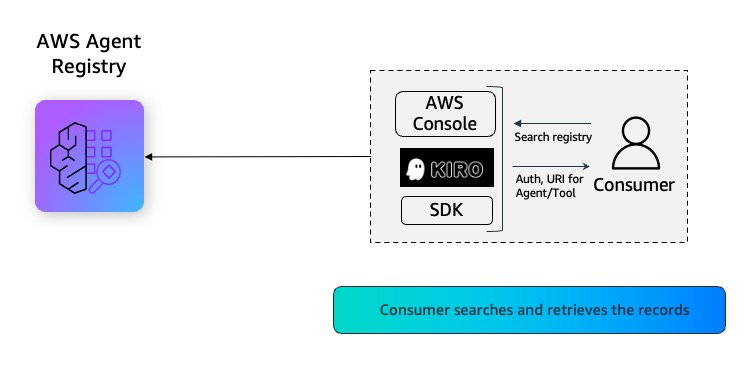

# 05 - Semantic Search as Consumer

This notebook walks through the **Consumer** persona workflow for discovering agents and tools in AWS Agent Registry using semantic search, then extracting connection metadata for runtime integration.

## What You'll Learn

- Browse the catalog — list registries and records via the control plane (read-only)
- Verify consumer guardrails — confirm the consumer cannot create, modify, or approve records
- Semantic search — find agents and tools using natural language queries
- Filtered search — narrow results by descriptor type, name, and version
- Extract connection metadata — parse MCP server schemas, A2A agent cards, and custom descriptors

## Prerequisites

- boto3 >= 1.42.87
- Execute [notebook 01](01-create-user-personas-workflow.ipynb) to create IAM roles for admin, publisher and consumer personas
- Execute [notebook 02](02-creating-registry-workflow.ipynb) to create registry as Admin
- Execute [notebook 03](03-publishing-records-workflow.ipynb) to publish records to registry as Publisher
- Execute [notebook 04](04-admin-approval-workflow.ipynb) for approval workflows

## Semantic Search as Consumer


## Consumer API References

| # | API | Description |
|---|-----|-------------|
| 1 | [ListRegistries](https://docs.aws.amazon.com/boto3/latest/reference/services/bedrock-agentcore-control/client/list_registries.html) | Browse available registries (control plane) |
| 2 | [ListRegistryRecords](https://docs.aws.amazon.com/boto3/latest/reference/services/bedrock-agentcore-control/client/list_registry_records.html) | Browse records in a registry (control plane) |
| 3 | [GetRegistryRecord](https://docs.aws.amazon.com/boto3/latest/reference/services/bedrock-agentcore-control/client/get_registry_record.html) | Get full record details (control plane) |
| 4 | [SearchRegistryRecords](https://docs.aws.amazon.com/boto3/latest/reference/services/bedrock-agentcore/client/search_registry_records.html) | Semantic search over APPROVED records (data plane) |

### Notebook Chain

02 (create registry) → 03 (publish records) → 04 (admin approvals) → **05 (this notebook)**

#### Use Case: Enterprise Payment Processing 
**Consumer Persona:** Once the admin approves the records, AI agents across the AnyCompany enterprise can discover and consume the approved Payment Processing capabilities through flexible search capabilities—including natural language queries ("find payment processing tools"), semantic search for conceptually related capabilities, and advanced filtering operators (in, ne, or, and) for precise criteria matching. This enables agents to quickly locate and integrate the payment processing, refund handling, and transaction status tools they need, seamlessly invoking these capabilities without custom integration code to accelerate deployment of payment-enabled customer service experiences across web chat, mobile app, and voice channels.

---
## 1. Install boto3 SDK and dependencies

Install core dependencies (`boto3` and `python-dotenv`).

```python
!pip install boto3 python-dotenv --force-reinstall
```

## 2. Initialize boto3 Session as Consumer

Assume the `consumer_persona` IAM role and create a boto3 session with temporary credentials. The consumer has read-only access to registries and records.

```python
import os
import json
import boto3

import utils

AWS_REGION = os.environ.get("AWS_DEFAULT_REGION", "us-west-2")

# Auto-detect account
sts = boto3.client("sts", region_name=AWS_REGION)
ACCOUNT_ID = sts.get_caller_identity()["Account"]

# Assume consumer role
CONSUMER_ROLE_ARN = f"arn:aws:iam::{ACCOUNT_ID}:role/consumer_persona"
creds = utils.assume_role(role_arn=CONSUMER_ROLE_ARN, session_name="consumer-session")

consumer_session = boto3.Session(
    aws_access_key_id=creds["AccessKeyId"],
    aws_secret_access_key=creds["SecretAccessKey"],
    aws_session_token=creds["SessionToken"],
    region_name=AWS_REGION,
)
```

---
## 3. Initialize the Control Plane Client

The control plane (`bedrock-agentcore-control`) handles CRUD operations for registries and records.

```python
# Control plane client (browse, guardrails)
cp_client = consumer_session.client("bedrock-agentcore-control")
```

## 4. Select a Registry

Find an existing READY registry to search. If `REGISTRY_ID` is set, we validate it. Otherwise, we pick the first READY registry.

```python
REGISTRY_ID = ""  # Populate this placeholder in case you want to manually pick from above list

# if REGISTRY_ID is left empty, we pick the first READY registry from list_registries

registry_details = utils.get_or_select_registry(cp_client, REGISTRY_ID, AWS_REGION)
REGISTRY_ID = registry_details[0]
REGISTRY_ARN = registry_details[1]
```

---
## 5. Basic Semantic Search

The `SearchRegistryRecords` API uses natural language to find relevant agents and tools.
It matches against record names, descriptions, and descriptor content.

Key behaviors:
- Only `APPROVED` records are returned
- Results are ordered by relevance to the search query
- The API is on the data plane (`bedrock-agentcore`), not the control plane

```python
# Data plane client (semantic search)
dp_client = consumer_session.client("bedrock-agentcore")
```

### Simple Natural Language Search

Search for records using a natural language query. Results are ranked by relevance.

```python
results = dp_client.search_registry_records(
    registryIds=[REGISTRY_ARN],
    searchQuery="refund chargeback analysis",
    maxResults=5,
)

print(f"Found {len(results['registryRecords'])} matching records:\n")
for rec in results["registryRecords"]:
    print(f"  [{rec['status']}] {rec['name']}")
    print(f"    Type: {rec['descriptorType']}")
    print(f"    Description: {rec.get('description', 'N/A')}")
    print(f"    Record ID: {rec['recordId']}")
```

### Try Multiple Queries

Run several different natural language queries to see how semantic matching works across different terms.

```python
# Try different natural language queries to see how semantic matching works
queries = [
    "process a payment",
    "refund chargeback analytics",
    "credit score risk assessment",
    "detect fraudulent transactions",
    "billing dispute resolution",
    "reconcile payments across systems",
    "loan application processing",
]

for q in queries:
    results = dp_client.search_registry_records(
        registryIds=[REGISTRY_ARN],
        searchQuery=q,
        maxResults=3,
    )
    count = len(results["registryRecords"])
    print(f"🔍 '{q}'  →  {count} result(s)")
    for rec in results["registryRecords"]:
        print(f"     [{rec['descriptorType']}] {rec['name']}")
    print()
```

---
## 6. Filtered Search

The `filters` parameter accepts a JSON document with structured operators to narrow results.

### Supported Filter Fields
- `descriptorType` — MCP, A2A, CUSTOM, AGENT_SKILLS
- `name` — exact record name
- `version` — record version string

### Supported Operators

| Operator | Meaning | Example |
|----------|---------|---------|
| `$eq` | Equals | `{"descriptorType": {"$eq": "MCP"}}` |
| `$ne` | Not equals | `{"descriptorType": {"$ne": "CUSTOM"}}` |
| `$in` | In list | `{"descriptorType": {"$in": ["MCP", "A2A"]}}` |
| `$and` | Logical AND | `{"$and": [filter1, filter2]}` |
| `$or` | Logical OR | `{"$or": [filter1, filter2]}` |

```python
# Filter: only MCP records
results = dp_client.search_registry_records(
    registryIds=[REGISTRY_ARN],
    searchQuery="fraud detection suspicious activity",
    maxResults=10,
    filters={"descriptorType": {"$eq": "MCP"}},
)

print("Filter: descriptorType == MCP")
print(f"Results: {len(results['registryRecords'])}\n")
for rec in results["registryRecords"]:
    print(f"  [{rec['descriptorType']}] {rec['name']}")
```

### Exclude by Type (`$ne`)

Use the `$ne` (not equals) operator to exclude a specific descriptor type.

```python
# Filter: exclude CUSTOM records
results = dp_client.search_registry_records(
    registryIds=[REGISTRY_ARN],
    searchQuery="credit score lending risk",
    maxResults=10,
    filters={"descriptorType": {"$ne": "CUSTOM"}},
)

print("Filter: descriptorType != CUSTOM")
print(f"Results: {len(results['registryRecords'])}\n")
for rec in results["registryRecords"]:
    print(f"  [{rec['descriptorType']}] {rec['name']}")
```

### Include Multiple Types (`$in`)

Use the `$in` operator to match records of multiple descriptor types.

```python
# Filter: MCP or A2A records only
results = dp_client.search_registry_records(
    registryIds=[REGISTRY_ARN],
    searchQuery="billing dispute resolution",
    maxResults=10,
    filters={"descriptorType": {"$in": ["MCP", "A2A"]}},
)

print("Filter: descriptorType IN [MCP, A2A]")
print(f"Results: {len(results['registryRecords'])}\n")
for rec in results["registryRecords"]:
    print(f"  [{rec['descriptorType']}] {rec['name']}")
```

### Compound Filter (`$and`)

Combine multiple conditions with `$and` — here we filter for MCP records with a specific version.

```python
# Compound filter: MCP records with a specific version
results = dp_client.search_registry_records(
    registryIds=[REGISTRY_ARN],
    searchQuery="reconcile settlement",
    maxResults=10,
    filters={"$and": [{"descriptorType": {"$eq": "MCP"}}, {"version": {"$eq": "1.0"}}]},
)

print("Filter: descriptorType == MCP AND version == 1.0")
print(f"Results: {len(results['registryRecords'])}\n")
for rec in results["registryRecords"]:
    print(f"  [{rec['descriptorType']}] {rec['name']} (v{rec.get('version', '?')})")
```

### OR Filter (`$or`)

Use `$or` to match records that satisfy any of the given conditions.

```python
# OR filter: A2A or CUSTOM records
results = dp_client.search_registry_records(
    registryIds=[REGISTRY_ARN],
    searchQuery="loan application credit check",
    maxResults=10,
    filters={
        "$or": [
            {"descriptorType": {"$eq": "A2A"}},
            {"descriptorType": {"$eq": "CUSTOM"}},
        ]
    },
)

print("Filter: descriptorType == A2A OR descriptorType == CUSTOM")
print(f"Results: {len(results['registryRecords'])}\n")
for rec in results["registryRecords"]:
    print(f"  [{rec['descriptorType']}] {rec['name']}")
```

---
## 7. Extract Connection Metadata from Search Results

Search results include full `descriptors` — the connection metadata a consumer needs
to integrate with the discovered agent or tool at runtime.

| Record Type | Descriptor Path | What You Get |
|-------------|----------------|--------------|
| MCP | `descriptors.mcp.server.inlineContent` | Server name, packages, transport config |
| MCP | `descriptors.mcp.tools.inlineContent` | Available tools with input schemas |
| A2A | `descriptors.a2a.agentCard.inlineContent` | Agent URL, skills, capabilities |
| CUSTOM | `descriptors.custom.inlineContent` | User-defined endpoint/config |

```python
# Search and extract MCP connection metadata
results = dp_client.search_registry_records(
    registryIds=[REGISTRY_ARN],
    searchQuery="payment",
    maxResults=5,
    filters={"descriptorType": {"$eq": "MCP"}},
)

for rec in results["registryRecords"]:
    print(f"=== MCP Record: {rec['name']} ===\n")

    mcp = rec.get("descriptors", {}).get("mcp", {})

    # Parse server schema
    server_raw = mcp.get("server", {}).get("inlineContent", "{}")
    server = json.loads(server_raw) if isinstance(server_raw, str) else server_raw
    print(f"  Server: {server.get('name', 'N/A')}")
    print(f"  Version: {server.get('version', 'N/A')}")
    print(f"  Description: {server.get('description', 'N/A')}")
    for pkg in server.get("packages", []):
        print(f"  Package: {pkg.get('identifier')} ({pkg.get('registryType', 'N/A')})")
        print(f"  Transport: {pkg.get('transport', {}).get('type', 'N/A')}")

    # Parse tool schema
    tools_raw = mcp.get("tools", {}).get("inlineContent", "{}")
    tools = json.loads(tools_raw) if isinstance(tools_raw, str) else tools_raw
    print(f"\n  Tools ({len(tools.get('tools', []))}):")
    for tool in tools.get("tools", []):
        params = list(tool.get("inputSchema", {}).get("properties", {}).keys())
        print(f"    • {tool['name']}: {tool.get('description', '')}")
        print(f"      Parameters: {params}")
    print()

if not results["registryRecords"]:
    print("No MCP records found. Ensure MCP records are APPROVED in the registry.")
```

### Extract A2A Agent Card

Parse the `descriptors.a2a.agentCard` to get the agent URL, skills, and capabilities.

```python
# Search and extract A2A connection metadata
results = dp_client.search_registry_records(
    registryIds=[REGISTRY_ARN],
    searchQuery="credit score risk assessment agent",
    maxResults=5,
    filters={"descriptorType": {"$eq": "A2A"}},
)

for rec in results["registryRecords"]:
    print(f"=== A2A Record: {rec['name']} ===\n")

    a2a = rec.get("descriptors", {}).get("a2a", {})
    card_raw = a2a.get("agentCard", {}).get("inlineContent", "{}")
    card = json.loads(card_raw) if isinstance(card_raw, str) else card_raw

    print(f"  Agent: {card.get('name', 'N/A')}")
    print(f"  URL: {card.get('url', 'N/A')}")
    print(f"  Version: {card.get('version', 'N/A')}")
    print(f"  Description: {card.get('description', 'N/A')}")
    print(f"\n  Skills ({len(card.get('skills', []))}):")
    for skill in card.get("skills", []):
        print(f"    • {skill.get('name', skill.get('id', 'N/A'))}: {skill.get('description', '')}")
    print()

if not results["registryRecords"]:
    print("No A2A records found. This is expected if A2A records haven't been created/approved yet.")
```

### Extract CUSTOM Content

Parse the `descriptors.custom.inlineContent` for user-defined endpoint or configuration data.

```python
# Search and extract CUSTOM connection metadata
results = dp_client.search_registry_records(
    registryIds=[REGISTRY_ARN],
    searchQuery="custom endpoint configuration",
    maxResults=5,
    filters={"descriptorType": {"$eq": "CUSTOM"}},
)

for rec in results["registryRecords"]:
    print(f"=== CUSTOM Record: {rec['name']} ===\n")

    custom = rec.get("descriptors", {}).get("custom", {})
    content_raw = custom.get("inlineContent", "{}")
    content = json.loads(content_raw) if isinstance(content_raw, str) else content_raw

    print("  Content:")
    print(json.dumps(content, indent=4))
    print()

if not results["registryRecords"]:
    print("No CUSTOM records found. This is expected if CUSTOM records haven't been created/approved yet.")
```

---
## 8. Search Behavior & Edge Cases

Understanding how search behaves in boundary conditions.

```python
# maxResults controls how many results are returned (1-20, default 10)
print("=== Pagination: maxResults ===\n")
for n in [1, 3, 10, 20]:
    results = dp_client.search_registry_records(
        registryIds=[REGISTRY_ARN],
        searchQuery="transaction processing",
        maxResults=n,
    )
    print(f"  maxResults={n:<3} → returned {len(results['registryRecords'])} records")
```

### Empty Result Set

A query that matches nothing returns an empty list — no error is raised.

```python
# Query that should match nothing
results = dp_client.search_registry_records(
    registryIds=[REGISTRY_ARN],
    searchQuery="quantum teleportation flux capacitor",
    maxResults=5,
)

print("Query: 'quantum teleportation flux capacitor'")
print(f"Results: {len(results['registryRecords'])}\n")
if not results["registryRecords"]:
    print("✅ Empty result set returned (no error) — this is expected behavior.")
```

---
## 9. Cleanup (All Notebooks)

This section cleans up all resources created across notebooks 01–05:
- Delete all registry records (from notebooks 03, 04, 05)
- Delete the registry (from notebook 02)
- Delete the three IAM persona roles (from notebook 01)

⚠️ Only run this after you are done with all notebooks. All code is commented out by default.

### Step 1: Assume Admin Role

Admin permissions are required to delete registries, records, and IAM roles.

```python
# # Assume admin role for cleanup
# admin_creds = utils.assume_role(
#     role_arn=f"arn:aws:iam::{ACCOUNT_ID}:role/admin_persona",
#     session_name="admin-cleanup-session",
# )
# admin_session = boto3.Session(
#     aws_access_key_id=admin_creds["AccessKeyId"],
#     aws_secret_access_key=admin_creds["SecretAccessKey"],
#     aws_session_token=admin_creds["SessionToken"],
#     region_name=AWS_REGION,
# )
# admin_cp = admin_session.client("bedrock-agentcore-control")
# iam_client = boto3.client("iam", region_name=AWS_REGION)
# print("Admin session ready for cleanup.")
```

### Step 2: Delete All Registry Records

Delete every record in the registry (MCP, A2A, CUSTOM records from notebooks 03 and 04).

```python
# # Delete all records in the registry
# try:
#     records = admin_cp.list_registry_records(registryId=REGISTRY_ID)
#     all_recs = records.get("registryRecords", [])
#     print(f"Found {len(all_recs)} record(s) to delete.\n")
#     for rec in all_recs:
#         try:
#             admin_cp.delete_registry_record(
#                 registryId=REGISTRY_ID, recordId=rec["recordId"]
#             )
#             print(f"  ✅ Deleted: {rec['name']} ({rec['recordId']})")
#         except Exception as e:
#             print(f"  ⚠️  Failed: {rec['name']} — {e}")
# except Exception as e:
#     print(f"Error listing records: {e}")
```

### Step 3: Delete the Registry

Delete the registry created in notebook 02. The registry must have no records before deletion.

```python
# # Delete the registry
# import time
# try:
#     # Wait for any pending record deletions to complete
#     print("Waiting 10s for record deletions to propagate...")
#     time.sleep(10)

#     admin_cp.delete_registry(registryId=REGISTRY_ID)
#     print(f"✅ Deleted registry: {REGISTRY_ID}")

#     # Wait for deletion to complete
#     print("Waiting for registry deletion...")
#     for _ in range(20):
#         try:
#             r = admin_cp.get_registry(registryId=REGISTRY_ID)
#             print(f"  Status: {r['status']}")
#             if r["status"] == "DELETE_FAILED":
#                 print(f"  ❌ Delete failed: {r.get('statusReason', 'unknown')}")
#                 break
#             time.sleep(5)
#         except admin_cp.exceptions.ResourceNotFoundException:
#             print("  ✅ Registry deleted successfully.")
#             break
# except admin_cp.exceptions.ResourceNotFoundException:
#     print(f"Registry {REGISTRY_ID} not found — already deleted.")
# except Exception as e:
#     print(f"Error deleting registry: {e}")
```

### Step 4: Delete IAM Persona Roles

Delete the three persona roles (`admin_persona`, `publisher_persona`, `consumer_persona`) created in notebook 01.

```python
# # Delete IAM persona roles
# PERSONA_ROLES = ["admin_persona", "publisher_persona", "consumer_persona"]
# POLICY_NAMES = {"admin_persona": "AdminPolicy", "publisher_persona": "PublisherPolicy", "consumer_persona": "ConsumerPolicy"}

# for role_name in PERSONA_ROLES:
#     print(f"\nCleaning up: {role_name}")
#     try:
#         # Delete inline policies
#         try:
#             inline = iam_client.list_role_policies(RoleName=role_name)
#             for policy_name in inline.get("PolicyNames", []):
#                 iam_client.delete_role_policy(RoleName=role_name, PolicyName=policy_name)
#                 print(f"  Deleted inline policy: {policy_name}")
#         except iam_client.exceptions.NoSuchEntityException:
#             pass

#         # Detach managed policies
#         try:
#             attached = iam_client.list_attached_role_policies(RoleName=role_name)
#             for policy in attached.get("AttachedPolicies", []):
#                 iam_client.detach_role_policy(RoleName=role_name, PolicyArn=policy["PolicyArn"])
#                 print(f"  Detached: {policy['PolicyArn']}")
#         except iam_client.exceptions.NoSuchEntityException:
#             pass

#         # Delete the role
#         iam_client.delete_role(RoleName=role_name)
#         print(f"  ✅ Deleted role: {role_name}")

#     except iam_client.exceptions.NoSuchEntityException:
#         print(f"  Role {role_name} not found — already deleted.")
#     except Exception as e:
#         print(f"  ❌ Error: {e}")

# print("\n🧹 Full cleanup complete.")
```

---
## Pre-requisite Notebooks
- **Notebook 01** — [Create User Personas](01-create-user-personas-workflow.ipynb): Set up user personas: admin, publisher, consumer
- **Notebook 02** — [Creating Registry](02-creating-registry-workflow.ipynb): Admin creates a registry
- **Notebook 03** — [Publishing Records](03-publishing-records-workflow.ipynb): Publish records as a Publisher
- **Notebook 04** — [Admin Approval](04-admin-approval-workflow.ipynb): Admin Approval workflow

## Summary

| What We Did | API Used | Plane |
|-------------|----------|-------|
| Listed registries | `ListRegistries` | Control |
| Browsed records | `ListRegistryRecords` | Control |
| Inspected record details | `GetRegistryRecord` | Control |
| Verified consumer guardrails | Various write APIs | Control |
| Semantic search (natural language) | `SearchRegistryRecords` | Data |
| Filtered search (`$eq`, `$ne`, `$in`, `$and`, `$or`) | `SearchRegistryRecords` | Data |
| Extracted MCP server/tool metadata | Parse `descriptors.mcp` | — |
| Extracted A2A agent card | Parse `descriptors.a2a` | — |
| Extracted CUSTOM content | Parse `descriptors.custom` | — |

### Key Takeaways

- **Search only returns APPROVED records** — the approval workflow is the gateway to discoverability
- **Semantic search matches against names, descriptions, AND descriptor content** — rich descriptors improve findability
- **Filters use MongoDB-style operators** (`$eq`, `$ne`, `$in`, `$and`, `$or`) on `name`, `descriptorType`, `version`
- **Consumers are read-only** — they cannot create, modify, approve, or delete anything
- **Search is eventually consistent** — newly approved records may take 10-30 seconds to appear
