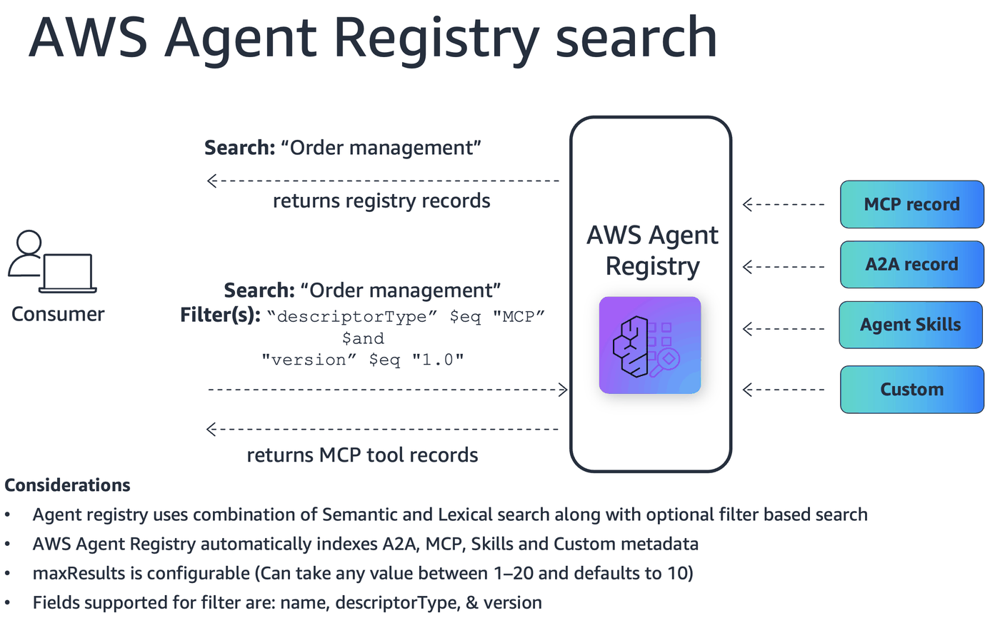

# Searching the metadata in agent registry

This notebook demonstrates how to use AWS Agent Registry's semantic search.

## Scenario

A developer at an e-commerce company needs to wire up a new fulfillment agent. The platform already
has deployed MCP tools and A2A agents — but no one knows exactly what is available or what each tool
can do. The developer uses the registry's natural-language search to discover the right tools without
needing to read internal documentation or ask colleagues.

## Tools in the Registry

| Tool | Protocol | Purpose |
|---|---|---|
| `order_lookup_tool` | MCP | Look up order details and list orders by customer |
| `order_update_tool` | MCP | Update order status or shipping address |
| `order_cancel_tool` | MCP | Cancel an order |
| `email_send_tool` | MCP | Send transactional emails to customers |
| `email_template_tool` | MCP | Manage reusable email templates |
| `sms_notify_tool` | MCP | Send SMS notifications |
| `payment_status_tool` | MCP | Look up payment status for an order |
| `inventory_check_tool` | MCP | Check available stock for one or more SKUs |
| `shipping_track_tool` | MCP | Track shipments and get delivery estimates |
| `returns_processing_tool` | MCP (remote) | Process product returns and generate return labels |
| `loyalty_rewards_tool` | MCP (remote) | Manage loyalty points and redeem rewards |
| `payment_refund_tool` | A2A | Issue refunds with multi-step validation |
| `inventory_reserve_tool` | A2A | Reserve inventory with rollback support |
| `shipping_update_tool` | A2A | Create shipments with carrier selection and status updates |

## What You'll Learn

- Seed the registry with sample e-commerce tools
- Use `SearchRegistryRecords` with **natural-language queries** to discover tools
- **Filter results with metadata filters** (`$eq`, `$ne`, `$in`, `$and`, `$or`)
- **Drill down** into record details to extract connection information
- Handle **cross-type discovery** where a single query returns mixed protocols

## Architecture



## How Semantic Search Works

AWS Agent Registry uses **hybrid search** that combines semantic understanding with keyword matching.
When you call `SearchRegistryRecords`, two searches run in parallel and the results are merged into
a single ranked list:

- **Semantic search** converts your query into a vector representation and compares it against
  vectorized record content. This finds conceptually related records even when the exact words
  don't appear in the record. For example, a query for "process a customer return" can match a record
  named `returns_processing_tool`.
- **Keyword search** matches your query against the text content of record fields using
  traditional keyword relevance. This is effective for exact name lookups and specific
  technical terms.

Results are ranked by combined relevance across both modes. A record that scores highly in
both semantic and keyword search will rank higher than one that scores well in only one.
Within keyword search, the record **name** has the strongest influence, followed by
**description** and **descriptor content** equally.

### What gets indexed

The entire record is vectorized for semantic search, including:

- **Name** — Used for keyword matching. Clear, descriptive names improve discoverability.
- **Description** — Used for both keyword and semantic matching. Natural-language descriptions
  that explain purpose and use cases are more discoverable than terse technical labels.
- **Descriptors** — The full protocol definition (MCP server/tools, A2A agent card, custom JSON)
  is used for semantic matching. This includes tool names, tool descriptions, input parameter
  names, and capability summaries.

### Writing effective queries

- **Exact name lookup** — Use a short, specific query: `"payment_status_tool"` or `"order_lookup"`.
- **Capability exploration** — Use natural language: `"process a customer refund for a returned item"`.
  Semantic search understands intent, so matching records don't need to contain those exact words.
- **Don't mix filters into the query text** — A query like `"find all MCP servers for payments"`
  sends the entire sentence through semantic search, which interprets "MCP servers" as part of
  the conceptual intent rather than a filter. Instead, use metadata filters for attribute
  constraints and keep the query focused on the topic:
  ```python
  dp_client.search_registry_records(
      registryIds=[REGISTRY_ARN],
      searchQuery="process a refund",
      filters={"descriptorType": {"$eq": "MCP"}}
  )
  ```

### Writing discoverable records

- Write descriptions that explain what the resource does and the problems it solves.
- Provide complete tool definitions for MCP servers — tool descriptions and input parameter
  descriptions all contribute to search relevance.
- Include relevant keywords in your name and description that consumers are likely to search for.

Only records in **Approved** status appear in search results. Records in Draft, Pending Approval,
Rejected, or Deprecated status are not returned.

## Setup

### Prerequisites
- boto3 with AgentCore service support
- IAM user or role with the permissions below (replace `ACCOUNT_ID` and region as needed)

<details>
<summary>Required IAM policy (click to expand)</summary>

```json
{
    "Version": "2012-10-17",
    "Statement": [
        {
            "Sid": "AllowCreateRegistry",
            "Effect": "Allow",
            "Action": ["bedrock-agentcore:CreateRegistry"],
            "Resource": ["arn:aws:bedrock-agentcore:us-west-2:ACCOUNT_ID:*"]
        },
        {
            "Sid": "AllowGetUpdateDeleteRegistry",
            "Effect": "Allow",
            "Action": [
                "bedrock-agentcore:GetRegistry",
                "bedrock-agentcore:DeleteRegistry"
            ],
            "Resource": ["arn:aws:bedrock-agentcore:us-west-2:ACCOUNT_ID:registry/*"]
        },
        {
            "Sid": "AllowCreateAndListRecords",
            "Effect": "Allow",
            "Action": [
                "bedrock-agentcore:CreateRegistryRecord",
                "bedrock-agentcore:SearchRegistryRecords"
            ],
            "Resource": ["arn:aws:bedrock-agentcore:us-west-2:ACCOUNT_ID:registry/*"]
        },
        {
            "Sid": "AllowRecordOperations",
            "Effect": "Allow",
            "Action": [
                "bedrock-agentcore:GetRegistryRecord",
                "bedrock-agentcore:DeleteRegistryRecord",
                "bedrock-agentcore:SubmitRegistryRecordForApproval"
            ],
            "Resource": ["arn:aws:bedrock-agentcore:us-west-2:ACCOUNT_ID:registry/*/record/*"]
        }
    ]
}
```

</details>

```python
!pip install -q boto3
!pip install --upgrade boto3
```

```python
import boto3
import json
import os
import time
from datetime import datetime

# Configuration
AWS_REGION = "us-west-2"

# Set AWS credentials if not using Amazon SageMaker notebook
os.environ["AWS_PROFILE"] = "your-profile-name"

# Create boto3 session
session = boto3.Session(region_name=AWS_REGION)

# Create clients
cp_client = session.client("bedrock-agentcore-control")
dp_client = session.client("bedrock-agentcore")

print(f"Session ready | Region: {AWS_REGION}")
```

---
## 2. Seed the Registry

We create a fresh registry with `autoApproval: True` and populate it with 14 sample
tools (9 MCP stdio + 2 MCP remote + 3 A2A agents) defined in `registry-records.json`.

```python
# Create registry with auto-approval enabled
registry_name = f"consumerDiscovery_{datetime.now().strftime('%Y%m%d%H%M%S')}"

create_resp = cp_client.create_registry(
    name=registry_name,
    description="Registry for consumer discovery journey demo",
    approvalConfiguration={"autoApproval": True},
)

REGISTRY_ARN = create_resp["registryArn"]
REGISTRY_ID = REGISTRY_ARN.split("/")[-1]

print("Registry created!")
print(f"  ARN: {REGISTRY_ARN}")
print(f"  ID:  {REGISTRY_ID}")

# Wait for registry to be READY
while True:
    r = cp_client.get_registry(registryId=REGISTRY_ID)
    if r["status"] == "READY":
        print("  Status: READY")
        break
    print(f"  Status: {r['status']} - please wait...")
    time.sleep(10)
```

```python
# Load seed records from JSON file
with open("registry-records.json", "r") as f:
    SEED_RECORDS = json.load(f)

print(f"Loaded {len(SEED_RECORDS)} seed records")

# Create all registry records
record_ids = []
for rec in SEED_RECORDS:
    resp = cp_client.create_registry_record(
        registryId=REGISTRY_ID,
        name=rec["name"],
        description=rec["description"],
        descriptorType=rec["protocol"],
        descriptors=rec["descriptors"],
        recordVersion=rec["recordVersion"],
    )
    record_id = resp["recordArn"].split("/")[-1]
    record_ids.append(record_id)
    print(f"  [{rec['protocol']:3s}] {rec['name']} -> {record_id}")

print(f"\nCreated {len(record_ids)} records.")

# Wait for all records to leave CREATING state
print("Waiting for records to be ready...")
for rid in record_ids:
    while True:
        rec = cp_client.get_registry_record(registryId=REGISTRY_ID, recordId=rid)
        if rec["status"] != "CREATING":
            break
        time.sleep(2)
print("All records ready.")

# Submit each record for approval (autoApproval=True -> straight to APPROVED)
for rid in record_ids:
    cp_client.submit_registry_record_for_approval(registryId=REGISTRY_ID, recordId=rid)

print(f"Submitted {len(record_ids)} records for approval.")

# Wait for search index propagation
print("Waiting 45s for search index propagation...")
time.sleep(45)
print("Ready for discovery.")
```

---
## 3. Consumer Discovery Journey

We switch to the **consumer perspective**. The consumer knows what capability they need
but not the exact tool names. They use natural-language search to discover the right tools.

### Helper: Search Functions

```python
def search_raw(query, max_results=10):
    """Search the registry and print the raw JSON API response."""
    response = dp_client.search_registry_records(registryIds=[REGISTRY_ARN], searchQuery=query, maxResults=max_results)
    response.pop("ResponseMetadata", None)
    print(json.dumps(response, indent=2, default=str))
    return response


def search(query, max_results=10, filters=None):
    """Search the registry and display formatted results. Optionally apply metadata filters."""
    params = dict(registryIds=[REGISTRY_ARN], searchQuery=query, maxResults=max_results)
    if filters:
        params["filters"] = filters
    response = dp_client.search_registry_records(**params)
    records = response.get("registryRecords", [])
    header = f'Search: "{query}"'
    if filters:
        header += f"  |  Filter: {json.dumps(filters)}"
    print(header)
    print(f"Found {len(records)} result(s)\n")
    for rec in records:
        print(f"  [{rec['descriptorType']:3s}]  {rec['name']}")
        print(f"        {rec.get('description', 'N/A')}")
        print()
    return response


print("search() and search_raw() helpers ready.")
```

### Controlling result count with `maxResults`

The `maxResults` parameter controls how many records are returned per search call.
It accepts values from **1 to 20**, with a default of **10**. Our helper functions
above default to 10, but you can override it per call.

Use a smaller value when you only need the top match (e.g., `maxResults=1` for
"give me the best result"), or increase it when exploring a broad domain.

```python
# Return only the top 3 most relevant results
results = search("order management", max_results=3)
```

### 3.1 Order Management

A developer needs to handle order operations for their fulfillment agent.
They search broadly — the registry should surface all order-related tools across both MCP and A2A.

```python
results = search("I need to look up, update, and cancel customer orders")
```

### 3.2 Customer Notifications

The developer needs to notify customers about order events. They're not sure
whether they need email, SMS, or both — they let the registry decide.

```python
results = search("send notifications to customers via email or SMS")
```

### 3.3 Payment and Refunds

The developer needs payment capabilities. This query should return both the MCP
`payment_status_tool` (simple status lookup) and the A2A `payment_refund_tool`
(multi-step refund agent) — showing how a single query surfaces tools across protocols.

```python
results = search("check payment status or issue a refund for an order")
```

### 3.4 Inventory Management

The developer needs inventory capabilities. This should surface both the MCP
`inventory_check_tool` (read-only stock lookups) and the A2A `inventory_reserve_tool`
(stateful reservation with rollback).

```python
results = search("check product availability and reserve stock for an order")
```

### 3.5 Shipping and Delivery

The developer needs to handle shipping. This should surface both read tools
(`shipping_track_tool`) and write tools (`shipping_update_tool`).

```python
results = search("track shipments and get delivery estimates")
```

### 3.6 Drill-Down: MCP Tool Connection Details

After discovering a tool via search, the consumer fetches its full record to get the
connection information needed to actually call it — gateway URL, transport type,
available tools, and required credentials.

```python
# Search for order lookup tools and drill into the first MCP result
response = search("look up order details by order ID")
records = response.get("registryRecords", [])
mcp_hits = [r for r in records if r["descriptorType"] == "MCP"]

if mcp_hits:
    hit = mcp_hits[0]
    record_id = hit["recordId"]
    print(f"Drilling into: {hit['name']} ({record_id})\n")

    full = cp_client.get_registry_record(registryId=REGISTRY_ID, recordId=record_id)
    mcp = full.get("descriptors", {}).get("mcp", {})

    server = json.loads(mcp.get("server", {}).get("inlineContent", "{}"))
    tools = json.loads(mcp.get("tools", {}).get("inlineContent", "{}"))

    print("Server descriptor:")
    print(json.dumps(server, indent=2))
    print("\nTools descriptor:")
    print(json.dumps(tools, indent=2))
else:
    print("No MCP results found.")
```

### 3.7 Drill-Down: A2A Agent Details

Now drill into an A2A agent to extract its agent ARN (needed to call it via
AgentCore Runtime) and its declared capabilities.

```python
# Search for refund handling and drill into the A2A result
response = search("issue a refund for a completed order")
records = response.get("registryRecords", [])
a2a_hits = [r for r in records if r["descriptorType"] == "A2A"]

if a2a_hits:
    hit = a2a_hits[0]
    record_id = hit["recordId"]
    print(f"Drilling into: {hit['name']} ({record_id})\n")

    full = cp_client.get_registry_record(registryId=REGISTRY_ID, recordId=record_id)
    card = full.get("descriptors", {}).get("a2a", {}).get("agentCard", {})
    agent_card = json.loads(card.get("inlineContent", "{}"))

    print("Agent card:")
    print(json.dumps(agent_card, indent=2))
else:
    print("No A2A results found.")
```

### 3.8 Cross-Type Discovery: Full Fulfillment Workflow

A broad query about order fulfillment should return tools across multiple protocols:
MCP tools for stateless reads/writes and A2A agents for stateful multi-step operations.
This demonstrates how the registry helps compose a complete agent workflow.

```python
response = search("fulfill an e-commerce order end to end — inventory, payment, and shipping")
records = response.get("registryRecords", [])

# Group by protocol
by_protocol = {}
for rec in records:
    proto = rec["descriptorType"]
    by_protocol.setdefault(proto, []).append(rec["name"])

print("\nResults grouped by protocol:")
for proto, names in sorted(by_protocol.items()):
    print(f"  {proto}: {', '.join(names)}")

print(f"\nTotal: {len(records)} tools discovered across {len(by_protocol)} protocol(s)")
```

### 3.9 Searching by Inline Descriptor Content

The entire record — including the full inline descriptor content — is vectorized for
semantic search. This means you can discover tools by searching for terms that only
appear deep inside the protocol definition, such as tool names, input parameter names,
or A2A skill identifiers, even if those terms are not in the record's top-level name
or description.

```python
# Search by a tool name that exists inside the MCP tools descriptor
results = search("check_inventory")
```

```python
# Search by an input parameter name ("sku") — only present in inputSchema
results = search("SKU stock availability")
```

```python
# Search by skill — present inside the agent card descriptor
results = search("assign-carrier")
```

### 3.10 Negative Search

What happens when no tools match? The consumer sees an empty result set — the registry
correctly returns nothing rather than irrelevant results.

```python
results = search("quantum computing simulation, molecular dynamics")
```

### 3.11 Raw API Response

For programmatic use, `search_raw()` returns and prints the full JSON response from the API.

```python
raw_response = search_raw("order lookup")
```

### 3.12 Metadata-Filtered Search

Beyond natural-language queries, the registry supports **structured metadata filters**
that can be combined with semantic search. Filters use a MongoDB-style syntax with
field-level operators (`$eq`, `$ne`, `$in`) and logical operators (`$and`, `$or`).

Filterable fields: `name`, `descriptorType`, `version`

#### Filter by descriptor type (`$eq`)

Return only MCP tools, excluding A2A agents.

```python
results = search("payment", filters={"descriptorType": {"$eq": "MCP"}})
```

#### Exclude a descriptor type (`$ne`)

Return everything except MCP tools.

```python
results = search("shipping inventory refund", filters={"descriptorType": {"$ne": "MCP"}})
```

#### Match multiple descriptor types (`$in`)

Return records that are either MCP or A2A.

```python
results = search("order management", filters={"descriptorType": {"$in": ["MCP", "A2A"]}})
```

#### Filter by version (`$eq`)

Return only records with a specific version.

```python
results = search("order", filters={"version": {"$eq": "1.0"}})
```

#### Combine conditions with `$and`

Return only MCP tools at version 1.0.

```python
results = search(
    "email notification",
    filters={"$and": [{"descriptorType": {"$eq": "MCP"}}, {"version": {"$eq": "1.0"}}]},
)
```

#### Match any condition with `$or`

Return records that are either MCP or A2A (equivalent to `$in` for a single field,
but `$or` can combine conditions across different fields).

```python
results = search(
    "inventory",
    filters={"$or": [{"descriptorType": {"$eq": "MCP"}}, {"descriptorType": {"$eq": "A2A"}}]},
)
```

#### Filter by exact name (`$eq`)

Pin results to a specific record name.

```python
results = search("payment", filters={"name": {"$eq": "payment_status_tool"}})
```

---
## 4. Cleanup

Delete all records and the registry created in this notebook.

```python
# Delete all records
for rid in record_ids:
    try:
        cp_client.delete_registry_record(registryId=REGISTRY_ID, recordId=rid)
        print(f"  Deleted record: {rid}")
    except Exception as e:
        print(f"  Error deleting {rid}: {e}")

# Delete the registry itself
try:
    cp_client.delete_registry(registryId=REGISTRY_ID)
    print(f"  Deleted registry: {REGISTRY_ID}")
except Exception as e:
    print(f"  Error deleting registry: {e}")

print("\nCleanup complete!")
```
