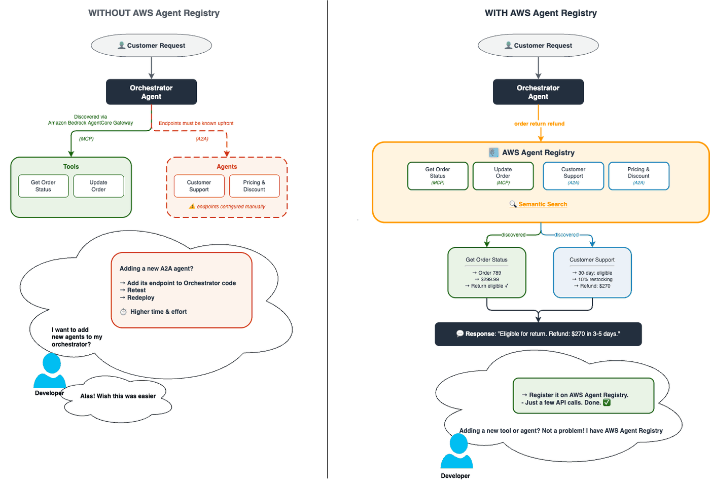
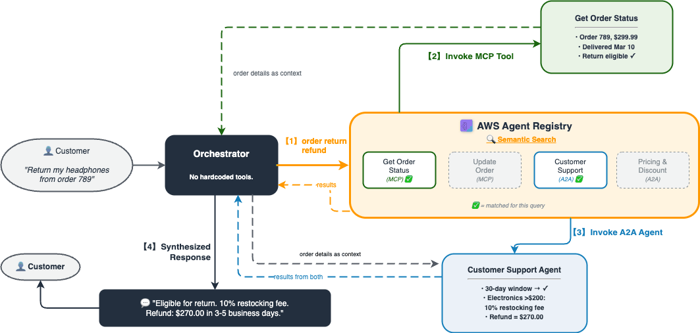
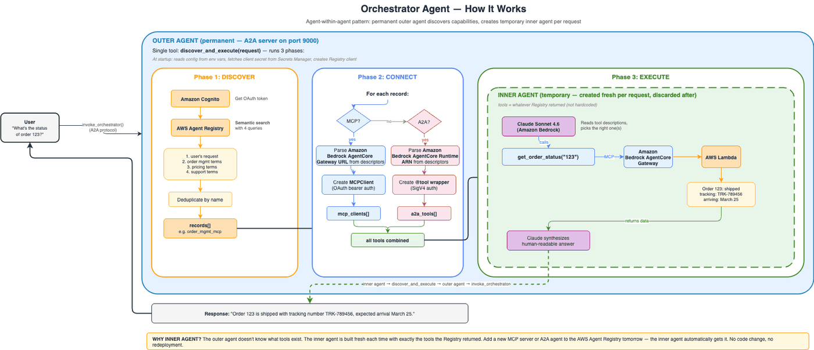

# Discovering Tools and Agents at Runtime Using AWS Agent Registry

## Overview

This notebook demonstrates **AWS Agent Registry** — a semantic search catalog that lets agents discover other agents and MCP servers at runtime with zero hardcoded integrations.

The orchestrator agent:
1. **Searches** the Registry with natural language to discover relevant MCP servers and A2A agents
2. **Instantiates** live connections — `MCPClient` for Amazon Bedrock AgentCore Gateway MCP servers, `@tool` wrappers for A2A agents
3. **Executes** the user's request using only the dynamically discovered capabilities

### Why AWS Agent Registry?

In most agent systems, integrations are hardcoded — the agent knows exactly which APIs to call at build time. This breaks when:
- Different teams publish new capabilities independently (the agent needs redeployment to use them)
- You want one orchestrator to work across multiple domains without knowing all integrations upfront
- Endpoints change their URLs or auth requirements (every consumer must update)

**AWS Agent Registry** solves this with **registry-driven discovery** — MCP servers and agents register themselves in a catalog with rich descriptions, and at runtime the orchestrator searches the catalog with natural language to find what it needs. New capabilities become available instantly — no redeployment required.

The diagram below shows this side-by-side — **without** Registry (left), endpoints are hardcoded and adding a new agent means code changes + redeployment. **With** Registry (right), the orchestrator discovers capabilities via semantic search and new integrations are available immediately after registration.



### Use Case: Order Management & Customer Service

An orchestrator agent helps customers with order-related tasks by dynamically discovering:
- **MCP servers** for order data retrieval (get status, update orders)
- **A2A agents** for business logic reasoning (pricing/discounts, returns/refunds)

### Solution Overview



### Supporting Services
- **Amazon Bedrock AgentCore Gateway** — Managed MCP server fronting AWS Lambda functions (OAuth2 inbound auth)
- **Amazon Bedrock AgentCore Runtime** — Hosted A2A agents with IAM (SigV4) authentication
- **Amazon Bedrock** — Foundation model for the orchestrator agent (Claude Sonnet 4.6)
- **AWS Lambda** — Backend for MCP server implementations
- **Amazon Cognito** — OAuth2 token provider for Gateway authentication

## Prerequisites

To execute this tutorial you will need:
* Python 3.10+
* Jupyter notebook (Python kernel)
* AWS credentials with permissions for Amazon Bedrock, Amazon Bedrock AgentCore, AWS Lambda, IAM, Amazon Cognito, Amazon ECR, and AWS CodeBuild
* Amazon Bedrock model access enabled for Claude Sonnet 4
* boto3 >= 1.42.87

```python
# ═══════════════════════════════════════════════════════════════════════════════
# STEP 1: DEPLOY INFRASTRUCTURE — MCP Servers (Gateway) + A2A Agents (Runtime)
# ═══════════════════════════════════════════════════════════════════════════════

# ─── 1.0 Install dependencies ────────────────────────────────────────────────
import subprocess
import sys
import os

subprocess.check_call(
    [
        sys.executable,
        "-m",
        "pip",
        "install",
        "-U",
        "-q",
        "strands-agents>=0.1.0",
        "strands-agents[a2a]>=0.1.0",
        "boto3>=1.42.87",
        "bedrock-agentcore>=1.0.0",
        "bedrock-agentcore-starter-toolkit>=0.1.24",
        "mcp>=1.0.0",
        "requests>=2.31.0",
    ]
)

# Verify boto3 version includes native AgentCore Registry support
import boto3 as _b3

assert tuple(int(x) for x in _b3.__version__.split(".")) >= (1, 42, 87), (
    f"boto3 >= 1.42.87 required for native Registry support, got {_b3.__version__}"
)
print(f"boto3 {_b3.__version__} — native AgentCore Registry support ✓")

# ═══════════════════════════════════════════════════════════════════════════════
# This cell deploys all the MCP servers and agents that will be registered in
# the Registry (Step 2) for the orchestrator to discover at runtime:
#
#   MCP Servers (via AgentCore Gateway):
#     • get_order_status — look up order details, items, tracking, shipping
#     • update_order     — cancel orders or change shipping address
#     Backend: Lambda function, Auth: Cognito OAuth2 → JWT
#
#   A2A Agents (via AgentCore Runtime):
#     • Pricing Agent          — discount tiers, promo codes, price history
#     • Customer Support Agent — returns, refunds, escalation policy
#     Backend: Docker containers on Runtime, Auth: IAM SigV4
#
# Helper code (Lambda source, agent source, zip packaging) lives in utils.py
# to keep this cell focused on AWS resource creation.
# ═══════════════════════════════════════════════════════════════════════════════

# ─── Imports + AWS clients ────────────────────────────────────────────────────
import boto3
import json
import time
from datetime import datetime
from utils import (
    ORDER_MANAGEMENT_LAMBDA_CODE,
    ORDER_TOOL_SCHEMAS,
    make_lambda_zip,
    write_agent_files,
)
from bedrock_agentcore_starter_toolkit import Runtime

session = boto3.Session()
region = session.region_name or "us-west-2"
os.environ["AWS_DEFAULT_REGION"] = region

sts_client = session.client("sts")
account_id = sts_client.get_caller_identity()["Account"]
iam_client = session.client("iam")
lambda_client = session.client("lambda")
cognito_client = session.client("cognito-idp")
sm_client = session.client("secretsmanager")

# Control plane — used for Gateway, Runtime, AND Registry CP operations
cp_client = session.client("bedrock-agentcore-control")
# Data plane — used for Runtime invocations
agentcore_client = session.client("bedrock-agentcore")
# Registry data plane — used for SearchRegistryRecords (same region as registry)
dp_client = session.client("bedrock-agentcore-registry")

timestamp = datetime.now().strftime("%Y%m%d%H%M%S")
MODEL_ID = "us.anthropic.claude-sonnet-4-6"
print(f"Account: {account_id} | Region: {region} | Timestamp: {timestamp}")

# ─── 1a. Lambda — order management backend ───────────────────────────────────
lambda_role_name = f"LambdaMCPRole-{timestamp}"
lambda_role_resp = iam_client.create_role(
    RoleName=lambda_role_name,
    AssumeRolePolicyDocument=json.dumps(
        {
            "Version": "2012-10-17",
            "Statement": [
                {
                    "Effect": "Allow",
                    "Principal": {"Service": "lambda.amazonaws.com"},
                    "Action": "sts:AssumeRole",
                }
            ],
        }
    ),
)
lambda_role_arn = lambda_role_resp["Role"]["Arn"]
iam_client.attach_role_policy(
    RoleName=lambda_role_name,
    PolicyArn="arn:aws:iam::aws:policy/service-role/AWSLambdaBasicExecutionRole",
)
time.sleep(10)

lambda_arns = {}
fname = f"order-management-mcp-{timestamp}"
resp = lambda_client.create_function(
    FunctionName=fname,
    Runtime="python3.13",
    Role=lambda_role_arn,
    Handler="lambda_function.lambda_handler",
    Code={"ZipFile": make_lambda_zip(ORDER_MANAGEMENT_LAMBDA_CODE)},
    Timeout=30,
)
lambda_arns["order-management-mcp"] = resp["FunctionArn"]
print(f"✓ Lambda: {fname}")

# ─── 1b. Cognito — OAuth2 token provider for Gateway auth ────────────────────
pool_resp = cognito_client.create_user_pool(
    PoolName=f"gateway-pool-{timestamp}",
    Policies={
        "PasswordPolicy": {
            "MinimumLength": 8,
            "RequireUppercase": False,
            "RequireLowercase": False,
            "RequireNumbers": False,
            "RequireSymbols": False,
        }
    },
)
user_pool_id = pool_resp["UserPool"]["Id"]

resource_server_id = f"gateway-api-{timestamp}"
cognito_client.create_resource_server(
    UserPoolId=user_pool_id,
    Identifier=resource_server_id,
    Name=f"Gateway API {timestamp}",
    Scopes=[
        {"ScopeName": "read", "ScopeDescription": "Read"},
        {"ScopeName": "write", "ScopeDescription": "Write"},
    ],
)

app_client_resp = cognito_client.create_user_pool_client(
    UserPoolId=user_pool_id,
    ClientName=f"gateway-client-{timestamp}",
    GenerateSecret=True,
    AllowedOAuthFlows=["client_credentials"],
    AllowedOAuthFlowsUserPoolClient=True,
    AllowedOAuthScopes=[f"{resource_server_id}/read", f"{resource_server_id}/write"],
)
client_id = app_client_resp["UserPoolClient"]["ClientId"]

# Store client_secret in Secrets Manager — never in env vars or notebook memory
secret_name = f"gateway-client-secret-{timestamp}"
_client_secret = cognito_client.describe_user_pool_client(UserPoolId=user_pool_id, ClientId=client_id)[
    "UserPoolClient"
]["ClientSecret"]
sm_client.create_secret(Name=secret_name, SecretString=_client_secret)
del _client_secret  # Remove from notebook memory immediately
print(f"✓ Client secret stored in Secrets Manager: {secret_name}")

domain_name = f"gateway-{timestamp}"
cognito_client.create_user_pool_domain(Domain=domain_name, UserPoolId=user_pool_id)
cognito_domain = f"{domain_name}.auth.{region}.amazoncognito.com"
print(f"✓ Cognito: pool={user_pool_id}")

scopes = f"{resource_server_id}/read {resource_server_id}/write"

# ─── 1c. AgentCore Gateway — managed MCP server fronting Lambda ──────────────
gateway_role_name = f"AgentCoreGatewayRole-{timestamp}"
iam_client.create_role(
    RoleName=gateway_role_name,
    AssumeRolePolicyDocument=json.dumps(
        {
            "Version": "2012-10-17",
            "Statement": [
                {
                    "Effect": "Allow",
                    "Principal": {"Service": "bedrock-agentcore.amazonaws.com"},
                    "Action": "sts:AssumeRole",
                }
            ],
        }
    ),
)
gateway_role_arn = f"arn:aws:iam::{account_id}:role/{gateway_role_name}"
iam_client.put_role_policy(
    RoleName=gateway_role_name,
    PolicyName="LambdaInvoke",
    PolicyDocument=json.dumps(
        {
            "Version": "2012-10-17",
            "Statement": [
                {
                    "Effect": "Allow",
                    "Action": "lambda:InvokeFunction",
                    "Resource": f"arn:aws:lambda:{region}:{account_id}:function:*",
                }
            ],
        }
    ),
)
time.sleep(10)

gateway_resp = cp_client.create_gateway(
    name=f"demo-gateway-{timestamp}",
    roleArn=gateway_role_arn,
    protocolType="MCP",
    protocolConfiguration={"mcp": {"supportedVersions": ["2025-03-26", "2025-06-18"]}},
    authorizerType="CUSTOM_JWT",
    authorizerConfiguration={
        "customJWTAuthorizer": {
            "discoveryUrl": f"https://cognito-idp.{region}.amazonaws.com/{user_pool_id}/.well-known/openid-configuration",
            "allowedClients": [client_id],
        }
    },
)
gateway_id = gateway_resp["gatewayId"]
print(f"  Gateway creating: {gateway_id} ...")
while True:
    status = cp_client.get_gateway(gatewayIdentifier=gateway_id)
    if status.get("status") == "READY":
        gateway_url = status.get("gatewayUrl")
        break
    time.sleep(5)
print(f"✓ Gateway ready: {gateway_url}")

target_ids = {}
resp = cp_client.create_gateway_target(
    gatewayIdentifier=gateway_id,
    name=f"order-management-target-{timestamp}",
    targetConfiguration={
        "mcp": {
            "lambda": {
                "lambdaArn": lambda_arns["order-management-mcp"],
                "toolSchema": {"inlinePayload": ORDER_TOOL_SCHEMAS},
            }
        }
    },
    credentialProviderConfigurations=[{"credentialProviderType": "GATEWAY_IAM_ROLE"}],
)
tid = resp["targetId"]
target_ids["order-management-target"] = tid
while True:
    if cp_client.get_gateway_target(gatewayIdentifier=gateway_id, targetId=tid).get("status") == "READY":
        break
    time.sleep(10)
print(f"✓ Gateway target ready: {tid}")

# ─── 1d. A2A Agents — deploy to AgentCore Runtime ────────────────────────────
write_agent_files()

# Clear stale starter toolkit config to prevent update-on-deleted-agent errors
if os.path.exists(".bedrock_agentcore.yaml"):
    os.remove(".bedrock_agentcore.yaml")

pricing_rt = Runtime()
pricing_rt.configure(
    entrypoint="pricing_agent.py",
    auto_create_execution_role=True,
    auto_create_ecr=True,
    requirements_file="a2a_requirements.txt",
    region=region,
    agent_name="pricing_agent",
    protocol="A2A",
)
pricing_launch = pricing_rt.launch(auto_update_on_conflict=True)
pricing_agent_id = pricing_launch.agent_id
print(f"✓ Pricing Agent deployed: {pricing_agent_id}")

support_rt = Runtime()
support_rt.configure(
    entrypoint="customer_support_agent.py",
    auto_create_execution_role=True,
    auto_create_ecr=True,
    requirements_file="a2a_requirements.txt",
    region=region,
    agent_name="customer_support_agent",
    protocol="A2A",
)
support_launch = support_rt.launch(auto_update_on_conflict=True)
support_agent_id = support_launch.agent_id
print(f"✓ Customer Support Agent deployed: {support_agent_id}")

agent_arns = {}
for name, aid in [
    ("pricing_agent", pricing_agent_id),
    ("customer_support_agent", support_agent_id),
]:
    resp = cp_client.get_agent_runtime(agentRuntimeId=aid)
    agent_arns[name] = resp["agentRuntimeArn"]

# ─── Registry metadata — describes what we'll register in Step 2 ─────────────
registry_records = {
    "order_management_mcp": {
        "protocol": "MCP",
        "description": "Order data tools - get order status, tracking, items, shipping details, cancel or change address",
        "tools": ORDER_TOOL_SCHEMAS,
    },
    "pricing_agent": {
        "protocol": "A2A",
        "description": "Pricing only - discount tiers, promo codes, price history. Never handles returns or refunds",
    },
    "customer_support_agent": {
        "protocol": "A2A",
        "description": "Returns and refunds only - return eligibility, refund calculation, complaints, escalations",
    },
}

# ─── Summary — all deployed resource ARNs ────────────────────────────────────
print("\n" + "═" * 70)
print("DEPLOYED RESOURCES")
print("═" * 70)
print(f"  Lambda ARN:            {lambda_arns['order-management-mcp']}")
print(f"  Gateway URL:           {gateway_url}")
print(f"  Gateway Target ID:     {tid}")
print(f"  Cognito User Pool:     {user_pool_id}")
print(f"  Secret Name:           {secret_name}")
print(f"  Pricing Agent ARN:     {agent_arns['pricing_agent']}")
print(f"  Support Agent ARN:     {agent_arns['customer_support_agent']}")
print("═" * 70)
```

---

## Step 2: Create AWS Agent Registry & Register All Records

This is the core of the demo. We create a Registry, register our MCP servers and A2A agents as searchable records, approve them, and verify that semantic search finds the right capabilities for natural-language queries.

### Step 2a: Create Registry

```python
# Create a new Registry — this is the searchable catalog where we'll register
# our MCP tools and A2A agents. The orchestrator will query this catalog at
# runtime to discover what capabilities are available.
#
# autoApproval=False means records must be explicitly approved before they
# appear in search results — this enables governance review workflows.
reg = cp_client.create_registry(
    name="OrderManagementRegistry",
    description="Registry for Order Management & Customer Service - agent discovers tools and agents via semantic search",
    approvalConfiguration={"autoApproval": False},
)
REGISTRY_ARN = reg["registryArn"]
REGISTRY_ID = REGISTRY_ARN.split("/")[-1]
print(f"Registry: {REGISTRY_ID}")
print(f"ARN: {REGISTRY_ARN}")

# Wait for registry to be READY before creating records
while True:
    r = cp_client.get_registry(registryId=REGISTRY_ID)
    if r["status"] == "READY":
        print("Registry status: READY")
        break
    print(f"Registry status: {r['status']} - waiting...")
    time.sleep(5)
```

> ✅ **Checkpoint**: You should see a Registry ID (UUID format) and ARN. The registry is created with `autoApproval: False` — this means records must be explicitly approved before they appear in search results.

### Step 2b: Register MCP and A2A Records

```python
# ─── Descriptor builders ──────────────────────────────────────────────────────
# Each Registry record needs "descriptors" — structured metadata that tells
# consumers how to connect. The format differs by descriptor type:
#
#   MCP records need:
#     • server  — server name, version, and the Gateway URL (websiteUrl)
#     • tools   — list of tools with name, description, and inputSchema
#   These let the orchestrator know WHERE to connect and WHAT tools are available.
#
#   A2A records need:
#     • agentCard — A2A agent card with skills and capabilities
#   This lets the orchestrator know WHERE to send A2A messages.

from urllib.parse import quote


def build_mcp_descriptors(name, description, gateway_url, tools):
    """Build MCP descriptors containing server connection info and tool schemas.

    Note: server description has a 100 char limit.
    The full description goes in the record's top-level description field
    (used for semantic search). The server descriptor gets a truncated copy.
    """
    server_desc = description[:100] if len(description) > 100 else description
    server_content = json.dumps(
        {
            "name": f"gateway-mcp-server/{name}",
            "description": server_desc,
            "version": "1.0.0",
            "websiteUrl": gateway_url,
        }
    )
    tools_content = json.dumps({"tools": tools})
    return {
        "mcp": {
            "server": {"schemaVersion": "2025-12-11", "inlineContent": server_content},
            "tools": {"protocolVersion": "2025-06-18", "inlineContent": tools_content},
        }
    }


def build_a2a_descriptors(name, description, agent_arn):
    """Build A2A descriptors containing the agent card with Runtime ARN.

    The agent card follows the A2A protocol 0.3.0 format as produced by the
    Strands A2AServer. The URL is constructed from the Runtime ARN using
    the AgentCore invocation endpoint format.
    """
    escaped_arn = quote(agent_arn, safe="")
    agent_url = f"https://bedrock-agentcore.{region}.amazonaws.com/runtimes/{escaped_arn}/invocations/"
    agent_card = {
        "protocolVersion": "0.3.0",
        "name": name.replace("_", " ").title(),
        "description": description,
        "url": agent_url,
        "version": "1.0.0",
        "preferredTransport": "JSONRPC",
        "capabilities": {
            "streaming": False,
            "pushNotifications": False,
        },
        "defaultInputModes": ["text"],
        "defaultOutputModes": ["text"],
        "skills": [
            {
                "id": name,
                "name": name.replace("_", " ").title(),
                "description": description,
                "tags": [],
            }
        ],
    }
    return {
        "a2a": {
            "agentCard": {
                "schemaVersion": "0.3.0",
                "inlineContent": json.dumps(agent_card),
            }
        }
    }


# ─── Register each tool/agent as a record in the Registry ────────────────────
# create_registry_record takes:
#   • name           — unique identifier within this registry
#   • description    — natural-language text indexed for semantic search
#   • descriptorType — "MCP", "A2A", "CUSTOM", or "AGENT_SKILLS"
#   • descriptors    — protocol-specific metadata (built above)
#   • recordVersion  — version string for tracking changes

record_ids = []

for name, cfg in registry_records.items():
    if cfg["protocol"] == "MCP":
        descriptors = build_mcp_descriptors(name, cfg["description"], gateway_url, cfg["tools"])
    else:
        descriptors = build_a2a_descriptors(name, cfg["description"], agent_arns[name])

    resp = cp_client.create_registry_record(
        registryId=REGISTRY_ID,
        name=name,
        description=cfg["description"],
        descriptorType=cfg["protocol"],
        descriptors=descriptors,
        recordVersion="1.0",
    )
    rid = resp["recordArn"].split("/record/")[-1]
    record_ids.append(rid)
    print(f"Created {cfg['protocol']}: {name} -> {rid}")

print(f"\nTotal records: {len(record_ids)}")

# Verify all records were created
for rid in record_ids:
    rec = cp_client.get_registry_record(registryId=REGISTRY_ID, recordId=rid)
    desc_type = rec.get("descriptorType", "N/A")
    print(f"  {rec['name']}: status={rec.get('status', 'N/A')}, type={desc_type}")
```

> ✅ **Checkpoint**: You should see 3 records created — 1 MCP (`order_management_mcp`) and 2 A2A (`pricing_agent`, `customer_support_agent`). Each prints its record ID.

### Step 2c: Approve All Records

```python
# Records start in CREATING, transition to DRAFT, then must go through a
# two-step approval before they appear in search results:
#   DRAFT → PENDING_APPROVAL → APPROVED
#
# This enables governance workflows — in production, a human reviewer or
# CI pipeline could gate the approval step.

# Wait for all records to be ready for approval
print("Waiting for records to be ready for approval...")
for rid in record_ids:
    while True:
        rec = cp_client.get_registry_record(registryId=REGISTRY_ID, recordId=rid)
        status = rec.get("status", "UNKNOWN")
        if status in ("DRAFT", "PENDING_APPROVAL"):
            break
        print(f"  {rec['name']}: {status} - waiting...")
        time.sleep(5)
    print(f"  {rec['name']}: {status}")

# Submit and approve each record, handling both DRAFT and PENDING_APPROVAL states
for rid in record_ids:
    rec = cp_client.get_registry_record(registryId=REGISTRY_ID, recordId=rid)
    status = rec.get("status")

    if status == "DRAFT":
        cp_client.submit_registry_record_for_approval(registryId=REGISTRY_ID, recordId=rid)

    if status in ("DRAFT", "PENDING_APPROVAL"):
        cp_client.update_registry_record_status(
            registryId=REGISTRY_ID,
            recordId=rid,
            status="APPROVED",
            statusReason="Approved",
        )
    print(f"Approved: {rid}")

# Search index is eventually consistent — wait for all records to appear
print("\nWaiting for search index to propagate all records...")
for attempt in range(12):
    time.sleep(10)
    resp = dp_client.search_registry_records(
        registryIds=[REGISTRY_ARN],
        searchQuery="order pricing support",
        maxResults=10,
    )
    found = len(resp.get("registryRecords", []))
    if found >= len(record_ids):
        print(f"  All {found} records indexed.")
        break
    print(f"  {found}/{len(record_ids)} records indexed - waiting...")
print("Ready.")
```

> **Troubleshooting**: If approval fails with `ValidationException`, ensure each record has reached `DRAFT` status (not `CREATING`) before submitting. The two-step process is required: `submit_registry_record_for_approval` moves the record to `PENDING_APPROVAL`, then `update_registry_record_status(APPROVED)` makes it searchable.

### Step 2d: Verify Semantic Search

```python
# search_registry_records uses embedding-based similarity matching — not keyword
# search. This means "return refund" can match "Customer Support Agent" even
# though those exact words don't appear in its name. The search query is compared
# against each record's name, description, and tool schemas.
#
# We test 4 queries to verify different capabilities are discoverable:


def get_descriptor_type(record):
    """Derive descriptor type from the descriptors keys."""
    descriptors = record.get("descriptors", {})
    if "mcp" in descriptors:
        return "MCP"
    elif "a2a" in descriptors:
        return "A2A"
    return record.get("descriptorType", "UNKNOWN")


for query in [
    "order status tracking",
    "pricing discount promo code",
    "return refund customer support",
    "cancel order update",
]:
    resp = dp_client.search_registry_records(
        registryIds=[REGISTRY_ARN],
        searchQuery=query,
        maxResults=3,
    )
    hits = resp.get("registryRecords", [])
    print(f"\n'{query}' -> {len(hits)} results:")
    for h in hits:
        print(f"  - {h['name']} ({get_descriptor_type(h)})")
```

> ✅ **Checkpoint**: You should see 4 queries above, each returning 1-3 results. The key test: `"return refund customer support"` should match the Customer Support Agent even though "return" and "refund" don't appear in its name — that's semantic search working.

> **Troubleshooting**: If search returns 0 results, wait 30 seconds and retry — the search index is **eventually consistent** after record approval. If results still don't appear, verify the records were approved (status = `APPROVED`) using `cp_client.get_registry_record()`.

---

## Step 3: Deploy the Orchestrator Agent

The orchestrator follows an **agent-within-agent pattern** where tools are never hardcoded — they are discovered from AWS Agent Registry in real time for every request.

**Outer Agent** (permanent A2A server on AgentCore Runtime)
- Receives the user's request and translates it into a Registry search
- Authenticates with Cognito to obtain OAuth credentials for Registry access
- **Searches AWS Agent Registry in real time** using the user's request as a semantic query — the Registry returns matching MCP servers and A2A agents based on meaning, not keywords
- Passes the discovered records to the inner agent for execution
- Returns the inner agent's synthesized response back to the caller

**Inner Agent** (ephemeral, assembled per request from Registry results)
- Created dynamically with only the tools that the Registry matched for this specific request
- If the Registry returned an MCP server, it gets an `MCPClient` (OAuth bearer auth via Gateway)
- If the Registry returned an A2A agent, it gets a `@tool` wrapper (SigV4 auth via Runtime)
- The LLM reads the tool descriptions, picks the right one(s), executes, and synthesizes a response
- Response flows back to the outer agent, then to the caller. Inner agent is destroyed — the next request gets a fresh search and fresh tools

**Why this matters:** The orchestrator has zero knowledge of what tools or agents exist. Every capability it uses comes from a live Registry search. Register a new MCP server or A2A agent tomorrow — the orchestrator discovers and uses it on the next request. No code change, no redeployment.



Helper functions in `utils.py` (bundled in the Runtime container) translate Registry metadata into live connections — `parse_server_metadata`, `create_mcp_client_from_metadata`, `create_a2a_tool_from_metadata`.

```python
ORCHESTRATOR_AGENT_CODE = '''
import os
import json
import boto3
from strands import Agent, tool
from strands.models import BedrockModel
from strands.multiagent.a2a import A2AServer
from fastapi import FastAPI
import uvicorn
from utils import (
    parse_server_metadata,
    create_mcp_client_from_metadata,
    create_a2a_tool_from_metadata,
    fetch_oauth_token,
)

# ─── Config from environment variables ────────────────────────────────────────
REGION = os.environ.get("AWS_DEFAULT_REGION", "us-west-2")
REGISTRY_ARN = os.environ["REGISTRY_ARN"]
COGNITO_DOMAIN = os.environ["COGNITO_DOMAIN"]
CLIENT_ID = os.environ["CLIENT_ID"]
SCOPES = os.environ["SCOPES"]
MODEL_ID = os.environ.get("MODEL_ID", "us.anthropic.claude-sonnet-4-6")

session = boto3.Session()

_sm = session.client("secretsmanager", region_name=REGION)
CLIENT_SECRET = _sm.get_secret_value(
    SecretId=os.environ["CLIENT_SECRET_NAME"]
)["SecretString"]

# bedrock-agentcore DP has both invoke_agent_runtime and search_registry_records
# and is available in all boto3 versions shipped with the Runtime base image
dp_client = session.client("bedrock-agentcore", region_name=REGION)


@tool
def discover_and_execute(request: str) -> str:
    """Search the AWS Agent Registry for relevant tools and agents, then execute the request
    using the discovered capabilities. Use this for every user request.

    Args:
        request: The user request to process.

    Returns:
        The response from executing the request with dynamically discovered tools.
    """
    access_token = fetch_oauth_token(COGNITO_DOMAIN, CLIENT_ID, CLIENT_SECRET, SCOPES, REGION)

    search_queries = [
        request,
        "order management status tracking cancel update",
        "pricing discount promo code savings",
        "customer support returns refunds complaints",
    ]
    all_records = {}
    for q in search_queries:
        results = dp_client.search_registry_records(
            registryIds=[REGISTRY_ARN], searchQuery=q, maxResults=5,
        ).get("registryRecords", [])
        for rec in results:
            name = rec.get("name", "")
            if name not in all_records:
                all_records[name] = rec

    records = list(all_records.values())

    if not records:
        return "No tools found in registry for this request."

    mcp_clients, a2a_tools, seen_urls = [], [], set()
    for rec in records:
        meta = parse_server_metadata(rec)
        if meta["protocol"] == "MCP":
            url = meta.get("url")
            if url and url not in seen_urls:
                c = create_mcp_client_from_metadata(meta, access_token)
                if c:
                    mcp_clients.append(c)
                    seen_urls.add(url)
        elif meta["protocol"] == "A2A":
            fn = create_a2a_tool_from_metadata(meta, session, REGION)
            if fn:
                a2a_tools.append(fn)

    if not mcp_clients and not a2a_tools:
        return "No tools could be instantiated from registry results."

    model = BedrockModel(model_id=MODEL_ID, region_name=REGION)
    started_clients = []
    try:
        mcp_tools = []
        for c in mcp_clients:
            c.start()
            started_clients.append(c)
            mcp_tools.extend(c.list_tools_sync())

        sub_agent = Agent(
            model=model,
            tools=mcp_tools + a2a_tools,
            system_prompt=(
                "You are an Order Management & Customer Service assistant. "
                "You have access to multiple tools — choose the RIGHT tool for each request:\\n"
                "- For order lookups, status checks, cancellations, or address changes: use the MCP tools (get_order_status, update_order)\\n"
                "- For pricing analysis, discounts, and promo codes: use the pricing_agent tool\\n"
                "- For returns, refunds, complaints, and escalations: use the customer_support_agent tool\\n"
                "Always use the most specific tool for the task. Do NOT use the pricing agent for order status or return questions."
            ),
        )
        return str(sub_agent(request))
    finally:
        for c in started_clients:
            try:
                c.stop()
            except Exception:
                pass


model = BedrockModel(model_id=MODEL_ID, region_name=REGION)
agent = Agent(
    model=model,
    name="Orchestrator Agent",
    description="Order management orchestrator that discovers and invokes tools and agents from the AWS Agent Registry",
    system_prompt=(
        "You are an orchestrator agent. For every user request, use the "
        "discover_and_execute tool to search the registry and process it. "
        "Always pass the full user request to the tool."
    ),
    tools=[discover_and_execute],
)

app = FastAPI()
a2a = A2AServer(
    agent=agent,
    http_url=os.environ.get("AGENTCORE_RUNTIME_URL", "http://127.0.0.1:9000/"),
    serve_at_root=True,
)

@app.get("/ping")
def ping():
    return {"status": "healthy"}

app.mount("/", a2a.to_fastapi_app())

if __name__ == "__main__":
    uvicorn.run(app, host="0.0.0.0", port=9000)
'''

# Write orchestrator agent to disk
with open("orchestrator_agent.py", "w") as f:
    f.write(ORCHESTRATOR_AGENT_CODE)

# Orchestrator dependencies
with open("orchestrator_requirements.txt", "w") as f:
    f.write("strands-agents[a2a]\nfastapi\nuvicorn\nmcp\nrequests\n")

print("✓ Orchestrator agent code written: orchestrator_agent.py")

# Delete stale Dockerfile to force fresh generation
if os.path.exists("Dockerfile"):
    os.remove("Dockerfile")
    print("✓ Deleted stale Dockerfile (will be regenerated)")

# Deploy orchestrator to Runtime
orchestrator_rt = Runtime()
orchestrator_rt.configure(
    entrypoint="orchestrator_agent.py",
    auto_create_execution_role=True,
    auto_create_ecr=True,
    requirements_file="orchestrator_requirements.txt",
    region=region,
    agent_name="orchestrator_agent",
    protocol="A2A",
)
orchestrator_launch = orchestrator_rt.launch(
    auto_update_on_conflict=True,
    env_vars={
        "REGISTRY_ARN": REGISTRY_ARN,
        "COGNITO_DOMAIN": cognito_domain,
        "CLIENT_ID": client_id,
        "CLIENT_SECRET_NAME": secret_name,
        "SCOPES": scopes,
        "MODEL_ID": MODEL_ID,
        "AWS_DEFAULT_REGION": region,
    },
)
orchestrator_agent_id = orchestrator_launch.agent_id
orchestrator_arn = orchestrator_launch.agent_arn
print(f"✓ Orchestrator deployed: {orchestrator_agent_id}")

# Grant orchestrator's execution role necessary permissions
agent_info = cp_client.get_agent_runtime(agentRuntimeId=orchestrator_agent_id)
orch_role_arn = agent_info.get("roleArn") or agent_info.get("agentRuntimeRoleArn", "")
if orch_role_arn:
    orch_role_name = orch_role_arn.split("/")[-1]

    iam_client.put_role_policy(
        RoleName=orch_role_name,
        PolicyName="SecretsManagerReadAccess",
        PolicyDocument=json.dumps(
            {
                "Version": "2012-10-17",
                "Statement": [
                    {
                        "Effect": "Allow",
                        "Action": "secretsmanager:GetSecretValue",
                        "Resource": f"arn:aws:secretsmanager:{region}:{account_id}:secret:{secret_name}*",
                    }
                ],
            }
        ),
    )
    print(f"✓ Secrets Manager access granted to: {orch_role_name}")

    iam_client.put_role_policy(
        RoleName=orch_role_name,
        PolicyName="RegistrySearchAccess",
        PolicyDocument=json.dumps(
            {
                "Version": "2012-10-17",
                "Statement": [
                    {
                        "Effect": "Allow",
                        "Action": "bedrock-agentcore:SearchRegistryRecords",
                        "Resource": f"arn:aws:bedrock-agentcore:*:{account_id}:registry/*",
                    }
                ],
            }
        ),
    )
    print(f"✓ Registry search access granted to: {orch_role_name}")

print(f"✓ Orchestrator status: {agent_info['status']}, arn: {orchestrator_arn}")
```

---

## Step 4: End-to-End Demos — 3 Scenarios

Each demo shows the full discover → instantiate → execute cycle with different capability combinations. The diagram below traces Demo 3 (return & refund) through all four phases — **(1)** the orchestrator searches Registry with "order return refund", **(2)** invokes the matched MCP server to get order details, **(3)** invokes the matched A2A agent for policy evaluation, and **(4)** synthesizes a response to the customer.

### Demo 1: Order Status — MCP Tool Invocation

```python
from utils import invoke_orchestrator

# Demo 1: Order Status
result = invoke_orchestrator(
    "What is the current status and tracking info for order 123?",
    agentcore_client,
    orchestrator_arn,
)
print(f"\n── Response ──\n{result}")
```

#### What just happened — Demo 1

1. **Discovery**: Registry semantic search returned the order management MCP server — matching on "order status"
2. **Instantiation**: The orchestrator created an `MCPClient` for the Gateway MCP server
3. **Execution**: The LLM called `get_order_status` with orderId "123" and synthesized a human-readable response

### Demo 2: Pricing & Discounts — MCP + A2A Multi-Agent Collaboration

```python
result = invoke_orchestrator(
    "Order 123 has 2x Widget Pro at $99.98. What discount tiers or promo codes can reduce the price?",
    agentcore_client,
    orchestrator_arn,
)
print(f"\n── Response ──\n{result}")
```

#### What just happened — Demo 2

This demo shows **Registry discovering multiple capabilities** for a single request:

1. **Discovery**: Registry matched both the order management MCP server AND the pricing A2A agent — two different protocols, one natural-language query
2. **MCP server**: Called `get_order_status` via Gateway to get order details
3. **A2A agent**: Sent order data to the pricing agent on Runtime for discount analysis
4. **Synthesis**: The LLM combined both responses into a coherent pricing recommendation

### Demo 3: Return & Refund — Customer Support Decision

```python
result = invoke_orchestrator(
    "I want to return order 789 (Premium Headphones, delivered March 10). Am I eligible for a return and what is the refund amount?",
    agentcore_client,
    orchestrator_arn,
)
print(f"\n── Response ──\n{result}")
```

#### What just happened — Demo 3

The flow diagram above traces this exact scenario. The key Registry insight: the query "return refund" **semantically matched** the customer support A2A agent — even though those exact words don't appear in its registered name. Without Registry, the orchestrator would need hardcoded knowledge of which agent handles returns.

---

## Cleanup

Delete all resources in reverse order.

```python
# Run cleanup script — deletes all AWS resources created above in reverse order.
# The script uses variables from the notebook kernel (gateway_id, lambda_arns, etc.)
# See cleanup.py for details.
%run -i cleanup.py
```

# Congratulations!

You have successfully built an autonomous agent that uses **AWS Agent Registry** to:

1. **Discover** MCP servers and agents at runtime via semantic search — no hardcoded integrations
2. **Connect** dynamically to MCP servers (via Amazon Bedrock AgentCore Gateway) and A2A agents (via Amazon Bedrock AgentCore Runtime) using Registry metadata
3. **Execute** multi-agent workflows where the orchestrator finds the right capabilities for each request

### Key Takeaways
- **AWS Agent Registry is the enabler** — it turns static, hardcoded agent systems into dynamic ones. Register once, discover from anywhere.
- **Semantic search, not keyword matching** — the orchestrator describes what it needs in natural language, and Registry returns the best matches across protocols
- **Protocol-agnostic discovery** — one Registry search returns both MCP servers and A2A agents; the orchestrator doesn't need to know which protocol a capability uses until connection time
- **Zero redeployment** — add a new MCP server or A2A agent to the Registry, and the orchestrator discovers it on the next request

### Supporting Infrastructure
- **Amazon Bedrock AgentCore Gateway** — turns AWS Lambda functions into managed MCP servers with built-in authentication
- **Amazon Bedrock AgentCore Runtime** — hosts A2A agents with IAM-based security

### Use Case Demonstrated
- **Order Management MCP** — stateless order lookups and updates via Amazon Bedrock AgentCore Gateway
- **Pricing Agent (A2A)** — evaluates discounts, promo codes, and price history
- **Customer Support Agent (A2A)** — assesses return eligibility, calculates refunds, applies policy rules

## Next Steps

- Explore more tutorials in the [AgentCore samples repo](https://github.com/awslabs/agentcore-samples)
- Read the [Amazon Bedrock AgentCore documentation](https://docs.aws.amazon.com/bedrock-agentcore/latest/userguide/)
- **Extend this pattern**: Add new MCP servers or A2A agents to the Registry — the orchestrator discovers them automatically
- **Swap models**: Change `MODEL_ID` to try different foundation models
