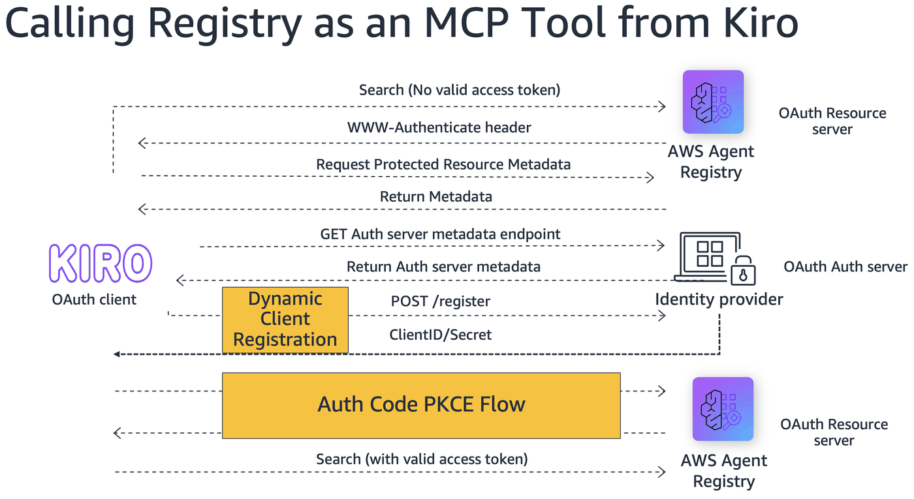
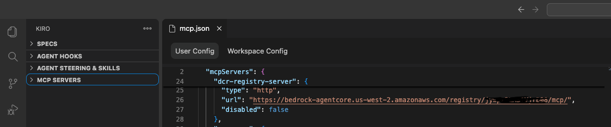
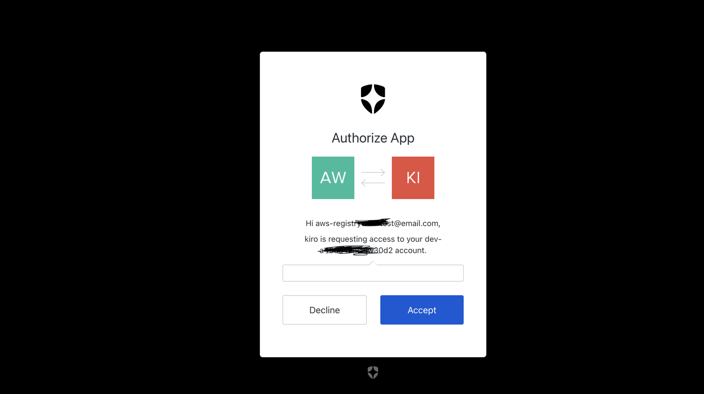
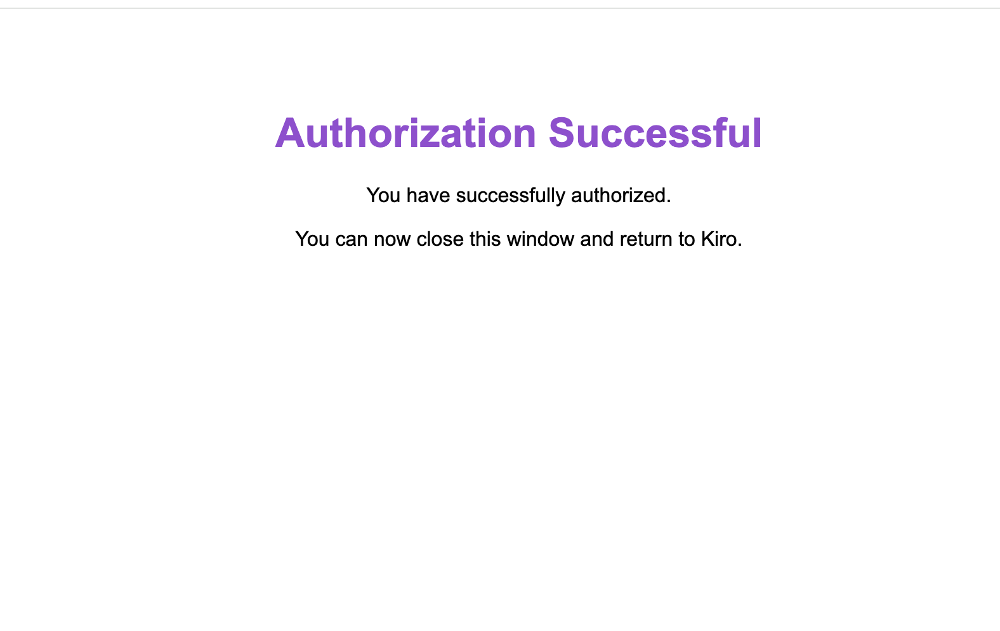
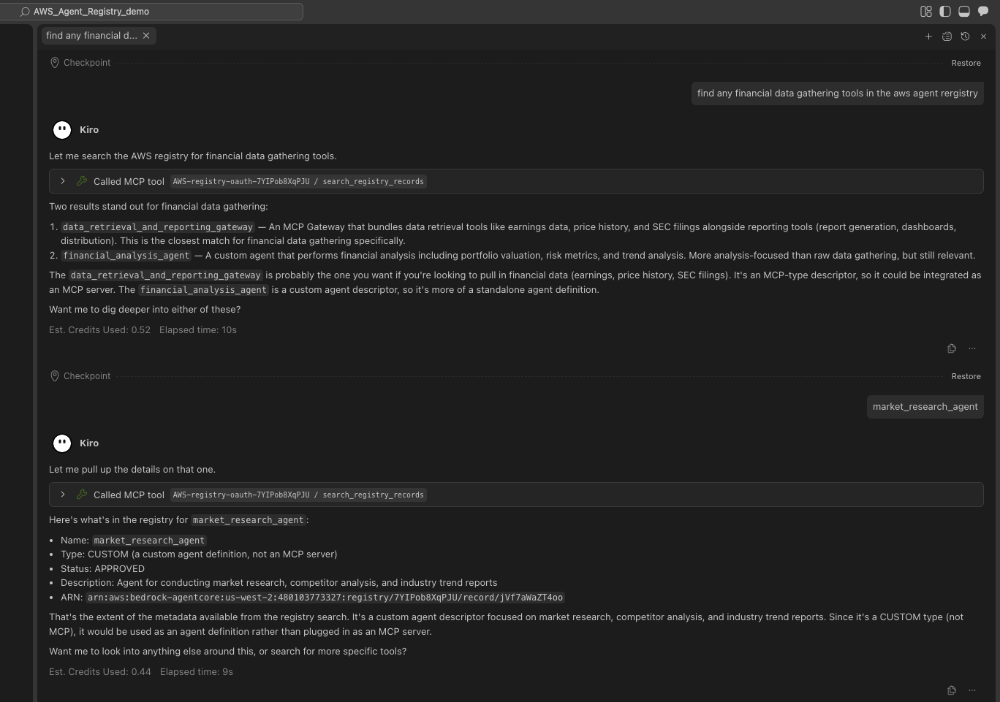

# Calling Registry as an MCP Tool from Kiro

#### Discover agentic capabilities from the AWS Agent Registry across your organization directly from your Kiro IDE, without writing a single line of code

## Overview
Being able to search across a registry of agentic capabilities built across your organization directly in your IDE like Kiro is a superpower. This example shows how to configure an AWS Agent Registry with Auth0 Dynamic Client Registration (DCR) to enable secure, zero-config discovery of agents and tools.

**What is Dynamic Client Registration?** 

Dynamic Client Registration is an OAuth and OpenID Connect protocol that lets client applications automatically register with an authorization server instead of requiring manual pre-registration. The DCR protocol is formally defined in RFC 7591, with optional registration management extensions in RFC 7592. It was designed to work within the Open Authorization (OAuth) and OpenID Connect (OIDC) ecosystems. It enables automatic creation of client IDs, secrets, and metadata (redirect URIs, scopes), often used for automation, AI agents, and dynamic scaling.

In the case of using your AWS Registry MCP in your IDE, Dynamic Client Registration allows your IDE to automatically get its own unique credentials for the AWS Registry access instead of requiring a manual setup. This enables the IDE to programmatically request and refresh its own access tokens, completely removing the need for you to manually copy and paste them.



### Key Features
- Create an Auth0-secured AWS Agent Registry with CUSTOM_JWT authorizer
- Seed the registry with sample agent records
- Search records using OAuth bearer tokens
- Connect the registry as an MCP server in Kiro for IDE-native discovery

## Tutorial Details

| Information | Details |
|:---|:---|
| Tutorial type | Interactive |
| AgentCore components | AWS Agent Registry |
| Auth method | Auth0 DCR (Dynamic Client Registration) |
| Inbound Auth IdP | Auth0 (CUSTOM_JWT) |
| Outbound Auth | OAuth Bearer Token |
| Tutorial components | Create Auth0 DCR Server, OAuth search, MCP setup on Kiro |
| Tutorial vertical | Cross-vertical |
| Example complexity | Easy |
| SDK used | boto3 |


## Prerequisites

- **Auth0 account** with a tenant configured
- **Python 3.10+** with `boto3`, `python-dotenv`, `requests`
- **Kiro/Claude IDE** (for the MCP integration step)
- `.env` file configured from `.env.example`


_______________________________________

# Step 1: Auth0 Setup


### 1. Create an Auth0 Account & Tenant

1. Sign up at [auth0.com](https://auth0.com) if you don't already have an account
2. Create a new tenant (or use an existing one) — this acts as your authorization server
3. Note your **Auth0 Domain** (e.g., `your-tenant.auth0.com`)
4. Go to Dashboard > Settings > Advanced and enable Dynamic Client Registration (DCR).

### 2. Register an API (Resource Server)

1. Navigate to **Applications → APIs** in the Auth0 Dashboard
2. Click **Create API**
3. Provide a **Name** (e.g., `AWS Agent Registry API`)
4. Set the **Identifier (Audience)** to URL: `https://bedrock-agentcore.us-west-2.amazonaws.com` 
5. Set **Allow Skipping User Consent** to `true` (optional but convenient for testing)
6. Select the **Signing Algorithm** — `RS256` is recommended
7. As a best practice for security purpose
        - Set **Token Lifetime** to 3600 seconds (1 hour) or less
        - Go to **Settings → Advanced Settings → Grant Types** and enable **Authorization Code, Refresh Token, Client Credentials**
8. Add a user to the API's assigned users list. This user will be used to generate the access token for the registry search. Go to **User Management** > **Users** > **Add a user** .
  

> **⚠️ Caution:** DCR enables dynamic registration of clients — your Auth0 tenant will see third-party clients created automatically by each MCP client (e.g., Kiro) that connects. Using Dynamic Client Registration effectively requires attention to both its security implications and the practical realities of deploying it at scale. Because DCR automates registration, you must ensure that only trusted clients can register and that the registration workflow cannot be exploited.


### 3. Enable authentication at domain level

Since DCR creates a brand new client app in Auth0, it won't have any connections enabled by default. Auth0 needs to know which connections (login methods) the client can use
1. Navigate to **Authentication → Database → Username-Password-Authentication-> Settings -> toogle on [Promote Connection to Domain Level]** in the Auth0 Dashboard


### 4. Configure .env

Copy `.env.example` to `.env` and fill in your values.

### 5. Create the Registry and Seed it with sample records.
Follow Step 2 and 3 in the notebook, to create the registry and seed it with sample records.


### 6. Add your AWS Agent Registry API as Allowed Audience to the Oauth on regitsry.
Kiro sends the MCP server URL as the `audience` in the Auth0 authorization request (Otherwise it wont find the service).  This will be a two step process :
1. Create an API in Auth0 with the MCP URL as the identifier.
2. Update the Registry's OAuth configuration to allow the API as an allowed audience.

For this lab: 
1. Note the Registry ID created. In the Auth0 dashboard, navigate to **Applications → APIs** and  create an API using the registry's MCP endpoint URL as **Identifier**.
Mcp url: `https://bedrock-agentcore.us-west-2.amazonaws.com/registry/<REGISTRY_ID>/mcp`

2. In this lab, you do not need to manually update the Auth configurations of the Registry Auth configuration. The `create_registry` helper for this notebook  has been written to automatically add `https://bedrock-agentcore.us-west-2.amazonaws.com/registry/<REGISTRY_ID>/mcp` to the registry's `allowedAudience` after registry creation.


# Step 2: Create Registry with Auth0 CUSTOM_JWT Authorizer

This creates a new AWS Agent Registry configured with Auth0 as the OAuth identity provider. The helper:
1. Creates the registry with a `CUSTOM_JWT` authorizer pointing to your Auth0 tenant's OIDC discovery URL
2. Polls until the registry reaches `READY` status
3. Automatically adds the MCP endpoint URL to the registry's `allowedAudience`

```python
!pip install python-dotenv strands-agents bedrock-agentcore bedrock-agentcore-starter-toolkit
```

```python
import sys
import os

sys.path.insert(0, os.path.abspath(".."))
from seed_records import create_registry, seed

registry = create_registry(
    name="auth0-demo-registry-dcr",
    description="Demo registry with Auth0 OAuth for notebook walkthrough",
)
registry_id = registry["registryId"]
print(f"Registry ID: {registry_id}")
print(f"Status: {registry['status']}")
```

# STEP 3: Seed Registry with Sample Capability Records


We'll populate the registry with four sample agent records (weather, order-status, customer-support, inventory-lookup). Each record is created as `DRAFT`, submitted for approval, and auto-approved so it appears in search results.

```python
records = seed(registry_id=registry_id)
print(f"\nSeeded {len(records)} records:")
for r in records:
    print(f"  • {r['name']} ({r['recordId']})")
```

```python
from seed_records import _cp_client

cp = _cp_client()
for r in cp.list_registries()["registries"]:
    if r["name"] == "auth0-demo-registry-dcr":
        print(f"Registry: {r['registryId']}")
        recs = cp.list_registry_records(registryId=r["registryId"]).get("registryRecords", [])
        for rec in recs:
            print(f"{rec['recordId']:15s} {rec['status']:10s} {rec['name']}")
```

# STEP 4:  Create another API in Auth0 with the MCP URL as the identifier.


Kiro sends the MCP server URL as the `audience` in the Auth0 authorization request (Otherwise it wont find the service).  This will be a two step process :
1. Create an API in Auth0 with the MCP URL as the identifier.
2. Update the Registry's OAuth configuration to allow the API as an allowed audience.

Use the registry_id that was created above to generate the MCP url `https://bedrock-agentcore.us-west-2.amazonaws.com/registry/<REGISTRY_ID>/mcp`

- [DO THIS]In the Auth0 dashboard, navigate to **Applications → APIs** and  create an API using the registry's MCP endpoint URL as **Identifier**.
- In this lab,the `create_registry` helper for this notebook automatically adds `https://bedrock-agentcore.us-west-2.amazonaws.com/registry/<REGISTRY_ID>/mcp` to the registry's `allowedAudience` after registry creation. No action needed here.

# STEP 5 : Add AWS Agent Registry MCP Server to Kiro


Now that the registry is working with OAuth search, add it to Kiro as an MCP server for IDE-native discovery.

### 4.1 Add to `mcp.json`

Add the following to your Kiro MCP configuration (`.kiro/settings/mcp.json`):

```json
{ "mcpServers" : {
"dcr-registry-server_xx": {
      "type": "http",
      "url": "https://bedrock-agentcore.us-west-2.amazonaws.com/registry/<registry_id>/mcp/",
      "disabled": false
    }
}
}

```


### 4.2 Authenticate

Enable and authenticate the MCP on your Kiro/Claude
When Kiro connects to the MCP server, it will:
- Discover the Auth0 authorization server via the registry's well-known endpoint
- Use DCR to auto-register as an OAuth client (POST /oidc/register)
- Obtain an access token via PKCE authorization code flow
- Use the token to call the registry search MCP

| Authorization PKCE | Successful Auth |
|:---:|:---:|
|  |  |


### 4.3 Search from Kiro
Open Kiro chat and ask it to search the registry:

"Use the AWS registry to search for weather records"

 

### Useful Reference Commands

View the authorization server metadata:

```
curl -X POST https://<domain url>/oidc/register\
    -H "Content-Type: application/json" \
    -d '{
      "client_name": "test-mcp-client",
      "redirect_uris": ["http://localhost:65358/callback"],
      "grant_types": ["authorization_code"],
      "response_types": ["code"],
      "token_endpoint_auth_method": "none"
    }'

```

Manually register a client via DCR:

```
https://<domainurl>/.well-known/oauth-authorization-server
```

## Clean Up

```python
# Cleanup your registry and records

from seed_records import delete_registry

delete_registry(registry_id)
```
