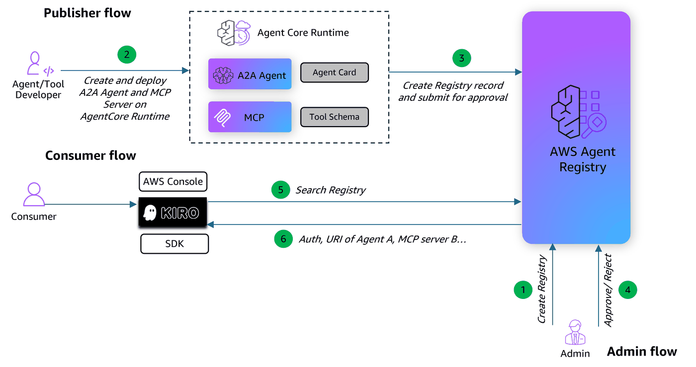

# Publishing A2A Agent and MCP Server deployed on AgentCore in Registry

## Overview

This notebook walks through the full publisher workflow for the AWS Agent Registry. We build an **MCP server** and an **A2A agent** for Order Management, deploy both to **Amazon Bedrock AgentCore Runtime**, verify they are working, then register them in the **AWS Agent Registry** with the correct descriptor structures, submit for approval, and perform semantic search to discover the registered records.



## What You’ll Learn

- How to build an **MCP server** (tool-centric) and an **A2A agent** (agent-centric) for Order Management
- How to deploy both to **AgentCore Runtime** and verify they are working
- How to create an **Agent Registry** to organize records
- How to create **registry records** with the correct descriptor structure for each protocol (`serverSchema` + `toolSchema` for MCP, `agentCard` for A2A)
- How the **approval workflow** (DRAFT → PENDING_APPROVAL → APPROVED) works
- How to perform **semantic search** in the Agent Registry to discover registered agents and tools

## Protocol Summary

| Dimension | MCP | A2A |
|---|---|---|
| **Philosophy** | Tool/function-centric | Agent/skill-centric |
| **Transport** | Streamable HTTP | JSON-RPC 2.0 over HTTP |
| **Port** | 8000 | 9000 |
| **Endpoint mount** | `/mcp` | `/` (root) |
| **Discovery** | `POST /mcp` → `tools/list` | `GET /.well-known/agent-card.json` |
| **Invocation** | `POST /mcp` → `tools/call` | `POST /` → `message/send` |
| **Registry descriptor** | `mcp.serverSchema` + `mcp.toolSchema` | `a2a.agentCard` |
| **State model** | Stateless function calls | Stateful task with message history |
| **Auth on AgentCore** | SigV4 | SigV4 or OAuth 2.0 |

---
## Setup

### Prerequisites

- AWS account with IAM credentials configured
- Python 3.10+
- `boto3 >= 1.42.87`
- IAM user or role with the permissions below (replace `ACCOUNT_ID` and `REGION` as needed)
- IAM user or role must also have appropriate permissions to deploy to AgentCore Runtime. See the [AgentCore Runtime documentation](https://docs.aws.amazon.com/bedrock-agentcore/latest/devguide/agents-tools-runtime.html) for details.

<details>
<summary>Required IAM policy (click to expand)</summary>

```json
{
    "Version": "2012-10-17",
    "Statement": [
        {
            "Sid": "AllowCreateRegistry",
            "Effect": "Allow",
            "Action": ["bedrock-agentcore:CreateRegistry"],
            "Resource": ["arn:aws:bedrock-agentcore:REGION:ACCOUNT_ID:*"]
        },
        {
            "Sid": "AllowGetUpdateDeleteRegistry",
            "Effect": "Allow",
            "Action": [
                "bedrock-agentcore:GetRegistry",
                "bedrock-agentcore:DeleteRegistry"
            ],
            "Resource": ["arn:aws:bedrock-agentcore:REGION:ACCOUNT_ID:registry/*"]
        },
        {
            "Sid": "AllowCreateAndListRecords",
            "Effect": "Allow",
            "Action": [
                "bedrock-agentcore:CreateRegistryRecord",
                "bedrock-agentcore:SearchRegistryRecords"
            ],
            "Resource": ["arn:aws:bedrock-agentcore:REGION:ACCOUNT_ID:registry/*"]
        },
        {
            "Sid": "AllowRecordOperations",
            "Effect": "Allow",
            "Action": [
                "bedrock-agentcore:GetRegistryRecord",
                "bedrock-agentcore:DeleteRegistryRecord",
                "bedrock-agentcore:SubmitRegistryRecordForApproval"
            ],
            "Resource": ["arn:aws:bedrock-agentcore:REGION:ACCOUNT_ID:registry/*/record/*"]
        }
    ]
}
```

</details>

**Note:** This notebook uses `bedrock-agentcore-starter-toolkit`, `strands-agents`, and `mcp` for agent deployment. These are installed automatically via `requirements.txt`.

### Install Dependencies

```python
!pip install -r requirements.txt
```

### Initialize AWS Session and Clients

We need a boto3 session for SigV4-signed requests to AgentCore Runtime, plus boto3 clients for Agent Registry management and search operations.

```python
from boto3.session import Session
import json
import time
import uuid
import os

# Configuration
boto_session = Session()
AWS_REGION = boto_session.region_name

# AWS_PROFILE = "aws-profile"  # Change this to your profile. Comment this line if running on SageMaker

# Set AWS credentials if not using Amazon SageMaker notebook
# os.environ["AWS_PROFILE"] = AWS_PROFILE

# Create boto3 session
# boto_session = boto3.Session(profile_name=AWS_PROFILE, region_name=AWS_REGION)  # Use this if you are not running on SageMaker

# Client for registry management
registry_client = boto_session.client("bedrock-agentcore-control", region_name=AWS_REGION)

# Client for search
search_client = boto_session.client("bedrock-agentcore", region_name=AWS_REGION)

# Create agent directories
os.makedirs("agents/mcp", exist_ok=True)
os.makedirs("agents/a2a", exist_ok=True)

print(f"Session ready | Region: {AWS_REGION}")
```

### Helper Functions

Utilities for pretty-printing, SigV4-signed HTTP requests to AgentCore Runtime, and polling registry status.

```python
import requests
from botocore.auth import SigV4Auth
from botocore.awsrequest import AWSRequest


# ANSI colors for terminal output
class C:
    GREEN = "\033[92m"
    RED = "\033[91m"
    YELLOW = "\033[93m"
    CYAN = "\033[96m"
    BOLD = "\033[1m"
    DIM = "\033[2m"
    RESET = "\033[0m"


def pretty_print_response(response):
    """Pretty-print API response, stripping ResponseMetadata."""
    data = {k: v for k, v in response.items() if k != "ResponseMetadata"}
    print(json.dumps(data, indent=2, default=str))


def signed_mcp_post(url, payload):
    """Send a SigV4-signed MCP JSON-RPC POST and parse the response (JSON or SSE)."""
    credentials = boto_session.get_credentials().get_frozen_credentials()
    data = json.dumps(payload)
    headers = {
        "Content-Type": "application/json",
        "Accept": "application/json, text/event-stream",
    }
    req = AWSRequest(method="POST", url=url, data=data, headers=headers)
    SigV4Auth(credentials, "bedrock-agentcore", AWS_REGION).add_auth(req)
    resp = requests.post(url, headers=dict(req.headers), data=data, timeout=30)
    text = resp.text.strip()
    if text.startswith("{") or text.startswith("["):
        return json.loads(text)
    for line in text.splitlines():
        if line.startswith("data:"):
            return json.loads(line[len("data:") :].strip())
    raise ValueError(f"Could not parse MCP response (status {resp.status_code}): {text[:300]}")


def signed_get(url):
    """Send a SigV4-signed GET request (used for A2A agent card retrieval)."""
    credentials = boto_session.get_credentials().get_frozen_credentials()
    headers = {"Accept": "*/*"}
    req = AWSRequest(method="GET", url=url, headers=headers)
    SigV4Auth(credentials, "bedrock-agentcore", AWS_REGION).add_auth(req)
    return requests.get(url, headers=dict(req.headers), timeout=30)


def signed_a2a_post(url, payload):
    """Send a SigV4-signed A2A JSON-RPC POST and parse the response."""
    credentials = boto_session.get_credentials().get_frozen_credentials()
    data = json.dumps(payload)
    headers = {
        "Content-Type": "application/json",
        "Accept": "application/json, text/event-stream",
    }
    req = AWSRequest(method="POST", url=url, data=data, headers=headers)
    SigV4Auth(credentials, "bedrock-agentcore", AWS_REGION).add_auth(req)
    resp = requests.post(url, headers=dict(req.headers), data=data, timeout=30)
    text = resp.text.strip()
    if text.startswith("{") or text.startswith("["):
        return json.loads(text)
    for line in text.splitlines():
        if line.startswith("data:"):
            return json.loads(line[len("data:") :].strip())
    raise ValueError(f"Could not parse A2A response (status {resp.status_code}): {text[:300]}")


def wait_for_registry(registry_id, interval=5):
    """Poll until registry reaches READY status."""
    while True:
        resp = registry_client.get_registry(registryId=registry_id)
        status = resp["status"]
        if status == "READY":
            print(f"  {C.GREEN}✅ Registry Status: {status}{C.RESET}")
            return resp
        if status.endswith("_FAILED"):
            print(f"  {C.RED}❌ Registry Status: {status}{C.RESET}")
            raise Exception(f"Registry failed: {status} - {resp.get('statusReason')}")
        print(f"  {C.YELLOW}⏳ Registry Status: {status}{C.RESET}")
        time.sleep(interval)
```

---
## 1. Deploy MCP Server to AgentCore Runtime

First, we deploy an MCP server with order management tools to AgentCore Runtime. After deployment, we verify it’s working by calling `tools/list` and `tools/call` — the responses will also be used later when creating the registry record.

```
Client → POST /mcp (AgentCore Runtime, port 8000)
  ├─ tools/list                              → [{name, description, inputSchema}, ...]
  └─ tools/call  {name, arguments}           → {content: [{type: "text", text: "..."}]}
```

### 1.1 Write the MCP Server

We use `FastMCP` with `stateless_http=True`. The server exposes order management tools: create, get, update, cancel, and list orders.

```python
%%writefile agents/mcp/mcp_order_server.py
"""MCP Order Management Server — exposes order CRUD tools via FastMCP.

Protocol: MCP (Model Context Protocol)
Port:     8000 (default for streamable-http)
Mount:    /mcp
Discovery: POST /mcp -> tools/list
Invocation: POST /mcp -> tools/call
"""
import uuid
from datetime import datetime
from mcp.server.fastmcp import FastMCP

mcp = FastMCP(
    name="order-management-tools",
    instructions="A collection of order management tools for creating, updating, and managing orders.",
    host="0.0.0.0",
    stateless_http=True,
)


@mcp.tool()
def create_order(customer_name: str, product: str, quantity: int) -> str:
    """Create a new order for a customer."""
    order_id = f"ORD-{uuid.uuid4().hex[:8].upper()}"
    return (
        f"Order created successfully. "
        f"Order ID: {order_id}, Customer: {customer_name}, "
        f"Product: {product}, Quantity: {quantity}, "
        f"Status: PENDING, Created: {datetime.now().isoformat()}"
    )


@mcp.tool()
def get_order(order_id: str) -> str:
    """Retrieve details of an existing order by its ID."""
    return (
        f"Order ID: {order_id}, Customer: Jane Smith, "
        f"Product: Wireless Headphones, Quantity: 2, "
        f"Status: SHIPPED, Total: $149.98, "
        f"Created: 2025-01-15T10:30:00, Shipped: 2025-01-16T14:00:00"
    )


@mcp.tool()
def update_order(order_id: str, quantity: int = None, product: str = None) -> str:
    """Update an existing order's quantity or product."""
    updates = []
    if quantity is not None:
        updates.append(f"Quantity: {quantity}")
    if product is not None:
        updates.append(f"Product: {product}")
    return (
        f"Order {order_id} updated successfully. "
        f"Changes: {', '.join(updates) if updates else 'None'}, "
        f"Updated: {datetime.now().isoformat()}"
    )


@mcp.tool()
def cancel_order(order_id: str, reason: str) -> str:
    """Cancel an existing order with a reason."""
    return (
        f"Order {order_id} cancelled successfully. "
        f"Reason: {reason}, Status: CANCELLED, "
        f"Cancelled: {datetime.now().isoformat()}"
    )


@mcp.tool()
def list_orders(status: str = "ALL") -> str:
    """List orders, optionally filtered by status (PENDING, SHIPPED, DELIVERED, CANCELLED, ALL)."""
    return (
        f"Orders (filter: {status}):\n"
        f"  1. ORD-A1B2C3D4 | Jane Smith    | Wireless Headphones (2) | SHIPPED\n"
        f"  2. ORD-E5F6G7H8 | John Doe      | USB-C Cable (5)        | PENDING\n"
        f"  3. ORD-I9J0K1L2 | Alice Johnson | Laptop Stand (1)       | DELIVERED"
    )


if __name__ == "__main__":
    mcp.run(transport="streamable-http")
```

### 1.2 Deploy to AgentCore Runtime

The `bedrock-agentcore-starter-toolkit` packages the server code into a container, pushes it to ECR, and creates an AgentCore Runtime endpoint.

```python
from bedrock_agentcore_starter_toolkit import Runtime

mcp_runtime = Runtime()

print("Configuring MCP AgentCore Runtime...")
mcp_runtime.configure(
    agent_name="mcp_order_server",
    protocol="MCP",
    entrypoint="agents/mcp/mcp_order_server.py",
    auto_create_execution_role=True,
    auto_create_ecr=True,
    requirements_file="agents/mcp/requirements.txt",
    region=AWS_REGION,
)
print(f"  {C.GREEN}✅ Configuration completed{C.RESET}")
```

```python
print("Launching MCP agent to AgentCore Runtime...")
print("This may take several minutes...")
mcp_launch_result = mcp_runtime.launch()

mcp_agent_arn = mcp_launch_result.agent_arn
mcp_agent_id = mcp_launch_result.agent_id

mcp_encoded_arn = mcp_agent_arn.replace(":", "%3A").replace("/", "%2F")
MCP_ENDPOINT_URL = (
    f"https://bedrock-agentcore.{AWS_REGION}.amazonaws.com/runtimes/{mcp_encoded_arn}/invocations?qualifier=DEFAULT"
)

print(f"  {C.GREEN}✅ Launch completed{C.RESET}")
print(f"  {C.BOLD}ARN:{C.RESET}      {C.CYAN}{mcp_agent_arn}{C.RESET}")
print(f"  {C.BOLD}Endpoint:{C.RESET}  {C.CYAN}{MCP_ENDPOINT_URL}{C.RESET}")
```

### 1.3 Verify Deployment — `tools/list`

Call `tools/list` to verify the MCP server is running and discover its tools. This response will be used as the `toolSchema` when registering in the Agent Registry.

```python
# Discover tools on the deployed MCP server
mcp_tools_response = signed_mcp_post(MCP_ENDPOINT_URL, {"jsonrpc": "2.0", "id": 1, "method": "tools/list"})

print(f"{C.BOLD}MCP tools/list response:{C.RESET}")
pretty_print_response(mcp_tools_response)
```

### 1.4 Test Invocation — `tools/call`

Invoke a tool to confirm the server is functioning correctly before registering it.

```python
# Invoke the 'create_order' tool
mcp_invoke_response = signed_mcp_post(
    MCP_ENDPOINT_URL,
    {
        "jsonrpc": "2.0",
        "id": 2,
        "method": "tools/call",
        "params": {
            "name": "create_order",
            "arguments": {
                "customer_name": "Jane Smith",
                "product": "Wireless Headphones",
                "quantity": 2,
            },
        },
    },
)

print(f"{C.BOLD}MCP tools/call response:{C.RESET}")
pretty_print_response(mcp_invoke_response)
```

---
## 2. Deploy A2A Agent to AgentCore Runtime

Next, we deploy an A2A agent with the same order management capabilities. After deployment, we fetch the agent card and test invocation — the agent card will be used as the registry record descriptor.

```
Client → AgentCore Runtime (port 9000)
  ├─ GET  /.well-known/agent-card.json       → {name, skills, capabilities}
  ├─ POST / (message/send)  {message}       → {task result with message parts}
  └─ POST / (JSON-RPC 2.0)  {jsonrpc, method, params}  → {jsonrpc, result}
```

### 2.1 Write the A2A Server

We use Strands `A2AServer` with `FastAPI` and `uvicorn`, following the [official AgentCore A2A deployment guide](https://docs.aws.amazon.com/bedrock-agentcore/latest/devguide/runtime-a2a.html). The agent exposes order management capabilities as natural-language skills.

```python
%%writefile agents/a2a/a2a_order_agent.py
"""A2A Order Management Agent — deployed to AgentCore Runtime.

Protocol: A2A (Agent-to-Agent)
Port:     9000 (AgentCore default for A2A)
Mount:    / (root)
Discovery: GET /.well-known/agent-card.json
Invocation: POST / -> message/send
"""
import os
import uuid as _uuid
from datetime import datetime
from strands import Agent, tool
from strands.multiagent.a2a import A2AServer
from a2a.types import AgentSkill
from fastapi import FastAPI
import uvicorn

runtime_url = os.environ.get("AGENTCORE_RUNTIME_URL", "http://127.0.0.1:9000/")
host, port = "0.0.0.0", 9000


@tool
def create_order(customer_name: str, product: str, quantity: int) -> str:
    """Create a new order for a customer."""
    order_id = f"ORD-{_uuid.uuid4().hex[:8].upper()}"
    return (
        f"Order created successfully. "
        f"Order ID: {order_id}, Customer: {customer_name}, "
        f"Product: {product}, Quantity: {quantity}, "
        f"Status: PENDING, Created: {datetime.now().isoformat()}"
    )


@tool
def get_order(order_id: str) -> str:
    """Retrieve details of an existing order by its ID."""
    return (
        f"Order ID: {order_id}, Customer: Jane Smith, "
        f"Product: Wireless Headphones, Quantity: 2, "
        f"Status: SHIPPED, Total: $149.98, "
        f"Created: 2025-01-15T10:30:00, Shipped: 2025-01-16T14:00:00"
    )


@tool
def update_order(order_id: str, quantity: int = None, product: str = None) -> str:
    """Update an existing order's quantity or product."""
    updates = []
    if quantity is not None:
        updates.append(f"Quantity: {quantity}")
    if product is not None:
        updates.append(f"Product: {product}")
    return (
        f"Order {order_id} updated successfully. "
        f"Changes: {', '.join(updates) if updates else 'None'}, "
        f"Updated: {datetime.now().isoformat()}"
    )


@tool
def cancel_order(order_id: str, reason: str) -> str:
    """Cancel an existing order with a reason."""
    return (
        f"Order {order_id} cancelled successfully. "
        f"Reason: {reason}, Status: CANCELLED, "
        f"Cancelled: {datetime.now().isoformat()}"
    )


@tool
def list_orders(status: str = "ALL") -> str:
    """List orders, optionally filtered by status."""
    return (
        f"Orders (filter: {status}):\n"
        f"  1. ORD-A1B2C3D4 | Jane Smith    | Wireless Headphones (2) | SHIPPED\n"
        f"  2. ORD-E5F6G7H8 | John Doe      | USB-C Cable (5)        | PENDING\n"
        f"  3. ORD-I9J0K1L2 | Alice Johnson | Laptop Stand (1)       | DELIVERED"
    )


agent = Agent(
    system_prompt=(
        "You are an order management assistant. Use the available tools to "
        "create, retrieve, update, cancel, and list orders. "
        "Be concise and confirm actions clearly."
    ),
    tools=[create_order, get_order, update_order, cancel_order, list_orders],
    name="order-management-agent",
    description="An order management agent that handles order creation, updates, cancellations, and lookups",
)

a2a_server = A2AServer(
    agent=agent,
    http_url=runtime_url,
    serve_at_root=True,
    skills=[
        AgentSkill(
            id="order-management",
            name="Order Management",
            description="Create, retrieve, update, and cancel customer orders",
            examples=["Create an order for 2 headphones for Jane Smith", "Cancel order ORD-A1B2C3D4"],
            tags=[],
        ),
        AgentSkill(
            id="order-tracking",
            name="Order Tracking",
            description="Look up order status and list orders by status",
            examples=["What is the status of order ORD-A1B2C3D4?", "Show me all pending orders"],
            tags=[],
        ),
    ],
)

app = FastAPI()


@app.get("/ping")
def ping():
    return {"status": "healthy"}


app.mount("/", a2a_server.to_fastapi_app())

if __name__ == "__main__":
    uvicorn.run(app, host=host, port=port)
```

### 2.2 Deploy to AgentCore Runtime

Same deployment flow as MCP, but with `protocol="A2A"`. AgentCore Runtime routes A2A traffic to port 9000 at root `/`.

```python
# Remove the MCP agent's yaml config to avoid conflicts
import os

if os.path.exists(".bedrock_agentcore.yaml"):
    os.remove(".bedrock_agentcore.yaml")
    print(f"  {C.YELLOW}⏳ Cleared previous agent config{C.RESET}")
if os.path.exists("Dockerfile"):
    os.remove("Dockerfile")
    print(f"  {C.YELLOW}⏳ Cleared previous docker file{C.RESET}")

a2a_runtime = Runtime()

print("Configuring A2A AgentCore Runtime...")
a2a_runtime.configure(
    agent_name="a2a_order_agent",
    protocol="A2A",
    entrypoint="agents/a2a/a2a_order_agent.py",
    auto_create_execution_role=True,
    auto_create_ecr=True,
    requirements_file="agents/a2a/requirements.txt",
    region=AWS_REGION,
)
print(f"  {C.GREEN}✅ Configuration completed{C.RESET}")
```

```python
print("Launching A2A agent to AgentCore Runtime...")
print("This may take several minutes...")
a2a_launch_result = a2a_runtime.launch()

a2a_agent_arn = a2a_launch_result.agent_arn
a2a_agent_id = a2a_launch_result.agent_id

a2a_encoded_arn = a2a_agent_arn.replace(":", "%3A").replace("/", "%2F")
A2A_ENDPOINT_URL = (
    f"https://bedrock-agentcore.{AWS_REGION}.amazonaws.com/runtimes/{a2a_encoded_arn}/invocations?qualifier=DEFAULT"
)

print(f"  {C.GREEN}✅ Launch completed{C.RESET}")
print(f"  {C.BOLD}ARN:{C.RESET}      {C.CYAN}{a2a_agent_arn}{C.RESET}")
print(f"  {C.BOLD}Endpoint:{C.RESET}  {C.CYAN}{A2A_ENDPOINT_URL}{C.RESET}")
```

### 2.3 Verify Deployment — Agent Card

Fetch the agent card from the deployed A2A server. This JSON document describes the agent’s capabilities and skills. It will be used as the `agentCard` descriptor when registering in the Agent Registry.

The agent card URL follows the pattern: `/runtimes/{encoded-ARN}/invocations/.well-known/agent-card.json`

```python
# Fetch the live agent card from the deployed A2A server
agent_card_url = f"https://bedrock-agentcore.{AWS_REGION}.amazonaws.com/runtimes/{a2a_encoded_arn}/invocations/.well-known/agent-card.json"

agent_card_response = signed_get(agent_card_url)
a2a_agent_card = agent_card_response.json()

print(f"{C.BOLD}A2A Agent Card (from GET /.well-known/agent-card.json):{C.RESET}")
pretty_print_response(a2a_agent_card)
```

### 2.4 Test Invocation — `message/send`

Send a natural-language message to confirm the agent is functioning correctly before registering it.

```python
# Invoke the A2A agent with a natural language message
a2a_invoke_payload = {
    "jsonrpc": "2.0",
    "id": 1,
    "method": "message/send",
    "params": {
        "message": {
            "role": "user",
            "messageId": str(uuid.uuid4()),
            "parts": [
                {
                    "kind": "text",
                    "text": "Create an order for 2 Wireless Headphones for Jane Smith",
                }
            ],
        }
    },
}

a2a_invoke_response = signed_a2a_post(A2A_ENDPOINT_URL, a2a_invoke_payload)

print(f"{C.BOLD}A2A message/send response:{C.RESET}")
pretty_print_response(a2a_invoke_response)
```

---
## 3. Register in the Agent Registry

Now that both agents are deployed and verified, we register them in the Agent Registry. Each protocol uses a different descriptor structure:

- **MCP records** use `serverSchema` (server metadata) + `toolSchema` (function definitions from `tools/list`)
- **A2A records** use `agentCard` (the agent card document from `/.well-known/agent-card.json`)

We set `autoApproval` to `False` so that records go through the approval workflow before becoming searchable.

### 3.1 Create a Registry

```python
create_registry_respone = registry_client.create_registry(
    name="agentcore-tools-registry",
    description="Registry to store A2A Agents and MCP Servers deployed on AgentCore",
    approvalConfiguration={"autoApproval": False},
)

REGISTRY_ARN = create_registry_respone["registryArn"]
REGISTRY_ID = REGISTRY_ARN.split("/")[-1]

wait_for_registry(REGISTRY_ID)

print(f"  {C.GREEN}✅ Registry created!{C.RESET}")
print(f"  {C.BOLD}ARN:{C.RESET}  {C.CYAN}{REGISTRY_ARN}{C.RESET}")
print(f"  {C.BOLD}ID:{C.RESET}   {C.CYAN}{REGISTRY_ID}{C.RESET}")
```

### 3.2 Create MCP Registry Record

The MCP descriptor contains:
- `serverSchema`: OpenAPI-style metadata about the server (name, description, packages, transports)
- `toolSchema`: The individual function definitions with input/output schemas

```python
# Build tool schema from the live tools/list response (cell 1.3)
mcp_tools = mcp_tools_response.get("result", {}).get("tools", [])
mcp_tool_schema = json.dumps({"tools": mcp_tools})

# Server schema with package metadata
mcp_server_schema = json.dumps(
    {
        "name": "io.example/order-management-tools",
        "description": "MCP server exposing order management tools",
        "version": "1.0.0",
        "title": "Order Management MCP Server",
        "packages": [
            {
                "registryType": "pypi",
                "identifier": "order-mcp-server",
                "version": "1.0.0",
                "runtimeHint": "python",
                "transport": {"type": "stdio"},
            }
        ],
    }
)

mcp_record_respone = registry_client.create_registry_record(
    registryId=REGISTRY_ID,
    name="order_mcp_server",
    description="MCP server with order management tools",
    descriptorType="MCP",
    recordVersion="1.0",
    descriptors={
        "mcp": {
            "server": {
                "schemaVersion": "2025-12-11",
                "inlineContent": mcp_server_schema,
            },
            "tools": {
                "protocolVersion": "2025-11-25",
                "inlineContent": mcp_tool_schema,
            },
        }
    },
)

MCP_RECORD_ID = mcp_record_respone["recordArn"].split("/")[-1]
print(f"  {C.GREEN}✅ MCP record created: {C.CYAN}{MCP_RECORD_ID}{C.RESET}")
```

### 3.3 Create A2A Registry Record

The A2A descriptor contains:
- `agentCard`: The A2A agent card document — describes the agent as a whole (skills, capabilities, endpoint URL)
- No per-function schemas — the agent card’s skills use natural language

```python
# Use the live agent card fetched from the deployed A2A server (cell 2.3)
a2a_agent_card_schema = json.dumps(a2a_agent_card)

a2a_record_respone = registry_client.create_registry_record(
    registryId=REGISTRY_ID,
    name="order_a2a_agent",
    description="A2A agent for managing customer orders conversationally",
    descriptorType="A2A",
    recordVersion="1.0",
    descriptors={
        "a2a": {
            "agentCard": {
                "schemaVersion": a2a_agent_card.get("protocolVersion", "0.3.0"),
                "inlineContent": a2a_agent_card_schema,
            }
        }
    },
)

A2A_RECORD_ID = a2a_record_respone["recordArn"].split("/")[-1]
print(f"  {C.GREEN}✅ A2A record created: {C.CYAN}{A2A_RECORD_ID}{C.RESET}")
```

---
## 4. Approval Workflow

Records must be approved before they appear in search results. The approval workflow follows the standard registry pattern:

```
DRAFT → PENDING_APPROVAL → APPROVED (now searchable)
                         → REJECTED
                         → DEPRECATED (after approval, if retired)
```

In a production environment, the publisher submits the record and a separate admin reviews and approves it. Here we perform both steps.

### 4.1 Verify Records Start in DRAFT Status

```python
records_response = registry_client.list_registry_records(registryId=REGISTRY_ID)

print(f"{C.BOLD}=== Registry Records ==={C.RESET}")
print(f"Found {len(records_response['registryRecords'])} record(s):\n")
for rec in records_response["registryRecords"]:
    status = rec["status"]
    sc = C.GREEN if status == "APPROVED" else C.YELLOW if status in ("DRAFT", "PENDING_APPROVAL") else C.RED
    print(f"  {sc}[{status}]{C.RESET} {rec['name']} | {C.DIM}{rec['recordId']}{C.RESET}")
```

### 4.2 Submit for Approval and Approve

Submit both records for approval, then approve them. After approval, records become searchable through Agent Registry.

```python
for record_id, record_name in [(MCP_RECORD_ID, "MCP"), (A2A_RECORD_ID, "A2A")]:
    # Step 1: Publisher submits for approval
    registry_client.submit_registry_record_for_approval(registryId=REGISTRY_ID, recordId=record_id)
    print(f"  {C.YELLOW}⏳ {record_name} record → PENDING_APPROVAL{C.RESET}")

    # Step 2: Admin approves
    registry_client.update_registry_record_status(
        registryId=REGISTRY_ID,
        recordId=record_id,
        statusReason="Approved by admin",
        status="APPROVED",
    )
    print(f"  {C.GREEN}✅ {record_name} record → APPROVED{C.RESET}")
```

### 4.3 Verify APPROVED Status

```python
for record_id, record_name in [(MCP_RECORD_ID, "MCP"), (A2A_RECORD_ID, "A2A")]:
    rec = registry_client.get_registry_record(registryId=REGISTRY_ID, recordId=record_id)
    status = rec["status"]
    sc = C.GREEN if status == "APPROVED" else C.RED
    print(f"  {sc}{record_name} record status: {status}{C.RESET}")
    assert status == "APPROVED", f"Expected APPROVED, got {status}"
```

---
## 5. Semantic Search

Now that both records are approved, they are indexed and searchable through the Agent Registry. Use natural-language queries to discover the registered MCP server and A2A agent.

### 5.1 Search for Order Management Tools

Search the registry using a natural-language query. It performs semantic matching against record names, descriptions, and descriptor content.

```python
# Wait for search index to update after approval
print(f"  {C.YELLOW}⏳ Waiting for search index to update...{C.RESET}")
time.sleep(100)
```

```python
# Search for order management tools
search_response = search_client.search_registry_records(
    registryIds=[REGISTRY_ARN], searchQuery="order management", maxResults=5
)
search_response.pop("ResponseMetadata", None)

records = search_response.get("registryRecords", [])
print(f"{C.BOLD}Search results for 'order management':{C.RESET}")
print(f"Found {len(records)} record(s):\n")

for rec in records:
    descriptor_type = rec.get("descriptorType", "N/A")
    name = rec.get("name", "N/A")
    desc = rec.get("description", "")
    status = rec.get("status", "N/A")
    sc = C.GREEN if status == "APPROVED" else C.YELLOW
    print(f"  {sc}[{status}]{C.RESET} {C.CYAN}{name}{C.RESET} ({descriptor_type})")
    print(f"    {desc}")

    descriptors = rec.get("descriptors", {})

    # Show MCP tools
    mcp_desc = descriptors.get("mcp", {})
    tool_schema = mcp_desc.get("tools", {}).get("inlineContent", "")
    if tool_schema:
        try:
            tools = json.loads(tool_schema).get("tools", [])
            print(f"    {C.BOLD}Tools:{C.RESET}")
            for t in tools:
                print(f"      • {t['name']}: {t.get('description', '')}")
        except (json.JSONDecodeError, TypeError):
            pass

    # Show A2A skills
    a2a_desc = descriptors.get("a2a", {})
    agent_card_content = a2a_desc.get("agentCard", {}).get("inlineContent", "")
    if agent_card_content:
        try:
            card = json.loads(agent_card_content)
            skills = card.get("skills", [])
            if skills:
                print(f"    {C.BOLD}Skills:{C.RESET}")
                for s in skills:
                    print(f"      • {s.get('name', s.get('id', '?'))}: {s.get('description', '')}")
        except (json.JSONDecodeError, TypeError):
            pass
```

### 5.2 Search with Different Queries

Try different natural-language queries to see how semantic search matches against the registered records.

```python
# Search with a more specific query
for query in [
    "cancel an order",
    "track shipment status",
    "create new order for customer",
]:
    response = search_client.search_registry_records(registryIds=[REGISTRY_ARN], searchQuery=query, maxResults=3)
    records = response.get("registryRecords", [])
    print(f"{C.BOLD}'{query}'{C.RESET} → {len(records)} result(s)")
    for rec in records:
        print(f"  • {rec.get('name', 'N/A')} ({rec.get('descriptorType', 'N/A')})")
    print()
```

---
## 6. Cleanup (Optional)

Delete the AgentCore Runtime agents, registry records, and registry to clean up resources.

```python
# Delete AgentCore Runtime agents
agentcore_client = boto_session.client("bedrock-agentcore-control", region_name=AWS_REGION)

for agent_id, agent_name in [(mcp_agent_id, "MCP"), (a2a_agent_id, "A2A")]:
    try:
        agentcore_client.delete_agent_runtime(agentRuntimeId=agent_id)
        print(f"  {C.GREEN}✅ Deleted {agent_name} runtime: {C.DIM}{agent_id}{C.RESET}")
    except Exception as e:
        print(f"  {C.RED}❌ Failed to delete {agent_name} runtime: {e}{C.RESET}")

# Delete all records in the registry
records = registry_client.list_registry_records(registryId=REGISTRY_ID)
for rec in records.get("registryRecords", []):
    record_id = rec["recordId"]
    registry_client.delete_registry_record(registryId=REGISTRY_ID, recordId=record_id)
    print(f"  {C.GREEN}✅ Deleted record: {C.DIM}{record_id}{C.RESET}")

# Delete registry
registry_client.delete_registry(registryId=REGISTRY_ID)
print(f"  {C.GREEN}✅ Deleted registry: {C.DIM}{REGISTRY_ID}{C.RESET}")

print(f"\n  {C.GREEN}✅ Cleanup complete!{C.RESET}")
```
