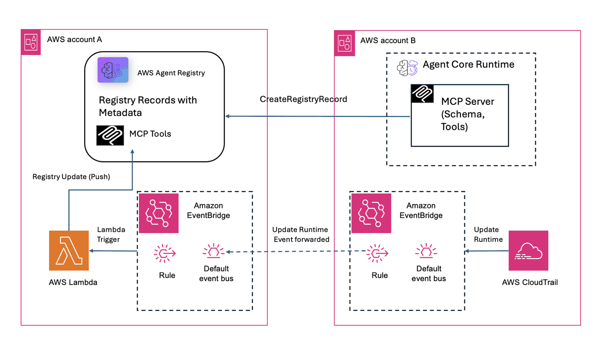

# AWS Agent Registry Push Sync Lambda — Deployment

The tools expose by the MCP server can change over time — new tools get added, existing ones get updated or removed. The AWS Agent Registry needs to stay in sync with these changes. 

This notebook sets up an automated push-based sync pipeline using Lambda that detects runtime updates and keeps the registry up to date — without sharing any credentials with the registry.

## What You'll Set Up

- Create Registry and Record for MCP server
- IAM role for the Lambda
- Lambda function with bundled custom service model
- EventBridge rule to trigger on `UpdateAgentRuntime` CloudTrail events
- (Optional) Cross-account event forwarding from Account B

## Prerequisites

- IAM credentials with permissions to create Lambda, IAM roles, and EventBridge rules
- boto3 installed

## Architecture



The diagram shows the end-to-end event flow from an AgentCore Runtime update in Account B through EventBridge forwarding to Account A, where the Lambda function queries the MCP server for its tools and updates the matching registry record. For single-account deployments, the cross-account forwarding step is skipped and events flow directly within Account A.

---

## 0. Install Dependencies

Installs the required Python packages (`boto3` and `botocore`) from `requirements.txt`.
These are needed for all AWS API calls throughout the notebook.

```python
!pip install -r requirements.txt --quiet --no-warn-conflicts
```

## 1. Configuration

Set the core parameters for the deployment. This includes the AWS region, Lambda function name,
and the AgentCore Identity credential provider mapping for each MCP server account.
The registry will be created in section 2, and the MCP server record in section 3.
If you have MCP servers in multiple accounts, add an entry to `ACCOUNT_CONFIGS` for each one.
For cross-account setups, list the account IDs in `CROSS_ACCOUNT_IDS`.

### Prerequisites

- boto3 >= 1.42.87 with AgentCore service support
- IAM user or role with the permissions below (replace `ACCOUNT_ID` and region as needed)
- The role must also have privileges to create and manage Lambda functions, IAM roles, and EventBridge rules

<details>
<summary>Required IAM policy for Agent Registry (click to expand)</summary>

```json
{
    "Version": "2012-10-17",
    "Statement": [
        {
            "Sid": "AllowCreateRegistry",
            "Effect": "Allow",
            "Action": ["bedrock-agentcore:CreateRegistry"],
            "Resource": ["arn:aws:bedrock-agentcore:us-west-2:ACCOUNT_ID:*"]
        },
        {
            "Sid": "AllowGetUpdateDeleteRegistry",
            "Effect": "Allow",
            "Action": [
                "bedrock-agentcore:GetRegistry",
                "bedrock-agentcore:DeleteRegistry"
            ],
            "Resource": ["arn:aws:bedrock-agentcore:us-west-2:ACCOUNT_ID:registry/*"]
        },
        {
            "Sid": "AllowCreateAndListRecords",
            "Effect": "Allow",
            "Action": [
                "bedrock-agentcore:CreateRegistryRecord",
                "bedrock-agentcore:SearchRegistryRecords"
            ],
            "Resource": ["arn:aws:bedrock-agentcore:us-west-2:ACCOUNT_ID:registry/*"]
        },
        {
            "Sid": "AllowRecordOperations",
            "Effect": "Allow",
            "Action": [
                "bedrock-agentcore:GetRegistryRecord",
                "bedrock-agentcore:DeleteRegistryRecord",
                "bedrock-agentcore:SubmitRegistryRecordForApproval",
                "bedrock-agentcore:UpdateRegistryRecordStatus"
            ],
            "Resource": ["arn:aws:bedrock-agentcore:us-west-2:ACCOUNT_ID:registry/*/record/*"]
        }
    ]
}
```

</details>

---

```python
import boto3
import json
import time
import os
import zipfile

# ── Edit these values ──────────────────────────────────────────────
AWS_REGION = "us-west-2"  # AWS region for all resources
LAMBDA_NAME = "registry-push-sync-lambda"  # Lambda function name

# Registry and MCP server configuration
REGISTRY_NAME = "<your-registry-name>"  # Name for the registry to create
REGISTRY_ID = None  # Will be set by section 1b after creating the registry
MCP_SERVER_NAME = "<mcp-server-name>"  # Name for the MCP server registry record
MCP_SERVER_DESCRIPTION = "<description>"  # Description of the MCP server
MCP_RUNTIME_ARN = (
    "arn:aws:bedrock-agentcore:<region>:<account-id>:runtime/<runtime-id>"  # Runtime ARN of the MCP server
)

# AgentCore Identity credential provider per MCP server account.
# Each key is an AWS account ID that hosts an MCP server on AgentCore Runtime.
# The provider_name must match a credential provider created in section 2.
# The scope is the OAuth scope required by the MCP server (optional).
ACCOUNT_CONFIGS = {
    "<account-a-id>": {  # Account A (registry account)
        "provider_name": "cognito-provider-AcctA",
        "scope": "<resource-server>/access",
    },
    "<account-b-id>": {  # Account B (cross-account MCP server)
        "provider_name": "cognito-provider-AcctB",
        "scope": "<resource-server>/access",
    },
}

# Cross-account: account IDs allowed to forward EventBridge events to Account A.
# Leave empty [] for single-account deployments.
CROSS_ACCOUNT_IDS = ["<account-b-id>"]
# ──────────────────────────────────────────────────────────────────

# Initialize boto3 clients for Account A
session = boto3.Session(region_name=AWS_REGION)
iam = session.client("iam")
lambda_client = session.client("lambda")
events_client = session.client("events")
sts = session.client("sts")

# Resolve the current account ID from caller identity
ACCOUNT_ID = sts.get_caller_identity()["Account"]
print(f"Account: {ACCOUNT_ID} | Region: {AWS_REGION}")
```

---
<br>

## 2. Create Registry and MCP Server Record

Creates an AWS Agent Registry to store MCP server records. The `REGISTRY_ID` is captured
from the response and used by all downstream cells. If the registry already exists, you can
set `REGISTRY_ID` manually in section 1 instead of running this cell.

```python
# Create the registry using the bedrock-agentcore-control client
registry_cp = session.client("bedrock-agentcore-control", region_name=AWS_REGION)

try:
    reg_resp = registry_cp.create_registry(
        name=REGISTRY_NAME,
        description=f"Agent Registry for push sync — {REGISTRY_NAME}",
    )
    REGISTRY_ID = reg_resp.get("registryId") or reg_resp.get("registryArn", "").split("/")[-1]
    print(f"Created registry: {REGISTRY_NAME} → ID: {REGISTRY_ID}")
except Exception as e:
    if "already exists" in str(e).lower() or "conflict" in str(e).lower():
        # Registry exists — list registries to find the ID
        regs = registry_cp.list_registries()
        for r in regs.get("registries", []):
            if r.get("name") == REGISTRY_NAME:
                REGISTRY_ID = r.get("registryId") or r.get("registryArn", "").split("/")[-1]
                break
        print(f"Registry already exists: {REGISTRY_NAME} → ID: {REGISTRY_ID}")
    else:
        raise

if not REGISTRY_ID:
    raise ValueError("Failed to create or find registry. Set REGISTRY_ID manually in section 1.")

# Wait for registry to become READY
print(f"Waiting for registry {REGISTRY_ID} to become READY...")
for _ in range(12):
    reg_status = registry_cp.get_registry(registryId=REGISTRY_ID).get("status", "")
    if reg_status == "READY":
        break
    time.sleep(5)
print(f"Using REGISTRY_ID: {REGISTRY_ID} (status: {reg_status})")
time.sleep(20)
```

---
<br>

## 3. Create Registry Record for MCP Server

Creates a registry record for the MCP server. The record's `server.inlineContent` is populated
with the runtime ARN so the Lambda can match it during sync. The record starts in DRAFT status
and must be approved before the Lambda will update it.

```python
# Build the server schema in the format expected by the registry API.
# The websiteUrl contains the MCP server invocation URL with the encoded runtime ARN,
# which the Lambda uses to match this record to the MCP server.
encoded_arn = MCP_RUNTIME_ARN.replace(":", "%3A").replace("/", "%2F")
mcp_server_url = f"https://bedrock-agentcore.{AWS_REGION}.amazonaws.com/runtimes/{encoded_arn}/invocations"

server_schema = json.dumps(
    {
        "name": f"io.example/{MCP_SERVER_NAME.lower().replace(' ', '-').replace('_', '-')}",
        "description": MCP_SERVER_DESCRIPTION,
        "version": "1.0.0",
        "title": MCP_SERVER_NAME,
        "websiteUrl": mcp_server_url,
        "packages": [
            {
                "registryType": "pip",
                "identifier": MCP_SERVER_NAME.lower().replace(" ", "-").replace("_", "-"),
                "version": "1.0.0",
                "registryBaseUrl": "https://pypi.org",
                "runtimeHint": "uvx",
                "transport": {"type": "stdio"},
            }
        ],
    }
)

try:
    rec_resp = registry_cp.create_registry_record(
        registryId=REGISTRY_ID,
        name=MCP_SERVER_NAME,
        description=MCP_SERVER_DESCRIPTION,
        descriptorType="MCP",
        recordVersion="1.0",
        descriptors={
            "mcp": {
                "server": {
                    "schemaVersion": "2025-12-11",
                    "inlineContent": server_schema,
                },
            },
        },
    )
    RECORD_ID = (
        rec_resp.get("recordId")
        or rec_resp.get("registryRecordId")
        or rec_resp.get("recordArn", "").split("/")[-1]
        or ""
    )
    print(f"Create response keys: {list(rec_resp.keys())}")
    print(f"Created record: {MCP_SERVER_NAME} → ID: {RECORD_ID} (status: DRAFT)")
except Exception as e:
    if "already exists" in str(e).lower() or "conflict" in str(e).lower():
        # Record exists — list records to find the ID
        recs = registry_cp.list_registry_records(registryId=REGISTRY_ID)
        for r in recs.get("registryRecords", []):
            if r.get("name") == MCP_SERVER_NAME:
                RECORD_ID = r.get("recordId") or r.get("registryRecordId", "")
                break
        print(f"Record already exists: {MCP_SERVER_NAME} → ID: {RECORD_ID}")
    else:
        raise

print(f"Using RECORD_ID: {RECORD_ID}")
print("Note: Record is in DRAFT status. Run section 1d to approve it.")
```

<br>

### 3.1. Approve the Registry Record

Moves the record through the approval workflow: DRAFT → PENDING_APPROVAL → APPROVED.
The Lambda only syncs tools to APPROVED records, so this step is required before
the push sync pipeline will work.

```python
# Submit for approval (DRAFT → PENDING_APPROVAL)
record = registry_cp.get_registry_record(registryId=REGISTRY_ID, recordId=RECORD_ID)
current_status = record.get("status", "UNKNOWN")
print(f"Record {RECORD_ID} ({record.get('name', '?')}) — status: {current_status}")

if current_status == "DRAFT":
    registry_cp.submit_registry_record_for_approval(
        registryId=REGISTRY_ID,
        recordId=RECORD_ID,
    )
    print("Submitted for approval (DRAFT → PENDING_APPROVAL)")
    time.sleep(3)  # Wait for status transition

# Approve (PENDING_APPROVAL → APPROVED)
record = registry_cp.get_registry_record(registryId=REGISTRY_ID, recordId=RECORD_ID)
current_status = record.get("status", "UNKNOWN")

if current_status == "PENDING_APPROVAL":
    registry_cp.update_registry_record_status(
        registryId=REGISTRY_ID,
        recordId=RECORD_ID,
        status="APPROVED",
        statusReason="Approved via deployment notebook",
    )
    print("Approved (PENDING_APPROVAL → APPROVED)")
elif current_status == "APPROVED":
    print("Already APPROVED — nothing to do")
else:
    print(f"Unexpected status: {current_status}")
```

---
<br>

## 4. Create AgentCore Identity Credential Providers

Creates a workload identity and OAuth2 credential providers in AgentCore Identity.
The workload identity represents this Lambda as a trusted caller. The credential
providers store the Cognito client credentials securely so the Lambda doesn't need
client secrets in its env vars.

Only run this once — if the resources already exist, the cell will skip them.

```python
# ── Edit these values per account ──────────────────────────────────
# Workload identity name for this Lambda
WORKLOAD_IDENTITY_NAME = "registry-push-sync-agent"

# Each entry maps a provider name to its Cognito OAuth config.
# The provider name must match what you set in ACCOUNT_CONFIGS above.
CREDENTIAL_PROVIDERS = {
    "cognito-provider-AcctA": {
        "token_endpoint": "https://<cognito-domain-a>.auth.<region>.amazoncognito.com/oauth2/token",
        "authorization_endpoint": "https://<cognito-domain-a>.auth.<region>.amazoncognito.com/oauth2/authorize",
        "issuer": "https://cognito-idp.<region>.amazonaws.com/<pool-id-a>",
        "client_id": "<client-id-a>",
        "client_secret": "<client-secret-a>",
    },
    "cognito-provider-AcctB": {
        "token_endpoint": "https://<cognito-domain-b>.auth.<region>.amazoncognito.com/oauth2/token",
        "authorization_endpoint": "https://<cognito-domain-b>.auth.<region>.amazoncognito.com/oauth2/authorize",
        "issuer": "https://cognito-idp.<region>.amazonaws.com/<pool-id-b>",
        "client_id": "<client-id-b>",
        "client_secret": "<client-secret-b>",
    },
}
# ──────────────────────────────────────────────────────────────────

acps_client = session.client("bedrock-agentcore-control", region_name=AWS_REGION)

# Create workload identity (represents this Lambda as a trusted caller)
try:
    wi_resp = acps_client.create_workload_identity(name=WORKLOAD_IDENTITY_NAME)
    print(f"Created workload identity: {WORKLOAD_IDENTITY_NAME} → {wi_resp.get('workloadIdentityArn', '?')}")
except Exception as e:
    if "already exists" in str(e).lower() or "conflict" in str(e).lower():
        print(f"Workload identity already exists: {WORKLOAD_IDENTITY_NAME}")
    else:
        raise

# Create credential providers
for provider_name, config in CREDENTIAL_PROVIDERS.items():
    try:
        resp = acps_client.create_oauth2_credential_provider(
            name=provider_name,
            credentialProviderVendor="CustomOauth2",
            oauth2ProviderConfigInput={
                "customOauth2ProviderConfig": {
                    "oauthDiscovery": {
                        "authorizationServerMetadata": {
                            "issuer": config["issuer"],
                            "authorizationEndpoint": config["authorization_endpoint"],
                            "tokenEndpoint": config["token_endpoint"],
                            "responseTypes": ["token"],
                        }
                    },
                    "clientId": config["client_id"],
                    "clientSecret": config["client_secret"],
                }
            },
        )
        print(f"Created credential provider: {provider_name} → {resp.get('credentialProviderArn', '?')}")
    except Exception as e:
        if "already exists" in str(e).lower() or "conflict" in str(e).lower():
            print(f"Credential provider already exists: {provider_name}")
        else:
            raise
```

---
<br>

## 5. Create IAM Role for the Lambda function

Creates an IAM execution role. The role includes a trust policy
that allows the Lambda service to assume it, the AWS managed `AWSLambdaBasicExecutionRole`
policy for CloudWatch Logs, and an inline policy granting permissions for registry access,
AgentCore Identity token retrieval, and Secrets Manager access.

```python
ROLE_NAME = f"{LAMBDA_NAME}-role"

# Trust policy: allow Lambda service to assume this role
trust_policy = {
    "Version": "2012-10-17",
    "Statement": [
        {
            "Effect": "Allow",
            "Principal": {"Service": "lambda.amazonaws.com"},
            "Action": "sts:AssumeRole",
        }
    ],
}

try:
    role = iam.create_role(
        RoleName=ROLE_NAME,
        AssumeRolePolicyDocument=json.dumps(trust_policy),
        Description="Role for AWS Agent Registry push sync Lambda",
    )
    ROLE_ARN = role["Role"]["Arn"]
    print(f"Created role: {ROLE_ARN}")
except iam.exceptions.EntityAlreadyExistsException:
    ROLE_ARN = f"arn:aws:iam::{ACCOUNT_ID}:role/{ROLE_NAME}"
    print(f"Role already exists: {ROLE_ARN}")

# Attach basic Lambda execution (CloudWatch Logs permissions)
iam.attach_role_policy(
    RoleName=ROLE_NAME,
    PolicyArn="arn:aws:iam::aws:policy/service-role/AWSLambdaBasicExecutionRole",
)

# Add inline policy for registry access, AgentCore Identity, and Secrets Manager
iam.put_role_policy(
    RoleName=ROLE_NAME,
    PolicyName="RegistryAccess",
    PolicyDocument=json.dumps(
        {
            "Version": "2012-10-17",
            "Statement": [
                {
                    "Effect": "Allow",
                    "Action": [
                        "bedrock-agentcore:ListRegistryRecords",  # List records to find matching MCP server
                        "bedrock-agentcore:GetRegistryRecord",  # Get full record details for ARN matching
                        "bedrock-agentcore:UpdateRegistryRecord",  # Update tools when changes detected
                        "bedrock-agentcore:GetResourceOauth2Token",  # Fetch OAuth token from credential provider
                        "bedrock-agentcore:GetWorkloadAccessToken",  # Get workload identity token for Lambda
                        "secretsmanager:GetSecretValue",  # Required by AgentCore Identity to read credentials
                    ],
                    "Resource": "*",
                }
            ],
        }
    ),
)
print("Attached policies")

# Wait for role propagation
print("Waiting 10s for IAM propagation...")
time.sleep(10)
```

---
<br>

## 6. Build and Create Lambda Function

This section has two cells. The first cell packages `handler.py` along with
`boto3`, `botocore`, and `requests` into a deployment zip. boto3 >= 1.42.87
includes the registry control plane service model natively, so no custom model
files are needed. The second cell builds the environment variables and creates
or updates the Lambda function.

```python
# Build the deployment zip — includes handler.py, boto3/botocore (>= 1.42.87),
# and the requests library. boto3 1.42.87+ includes the
# bedrock-agentcore-registry-control service model natively,
# so no custom model files are needed.
ZIP_PATH = "handler.zip"

# Install dependencies into a temp directory for bundling into the Lambda zip
import subprocess
import tempfile

with tempfile.TemporaryDirectory() as tmpdir:
    subprocess.run(
        [
            "pip",
            "install",
            "boto3>=1.42.87",
            "requests",
            "-t",
            tmpdir,
            "--quiet",
            "--no-warn-conflicts",
        ],
        check=True,
    )
    print("Bundled: boto3, botocore, requests")

    with zipfile.ZipFile(ZIP_PATH, "w", zipfile.ZIP_DEFLATED) as zf:
        zf.write("handler.py")
        # Bundle all dependencies from temp directory
        for root, dirs, files in os.walk(tmpdir):
            for f in files:
                full_path = os.path.join(root, f)
                arcname = os.path.relpath(full_path, tmpdir)
                zf.write(full_path, arcname)

zip_size = os.path.getsize(ZIP_PATH)
print(f"Built {ZIP_PATH} ({zip_size:,} bytes)")
```

```python
# Build Lambda environment variables from ACCOUNT_CONFIGS.
# No client secrets here — only provider names and scopes.
# The Lambda uses WORKLOAD_IDENTITY_NAME to get a workload token,
# then CREDENTIAL_PROVIDER_{ACCT} to fetch the OAuth token via AgentCore Identity.
env_vars = {
    "REGISTRY_ID": REGISTRY_ID,
    "WORKLOAD_IDENTITY_NAME": WORKLOAD_IDENTITY_NAME,
}
for acct_id, config in ACCOUNT_CONFIGS.items():
    env_vars[f"CREDENTIAL_PROVIDER_{acct_id}"] = config["provider_name"]
    if config.get("scope"):
        env_vars[f"CREDENTIAL_SCOPE_{acct_id}"] = config["scope"]

# Create or update the Lambda function
with open(ZIP_PATH, "rb") as f:
    zip_bytes = f.read()

try:
    resp = lambda_client.create_function(
        FunctionName=LAMBDA_NAME,
        Runtime="python3.12",
        Role=ROLE_ARN,
        Handler="handler.handler",
        Code={"ZipFile": zip_bytes},
        Timeout=30,
        MemorySize=128,
        Environment={"Variables": env_vars},
        Description="Syncs MCP server tools to AWS Agent Registry on runtime updates",
    )
    LAMBDA_ARN = resp["FunctionArn"]
    print(f"Created Lambda: {LAMBDA_ARN}")
except lambda_client.exceptions.ResourceConflictException:
    # Function exists — update code and config
    lambda_client.update_function_code(
        FunctionName=LAMBDA_NAME,
        ZipFile=zip_bytes,
    )
    time.sleep(5)  # Wait for code update
    lambda_client.update_function_configuration(
        FunctionName=LAMBDA_NAME,
        Environment={"Variables": env_vars},
    )
    LAMBDA_ARN = f"arn:aws:lambda:{AWS_REGION}:{ACCOUNT_ID}:function:{LAMBDA_NAME}"
    print(f"Updated existing Lambda: {LAMBDA_ARN}")
```

---
<br>

## 7. Create EventBridge Rule
Creates a rule in Account A that matches `UpdateAgentRuntime` event with Target as the Lambda created in previous cell.

```python
RULE_NAME = f"{LAMBDA_NAME}-trigger"

# Match UpdateAgentRuntime CloudTrail events from AgentCore.
# This fires when any runtime is created or updated in this account
# (or forwarded from a cross-account EventBridge bus).
event_pattern = {
    "source": ["aws.bedrock-agentcore"],
    "detail-type": ["AWS API Call via CloudTrail"],
    "detail": {"eventName": ["UpdateAgentRuntime"]},
}

events_client.put_rule(
    Name=RULE_NAME,
    EventPattern=json.dumps(event_pattern),
    State="ENABLED",
    Description="Triggers push sync Lambda on AgentCore runtime updates",
)
print(f"Created EventBridge rule: {RULE_NAME}")

# Add Lambda as target
events_client.put_targets(
    Rule=RULE_NAME,
    Targets=[{"Id": "push-sync-lambda", "Arn": LAMBDA_ARN}],
)
print("Added Lambda target")

# Allow EventBridge to invoke the Lambda
RULE_ARN = f"arn:aws:events:{AWS_REGION}:{ACCOUNT_ID}:rule/{RULE_NAME}"
try:
    lambda_client.add_permission(
        FunctionName=LAMBDA_NAME,
        StatementId="eventbridge-invoke",
        Action="lambda:InvokeFunction",
        Principal="events.amazonaws.com",
        SourceArn=RULE_ARN,
    )
    print("Added Lambda invoke permission for EventBridge")
except lambda_client.exceptions.ResourceConflictException:
    print("Lambda invoke permission already exists")
```

---
<br>

## 8. Cross-Account Setup (Optional)

Run this section if MCP servers are in a different account (Account B) than the registry (Account A).
This sets up event forwarding so that `UpdateAgentRuntime` events in Account B
are relayed to Account A's EventBridge bus, which triggers the push sync Lambda.

### 8.1 Grant Account B Permission on Account A's Event Bus

Adds a resource-based policy on Account A's default EventBridge bus allowing
each cross-account ID to call `events:PutEvents`. Without this, Account B's
forwarding rule cannot deliver events here.

```python
# Grant each cross-account ID permission to put events on Account A's default bus
for acct_id in CROSS_ACCOUNT_IDS:
    try:
        events_client.put_permission(
            EventBusName="default",
            Action="events:PutEvents",
            Principal=acct_id,
            StatementId=f"AllowAccount{acct_id}",
        )
        print(f"Allowed account {acct_id} to send events to this bus")
    except events_client.exceptions.ResourceAlreadyExistsException:
        print(f"Permission for account {acct_id} already exists")

if not CROSS_ACCOUNT_IDS:
    print("No cross-account IDs configured — skipping")
```

<br>

### 8.2 Initialize Account B Session

Creates a separate boto3 session using the AWS CLI profile for Account B.
Set `ACCOUNT_B_PROFILE` to the profile name configured in your `~/.aws/config`.

```python
# ── Edit this value ──────────────────────────────────────────────
ACCOUNT_B_PROFILE = "<account-b-profile>"  # AWS CLI profile for Account B
# ──────────────────────────────────────────────────────────────────

session_b = boto3.Session(profile_name=ACCOUNT_B_PROFILE, region_name=AWS_REGION)
iam_b = session_b.client("iam")
events_b = session_b.client("events")
sts_b = session_b.client("sts")

ACCOUNT_B_ID = sts_b.get_caller_identity()["Account"]
print(f"Account B: {ACCOUNT_B_ID} | Profile: {ACCOUNT_B_PROFILE}")
```

<br>

### 8.3 Create IAM Forwarding Role in Account B

Creates an IAM role in Account B that EventBridge can assume to forward events.
The role's inline policy grants `events:PutEvents` on Account A's default bus.

```python
# Create IAM role in Account B that EventBridge assumes to forward events
FORWARD_ROLE_NAME = "EventBridgeForwardRole"

trust_policy_b = {
    "Version": "2012-10-17",
    "Statement": [
        {
            "Effect": "Allow",
            "Principal": {"Service": "events.amazonaws.com"},
            "Action": "sts:AssumeRole",
        }
    ],
}

try:
    role_b = iam_b.create_role(
        RoleName=FORWARD_ROLE_NAME,
        AssumeRolePolicyDocument=json.dumps(trust_policy_b),
        Description="Allows EventBridge to forward events to Account A",
    )
    FORWARD_ROLE_ARN = role_b["Role"]["Arn"]
    print(f"Created role: {FORWARD_ROLE_ARN}")
except iam_b.exceptions.EntityAlreadyExistsException:
    FORWARD_ROLE_ARN = f"arn:aws:iam::{ACCOUNT_B_ID}:role/{FORWARD_ROLE_NAME}"
    print(f"Role already exists: {FORWARD_ROLE_ARN}")

# Attach inline policy: allow PutEvents to Account A's default event bus
iam_b.put_role_policy(
    RoleName=FORWARD_ROLE_NAME,
    PolicyName="PutEventsToAccountA",
    PolicyDocument=json.dumps(
        {
            "Version": "2012-10-17",
            "Statement": [
                {
                    "Effect": "Allow",
                    "Action": "events:PutEvents",
                    "Resource": f"arn:aws:events:{AWS_REGION}:{ACCOUNT_ID}:event-bus/default",
                }
            ],
        }
    ),
)
print("Attached forwarding policy")

# Wait for IAM role propagation in Account B
print("Waiting 10s for IAM propagation...")
time.sleep(10)
```

<br>

### 8.4 Create EventBridge Forwarding Rule in Account B

Creates a rule in Account B that matches `UpdateAgentRuntime` CloudTrail events
and forwards them to Account A's default event bus using the IAM role from 5.3.

```python
# Create the forwarding rule in Account B matching UpdateAgentRuntime events
FORWARD_RULE_NAME = "forward-runtime-updates"

events_b.put_rule(
    Name=FORWARD_RULE_NAME,
    EventPattern=json.dumps(
        {
            "source": ["aws.bedrock-agentcore"],
            "detail-type": ["AWS API Call via CloudTrail"],
            "detail": {"eventName": ["UpdateAgentRuntime"]},
        }
    ),
    State="ENABLED",
    Description="Forwards UpdateAgentRuntime events to Account A",
)
print(f"Created forwarding rule: {FORWARD_RULE_NAME}")

# Target: Account A's default event bus, using the forwarding role
events_b.put_targets(
    Rule=FORWARD_RULE_NAME,
    Targets=[
        {
            "Id": "account-a-bus",
            "Arn": f"arn:aws:events:{AWS_REGION}:{ACCOUNT_ID}:event-bus/default",
            "RoleArn": FORWARD_ROLE_ARN,
        }
    ],
)
print("Added Account A event bus as target")
```

---
<br><br>

## Deployment Complete

At this point the Registry and MCP record are created. The Lambda function, IAM role, and EventBridge rule are all deployed.
When an `UpdateAgentRuntime` CloudTrail event fires (same account or cross-account),
EventBridge will trigger the Lambda, which connects to the MCP server, discovers its
tools, and updates the matching registry record automatically.

**All cells below are optional** — they are provided for manual testing, log inspection,
record approval, and cleanup.


## 9. Test the Lambda

This cell manually invokes the Lambda with a synthetic CloudTrail event.

In production, you don't need to do this — EventBridge automatically delivers
a real `UpdateAgentRuntime` CloudTrail event whenever a runtime is updated.
That event contains the `agentRuntimeId` and `agentRuntimeArn` in its
`detail.requestParameters` and `detail.responseElements` fields, which the
Lambda uses to construct the MCP server URL and resolve the account ID.

For manual testing, you need to supply a valid `TEST_RUNTIME_ID` so the
Lambda can hit a real MCP server endpoint and fetch its tools. The
`TEST_ACCOUNT_ID` is set to the current session's account (Account A).
If testing a cross-account runtime, set it to the Account B ID instead.

```python
# Replace with your runtime ID.
# Account ID defaults to the first cross-account ID if configured,
# otherwise falls back to the current session's account (Account A).
TEST_ACCOUNT_ID = CROSS_ACCOUNT_IDS[0] if CROSS_ACCOUNT_IDS else ACCOUNT_ID
TEST_RUNTIME_ID = "<runtime-id>"

test_event = {
    "detail-type": "AWS API Call via CloudTrail",
    "source": "aws.bedrock-agentcore",
    "detail": {
        "eventName": "UpdateAgentRuntime",
        "awsRegion": AWS_REGION,
        "requestParameters": {
            "agentRuntimeId": TEST_RUNTIME_ID,
        },
        "responseElements": {
            "agentRuntimeArn": f"arn:aws:bedrock-agentcore:{AWS_REGION}:{TEST_ACCOUNT_ID}:runtime/{TEST_RUNTIME_ID}",
            "agentRuntimeId": TEST_RUNTIME_ID,
            "status": "UPDATING",
        },
    },
}

response = lambda_client.invoke(
    FunctionName=LAMBDA_NAME,
    Payload=json.dumps(test_event),
)

result = json.loads(response["Payload"].read())
if "FunctionError" in response:
    print(f"ERROR: {json.dumps(result, indent=2)}")
else:
    body = json.loads(result.get("body", "{}"))
    print(f"MCP URL: {body.get('mcp_url', '?')}")
    print(f"Tools found: {body.get('tool_count', 0)}")
    print(f"Tools: {body.get('tools', [])}")
    print(f"Sync result: {body.get('sync', {})}")
```

---
<br>

## 10. Check Lambda Logs
The Lambda logs will show invocation details for the Lambda.

```python
# Fetch the most recent CloudWatch log stream for the Lambda
logs_client = session.client("logs")

log_group = f"/aws/lambda/{LAMBDA_NAME}"

# Get the latest log stream (most recent invocation)
streams = logs_client.describe_log_streams(
    logGroupName=log_group,
    orderBy="LastEventTime",
    descending=True,
    limit=1,
)

if streams["logStreams"]:
    stream_name = streams["logStreams"][0]["logStreamName"]
    events = logs_client.get_log_events(
        logGroupName=log_group,
        logStreamName=stream_name,
        limit=20,
    )
    for e in events["events"]:
        msg = e["message"].strip()
        if msg and not msg.startswith("REPORT") and not msg.startswith("END"):
            print(msg)
else:
    print("No log streams found")
```

---
<br>

## 11. Cleanup (Optional)

Remove all resources created by this notebook.

```python
# Derived names — so cleanup can run without earlier cells
ROLE_NAME = f"{LAMBDA_NAME}-role"
RULE_NAME = f"{LAMBDA_NAME}-trigger"

# Remove EventBridge targets and rule
try:
    events_client.remove_targets(Rule=RULE_NAME, Ids=["push-sync-lambda"])
    events_client.delete_rule(Name=RULE_NAME)
    print(f"Deleted EventBridge rule: {RULE_NAME}")
except Exception as e:
    print(f"Rule cleanup: {e}")

# Remove cross-account permissions
for acct_id in CROSS_ACCOUNT_IDS:
    try:
        events_client.remove_permission(
            EventBusName="default",
            StatementId=f"AllowAccount{acct_id}",
        )
        print(f"Removed permission for account {acct_id}")
    except Exception as e:
        print(f"Permission cleanup: {e}")

# Delete Lambda
try:
    lambda_client.delete_function(FunctionName=LAMBDA_NAME)
    print(f"Deleted Lambda: {LAMBDA_NAME}")
except Exception as e:
    print(f"Lambda cleanup: {e}")

# Delete IAM role (detach policies first)
try:
    iam.detach_role_policy(
        RoleName=ROLE_NAME,
        PolicyArn="arn:aws:iam::aws:policy/service-role/AWSLambdaBasicExecutionRole",
    )
    iam.delete_role_policy(RoleName=ROLE_NAME, PolicyName="RegistryAccess")
    iam.delete_role(RoleName=ROLE_NAME)
    print(f"Deleted IAM role: {ROLE_NAME}")
except Exception as e:
    print(f"Role cleanup: {e}")

print("Cleanup complete.")

# ── Registry cleanup ──────────────────────────────────────────────
try:
    reg_cleanup = session.client("bedrock-agentcore-control", region_name=AWS_REGION)
    # Delete registry record first (registry can't be deleted with records in it)
    if "RECORD_ID" in dir() and RECORD_ID:
        try:
            reg_cleanup.delete_registry_record(registryId=REGISTRY_ID, recordId=RECORD_ID)
            print(f"Deleted registry record: {RECORD_ID}")
        except Exception as e:
            print(f"Record cleanup: {e}")
    # Delete the registry
    if REGISTRY_ID:
        try:
            reg_cleanup.delete_registry(registryId=REGISTRY_ID)
            print(f"Deleted registry: {REGISTRY_ID}")
        except Exception as e:
            print(f"Registry cleanup: {e}")
except Exception as e:
    print(f"Registry cleanup skipped: {e}")

# ── AgentCore Identity cleanup ────────────────────────────────────
try:
    acps_cleanup = session.client("bedrock-agentcore-control", region_name=AWS_REGION)
    # Delete credential providers
    for provider_name in CREDENTIAL_PROVIDERS.keys():
        try:
            acps_cleanup.delete_oauth2_credential_provider(name=provider_name)
            print(f"Deleted credential provider: {provider_name}")
        except Exception as e:
            print(f"Credential provider cleanup ({provider_name}): {e}")
    # Delete workload identity
    try:
        acps_cleanup.delete_workload_identity(name=WORKLOAD_IDENTITY_NAME)
        print(f"Deleted workload identity: {WORKLOAD_IDENTITY_NAME}")
    except Exception as e:
        print(f"Workload identity cleanup: {e}")
except Exception as e:
    print(f"AgentCore Identity cleanup skipped: {e}")

# ── Account B cleanup (cross-account, optional) ──────────────────
# Only runs if ACCOUNT_B_PROFILE is set and not a placeholder.
if "session_b" in dir() or (ACCOUNT_B_PROFILE and ACCOUNT_B_PROFILE != "<account-b-profile>"):
    try:
        session_b = boto3.Session(profile_name=ACCOUNT_B_PROFILE, region_name=AWS_REGION)
        iam_b = session_b.client("iam")
        events_b = session_b.client("events")
        FORWARD_ROLE_NAME = "EventBridgeForwardRole"
        FORWARD_RULE_NAME = "forward-runtime-updates"
        # Remove forwarding rule targets and rule
        try:
            events_b.remove_targets(Rule=FORWARD_RULE_NAME, Ids=["account-a-bus"])
            events_b.delete_rule(Name=FORWARD_RULE_NAME)
            print(f"Deleted Account B forwarding rule: {FORWARD_RULE_NAME}")
        except Exception as e:
            print(f"Account B rule cleanup: {e}")
        # Remove forwarding IAM role
        try:
            iam_b.delete_role_policy(RoleName=FORWARD_ROLE_NAME, PolicyName="PutEventsToAccountA")
            iam_b.delete_role(RoleName=FORWARD_ROLE_NAME)
            print(f"Deleted Account B role: {FORWARD_ROLE_NAME}")
        except Exception as e:
            print(f"Account B role cleanup: {e}")
    except Exception as e:
        print(f"Account B cleanup skipped: {e}")
else:
    print("Account B cleanup skipped — no profile configured")
```
