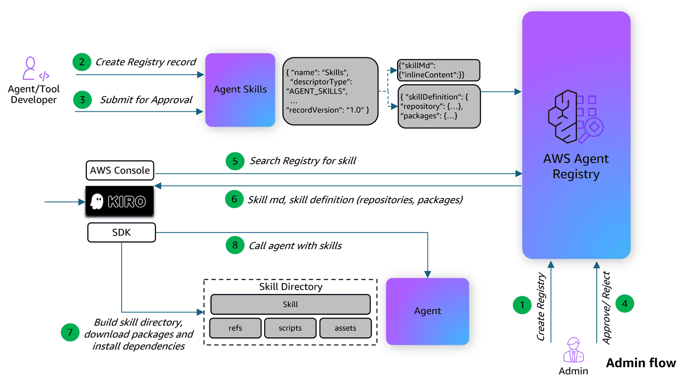

# Publishing and Discovering Agent Skills with AWS Agent Registry

This notebook demonstrates how to register, discover, and use **Agent Skills** in AWS Agent Registry. Agent Skills are a new descriptor type (`AGENT_SKILLS`) that allows you to publish reusable skill definitions — complete with instructions (`SKILL.md`) and package metadata — so that AI agents can dynamically discover and load them at runtime.



## What You'll Learn

- Create an **Agent Registry** to organize skill records
- Register an **Agent Skill** record with a `SKILL.md` file and a skill definition (repository + packages)
- Manage record status transitions (DRAFT → PENDING_APPROVAL → APPROVED)
- Connect to the Agent Registry's **data plane** for dynamic skill discovery
- Build a Strands Agent that **dynamically searches, downloads, and loads skills** from the Agent Registry at runtime

## What Are Agent Skills?

An [Agent Skill](https://agentskills.io/specification) is a specialized capability that enables a general-purpose agent to perform specific tasks requiring domain knowledge, tools, or particular workflows. Unlike MCP (which defines tool servers) or A2A (which defines agent-to-agent communication), skills package **instructions and context** that teach an agent *how* to accomplish something.

A skill follows a loosely defined folder structure where only `SKILL.md` is required:

```
my-skill/
├── SKILL.md          # Required: instructions + metadata
├── scripts/          # Optional: executable code
├── references/       # Optional: documentation, runbooks
└── assets/           # Optional: templates, configs, sample data
```

### SKILL.md Format

The `SKILL.md` file has YAML frontmatter with two required fields (`name` and `description`), followed by markdown instructions:

## When to use this skill
Use this skill when the user needs to work with PDF files...


### How Skills are represented in the Agent Registry

An `AGENT_SKILLS` record in the Agent Registry contains two descriptors:

| Component | Description |
|---|---|
| `skillMd` | The full `SKILL.md` content (frontmatter + instructions). This is indexed for semantic search and returned in search results. |
| `skillDefinition` | JSON metadata with a `repository` reference (e.g., GitHub URL for downloading supporting files) and `packages` list (runtime dependencies from PyPI, npm, etc.). May optionally include `schemaVersion`, `websiteUrl`, and `_meta` for custom metadata. |

### How Standalone Skills Work

This notebook demonstrates how to register standalone skills — skills that exist as downloadable artifacts in the Agent Registry, independent of any specific agent. The typical consumption flow is:

1. A consumer agent searches the Agent Registry and finds a matching skill
2. The agent reads the skill's name and description to decide if it's relevant (progressive disclosure — the agent does not load the full `SKILL.md` into context until needed)
3. If the skill matches, the agent downloads the skill package (SKILL.md + supporting files from the repository URL)
4. The agent installs declared packages and loads the skill instructions into its context
5. The agent executes the task following the skill's guidance

### Architecture Overview

```
Publisher                          Registry                         Consumer Agent
─────────                          ────────                         ──────────────
  │                                   │                                  │
  │  1. Create skill record           │                                  │
  │     (SKILL.md + definition)       │                                  │
  │──────────────────────────────────>│                                  │
  │                                   │                                  │
  │  2. Submit for approval           │                                  │
  │──────────────────────────────────>│                                  │
  │                                   │                                  │
  │  3. Admin approves                │                                  │
  │──────────────────────────────────>│                                  │
  │                                   │                                  │
  │                                   │  4. Search for skills            │
  │                                   │<─────────────────────────────────│
  │                                   │                                  │
  │                                   │  5. Return name + description    │
  │                                   │     (progressive disclosure)     │
  │                                   │─────────────────────────────────>│
  │                                   │                                  │
  │                                   │  6. Agent decides skill matches  │
  │                                   │     → downloads full package     │
  │                                   │     → installs dependencies      │
  │                                   │     → executes task              │
  │                                   │                                  │
```

## Setup

### Prerequisites

- AWS account with IAM credentials configured
- Python 3.10+
- `boto3 >= 1.42.87`
- The `pdf SKILL.md` file located at `./skill registry/pdf SKILL.md` (included in this sample)
- IAM user or role with the permissions below (replace `ACCOUNT_ID` and `REGION` as needed)


<details>
<summary>Required IAM policy (click to expand)</summary>

```json
{
    "Version": "2012-10-17",
    "Statement": [
        {
            "Sid": "AllowCreateRegistry",
            "Effect": "Allow",
            "Action": ["bedrock-agentcore:CreateRegistry"],
            "Resource": ["arn:aws:bedrock-agentcore:REGION:ACCOUNT_ID:*"]
        },
        {
            "Sid": "AllowGetUpdateDeleteRegistry",
            "Effect": "Allow",
            "Action": [
                "bedrock-agentcore:GetRegistry",
                "bedrock-agentcore:DeleteRegistry"
            ],
            "Resource": ["arn:aws:bedrock-agentcore:REGION:ACCOUNT_ID:registry/*"]
        },
        {
            "Sid": "AllowCreateAndListRecords",
            "Effect": "Allow",
            "Action": [
                "bedrock-agentcore:CreateRegistryRecord",
                "bedrock-agentcore:SearchRegistryRecords"
            ],
            "Resource": ["arn:aws:bedrock-agentcore:REGION:ACCOUNT_ID:registry/*"]
        },
        {
            "Sid": "AllowRecordOperations",
            "Effect": "Allow",
            "Action": [
                "bedrock-agentcore:GetRegistryRecord",
                "bedrock-agentcore:DeleteRegistryRecord",
                "bedrock-agentcore:SubmitRegistryRecordForApproval"
            ],
            "Resource": ["arn:aws:bedrock-agentcore:REGION:ACCOUNT_ID:registry/*/record/*"]
        }
    ]
}
```

</details>

**Note:** This notebook uses `strands-agents`, `strands-agents-tools`, and `bedrock-agentcore` for agent execution and registry operations. These are installed automatically via `requirements.txt`.

### Install Dependencies

```python
!pip install -r requirements.txt
```

### Initialize AWS Session and Clients

Configure boto3 clients for both registry management and search operations.

```python
from boto3.session import Session
import json
import time

# Configuration
boto_session = Session()
AWS_REGION = boto_session.region_name

# AWS_PROFILE = "aws-profile"  # Change this to your profile. Comment this line if running on SageMaker

# Set AWS credentials if not using Amazon SageMaker notebook
# os.environ["AWS_PROFILE"] = AWS_PROFILE

# Create boto3 session
# boto_session = boto3.Session(profile_name=AWS_PROFILE, region_name=AWS_REGION)  # Use this if you are not running on SageMaker

# Client for registry management
registry_client = boto_session.client("bedrock-agentcore-control", region_name=AWS_REGION)

# Client for search
search_client = boto_session.client("bedrock-agentcore", region_name=AWS_REGION)

print(f"Session ready | Region: {AWS_REGION}")
```

### Helper Functions

Agent Registry creation is an asynchronous operation. This helper polls until the Agent Registry reaches `READY` status.

```python
# ANSI colors for terminal output
class C:
    GREEN = "\033[92m"
    RED = "\033[91m"
    YELLOW = "\033[93m"
    CYAN = "\033[96m"
    BOLD = "\033[1m"
    DIM = "\033[2m"
    RESET = "\033[0m"


def wait_for_registry(registry_id, interval=5):
    while True:
        resp = registry_client.get_registry(registryId=registry_id)
        status = resp["status"]
        if status == "READY":
            print(f"  {C.GREEN}✅ Registry Status: {status}{C.RESET}")
            resp.pop("ResponseMetadata", None)
            print(json.dumps(resp, indent=2, default=str))
            return resp
        if status.endswith("_FAILED"):
            print(f"  {C.RED}❌ Registry Status: {status}{C.RESET}")
            raise Exception(f"Registry failed: {status} - {resp.get('statusReason')}")
        print(f"  {C.YELLOW}⏳ Registry Status: {status}{C.RESET}")
        time.sleep(interval)


def pretty_print_response(response):
    """Pretty-print API response, stripping ResponseMetadata."""
    data = {k: v for k, v in response.items() if k != "ResponseMetadata"}
    print(json.dumps(data, indent=2, default=str))
```

---
## 1. Create an Agent Registry

Create an Agent Registry to store skill records. We set `autoApproval` to `False` so that records must go through the approval workflow before they become searchable.

```python
create_registry_respone = registry_client.create_registry(
    name="Skills_Registry",
    description="Registry for Skills",
    approvalConfiguration={"autoApproval": False},
)

REGISTRY_ARN = create_registry_respone["registryArn"]
REGISTRY_ID = REGISTRY_ARN.split("/")[-1]

wait_for_registry(REGISTRY_ID)

print(f"  {C.GREEN}✅ Registry created!{C.RESET}")
print(f"  {C.BOLD}ARN:{C.RESET}  {C.CYAN}{REGISTRY_ARN}{C.RESET}")
print(f"  {C.BOLD}ID:{C.RESET}   {C.CYAN}{REGISTRY_ID}{C.RESET}")
```

---
## 2. Register an Agent Skill

### 2.1 Prepare the Skill Descriptors

An `AGENT_SKILLS` record requires two descriptors:

1. **`skillMd`** — The full `SKILL.md` file content (frontmatter + instructions). In this example, we use a PDF processing skill that teaches agents how to read, create, merge, split, and manipulate PDF files. The entire markdown content is indexed for semantic search.

2. **`skillDefinition`** — A JSON object with the following fields:

| Field | Required | Description |
|---|---|---|
| `repository.url` | Yes | GitHub URL pointing to the skill's source files (scripts, references, assets) |
| `repository.source` | Yes | Source type (e.g., `"github"`) |
| `packages` | No | List of runtime dependencies. Each entry has `registryType` (`pypi`, `npm`), `identifier`, and `version` |
| `schemaVersion` | No | Version of the skill definition schema (e.g., `"0.1.0"`) |
| `websiteUrl` | No | URL to the skill's documentation or homepage |
| `_meta` | No | Custom metadata key-value pairs (e.g., build info, tags) |

Note: The `name` and `description` fields on the registry record should match the frontmatter in `SKILL.md`. The Agent Registry does not currently auto-populate these from the markdown — publishers are responsible for keeping them consistent.

### 2.2 Create the Skill Record

Here we register a PDF processing skill. The `SKILL.md` file is loaded from the local `skill registry` folder and passed as `skillMd` inline content. The `skillDefinition` references the skill's GitHub repository and declares `pypdf` and `reportlab` as required PyPI packages.

```python
def load_skill_md(file_path):
    with open(file_path, "r", encoding="utf-8") as f:
        return f.read()


skill_definition_schema = json.dumps(
    {
        "repository": {
            "url": "https://github.com/anthropics/skills/tree/main/skills/pdf",
            "source": "github",
        },
        "packages": [
            {"registryType": "pypi", "identifier": "pypdf", "version": "5.1.0"},
            {"registryType": "pypi", "identifier": "reportlab", "version": "4.4.0"},
        ],
    }
)

skill_record_response = registry_client.create_registry_record(
    registryId=REGISTRY_ID,
    name="PDF_Processing_Skill",
    description="Use this skill whenever the user wants to do anything with PDF files. This includes reading or extracting text/tables from PDFs, combining or merging multiple PDFs into one, splitting PDFs apart, rotating pages, adding watermarks, creating new PDFs, filling PDF forms, encrypting/decrypting PDFs, extracting images, and OCR on scanned PDFs to make them searchable. If the user mentions a .pdf file or asks to produce one, use this skill.",
    descriptorType="AGENT_SKILLS",
    descriptors={
        "agentSkills": {
            "skillMd": {"inlineContent": load_skill_md("./skill registry/pdf SKILL.md")},
            "skillDefinition": {"inlineContent": skill_definition_schema},
        }
    },
    recordVersion="1.0",
)

SKILL_RECORD_ARN = skill_record_response["recordArn"]
SKILL_RECORD_ID = SKILL_RECORD_ARN.split("/")[-1]
print(f"  {C.GREEN}✅ Skill Record created: {C.CYAN}{SKILL_RECORD_ID}{C.RESET}")
```

### 2.3 List Records

Verify the skill record was created. It starts in `DRAFT` status — it is not yet searchable.

```python
records_response = registry_client.list_registry_records(registryId=REGISTRY_ID)

print(f"{C.BOLD}=== Registry Records ==={C.RESET}")
print(f"Found {len(records_response['registryRecords'])} record(s):\n")
for rec in records_response["registryRecords"]:
    status = rec["status"]
    sc = C.GREEN if status == "APPROVED" else C.YELLOW if status in ("DRAFT", "PENDING_APPROVAL") else C.RED
    print(
        f"  {sc}[{status}]{C.RESET} {rec['name']} | {C.CYAN}{rec['descriptorType']}{C.RESET} | {C.DIM}{rec['recordId']}{C.RESET}"
    )
```

---
## 3. Approve the Skill Record

Records must be approved before they appear in search results. The approval workflow follows the standard registry pattern:

```
DRAFT → PENDING_APPROVAL → APPROVED (now searchable)
                         → REJECTED
                         → DEPRECATED (after approval, if retired)
```

In a production environment, the publisher submits the record and a separate admin reviews and approves it. Here we perform both steps.

```python
# Step 1: Publisher submits for approval
registry_client.submit_registry_record_for_approval(registryId=REGISTRY_ID, recordId=SKILL_RECORD_ID)
print(f"  {C.YELLOW}⏳ Skill record → PENDING_APPROVAL{C.RESET}")

# Step 2: Admin approves
registry_client.update_registry_record_status(
    registryId=REGISTRY_ID,
    recordId=SKILL_RECORD_ID,
    statusReason="Approved by admin",
    status="APPROVED",
)
print(f"  {C.GREEN}✅ Skill record → APPROVED{C.RESET}")
```

---
## 4. Dynamic Skill Discovery and Execution

AWS Agent Registry stores skills that are easily discoverable through semantic search. This enables an agent to dynamically discover relevant skills at runtime, load them into its execution environment, and execute them accordingly.

We provide the agent with a custom `search_and_load_skill` tool that searches the Agent Registry and downloads the matching skill in a single step.

The runtime flow is:

1. Agent receives a user task (e.g., "Create a PDF")
2. Agent calls `search_and_load_skill` to find, download, and load the matching skill
3. Agent executes the task following the skill's `SKILL.md` instructions

### 4.1 Define the Search and Load Skill Tool

```python
# Wait for search index to update
print(f"  {C.YELLOW}⏳ Waiting 100s for search index...{C.RESET}")
time.sleep(100)

import os
from strands import Agent, tool
from strands.models import BedrockModel
from strands_tools import file_read
from utils.python_exec_tool import python_exec, run_shell
from utils.skill_loader import load_skill_from_registry


@tool
def search_and_load_skill(query: str) -> str:
    """Search the AWS Agent Registry for a skill and load it locally.

    Performs semantic search, downloads the top matching skill package
    (SKILL.md + supporting files), installs dependencies, and returns
    the skill instructions.

    Args:
        query: Natural language description of the skill needed (e.g., 'PDF processing').

    Returns:
        The skill's SKILL.md content with instructions for completing the task.
    """
    response = search_client.search_registry_records(registryIds=[REGISTRY_ARN], searchQuery=query, maxResults=5)
    response.pop("ResponseMetadata", None)

    records = response.get("registryRecords", [])
    if not records:
        return f"No skills found for query: {query}"

    print(f"Found {len(records)} skill(s) matching '{query}':")
    for i, rec in enumerate(records):
        print(f"  {i + 1}. {rec.get('name', 'unknown')} [{rec.get('descriptorType', '')}]")
    print(f"\nLoading top result: {records[0].get('name', 'unknown')}...")

    skill_dir, skill_md = load_skill_from_registry(response, record_index=0)

    abs_dir = os.path.abspath(skill_dir)
    skill_name = records[0].get("name", "unknown")
    return f"Skill '{skill_name}' loaded into {abs_dir}.\n\nSKILL.md instructions:\n\n{skill_md}\n\nUse working_dir='{os.getcwd()}' when running code."


print(f"  {C.GREEN}✅ search_and_load_skill tool ready.{C.RESET}")
```

---
### 4.2 Create the Agent

We create a Strands Agent with the `search_and_load_skill` tool, plus execution tools (`file_read`, `python_exec`, `run_shell`) so it can follow the skill's instructions.

```python
MODEL_ID = "us.anthropic.claude-sonnet-4-20250514-v1:0"

model = BedrockModel(model_id=MODEL_ID, region_name=AWS_REGION)
agent = Agent(
    model=model,
    tools=[search_and_load_skill, file_read, python_exec, run_shell],
    system_prompt=(
        "You are an agent with access to the AWS Agent Registry. "
        "When asked to perform a task, search the registry for a relevant skill. "
        "If found, load the skill and use its instructions to complete the task."
    ),
)

print(f"  {C.GREEN}✅ Agent ready with dynamic skill discovery.{C.RESET}")
print(f"  {C.BOLD}Available tools:{C.RESET} {C.CYAN}{agent.tool_names}{C.RESET}")
```

---
### 4.3 Execute a Task with Dynamic Skill Discovery

Now we send a natural language request to the agent. The agent will:
1. Call `search_and_load_skill` to find and download a matching skill from the Agent Registry
2. Execute the task using the skill's instructions

```python
agent("Create a simple PDF with title 'Hello from Agent Skills' and save it in the current directory")
```

---
## 5. Cleanup (Optional)

Delete the skill record and Agent Registry to clean up resources. This step is optional — you may want to keep the Agent Registry for further experimentation.

```python
# Delete all records in the registry
records = registry_client.list_registry_records(registryId=REGISTRY_ID)
for rec in records.get("registryRecords", []):
    record_id = rec["recordId"]
    registry_client.delete_registry_record(registryId=REGISTRY_ID, recordId=record_id)
    print(f"  {C.GREEN}✅ Deleted record: {C.DIM}{record_id}{C.RESET}")

# Delete registry
registry_client.delete_registry(registryId=REGISTRY_ID)
print(f"  {C.GREEN}✅ Deleted registry: {C.DIM}{REGISTRY_ID}{C.RESET}")

print(f"\n  {C.GREEN}✅ Registry cleanup complete!{C.RESET}")
```
