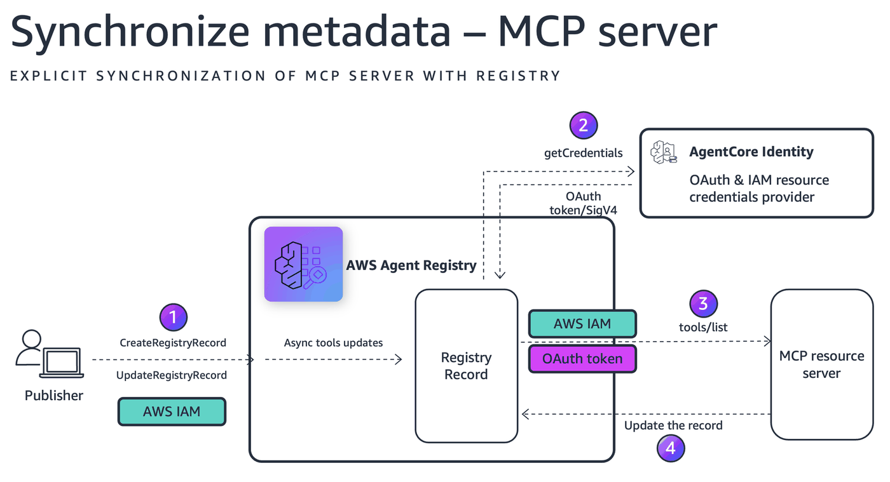

# Synchronize metadata in AWS Agent Registry from MCP Server

This notebook demonstrates how AWS Agent Registry synchronize ServerSchema from MCP Server URLs. This includes externally hosted as well as Agentcore runtime hosted MCP servers.

## What You'll Learn

- List available registries
- Create a **registry** with IAM Authorization (default)
- Synchronize public unprotected MCP server (Server schema) to AWS Agent Registry using "Synchronize record from URL" as registry records
- Synchronize OAuth protected MCP server (Server schema) to AWS Agent Registry using "Synchronize record from URL" as registry records
- Synchronize Agentcore hosted IAM protected MCP server (Server schema) to AWS Agent Registry using "Synchronize record from URL" as registry records

## Architecture



After synchronization, the record will be created in CREATING status. After about ten seconds, the record would be in DRAFT status, and it will contain descriptors that extracted and converted from the MCP server, including server descriptor and tools descriptor. AWS Agent registry will also update record name, description, and version, if the values are found when connecting to MCP server.

## Setup

### Prerequisites
- AWS CLI v2 configured
- boto3 >= 1.42.87 with bedrock-agentcore-control service support
- IAM credentials with Registry-admin permissions is configured.

Required IAM policy for Registry Admin (replace ACCOUNT_ID and region as needed))

```json
{
    "Version": "2012-10-17",
    "Statement": [
        {
            "Sid": "AllowCreateRegistry",
            "Effect": "Allow",
            "Action": ["bedrock-agentcore:CreateRegistry"],
            "Resource": ["arn:aws:bedrock-agentcore:REGION:ACCOUNT_ID:*"]
        },
        {
            "Sid": "AllowGetUpdateDeleteRegistry",
            "Effect": "Allow",
            "Action": [
                "bedrock-agentcore:GetRegistry",
                "bedrock-agentcore:DeleteRegistry"
            ],
            "Resource": ["arn:aws:bedrock-agentcore:REGION:ACCOUNT_ID:registry/*"]
        },
        {
            "Sid": "AllowCreateAndListRecords",
            "Effect": "Allow",
            "Action": [
                "bedrock-agentcore:CreateRegistryRecord",
                "bedrock-agentcore:SearchRegistryRecords"
            ],
            "Resource": ["arn:aws:bedrock-agentcore:REGION:ACCOUNT_ID:registry/*"]
        },
        {
            "Sid": "AllowRecordOperations",
            "Effect": "Allow",
            "Action": [
                "bedrock-agentcore:GetRegistryRecord",
                "bedrock-agentcore:DeleteRegistryRecord",
                "bedrock-agentcore:SubmitRegistryRecordForApproval"
            ],
            "Resource": ["arn:aws:bedrock-agentcore:REGION:ACCOUNT_ID:registry/*/record/*"]
        }
    ]
}
```

### Install dependencies

```python
%pip install -r requirements.txt -q
```

### Initialize AWS Session and Clients

Configure boto3 clients for both control plane (registry management) and data plane (search operations).

```python
import os

os.environ["AWS_SDK_LOAD_CONFIG"] = "1"

import boto3
import json
import time

# Configuration - update these for your environment
AWS_REGION = "us-west-2"
AWS_PROFILE = "your_aws_profile"  # Your configured AWS profile
os.environ["AWS_PROFILE"] = AWS_PROFILE

# Create boto3 session
session = boto3.Session(profile_name=AWS_PROFILE, region_name=AWS_REGION)

# registry client
rg_client = session.client("bedrock-agentcore-control")

ACCOUNT_ID = session.client("sts").get_caller_identity()["Account"]
TIMESTAMP = int(time.time())


def pp(response):
    """Pretty-print API response, stripping ResponseMetadata."""
    data = {k: v for k, v in response.items() if k != "ResponseMetadata"}
    print(json.dumps(data, indent=2, default=str))


print(f"Session ready | Account: {ACCOUNT_ID} | Region: {AWS_REGION} | Profile: {AWS_PROFILE}")
```

We create reusable functions to wait for registry and registry record updates as these are asynchronous operations

```python
def wait_for_registry(registry_id, interval=5):
    while True:
        resp = rg_client.get_registry(registryId=registry_id)
        status = resp["status"]
        print(f"  Registry Status: {status}")
        if status == "READY":
            resp.pop("ResponseMetadata", None)
            print(json.dumps(resp, indent=2, default=str))
            return resp
        if status.endswith("_FAILED"):
            raise Exception(f"Registry failed: {status} - {resp.get('statusReason')}")
        time.sleep(interval)
```

```python
def wait_for_record(registry_id, record_id, interval=10, max_wait=120):
    """Wait for a registry record to finish creating and display its status."""
    elapsed = 0
    while elapsed < max_wait:
        time.sleep(interval)
        elapsed += interval
        record = rg_client.get_registry_record(registryId=registry_id, recordId=record_id)
        status = record["status"]
        print(f"  Record Status: {status}")
        if status in ("DRAFT", "PENDING_APPROVAL", "APPROVED", "ACTIVE"):
            pp(record)
            return record
        if "FAILED" in status:
            print(f"  Reason: {record.get('statusReason', 'Unknown')}")
            pp(record)
            return record
    print(f"  Timed out after {max_wait}s")
    return record
```

---
## 1. List Registries 

List the available Registries in the user's account.

```python
registries = rg_client.list_registries()

print(f"Found {len(registries['registries'])} registries:\n")
for reg in registries["registries"]:
    print(f"  [{reg['status']}] {reg['name']} ({reg['registryId']})")
```

---
## 2. Create Registry with IAM permissions 

Create the registry as Registry Admin to publish MCP server 
setting `autoApproval: False` means records require explicit admin approval before becoming searchable.

```python
create_resp = rg_client.create_registry(
    name="RegistryforMCPServer006",
    description="Registry to publish MCP server records",
    approvalConfiguration={"autoApproval": False},
)

REGISTRY_ARN = create_resp["registryArn"]
REGISTRY_ID = REGISTRY_ARN.split("/")[-1]

wait_for_registry(REGISTRY_ID)

print("Registry created!")
print(f" Registry  ARN: {REGISTRY_ARN}")
print(f" Registry  ID:  {REGISTRY_ID}")
```

---
## 3. Synchronize record from Public MCP server

You can simply provide public unprotected MCP URL and Registry will automatically synchronize descriptors for you and add in the Registry.

```python
MCP_PUBLIC_URL = "https://knowledge-mcp.global.api.aws"  # AWS KNowledge Server

print("Creating registry record from public AWS Knowledge MCP server...")

record_response = rg_client.create_registry_record(
    registryId=REGISTRY_ID,
    name="aws_knowledge_mcp_server",
    descriptorType="MCP",
    synchronizationType="URL",
    synchronizationConfiguration={"fromUrl": {"url": MCP_PUBLIC_URL}},
)

print("✓ Registry record created successfully!")
print(f"Record ARN: {record_response.get('recordArn')}")

# View the complete response
pp(record_response)
# Store the record ID for later use
MCP_RECORD_ARN = record_response["recordArn"]
MCP_RECORD_ID = MCP_RECORD_ARN.split("/")[-1]
print(f"\nStored MCP_RECORD_ID: {MCP_RECORD_ID}")
```

```python
# Check record status
wait_for_record(REGISTRY_ID, MCP_RECORD_ID)
```

---
## 4. Synchronize record from  OAuth Protected MCP Server deployed on AgentCore runtime

AWS Agent Registry will synchronize MCPServer schema and related tools from OAuth protected MCP Server deployed on AgentCore Runtime.

### 4.1: Write the MCP server (plain JSON, no FastMCP)

```python
%%writefile it_ops_toolkit.py
"""IT Operations MCP Server - plain JSON, no SSE, no FastMCP."""
import json
import random
import string
from datetime import datetime, timezone, timedelta
from http.server import HTTPServer, BaseHTTPRequestHandler


def get_service_health(service_name):
    """Check service health and uptime metrics."""
    services = {
        "payment-api": {"status": "healthy", "uptime": "99.97%", "latency_ms": 45, "error_rate": "0.02%"},
        "auth-service": {"status": "healthy", "uptime": "99.99%", "latency_ms": 12, "error_rate": "0.01%"},
        "order-service": {"status": "degraded", "uptime": "98.5%", "latency_ms": 230, "error_rate": "1.2%"},
        "inventory-db": {"status": "healthy", "uptime": "99.95%", "latency_ms": 8, "error_rate": "0.03%"},
    }
    data = services.get(service_name.lower(), {
        "status": random.choice(["healthy", "degraded", "down"]),
        "uptime": f"{random.uniform(95, 99.99):.2f}%",
        "latency_ms": random.randint(5, 500),
        "error_rate": f"{random.uniform(0, 5):.2f}%"
    })
    return {"service": service_name, **data, "checked_at": datetime.now(timezone.utc).isoformat()}


def query_logs(service_name, severity="ERROR", hours=1):
    """Search application logs by service, severity, and time range."""
    logs = [
        {"timestamp": "2026-04-08T10:23:45Z", "severity": severity, "message": f"Connection timeout to downstream service", "trace_id": "abc-123"},
        {"timestamp": "2026-04-08T10:24:12Z", "severity": severity, "message": f"Retry attempt 3/5 failed", "trace_id": "abc-124"},
        {"timestamp": "2026-04-08T10:25:01Z", "severity": severity, "message": f"Circuit breaker opened for {service_name}", "trace_id": "abc-125"},
    ]
    return {"service": service_name, "severity": severity, "time_range_hours": hours, "total_count": len(logs), "logs": logs}


def create_incident(title, severity, service_name, description=""):
    """Create an incident ticket in the ITSM system."""
    incident_id = f"INC-{random.randint(10000, 99999)}"
    return {
        "incident_id": incident_id,
        "title": title,
        "severity": severity,
        "service": service_name,
        "status": "OPEN",
        "assigned_team": "SRE-OnCall",
        "created_at": datetime.now(timezone.utc).isoformat()
    }


def get_deployment_status(pipeline_name):
    """Check CI/CD pipeline deployment status."""
    stages = ["BUILD", "TEST", "STAGING", "PRODUCTION"]
    current = random.choice(stages)
    return {
        "pipeline": pipeline_name,
        "current_stage": current,
        "status": "IN_PROGRESS" if current != "PRODUCTION" else "COMPLETED",
        "commit": f"{random.randbytes(4).hex()}",
        "started_at": "2026-04-08T09:30:00Z",
        "duration_min": random.randint(5, 45)
    }


def rotate_credentials(resource_name, credential_type="API_KEY"):
    """Rotate API keys or database credentials."""
    return {
        "resource": resource_name,
        "credential_type": credential_type,
        "status": "ROTATED",
        "new_expiry": "2026-07-08T00:00:00Z",
        "rotated_at": datetime.now(timezone.utc).isoformat(),
        "previous_key_invalidated": True
    }


TOOLS = [
    {"name": "get_service_health", "description": "Check service health and uptime metrics",
     "inputSchema": {"type": "object", "properties": {"service_name": {"type": "string", "description": "Service name (e.g. payment-api, auth-service)"}}, "required": ["service_name"]}},
    {"name": "query_logs", "description": "Search application logs by service, severity, and time range",
     "inputSchema": {"type": "object", "properties": {"service_name": {"type": "string"}, "severity": {"type": "string", "description": "Log severity: ERROR, WARN, INFO"}, "hours": {"type": "integer", "description": "Hours to look back"}}, "required": ["service_name"]}},
    {"name": "create_incident", "description": "Create an incident ticket in the ITSM system",
     "inputSchema": {"type": "object", "properties": {"title": {"type": "string"}, "severity": {"type": "string", "description": "P1, P2, P3, P4"}, "service_name": {"type": "string"}, "description": {"type": "string"}}, "required": ["title", "severity", "service_name"]}},
    {"name": "get_deployment_status", "description": "Check CI/CD pipeline deployment status",
     "inputSchema": {"type": "object", "properties": {"pipeline_name": {"type": "string", "description": "Pipeline name"}}, "required": ["pipeline_name"]}},
    {"name": "rotate_credentials", "description": "Rotate API keys or database credentials",
     "inputSchema": {"type": "object", "properties": {"resource_name": {"type": "string"}, "credential_type": {"type": "string", "description": "API_KEY or DB_PASSWORD"}}, "required": ["resource_name"]}},
]

TOOL_FNS = {"get_service_health": get_service_health, "query_logs": query_logs,
            "create_incident": create_incident, "get_deployment_status": get_deployment_status,
            "rotate_credentials": rotate_credentials}


def handle_jsonrpc(request):
    method = request.get("method")
    req_id = request.get("id")
    params = request.get("params", {})

    if method == "initialize":
        return {"jsonrpc": "2.0", "id": req_id, "result": {
            "protocolVersion": "2024-11-05",
            "capabilities": {"tools": {"listChanged": False}},
            "serverInfo": {"name": "it-ops-toolkit", "version": "1.0.0"}
        }}
    elif method == "notifications/initialized":
        return None
    elif method == "ping":
        return {"jsonrpc": "2.0", "id": req_id, "result": {}}
    elif method == "tools/list":
        return {"jsonrpc": "2.0", "id": req_id, "result": {"tools": TOOLS}}
    elif method == "tools/call":
        name = params.get("name")
        args = params.get("arguments", {})
        if name in TOOL_FNS:
            result = TOOL_FNS[name](**args)
            return {"jsonrpc": "2.0", "id": req_id, "result": {
                "content": [{"type": "text", "text": json.dumps(result)}]
            }}
        return {"jsonrpc": "2.0", "id": req_id, "error": {"code": -32601, "message": f"Unknown tool: {name}"}}
    return {"jsonrpc": "2.0", "id": req_id, "error": {"code": -32601, "message": f"Unknown method: {method}"}}


class MCPHandler(BaseHTTPRequestHandler):
    def do_POST(self):
        length = int(self.headers.get("Content-Length", 0))
        body = json.loads(self.rfile.read(length)) if length else {}
        response = handle_jsonrpc(body)
        if response is None:
            self.send_response(204)
            self.end_headers()
        else:
            payload = json.dumps(response).encode()
            self.send_response(200)
            self.send_header("Content-Type", "application/json")
            self.send_header("Content-Length", str(len(payload)))
            self.end_headers()
            self.wfile.write(payload)

    def do_GET(self):
        self.send_response(200)
        self.send_header("Content-Type", "application/json")
        self.end_headers()
        self.wfile.write(b'{"status":"ok"}')

    def log_message(self, format, *args):
        print(f"[IT-OPS] {args[0]}")


if __name__ == "__main__":
    server = HTTPServer(("0.0.0.0", 8000), MCPHandler)
    print("IT Operations MCP server running on http://0.0.0.0:8000")
    server.serve_forever()
```

### 4.2: Write empty server_requirements.txt (include for any dependencies)

```python
%%writefile server_requirements.txt
# No external dependencies - uses Python stdlib only
```

### 4.3: Create Cognito OAuth Provider

```python
cognito = session.client("cognito-idp")

# Create Cognito User Pool
pool_resp = cognito.create_user_pool(
    PoolName=f"mcp-json-pool-{TIMESTAMP}",
    Policies={"PasswordPolicy": {"MinimumLength": 8}},
)
USER_POOL_ID = pool_resp["UserPool"]["Id"]
print(f"✓ User Pool: {USER_POOL_ID}")

# Create resource server
cognito.create_resource_server(
    UserPoolId=USER_POOL_ID,
    Identifier="mcp-server",
    Name="MCP Server",
    Scopes=[{"ScopeName": "invoke", "ScopeDescription": "Invoke MCP tools"}],
)

# Create M2M app client
app_resp = cognito.create_user_pool_client(
    UserPoolId=USER_POOL_ID,
    ClientName="mcp-m2m-client",
    GenerateSecret=True,
    AllowedOAuthFlows=["client_credentials"],
    AllowedOAuthScopes=["mcp-server/invoke"],
    AllowedOAuthFlowsUserPoolClient=True,
)
CLIENT_ID = app_resp["UserPoolClient"]["ClientId"]
CLIENT_SECRET = app_resp["UserPoolClient"]["ClientSecret"]
print(f"✓ Client ID: {CLIENT_ID}")

# Create domain
cognito.create_user_pool_domain(Domain=f"mcp-json-{TIMESTAMP}", UserPoolId=USER_POOL_ID)
COGNITO_DISCOVERY_URL = (
    f"https://cognito-idp.{AWS_REGION}.amazonaws.com/{USER_POOL_ID}/.well-known/openid-configuration"
)
print(f"✓ Discovery URL: {COGNITO_DISCOVERY_URL}")
```

### 4.4: Create AgentCore OAuth2 Credential Provider

```python
oauth_resp = rg_client.create_oauth2_credential_provider(
    name=f"mcp_json_provider_{TIMESTAMP}",
    credentialProviderVendor="CustomOauth2",
    oauth2ProviderConfigInput={
        "customOauth2ProviderConfig": {
            "oauthDiscovery": {"discoveryUrl": COGNITO_DISCOVERY_URL},
            "clientId": CLIENT_ID,
            "clientSecret": CLIENT_SECRET,
        }
    },
)
OAUTH_PROVIDER_ARN = oauth_resp["credentialProviderArn"]
print(f"✓ OAuth Provider ARN: {OAUTH_PROVIDER_ARN}")
```

### 4.5: Deploy MCP server to AgentCore Runtime with OAuth

```python
from bedrock_agentcore_starter_toolkit import Runtime

# Force fresh Dockerfile generation
if os.path.exists("Dockerfile"):
    os.remove("Dockerfile")
    print("✓ Removed old Dockerfile")

auth_config = {
    "customJWTAuthorizer": {
        "allowedClients": [CLIENT_ID],
        "discoveryUrl": COGNITO_DISCOVERY_URL,
    }
}

runtime = Runtime()
runtime.configure(
    entrypoint="it_ops_toolkit.py",
    auto_create_execution_role=True,
    auto_create_ecr=True,
    requirements_file="server_requirements.txt",
    region=AWS_REGION,
    authorizer_configuration=auth_config,
    protocol="MCP",
    agent_name=f"it_ops_oauth{TIMESTAMP}",
)
print("✓ Configured")

print("Deploying... (this may take several minutes)")
launch_result = runtime.launch(auto_update_on_conflict=True)

RUNTIME_ARN = launch_result.agent_arn
RUNTIME_ID = launch_result.agent_id
ENCODED_ARN = RUNTIME_ARN.replace(":", "%3A").replace("/", "%2F")
MCP_SERVER_URL = (
    f"https://bedrock-agentcore.{AWS_REGION}.amazonaws.com/runtimes/{ENCODED_ARN}/invocations?qualifier=DEFAULT"
)

print(f"✓ Runtime ARN: {RUNTIME_ARN}")
print(f"✓ MCP Server URL: {MCP_SERVER_URL}")
```

### 4.6: Publish to Registry with OAuth synchronization

```python
record_response = rg_client.create_registry_record(
    registryId=REGISTRY_ID,
    name=f"mcp_json_oauth_{TIMESTAMP}",
    descriptorType="MCP",
    synchronizationType="URL",
    synchronizationConfiguration={
        "fromUrl": {
            "url": MCP_SERVER_URL,
            "credentialProviderConfigurations": [
                {
                    "credentialProviderType": "OAUTH",
                    "credentialProvider": {
                        "oauthCredentialProvider": {
                            "providerArn": OAUTH_PROVIDER_ARN,
                            "grantType": "CLIENT_CREDENTIALS",
                            "scopes": ["mcp-server/invoke"],
                        }
                    },
                }
            ],
        }
    },
)

MCP_RECORD_ARN = record_response["recordArn"]
MCP_RECORD_ID = MCP_RECORD_ARN.split("/")[-1]
print(f"✓ Record: {MCP_RECORD_ID} - Status: {record_response['status']}")
pp(record_response)
```

### 4.7: Check status of added Registry record status

```python
# Check record status
wait_for_record(REGISTRY_ID, MCP_RECORD_ID)
```

---
## 5. Synchronize record from IAM protected MCP server hosted on AgentCore Runtime

AWS Agent Registry will synchronize MCPServer schema and related tools from IAM protected MCP Server deployed on AgentCore Runtime.

### 5.1: Write the MCP server

```python
%%writefile ecommerce_order_toolkit.py
"""E-Commerce Order Management MCP Server - plain JSON, no SSE, no FastMCP."""
import json
import random
import string
from datetime import datetime, timezone, timedelta
from http.server import HTTPServer, BaseHTTPRequestHandler


def get_order_details(order_id):
    """Retrieve order information by order ID."""
    return {
        "order_id": order_id,
        "customer_email": "[email]",
        "status": random.choice(["PENDING", "PROCESSING", "SHIPPED", "DELIVERED"]),
        "items": [
            {"sku": "SKU-1001", "name": "Wireless Headphones", "qty": 1, "price": 79.99},
            {"sku": "SKU-2045", "name": "USB-C Charging Cable", "qty": 2, "price": 12.99}
        ],
        "total": 105.97,
        "placed_at": "2026-04-06T14:30:00Z"
    }


def track_shipment(order_id):
    """Get real-time shipment tracking status."""
    return {
        "order_id": order_id,
        "carrier": "UPS",
        "tracking_number": f"1Z{random.randbytes(6).hex().upper()}",
        "status": random.choice(["IN_TRANSIT", "OUT_FOR_DELIVERY", "DELIVERED"]),
        "estimated_delivery": "2026-04-10",
        "last_location": "Seattle, WA Distribution Center",
        "updated_at": datetime.now(timezone.utc).isoformat()
    }


def process_refund(order_id, reason="customer_request"):
    """Initiate a refund for a returned order."""
    refund_id = f"RFD-{random.randint(10000, 99999)}"
    return {
        "refund_id": refund_id,
        "order_id": order_id,
        "amount": round(random.uniform(10, 200), 2),
        "reason": reason,
        "status": "INITIATED",
        "estimated_completion": "3-5 business days",
        "initiated_at": datetime.now(timezone.utc).isoformat()
    }


def check_inventory(sku):
    """Check product availability across warehouses."""
    return {
        "sku": sku,
        "total_available": random.randint(0, 500),
        "warehouses": [
            {"location": "US-West", "qty": random.randint(0, 200)},
            {"location": "US-East", "qty": random.randint(0, 200)},
            {"location": "EU-Central", "qty": random.randint(0, 100)}
        ],
        "restock_eta": "2026-04-15" if random.random() < 0.3 else None
    }


def update_order_status(order_id, status):
    """Update order fulfillment status."""
    valid = ["PENDING", "PROCESSING", "SHIPPED", "DELIVERED", "CANCELLED", "RETURNED"]
    if status.upper() not in valid:
        return {"error": f"Invalid status. Must be one of: {valid}"}
    return {
        "order_id": order_id,
        "previous_status": "PROCESSING",
        "new_status": status.upper(),
        "updated_at": datetime.now(timezone.utc).isoformat()
    }


TOOLS = [
    {"name": "get_order_details", "description": "Retrieve order information by order ID",
     "inputSchema": {"type": "object", "properties": {"order_id": {"type": "string", "description": "Order ID (e.g. ORD-1001)"}}, "required": ["order_id"]}},
    {"name": "track_shipment", "description": "Get real-time shipment tracking status",
     "inputSchema": {"type": "object", "properties": {"order_id": {"type": "string"}}, "required": ["order_id"]}},
    {"name": "process_refund", "description": "Initiate a refund for a returned order",
     "inputSchema": {"type": "object", "properties": {"order_id": {"type": "string"}, "reason": {"type": "string", "description": "Refund reason"}}, "required": ["order_id"]}},
    {"name": "check_inventory", "description": "Check product availability across warehouses",
     "inputSchema": {"type": "object", "properties": {"sku": {"type": "string", "description": "Product SKU"}}, "required": ["sku"]}},
    {"name": "update_order_status", "description": "Update order fulfillment status",
     "inputSchema": {"type": "object", "properties": {"order_id": {"type": "string"}, "status": {"type": "string", "description": "PENDING, PROCESSING, SHIPPED, DELIVERED, CANCELLED, RETURNED"}}, "required": ["order_id", "status"]}},
]

TOOL_FNS = {"get_order_details": get_order_details, "track_shipment": track_shipment,
            "process_refund": process_refund, "check_inventory": check_inventory,
            "update_order_status": update_order_status}


def handle_jsonrpc(request):
    method = request.get("method")
    req_id = request.get("id")
    params = request.get("params", {})

    if method == "initialize":
        return {"jsonrpc": "2.0", "id": req_id, "result": {
            "protocolVersion": "2024-11-05",
            "capabilities": {"tools": {"listChanged": False}},
            "serverInfo": {"name": "ecommerce-order-toolkit", "version": "1.0.0"}
        }}
    elif method == "notifications/initialized":
        return None
    elif method == "ping":
        return {"jsonrpc": "2.0", "id": req_id, "result": {}}
    elif method == "tools/list":
        return {"jsonrpc": "2.0", "id": req_id, "result": {"tools": TOOLS}}
    elif method == "tools/call":
        name = params.get("name")
        args = params.get("arguments", {})
        if name in TOOL_FNS:
            result = TOOL_FNS[name](**args)
            return {"jsonrpc": "2.0", "id": req_id, "result": {
                "content": [{"type": "text", "text": json.dumps(result)}]
            }}
        return {"jsonrpc": "2.0", "id": req_id, "error": {"code": -32601, "message": f"Unknown tool: {name}"}}
    return {"jsonrpc": "2.0", "id": req_id, "error": {"code": -32601, "message": f"Unknown method: {method}"}}


class MCPHandler(BaseHTTPRequestHandler):
    def do_POST(self):
        length = int(self.headers.get("Content-Length", 0))
        body = json.loads(self.rfile.read(length)) if length else {}
        response = handle_jsonrpc(body)
        if response is None:
            self.send_response(204)
            self.end_headers()
        else:
            payload = json.dumps(response).encode()
            self.send_response(200)
            self.send_header("Content-Type", "application/json")
            self.send_header("Content-Length", str(len(payload)))
            self.end_headers()
            self.wfile.write(payload)

    def do_GET(self):
        self.send_response(200)
        self.send_header("Content-Type", "application/json")
        self.end_headers()
        self.wfile.write(b'{"status":"ok"}')

    def log_message(self, format, *args):
        print(f"[ECOM] {args[0]}")


if __name__ == "__main__":
    server = HTTPServer(("0.0.0.0", 8000), MCPHandler)
    print("E-Commerce Order Management MCP server running on http://0.0.0.0:8000")
    server.serve_forever()
```

### 5.2: Write server_requirements.txt

```python
%%writefile server_requirements.txt
# No external dependencies - uses Python stdlib only
```

### 5.3: Deploy IAM-protected MCP server to AgentCore Runtime

```python
from bedrock_agentcore_starter_toolkit import Runtime

# Force fresh Dockerfile generation
if os.path.exists("Dockerfile"):
    os.remove("Dockerfile")
    print("✓ Removed old Dockerfile")

runtime = Runtime()
runtime.configure(
    entrypoint="ecommerce_order_toolkit.py",
    auto_create_execution_role=True,
    auto_create_ecr=True,
    requirements_file="server_requirements.txt",
    region=AWS_REGION,
    protocol="MCP",
    agent_name=f"ecom_order_iam_{TIMESTAMP}",
    # NO authorizer_configuration = IAM auth by default
)
print("✓ Configured (IAM-protected, no JWT authorizer)")

print("Deploying... (this may take several minutes)")
launch_result = runtime.launch(auto_update_on_conflict=True)

RUNTIME_ARN = launch_result.agent_arn
RUNTIME_ID = launch_result.agent_id
ENCODED_ARN = RUNTIME_ARN.replace(":", "%3A").replace("/", "%2F")
MCP_IAM_URL = (
    f"https://bedrock-agentcore.{AWS_REGION}.amazonaws.com/runtimes/{ENCODED_ARN}/invocations?qualifier=DEFAULT"
)

print(f"✓ Runtime ARN: {RUNTIME_ARN}")
print(f"✓ Runtime ID:  {RUNTIME_ID}")
print(f"✓ MCP IAM URL: {MCP_IAM_URL}")
```

### 5.4: Create IAM role for Registry to invoke Runtime

```python
iam_client = session.client("iam")
IAM_ROLE_NAME = f"RegistrySyncRole_{TIMESTAMP}"

trust_policy = {
    "Version": "2012-10-17",
    "Statement": [
        {
            "Effect": "Allow",
            "Principal": {"Service": "bedrock-agentcore.amazonaws.com"},
            "Action": "sts:AssumeRole",
        }
    ],
}

invoke_policy = {
    "Version": "2012-10-17",
    "Statement": [
        {
            "Effect": "Allow",
            "Action": [
                "bedrock-agentcore:InvokeAgentRuntime",
                "bedrock-agentcore:InvokeAgent",
            ],
            "Resource": [RUNTIME_ARN, f"{RUNTIME_ARN}/*"],
        }
    ],
}

try:
    role_resp = iam_client.create_role(
        RoleName=IAM_ROLE_NAME,
        AssumeRolePolicyDocument=json.dumps(trust_policy),
        Description="Role for Registry to invoke AgentCore Runtime MCP server",
    )
    IAM_ROLE_ARN = role_resp["Role"]["Arn"]
    print(f"✓ Created IAM role: {IAM_ROLE_ARN}")
except iam_client.exceptions.EntityAlreadyExistsException:
    IAM_ROLE_ARN = f"arn:aws:iam::{ACCOUNT_ID}:role/{IAM_ROLE_NAME}"
    print(f"✓ Role already exists: {IAM_ROLE_ARN}")

# Attach/update the invoke policy
iam_client.put_role_policy(
    RoleName=IAM_ROLE_NAME,
    PolicyName="InvokeAgentCoreRuntime",
    PolicyDocument=json.dumps(invoke_policy),
)
print(f"✓ Policy attached for: {RUNTIME_ARN}")
print("  Waiting 10s for IAM propagation...")
time.sleep(10)
```

### 5.5: Synchronize records to Registry with IAM authentication

```python
record_response = rg_client.create_registry_record(
    registryId=REGISTRY_ID,
    name=f"mcp_iam_record_{TIMESTAMP}",
    descriptorType="MCP",
    synchronizationType="URL",
    synchronizationConfiguration={
        "fromUrl": {
            "url": MCP_IAM_URL,
            "credentialProviderConfigurations": [
                {
                    "credentialProviderType": "IAM",
                    "credentialProvider": {
                        "iamCredentialProvider": {
                            "roleArn": IAM_ROLE_ARN,
                            "service": "bedrock-agentcore",
                            "region": AWS_REGION,
                        }
                    },
                }
            ],
        }
    },
)

MCP_RECORD_ARN = record_response["recordArn"]
MCP_RECORD_ID = MCP_RECORD_ARN.split("/")[-1]
print(f"✓ Record: {MCP_RECORD_ID} - Status: {record_response['status']}")
pp(record_response)
```

### 5.6: Check record status

```python
# Check record status
wait_for_record(REGISTRY_ID, MCP_RECORD_ID)
```

## 6. List all records of your Registry

```python
# List Records in a Registry
records = rg_client.list_registry_records(registryId=REGISTRY_ID)

print(f"Found {len(records['registryRecords'])} records:\n")
for rec in records["registryRecords"]:
    print(f"  [{rec['status']}] {rec['name']} | {rec['recordId']}")
```

---
## 7. Cleanup (Optional)

```python
# ── Delete Registry Records ─────────────────────────────────────────────
try:
    records = rg_client.list_registry_records(registryId=REGISTRY_ID)
    for rec in records["registryRecords"]:
        rg_client.delete_registry_record(registryId=REGISTRY_ID, recordId=rec["recordId"])
        print(f"✓ Deleted record: {rec['recordId']}")
except Exception as e:
    print(f"  Records cleanup: {e}")

# ── Delete Registry ─────────────────────────────────────────────────────
try:
    rg_client.delete_registry(registryId=REGISTRY_ID)
    print(f"✓ Deleted registry: {REGISTRY_ID}")
except Exception as e:
    print(f"  Registry cleanup: {e}")

# ── Delete AgentCore Runtimes ───────────────────────────────────────────
try:
    rg_client.delete_agent_runtime(agentRuntimeId=RUNTIME_ID)
    print(f"✓ Deleted runtime: {RUNTIME_ID}")
except Exception as e:
    print(f"  Runtime cleanup: {e}")

# ── Delete OAuth2 Credential Provider ───────────────────────────────────
try:
    rg_client.delete_oauth2_credential_provider(name=f"mcp_json_provider_{TIMESTAMP}")
    print("✓ Deleted OAuth provider")
except Exception as e:
    print(f"  OAuth provider cleanup: {e}")

# ── Delete Cognito Domain and User Pool ─────────────────────────────────
try:
    cognito.delete_user_pool_domain(Domain=f"mcp-json-{TIMESTAMP}", UserPoolId=USER_POOL_ID)
    print("✓ Deleted Cognito domain")
    cognito.delete_user_pool(UserPoolId=USER_POOL_ID)
    print(f"✓ Deleted Cognito pool: {USER_POOL_ID}")
except Exception as e:
    print(f"  Cognito cleanup: {e}")

# ── Delete IAM Role ─────────────────────────────────────────────────────
try:
    iam_client.delete_role_policy(RoleName=IAM_ROLE_NAME, PolicyName="InvokeAgentCoreRuntime")
    iam_client.delete_role(RoleName=IAM_ROLE_NAME)
    print(f"✓ Deleted IAM role: {IAM_ROLE_NAME}")
except Exception as e:
    print(f"  IAM role cleanup: {e}")

# ── Delete local files created by %%writefile ───────────────────────────
for f in [
    "ecommerce_order_toolkit.py",
    "it_ops_toolkit.py",
    "server_requirements.txt",
    "Dockerfile",
]:
    if os.path.exists(f):
        os.remove(f)
        print(f"✓ Deleted local file: {f}")

print("\n✓ Cleanup complete!")
```
