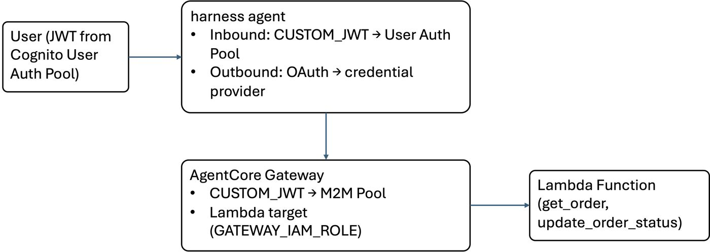

# harness with JWT Inbound Auth & OAuth-Protected Gateway

## Why this matters

Production agents don't run in isolation. They serve real users who need to be
authenticated, and they call downstream APIs that require their own credentials.
Getting this right means:

- **Only authorized users can invoke your agent** — not anyone with the endpoint URL
- **The agent calls tools with the right credentials** — each request carries
  proper tokens for the backend, without secrets in your code
- **Secrets stay managed** — no client secrets in notebooks, no tokens in env vars

AgentCore harness solves this with two config-level primitives: **inbound auth**
(who can call the harness) and **outbound auth** (how the harness calls tools).
This notebook walks through both.

## What is AgentCore harness?

A managed compute environment that turns agent configuration into a running agent.
You declare the model, system prompt, tools, and auth. AgentCore handles the
orchestration loop, compute (isolated Firecracker microVMs), tool invocation,
memory, and observability. No framework code, no containers, no deployment pipeline.

For full documentation, see the 
[AgentCore harness Developer Guide](https://docs.aws.amazon.com/bedrock-agentcore/latest/devguide/harness.html).

## What you'll learn

This notebook focuses on two harness features:

**Inbound auth (`CUSTOM_JWT`)** — require callers to present a valid JWT before
the harness accepts the request. We use a Cognito user pool, but any OIDC provider
works. This is how you protect your agent endpoint.

**Outbound auth (`outboundAuth.oauth`)** — the harness automatically fetches an
OAuth token (client credentials grant) to authenticate to an AgentCore Gateway.
The credential provider is registered once; the harness handles token exchange
on every tool call. No secrets in the invoke request.

## Architecture



## Prerequisites

- AWS account with Bedrock AgentCore access
- AWS credentials configured (`aws configure` or env vars)
- Python 3.10+, `boto3 >= 1.42.80`, `requests`, `jupyter`
- Bedrock model access enabled

## Project structure

```

├── harness_oauth_gateway.ipynb   ← this notebook
├── utils/
│   ├── setup_helpers.py          ← infra setup & cleanup
│   └── lambda_function_code.py   ← Lambda handler
├── requirements.txt
└── README.md
```

Infrastructure setup is in `utils/setup_helpers.py`. This notebook focuses on
the harness. All cells are idempotent — safe to re-run.

## Step 0: Imports & Configuration

```python
import boto3
import json
import time
import uuid
import getpass
import requests as http_requests
import urllib.parse
from utils.setup_helpers import (
    create_user_auth_pool,
    create_m2m_pool,
    create_credential_provider,
    deploy_lambda,
    create_gateway_with_lambda_target,
    create_harness_execution_role,
    cleanup_all,
)

REGION = boto3.session.Session().region_name or "us-east-1"
ACCOUNT_ID = boto3.client("sts", region_name=REGION).get_caller_identity()["Account"]
ac_control = boto3.client("bedrock-agentcore-control", region_name=REGION)
cognito = boto3.client("cognito-idp", region_name=REGION)

PREFIX = "harness-oauth-demo"
print(f"Region: {REGION}  Account: {ACCOUNT_ID}")
```

## Step 1: Provision Infrastructure

Each helper creates one resource group and returns IDs/ARNs.
All helpers check for existing resources first — re-running is safe.
See `utils/setup_helpers.py` for full implementation.

| Helper | What it creates |
|--------|----------------|
| `create_user_auth_pool` | Cognito User Auth Pool — user pool, app client (USER_PASSWORD_AUTH), test user |
| `create_m2m_pool` | Cognito M2M Pool — user pool, resource server + scope, domain, app client (client_credentials) |
| `create_credential_provider` | OAuth2 credential provider in AgentCore Identity pointing to M2M Pool |
| `deploy_lambda` | IAM role + Lambda function from `utils/lambda_function_code.py` |
| `create_gateway_with_lambda_target` | Gateway (CUSTOM_JWT → M2M Pool) + Lambda target (GATEWAY_IAM_ROLE) |
| `create_harness_execution_role` | IAM role with Bedrock, Gateway, Token Vault, CloudWatch, X-Ray permissions |

### 1a. Cognito User Auth Pool — User Auth
Creates the pool that authenticates end users who invoke the harness.

```python
print("Enter credentials for the test user in User Auth Pool:")
USER1_NAME = getpass.getpass("Username: ")
USER1_PASS = getpass.getpass("Password (min 8 chars): ")

pool1 = create_user_auth_pool(REGION, PREFIX, USER1_NAME, USER1_PASS)
print(f"\nDiscovery URL: {pool1['discovery_url']}")
```

### 1b. Cognito M2M Pool — M2M
Creates the pool for machine-to-machine auth (client credentials grant with custom scopes).

```python
pool2 = create_m2m_pool(REGION, PREFIX)
print(f"\nScope: {pool2['scope']}")
print(f"Discovery URL: {pool2['discovery_url']}")
```

### 1c. OAuth2 Credential Provider
Registers M2M Pool's client credentials with AgentCore Identity so the harness
can obtain M2M tokens for outbound gateway auth.

```python
cred = create_credential_provider(
    REGION,
    PREFIX,
    discovery_url=pool2["discovery_url"],
    client_id=pool2["client_id"],
    client_secret=pool2["client_secret"],
)
```

### 1d. Lambda Function
Deploys the order management Lambda from `utils/lambda_function_code.py`.

```python
lam = deploy_lambda(REGION, PREFIX)
```

### 1e. Gateway + Lambda Target
Creates the gateway with CUSTOM_JWT inbound auth (M2M Pool) and adds the
Lambda as a target with GATEWAY_IAM_ROLE outbound auth.

```python
gw = create_gateway_with_lambda_target(
    REGION,
    PREFIX,
    ACCOUNT_ID,
    discovery_url=pool2["discovery_url"],
    allowed_client=pool2["client_id"],
    allowed_scope=pool2["scope"],
    lambda_arn=lam["function_arn"],
    lambda_function_name=lam["function_name"],
)
print(f"\nGateway ARN: {gw['gateway_arn']}")
```

### 1f. harness execution role
Creates the IAM role the harness assumes at runtime, with permissions for
Bedrock, Gateway, OAuth2 Token Vault, Secrets Manager, and observability.

```python
harness_role = create_harness_execution_role(REGION, PREFIX, ACCOUNT_ID)
```

## Step 2: Create the harness with CUSTOM_JWT Inbound Auth

This is the core of the notebook. We create a harness that:

- **Inbound auth**: `CUSTOM_JWT` authorizer pointing to **User Auth Pool**. Callers must
  present a valid JWT from User Auth Pool to invoke the harness.
- **Model**: Claude Sonnet 4 via Amazon Bedrock.
- **Tool**: The AgentCore Gateway, with `outboundAuth.oauth` using the credential
  provider (M2M Pool client credentials). The harness automatically obtains an M2M
  token to authenticate to the gateway.
- **System prompt**: Order management assistant.

If the harness already exists from a previous run, we reuse it.

```python
HARNESS_NAME = f"{PREFIX}-harness".replace("-", "_")

# Try to create; if it already exists, look it up
try:
    harness_resp = ac_control.create_harness(
        harnessName=HARNESS_NAME,
        executionRoleArn=harness_role["role_arn"],
        authorizerConfiguration={
            "customJWTAuthorizer": {
                "discoveryUrl": pool1["discovery_url"],
                "allowedClients": [pool1["client_id"]],
            }
        },
        model={
            "bedrockModelConfig": {
                "modelId": "us.anthropic.claude-haiku-4-5-20251001-v1:0",
            }
        },
        systemPrompt=[
            {
                "text": (
                    "You are an order management assistant. "
                    "Use the gateway tools to look up and update orders. "
                    "Always confirm the order details before making changes."
                )
            }
        ],
        tools=[
            {
                "type": "agentcore_gateway",
                "name": "order-gateway",
                "config": {
                    "agentCoreGateway": {
                        "gatewayArn": gw["gateway_arn"],
                        "outboundAuth": {
                            "oauth": {
                                "providerArn": cred["arn"],
                                "scopes": [pool2["scope"]],
                                "grantType": "CLIENT_CREDENTIALS",
                            }
                        },
                    }
                },
            }
        ],
    )
    HARNESS_ID = harness_resp["harness"]["harnessId"]
    HARNESS_ARN = harness_resp["harness"]["arn"]
    print(f"Harness created: {HARNESS_ID}")
except ac_control.exceptions.ConflictException:
    HARNESS_ID = None
    for h in ac_control.list_harnesses().get("harnesses", []):
        if h.get("harnessName") == HARNESS_NAME:
            HARNESS_ID = h["harnessId"]
            HARNESS_ARN = h["arn"]
            break
    if not HARNESS_ID:
        raise RuntimeError(f"Harness {HARNESS_NAME} conflict but not found")
    print(f"Harness already exists: {HARNESS_ID}")

print(f"Harness ID:  {HARNESS_ID}")
print(f"Harness ARN: {HARNESS_ARN}")

print("Waiting for harness to become READY...")
for _ in range(30):
    h_status = ac_control.get_harness(harnessId=HARNESS_ID)["harness"]["status"]
    if h_status == "READY":
        break
    time.sleep(10)
print(f"Harness status: {h_status}")
```

## Step 3: Get a Bearer Token from User Auth Pool

Authenticate the test user via `USER_PASSWORD_AUTH` to get a JWT access token.
This token is what we pass as `Authorization: Bearer <token>` when invoking
the harness.

```python
auth_result = cognito.initiate_auth(
    ClientId=pool1["client_id"],
    AuthFlow="USER_PASSWORD_AUTH",
    AuthParameters={"USERNAME": USER1_NAME, "PASSWORD": USER1_PASS},
)
BEARER_TOKEN = auth_result["AuthenticationResult"]["AccessToken"]
print(f"Got bearer token (first 20 chars): {BEARER_TOKEN[:20]}...")
```

## Step 4: Invoke the harness with Bearer Token

Since boto3 doesn't support bearer-token invocation, we call the HTTPS
endpoint directly. The flow:

1. Harness validates the JWT against User Auth Pool (inbound auth)
2. Agent reasons about the user message and decides to call a gateway tool
3. Harness uses the OAuth2 credential provider to get an M2M token from M2M Pool
4. Harness calls the gateway with that M2M token (outbound auth)
5. Gateway validates the M2M token against M2M Pool and invokes the Lambda
6. Result flows back through the agent to the user

```python
escaped_arn = urllib.parse.quote(HARNESS_ARN, safe="")
url = f"https://bedrock-agentcore.{REGION}.amazonaws.com/harnesses/invoke?harnessArn={escaped_arn}"
SESSION_ID = f"notebook-session-{uuid.uuid4().hex}"

headers = {
    "Authorization": f"Bearer {BEARER_TOKEN}",
    "Content-Type": "application/json",
    "X-Amzn-Bedrock-AgentCore-Runtime-Session-Id": SESSION_ID,
}

payload = {
    "messages": [
        {
            "role": "user",
            "content": [{"text": "Look up order ORD-001 and tell me its status."}],
        }
    ],
}

print(f"Session: {SESSION_ID}")
print(f"URL: {url[:80]}...")
print()

# The harness returns an AWS event-stream (binary framed protocol), not plain JSON.
# We stream the response and extract text deltas from the event payloads.
resp = http_requests.post(url, headers=headers, json=payload, timeout=120, stream=True)
print(f"Status: {resp.status_code}")

if resp.status_code == 200:
    # Parse event-stream: each event has a JSON payload embedded in binary frames.
    # We extract JSON objects from the raw byte stream.
    full_text = []
    raw = resp.content
    # Find all JSON objects in the binary stream
    import re

    json_objects = re.findall(rb"\{[^{}]*(?:\{[^{}]*\}[^{}]*)*\}", raw)
    for obj_bytes in json_objects:
        try:
            obj = json.loads(obj_bytes.decode("utf-8", errors="ignore"))
            # contentBlockDelta events contain the text
            delta = obj.get("delta", {})
            if "text" in delta:
                full_text.append(delta["text"])
                print(delta["text"], end="", flush=True)
        except (json.JSONDecodeError, UnicodeDecodeError):
            continue
    print()  # newline after streaming
    if full_text:
        print(f"\n--- Full response ({len(''.join(full_text))} chars) ---")
    else:
        print("\n(No text deltas found in stream. Raw first 500 bytes below)")
        print(repr(raw[:500]))
else:
    print(f"Error {resp.status_code}: {resp.text[:1000]}")
```

### What just happened?

The full auth chain executed in one request:

1. You sent a **User Auth Pool JWT** → harness validated it (inbound auth)
2. Agent decided to call `get_order` → harness fetched an **M2M token from M2M Pool**
   via the credential provider (outbound auth)
3. Harness called the **gateway** with the M2M token → gateway validated it,
   invoked **Lambda** with its own IAM role
4. Order details flowed back through the agent to you

Three auth mechanisms, zero secrets in the invoke call. The harness handled
the token exchange automatically from the `outboundAuth.oauth` config.

For more on harness security, see the 
[AgentCore harness Developer Guide](https://docs.aws.amazon.com/bedrock-agentcore/latest/devguide/harness.html).

## Step 5: Cleanup

Deletes all resources in reverse order. Discovers by name so it works
even after a kernel restart. Skips gracefully if a resource doesn't exist.

```python
cleanup_all(REGION, PREFIX)
```
