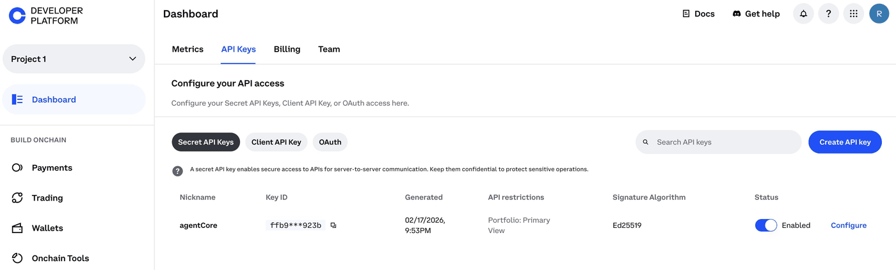
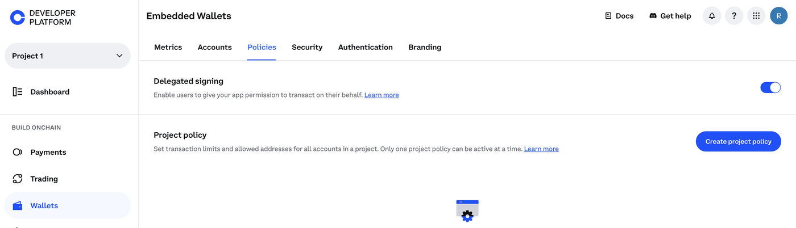
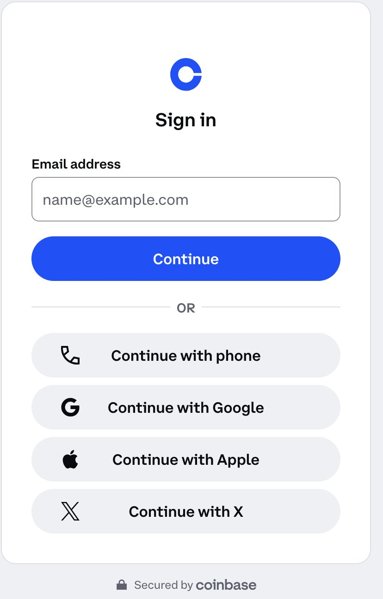
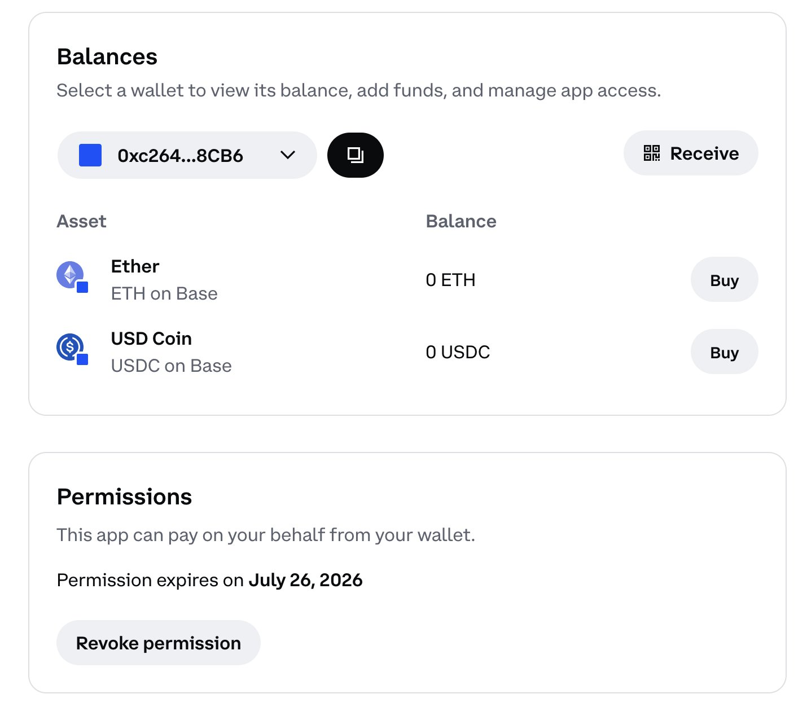

# Provider Setup: Coinbase Developer Platform (CDP)

## Overview

**Amazon Bedrock AgentCore payments** uses Coinbase Developer Platform (CDP) as its wallet
infrastructure. CDP provisions and manages crypto wallets via API — your agent never holds
private keys directly.

This guide walks you through creating a Coinbase account, enabling CDP, and generating the
three credentials that Tutorial 00 needs.

### What You'll Get

By the end of this guide you will have three values to add to your `.env`:

| Variable | Description |
|:---------|:------------|
| `COINBASE_API_KEY_ID` | Identifies your CDP API key |
| `COINBASE_API_KEY_SECRET` | Authenticates your CDP API calls |
| `COINBASE_WALLET_SECRET` | Unlocks the wallet managed by CDP |

**Note:** The Wallet Secret is shown only once at creation time. Save it immediately
to a secure location (AWS Secrets Manager, 1Password, etc.) — it cannot be retrieved later.

### Prerequisites

* A valid email address
* A phone number for SMS verification

### Time Required

~10 minutes for account creation. CDP key generation takes ~5 minutes.

### What You'll Do

| Step | Where | Action |
|:-----|:------|:-------|
| 1 | coinbase.com | Create account (skip if you have one) |
| 2 | portal.cdp.coinbase.com | Create a CDP project |
| 3a | CDP Portal → API Keys | Create API key → copy `API Key ID` + `API Key Secret` |
| 3b | CDP Portal → Wallets → ServerWallet | Copy `Wallet Secret` |
| 4 | This notebook | Paste credentials → cell writes them to `.env` via `update_env_file()` |
| 5 | This notebook (optional) | Verify credentials load correctly |
| 6 | CDP Portal → Wallets → Embedded Wallet → Policies | ✋ Enable Delegated Signing |

Steps 1–6 happen before Tutorial 00. Wallet funding happens in Tutorial 00 Step 7b (after the wallet is created).

### Next Step

After completing this guide, return to [Tutorial 00](../setup_agentcore_payments.ipynb)
and set `CREDENTIAL_PROVIDER_TYPE=CoinbaseCDP` in your `.env`.

## Step 1 — Create a Coinbase Account

1. Go to **[coinbase.com](https://coinbase.com/)**.
2. Choose **Get started**.
3. Enter an email address.
4. Create a password.
5. Verify your email via the link Coinbase sends.
6. Complete phone verification (SMS code).

**Note:** If you already have a Coinbase account, skip to Step 2.

## Step 2 — Enable Coinbase Developer Platform

1. Go to **[portal.cdp.coinbase.com](https://portal.cdp.coinbase.com/)**.
2. Sign in with your Coinbase account.
3. Create a **Project** (or select an existing one).



You are now in the Coinbase Developer Platform. The key areas you need are
**API Keys** and **Wallets**.

## Step 3 — Create an API Key and Get Wallet Secret

You need three credentials from the [CDP Portal](https://portal.cdp.coinbase.com/). The first two come from API Keys; the third comes from a different section under Wallets.

### 3a. Create an API Key

1. In the CDP Portal, navigate to your project.
2. Choose **Create API key** (or **New key**).
3. Enter a descriptive name (for example, `agentcore-payments-tutorial`).
4. Choose **Create** or **Save**.
5. Download the keys when prompted.



This gives you:

| CDP Field | Maps to .env variable |
|:----------|:---------------------|
| API Key ID | `COINBASE_API_KEY_ID` |
| API Key Secret (Private key) | `COINBASE_API_KEY_SECRET` |

### 3b. Get the Wallet Secret

The Wallet Secret is a separate credential used for cryptographic wallet operations. It lives under a different section than the API key.

1. In the CDP Portal, go to **Wallets** → **ServerWallet**.
2. Copy the **Wallet Secret** (sometimes called "wallet passphrase").



| CDP Field | Maps to .env variable |
|:----------|:---------------------|
| Wallet Secret | `COINBASE_WALLET_SECRET` |

**The Wallet Secret is shown only once.** Save it immediately to a secure location.

**Tip:** Store all three values in AWS Secrets Manager or a password manager before proceeding.
Never commit them to git.

## Step 4 — Add Credentials to Your `.env`

Paste your three Coinbase values below and run the cell. It writes them to `../.env` directly without any manual editing needed.

Set `CREDENTIAL_PROVIDER_TYPE=CoinbaseCDP` so Tutorial 00 knows which provider to use.

```python
import sys
import os

sys.path.append("../..")
from utils import update_env_file

# ✋ Paste your Coinbase CDP credentials here
COINBASE_API_KEY_ID = "<paste your API Key ID here>"
COINBASE_API_KEY_SECRET = "<paste your API Key Secret here>"
COINBASE_WALLET_SECRET = "<paste your Wallet Secret here>"

# Validate before writing
for name, val in [
    ("COINBASE_API_KEY_ID", COINBASE_API_KEY_ID),
    ("COINBASE_API_KEY_SECRET", COINBASE_API_KEY_SECRET),
    ("COINBASE_WALLET_SECRET", COINBASE_WALLET_SECRET),
]:
    if not val or val.startswith("<"):
        raise ValueError(f"{name} is not set. Paste your value above and re-run.")

# Write to .env
env_path = os.path.join("..", "..", ".env")
result = update_env_file(
    env_path,
    {
        "CREDENTIAL_PROVIDER_TYPE": "CoinbaseCDP",
        "COINBASE_API_KEY_ID": COINBASE_API_KEY_ID,
        "COINBASE_API_KEY_SECRET": COINBASE_API_KEY_SECRET,
        "COINBASE_WALLET_SECRET": COINBASE_WALLET_SECRET,
    },
)
print(f"✅ Credentials saved to {os.path.abspath(env_path)}")
print(f"   Added: {result.get('added', [])}")
print(f"   Updated: {result.get('updated', [])}")
print("\n   Never commit .env to git.")
```

## Step 5 — (Optional) Verify Credentials

You can do a quick smoke test to confirm the credentials are valid before running
Tutorial 00. The cell below uses the Coinbase CDP SDK to list wallets.

**Note:** This step is optional. If you prefer not to install an extra package, skip
directly to Tutorial 00 — AgentCore payments validates your credentials during
`CreatePaymentCredentialProvider`.

```python
!pip install cdp-sdk --quiet
```

```python
import os
from dotenv import load_dotenv

load_dotenv(dotenv_path="../../.env", override=True)

API_KEY_ID = os.environ.get("COINBASE_API_KEY_ID", "")
API_KEY_SECRET = os.environ.get("COINBASE_API_KEY_SECRET", "")
WALLET_SECRET = os.environ.get("COINBASE_WALLET_SECRET", "")

missing = [
    k
    for k, v in [
        ("COINBASE_API_KEY_ID", API_KEY_ID),
        ("COINBASE_API_KEY_SECRET", API_KEY_SECRET),
        ("COINBASE_WALLET_SECRET", WALLET_SECRET),
    ]
    if not v or v.startswith("<")
]

if missing:
    print(f"❌ Missing values in ../../.env: {missing}")
    print("   Fill in the .env file and re-run this cell.")
else:
    print("✅ All three Coinbase CDP credentials are present in ../../.env")
    print(f"   API_KEY_ID: {API_KEY_ID[:8]}...")

    # Optional: test connectivity with the CDP SDK
    try:
        from cdp import Cdp

        Cdp.configure(API_KEY_ID, API_KEY_SECRET)
        print("✅ CDP SDK configured successfully")
    except Exception as exc:
        print(f"⚠️  CDP SDK test skipped or failed: {exc}")
        print("   This does not block Tutorial 00 — credentials are validated by AgentCore payments.")
```

## Step 6 — Enable Delegated Signing

> ✋ **MANUAL ACTION — Do this before running Tutorial 00. Delegated signing is required for ProcessPayment to succeed.**

For the agent to sign transactions on behalf of end users, you must enable delegated
signing in your CDP project. This is a one-time project-level setting.

1. Open the [CDP Portal](https://portal.cdp.coinbase.com/)
2. Navigate to your project → **Wallets** → **Embedded Wallet**
3. Go to the **Policies** tab
4. Enable **Delegated Signing**



Once enabled, all embedded wallets created under this project support delegated signing. No per-wallet action is needed.

## You Are Ready!

Return to **[Tutorial 00](../setup_agentcore_payments.ipynb)** and run it from the
beginning. Your `.env` now contains the Coinbase CDP credentials Tutorial 00 needs
to create a `PaymentCredentialProvider`.

Quick checklist before you go:

- [ ] `../.env` has `CREDENTIAL_PROVIDER_TYPE=CoinbaseCDP`
- [ ] `../.env` has `COINBASE_API_KEY_ID`, `COINBASE_API_KEY_SECRET`, `COINBASE_WALLET_SECRET` filled in
- [ ] Credentials are **not** committed to git (`.env` is in `.gitignore`)
- [ ] Wallet Secret saved to a secure location
- [ ] Delegated Signing enabled in CDP Portal (Step 6)
