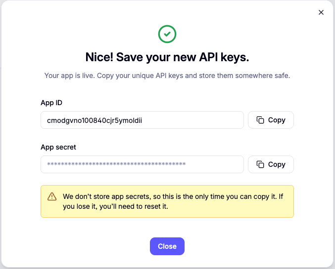
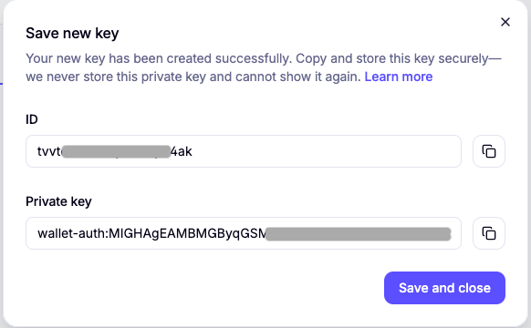
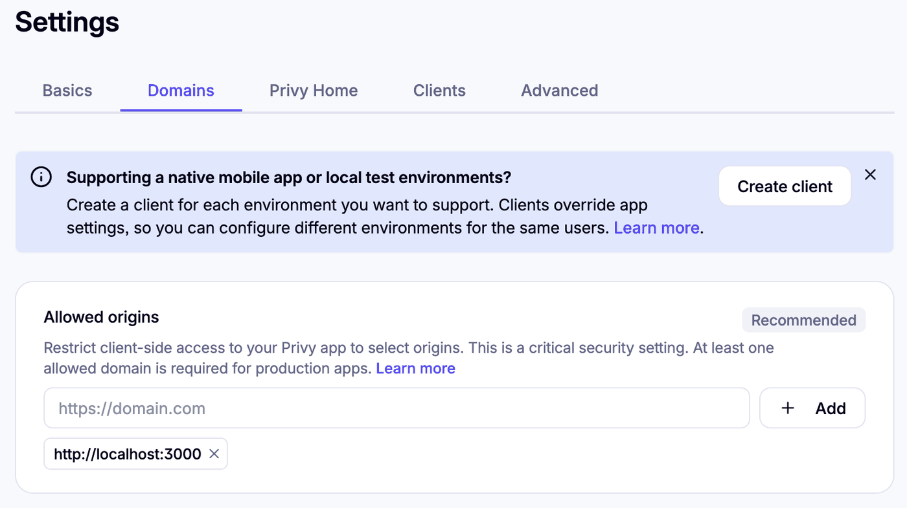
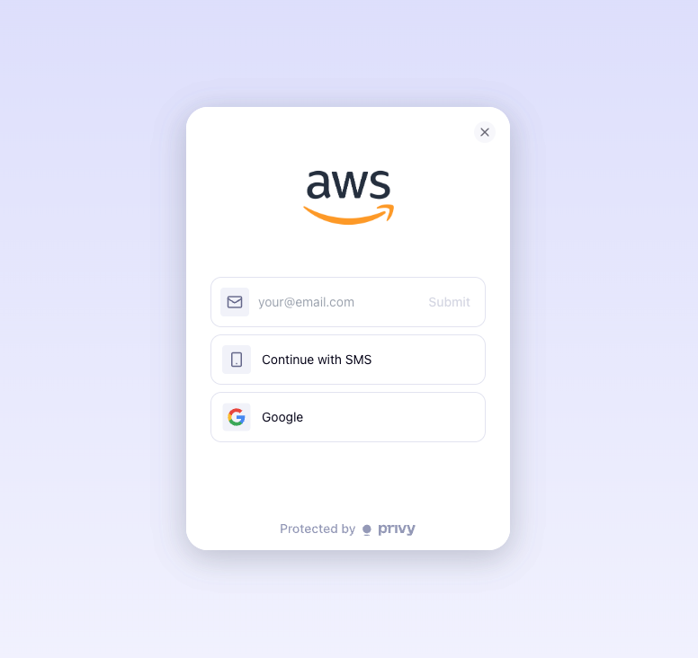
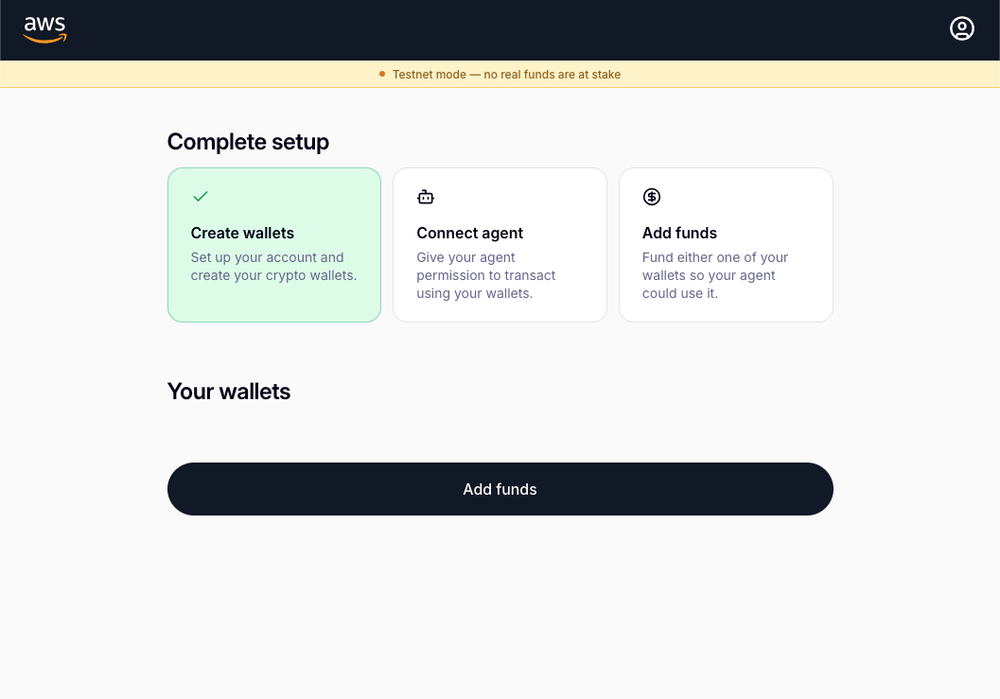

# Provider Setup: Stripe (Privy)

## Overview

**Amazon Bedrock AgentCore payments** can use Privy as its wallet infrastructure. Privy provisions embedded wallets for your end users and stores private keys in a secure enclave — AgentCore does not have access to them.

This guide walks you through three steps:

1. Create a Privy app and copy your App ID and App Secret.
2. Generate an authorization key and copy the key ID and private key.
3. Set up the Privy reference frontend so end users can grant your agent permission to sign on their behalf.

### What You'll Get

By the end of this guide you will have four values to add to your `.env` and the Privy reference frontend running on `http://localhost:3000`:

| Variable | Description |
|:---------|:------------|
| `PRIVY_APP_ID` | Identifies your Privy app |
| `PRIVY_APP_SECRET` | Authenticates your Privy API calls |
| `PRIVY_AUTHORIZATION_ID` | The key quorum ID for agent signing |
| `PRIVY_AUTHORIZATION_PRIVATE_KEY` | P-256 private key AgentCore uses to authenticate to Privy |

**Note:** The Authorization Private Key is displayed once in the Privy dashboard. Copy it before closing the dialog.

### Prerequisites

* A valid email address
* Node.js 18+ and git on your local machine (for the Privy reference frontend)

### Time Required

~15–20 minutes for Privy account creation, authorization key generation, and Privy reference frontend setup.

### What You'll Do

| Step | Where | Action |
|:-----|:------|:-------|
| 1 | dashboard.privy.io | Create app → copy `App ID` + `App Secret` |
| 2 | dashboard.privy.io | Generate authorization key → copy `ID` + `Private Key` |
| 3 | Your local terminal + browser | Run the Privy reference frontend on `http://localhost:3000` and verify login |

Steps 1–2 populate your `.env`. Step 3 sets up the Privy reference frontend; the actual end-user consent step happens in Tutorial 00 Step 7b, after the wallet is created.

### Next Step

After completing this guide, return to [Tutorial 00](../setup_agentcore_payments.ipynb). Your `.env` will already be set up — the first code cell of this notebook writes `CREDENTIAL_PROVIDER_TYPE=StripePrivy` for you.

```python
# Install dependencies for this notebook (requests for Privy API calls, python-dotenv for .env handling)
!pip install -r requirements.txt --quiet
```

## Step 1 — Create a Privy app

> **Create a dedicated Privy app for AgentCore payments.** Keep it separate from any other Privy apps you operate — the allowed origins, authentication methods, and authorization key are all scoped to the AgentCore payments configuration.

1. Go to **[dashboard.privy.io](https://dashboard.privy.io)** and sign up (or log in) with your email.
2. Privy sends a confirmation code — paste it to finish logging in.
3. On the dashboard, choose **New app**.
4. Enter an app name (e.g. `AgentCore payments Tutorial`).
5. Choose **Create app**.
6. The dialog shows your **App ID** and **App Secret**. Copy both — you'll paste them when you run the next cell.

   

7. Open **User management → Authentication**.
8. Under **Basics**, make sure **Email** is enabled.
9. Scroll down to **External wallets**.
10. Enable both **EVM wallets** and **SVM (Solana) wallets**.

Now run the next cell. Two input prompts appear: paste the App ID in the first (visible), the App Secret in the second (hidden, shown as dots), pressing Enter after each.

```python
import getpass
import sys

sys.path.append("../..")
from utils import update_env_file

PRIVY_APP_ID = input("Privy App ID: ").strip()
PRIVY_APP_SECRET = getpass.getpass("Privy App Secret (hidden): ").strip()

assert PRIVY_APP_ID and PRIVY_APP_SECRET, "Both values are required."

update_env_file(
    "../../.env",
    {
        "CREDENTIAL_PROVIDER_TYPE": "StripePrivy",
        "PRIVY_APP_ID": PRIVY_APP_ID,
        "PRIVY_APP_SECRET": PRIVY_APP_SECRET,
    },
)
```

## Step 2 — Generate your authorization key

AgentCore needs a P-256 authorization key to sign on behalf of your end users. Generate it in the Privy dashboard:

1. In the Privy dashboard, make sure your app is selected in the left sidebar.
2. Go to **Wallet Infrastructure → Authorization**.
3. Choose **New key**.
4. In the dialog, enter a name (e.g. `Demo app key`).
5. Choose **Continue**. Privy generates a P-256 keypair and displays the **ID** and **Private Key**.
6. Copy both values.
7. Choose **Save and close**.



Run the next cell, paste the values when prompted, and your `.env` will be updated.

> Privy prefixes the private key with `wallet-auth:`. The next cell strips this prefix automatically — paste the value exactly as Privy displays it.

```python
import getpass
from utils import save_privy_authorization_key

PRIVY_AUTHORIZATION_ID = input("Privy Authorization ID: ").strip()
PRIVY_AUTHORIZATION_PRIVATE_KEY = getpass.getpass("Privy Authorization Private Key (hidden): ").strip()

assert PRIVY_AUTHORIZATION_ID and PRIVY_AUTHORIZATION_PRIVATE_KEY, "Both values are required."

save_privy_authorization_key(
    env_path="../../.env",
    authorization_id=PRIVY_AUTHORIZATION_ID,
    authorization_private_key=PRIVY_AUTHORIZATION_PRIVATE_KEY,
)

print(f"\n  Authorization ID: {PRIVY_AUTHORIZATION_ID}")
print("  4 Privy env vars are now set in ../../.env")
```

## Step 3 — Set up the Privy reference frontend on your local machine

> ✋ **MANUAL ACTION — these steps run on your local machine, not the machine hosting this notebook.** The Privy reference frontend is a Next.js app that must serve from `http://localhost:3000`. Privy enforces exact-match allowed origins and tolerates plain HTTP only for `localhost` during development. If you're on a remote Jupyter host, run Step 3 on your laptop instead. Production deployment notes are in Step 3d.

This is the most hands-on step in the tutorial. Follow the sub-steps in order.

### Prerequisites on your local machine

| Tool | macOS / Linux | Windows |
|:---|:---|:---|
| Node.js 18+ | [nodejs.org](https://nodejs.org) or `brew install node` | [nodejs.org](https://nodejs.org) installer |
| git | pre-installed on macOS / apt on Linux | [git-scm.com](https://git-scm.com) installer |

Verify by running `node -v` and `git --version` in a terminal.

### 3a. Clone the Privy reference frontend

Open a terminal on your local machine and run:

```bash
git clone https://github.com/privy-io/aws-agentcore-sdk
cd aws-agentcore-sdk
```

Leave this terminal open — you'll run a few more commands in it below.

### 3b. Generate the Privy reference frontend's `.env.local`

Run the next cell. It prints a `.env.local` file body with your real App ID, App Secret, and Signer ID already filled in. Copy the printed contents.

```python
from utils import render_frontend_env_local

env_local_body = render_frontend_env_local(
    app_id=PRIVY_APP_ID,
    app_secret=PRIVY_APP_SECRET,
    signer_id=PRIVY_AUTHORIZATION_ID,
    network_mode="testnet",
)

print("─" * 72)
print("  Copy everything between the lines into .env.local")
print("─" * 72)
print(env_local_body)
print("─" * 72)
```

Now create `.env.local` in your `aws-agentcore-sdk/` directory and paste the contents into it.

**macOS / Linux:**

```bash
# Still inside aws-agentcore-sdk
nano .env.local   # or: vim .env.local, or: open -a TextEdit .env.local
# 1. Paste the contents
# 2. Save the file
# 3. Close the editor
```

**Windows (PowerShell):**

```powershell
# Still inside aws-agentcore-sdk
notepad .env.local
# 1. Paste the contents
# 2. Save the file
# 3. Close the editor
```

### 3c. Install dependencies and start the dev server

The Privy reference frontend uses **pnpm**. Install it once if you don't already have it:

```bash
npm install -g pnpm
```

Then, from the `aws-agentcore-sdk/` directory:

```bash
pnpm install
pnpm dev
```

> **If `pnpm install` fails** with a native-binding error (e.g. `Cannot find module @tailwindcss/oxide-darwin-arm64`), delete `node_modules` and retry: `rm -rf node_modules && pnpm install`.

When the server is ready you'll see `Local: http://localhost:3000` in the terminal. Leave this terminal running.

### 3d. Add the dev origin to your Privy app

Privy rejects browser requests from origins that aren't on the app's allowlist. Add `http://localhost:3000` now that you're about to open it.

1. In the Privy dashboard, open **Configuration → App settings → Domains**.
2. Under **Allowed origins → Web & mobile web**, choose **+ Add**.
3. Enter `http://localhost:3000`.
4. Choose **Save**.



> **Production note.** `http://localhost:3000` is tutorial-only. When you deploy the Privy reference frontend to a real environment, do three things in the Privy dashboard:
>
> 1. Add your production origin (an **HTTPS** URL like `https://app.example.com`) to the allowed-origins list.
> 2. Remove `http://localhost:3000` once it is no longer needed — keeping dev origins on a production app widens your attack surface.
> 3. Use a **separate Privy app** for production. The AgentCore payments docs call this out explicitly: *"Create a dedicated Privy app specifically for AgentCore operations. Do not reuse Privy apps that serve other purposes."* The same principle applies across environments — don't share a Privy app between dev, staging, and prod.
>
> Plain HTTP is only tolerated for `localhost` during development. Privy enforces HTTPS for every other origin.

### 3e. Log in to verify the Privy reference frontend works

You're verifying the Privy reference frontend is wired up correctly. The actual **consent step** — granting the agent permission to sign on the user's behalf — happens later, in `setup_agentcore_payments.ipynb` **Step 7b**, after AgentCore provisions the wallet.

1. Open **[http://localhost:3000](http://localhost:3000)** in your browser.
2. Enter the email you want to use as the end-user account. This represents a *user of your app*, not you as the developer. Use the **same email** you plan to set as `LINKED_EMAIL` in `.env`.
   
3. Submit the 6-digit code Privy sends to that email.
   

That's it for this notebook. You should see the logged-in view. **Keep this browser tab open** — you'll come back to it in Step 7b.

---

> **Why no "Connect agent" step here?** The consent flow registers AgentCore as an *additional signer* on the end user's Privy wallet. At this point in the setup, no wallet exists yet on the AgentCore side. `CreatePaymentInstrument` (Step 7 of the main notebook) is what creates the wallet. Once the wallet exists, Step 7b walks you through the consent step, and a helper cell in the main notebook verifies signer access landed via the Privy API before you move on.

> **Canonical wording from the AgentCore payments docs:** signer delegation lets the developer's backend *sign transactions on behalf of the end user* — it is authorization, not actual co-signing.

## You Are Ready!

Return to **[setup_agentcore_payments.ipynb](../setup_agentcore_payments.ipynb)** and run it from the top. It will pick `StripePrivy` up from `.env` automatically. You'll choose **Connect agent** in Step 7b once the wallet is provisioned — leave the `localhost:3000` tab open until then.

Quick checklist before you go:

- [ ] `../.env` has `CREDENTIAL_PROVIDER_TYPE=StripePrivy`
- [ ] `../.env` has `PRIVY_APP_ID`, `PRIVY_APP_SECRET`, `PRIVY_AUTHORIZATION_ID`, `PRIVY_AUTHORIZATION_PRIVATE_KEY` filled in
- [ ] Credentials are **not** committed to git (`.env` is in `.gitignore`)
- [ ] Authorization Private Key saved to a secure location
- [ ] Privy app has Email + EVM wallets + SVM (Solana) wallets enabled
- [ ] Privy reference frontend running on `http://localhost:3000` with `localhost:3000` on the Privy allowed-origins list, login verified end-to-end
