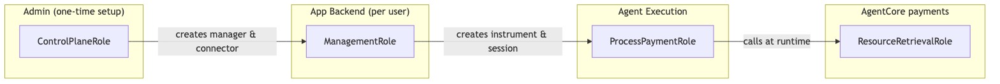
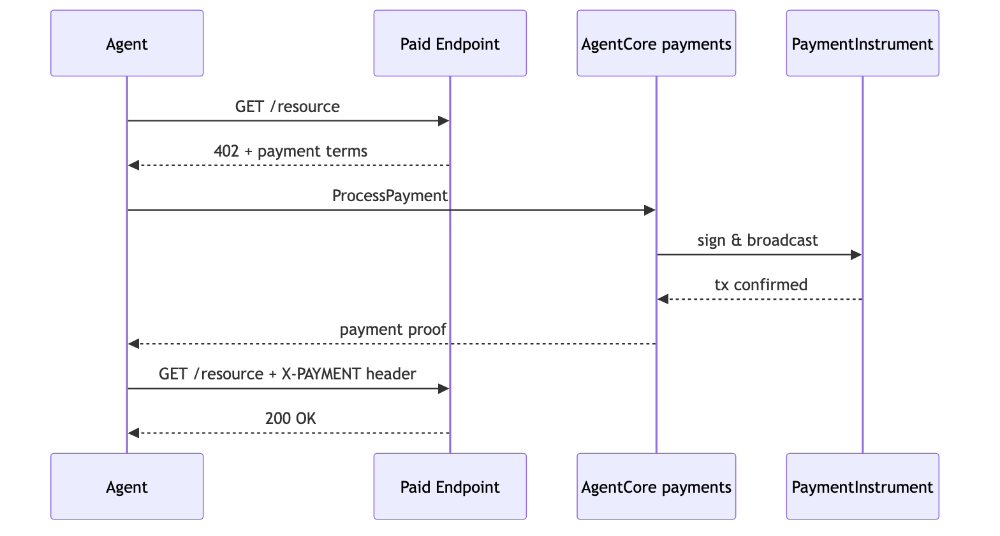

# Setting Up Amazon Bedrock AgentCore Payments

## Overview

Building payment infrastructure for AI agents means solving secure wallet management, deterministic payment limits enforcement, and payment orchestration across evolving protocols — all at once. And the problem compounds at the agent level: a single task may hit dozens of x402 endpoints, each with different payment requirements, while the agent makes non-deterministic decisions about which to call next.

**Amazon Bedrock AgentCore payments** handles all of this. This tutorial sets up the complete payment stack that all downstream tutorials depend on.

> **Cost notice:** While this tutorial uses testnet USDC with no real-world value, the AWS infrastructure (AgentCore payments API calls, Secrets Manager storage, CloudWatch logs) incurs standard AWS charges. Persistent resources contribute to ongoing costs until cleaned up. See the Cleanup section at the bottom.

### Tutorial Details

| Information         | Details                                                              |
|:--------------------|:---------------------------------------------------------------------|
| Tutorial type       | Task-based                                                           |
| Tutorial components | IAM roles, Payment Manager, Connector, Embedded Wallet Instrument, Session |
| Example complexity  | Easy                                                                 |
| SDK used            | boto3                                                                |

### API Reference

| Operation | Plane | Client | Description |
|:----------|:------|:-------|:------------|
| `CreatePaymentCredentialProvider` | Control | `bedrock-agentcore-control` | Stores wallet credentials securely |
| `CreatePaymentManager` | Control | `bedrock-agentcore-control` | Top-level payment configuration |
| `CreatePaymentConnector` | Control | `bedrock-agentcore-control` | Links Manager to Credential Provider |
| `CreatePaymentInstrument` | Data | `bedrock-agentcore` | Provisions a crypto wallet |
| `CreatePaymentSession` | Data | `bedrock-agentcore` | Time-bounded spending authorization |

> **Testnet only.** All code uses Base Sepolia or Solana Devnet with free USDC from [faucet.circle.com](https://faucet.circle.com/). Testnet USDC has no real-world value.

> **AWS resource costs:** While testnet USDC is free, AWS resources (Payment Manager, CloudWatch Logs, X-Ray traces) incur charges. Estimated cost: < $1 if cleanup runs within 24 hours. See the Cleanup section at the end.

### Supported Combinations

AgentCore payments is provider-agnostic and network-agnostic. Pick any combination:

| Provider | Network | Instrument Type | Faucet |
|----------|---------|-----------------|--------|
| Coinbase CDP | Base (ETHEREUM) | `EMBEDDED_CRYPTO_WALLET` | faucet.circle.com → Base Sepolia |
| Coinbase CDP | Solana (SOLANA) | `EMBEDDED_CRYPTO_WALLET` | faucet.circle.com → Solana Devnet |
| Stripe (Privy) | Base (ETHEREUM) | `EMBEDDED_CRYPTO_WALLET` | faucet.circle.com → Base Sepolia |
| Stripe (Privy) | Solana (SOLANA) | `EMBEDDED_CRYPTO_WALLET` | faucet.circle.com → Solana Devnet |

All combinations use **embedded wallets** (`EMBEDDED_CRYPTO_WALLET`) with `linkedAccounts` for user identity. Set `CREDENTIAL_PROVIDER_TYPE` and `NETWORK` in your `.env` to choose. The agent code in downstream tutorials is identical regardless of your choice.

## Architecture

```
┌───────────────────────────────────────────────────────────┐
│                   Developer / Admin                       │
│                 (ControlPlaneRole)                        │
│                                                           │
│  CredentialProvider → PaymentManager → PaymentConnector   │
│  One-time setup. Creates the payment stack.               │
└─────────────────────────────┬─────────────────────────────┘
                              │
                              ▼
┌───────────────────────────────────────────────────────────┐
│             Application Backend                           │
│                 (ManagementRole)                          │
│                                                           │
│  CreateInstrument (wallet) → CreateSession (budget)       │
│  Cannot call ProcessPayment.                              │
└─────────────────────────┬─────────────────────────────────┘
                          │ passes sessionId + instrumentId
                          ▼
┌───────────────────────────────────────────────────────────┐
│                    Agent Runtime                          │
│               (ProcessPaymentRole)                        │
│                                                           │
│  ProcessPayment only. Cannot create sessions/instruments. │
└───────────────────────────────────────────────────────────┘
```

The **ResourceRetrievalRole** is a service role assumed by AgentCore at runtime — you never call it directly.

### Role Separation



## Prerequisites

* Python 3.10+ and Jupyter
* AWS CLI configured (`aws sts get-caller-identity` to verify)
* AWS account with access to AgentCore payments
* Wallet provider credentials:
  - **Coinbase CDP:** See [providers/coinbase_cdp_account_setup.ipynb](providers/coinbase_cdp_account_setup.ipynb)
  - **Stripe (Privy):** See [providers/stripe_privy_account_setup.ipynb](providers/stripe_privy_account_setup.ipynb)
* `.env` configured: `cp .env.sample .env` and fill in values

```python
%pip install -r requirements.txt --quiet
```

## Choose your region

Set `AWS_REGION` below. All resources (Payment Manager, Connector, Instruments, Sessions) will be created in this region. Downstream tutorials inherit it from `.env`.

```python
import os
import boto3

# ✏️ Set your region here — this is the only place you need to change it.
AWS_REGION = "us-west-2"

os.environ["AWS_REGION"] = AWS_REGION

# ✏️ Uncomment to use a named AWS profile:
# os.environ['AWS_PROFILE'] = '<your-profile>'

session = boto3.Session(region_name=AWS_REGION)
identity = session.client("sts").get_caller_identity()
print(f"Region:  {AWS_REGION}")
print(f"Account: {identity['Account']}")
print(f"Identity: {identity['Arn']}")
```

## Step 0a — Create IAM Roles

This creates 4 IAM roles for the tutorials. If the roles already exist, this step updates them.

| Role | Permissions | Purpose |
|:-----|:-----------|:--------|
| **ControlPlaneRole** | Create/manage Managers, Connectors, Credential Providers | Admin setup |
| **ManagementRole** | Instrument/Session CRUD. **Deny** ProcessPayment | App backend |
| **ProcessPaymentRole** | `ProcessPayment` + read queries | Agent execution |
| **ResourceRetrievalRole** | Secrets Manager, token-vault, `sts:SetContext` | Service role (internal) |

### Why separate roles?

The role separation enforces a security boundary between the application backend and the runtime process. The application backend (ManagementRole) creates instruments and sessions with spending limits. The runtime process (ProcessPaymentRole) runs deterministic code that calls `ProcessPayment` on behalf of the agent — the agent (LLM) never calls `ProcessPayment` directly. The runtime cannot create sessions, override limits, or provision new wallets. This structurally separates the code that sets budgets from the code that processes payments, maintaining budget control.

The ManagementRole has an explicit Deny on `ProcessPayment` for the same reason: the code that sets budgets should never process payments. This is structural — enforced by IAM, not application logic. You can read more about roles in the [official AWS docs](https://docs.aws.amazon.com/bedrock-agentcore/latest/devguide/payments-iam-roles.html#payments-iam-why-separation)

```python
import sys

sys.path.append("..")
from utils import setup_payment_roles

roles = setup_payment_roles()

# Store role ARNs for use in later cells
CONTROL_PLANE_ROLE_ARN = roles["control_plane"]
MANAGEMENT_ROLE_ARN = roles["management"]
PROCESS_PAYMENT_ROLE_ARN = roles["process_payment"]
RESOURCE_RETRIEVAL_ROLE_ARN = roles["resource_retrieval"]

# Persist all role ARNs to .env for downstream tutorials
from utils import update_env_file

update_env_file(
    {
        "CONTROL_PLANE_ROLE_ARN": CONTROL_PLANE_ROLE_ARN,
        "MANAGEMENT_ROLE_ARN": MANAGEMENT_ROLE_ARN,
        "PROCESS_PAYMENT_ROLE_ARN": PROCESS_PAYMENT_ROLE_ARN,
        "PROCESS_PAYMENT_ROLE_NAME": PROCESS_PAYMENT_ROLE_ARN.split("/")[-1],
        "RESOURCE_RETRIEVAL_ROLE_ARN": RESOURCE_RETRIEVAL_ROLE_ARN,
    }
)

print(f"\n  ControlPlaneRole:      {CONTROL_PLANE_ROLE_ARN}")
print(f"  ManagementRole:        {MANAGEMENT_ROLE_ARN}")
print(f"  ProcessPaymentRole:    {PROCESS_PAYMENT_ROLE_ARN}")
print(f"  ResourceRetrievalRole: {RESOURCE_RETRIEVAL_ROLE_ARN}")
```

## Step 1 — Configure Environment

Loads settings from `.env` and validates what's in place. If `LINKED_EMAIL` isn't set yet (the identity that owns the end-user wallet), this cell prompts for it and saves it back to `.env`.

```python
from dotenv import load_dotenv

load_dotenv(override=True)
os.environ["AWS_REGION"] = AWS_REGION

PAYMENTS_CP_ENDPOINT = f"https://bedrock-agentcore-control.{AWS_REGION}.amazonaws.com"
PAYMENTS_DP_ENDPOINT = f"https://bedrock-agentcore.{AWS_REGION}.amazonaws.com"
CREDENTIAL_PROVIDER_ENDPOINT = PAYMENTS_CP_ENDPOINT

CREDENTIAL_PROVIDER_TYPE = os.environ.get("CREDENTIAL_PROVIDER_TYPE", "CoinbaseCDP")

MANAGER_NAME = os.environ.get("DEFAULT_PAYMENT_MANAGER_NAME", "MyPaymentManager")
_derived_connector_name = {
    "CoinbaseCDP": "MyCoinbaseConnector",
    "StripePrivy": "MyPrivyConnector",
}.get(CREDENTIAL_PROVIDER_TYPE, "MyPaymentConnector")
CONNECTOR_NAME = os.environ.get("DEFAULT_PAYMENT_CONNECTOR_NAME") or _derived_connector_name
USER_ID = os.environ.get("USER_ID", "test-user-001")
NETWORK = os.environ.get("NETWORK", "ETHEREUM")

# Load role ARNs from .env (persisted by Step 0a)
CONTROL_PLANE_ROLE_ARN = os.environ.get("CONTROL_PLANE_ROLE_ARN", "")
MANAGEMENT_ROLE_ARN = os.environ.get("MANAGEMENT_ROLE_ARN", "")
PROCESS_PAYMENT_ROLE_ARN = os.environ.get("PROCESS_PAYMENT_ROLE_ARN", "")
RESOURCE_RETRIEVAL_ROLE_ARN = os.environ.get("RESOURCE_RETRIEVAL_ROLE_ARN", "")

LINKED_EMAIL = os.environ.get("LINKED_EMAIL", "").strip()
if not LINKED_EMAIL or LINKED_EMAIL.startswith("<") or LINKED_EMAIL == "user@example.com":
    print("LINKED_EMAIL is not set yet. Enter a real email address you can receive mail at")
    print("(used for wallet hub login and Privy OTP codes).")
    LINKED_EMAIL = input("Email: ").strip()
    if "@" not in LINKED_EMAIL or LINKED_EMAIL.startswith("<"):
        raise ValueError("A valid email address is required. Re-run this cell or edit .env directly.")
    from utils import update_env_file

    update_env_file({"LINKED_EMAIL": LINKED_EMAIL})
    os.environ["LINKED_EMAIL"] = LINKED_EMAIL


def _check(label, value, redact=False):
    ok = value and not value.startswith("<")
    icon = "✅" if ok else "❌ MISSING"
    display = "[redacted]" if redact and value else value
    print(f"  {icon}  {label}: {display}")


print(f"\n  Provider: {CREDENTIAL_PROVIDER_TYPE}")
print("\n  AWS:")
_check("AWS_REGION", AWS_REGION)
_check("CP_ENDPOINT", PAYMENTS_CP_ENDPOINT)
_check("DP_ENDPOINT", PAYMENTS_DP_ENDPOINT)
print("\n  IAM Roles:")
_check("CONTROL_PLANE_ROLE_ARN", CONTROL_PLANE_ROLE_ARN)
_check("MANAGEMENT_ROLE_ARN", MANAGEMENT_ROLE_ARN)
_check("PROCESS_PAYMENT_ROLE_ARN", PROCESS_PAYMENT_ROLE_ARN)
_check("RESOURCE_RETRIEVAL_ROLE_ARN", RESOURCE_RETRIEVAL_ROLE_ARN)
print("\n  Identity:")
_check("LINKED_EMAIL", LINKED_EMAIL)
```

## Step 2 — Verify IAM Roles

Roles were created in Step 0a. This cell confirms they exist.

```python
import botocore.exceptions
from utils import (
    CONTROL_PLANE_ROLE,
    MANAGEMENT_ROLE,
    PROCESS_PAYMENT_ROLE,
    RESOURCE_RETRIEVAL_ROLE,
)

session = boto3.Session(region_name=AWS_REGION)
iam = session.client("iam")

for name in [
    CONTROL_PLANE_ROLE,
    MANAGEMENT_ROLE,
    PROCESS_PAYMENT_ROLE,
    RESOURCE_RETRIEVAL_ROLE,
]:
    try:
        arn = iam.get_role(RoleName=name)["Role"]["Arn"]
        print(f"  ✅ {name}")
    except botocore.exceptions.ClientError:
        print(f"  ❌ {name} — not found. Re-run Step 0a.")
        raise

print("\n✅ All 4 IAM roles present.")
```

## Step 3 — Create boto3 Clients

AgentCore payments uses two separate API endpoints:

* **Control Plane** (`bedrock-agentcore-control`) — manages the payment stack (Manager, Connector, Credential Provider)
* **Data Plane** (`bedrock-agentcore`) — runs payment operations (Instrument, Session, ProcessPayment)

The cells below assume the appropriate IAM role for each:
* `ControlPlaneRole` → `cp_client` — for Steps 4–6
* `ManagementRole` → `dp_client` — for Steps 7–8

```python
from utils import assume_role

print("Assuming ControlPlaneRole...")
cp_session = assume_role(session, CONTROL_PLANE_ROLE_ARN, "tutorial-00-cp")
cp_client = cp_session.client("bedrock-agentcore-control", endpoint_url=PAYMENTS_CP_ENDPOINT)
cred_client = cp_session.client("bedrock-agentcore-control", endpoint_url=CREDENTIAL_PROVIDER_ENDPOINT)

print("\nAssuming ManagementRole...")
mgmt_session = assume_role(session, MANAGEMENT_ROLE_ARN, "tutorial-00-mgmt")
dp_client = mgmt_session.client("bedrock-agentcore", endpoint_url=PAYMENTS_DP_ENDPOINT)

print("\n✅ Clients ready")
```

## Step 4 — Create Credential Provider

A **PaymentCredentialProvider** stores your wallet provider credentials (Coinbase API keys or Privy keys) securely inside AgentCore Identity. After ingestion, the credentials are never returned to your code — the service retrieves them at runtime via the ResourceRetrievalRole.

The wallet provider holds key material. AgentCore retrieves credentials at runtime via the ResourceRetrievalRole — the agent code does not handle private keys directly.

```python
import uuid
from utils import pp, idempotent_create, client_token, require_env

CRED_PROVIDER_NAME = f"{CREDENTIAL_PROVIDER_TYPE}{uuid.uuid4().hex[:8]}"

if CREDENTIAL_PROVIDER_TYPE == "CoinbaseCDP":
    provider_config = {
        "coinbaseCdpConfiguration": {
            "apiKeyId": require_env("COINBASE_API_KEY_ID"),
            "apiKeySecret": require_env("COINBASE_API_KEY_SECRET"),
            "walletSecret": require_env("COINBASE_WALLET_SECRET"),
        }
    }
elif CREDENTIAL_PROVIDER_TYPE == "StripePrivy":
    provider_config = {
        "stripePrivyConfiguration": {
            "appId": require_env("PRIVY_APP_ID"),
            "appSecret": require_env("PRIVY_APP_SECRET"),
            "authorizationId": require_env("PRIVY_AUTHORIZATION_ID"),
            "authorizationPrivateKey": require_env("PRIVY_AUTHORIZATION_PRIVATE_KEY"),
        }
    }
else:
    raise ValueError(f"Unknown CREDENTIAL_PROVIDER_TYPE: {CREDENTIAL_PROVIDER_TYPE}")

resp = idempotent_create(
    cred_client.create_payment_credential_provider,
    f"Credential provider '{CRED_PROVIDER_NAME}' already exists",
    name=CRED_PROVIDER_NAME,
    credentialProviderVendor=CREDENTIAL_PROVIDER_TYPE,
    providerConfigurationInput=provider_config,
)
if resp:
    pp("CreatePaymentCredentialProvider", resp)
    CREDENTIAL_PROVIDER_ARN = resp["credentialProviderArn"]
    print(f"\n  credentialProviderArn: {CREDENTIAL_PROVIDER_ARN}")
```

## Step 4b — Restrict Secret Access (Security Best Practice)

After setup, it is recommended to lock down the credential provider secrets in Secrets Manager so only the ResourceRetrievalRole can read them. In the [Secrets Manager console](https://console.aws.amazon.com/secretsmanager/), find secrets prefixed with `bedrock-agentcore-identity` and add a resource policy that denies `GetSecretValue` to all principals except `ResourceRetrievalRole`.

See the [documentation](https://docs.aws.amazon.com/bedrock-agentcore/latest/devguide/payments-iam-roles.html) for the full policy template and [Configure credential provider](https://docs.aws.amazon.com/bedrock-agentcore/latest/devguide/resource-providers.html) for more details.

## Step 5 — Create Payment Manager

Top-level resource. Uses ResourceRetrievalRole to access credentials at runtime.

**Note:** `clientToken` must be >= 33 chars for idempotency.

```python
from utils import wait_for_status

resp = idempotent_create(
    cp_client.create_payment_manager,
    f"Manager '{MANAGER_NAME}' already exists",
    name=MANAGER_NAME,
    description=f"{MANAGER_NAME} Tutorial 00",
    authorizerType="AWS_IAM",
    roleArn=RESOURCE_RETRIEVAL_ROLE_ARN,
    clientToken=client_token(),
)
if resp:
    pp("CreatePaymentManager", resp)
    MANAGER_ID = resp["paymentManagerId"]
    MANAGER_ARN = resp["paymentManagerArn"]
    print(f"\n  ID (control plane): {MANAGER_ID}")
    print(f"  ARN (data plane):   {MANAGER_ARN}")

    print("\nWaiting for READY...")
    wait_for_status(cp_client.get_payment_manager, "READY", paymentManagerId=MANAGER_ID)
    print("✅ PaymentManager is READY")

    # Persist immediately so downstream cells and re-runs always have correct IDs
    from utils import update_env_file

    update_env_file(
        {
            "AWS_REGION": AWS_REGION,
            "PAYMENT_MANAGER_ARN": MANAGER_ARN,
            "PAYMENT_MANAGER_ID": MANAGER_ID,
            "CREDENTIAL_PROVIDER_ARN": CREDENTIAL_PROVIDER_ARN,
            "CREDENTIAL_PROVIDER_TYPE": CREDENTIAL_PROVIDER_TYPE,
            "USER_ID": USER_ID,
            "NETWORK": NETWORK,
        }
    )
```

## Step 6 — Create Payment Connector

Links the Manager to the Credential Provider.

```python
connector_type = "CoinbaseCDP" if CREDENTIAL_PROVIDER_TYPE == "CoinbaseCDP" else "StripePrivy"
cred_key = "coinbaseCDP" if CREDENTIAL_PROVIDER_TYPE == "CoinbaseCDP" else "stripePrivy"

resp = idempotent_create(
    cp_client.create_payment_connector,
    f"Connector '{CONNECTOR_NAME}' already exists",
    paymentManagerId=MANAGER_ID,
    name=CONNECTOR_NAME,
    description=f"{CONNECTOR_NAME} {connector_type}",
    type=connector_type,
    credentialProviderConfigurations=[{cred_key: {"credentialProviderArn": CREDENTIAL_PROVIDER_ARN}}],
    clientToken=client_token(),
)
if resp:
    pp("CreatePaymentConnector", resp)
    CONNECTOR_ID = resp["paymentConnectorId"]
    print(f"\n  paymentConnectorId: {CONNECTOR_ID}")

    print("\nWaiting for READY...")
    wait_for_status(
        cp_client.get_payment_connector,
        "READY",
        paymentManagerId=MANAGER_ID,
        paymentConnectorId=CONNECTOR_ID,
    )
    print("✅ PaymentConnector is READY")

    # Persist immediately
    from utils import update_env_file

    update_env_file({"PAYMENT_CONNECTOR_ID": CONNECTOR_ID})
```

## Step 7 — Create Payment Instrument (Embedded Wallet)

Provisions an embedded USDC wallet linked to a user identity. All data plane calls use `paymentManagerArn` (full ARN), not the short ID.

Embedded wallets use `EMBEDDED_CRYPTO_WALLET` with `linkedAccounts` to tie the wallet to a user email. This is the same for both Coinbase CDP and Stripe/Privy.

**Note:** `userId` is sent as HTTP header `X-Amzn-Bedrock-AgentCore-Payments-User-Id`. USDC amounts use 6 decimal places: `100000` = $0.10.

```python
resp = dp_client.create_payment_instrument(
    paymentManagerArn=MANAGER_ARN,
    paymentConnectorId=CONNECTOR_ID,
    userId=USER_ID,
    paymentInstrumentType="EMBEDDED_CRYPTO_WALLET",
    paymentInstrumentDetails={
        "embeddedCryptoWallet": {
            "network": NETWORK,
            "linkedAccounts": [{"email": {"emailAddress": LINKED_EMAIL}}],
        }
    },
    clientToken=client_token(),
)
pp("CreatePaymentInstrument", resp)
INSTRUMENT_ID = resp["paymentInstrument"]["paymentInstrumentId"]
WALLET_ADDRESS = resp["paymentInstrument"]["paymentInstrumentDetails"]["embeddedCryptoWallet"]["walletAddress"]
print(f"\n  instrumentId:  {INSTRUMENT_ID}")
print(f"  walletAddress: {WALLET_ADDRESS}")

print("\nWaiting for ACTIVE...")
wait_for_status(
    dp_client.get_payment_instrument,
    "ACTIVE",
    paymentManagerArn=MANAGER_ARN,
    paymentConnectorId=CONNECTOR_ID,
    paymentInstrumentId=INSTRUMENT_ID,
    userId=USER_ID,
)
print("✅ Instrument is ACTIVE")

# Persist immediately
from utils import update_env_file

update_env_file({"INSTRUMENT_ID": INSTRUMENT_ID, "WALLET_ADDRESS": WALLET_ADDRESS})
```

## Step 7a — Fetch WalletHub URL (Coinbase only)

Coinbase embedded wallets come with a hosted **WalletHub** URL you open in a browser to grant signing permission and see on-ramp funding options. The URL is provisioned asynchronously after the instrument is `ACTIVE`, so this cell polls briefly for it.

Privy users can skip — there is no hosted equivalent. Signing consent happens through the Privy reference frontend covered in Step 7b.

```python
# Fetch the WalletHub URL (CoinbaseCDP only).
# The redirectUrl is provisioned asynchronously — may take a few seconds after ACTIVE.
# Re-run this cell if it doesn't appear on first try.
#
# Note: we use the PaymentManager SDK here instead of boto3 dp_client because
# the boto3 service model may not include redirectUrl in its response shape.
if CREDENTIAL_PROVIDER_TYPE != "CoinbaseCDP":
    print(f"  Skipping WalletHub fetch ({CREDENTIAL_PROVIDER_TYPE} uses the Privy reference frontend).")
else:
    import time
    from bedrock_agentcore.payments import PaymentManager

    pm = PaymentManager(payment_manager_arn=MANAGER_ARN, region_name=AWS_REGION)

    redirect_url = None
    for attempt in range(6):
        instr_details = pm.get_payment_instrument(
            user_id=USER_ID,
            payment_instrument_id=INSTRUMENT_ID,
        )
        wallet_info = instr_details.get("paymentInstrumentDetails", {}).get("embeddedCryptoWallet", {})
        redirect_url = wallet_info.get("redirectUrl")
        if redirect_url:
            break
        if attempt < 5:
            time.sleep(5)

    if redirect_url:
        print(f"  WalletHub: {redirect_url}")
        print("  Open this URL to fund the wallet and grant signing permission.")
    else:
        print("  ⚠️  WalletHub URL not yet available after ~25s.")
        print("     This can happen on newly-created instruments — re-run this cell.")
```

## Step 7b — Fund the Wallet + Delegate Signing

Enable Delegated Signing before running Tutorial 00. ProcessPayment requires this configuration.

Before the agent can produce x402 payments from this wallet, two things must happen:

1. **Fund the wallet** with testnet USDC.
2. **Delegate signing** — the end user grants your agent permission to sign on their wallet.

> **Two identities in play.** In these tutorials, you are playing two roles: the *developer* (your AWS credentials, used to call AgentCore APIs) and the *end user* (the `LINKED_EMAIL` identity, used to log into the wallet hub and grant signing permission). Here, you play both roles. Use your AWS credentials for the notebook cells. Use `LINKED_EMAIL` when logging into Coinbase WalletHub or the Privy reference frontend.

Delegated signing is required for ProcessPayment to succeed. Grant signing permission before continuing.

### x402 Payment Flow



### 1. Fund the wallet

Request **20 USDC** from the faucet. This is enough for all tutorials:
- Each x402 payment is typically $0.01–$0.10 in USDC
- Tutorial sessions use budgets of $0.20–$2.00
- Actual spend per tutorial is ~$0.05–$0.50 (most calls are micro-transactions)
- 20 USDC covers all 8 tutorials with plenty of headroom

Copy the wallet address printed by the cell below, then:

1. Go to **[faucet.circle.com](https://faucet.circle.com/)**.
2. Select the network matching your `NETWORK` setting:
   - `ETHEREUM` → **Base Sepolia**
   - `SOLANA` → **Solana Devnet**
3. Paste the address and request USDC.

```python
print(f"\n  Wallet: {WALLET_ADDRESS}")
print(f"  Network: {NETWORK}")
faucet_network = "Base Sepolia" if NETWORK == "ETHEREUM" else "Solana Devnet"
print(f"  Faucet: https://faucet.circle.com/ → select {faucet_network}")
if NETWORK == "ETHEREUM":
    print(f"  Verify: https://sepolia.basescan.org/address/{WALLET_ADDRESS}")
else:
    print(f"  Verify: https://explorer.solana.com/address/{WALLET_ADDRESS}?cluster=devnet")
print("\n  ✋ ACTION: Fund the wallet with 20 USDC before continuing.")
print("     20 USDC covers all tutorials (typical spend: $0.05–$0.50 per tutorial).")
```

### 2. Delegate signing

The flow differs by provider.

#### CoinbaseCDP

For Coinbase, the **WalletHub** (the `redirectUrl` printed in Step 7 above) handles signing permission. Open that URL and log in with your `LINKED_EMAIL`.

- **Grant signing permission** — The WalletHub prompts you to authorize delegated signing for your agent. This is the only required action here.
- **Funding** — You already funded via the Circle faucet in the step above. The WalletHub also shows on-ramp options (Credit/Debit, Google Pay, Apple Pay, ACH) but those are for real USDC, not testnet. For these tutorials, the faucet is all you need.

Once granted, delegation covers all embedded wallets under this CDP project.

> **Verify:** Open [CDP Portal](https://portal.cdp.coinbase.com/) → **Wallets** → **Embedded Wallet** → **Policies** tab → confirm **Delegated Signing** is enabled.

#### StripePrivy

1. The Privy reference frontend you launched in `providers/stripe_privy_account_setup.ipynb` (Step 6) handles this.
2. Open [http://localhost:3000](http://localhost:3000) in your browser and log in with the **same email** you used as `LINKED_EMAIL` in `.env`.
3. **Confirm the wallet and balance.** In the Privy reference frontend, verify that the wallet address matches the `WALLET_ADDRESS` printed in Step 7 above, and that the balance reflects the USDC funded via the Circle faucet. If the address or balance is wrong, you're logged in as a different user — log out and sign back in with the `LINKED_EMAIL` from `.env` before continuing.
4. Choose **Connect agent → Give access**. This adds AgentCore as an *additional signer* on each of the user's Privy wallets.
5. **This action grants signer access on every Privy wallet the user has.** If you ran this notebook with `NETWORK=SOLANA`, the Solana wallet was recently provisioned above — reload the Privy reference frontend in your browser so the page picks up the new wallet from Privy, then choose Connect agent once more.

If the Privy reference frontend is not running, go back to `providers/stripe_privy_account_setup.ipynb` Step 6 and start it.

```python
# StripePrivy: confirm delegated consent actually landed on the wallet.
# Skipped for CoinbaseCDP — delegation is configured at the project level, not per wallet.
if CREDENTIAL_PROVIDER_TYPE == "StripePrivy":
    from utils import verify_privy_signer_on_wallet

    try:
        ok = verify_privy_signer_on_wallet(
            app_id=require_env("PRIVY_APP_ID"),
            app_secret=require_env("PRIVY_APP_SECRET"),
            wallet_address_or_id=WALLET_ADDRESS,
            quorum_id=require_env("PRIVY_AUTHORIZATION_ID"),
        )
    except Exception as exc:
        print(f"  ⚠️  Consent check skipped: {exc}")
        print("     This is fine if you haven't chosen Connect agent yet —")
        print("     do it now in the Privy reference frontend and re-run this cell.")
    else:
        if ok:
            print(f"  ✅ Signer access granted on {WALLET_ADDRESS}")
            print("     Consent is in place — ProcessPayment will work in Tutorial 01.")
        else:
            print(f"  ❌ Signer access has NOT been granted on {WALLET_ADDRESS}.")
            print("     Open http://localhost:3000, log in as the same email, choose Connect agent,")
            print("     then re-run this cell. ProcessPayment requires this configuration to succeed.")
else:
    print("  CoinbaseCDP: delegation is handled at the CDP project level — no per-wallet check from here.")
```

## Step 7c — Verify Wallet Balance (Optional)

Use `GetPaymentInstrumentBalance` to confirm the wallet has USDC before creating a session.

```python
# Check wallet balance
chain = "BASE_SEPOLIA" if NETWORK == "ETHEREUM" else "SOLANA_DEVNET"
try:
    balance_resp = dp_client.get_payment_instrument_balance(
        paymentManagerArn=MANAGER_ARN,
        paymentConnectorId=CONNECTOR_ID,
        paymentInstrumentId=INSTRUMENT_ID,
        userId=USER_ID,
        chain=chain,
        token="USDC",
    )
    token_balance = balance_resp.get("tokenBalance", {})
    amount = int(token_balance.get("amount", "0")) / 1_000_000
    print(f"✅ Wallet balance: {amount:.2f} USDC on {chain}")
    if amount == 0:
        print("⚠️  Wallet has no USDC yet. Fund it via the faucet before Step 8.")
except Exception as e:
    print(f"⚠️  Balance check failed: {e}")
    print("   You can still proceed to Step 8 — the session creation will succeed even")
    print("   without a balance check. Verify the wallet is funded as described in Step 7b.")
```

## Step 8 — Create Payment Session

Time-bounded payment limits. `value` must be a **string**. `currency` is `USD` (not `USDC`). The service converts USDC to USD for limit enforcement.

```python
resp = dp_client.create_payment_session(
    paymentManagerArn=MANAGER_ARN,
    userId=USER_ID,
    expiryTimeInMinutes=60,
    limits={"maxSpendAmount": {"value": "1.0", "currency": "USD"}},
    clientToken=client_token(),
)
SESSION_ID = resp["paymentSession"]["paymentSessionId"]
print(f"✅ Session: {SESSION_ID} (budget: $1.00, expiry: 60 min)")

# Persist immediately
from utils import update_env_file

update_env_file({"SESSION_ID": SESSION_ID})
```

## Step 8b — Turn on observability

Turn on CloudWatch vended logs and X-Ray traces for your Payment Manager. 

For more details, refer to [this guide](https://docs.aws.amazon.com/bedrock-agentcore/latest/devguide/observability-payments-metrics.html)

```python
# Enable observability for the Payment Manager
# This cell self-provisions the required CloudWatch/X-Ray permissions if missing.
from utils import enable_observability

account_id = boto3.client("sts").get_caller_identity()["Account"]
caller_arn = boto3.client("sts").get_caller_identity()["Arn"]

# Auto-attach observability permissions to the current role if needed
try:
    iam = boto3.client("iam")
    # Extract role name from caller ARN (handles assumed-role and role formats)
    if ":assumed-role/" in caller_arn:
        current_role_name = caller_arn.split(":")[-1].split("/")[1]
    elif ":role/" in caller_arn:
        current_role_name = caller_arn.split("/")[-1]
    else:
        current_role_name = None

    if current_role_name:
        obs_policy = {
            "Version": "2012-10-17",
            "Statement": [
                {
                    "Sid": "CloudWatchLogsVendedDelivery",
                    "Effect": "Allow",
                    "Action": [
                        "logs:CreateDelivery",
                        "logs:CreateLogGroup",
                        "logs:CreateLogStream",
                        "logs:DeleteDelivery",
                        "logs:DeleteDeliveryDestination",
                        "logs:DeleteDeliverySource",
                        "logs:DeleteLogGroup",
                        "logs:DeleteResourcePolicy",
                        "logs:DescribeLogGroups",
                        "logs:DescribeResourcePolicies",
                        "logs:GetDelivery",
                        "logs:GetDeliveryDestination",
                        "logs:GetDeliverySource",
                        "logs:PutDeliveryDestination",
                        "logs:PutDeliverySource",
                        "logs:PutLogEvents",
                        "logs:PutResourcePolicy",
                        "logs:PutRetentionPolicy",
                    ],
                    "Resource": f"arn:aws:logs:{AWS_REGION}:{account_id}:log-group:/aws/vendedlogs/bedrock-agentcore/*",
                },
                {
                    "Sid": "XRayApplicationSignalsCloudTrail",
                    "Effect": "Allow",
                    "Action": [
                        "xray:GetTraceSegmentDestination",
                        "xray:ListResourcePolicies",
                        "xray:PutResourcePolicy",
                        "xray:PutTelemetryRecords",
                        "xray:PutTraceSegments",
                        "xray:UpdateTraceSegmentDestination",
                        "application-signals:StartDiscovery",
                        "cloudtrail:CreateServiceLinkedChannel",
                    ],
                    "Resource": f"arn:aws:xray:{AWS_REGION}:{account_id}:*",
                },
                {
                    "Sid": "CreateServiceLinkedRoleForAppSignals",
                    "Effect": "Allow",
                    "Action": "iam:CreateServiceLinkedRole",
                    "Resource": "arn:*:iam::*:role/aws-service-role/application-signals.cloudwatch.amazonaws.com/AWSServiceRoleForCloudWatchApplicationSignals",
                },
                {
                    "Sid": "BedrockAgentCoreVendedLogDelivery",
                    "Effect": "Allow",
                    "Action": "bedrock-agentcore:AllowVendedLogDeliveryForResource",
                    "Resource": f"arn:aws:bedrock-agentcore:{AWS_REGION}:{account_id}:*",
                },
            ],
        }
        import json as _json

        iam.put_role_policy(
            RoleName=current_role_name,
            PolicyName="AgentCoreObservabilitySetup",
            PolicyDocument=_json.dumps(obs_policy),
        )
        print(f"  Attached observability permissions to {current_role_name}")
        import time

        time.sleep(5)  # Wait for IAM propagation
except Exception as perm_err:
    print(f"  Note: Could not auto-attach permissions ({type(perm_err).__name__}). Proceeding anyway.")

try:
    obs_result = enable_observability(
        resource_arn=MANAGER_ARN,
        resource_id=MANAGER_ID,
        account_id=account_id,
        region=AWS_REGION,
        enable_xray_spans=False,
    )
    print(f"\n  Logs: /aws/vendedlogs/bedrock-agentcore/{MANAGER_ID}")
    print("  View traces: CloudWatch console > X-Ray traces > Traces")
except Exception as e:
    print(f"\n  \u26a0\ufe0f Observability setup failed: {e}")
    print("  This is non-blocking — tutorials will still work without observability.")
    print("  To enable later: AgentCore console > Payment Manager > Log deliveries and tracing.")
```

## Step 9 — Verify Setup

Read back the payment session to confirm it was created and is ACTIVE.

```python
# Verify session — read it back and confirm the fields match what we created.
# PaymentSession has no lifecycle status; if GetPaymentSession succeeds, the
# session is live until its expiry or budget is reached.
resp = dp_client.get_payment_session(paymentManagerArn=MANAGER_ARN, paymentSessionId=SESSION_ID, userId=USER_ID)
session = resp["paymentSession"]

assert session["paymentSessionId"] == SESSION_ID, f"sessionId mismatch: {session['paymentSessionId']}"
assert session.get("expiryTimeInMinutes"), "expiryTimeInMinutes missing"

print(f"  paymentSessionId:    {session['paymentSessionId']}")
print(f"  expiryTimeInMinutes: {session['expiryTimeInMinutes']}")
budget = session.get("limits", {}).get("maxSpendAmount", {})
if budget:
    print(f"  budget:              {budget.get('value')} {budget.get('currency')}")
available = session.get("availableLimits", {}).get("maxSpendAmount", {})
if available:
    print(f"  available:           {available.get('value')} {available.get('currency')}")
print("\n✅ Session is ready for ProcessPayment in Tutorial 01.")
```

## Cleanup

> **Before running cleanup:** Deleting the Credential Provider removes wallet credentials permanently. Deleting instruments removes wallet addresses. Only run after completing ALL downstream tutorials that depend on these resources.

This cell is self-contained — it loads resource IDs from `.env` so you can run it
without re-executing the entire notebook. It deletes resources in dependency order:

1. Payment Sessions (data plane)
2. Payment Instruments (data plane)
3. Payment Connectors (control plane)
4. Payment Manager (control plane)
5. Credential Provider (control plane)

Each step is idempotent — already-deleted resources are skipped gracefully.

> **Cost notice:** After running cleanup, also delete the four IAM roles created by `setup_payment_roles()` from the IAM console and delete CloudWatch log groups (`/aws/vendedlogs/bedrock-agentcore/<manager-id>`) if observability was enabled. These are not removed by the cleanup cell and may incur ongoing costs.

```python
# import os, sys, uuid
# sys.path.append('..')
# from dotenv import load_dotenv
# import boto3
# import botocore.exceptions
# from utils import assume_role, client_token

# # ── Load resource IDs from .env (works standalone) ──────────────
# load_dotenv(override=True)

# AWS_REGION = os.environ.get('AWS_REGION', 'us-west-2')
# PAYMENTS_CP_ENDPOINT = os.environ.get('PAYMENTS_CP_ENDPOINT', f'https://bedrock-agentcore-control.{AWS_REGION}.amazonaws.com')
# PAYMENTS_DP_ENDPOINT = os.environ.get('PAYMENTS_DP_ENDPOINT', f'https://bedrock-agentcore.{AWS_REGION}.amazonaws.com')
# CREDENTIAL_PROVIDER_ENDPOINT = os.environ.get('CREDENTIAL_PROVIDER_ENDPOINT', PAYMENTS_CP_ENDPOINT)

# MANAGER_ARN = os.environ.get('PAYMENT_MANAGER_ARN', '')
# MANAGER_ID = os.environ.get('PAYMENT_MANAGER_ID', '')
# CONNECTOR_ID = os.environ.get('PAYMENT_CONNECTOR_ID', '')
# CREDENTIAL_PROVIDER_ARN = os.environ.get('CREDENTIAL_PROVIDER_ARN', '')
# USER_ID = os.environ.get('USER_ID', 'test-user-001')
# INSTRUMENT_ID = os.environ.get('INSTRUMENT_ID', '')
# SESSION_ID = os.environ.get('SESSION_ID', '')

# # Derive credential provider name from ARN (last segment after '/')
# CRED_PROVIDER_NAME = CREDENTIAL_PROVIDER_ARN.rsplit('/', 1)[-1] if CREDENTIAL_PROVIDER_ARN else ''

# CONTROL_PLANE_ROLE_ARN = os.environ.get('CONTROL_PLANE_ROLE_ARN', f'arn:aws:iam::{boto3.client("sts").get_caller_identity()["Account"]}:role/AgentCorePaymentsControlPlaneRole')
# MANAGEMENT_ROLE_ARN = os.environ.get('MANAGEMENT_ROLE_ARN', f'arn:aws:iam::{boto3.client("sts").get_caller_identity()["Account"]}:role/AgentCorePaymentsManagementRole')

# # ── Validate we have something to clean up ─────────────────────
# if not MANAGER_ID:
#     print('❌ No PAYMENT_MANAGER_ID found in .env — nothing to clean up.')
#     print('   Run Tutorial 00 first, or set PAYMENT_MANAGER_ID in .env.')
# else:
#     print(f'🧹 Cleanup targets (from .env):')
#     print(f'   Manager:             {MANAGER_ID}')
#     print(f'   Connector:           {CONNECTOR_ID or "(none)"}')
#     print(f'   Credential Provider: {CRED_PROVIDER_NAME or "(none)"}')
#     print(f'   Instrument:          {INSTRUMENT_ID or "(none)"}')
#     print(f'   Session:             {SESSION_ID or "(none)"}')
#     print()
```

```python
# # ── Build clients with appropriate roles ───────────────────────
# session = boto3.Session(region_name=AWS_REGION)

# print('Assuming ControlPlaneRole...')
# cp_session = assume_role(session, CONTROL_PLANE_ROLE_ARN, 'cleanup-cp')
# cp_client = cp_session.client('bedrock-agentcore-control', endpoint_url=PAYMENTS_CP_ENDPOINT)
# cred_client = cp_session.client('bedrock-agentcore-control', endpoint_url=CREDENTIAL_PROVIDER_ENDPOINT)

# print('Assuming ManagementRole...')
# mgmt_session = assume_role(session, MANAGEMENT_ROLE_ARN, 'cleanup-mgmt')
# dp_client = mgmt_session.client('bedrock-agentcore', endpoint_url=PAYMENTS_DP_ENDPOINT)

# # ── Helper ─────────────────────────────────────────────────────
# def safe_delete(fn, label, **kw):
#     """Call a delete API; handle ResourceNotFound and ConflictException gracefully."""
#     try:
#         fn(**kw)
#         print(f'  ✅ Deleted: {label}')
#     except botocore.exceptions.ClientError as e:
#         code = e.response['Error']['Code']
#         if code in ('ResourceNotFoundException', 'NotFoundException'):
#             print(f'  ⏭️  Already gone: {label}')
#         elif code == 'ConflictException':
#             print(f'  ⚠️  Conflict (may have dependents): {label}')
#             print(f'      {e.response["Error"]["Message"]}')
#         else:
#             raise

# # ── 1. Delete Payment Sessions ─────────────────────────────────
# print('\n── Cleaning up Payment Sessions ──')
# if MANAGER_ARN:
#     try:
#         sessions_resp = dp_client.list_payment_sessions(paymentManagerArn=MANAGER_ARN, userId=USER_ID)
#         sessions = sessions_resp.get('paymentSessions', [])
#         if sessions:
#             for s in sessions:
#                 sid = s.get('paymentSessionId', s.get('sessionId', ''))
#                 if sid:
#                     safe_delete(dp_client.update_payment_session, f'Session {sid} (expire)',
#                         paymentManagerArn=MANAGER_ARN, paymentSessionId=sid, userId=USER_ID,
#                         expiryTimeInMinutes=0)
#             print(f'  Expired {len(sessions)} session(s)')
#         else:
#             print('  No sessions found')
#     except botocore.exceptions.ClientError as e:
#         if 'NotFound' in e.response['Error']['Code']:
#             print('  Manager not found — skipping session cleanup')
#         else:
#             print(f'  ⚠️  Could not list sessions: {e.response["Error"]["Message"]}')
# else:
#     print('  No MANAGER_ARN — skipping')

# # ── 2. Delete Payment Instruments ─────────────────────────────
# print('\n── Cleaning up Payment Instruments ──')
# if MANAGER_ARN:
#     try:
#         instr_resp = dp_client.list_payment_instruments(paymentManagerArn=MANAGER_ARN, userId=USER_ID)
#         instruments = instr_resp.get('paymentInstruments', [])
#         if instruments:
#             for instr in instruments:
#                 iid = instr.get('paymentInstrumentId', instr.get('instrumentId', ''))
#                 if iid:
#                     safe_delete(dp_client.delete_payment_instrument, f'Instrument {iid}',
#                         paymentManagerArn=MANAGER_ARN, paymentInstrumentId=iid, userId=USER_ID)
#         else:
#             print('  No instruments found')
#     except botocore.exceptions.ClientError as e:
#         if 'NotFound' in e.response['Error']['Code']:
#             print('  Manager not found — skipping instrument cleanup')
#         else:
#             print(f'  ⚠️  Could not list instruments: {e.response["Error"]["Message"]}')
# else:
#     print('  No MANAGER_ARN — skipping')

# # ── 3. Delete Payment Connectors ──────────────────────────────
# print('\n── Cleaning up Payment Connectors ──')
# if MANAGER_ID:
#     try:
#         conn_resp = cp_client.list_payment_connectors(paymentManagerId=MANAGER_ID)
#         connectors = conn_resp.get('paymentConnectors', [])
#         if connectors:
#             for conn in connectors:
#                 cid = conn.get('paymentConnectorId', conn.get('connectorId', ''))
#                 if cid:
#                     safe_delete(cp_client.delete_payment_connector, f'Connector {cid}',
#                         paymentManagerId=MANAGER_ID, paymentConnectorId=cid, clientToken=client_token())
#         else:
#             print('  No connectors found')
#     except botocore.exceptions.ClientError as e:
#         if 'NotFound' in e.response['Error']['Code']:
#             print('  Manager not found — skipping connector cleanup')
#         else:
#             print(f'  ⚠️  Could not list connectors: {e.response["Error"]["Message"]}')
# else:
#     print('  No MANAGER_ID — skipping')

# # ── 4. Delete Payment Manager ─────────────────────────────────
# print('\n── Cleaning up Payment Manager ──')
# if MANAGER_ID:
#     safe_delete(cp_client.delete_payment_manager, f'Manager {MANAGER_ID}',
#         paymentManagerId=MANAGER_ID, clientToken=client_token())
# else:
#     print('  No MANAGER_ID — skipping')

# # ── 5. Delete Credential Provider ─────────────────────────────
# print('\n── Cleaning up Credential Provider ──')
# if CRED_PROVIDER_NAME:
#     safe_delete(cred_client.delete_payment_credential_provider, f'CredProvider {CRED_PROVIDER_NAME}',
#         name=CRED_PROVIDER_NAME)
# else:
#     print('  No CREDENTIAL_PROVIDER_ARN — skipping')

# print('\n' + '=' * 60)
# print('  🧹 Cleanup complete')
# print('=' * 60)
```

# Congratulations!

Continue to **[Tutorial 01 — Enable Payment Limits on an Agent](../01-agents-payments-and-limits/)** to build your first payment-enabled agent.
