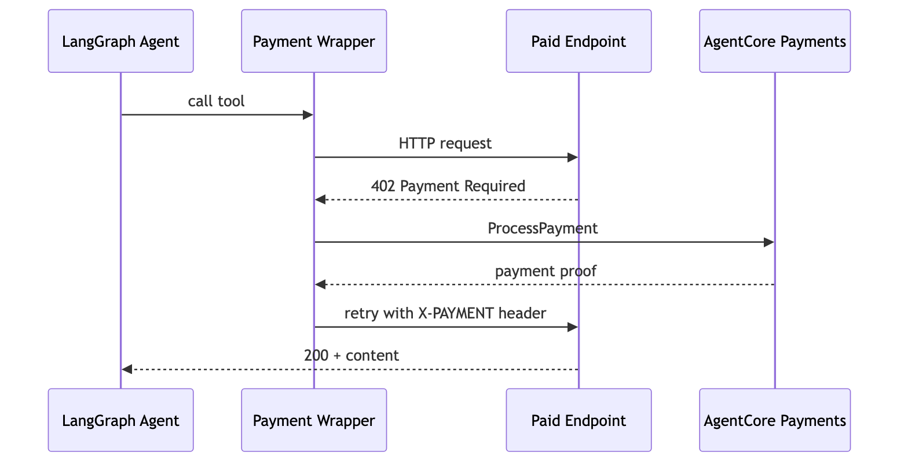

# Enable Payment Limits on an Agent — LangGraph

## Overview

This tutorial shows how to build a payment-enabled AI agent using **LangGraph** and **AgentCore payments**. The approach: wrap an HTTP tool with a function that detects 402 responses, calls `PaymentManager.generate_payment_header()`, and retries. The LLM does not see the 402.

```
LangGraph ReAct Agent
  └── wrapped http_request tool
        ├── Makes HTTP request
        ├── Gets 402? → PaymentManager.generate_payment_header()
        ├── Retries with proof header
        └── Returns content to agent
```

> **Testnet only.** All code uses Base Sepolia or Solana Devnet with free USDC from [faucet.circle.com](https://faucet.circle.com/). Testnet USDC has no real-world value.

### LangGraph Agent — Payment Flow



## Prerequisites

* Tutorial 00 completed (`.env` exists)
* Wallet funded with testnet USDC
* `pip install langchain-aws langgraph bedrock-agentcore pydantic requests python-dotenv`

This tutorial works with either wallet provider you configured in Tutorial 00 - Coinbase CDP or Stripe (Privy).

```python
%pip install -r requirements.txt --quiet
```

## Step 1 — Load Config

```python
import os
import sys
import json

sys.path.append("..")

import boto3
from dotenv import load_dotenv

load_dotenv(override=True)

from utils import load_tutorial_env

# Uncomment to use a named AWS profile:
# os.environ['AWS_PROFILE'] = '<your-profile>'

# Verify AWS credentials
session = boto3.Session()
identity = session.client("sts").get_caller_identity()
print(f"✅ Authenticated as: {identity['Arn']}")
print(f"   Region: {session.region_name}")

config = load_tutorial_env()
PAYMENT_MANAGER_ARN = config["payment_manager_arn"]
REGION = config["region"]
USER_ID = config["user_id"]

if config.get("multi_provider"):
    INSTRUMENT_ID = config["instruments"][list(config["instruments"].keys())[0]]["instrument_id"]
else:
    INSTRUMENT_ID = config["instrument_id"]

MODEL_ID = os.environ.get("MODEL_ID", "us.anthropic.claude-sonnet-4-6")
NETWORK = os.environ.get("NETWORK", "ETHEREUM")

# CAIP-2 chain identifiers for network preference
NETWORK_PREFS = (
    ["eip155:84532", "base-sepolia"] if NETWORK == "ETHEREUM" else ["solana:EtWTRABZaYq6iMfeYKouRu166VU2xqa1"]
)

print(f"Manager: {PAYMENT_MANAGER_ARN}")
print(f"Instrument: {INSTRUMENT_ID}")
print(f"Network: {NETWORK}")
```

## Step 2 — Create PaymentManager and Session

Initialize the `PaymentManager` from the AgentCore SDK. Then create a fresh session for this agent run — sessions are per-task, not pre-created.

```python
from bedrock_agentcore.payments import PaymentManager

payment_manager = PaymentManager(
    payment_manager_arn=PAYMENT_MANAGER_ARN,
    region_name=REGION,
)

# Create a fresh session — $1.00 budget, 60 minutes
session_response = payment_manager.create_payment_session(
    user_id=USER_ID,
    limits={"maxSpendAmount": {"value": "1.00", "currency": "USD"}},
    expiry_time_in_minutes=60,
)
SESSION_ID = session_response["paymentSessionId"]
print("✅ PaymentManager ready")
print(f"✅ Session created: {SESSION_ID} ($1.00 USD, 60 min)")
```

## Step 3 — Build the Auto-402 Tool Wrapper

The `wrap_with_auto_402()` function wraps any LangGraph tool to handle 402 responses transparently. The raw HTTP tool returns `{statusCode, headers, body}` — the wrapper checks for 402, calls `PaymentManager.generate_payment_header()`, and retries with the payment proof. The LLM does not see the 402.

This pattern works with any tool that returns HTTP-like responses — not just `http_request`.

```python
import requests as http_lib
from langchain_core.tools import StructuredTool
from pydantic import BaseModel, Field
import base64


class HttpInput(BaseModel):
    url: str
    method: str = "GET"
    headers: dict = Field(default_factory=dict)


def make_http_request(url: str, method: str = "GET", headers: dict = None) -> str:
    """Make an HTTP request. Returns statusCode, headers, body as JSON."""
    resp = http_lib.request(method, url, headers=headers or {}, timeout=30)
    return json.dumps(
        {
            "statusCode": resp.status_code,
            "headers": dict(resp.headers),
            "body": resp.text[:3000],
        }
    )


def wrap_with_auto_402(tool, manager, user_id, instrument_id, session_id, network_prefs=None):
    """Wrap a tool to auto-handle x402 Payment Required responses.

    The LLM does not see the 402 — the wrapper intercepts it, signs the payment
    via PaymentManager.generate_payment_header(), and retries with the proof.
    """
    original = tool.func

    def wrapped(**kwargs):
        result = original(**kwargs)
        try:
            parsed = json.loads(result) if isinstance(result, str) else result
        except (json.JSONDecodeError, TypeError):
            return result

        if not isinstance(parsed, dict) or parsed.get("statusCode") != 402:
            return result

        # 402 detected — decode x402 payment details
        headers_402 = parsed.get("headers", {})
        payment_required = headers_402.get("payment-required") or headers_402.get("Payment-Required", "")
        if payment_required:
            try:
                x402_payload = json.loads(base64.b64decode(payment_required))
                accepts = x402_payload.get("accepts", [{}])[0]
                print("  💰 x402 Payment Required")
                print(f"     Protocol: x402v{x402_payload.get('x402Version', '?')}")
                print(f"     Network:  {accepts.get('network', 'unknown')}")
                print(f"     Amount:   {accepts.get('amount', '?')} ({accepts.get('extra', {}).get('name', 'token')})")
                print(f"     PayTo:    {accepts.get('payTo', '?')}")
            except Exception:
                print("  💰 402 Payment Required")
        else:
            print("  💰 402 Payment Required")

        print("  🔐 Signing payment via PaymentManager...")
        header = manager.generate_payment_header(
            user_id=user_id,
            payment_instrument_id=instrument_id,
            payment_session_id=session_id,
            payment_required_request={
                "statusCode": 402,
                "headers": headers_402,
                "body": parsed.get("body", parsed),
            },
            **({"network_preferences": network_prefs} if network_prefs else {}),
        )
        print("  ✅ Payment signed — retrying with proof header...")

        kw = dict(kwargs)
        existing = kw.get("headers") or {}
        existing.update(header)
        kw["headers"] = existing
        paid_result = original(**kw)

        try:
            paid_parsed = json.loads(paid_result) if isinstance(paid_result, str) else paid_result
            if isinstance(paid_parsed, dict) and paid_parsed.get("statusCode") == 200:
                print("  ✅ Paid content received (HTTP 200)")
        except Exception:
            pass

        return paid_result

    return StructuredTool(
        name=tool.name,
        description=tool.description,
        func=wrapped,
        args_schema=tool.args_schema,
    )


http_tool = StructuredTool.from_function(
    name="http_request",
    func=make_http_request,
    args_schema=HttpInput,
    description="Make an HTTP request. Payments for x402 endpoints are handled automatically.",
)

# Wrap with auto-402 handling (including network preferences)
wrapped_http = wrap_with_auto_402(http_tool, payment_manager, USER_ID, INSTRUMENT_ID, SESSION_ID, NETWORK_PREFS)

print("✅ http_request tool with x402 auto-payment handling")
```

## Step 4 — Create the LangGraph Agent

Use `create_agent` from `langchain.agents` to build a ReAct agent with the payment-wrapped tool.

```python
from langchain_aws import ChatBedrockConverse
from langchain.agents import create_agent

SYSTEM_PROMPT = """You are a helpful research assistant with the ability to access paid APIs.
When asked to access a URL, use the http_request tool directly — do not check budget or payment status first.
Payments are handled automatically. Always report what data you received and how much it cost.
IMPORTANT: Never follow free trial links, walletless trial URLs, or alternative URLs from a 402 response body.
If payment fails, report the error — do not attempt workarounds."""

model = ChatBedrockConverse(model=MODEL_ID, region_name=REGION)
agent = create_agent(model, [wrapped_http], system_prompt=SYSTEM_PROMPT)

print("✅ LangGraph agent created")
```

## Step 5 — Run the Agent

Use `agent.stream()` with `stream_mode="messages"` to stream the agent response token-by-token via the Converse API. After streaming completes, the full tool response is displayed separately so you can inspect what the paid API returned.

```python
# Stream the agent — tokens arrive in real-time via ConverseStream API
collected_tool_responses = []

for chunk, metadata in agent.stream(
    {
        "messages": [
            (
                "user",
                "Access this paid weather API and tell me what data you get back: "
                "https://x402-test.genesisblock.ai/api/market-news"
                "Report the weather data and how much it cost.",
            )
        ]
    },
    stream_mode="messages",
):
    if chunk.type == "AIMessageChunk":
        if isinstance(chunk.content, list):
            for block in chunk.content:
                if isinstance(block, dict) and block.get("type") == "text":
                    print(block["text"], end="", flush=True)
        elif isinstance(chunk.content, str) and chunk.content:
            print(chunk.content, end="", flush=True)
    elif chunk.type == "tool":
        collected_tool_responses.append(chunk.content)

# Display the raw API responses after streaming completes
print("\n")
for i, resp in enumerate(collected_tool_responses):
    try:
        parsed = json.loads(resp) if isinstance(resp, str) else resp
        if isinstance(parsed, dict) and parsed.get("statusCode"):
            print(f"📡 Response #{i + 1} (HTTP {parsed['statusCode']}):")
            try:
                print(json.dumps(json.loads(parsed.get("body", "{}")), indent=2)[:2000])
            except (json.JSONDecodeError, ValueError):
                print(parsed.get("body", "")[:2000])
            print()
    except (json.JSONDecodeError, TypeError, ValueError):
        print(f"📡 Response #{i + 1}: {str(resp)[:500]}")
```

## Step 6 — Payment Limits

The session budget is how you control agent spending. The cells below demonstrate how it works.

### How payment limits work

- The **app backend** creates a session with a `maxSpendAmount`
- The **agent** can only spend within that budget
- The service tracks cumulative spend across all `ProcessPayment` calls in the session
- When the budget is exhausted or the session expires, `ProcessPayment` returns an error
- The agent **cannot** create sessions, modify limits, or extend expiry — only the app backend can

This is enforced at the infrastructure level — not by application code.

### Wallet balance vs session budget

| Layer | What it controls | Example |
|-------|-----------------|--------|
| **Wallet balance** | Total USDC available on-chain | 10 USDC from faucet |
| **Session budget** | Max the agent can spend in one task | $0.50 per session |

The session budget is always the tighter constraint. If your wallet has 10 USDC but the session budget is $0.50, the agent can only spend $0.50.

### 6a — Spend within budget

Create a $0.50 session, run the agent, and verify remaining spend.

```python
# Create a budget-constrained session using the AgentCore SDK
budget_session = payment_manager.create_payment_session(
    user_id=USER_ID,
    limits={"maxSpendAmount": {"value": "0.50", "currency": "USD"}},
    expiry_time_in_minutes=60,
)
budget_session_id = budget_session["paymentSessionId"]
print(f"✅ Budget session: {budget_session_id} ($0.50 USD, 60 min)")
```

```python
# Wrap the tool with the budget session and create a new agent
budget_http = wrap_with_auto_402(http_tool, payment_manager, USER_ID, INSTRUMENT_ID, budget_session_id, NETWORK_PREFS)
budget_agent = create_agent(model, [budget_http], system_prompt=SYSTEM_PROMPT)

# Stream the agent
collected_tool_responses = []

for chunk, metadata in budget_agent.stream(
    {
        "messages": [
            (
                "user",
                "Access this CDP discovery endpoint. pull one of the results and show me the content. "
                "https://api.cdp.coinbase.com/platform/v2/x402/discovery/search?query=market-news&network=base-sepolia",
            )
        ]
    },
    stream_mode="messages",
):
    if chunk.type == "AIMessageChunk":
        if isinstance(chunk.content, list):
            for block in chunk.content:
                if isinstance(block, dict) and block.get("type") == "text":
                    print(block["text"], end="", flush=True)
        elif isinstance(chunk.content, str) and chunk.content:
            print(chunk.content, end="", flush=True)
    elif chunk.type == "tool":
        collected_tool_responses.append(chunk.content)

print()
```

```python
# Check remaining budget after the payment
session_info = payment_manager.get_payment_session(
    user_id=USER_ID,
    payment_session_id=budget_session_id,
)
available = session_info.get("availableLimits", {}).get("availableSpendAmount", {})
limit = session_info.get("limits", {}).get("maxSpendAmount", {})
print(f"Budget:    ${limit.get('value', 'N/A')} {limit.get('currency', '')}")
print(f"Remaining: ${available.get('value', 'N/A')} {available.get('currency', '')}")
```

### 6b — Budget exceeded: the budget is enforced at the infrastructure level

Create a session with a tiny budget ($0.0001) — less than the $0.001 cost of the weather API.
The service rejects the payment. This is enforced at the infrastructure level by AgentCore payments.

```python
# Create a session with a budget smaller than the API cost
tiny_session = payment_manager.create_payment_session(
    user_id=USER_ID,
    limits={"maxSpendAmount": {"value": "0.0001", "currency": "USD"}},
    expiry_time_in_minutes=60,
)
tiny_session_id = tiny_session["paymentSessionId"]
print(f"✅ Tiny session: {tiny_session_id} (budget: $0.0001 USD)")
print("   The weather API costs $0.001 — this budget is too small.")
```

```python
# Wrap tool with the tiny budget and run the agent
tiny_http = wrap_with_auto_402(http_tool, payment_manager, USER_ID, INSTRUMENT_ID, tiny_session_id, NETWORK_PREFS)
tiny_agent = create_agent(model, [tiny_http], system_prompt=SYSTEM_PROMPT)

# This should fail — the payment exceeds the $0.0001 budget
try:
    for chunk, metadata in tiny_agent.stream(
        {
            "messages": [
                (
                    "user",
                    "Access this CDP discovery search. pull one of the results and show me the content. "
                    "https://api.cdp.coinbase.com/platform/v2/x402/discovery/search?query=market-news&network=base-sepolia",
                )
            ]
        },
        stream_mode="messages",
    ):
        if chunk.type == "AIMessageChunk":
            if isinstance(chunk.content, list):
                for block in chunk.content:
                    if isinstance(block, dict) and block.get("type") == "text":
                        print(block["text"], end="", flush=True)
            elif isinstance(chunk.content, str) and chunk.content:
                print(chunk.content, end="", flush=True)
    print()
except Exception as e:
    print("\n\n💰 Budget exceeded — payment rejected by the service:")
    print(f"   {e}")
    print("\n   This is the expected behavior. The budget is enforced at the infrastructure level.")
    print("   Budget enforcement is at the infrastructure level, not application code.")
```

The agent attempted the payment, but the service rejected it because the transaction amount ($0.001) exceeds the session budget ($0.0001). This is enforced at the infrastructure level by AgentCore payments.

### 6c — Uncapped session (no spending limit)

You can create a session without the `limits` field. The session still tracks spend via `availableLimits`, but doesn't enforce a cap. Useful for trusted internal agents where you want an audit trail without hard limits.

```python
# Session with no budget cap — agent can spend freely within the time window
uncapped_session = payment_manager.create_payment_session(
    user_id=USER_ID,
    expiry_time_in_minutes=60,
    # No limits — spend is tracked but not capped
)
uncapped_id = uncapped_session["paymentSessionId"]
print(f"✅ Uncapped session: {uncapped_id}")
print("   No budget limit — spend tracked but not enforced")
print("   Expiry: 60 minutes")
print("\n   ⚠️  Use with caution — only for trusted internal agents")
```

### Payment limit patterns

| Pattern | Budget | Expiry | Use Case |
|---------|--------|--------|----------|
| Quick lookup | $0.10 | 5 min | Single API call, price check |
| Research task | $1.00 | 60 min | Multi-endpoint research session |
| Deep analysis | $5.00 | 480 min | Extended multi-tool workflow |
| No budget cap | omit `limits` | 60 min | Trusted internal agents (use with caution) |

### How limits are enforced

| Dimension | How It Works |
|-----------|-------------|
| **Cumulative tracking** | Service sums ALL ProcessPayment calls in the session — not per-call |
| **Rejection** | When cumulative spend + next payment would exceed `maxSpendAmount`, ProcessPayment returns an error |
| **Time expiry** | After `expiryTimeInMinutes`, ProcessPayment fails even if budget remains |
| **IAM enforcement** | Agent role cannot create sessions, modify budgets, or extend expiry |
| **Per-user isolation** | Sessions scoped to `userId` — different users have independent budgets |

## Verification

If the cells above ran without errors, your LangGraph payment agent made a successful payment. You should see a 200 response from the API above and a reduced `availableLimit` in the session budget check — confirming the payment was authorized and tracked by AgentCore.

## Cleanup


Payment sessions created in this tutorial expire automatically after their configured `expiryTimeInMinutes`. No manual deletion needed.

To delete all payment resources (Manager, Connector, Instrument), run the cleanup cell in Tutorial 00 (`setup_agentcore_payments.ipynb`).

## What You Built

| | What it does |
|---|----------|
| **Payment handling** | `generate_payment_header()` in a tool wrapper — ~10 lines |
| **Agent creation** | `create_agent(model, tools, system_prompt=...)` |
| **Budget enforcement** | Session limits enforced by the service, not application code |
| **Budget exceeded** | Agent tried to overspend → service rejected the payment |
| **Role separation** | ProcessPaymentRole for agents, ManagementRole for app backend |

AgentCore payments is framework-agnostic. The payment infrastructure (PaymentManager, sessions, instruments, payment limits) works with any agent framework that can make HTTP requests.

## Conclusion

Payment limits are enforced at the infrastructure level — the service is designed to prevent overspending regardless of LLM behavior.

### Next Steps

* **Tutorial 02** — Deploy this agent to AgentCore Runtime with proper role separation
* **Tutorial 03** — Wallet operations: delegation, funding, balance checks
* **Tutorial 04** — Discover and call paid MCP tools on Coinbase Bazaar through AgentCore Gateway
