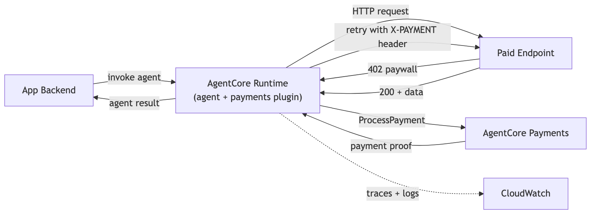

# Deploy Payment Agent to AgentCore Runtime

## Overview

Tutorial 01 ran a payment-enabled agent locally in a notebook. This tutorial deploys the same agent to
**AgentCore Runtime** so it can be invoked over HTTPS with SigV4 auth.

The deployed agent runs under a dedicated execution role. The **AgentCorePaymentsPlugin**
handles 402 responses automatically — the LLM never calls payment APIs directly.

```
App Backend                          AgentCore Runtime
  │                                   ┌──────────────────────────┐
  │ create_session(budget=$0.50)      │  Payment Agent            │
  │                                   │  (execution role)         │
  │── invoke(session, instrument) ──►│  Plugin: ProcessPayment   │
  │                                   │  Cannot: CreateSession    │
  │◄── weather data + cost ─────────│  Cannot: Override budget   │
  │                                   └──────────────────────────┘
  │ get_session(check spend)
```

### How the Agent Code Works

`payment_agent.py` uses three patterns:

1. **`BedrockAgentCoreApp` + `@app.entrypoint`** — the standard AgentCore Runtime service contract
2. **Payload-driven config** — ALL payment context (manager ARN, session, instrument) comes from the invocation payload. This keeps the agent stateless.
3. **`AgentCorePaymentsPlugin`** — intercepts HTTP 402 responses and calls `ProcessPayment` automatically within the session budget

### Tutorial Flow

```
install deps → test locally (python payment_agent.py) → scaffold project → deploy → invoke
```

> **Testnet only.** All code uses Base Sepolia with free USDC from [faucet.circle.com](https://faucet.circle.com/).

### High-Level Architecture



## Prerequisites

- Tutorial 00 completed (`.env` with payment manager, instrument, etc.)
- Tutorial 01 completed (understand the local agent + plugin flow)
- Wallet funded with testnet USDC
- Python 3.10+
- Node.js 20+ (for the AgentCore CLI)
- [AWS CDK](https://docs.aws.amazon.com/cdk/v2/guide/getting_started.html) installed
- AWS CLI configured (`aws configure`)

## Step 1: Install the AgentCore CLI

The [`@aws/agentcore`](https://github.com/aws/agentcore-cli) CLI scaffolds agent projects, deploys them to AgentCore Runtime, and invokes them. Requires Node.js 20+.

```python
!npm install -g @aws/agentcore
```

```python
!agentcore --version
```

## Step 2: Install Python Dependencies

Install the private wheels (payments SDK) and agent framework packages. These are needed both for local testing and will be bundled into the deployment package.

```python
%pip install -r requirements.txt --quiet
```

## Step 3: Verify AWS Credentials

Confirm your AWS identity and region before proceeding.

```python
import os
import boto3

# Uncomment to use a named AWS profile:
# os.environ['AWS_PROFILE'] = '<your-profile>'

session = boto3.Session()
identity = session.client("sts").get_caller_identity()
account_id = identity["Account"]
print(f"Authenticated as: {identity['Arn']}")
print(f"Account: {account_id}")
print(f"Region: {session.region_name}")
```

## Step 4: Load Payment Config

Load the resource IDs from Tutorial 00's `.env`. These values will be passed in the invocation payload when calling the deployed agent.

> **Note:** This tutorial uses `.env` for simplicity. Store payment credentials in [AWS Secrets Manager](https://docs.aws.amazon.com/secretsmanager/latest/userguide/intro.html) and retrieve them using IAM role-based access.

```python
import sys

sys.path.append("..")

from dotenv import load_dotenv

load_dotenv(dotenv_path="../.env", override=True)

from utils import load_tutorial_env, print_summary

config = load_tutorial_env()

PAYMENT_MANAGER_ARN = config["payment_manager_arn"]
REGION = config["region"]
USER_ID = config["user_id"]

if config.get("multi_provider"):
    PROVIDER = list(config["instruments"].keys())[0]
    INSTRUMENT_ID = config["instruments"][PROVIDER]["instrument_id"]
else:
    INSTRUMENT_ID = config["instrument_id"]
    PROVIDER = config.get("provider_type", "unknown")

print_summary(
    "Payment Config",
    payment_manager_arn=PAYMENT_MANAGER_ARN,
    region=REGION,
    user_id=USER_ID,
    instrument_id=INSTRUMENT_ID,
    provider=PROVIDER,
)
```

## Step 5: Test Locally

Before deploying, verify the agent works locally. `BedrockAgentCoreApp` starts a Uvicorn server on port 8080 with `/invocations` and `/ping` endpoints — the same contract as AgentCore Runtime.

**Start the agent in a separate terminal:**
```bash
cd 00-getting-started/02-deploy-to-agentcore-runtime
export AWS_PROFILE=<your-profile>
python payment_agent.py
```

> **Important:** The agent process needs `AWS_PROFILE` set so it uses the correct credentials and region.

Then run the cells below to test.

```python
# 5a. Health check — confirms the agent is running
!curl -s http://localhost:8080/ping
```

```python
# 5b. Quick invocation — confirms the /invocations endpoint works
import json
import requests

test_payload = {
    "prompt": "Hello, what can you do?",
    "payment_manager_arn": PAYMENT_MANAGER_ARN,
    "user_id": USER_ID,
    "payment_session_id": "test-local-session",
    "payment_instrument_id": INSTRUMENT_ID,
}

resp = requests.post("http://localhost:8080/invocations", json=test_payload, timeout=60)
print(json.dumps(resp.json(), indent=2))
```

```python
# 5c. Full payment test — create a real session and hit a paid x402 endpoint
import requests
from bedrock_agentcore.payments import PaymentManager

manager = PaymentManager(payment_manager_arn=PAYMENT_MANAGER_ARN, region_name=REGION)

local_session = manager.create_payment_session(
    user_id=USER_ID,
    limits={"maxSpendAmount": {"value": "0.50", "currency": "USD"}},
    expiry_time_in_minutes=60,
)
local_session_id = local_session["paymentSessionId"]
print(f"Session created: {local_session_id} (budget: $0.50)")

paid_payload = {
    "prompt": "Access this paid weather API and tell me what data you get back: https://x402-test.genesisblock.ai/api/weather Report the weather data and how much it cost.",
    "payment_manager_arn": PAYMENT_MANAGER_ARN,
    "user_id": USER_ID,
    "payment_session_id": local_session_id,
    "payment_instrument_id": INSTRUMENT_ID,
}

print("Invoking local agent with paid endpoint...")
resp = requests.post("http://localhost:8080/invocations", json=paid_payload, timeout=120)
print(json.dumps(resp.json(), indent=2))
```

Local test passed. Stop the agent (`Ctrl+C` in the terminal) and proceed to cloud deployment.

## Step 6: Scaffold the AgentCore Project

`agentcore create` generates the project structure that the CLI needs for deployment (CDK infra, config files, app directory). Then copy the payment agent code and vendored wheels into it.

```python
# 6a. Scaffold the project

if not os.path.exists("PaymentAgent"):
    !agentcore create --name PaymentAgent --framework Strands --protocol HTTP --model-provider Bedrock --memory none
else:
    print("PaymentAgent/ already exists — skipping create")
```

```python
# 6b. Copy our agent code into the project
!cp payment_agent.py PaymentAgent/app/PaymentAgent/main.py

print("Agent code copied:")
!ls PaymentAgent/app/PaymentAgent/
```

```python
# 6c. Update pyproject.toml with our dependencies
pyproject_content = """[project]
name = "payment-agent"
version = "0.1.0"
requires-python = ">=3.10"
dependencies = [
    "bedrock-agentcore[strands-agents]>=1.9.0",
    "boto3>=1.43.5",
    "strands-agents>=1.0.0",
    "strands-agents-tools>=0.2.0",
    "python-dotenv>=1.0.0",
]
"""
with open("PaymentAgent/app/PaymentAgent/pyproject.toml", "w") as f:
    f.write(pyproject_content)

# Remove stale lock file if it exists
lock_file = "PaymentAgent/app/PaymentAgent/uv.lock"
if os.path.exists(lock_file):
    os.remove(lock_file)

print("pyproject.toml updated")
```

## Step 7: Deploy to AgentCore Runtime

The CLI auto-creates an execution role with Bedrock model + observability permissions. After deploy, add payment permissions to that role.

First deploy takes ~2-3 minutes.

**Cost notice:** This deployment creates billable AWS resources including Lambda functions, CloudWatch log groups, and API Gateway endpoints. Bedrock model invocations incur per-request charges. Run the cleanup section when finished to avoid ongoing costs.

```python
!cd PaymentAgent && agentcore deploy -y
```

```python
# Verify deployment status
!cd PaymentAgent && agentcore status
```

### Add payment permissions to the auto-created execution role

The CLI created a role with Bedrock + CloudWatch permissions. Add payment data-plane permissions so the plugin can call `ProcessPayment`.

```python
import json

iam = boto3.client("iam")

# Find the execution role created by agentcore deploy
roles = iam.list_roles(MaxItems=200)["Roles"]
runtime_roles = [r["RoleName"] for r in roles if "PaymentAgent" in r["RoleName"] and "Execution" in r["RoleName"]]
if not runtime_roles:
    # Fallback: any role with PaymentAgent in the name
    runtime_roles = [r["RoleName"] for r in roles if "PaymentAgent" in r["RoleName"]]
assert runtime_roles, "No PaymentAgent role found — check agentcore deploy output"
RUNTIME_ROLE_NAME = runtime_roles[0]

# Add payment permissions
payment_policy = {
    "Version": "2012-10-17",
    "Statement": [
        {
            "Effect": "Allow",
            "Action": [
                "bedrock-agentcore:ProcessPayment",
                "bedrock-agentcore:GetPaymentInstrument",
                "bedrock-agentcore:ListPaymentInstruments",
                "bedrock-agentcore:GetPaymentInstrumentBalance",
                "bedrock-agentcore:GetPaymentSession",
                "bedrock-agentcore:GetResourcePaymentToken",
            ],
            "Resource": f"arn:aws:bedrock-agentcore:{REGION}:{account_id}:payment-manager/*",
        }
    ],
}

iam.put_role_policy(
    RoleName=RUNTIME_ROLE_NAME,
    PolicyName="PaymentDataPlaneAccess",
    PolicyDocument=json.dumps(payment_policy),
)

print(f"Added payment permissions to: {RUNTIME_ROLE_NAME}")
```

```python
# Get the Runtime ARN and save to .env for downstream tutorials (04, 05, etc.)
import re
from utils import update_env_file

status_output = !cd PaymentAgent && agentcore status --json
raw_text = "\n".join(status_output)
match = re.search(r'arn:aws:bedrock-agentcore:[^\s"]+', raw_text)
assert match, "Could not find Runtime ARN in agentcore status output — is the agent deployed?"
AGENT_RUNTIME_ARN = match.group(0)

update_env_file({"AGENT_RUNTIME_ARN": AGENT_RUNTIME_ARN})
print(f"Runtime ARN: {AGENT_RUNTIME_ARN}")
print("Saved to .env")
```

## Step 8: Invoke the Deployed Agent

Create a fresh payment session (app backend controls the budget), then invoke the deployed agent via the CLI.

### Payment Flow Sequence


```python
# Create a fresh session with $0.50 budget
fresh_session = manager.create_payment_session(
    user_id=USER_ID,
    limits={"maxSpendAmount": {"value": "0.50", "currency": "USD"}},
    expiry_time_in_minutes=60,
)
fresh_session_id = fresh_session["paymentSessionId"]
print(f"Session: {fresh_session_id} (budget: $0.50, expiry: 60 min)")
```

```python
# Build the invocation payload
invoke_payload = json.dumps(
    {
        "prompt": "Access this paid weather API and tell me what data you get back: https://x402-test.genesisblock.ai/api/weather Report the weather data and how much it cost.",
        "payment_manager_arn": PAYMENT_MANAGER_ARN,
        "user_id": USER_ID,
        "payment_session_id": fresh_session_id,
        "payment_instrument_id": INSTRUMENT_ID,
    }
)

print(f"Invoking deployed agent with session {fresh_session_id}...")
```

```python
# Invoke the deployed agent via CLI
!cd PaymentAgent && agentcore invoke '{invoke_payload}'
```

## Step 9: Verify Session Spend

Check how much of the $0.50 budget was consumed by the agent's payment.

```python
session_info = manager.get_payment_session(
    user_id=USER_ID,
    payment_session_id=fresh_session_id,
)

available = session_info.get("availableLimits", {}).get("availableSpendAmount", {})
budget = session_info.get("limits", {}).get("maxSpendAmount", {})

print_summary(
    "Post-Invocation Session",
    session_id=fresh_session_id,
    budget_limit=f"${budget.get('value', 'N/A')} {budget.get('currency', '')}",
    remaining=f"${available.get('value', 'N/A')} {available.get('currency', '')}",
    spent=f"${float(budget.get('value', 0)) - float(available.get('value', 0)):.4f} USD"
    if available.get("value")
    else "N/A",
)
```

## Observability

AgentCore Runtime automatically emits traces and logs to CloudWatch.

```python
print(
    f"GenAI Dashboard: https://{REGION}.console.aws.amazon.com/cloudwatch/home?region={REGION}#gen-ai-observability/agent-core"
)
print("Stream logs:     cd PaymentAgent && agentcore logs")
```

> **Warning:** The following commands permanently delete the AgentCore Runtime deployment and local project files. Back up any modified code before proceeding.

## Cleanup

Remove the deployed Runtime and associated AWS resources.

**Payment sessions** — The sessions created in this tutorial expire automatically after 60 minutes. No manual cleanup needed.

```python
# Tear down the AgentCore Runtime stack
!cd PaymentAgent && agentcore remove all -y
```

```python
# Remove the scaffolded project directory
import shutil

if os.path.exists("PaymentAgent"):
    shutil.rmtree("PaymentAgent")
    print("Removed PaymentAgent/ directory")

print("Payment stack cleanup: run the cleanup cell in Tutorial 00")
```

## Summary

You deployed a payment-enabled agent to AgentCore Runtime:

| Step | What | How |
|------|------|-----|
| Local test | Verify agent works before deploying | `python payment_agent.py` + curl |
| Scaffold | Create project structure for CLI | `agentcore create --name PaymentAgent` |
| Deploy | Package + deploy to AWS via CDK | `agentcore deploy` |
| Invoke | Call the deployed agent | `agentcore invoke '{...}'` |
| Cleanup | Tear down all resources | `agentcore remove all` + `agentcore deploy` |

The deployed agent:
- Receives all payment context in the invocation payload (stateless)
- Plugin handles 402 → ProcessPayment automatically
- Cannot exceed the session budget (enforced server-side)
- Works with either supported wallet provider configured in Tutorial 00

### Next: Tutorial 03 — User Onboarding & Wallet Funding
