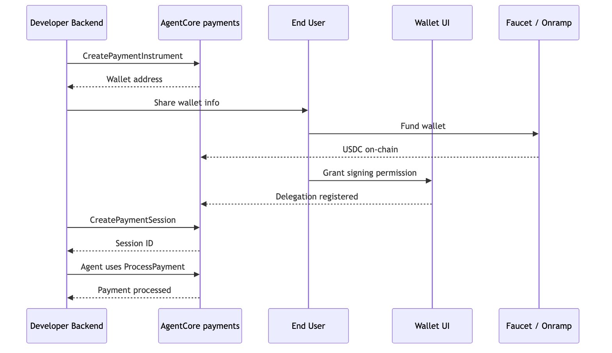
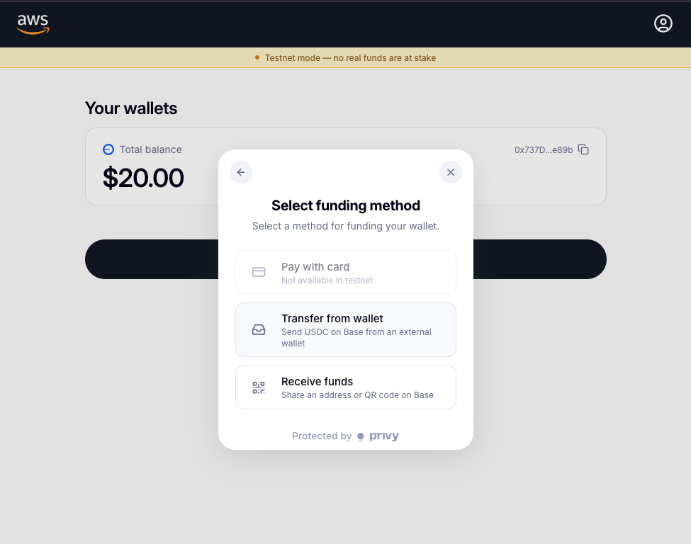
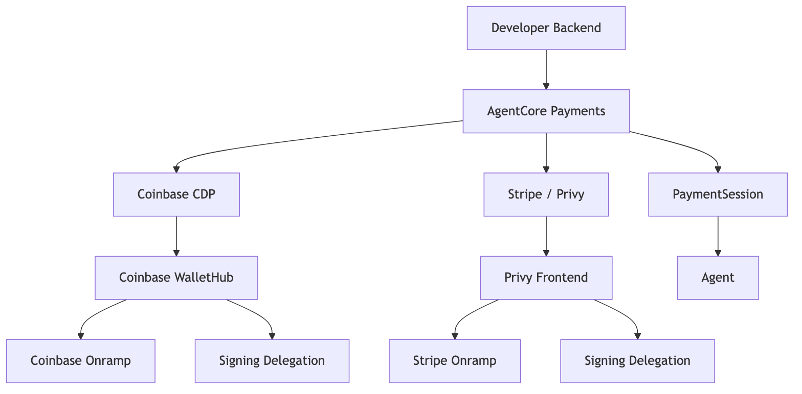

# User Onboarding and Backend Wallet Operations

## Overview

Tutorial 00 created one wallet for the developer so the downstream agent tutorials have something to spend from. In production, *every* end user of your application gets their own embedded wallet, and your backend manages the session budgets that govern what the agent spends on their behalf.

This notebook has two parts:

- **Part 1 — Onboarding (per end user):** create the wallet, fund it, delegate signing, and optionally provision wallets on additional chains.
- **Part 2 — Backend operations:** balance checks, session creation with budgets, instrument listing, and remaining-budget checks. These run from your application backend, not by the end user — included here so you see the full wallet lifecycle in one place.

The same flow works for both wallet providers — Coinbase CDP and Stripe (Privy) — with provider-specific fund and delegation UIs called out where they differ.

## Prerequisites

> **Cost notice:** Please see AgentCore pricing for more details on cost for the services used - https://aws.amazon.com/bedrock/agentcore/pricing/.  This tutorial uses testnet resources but the AWS infrastructure is billable. Run Tutorial 00's cleanup when finished.

* Tutorial 00 completed (`.env` exists with `PAYMENT_MANAGER_ARN`, `PAYMENT_CONNECTOR_ID`, `LINKED_EMAIL`)
* Testnet USDC from https://faucet.circle.com/ (Base Sepolia or Solana Devnet)

```python
%pip install -r requirements.txt --quiet
```

```python
import sys
import os

sys.path.append("..")

from dotenv import load_dotenv

load_dotenv(override=True)

import boto3
from bedrock_agentcore.payments import PaymentManager
from utils import load_tutorial_env, print_summary, client_token, wait_for_status

config = load_tutorial_env()
PAYMENT_MANAGER_ARN = config["payment_manager_arn"]
REGION = config["region"]
USER_ID = config["user_id"]
NETWORK = os.environ.get("NETWORK", "ETHEREUM")

# SDK client for instrument + session operations (returns flat, unwrapped dicts).
manager = PaymentManager(payment_manager_arn=PAYMENT_MANAGER_ARN, region_name=REGION)

# boto3 client kept for GetPaymentInstrumentBalance, which the SDK does not expose.
dp_client = boto3.client("bedrock-agentcore", region_name=REGION)

# Get connector ID
if config.get("multi_provider"):
    PROVIDER = list(config["instruments"].keys())[0]
    CONNECTOR_ID = config["instruments"][PROVIDER]["connector_id"]
    INSTRUMENT_ID = config["instruments"][PROVIDER]["instrument_id"]
else:
    CONNECTOR_ID = config.get("connector_id")
    INSTRUMENT_ID = config.get("instrument_id")
    PROVIDER = config.get("provider_type", "unknown")

print_summary("Config", provider=PROVIDER, instrument=INSTRUMENT_ID)
```

> **Two personas in this tutorial.** The cells below simulate both sides of the lifecycle — your *application backend* (provisions the wallet, runs balance and session operations) and the *end user* (funds the wallet, grants consent through a UI). For simplicity, the tutorial reuses the developer email (`LINKED_EMAIL` from `.env`) as the end-user identity. In production each of your users would have their own email and their own wallet.

---

# Part 1 — Onboarding (per end user)

Sections 1–3 cover what happens the first time a user signs up: your backend provisions a wallet for them, they fund it, and they grant the agent permission to sign.

### Onboarding Flow



## 1. Create an Embedded Wallet

This is the core onboarding call. Your application backend runs `CreatePaymentInstrument` every time a user signs up — it provisions an embedded USDC wallet linked to the user's identity (email, phone, or OAuth). The user does not see a private key; the wallet provider (Coinbase or Privy) holds key material on their behalf.

Tutorial 00 did this for the developer's wallet. This cell onboards a second user so you see the call run end-to-end.

> **Email reuse for this tutorial.** The code cell below reads `LINKED_EMAIL` from your `.env` — the same email you set up in Tutorial 00 — so the "new user" is really you wearing a different hat. Keeping one email keeps the tutorial simple (one inbox, one set of OTP codes, one wallet login). In a signup flow you would pass the actual new user's email here.

```python
# Provision a second wallet for a new end user.
# This is a real API call — it provisions a wallet via the configured provider.

# End-user identity for the new wallet. In production each of your users
# would have their own email; here we reuse the developer's LINKED_EMAIL
# from .env for tutorial simplicity. See the two-personas callout at the top.
NEW_USER_ID = "tutorial-03-user"
NEW_EMAIL = os.environ.get("LINKED_EMAIL", "tutorial03@example.com")

# SDK returns the instrument fields flat (paymentInstrumentId, paymentInstrumentDetails, status
# at the top level), so no unwrapping needed.
inst = manager.create_payment_instrument(
    user_id=NEW_USER_ID,
    payment_connector_id=CONNECTOR_ID,
    payment_instrument_type="EMBEDDED_CRYPTO_WALLET",
    payment_instrument_details={
        "embeddedCryptoWallet": {
            "network": NETWORK,
            "linkedAccounts": [{"email": {"emailAddress": NEW_EMAIL}}],
        }
    },
    client_token=client_token(),
)
NEW_INSTRUMENT_ID = inst["paymentInstrumentId"]
NEW_WALLET = inst["paymentInstrumentDetails"]["embeddedCryptoWallet"]["walletAddress"]

# Instruments typically become ACTIVE immediately. This check is a safety net
# in case the API briefly returns INITIATED during provisioning.
if inst.get("status") != "ACTIVE":
    print("\nWaiting for instrument to become ACTIVE...")
    wait_for_status(
        dp_client.get_payment_instrument,
        "ACTIVE",
        paymentManagerArn=PAYMENT_MANAGER_ARN,
        paymentConnectorId=CONNECTOR_ID,
        paymentInstrumentId=NEW_INSTRUMENT_ID,
        userId=NEW_USER_ID,
    )

print_summary(
    "New Instrument Created",
    instrument_id=NEW_INSTRUMENT_ID,
    wallet_address=NEW_WALLET,
    network=NETWORK,
    status="ACTIVE",
)

# Coinbase surfaces a redirectUrl to WalletHub — the entry point for the
# end user to fund the wallet and grant signing permission. Privy does not;
# its equivalent flow lives in your own frontend — the tutorial uses the Privy reference frontend (see Section 2 and Section 3 below).
redirect_url = inst["paymentInstrumentDetails"]["embeddedCryptoWallet"].get("redirectUrl")
if redirect_url:
    print(f"\n  WalletHub: {redirect_url}")
    print("  Share this URL with the end user to fund the wallet and grant signing permission.")
```

## 2. Fund the Wallet

> **👤 End-user action** Funding is something the end user does through a UI (WalletHub for Coinbase, your own frontend for Privy — the tutorial uses the Privy reference frontend). For the tutorial, the developer stands in for the end user and funds the wallet from the Circle faucet below.

### Testnet funding for the tutorial

Use the Circle USDC faucet (free testnet tokens):
1. Go to [faucet.circle.com](https://faucet.circle.com/)
2. Select **Base Sepolia** (ETHEREUM) or **Solana Devnet** (SOLANA)
3. Paste the wallet address (the `Wallet Address` from the **New Instrument Created** summary above), request USDC

### Funding flows (reference only)

In your application, end users fund their wallets through provider-specific UIs. Review these so you understand what your users will experience. For tutorial testing, keep using the faucet above.

#### Coinbase CDP — WalletHub

When you create a Coinbase instrument, the response includes a `redirectUrl` pointing to Coinbase WalletHub. Share this URL with the end user — from the same UI they can:

* Fund the wallet (crypto transfer or fiat onramp via credit card / bank / Apple Pay / Google Pay).
* Grant signing permission to the agent (delegation — see Section 3).

WalletHub is managed entirely by Coinbase and hosted on Coinbase's domain, so there's nothing for you to deploy.

#### Stripe (Privy) — the Privy reference frontend

In Tutorial 00 Step 3 you launched the Privy reference frontend at `http://localhost:3000`. That same UI has an **Add funds** action exposing three options:

* **Pay with card** — fiat → USDC via Stripe's onramp (handles KYC, payment processing, delivery).
* **Transfer from wallet** — crypto-to-crypto from an external wallet the user already controls.
* **Receive funds** — displays the wallet address and QR code so someone else can send USDC to it.



> **Note:** `http://localhost:3000` is tutorial-only. In production you ship the Privy reference frontend (or your own equivalent) on your real HTTPS domain, integrating the Privy flows directly into your own application.

### Fiat-to-crypto onramp glossary

**Fiat** means traditional currency (USD, EUR) paid via credit card, bank transfer, Apple Pay, or Google Pay. An **onramp** converts fiat into stablecoin (USDC) and deposits it into the embedded wallet. Tutorial runs use testnet USDC from the faucet and never touch real money.

| Provider | Onramp docs |
|----------|-------------|
| Coinbase | [Coinbase Onramp](https://docs.cdp.coinbase.com/onramp/coinbase-hosted-onramp/generating-onramp-url) · [Sandbox Testing](https://docs.cdp.coinbase.com/onramp/additional-resources/sandbox-testing) |
| Stripe (Privy) | [Stripe Onramp](https://docs.stripe.com/crypto/onramp) |

## 3. Delegation: Grant Signing Permission

> ✋ **Manual step.** Delegation happens outside this notebook. The developer sets up the mechanism; the end user grants consent via a frontend (the tutorial uses the Privy reference frontend) or the WalletHub.

Before the agent can sign transactions, the end user grants permission. This is a one-time step per wallet.

| | Coinbase CDP | Stripe (Privy) |
|---|---|---|
| **Mechanism** | Project-level delegated signing | Authorization key as an additional signer on the wallet |
| **Setup** | CDP Portal → Wallets → Embedded Wallet → Policies → enable | Privy reference frontend `addSigners()` call |
| **User action** | Grant consent via WalletHub `redirectUrl` | 1. Log in at `http://localhost:3000` with the end-user email.
2. Choose **Connect agent**.
3. Choose **Give access**.

Same UI as Section 2's Add funds. |
| **Scope** | All wallets under the project | Per-wallet |
| **Without it** | ProcessPayment fails with error | ProcessPayment returns HTTP 500 |

> **Production note.** `http://localhost:3000` is for tutorial testing only. In production, the Privy reference frontend (or your own equivalent) runs on your real HTTPS domain, with the Privy flows embedded inside your own application. Coinbase WalletHub handles both fund and delegate in the same managed UI on Coinbase's domain, so no self-hosted concern there.

### Wallet Provider Paths



---

# Part 2 — Backend operations

The remaining sections run from your application backend, not by the end user. They cover the ops you call before, during, and after an agent task: balance checks, adding wallets on additional chains, session budgets, instrument listings, and remaining-budget queries. Each section is marked with a 🖥️ callout so the persona boundary stays obvious as you read.

The cells below reuse the user onboarded in Section 1 so these calls run against a real wallet.

## 4. Check Wallet Balance

> **🖥️ Backend operation.** Your application backend calls `GetPaymentInstrumentBalance`. The end user never hits this API directly — they see balances in WalletHub or in your own UI.

Verify the wallet has USDC before creating a session.

The rest of this notebook uses the AgentCore SDK's `PaymentManager`, but `GetPaymentInstrumentBalance` isn't exposed through the SDK, so this cell uses the boto3 `dp_client` directly. Tutorial 00 does the same thing.

```python
# Check balance for the instrument
chain = "BASE_SEPOLIA" if NETWORK == "ETHEREUM" else "SOLANA_DEVNET"

# The service requires userId on this call even though the boto3 model marks it optional.
# Each wallet was created under its own userId, so we pair (instrument_id, user_id) together.
for label, inst_id, user_id in [
    ("Tutorial 00 instrument", INSTRUMENT_ID, USER_ID),
    ("New instrument", NEW_INSTRUMENT_ID, NEW_USER_ID),
]:
    try:
        resp = dp_client.get_payment_instrument_balance(
            paymentManagerArn=PAYMENT_MANAGER_ARN,
            paymentConnectorId=CONNECTOR_ID,
            paymentInstrumentId=inst_id,
            userId=user_id,
            chain=chain,
            token="USDC",
        )
        balance = resp.get("tokenBalance", {})
        amount = int(balance.get("amount", "0")) / 1_000_000
        print(f"✅ {label}: {amount:.2f} USDC on {chain}")
        if amount == 0:
            print("   Fund at: https://faucet.circle.com/")
    except Exception as e:
        print(f"⚠️  {label}: {e}")
```

## 5. Multi-Network Wallets

> **🖥️ Backend operation.** Your backend calls `CreatePaymentInstrument` a second time to add a wallet on another chain. The user doesn't run this — the user receives an additional wallet under the same identity.

The same user can have wallets on both Ethereum and Solana under the same PaymentManager. Call `create_payment_instrument` twice with different `network` values. The provider detects the existing user and adds a new wallet on the requested chain.

```python
# Ethereum wallet (already created in Tutorial 00)
eth_instrument = manager.create_payment_instrument(
    ..., payment_instrument_details={'embeddedCryptoWallet': {'network': 'ETHEREUM', ...}}
)

# Solana wallet (same user, same manager, same connector)
sol_instrument = manager.create_payment_instrument(
    ..., payment_instrument_details={'embeddedCryptoWallet': {'network': 'SOLANA', ...}}
)
```

Each instrument has its own wallet address and must be funded separately. The agent receives whichever `instrumentId` matches the network of the paid endpoint.

## 6. Create Sessions with Different Payment Limits

> **🖥️ Backend operation.** `CreatePaymentSession` is a backend call — your application provisions a session per task when it's about to route work to the agent. The end user never creates a session directly.

In practice, your backend creates a new session per task — not one session for everything. Different tasks get different budgets and expiry times.

> **Where's the wallet?** `CreatePaymentSession` takes only the user and the budget — not an instrument. Sessions are wallet-blind. At `ProcessPayment` time the service picks the user's instrument whose network matches the merchant's x402 challenge. A single session can spend across the user's Ethereum and Solana wallets as long as each individual payment fits the budget.

```python
# SDK returns session fields flat (paymentSessionId, limits, expiryTimeInMinutes
# at the top level), so `quick`, `research`, and `deep` are ready-to-use dicts.

# Quick lookup: small budget, short expiry
quick = manager.create_payment_session(
    user_id=USER_ID,
    expiry_time_in_minutes=15,
    limits={"maxSpendAmount": {"value": "0.10", "currency": "USD"}},
    client_token=client_token(),
)
print(f"Quick lookup: {quick['paymentSessionId']} ($0.10 / 15 min)")

# Research task: moderate budget
research = manager.create_payment_session(
    user_id=USER_ID,
    expiry_time_in_minutes=60,
    limits={"maxSpendAmount": {"value": "1.00", "currency": "USD"}},
    client_token=client_token(),
)
print(f"Research:     {research['paymentSessionId']} ($1.00 / 60 min)")

# Deep analysis: larger budget, longer expiry
deep = manager.create_payment_session(
    user_id=USER_ID,
    expiry_time_in_minutes=480,
    limits={"maxSpendAmount": {"value": "5.00", "currency": "USD"}},
    client_token=client_token(),
)
print(f"Deep analysis: {deep['paymentSessionId']} ($5.00 / 480 min)")

print("\nSame user, same wallet, independent budgets.")
print("The agent receives whichever sessionId matches the task.")
```

## 7. List All Instruments for a User

> **🖥️ Backend operation.** `ListPaymentInstruments` is a backend call, typically used by ops tooling, support dashboards, or a wallet-selector UI your application renders for the user.

See all wallets for a given user. Useful for building a wallet selection UI, account dashboards, or support tools. The call is scoped per user. The cell below lists instruments for both users created across Tutorial 00 and Section 1.

`ListPaymentInstruments` returns a lightweight summary (ID, type, status, timestamps) — not the full wallet details. If you need the network or wallet address for a given instrument, call `GetPaymentInstrument` with its `paymentInstrumentId`.

```python
# List all instruments for each user we created.
# SDK returns {'paymentInstruments': [...]}; the SDK handles the ListPaymentInstruments
# userId requirement internally.
for label, user_id in [
    ("Tutorial 00 user", USER_ID),
    ("Section 1 new user", NEW_USER_ID),
]:
    resp = manager.list_payment_instruments(
        user_id=user_id,
        payment_connector_id=CONNECTOR_ID,
    )
    instruments = resp.get("paymentInstruments", [])
    print(f"\n\u2705 {label} ({user_id}): {len(instruments)} instrument(s)")
    for inst in instruments:
        print(f"  {inst['paymentInstrumentId']}")
        print(f"    type:    {inst.get('paymentInstrumentType', 'unknown')}")
        print(f"    status:  {inst.get('status', 'unknown')}")
        print(f"    created: {inst.get('createdAt', 'unknown')}")
```

## 8. Check Session Remaining Budget

> **🖥️ Backend operation.** `GetPaymentSession` is a backend call. Your application queries it to surface remaining budget to the user, decide whether to route more work to the agent, or log spend.

`GetPaymentSession` returns `availableLimits.availableSpendAmount` — the remaining budget in real time. Call this from your backend to show the user how much they have left before routing more work to the agent. The cell below inspects all three sessions created in Section 6 so you can see the shape in context.

```python
# Check remaining budget on all three sessions created above.
# SDK returns a flat dict with limits / availableLimits / expiryTimeInMinutes at the top level.
for label, created in [
    ("Quick lookup", quick),
    ("Research", research),
    ("Deep analysis", deep),
]:
    sid = created["paymentSessionId"]
    sess = manager.get_payment_session(
        user_id=USER_ID,
        payment_session_id=sid,
    )
    budget = sess.get("limits", {}).get("maxSpendAmount", {})
    available = sess.get("availableLimits", {}).get("availableSpendAmount", {})
    print(f"\n{label} — {sid}")
    print(f"  Budget:    {budget.get('value', 'N/A')} {budget.get('currency', '')}")
    print(f"  Available: {available.get('value', 'N/A')} {available.get('currency', '')}")
    print(f"  Expiry:    {sess.get('expiryTimeInMinutes', 'N/A')} minutes")
```

## Summary

### Funding options (Part 1 — end user)

| Method | Use case | Provider |
|--------|----------|----------|
| Circle faucet | Testnet (free) | Both |
| Direct USDC transfer | User sends from external wallet | Both |
| Coinbase Onramp URL | Fiat → crypto (credit card, bank) | Coinbase |
| Stripe Onramp | Fiat → crypto (credit card, bank, Apple Pay) | Privy |
| Coinbase WalletHub | Fund + delegate in one UI (managed by Coinbase) | Coinbase |
| Privy reference frontend | Fund + delegate via your app's UI (self-hosted in prod) | Privy |

### Session patterns (Part 2 — backend)

| Pattern | Budget | Expiry | Use case |
|---------|--------|--------|----------|
| Quick lookup | $0.10 | 15 min | Single API call |
| Research task | $1.00 | 60 min | Multi-endpoint research |
| Deep analysis | $5.00 | 480 min | Extended workflow |
| No budget cap | omit `limits` | 60 min | Trusted internal agents |

### Supported networks

| Network | Chain | Testnet | Faucet |
|---------|-------|---------|--------|
| ETHEREUM | Base Sepolia | `eip155:84532` | faucet.circle.com → Base Sepolia |
| SOLANA | Solana Devnet | `solana:EtWTRABZaYq6iMfeYKouRu166VU2xqa1` | faucet.circle.com → Solana Devnet |

## Verification

If the cells above ran without errors, your wallet operations succeeded. You should see wallet addresses printed for each instrument and a non-zero USDC balance returned by `GetPaymentInstrumentBalance` — confirming the wallet was created, funded, and is accessible by the backend.

## Cleanup

The three payment sessions created in this tutorial (quick lookup, research task, deep analysis) expire automatically after their configured `expiryTimeInMinutes`. To delete all payment resources, run the cleanup cell in Tutorial 00.

The Instrument created in this notebook (`NEW_INSTRUMENT_ID`) is cleaned up when you delete the Payment Manager in Tutorial 00.

# Congratulations!

You now understand the full wallet lifecycle: onboarding (create, fund, delegate) and the backend operations your application runs around it — balance checks, multi-network wallets, and session patterns.
