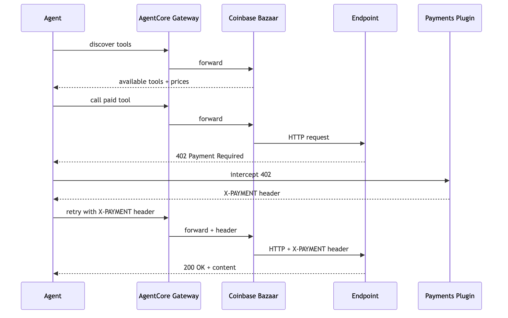

# Integrate Your Agent with Coinbase Bazaar via AgentCore Gateway

## Overview

The **Coinbase x402 Bazaar** is an MCP marketplace where paid tools are listed with semantic descriptions, pricing, and input/output schemas. Agents discover tools via `search_resources` and call them via `proxy_tool_call` — the Bazaar handles 402 detection and payment routing.

In this tutorial, we connect the Bazaar to an **AgentCore Gateway** as a native MCP target, then build a Strands agent that discovers and calls paid tools with automatic payment handling.

### How It Works

```
┌─────────────────────────────────┐
│  🧑‍💻 Developer Code              │
│                                 │
│  Strands Agent                  │
│  + AgentCorePaymentsPlugin      │
│  + MCPClient (streamable HTTP)  │
└──────────┬──────────────────────┘
           │ MCP protocol
┌──────────▼──────────────────────┐
│  🔀 AgentCore Gateway            │
│  Target: Coinbase x402 Bazaar   │
│  (No outbound auth)             │
└──────────┬──────────────────────┘
           │
┌──────────▼──────────────────────┐
│  🌐 Coinbase x402 Bazaar        │
│  search_resources → discover    │
│  proxy_tool_call  → call + pay  │
└──────────┬──────────────────────┘
           │ HTTP 402 → pay → retry
┌──────────▼──────────────────────┐   ┌──────────────────┐
│  ☁️ AgentCore payments           │──▶│ 🏦 Wallet Provider│
│  Payment Manager                │   │ Coinbase CDP     │
│  Session ($1.00 budget)         │   │   — or —         │
│  Instrument (embedded wallet)   │   │ Stripe Privy     │
│  ProcessPayment (sign + proof)  │   │ (routed by       │
│                                 │   │  PaymentConnector)│
└─────────────────────────────────┘   └──────────────────┘
```

The key difference from Tutorial 01: the agent doesn't know which URLs to call. It discovers tools at runtime via `search_resources`, then calls them via `proxy_tool_call`. The payment infrastructure is the same.

### Wallet-agnostic by design

The agent code in this notebook is the same whether you configured Coinbase CDP or Stripe (Privy) in Tutorial 00. The `AgentCorePaymentsPlugin` receives a `payment_instrument_id` — AgentCore payments knows which wallet provider backs that instrument based on the PaymentConnector. The same code, same Gateway, same Bazaar tools — only the `.env` values differ. This is a core design principle of AgentCore payments: developers write payment logic once, and the service handles provider routing.

> **Testnet only.** This tutorial uses Base Sepolia (Ethereum) with free USDC from [faucet.circle.com](https://faucet.circle.com/). Testnet USDC has no real-world value.

### Architecture Overview


## Prerequisites

* [Tutorial 00 — Setup AgentCore payments](../00-setup-agentcore-payments/) completed (`.env` exists with payment manager, instrument, session)
* Wallet funded with testnet USDC — see the [Circle USDC Faucet guide](https://faucet.circle.com/) (select Base Sepolia, paste your wallet address from Tutorial 00)
* AgentCore CLI: `npm install -g @aws/agentcore`
* `pip install -r requirements.txt`

This tutorial works with either wallet provider you configured in Tutorial 00 - Coinbase CDP or Stripe (Privy). The agent code is the same regardless of your choice.

Your AWS credentials need the IAM permissions created by Tutorial 00 (`setup_payment_roles()`). If you can run Tutorial 00 successfully, you have the required permissions.

```python
%pip install -r requirements.txt --quiet
```

```python
import os
# os.environ['AWS_PROFILE'] = 'your-profile'

import boto3

session = boto3.Session()
identity = session.client("sts").get_caller_identity()
print(f"Authenticated as: {identity['Arn']}")
print(f"Account: {identity['Account']}")
print(f"Region: {session.region_name}")
```

## Step 1 — Create the Gateway with Bazaar Target

> **Cost notice:** AgentCore Gateway deployments incur AWS charges. Run cleanup when finished to avoid ongoing costs.

Add the Coinbase x402 Bazaar as an MCP target in an AgentCore Gateway. The Bazaar exposes discovery endpoints that let agents browse and search 10,000+ x402-enabled services.

### Option A: AgentCore Console (recommended)

1. Open the [Amazon Bedrock AgentCore console](https://console.aws.amazon.com/bedrock-agentcore/)
2. Navigate to Gateway → Create Gateway → Add Target
3. Target type: **Integrations**
4. Select **Coinbase x402 Bazaar**
5. No outbound auth needed (No Authorization is the default)

### Option B: AgentCore CLI

> **Note:** The AgentCore CLI does not support the **Integrations** target type (which auto-configures Coinbase x402 Bazaar). With the CLI, you add the Bazaar as a standard `mcp-server` target using its endpoint URL directly. The result is the same — the Bazaar MCP server is exposed through your Gateway.

```bash
# 1. Create an AgentCore project (skip if you already have one from Tutorial 02)
agentcore create --name BazaarAgent --defaults

# 2. Add a Gateway
agentcore add gateway --name BazaarGateway

# 3. Add Coinbase x402 Bazaar as an MCP target
agentcore add gateway-target \
  --name CoinbaseBazaar \
  --type mcp-server \
  --endpoint https://api.cdp.coinbase.com/platform/v2/x402/discovery/mcp \
  --gateway BazaarGateway

# 4. Deploy the Gateway
agentcore deploy -y

# 5. Get the Gateway URL and auth details
agentcore fetch access --name BazaarGateway --type gateway
```

Save the `GATEWAY_URL` from the output and add it to your `.env` file:

```bash
# Add to your 00-getting-started/.env file:
GATEWAY_URL=https://<gateway-id>.gateway.bedrock-agentcore.<region>.amazonaws.com/mcp

# If your Gateway uses CUSTOM_JWT auth, also add:
CLIENT_ID=<cognito-client-id>
CLIENT_SECRET=<cognito-client-secret>
TOKEN_URL=https://<domain>.auth.<region>.amazoncognito.com/oauth2/token
```

The `agentcore fetch access` output tells you the URL and which auth your Gateway requires. If you used `agentcore add gateway` with no `--authorizer-type` flag, it defaults to NONE auth — you only need `GATEWAY_URL`.

Once you have the Gateway URL, paste it in the cell below to save it to `.env`:

```python
# Paste your Gateway URL here after creating it in the console
import sys

sys.path.append("..")
from utils import update_env_file

# GATEWAY_URL = 'https://<your-gateway-id>.gateway.bedrock-agentcore.<region>.amazonaws.com/mcp'
GATEWAY_URL = input("Enter your Gateway URL: ").strip()

if not GATEWAY_URL:
    print("No URL provided. Edit the GATEWAY_URL variable above or re-run this cell.")
else:
    update_env_file("../.env", {"GATEWAY_URL": GATEWAY_URL})
    os.environ["GATEWAY_URL"] = GATEWAY_URL
    print(f"Saved GATEWAY_URL to .env: {GATEWAY_URL}")
```

## Step 2 — Load Payment Config

This step loads the payment resources created in [Tutorial 00](../00-setup-agentcore-payments/) from `.env`. The same config loading pattern is used in every tutorial (01–06). No new resources are created here.

### Step 2a — Payment Config (same as all tutorials)

```python
import sys
import os

sys.path.append(os.path.join(os.path.dirname(os.path.abspath(".")), ""))
sys.path.append("..")

from dotenv import load_dotenv

env_path = os.path.join(os.path.dirname(os.path.abspath(".")), ".env")
if not os.path.exists(env_path):
    env_path = os.path.join("..", ".env")
load_dotenv(dotenv_path=env_path, override=True)
print(f"Loaded .env from: {env_path}")

from utils import load_tutorial_env, print_summary

config = load_tutorial_env()
PAYMENT_MANAGER_ARN = config["payment_manager_arn"]
REGION = config["region"]
USER_ID = config["user_id"]

if config.get("multi_provider"):
    PROVIDER = list(config["instruments"].keys())[0]
    INSTRUMENT_ID = config["instruments"][PROVIDER]["instrument_id"]
else:
    INSTRUMENT_ID = config["instrument_id"]
    PROVIDER = config.get("provider_type", "unknown")

from bedrock_agentcore.payments import PaymentManager

manager = PaymentManager(payment_manager_arn=PAYMENT_MANAGER_ARN, region_name=REGION)
instr = manager.get_payment_instrument(user_id=USER_ID, payment_instrument_id=INSTRUMENT_ID)
instr_status = instr.get("status", "UNKNOWN")
assert instr_status == "ACTIVE", f"Instrument is {instr_status} — fund and delegate in Tutorial 00/03 first"

print_summary(
    "Payment Config",
    manager_arn=PAYMENT_MANAGER_ARN,
    region=REGION,
    provider=PROVIDER,
    instrument_id=INSTRUMENT_ID,
    instrument_status=instr_status,
    gateway_url=os.environ.get("GATEWAY_URL", "NOT SET"),
)
```

### Step 2b — Gateway Config

```python
import os

# Gateway URL — set this after creating the gateway in Step 1
GATEWAY_URL = os.environ.get("GATEWAY_URL", "")
if not GATEWAY_URL:
    raise ValueError("GATEWAY_URL not set. Create the Gateway in Step 1, then add GATEWAY_URL to your .env file.")

print_summary(
    "Gateway Config",
    gateway_url=GATEWAY_URL,
)
```

## Step 3 — Create Payment Session

A payment session defines the budget and expiry for this interaction. The Payment Manager and Instrument from Tutorial 00 are long-lived resources — sessions are created as needed.

```python
# Create a fresh session for this task (manager SDK client from Step 2)
sess_resp = manager.create_payment_session(
    user_id=USER_ID,
    limits={"maxSpendAmount": {"value": "1.00", "currency": "USD"}},
    expiry_time_in_minutes=60,
)
SESSION_ID = sess_resp["paymentSessionId"]
print(f"✅ Session: {SESSION_ID} (budget: $1.00)")
```

## Step 4 — Connect to Gateway and Create Agent

Connect to the Gateway MCP endpoint using the Strands MCP client. The Gateway routes to the Bazaar, which exposes `search_resources` and `proxy_tool_call` as MCP tools.

The PaymentsPlugin handles x402 payments automatically when `proxy_tool_call` returns a 402.

### Request and Payment Sequence



```python
from datetime import timedelta
from mcp.client.streamable_http import streamablehttp_client
from strands import Agent
from strands.models import BedrockModel
from strands.tools.mcp.mcp_client import MCPClient
from bedrock_agentcore.payments.integrations.strands import (
    AgentCorePaymentsPlugin,
    AgentCorePaymentsPluginConfig,
)

# For Gateway auth — auto-detect from .env
# If your Gateway uses CUSTOM_JWT, set CLIENT_ID, CLIENT_SECRET, TOKEN_URL in .env.
# If NONE auth (the default), leave them unset.
# Run `agentcore fetch access` to see which auth your Gateway requires.
gateway_headers = {}
CLIENT_ID = os.environ.get("CLIENT_ID")
CLIENT_SECRET = os.environ.get("CLIENT_SECRET")
TOKEN_URL = os.environ.get("TOKEN_URL")

if CLIENT_ID and CLIENT_SECRET and TOKEN_URL:
    from utils import get_oauth_token

    token = get_oauth_token(TOKEN_URL, CLIENT_ID, CLIENT_SECRET)
    gateway_headers = {"Authorization": f"Bearer {token}"}
    print("Gateway auth: CUSTOM_JWT (OAuth token acquired)")
else:
    print("Gateway auth: NONE (no CLIENT_ID/CLIENT_SECRET/TOKEN_URL in .env)")

# Connect to Gateway MCP endpoint
mcp_client = MCPClient(
    lambda: streamablehttp_client(
        GATEWAY_URL,
        headers=gateway_headers,
        timeout=timedelta(seconds=120),
    )
)

# Payment plugin — uses the Payment Manager, Instrument, and Session.
# The plugin handles x402 402 responses automatically: intercept → sign → retry.
# No manual payment code needed.
payment_plugin = AgentCorePaymentsPlugin(
    config=AgentCorePaymentsPluginConfig(
        payment_manager_arn=PAYMENT_MANAGER_ARN,
        user_id=USER_ID,
        payment_instrument_id=INSTRUMENT_ID,
        payment_session_id=SESSION_ID,
        region=REGION,
        network_preferences_config=["eip155:84532", "base-sepolia"],
    )
)

SYSTEM_PROMPT = """You are a research agent with access to the Coinbase x402 Bazaar — a marketplace of paid tools.

You can:
1. Use search_resources to discover available paid tools (filter by network, query, etc.)
2. Use proxy_tool_call to call a discovered tool — payment is handled automatically

When asked to find information:
- First search for relevant tools on the Bazaar
- Then call the most relevant tool
- Report what you found and what it cost

Always be transparent about payments."""

# Open the MCP connection (stays open across cells until cleanup)
mcp_client.__enter__()

agent = Agent(
    model=BedrockModel(model_id="us.anthropic.claude-sonnet-4-6", streaming=True),
    tools=mcp_client.list_tools_sync(),
    plugins=[payment_plugin],
    system_prompt=SYSTEM_PROMPT,
)
print(f"✅ Agent created with {len(mcp_client.list_tools_sync())} Bazaar tools + payment plugin")
```

## Step 5 — Discover and Call Paid Tools

This is the key difference from [Tutorial 01](../01-agents-payments-and-limits/). In Tutorial 01, you told the agent which URL to call. Here, the agent discovers what to call on its own using `search_resources`, then pays and calls it using `proxy_tool_call`. The developer doesn't pre-configure which tools exist — the agent finds them at runtime.

The use cases from the docs: research agents accessing paid data sources, financial analysis agents accessing market data, and agents browsing paid content — all start with discovery.

### Step 5a — Search and Call a Paid Tool

```python
result = agent(
    "Search the Bazaar for paid data sources related to market news on Base Sepolia. "
    "Tell me what tools are available, their prices, and what data they provide. "
    "Then pick the most relevant one, call it, and summarize the results with the cost."
)
print(result.message)
```

### Step 5b — Multi-Tool Discovery: Compare Prices Across Categories

The agent searches across different categories and compares prices — showing that it can evaluate multiple paid services before deciding which to call. This maps to the endpoint discoverability feature: 10,000+ pay-per-use x402 endpoints, and the agent shops for the best option within its budget.

```python
result = agent(
    "Search the Bazaar for three different categories of paid tools on Base Sepolia: "
    "1) market news, 2) weather data, "
    "For each category, list the available tools with their prices. "
    "Then tell me which tool in each category is the cheapest."
)
print(result.message)
```

### Step 5c — Budget-Aware Tool Selection

The agent checks its remaining budget before calling an expensive tool. If the budget is low, it picks a cheaper alternative. This shows how payment limits and tool discovery work together — the agent makes cost-aware decisions at runtime.

```python
# Check current spend
mid_session = manager.get_payment_session(
    user_id=USER_ID,
    payment_session_id=SESSION_ID,
)
current = mid_session.get("availableLimits", {}).get("availableSpendAmount", {})
print(f"Remaining budget: {current}")

result = agent(
    f"My remaining budget is {current} out of a $1.00 budget. "
    "Search the Bazaar for tools under $0.10 on Base Sepolia. "
    "Pick the cheapest one and call it. "
    "If nothing is under $0.10, tell me what the cheapest option costs."
)
print(result.message)
```

### Step 5d — Multiple Bazaar Calls in One Session

The agent calls multiple paid tools in sequence within a single session. The session budget tracks cumulative spend across all calls — showing that one payment stack handles multiple merchants without per-provider setup.

```python
result = agent(
    "I want a comprehensive research report. Do the following in order:\n"
    "1. Search the Bazaar for a market news tool and call it for the latest market updates\n"
    "2. Search for a weather data tool and call it for San Francisco weather\n"
    "3. Search for a crypto news tool and call it for the latest crypto headlines\n"
    "After each call, note the cost. At the end, summarize all results "
    "and the total amount spent across all three calls."
)
print(result.message)
```

## Step 6 — Check Session Spend

```python
session_info = manager.get_payment_session(
    user_id=USER_ID,
    payment_session_id=SESSION_ID,
)
sess = session_info
available = sess.get("availableLimits", {}).get("availableSpendAmount", {})
budget = sess.get("limits", {}).get("maxSpendAmount", {})
spent = float(budget.get("value", 0)) - float(available.get("value", budget.get("value", 0)))

print_summary(
    "Session After Bazaar Calls",
    session_id=SESSION_ID,
    budget_limit=f"${budget.get('value', 'N/A')} {budget.get('currency', '')}",
    remaining=f"${available.get('value', 'N/A')} {available.get('currency', '')}",
    spent=f"${spent:.4f} USD",
)
```

## View Payment Traces

Every Bazaar tool call that triggered a payment produced a trace. View them on the CloudWatch GenAI Observability Dashboard.

```python
print("🔍 View your agent traces: CloudWatch → GenAI Observability Dashboard")
print(f"  https://{REGION}.console.aws.amazon.com/cloudwatch/home?region={REGION}#gen-ai-observability/agent-core")
```

## Summary

You built an agent that discovers and pays for tools it didn't know about at build time. This demonstrates the **endpoint discoverability** feature from the docs: a ready-to-use Coinbase x402 Bazaar MCP server exposing 10,000+ pay-per-use x402 endpoints through AgentCore Gateway.

| AgentCore payments feature | What this tutorial demonstrated |
|---------------------------|-------------------------------|
| Endpoint discoverability | Agent connected to one Gateway URL and discovered tools across market news, weather data, and crypto news categories at runtime |
| Payment processing | `AgentCorePaymentsPlugin` handled 402 → sign → retry for every Bazaar tool call with no developer payment code |
| Payment limits | Session budget tracked cumulative spend across multiple paid tool calls from different merchants |
| Wallet integration | Same notebook, same agent code, same Gateway — works with Coinbase CDP or Stripe (Privy). Only the `.env` values from Tutorial 00 differ. |

The contrast with Tutorial 01: there, you told the agent which URL to hit. Here, the agent decided what to call based on the task — the Research and Financial analysis use cases from the docs.

### Wallet-agnostic by design

This is a core design principle of AgentCore payments. The agent code never references Coinbase or Privy. It receives a `payment_instrument_id` in the plugin config — AgentCore payments knows which wallet provider backs that instrument based on the PaymentConnector configured in Tutorial 00. The same deployed agent, the same Gateway, the same Bazaar tools serve both wallet providers without code changes. A developer who switches from Coinbase to Privy (or adds both) only changes the `.env` — zero code changes in the notebook or agent.

### Role separation for deployed agents

This notebook runs locally under your AWS credentials. When deployed, the runtime process runs under ProcessPaymentRole — the plugin calls `ProcessPayment` on behalf of the agent within the budget set by the app backend. The runtime cannot create sessions, modify limits, or provision wallets. The agent (LLM) never calls `ProcessPayment` directly. See Tutorial 02 for the full role separation implementation.

To test role separation locally, pass an assumed-role session to the SDK client:

```python
from utils import assume_role
import boto3

# App backend (ManagementRole) creates the session
manager = PaymentManager(payment_manager_arn=ARN, region_name=REGION)
session = manager.create_payment_session(user_id=USER_ID, ...)

# Agent runs under ProcessPaymentRole — can only ProcessPayment
agent_session = assume_role(boto3.Session(), PROCESS_PAYMENT_ROLE_ARN, 'agent')
agent_manager = PaymentManager(
    payment_manager_arn=ARN, boto3_session=agent_session
)
# Pass agent_manager to the plugin — it cannot create sessions or modify budgets
```

```python
# Close the MCP connection
try:
    mcp_client.__exit__(None, None, None)
    print("MCP connection closed.")
except Exception:
    pass
```

## Cleanup (optional)

Sessions expire automatically after their `expiryTimeInMinutes`.

**If you plan to continue with Tutorials 05–06, do NOT clean up.** The Gateway and payment resources are reused across tutorials.

Only run cleanup when you are done with all tutorials:

```bash
# Remove just the Gateway (keeps payment resources and any deployed agents)
# agentcore remove gateway --name BazaarGateway -y
# agentcore remove gateway-target --name CoinbaseBazaar -y
# agentcore deploy -y

# Or remove everything in the AgentCore project
# agentcore remove all -y

# Payment resources (Manager, Connector, Instrument): run cleanup in Tutorial 00
```

# Congratulations!

You've built an agent that discovers and pays for tools on the Coinbase Bazaar through AgentCore Gateway.

### Next steps

- **Custom Lambda interceptors** — Add Lambda-based interceptors to your AgentCore Gateway to transform, filter, or enrich requests before they reach Coinbase Bazaar
- **Deploying to AgentCore Runtime** — Follow the Tutorial 02 pattern to deploy this agent with ProcessPaymentRole enforcement
- **Multi-agent with Gateway** — See Tutorial 07 for running multiple agents with independent budgets against the same Gateway target
