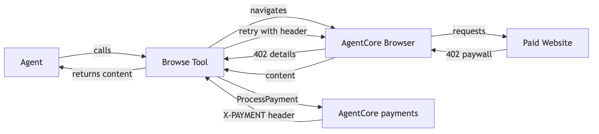
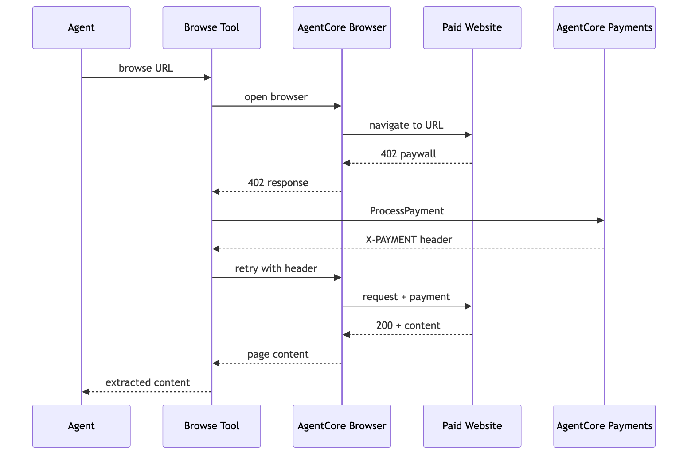

# Strands Agent with Browser Tool Accesses Paid Content

> **Pattern reference.** This notebook demonstrates the browser + payment architecture and code pattern. It is not runnable end-to-end without an x402-enabled content endpoint that returns HTTP 402 Payment Required. A future use case sample will provide a deployable dummy x402 paywall server that you can run locally or on AWS to test this flow end-to-end.

## Overview

In Tutorial 01, the `AgentCorePaymentsPlugin` handled x402 payments at the tool output level. That works for API endpoints where the plugin can intercept and retry. But for **browser-rendered content** (paywalled articles, content sites), the agent needs to detect the 402 inside the browser session, pay, and retry with proof headers — all within the same Playwright session.

This tutorial builds a custom `browse_with_payment` tool that uses:
- **AgentCore Browser** (`BrowserClient`) for managed cloud Chromium
- **Playwright** as the browser automation library (connects to AgentCore Browser via WebSocket)
- **AgentCore payments** (`PaymentManager.generate_payment_header()`) for x402 signing

### Why a custom tool instead of the plugin?

The `AgentCorePaymentsPlugin` from Tutorial 01 handles 402 at the tool output level — it intercepts the response, signs the payment, and retries the tool call externally. That works for API endpoints. But for browser-rendered content, the 402 happens inside the browser session and the retry must happen in the same session to preserve cookies, auth tokens, and DOM context. The plugin cannot do this — the tool must handle the payment flow internally.

### Architecture

```
Strands Agent
  └── browse_with_payment tool
        │
        ├── 1. BrowserClient.start() → managed cloud Chromium
        ├── 2. Playwright connects to AgentCore Browser (WebSocket)
        ├── 3. page.goto(url) → response interceptor detects 402
        ├── 4. Extract x402 requirements from response
        ├── 5. PaymentManager.generate_payment_header() → signed proof
        ├── 6. page.route() injects proof header
        ├── 7. page.goto(url) retries → 200 + content
        └── 8. Return content to agent
```

The payment logic lives inside the tool because the browser session must stay open for the retry. This is different from Tutorial 01 where the plugin handles retries externally.

> **Testnet only.** All code uses Base Sepolia or Solana Devnet with free USDC from [faucet.circle.com](https://faucet.circle.com/). Testnet USDC has no real-world value.

### Architecture



### Tutorial Details

| Information         | Details                                                                 |
|:--------------------|:------------------------------------------------------------------------|
| Tutorial type       | Task-based                                                              |
| Agent type          | Single                                                                  |
| Agentic Framework   | Strands Agents                                                          |
| LLM model           | Anthropic Claude Sonnet                                                 |
| Tutorial components | AgentCore Browser, Playwright, AgentCore payments, x402                 |
| Example complexity  | Intermediate                                                            |
| SDK used            | bedrock-agentcore SDK (BrowserClient + PaymentManager), Strands, Playwright |

## Prerequisites

* Tutorials 00 and 01 completed (`.env` exists)
* Wallet funded with testnet USDC from https://faucet.circle.com/
* `pip install -r requirements.txt`
* `python -m playwright install chromium`

This tutorial works with either wallet provider you configured in Tutorial 00 - Coinbase CDP or Stripe (Privy). Your AWS credentials need the IAM permissions created by Tutorial 00 (`setup_payment_roles()`).

```python
%pip install -r requirements.txt --quiet
!python -m playwright install chromium
```

## Step 1 — Load Config

```python
import sys
import os
import json

sys.path.append("..")

from dotenv import load_dotenv

load_dotenv(override=True)

from utils import load_tutorial_env, print_summary

config = load_tutorial_env()

PAYMENT_MANAGER_ARN = config["payment_manager_arn"]
REGION = config["region"]
USER_ID = config["user_id"]

if config.get("multi_provider"):
    PROVIDER = list(config["instruments"].keys())[0]
    INSTRUMENT_ID = config["instruments"][PROVIDER]["instrument_id"]
    CONNECTOR_ID = config["instruments"][PROVIDER]["connector_id"]
else:
    INSTRUMENT_ID = config["instrument_id"]
    CONNECTOR_ID = config["connector_id"]
    PROVIDER = config.get("provider_type", "unknown")

MODEL_ID = os.environ.get("MODEL_ID", "us.anthropic.claude-sonnet-4-6")

print_summary(
    "Config",
    payment_manager_arn=PAYMENT_MANAGER_ARN,
    provider=PROVIDER,
    instrument_id=INSTRUMENT_ID,
)
```

## Step 2 — Create a Payment Session

```python
from bedrock_agentcore.payments import PaymentManager

# SDK client wrapping the existing Payment Manager ARN from Tutorial 00.
manager = PaymentManager(payment_manager_arn=PAYMENT_MANAGER_ARN, region_name=REGION)

# Verify instrument is ACTIVE
instr = manager.get_payment_instrument(user_id=USER_ID, payment_instrument_id=INSTRUMENT_ID)
instr_status = instr.get("status", "UNKNOWN")
assert instr_status == "ACTIVE", f"Instrument is {instr_status} — fund and delegate in Tutorial 00/03 first"

# Create a fresh session for this task
session_resp = manager.create_payment_session(
    user_id=USER_ID,
    limits={"maxSpendAmount": {"value": "1.00", "currency": "USD"}},
    expiry_time_in_minutes=60,
)
SESSION_ID = session_resp["paymentSessionId"]
print(f"✅ Instrument {INSTRUMENT_ID} is {instr_status}")
print(f"✅ Session: {SESSION_ID} (budget: $1.00, expiry: 60 min)")
```

## Step 3 — Build the `browse_with_payment` Tool

This is the core of the tutorial. The `@tool` below is a custom tool because the payment flow must happen inside the browser session (the plugin cannot maintain browser state across retries). The tool:
1. Starts a managed browser session via AgentCore Browser (`BrowserClient`)
2. Connects Playwright to the managed browser via WebSocket
3. Navigates to the URL
4. If the response is 402, extracts x402 requirements
5. Calls `generate_payment_header()` to sign the payment
6. Injects the proof header and retries in the same session
7. Returns the content to the agent

```python
# PaymentManager already created in Step 2 — used inside the tool below
print("✅ PaymentManager ready (from Step 2)")
```

## Step 4 — Build the `browse_with_payment` Tool

This is the core of the tutorial. The `@tool` below is a custom tool because the payment flow must happen inside the browser session (the plugin cannot maintain browser state across retries). The tool:
1. Starts a managed browser session via AgentCore Browser (`BrowserClient`)
2. Connects Playwright to the managed browser via WebSocket
3. Navigates to the URL
4. If the response is 402, extracts x402 requirements
5. Calls `generate_payment_header()` to sign the payment
6. Injects the proof header and retries in the same session
7. Returns the content to the agent

### Payment Flow Sequence



```python
import asyncio
from playwright.async_api import async_playwright
from bedrock_agentcore.tools.browser_client import BrowserClient
from strands import tool


def extract_x402_requirements(headers, body):
    """Parse x402 payment requirements from a 402 response."""
    # Try to parse body as JSON (x402 v2 format)
    try:
        return json.loads(body)
    except (json.JSONDecodeError, TypeError):
        pass
    # Fall back to headers
    return {"headers": headers, "body": body}


def _format_result(status: int, content: str, paid: bool, url: str) -> str:
    """Render the tool result as a single text string for Strands."""
    header = f"URL: {url}\nHTTP status: {status}\nPaid: {paid}"
    return f"{header}\n\n{content[:5000]}"


@tool
def browse_with_payment(url: str) -> str:
    """Navigate to a URL using a managed cloud browser. If the endpoint returns
    402 Payment Required, automatically pay via AgentCore payments and retry.

    Uses AgentCore Browser (managed Chromium) + Playwright for navigation.
    Payment is signed via PaymentManager.generate_payment_header().

    Args:
        url: The URL to navigate to and retrieve content from.

    Returns:
        A text summary containing the URL, HTTP status, paid flag, and page content.
    """

    async def _browse():
        browser_client = BrowserClient(region=REGION)
        try:
            browser_client.start()
            ws_url, ws_headers = browser_client.generate_ws_headers()
            print("  🌐 Browser session started")

            async with async_playwright() as pw:
                browser = await pw.chromium.connect_over_cdp(
                    endpoint_url=ws_url,
                    headers=ws_headers,
                    timeout=30000,
                )
                context = browser.contexts[0] if browser.contexts else await browser.new_context()
                page = context.pages[0] if context.pages else await context.new_page()

                # First navigation
                response = await page.goto(url, wait_until="domcontentloaded", timeout=30000)
                status = response.status if response else 0
                print(f"  → HTTP {status}")

                # If 402: extract requirements, pay, retry
                if status == 402:
                    print("  💰 402 Payment Required — processing payment...")
                    body = await response.text()
                    resp_headers = await response.all_headers()

                    # Generate payment proof via AgentCore
                    payment_header = manager.generate_payment_header(
                        user_id=USER_ID,
                        payment_instrument_id=INSTRUMENT_ID,
                        payment_session_id=SESSION_ID,
                        payment_required_request={
                            "statusCode": 402,
                            "headers": resp_headers,
                            "body": body,
                        },
                    )
                    print("  ✅ Payment signed")

                    # Inject payment header only on the main navigation request,
                    # so sub-resources (images, CSS, beacons) don't leak X-PAYMENT.
                    async def add_payment_headers(route, request):
                        if request.is_navigation_request():
                            headers = {**request.headers, **payment_header}
                            await route.continue_(headers=headers)
                        else:
                            await route.continue_()

                    await page.route("**/*", add_payment_headers)
                    response = await page.goto(url, wait_until="domcontentloaded", timeout=30000)
                    status = response.status if response else 0
                    print(f"  → Retry: HTTP {status}")

                    if status == 200:
                        content = await page.inner_text("body")
                        await browser.close()
                        return _format_result(200, content, paid=True, url=url)
                    else:
                        await browser.close()
                        return _format_result(
                            status,
                            f"Payment retry failed with HTTP {status}",
                            paid=True,
                            url=url,
                        )

                # No payment needed
                content = await page.inner_text("body")
                await browser.close()
                return _format_result(status, content, paid=False, url=url)

        finally:
            browser_client.stop()
            print("  🌐 Browser session closed")

    return asyncio.run(_browse())


print("✅ browse_with_payment tool created")
print("   Uses: BrowserClient + Playwright + PaymentManager.generate_payment_header()")
```

## Step 5 — Create the Agent

The Strands agent gets the `browse_with_payment` tool. The agent decides when to browse — the tool handles the payment flow internally.

```python
from strands import Agent
from strands.models import BedrockModel

SYSTEM_PROMPT = """You are a content retrieval agent with browser access and payment capabilities.

Use the browse_with_payment tool to navigate to URLs and retrieve content.
If a page requires payment, the tool handles it automatically.
Summarize the content you retrieve.
Always report what you paid and what content you received."""

agent = Agent(
    model=BedrockModel(model_id=MODEL_ID, streaming=True),
    tools=[browse_with_payment],
    system_prompt=SYSTEM_PROMPT,
)

print("✅ Agent created with browse_with_payment tool")
```

## Step 6 — Agent Browses a Paid Endpoint

The agent navigates to an x402-enabled endpoint via the managed browser. The tool detects the 402, signs the payment, retries with the proof header, and returns the content.

```python
import time

TARGET_URL = "https://api.cdp.coinbase.com/platform/v2/x402/discovery/search?query=technology+trends&limit=3"

print(f"🌐 Target: {TARGET_URL}")
print("💰 Budget: $1.00 USD")
print("🖥️  Browser: AgentCore managed Chromium\n")

start = time.time()
result = agent(f"Browse to this URL and retrieve the content: {TARGET_URL}\nSummarize what you find.")
elapsed = time.time() - start

print(f"\n{'=' * 60}")
print(f"  Completed in {elapsed:.1f}s")
print(f"{'=' * 60}")
print(result.message)
```

## Step 7 — Verify Session Spend

```python
session_info = manager.get_payment_session(
    user_id=USER_ID,
    payment_session_id=SESSION_ID,
)
sess = session_info
print_summary(
    "Session Spend",
    session_id=SESSION_ID,
    available=sess.get("availableLimits", {}).get("availableSpendAmount", "N/A"),
    budget_limit=sess.get("limits", {}).get("maxSpendAmount", "N/A"),
)
```

## View Payment Traces

Every payment produces a trace. View them on the CloudWatch GenAI Observability Dashboard.

```python
print("🔍 View your agent traces: CloudWatch → GenAI Observability Dashboard")
print(f"  https://{REGION}.console.aws.amazon.com/cloudwatch/home?region={REGION}#gen-ai-observability/agent-core")
```

## Summary

You built a Strands agent with a custom browser tool that handles x402 payments:

1. **BrowserClient** — started a managed cloud Chromium session (AgentCore Browser)
2. **Playwright** — connected to AgentCore Browser via WebSocket, navigated to the x402 endpoint
3. **402 detected** — response interceptor caught the payment requirement
4. **Payment signed** — `PaymentManager.generate_payment_header()` created the proof
5. **Retry with proof** — `page.route()` injected the header, same browser session retried
6. **Content returned** — agent received and summarized the paid content

### Two payment patterns compared

| Pattern | Tool | Payment handling | Best for |
|---------|------|-----------------|----------|
| **Plugin (Tutorial 01)** | `http_request` | Plugin intercepts tool output, retries externally | API endpoints, MCP tools |
| **Browser (this tutorial)** | Custom `browse_with_payment` | Tool handles 402 internally, retries in same session | Browser-rendered content, paywalls |

Use the plugin pattern for API calls. Use the browser pattern when you need to maintain session state (cookies, auth tokens, DOM context) across the payment retry.

### Role separation for deployed agents

This notebook runs locally under your AWS credentials. When deployed, the runtime process runs under ProcessPaymentRole — the plugin calls `ProcessPayment` on behalf of the agent within the budget set by the app backend. The runtime cannot create sessions, modify limits, or provision wallets. The agent (LLM) never calls `ProcessPayment` directly. The app backend passes all payment context via the invocation payload. See Tutorial 02 for the full implementation.

To test role separation locally, pass an assumed-role session to the SDK client:

```python
from utils import assume_role
import boto3

# App backend (ManagementRole) creates the session
manager = PaymentManager(payment_manager_arn=ARN, region_name=REGION)
session = manager.create_payment_session(user_id=USER_ID, ...)

# Agent runs under ProcessPaymentRole — can only ProcessPayment
agent_session = assume_role(boto3.Session(), PROCESS_PAYMENT_ROLE_ARN, 'agent')
agent_manager = PaymentManager(
    payment_manager_arn=ARN, boto3_session=agent_session
)
# Pass agent_manager to generate_payment_header() — restricted credentials
```

## Cleanup

**Cost notice:** AgentCore Browser sessions and payment sessions may incur AWS charges based on usage. This tutorial uses testnet USDC (no real-world value) but AWS infrastructure is billable.

Browser sessions expire automatically after the configured timeout. Payment sessions expire after their configured `expiryTimeInMinutes`. No manual cleanup is needed for this tutorial.

# Congratulations!

You've built a browser agent that pays for web content using AgentCore Browser + AgentCore payments. Next: **Tutorial 06** — Research Agent with Payment Memory.
