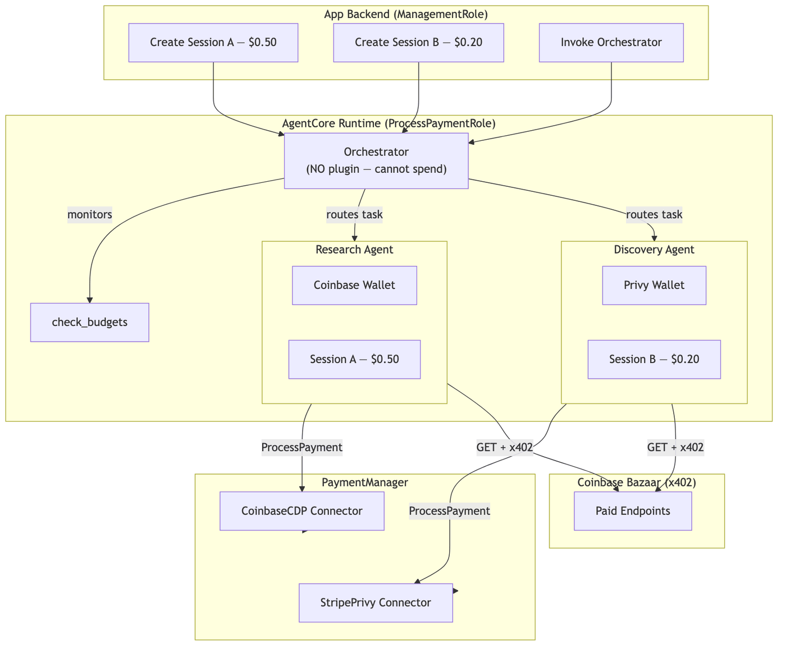
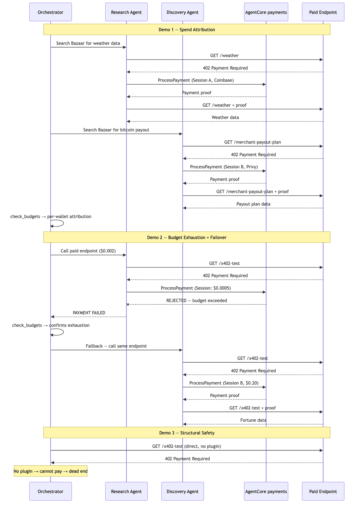

# Multi-Agent Payment Orchestrator

## Overview

This tutorial builds a multi-agent system with per-agent budgets, multi-wallet support, and full spend attribution — then demonstrates intelligent failover when a budget is exhausted.

### What this demonstrates

Three patterns that require orchestration — beyond parallel execution:

| Demo | Pattern | What it proves |
|------|---------|---------------|
| **Demo 1** | Spend Attribution | Two wallets, two budgets, full per-agent cost tracking |
| **Demo 2** | Budget Exhaustion + Failover | Orchestrator detects payment rejection, reroutes to healthy agent |
| **Demo 3** | Structural Safety | Orchestrator literally cannot spend — even with http_request |

### Key concepts

| Concept | How it works |
|---------|-------------|
| **Multi-wallet** | One PaymentManager, two connectors (Coinbase + Privy), two instruments |
| **Per-agent budgets** | Separate sessions with independent spend limits |
| **Orchestrator decoupling** | Orchestrator has NO plugin — cannot spend, only routes |
| **Budget exhaustion + failover** | When one agent's budget is rejected, orchestrator reroutes to the other |
| **Role enforcement** | ProcessPaymentRole on Runtime — deterministic code processes payments, agents cannot create sessions |

> **Testnet only.** All code uses Base Sepolia with free USDC from [faucet.circle.com](https://faucet.circle.com/). Testnet USDC has no real-world value.

### Architecture



### Payment Flow — Three Demos



### Tutorial Details

| Information         | Details                                                              |
|:--------------------|:---------------------------------------------------------------------|
| Tutorial type       | Task-based                                                           |
| Agent type          | Multi-agent (orchestrator + 2 specialists)                           |
| Agentic Framework   | Strands Agents (agents-as-tools pattern)                             |
| LLM model           | Anthropic Claude Sonnet                                              |
| Tutorial components | AgentCore payments (multi-session), AgentCore Runtime, AgentCore CLI |
| Example complexity  | Advanced                                                             |
| SDK used            | bedrock-agentcore SDK, Strands Agents SDK, AgentCore CLI             |

## Prerequisites

* Tutorial 00b completed (multi-provider `.env` with both Coinbase and Privy)
* Both wallets funded with testnet USDC from https://faucet.circle.com/
* AgentCore CLI: `npm install -g @aws/agentcore`
* Docker installed (for container build during deploy)
* `pip install -r requirements.txt`

```python
%pip install -r requirements.txt --quiet
```

## Step 1 — Verify AWS Credentials

```python
import os
import sys
import json

sys.path.append("..")

import boto3
from dotenv import load_dotenv

load_dotenv(override=True)

# Uncomment to use a named AWS profile:
# os.environ['AWS_PROFILE'] = '<your-profile>'

session = boto3.Session()
identity = session.client("sts").get_caller_identity()
print(f"✅ Authenticated as: {identity['Arn']}")
print(f"   Region: {session.region_name}")
```

## Step 2 — Load Multi-Provider Config

```python
from utils import load_tutorial_env, print_summary

config = load_tutorial_env()

if not config.get("multi_provider"):
    raise ValueError("This tutorial requires a multi-provider config. Run 00b_multi_provider_setup.ipynb first.")

PAYMENT_MANAGER_ARN = config["payment_manager_arn"]
REGION = config["region"]
USER_ID = config["user_id"]

COINBASE = config["instruments"]["coinbase"]
PRIVY = config["instruments"]["stripe_privy"]

MODEL_ID = os.environ.get("MODEL_ID", "us.anthropic.claude-sonnet-4-6")

print_summary(
    "Multi-Provider Config",
    manager_arn=PAYMENT_MANAGER_ARN,
    coinbase_instrument=COINBASE["instrument_id"],
    privy_instrument=PRIVY["instrument_id"],
)
```

## Step 3 — Verify Instruments and Create Per-Agent Sessions

The app backend (ManagementRole) verifies both instruments are ACTIVE and funded, then creates two sessions with independent budgets:
- Session A: $0.50 for the Research Agent (Coinbase wallet)
- Session B: $0.20 for the Discovery Agent (Privy wallet)

Total allocated: $0.70. The agents cannot interfere with each other's spend.

```python
from bedrock_agentcore.payments import PaymentManager

# SDK client wrapping the existing Payment Manager ARN from Tutorial 00b
manager = PaymentManager(payment_manager_arn=PAYMENT_MANAGER_ARN, region_name=REGION)

# Verify BOTH instruments are ACTIVE and funded before proceeding
for label, instr_id in [
    ("Coinbase", COINBASE["instrument_id"]),
    ("Privy", PRIVY["instrument_id"]),
]:
    instr = manager.get_payment_instrument(user_id=USER_ID, payment_instrument_id=instr_id)
    status = instr.get("status", "UNKNOWN")
    assert status == "ACTIVE", f"{label} instrument {instr_id} is {status} — fund and delegate first"
    print(f"✅ {label} instrument {instr_id} is {status}")

# Session A: Research Agent — larger budget, Coinbase wallet
sess_a = manager.create_payment_session(
    user_id=USER_ID,
    limits={"maxSpendAmount": {"value": "0.50", "currency": "USD"}},
    expiry_time_in_minutes=60,
)
SESSION_A_ID = sess_a["paymentSessionId"]

# Session B: Discovery Agent — smaller budget, Privy wallet
sess_b = manager.create_payment_session(
    user_id=USER_ID,
    limits={"maxSpendAmount": {"value": "0.20", "currency": "USD"}},
    expiry_time_in_minutes=60,
)
SESSION_B_ID = sess_b["paymentSessionId"]

print_summary(
    "Per-Agent Sessions",
    session_a=f"{SESSION_A_ID} ($0.50, Coinbase)",
    session_b=f"{SESSION_B_ID} ($0.20, Privy)",
    total_allocated="$0.70",
)
```

---

# Part A: Local Execution

Run the multi-agent system locally first. Fast feedback, learn the concepts.

## Step 4 — Create Plugins and Agents

```python
from strands import Agent
from strands.models import BedrockModel
from strands.tools import tool
from strands_tools import http_request
from bedrock_agentcore.payments.integrations.strands import (
    AgentCorePaymentsPlugin,
    AgentCorePaymentsPluginConfig,
)

# --- Plugins (one per agent, different session + instrument) ---

research_plugin = AgentCorePaymentsPlugin(
    config=AgentCorePaymentsPluginConfig(
        payment_manager_arn=PAYMENT_MANAGER_ARN,
        user_id=USER_ID,
        payment_instrument_id=COINBASE["instrument_id"],
        payment_session_id=SESSION_A_ID,
        region=REGION,
        network_preferences_config=["eip155:84532", "base-sepolia"],
    )
)

discovery_plugin = AgentCorePaymentsPlugin(
    config=AgentCorePaymentsPluginConfig(
        payment_manager_arn=PAYMENT_MANAGER_ARN,
        user_id=USER_ID,
        payment_instrument_id=PRIVY["instrument_id"],
        payment_session_id=SESSION_B_ID,
        region=REGION,
        network_preferences_config=["eip155:84532", "base-sepolia"],
    )
)

# --- Budget check tool (orchestrator only) ---


@tool
def check_budgets() -> str:
    """Check remaining budget for each specialist agent.

    Returns:
        JSON with per-agent spend and remaining budget.
    """
    results = {}
    for label, sid in [
        ("research_agent", SESSION_A_ID),
        ("discovery_agent", SESSION_B_ID),
    ]:
        info = manager.get_payment_session(
            user_id=USER_ID,
            payment_session_id=sid,
        )
        sess = info
        results[label] = {
            "session_id": sid,
            "available": sess.get("availableLimits", {}).get("availableSpendAmount", "N/A"),
            "budget": sess.get("limits", {}).get("maxSpendAmount", "N/A"),
        }
    return json.dumps(results, indent=2)


# --- Specialist agents ---

model = BedrockModel(model_id=MODEL_ID, streaming=True)

research_agent = Agent(
    model=model,
    tools=[http_request],
    plugins=[research_plugin],
    system_prompt=(
        "You are a research specialist. Use http_request to access paid endpoints "
        "on the Coinbase Bazaar (Base Sepolia testnet). "
        "IMPORTANT: Only use GET requests. Never use POST, PUT, or DELETE. "
        'When you discover endpoints from the Bazaar, look for the URL in the "resource" field of the response. '
        "Payment is handled automatically via x402. "
        "Report what data you found and what it cost."
    ),
)

discovery_agent = Agent(
    model=model,
    tools=[http_request],
    plugins=[discovery_plugin],
    system_prompt=(
        "You are a data discovery specialist. Use http_request to access paid "
        "endpoints on the Coinbase Bazaar (Base Sepolia testnet). "
        "IMPORTANT: Only use GET requests. Never use POST, PUT, or DELETE. "
        'When you discover endpoints from the Bazaar, look for the URL in the "resource" field of the response. '
        "Payment is handled automatically via x402. Report what you found and the cost."
    ),
)

# --- Orchestrator (NO plugin) ---

orchestrator = Agent(
    model=model,
    tools=[
        research_agent.as_tool(
            name="research_agent",
            description="Research specialist with Coinbase wallet and $0.50 budget. Use for paid data lookups.",
        ),
        discovery_agent.as_tool(
            name="discovery_agent",
            description="Discovery specialist with Privy wallet and $0.20 budget. Use for cheap paid endpoints.",
        ),
        check_budgets,
    ],
    system_prompt=(
        "You are an orchestrator that coordinates specialist agents.\n"
        "- research_agent: paid data lookups (budget: $0.50, Coinbase wallet)\n"
        "- discovery_agent: cheap paid endpoints (budget: $0.20, Privy wallet)\n"
        "- check_budgets: monitor spend across both agents\n\n"
        "You cannot make payments yourself. Only the specialists can spend.\n"
        "If one agent's budget is exhausted, route remaining work to the other.\n"
        "After tasks complete, check budgets and report total spend."
    ),
)

print("\u2705 Research Agent: Session A + Coinbase + $0.50 budget")
print("\u2705 Discovery Agent: Session B + Privy + $0.20 budget")
print("\u2705 Orchestrator: NO plugin (cannot spend)")
```

---

## Step 5 — Run Three Multi-Agent Demos

Each demo shows a distinct capability that requires orchestration — beyond parallel execution. A spend report follows each execution to prove exactly what happened.

| Demo | Pattern | What to watch for |
|------|---------|-------------------|
| 1 | **Spend Attribution** | Both wallets deducted independently, full per-agent tracking |
| 2 | **Budget Exhaustion + Failover** | Research agent rejected → orchestrator reroutes → discovery agent succeeds |
| 3 | **Structural Safety** | Orchestrator gets 402, cannot pay — spend report unchanged |

## Demo 1 — Spend Attribution

Both agents call different paid endpoints. After the run, we check exactly which wallet paid for what. This is the baseline: two wallets, two budgets, full attribution.

- Research Agent (Coinbase, $0.50) → searches Bazaar for `weather`, calls the endpoint
- Discovery Agent (Privy, $0.20) → searches Bazaar for `market news`, calls the endpoint

```python
result = orchestrator(
    "I need two things:\n"
    "1. Ask the research_agent to search the Bazaar for weather endpoints on Base Sepolia "
    "(GET https://api.cdp.coinbase.com/platform/v2/x402/discovery/search?query=weather&network=base-sepolia&limit=3). "
    'From the results, find the endpoint URL in the "resource" field and call it with http_request using GET. '
    "Report the weather data and cost.\n"
    "2. Ask the discovery_agent to search the Bazaar for market+news endpoints on Base Sepolia "
    "(GET https://api.cdp.coinbase.com/platform/v2/x402/discovery/search?query=market+news&network=base-sepolia&limit=3). "
    'From the results, find the endpoint URL in the "resource" field and call it with http_request using GET '
    "(include query params: batchSize=24, targetBlocks=3, urgency=balanced). "
    "Report the payout plan data and cost.\n\n"
    "After both tasks complete, check the budgets and give me a spend report showing what each agent spent from their respective wallets."
)
print(result.message)
```

### 📊 Spend Report — Demo 1

Each session tracks spend independently. Compare the `available` vs `budget` fields — the difference is what each agent spent from their respective wallet.

```python
for label, sid, wallet_provider in [
    ("Research Agent (Coinbase)", SESSION_A_ID, "Coinbase"),
    ("Discovery Agent (Privy)", SESSION_B_ID, "Privy"),
]:
    info = manager.get_payment_session(
        user_id=USER_ID,
        payment_session_id=sid,
    )
    sess = info
    print_summary(
        label,
        session_id=sid,
        wallet=wallet_provider,
        available=sess.get("availableLimits", {}).get("availableSpendAmount", "N/A"),
        budget=sess.get("limits", {}).get("maxSpendAmount", "N/A"),
    )
```

## Demo 2 — Budget Exhaustion and Failover

This is the multi-agent payoff. We give the research agent a budget **too small** to cover any paid call. The orchestrator must:

1. Route the task to research_agent first
2. Observe the payment failure (budget exceeded — rejected by AgentCore at the API level)
3. Call `check_budgets` to confirm
4. Reroute to discovery_agent (still has budget)
5. Report what happened

This is not something two independent agents can do. The orchestrator observes, adapts, and recovers.

```python
# Create a tiny session — $0.0005, not enough for any paid x402 call
tiny_sess = manager.create_payment_session(
    user_id=USER_ID,
    limits={"maxSpendAmount": {"value": "0.0005", "currency": "USD"}},
    expiry_time_in_minutes=60,
)
TINY_SESSION_ID = tiny_sess["paymentSessionId"]
print(f"Tiny research session: {TINY_SESSION_ID} (budget: $0.0005)")
print(f"Discovery session: {SESSION_B_ID} (budget: $0.20)")

# Rebuild research plugin with the tiny session
tiny_research_plugin = AgentCorePaymentsPlugin(
    config=AgentCorePaymentsPluginConfig(
        payment_manager_arn=PAYMENT_MANAGER_ARN,
        user_id=USER_ID,
        payment_instrument_id=COINBASE["instrument_id"],
        payment_session_id=TINY_SESSION_ID,
        region=REGION,
        network_preferences_config=["eip155:84532", "base-sepolia"],
    )
)

tiny_research_agent = Agent(
    model=model,
    tools=[http_request],
    plugins=[tiny_research_plugin],
    system_prompt=(
        "You are a research specialist. Use http_request to access paid endpoints "
        "on the Coinbase Bazaar (Base Sepolia testnet). "
        "IMPORTANT: Only use GET requests. Never use POST, PUT, or DELETE. "
        "Payment is handled automatically via x402. "
        "Report what data you found and what it cost. If payment fails, report the failure clearly."
    ),
)


# Wrap research agent with error handling so budget failures don't crash the orchestrator
@tool
def research_agent_tool(task: str) -> str:
    """Research specialist with VERY SMALL budget ($0.0005, Coinbase wallet). Likely to fail on paid calls due to budget exhaustion."""
    try:
        result = tiny_research_agent(task)
        return result.message.get("content", [{}])[0].get("text", str(result))
    except Exception as e:
        return f"PAYMENT FAILED — budget exhausted. Error: {str(e)}"


@tool
def check_budgets_v2() -> str:
    """Check remaining budget for the research and discovery agents. Use this after a payment failure to confirm budget exhaustion."""
    results = {}
    for label, sid in [
        ("research_agent", TINY_SESSION_ID),
        ("discovery_agent", SESSION_B_ID),
    ]:
        info = manager.get_payment_session(user_id=USER_ID, payment_session_id=sid)
        results[label] = {
            "session_id": sid,
            "available": info.get("availableLimits", {}).get("availableSpendAmount", "N/A"),
            "budget": info.get("limits", {}).get("maxSpendAmount", "N/A"),
        }
    return json.dumps(results, indent=2)


failover_orchestrator = Agent(
    model=model,
    tools=[
        research_agent_tool,
        discovery_agent.as_tool(
            name="discovery_agent",
            description="Discovery specialist with healthy budget ($0.20) and Privy wallet. Use as fallback when research_agent fails.",
        ),
        check_budgets_v2,
    ],
    system_prompt=(
        "You are an orchestrator that coordinates specialist agents.\n"
        "- research_agent_tool: research specialist, budget $0.0005 (extremely tight!, Coinbase wallet)\n"
        "- discovery_agent: budget $0.20 (healthy, Privy wallet)\n"
        "- check_budgets_v2: monitor spend across both agents\n\n"
        "You cannot make payments yourself. Only the specialists can spend.\n"
        "IMPORTANT: If research_agent_tool fails due to budget exhaustion, call check_budgets_v2 to confirm, "
        "then route the work to discovery_agent as a fallback.\n"
        "Report what happened — which agent succeeded, which failed, and why."
    ),
)

print("\n✅ Failover orchestrator ready")
print("   research_agent_tool: $0.0005 budget (will be rejected)")
print("   discovery_agent: $0.20 budget (healthy fallback)")
print("   check_budgets_v2: monitors both sessions")
```

```python
result = failover_orchestrator(
    "I need a fortune reading. "
    "Use research_agent_tool to call GET https://x402-test.genesisblock.ai/api/market-news — "
    "this is a paid x402 endpoint ($0.002).\n\n"
    "If research_agent_tool fails (budget exceeded), call check_budgets_v2 to confirm, "
    "then ask the discovery_agent to call the same endpoint instead.\n"
    "Report which agent completed the task and why the other failed."
)
print(result.message)
```

### 📊 Spend Report — Demo 2

AgentCore rejected the research agent's payment at the API level — the $0.0005 session budget cannot cover the $0.002 call. The orchestrator detected the failure and rerouted to the discovery agent.

Expected: Research Agent budget unchanged (payment rejected), Discovery Agent budget decreased (payment succeeded).

```python
for label, sid, wallet_provider in [
    ("Research Agent — EXHAUSTED (Coinbase)", TINY_SESSION_ID, "Coinbase"),
    ("Discovery Agent — FALLBACK (Privy)", SESSION_B_ID, "Privy"),
]:
    info = manager.get_payment_session(user_id=USER_ID, payment_session_id=sid)
    sess = info
    print_summary(
        label,
        session_id=sid,
        wallet=wallet_provider,
        available=sess.get("availableLimits", {}).get("availableSpendAmount", "N/A"),
        budget=sess.get("limits", {}).get("maxSpendAmount", "N/A"),
    )
```

## Demo 3 — Structural Safety (Orchestrator Cannot Spend)

The orchestrator has **no payment plugin**. Even if the LLM decides to call a paid endpoint directly, the x402 payment flow cannot run — there is no plugin to intercept the 402 and sign a transaction.

This is structural enforcement, not prompt-level. The orchestrator's role is to **route**, not to **pay**.

```python
# Give the orchestrator http_request directly — can it spend?
from strands_tools import http_request as http_tool

unsafe_orchestrator = Agent(
    model=model,
    tools=[http_tool],  # Has http_request but NO payment plugin
    system_prompt=(
        "You have http_request available. Try to access this paid endpoint: "
        "GET https://x402-test.genesisblock.ai/api/weather"
        "Report exactly what happens."
    ),
)

result = unsafe_orchestrator(
    "Call GET https://x402-test.genesisblock.ai/api/weather and tell me what you get back. "
    "This is a paid x402 endpoint. Report the HTTP status and response."
)
print(result.message)
```

### 📊 Spend Report — Demo 3

The orchestrator received a **402 Payment Required** response — the endpoint demands payment. But without a payment plugin, there is nothing to:
1. Parse the x402 payment requirement from the response
2. Call `ProcessPayment` to sign a transaction
3. Retry with the payment proof header

The 402 is a dead end. The spend report below confirms: **no budget was consumed**.

| Agent | Has Plugin | Can Spend |
|-------|-----------|-----------|
| Orchestrator | ❌ No | ❌ Cannot pay, even with http_request |
| Research Agent | ✅ Yes (Coinbase) | ✅ Within session budget |
| Discovery Agent | ✅ Yes (Privy) | ✅ Within session budget |

```python
# Confirm: no spend occurred — orchestrator has no plugin, cannot pay
for label, sid, wallet_provider in [
    ("Research Agent (Coinbase)", SESSION_A_ID, "Coinbase"),
    ("Discovery Agent (Privy)", SESSION_B_ID, "Privy"),
]:
    info = manager.get_payment_session(user_id=USER_ID, payment_session_id=sid)
    sess = info
    print_summary(
        f"{label} — NO CHANGE",
        session_id=sid,
        wallet=wallet_provider,
        available=sess.get("availableLimits", {}).get("availableSpendAmount", "N/A"),
        budget=sess.get("limits", {}).get("maxSpendAmount", "N/A"),
    )

print("↑ Budgets unchanged — the orchestrator's 402 attempt spent nothing.")
```

---

# Part B: Deploy to AgentCore Runtime

Same multi-agent system, now deployed with ProcessPaymentRole enforcement and AgentCore Observability.

## Step 7 — Review the Agent Code

The `payment_orchestrator.py` file packages all three agents into a single `BedrockAgentCoreApp`. The entrypoint receives both session IDs and both instrument IDs from the app backend via the invocation payload.

```python
with open("payment_orchestrator.py") as f:
    print(f.read())
```

## Step 8 — Deploy with AgentCore CLI

> **Cost notice:** AgentCore Runtime and online evaluations incur charges per invocation. See Cleanup section when finished.

```bash
# Create the project (if not already done)
agentcore create --name PaymentOrchestrator --defaults

# Add the agent
agentcore add agent \
  --name PaymentOrchestrator \
  --type byo \
  --code-location . \
  --entrypoint payment_orchestrator.py

# Deploy (observability is enabled automatically)
agentcore deploy -y

# Verify deployment and observability
agentcore status
```

Two layers of observability are now active:

| Layer | What it captures | Set up by |
|-------|-----------------|----------|
| **Agent observability** | LLM calls, tool executions, agent traces | `agentcore deploy` (automatic) |
| **Payment observability** | ProcessPayment traces, budget deductions, vended logs | `enable_observability()` in Tutorial 00 |

Both feed into AgentCore Observability (CloudWatch). The service map shows the full flow: Orchestrator → Specialist → AgentCore payments.

The runtime runs under **ProcessPaymentRole** — it can call `ProcessPayment` for both instruments (same manager) but cannot create sessions or modify budgets.

### Environment variables to set

```bash
PAYMENT_MANAGER_ARN=<your-manager-arn>
AWS_REGION=us-west-2
MODEL_ID=us.anthropic.claude-sonnet-4-6
```

## Step 8b — Add Online Evaluation

AgentCore Evaluations provides built-in evaluators that score every invocation automatically. For a payment orchestrator, the most relevant are:

| Evaluator | Level | What it checks |
|-----------|-------|---------------|
| `Builtin.GoalSuccessRate` | Session | Did the orchestrator complete both research and discovery tasks? |
| `Builtin.ToolSelectionAccuracy` | Tool | Did it route to the right specialist for each task? |
| `Builtin.Helpfulness` | Trace | Was the spend report clear and useful? |

```bash
# Add online eval with built-in evaluators — evaluate 100% of invocations
agentcore add online-eval \
  --name PaymentMonitor \
  --runtime PaymentOrchestrator \
  --evaluator Builtin.GoalSuccessRate Builtin.ToolSelectionAccuracy Builtin.Helpfulness \
  --sampling-rate 100 \
  --enable-on-create

# Deploy
agentcore deploy -y
```

After deployment, scores appear in the AgentCore Observability dashboard in CloudWatch. View results:

```bash
# View eval history
agentcore evals history --runtime PaymentOrchestrator --limit 5

# Stream eval logs
agentcore logs evals --runtime PaymentOrchestrator --since 1h
```

No custom evaluator code needed. The built-in evaluators handle scoring, and results feed into the same CloudWatch dashboard as your payment traces.

## Step 9 — Invoke from App Backend

The app backend creates fresh sessions and invokes the deployed orchestrator with both session IDs and instrument IDs.

```python
# The invocation payload the app backend sends to the deployed orchestrator
invocation_payload = {
    "prompt": (
        "Search the Bazaar for weather endpoints on Base Sepolia "
        "(GET https://api.cdp.coinbase.com/platform/v2/x402/discovery/search?query=weather&network=base-sepolia&limit=3) "
        'and ask the research_agent to call the endpoint from the "resource" field. '
        "Then search for market news endpoints "
        "(GET https://api.cdp.coinbase.com/platform/v2/x402/discovery/search?query=market+news&network=base-sepolia&limit=3) "
        "and ask the discovery_agent to call that endpoint with batchSize=24&targetBlocks=3&urgency=balanced. "
        "Check budgets after and report total spend per agent."
    ),
    "user_id": USER_ID,
    "research_session_id": SESSION_A_ID,
    "research_instrument_id": COINBASE["instrument_id"],
    "discovery_session_id": SESSION_B_ID,
    "discovery_instrument_id": PRIVY["instrument_id"],
}

print("Invocation payload:")
print(json.dumps(invocation_payload, indent=2))
print("\nInvoke with:")
print(f"  agentcore invoke '{json.dumps(invocation_payload)}'")
```

## Step 10 — View Traces in CloudWatch

With observability enabled, every `ProcessPayment` call from both agents produces a trace. In CloudWatch X-Ray you can see:

- **Two separate payment flows** — Research Agent traces (Session A, Coinbase) and Discovery Agent traces (Session B, Privy)
- **Budget deduction** — the three-phase flow (reserve → sign → commit) for each payment
- **Budget exhaustion** — if the research agent hits its $0.50 limit, the failed ProcessPayment trace shows the budget exceeded error
- **Failover** — the discovery agent's successful payment right after the research agent's failure

The vended logs show per-session spend progression — you can watch the $0.50 budget drain on Session A while Session B stays healthy.

```bash
# List recent traces
agentcore traces list --limit 20

# Stream logs
agentcore logs
```

```python
print("CloudWatch X-Ray:")
print(f"  https://{REGION}.console.aws.amazon.com/cloudwatch/home?region={REGION}#xray:traces")
print("\nVended logs:")
print(f"  https://{REGION}.console.aws.amazon.com/cloudwatch/home?region={REGION}#logsV2:log-groups")
print("\nGenAI Dashboard:")
print(f"  https://{REGION}.console.aws.amazon.com/cloudwatch/home?region={REGION}#gen-ai-observability/agent-core")
```

## Summary

You built a multi-agent payment system with full budget governance and deployed it to AgentCore Runtime.

### Three orchestration patterns demonstrated

| Demo | What happened | Why it matters |
|------|--------------|----------------|
| **Spend Attribution** | Two agents spent from separate wallets; per-session tracking shows exactly who paid what | Full cost allocation without shared state |
| **Budget Exhaustion + Failover** | Research agent's payment was rejected (budget too small); orchestrator rerouted to discovery agent | Adaptive behavior that independent agents cannot achieve |
| **Structural Safety** | Orchestrator called a paid endpoint directly — got 402 with no way to pay | Architecture enforces spending rules, not prompts |

### Who does what

| Who | Does What | Role |
|-----|----------|------|
| App backend | Creates sessions, allocates budgets, invokes orchestrator | ManagementRole |
| Orchestrator | Routes tasks, monitors budgets | NONE (no plugin) |
| Research Agent | Calls paid endpoints, spends from Session A | ProcessPaymentRole (Coinbase) |
| Discovery Agent | Calls paid endpoints, spends from Session B | ProcessPaymentRole (Privy) |
| CloudWatch | Traces every payment, shows budget progression | Automatic |
| Online eval | Scores each session on budget compliance and routing quality | Built-in evaluators |

### The resource hierarchy

```
PaymentManager
  ├── CoinbaseCDP Connector → Research Agent (Session A, $0.50)
  └── StripePrivy Connector → Discovery Agent (Session B, $0.20)
```

Same manager. Different connectors. Different wallets. Independent budgets. Full attribution in CloudWatch.

## Verification

If the cells above ran without errors, the multi-agent payment orchestrator is deployed. You should see spend reports printed for all three demos above, with each agent's session showing a reduced `availableLimit` — confirming per-agent budget enforcement is working correctly.

## Cleanup (optional)

> **Before cleanup:** Running `agentcore remove all` permanently deletes the deployment, CloudWatch logs, and evaluation results. Export any data you want to keep first.

Sessions expire automatically after their `expiryTimeInMinutes`.

**If you plan to rerun this tutorial, do NOT clean up.** The payment resources are reused.

Only run cleanup when you are done with all tutorials:

```bash
# Remove the deployed orchestrator
# agentcore remove all -y

# Payment resources (Manager, Connectors, Instruments): run cleanup in Tutorial 00b
```

# Congratulations!

You've built a multi-agent payment orchestrator with per-agent payment limits, multi-wallet support, role enforcement on Runtime, and full spend attribution.

### Next steps

- **Custom payment evaluator** — Create an LLM-as-a-Judge evaluator with `agentcore add evaluator` that scores sessions on budget compliance, spend transparency, and routing quality
- **CloudWatch alarms** — Set alarms on payment failure rates and eval score drops to get alerted when agent spending behavior degrades
- **On-demand evaluation** — Run `agentcore run eval` against historical traces to benchmark changes before deploying new prompt versions
- **Per-tenant budgets** — Extend the multi-session pattern to isolate budgets per customer or department, with full attribution in CloudWatch
- **Scale with AgentCore Gateway** — To further scale this, reuse the Gateway target from Tutorial 04 with AgentCore Runtime and payments. Route both agents through a single Gateway endpoint instead of calling Bazaar directly — the payment infrastructure stays the same

---

## Optional: Route Agents Through AgentCore Gateway

If you completed Tutorial 04 and have a Gateway with the Coinbase Bazaar target, you can swap `http_request` for MCP tools. The agents get `search_resources` and `proxy_tool_call` instead of raw HTTP URLs — closer to how you'd build this at scale.

The payment infrastructure stays the same. Only the tool layer changes.

```python
from datetime import timedelta
from mcp.client.streamable_http import streamablehttp_client
from strands.tools.mcp.mcp_client import MCPClient

GATEWAY_URL = os.environ['GATEWAY_URL']  # From Tutorial 04

# Connect to Gateway (same Bazaar target for both agents)
mcp_client = MCPClient(lambda: streamablehttp_client(
    GATEWAY_URL, timeout=timedelta(seconds=120),
))
mcp_client.__enter__()
bazaar_tools = mcp_client.list_tools_sync()

# Replace http_request with MCP tools — everything else stays the same
research_agent = Agent(
    model=model,
    tools=bazaar_tools,          # MCP tools instead of http_request
    plugins=[research_plugin],   # Same plugin, same session, same wallet
    system_prompt='You are a research specialist. Use search_resources to find '
        'paid data tools on Base Sepolia, then call them with proxy_tool_call.',
)

discovery_agent = Agent(
    model=model,
    tools=bazaar_tools,          # Same MCP tools, different plugin/budget
    plugins=[discovery_plugin],  # Different session, different wallet
    system_prompt='You are a discovery specialist. Use search_resources to find '
        'the cheapest tools under $0.10 on Base Sepolia.',
)

# Orchestrator unchanged — still uses agent.as_tool()
# mcp_client.__exit__(None, None, None)  # Close when done
```

Both agents share the same Gateway connection but have separate payment plugins with independent budgets and wallets. The Gateway routes to Bazaar, the agents discover tools via MCP, and the payment plugin handles 402s — same flow as Tutorial 04, now with multi-agent orchestration on top.
