# Pay-For-API

## Overview

**Amazon Bedrock AgentCore Payments** enables AI agents to make autonomous payments
for digital services — without ever holding private keys or requiring human approval
for each transaction.

In this use case this use case builds a Strands agent that buys metered access to a paid HTTP
API through AgentCore Payments. The seller is a minimal "Fun Facts" service deployed
via AWS CDK: an Amazon API Gateway HTTP API backed by an AWS Lambda function that charges **$0.01** per
call. When the agent requests a fact, the seller returns an HTTP 402 response (the [x402 protocol](https://x402.org), an open spec that revives the reserved 402 status code for machine-to-machine micropayments) with
a payment requirement. The agent forwards that requirement to AgentCore Payments'
`ProcessPayment` operation, receives a signed proof, retries the request with the
proof attached, and returns the paid fact — all without the agent ever touching a
private key.

Internally, AgentCore Payments manages the wallet, the signing keys, and the
on-chain settlement for you. Whether your `PaymentManager` is wired to **Coinbase
CDP** or **Stripe via Privy**, the code the agent runs is identical — the service
picks the right signer from the connector tied to your instrument.

### Use Case Details

| Information         | Details                                                               |
|:--------------------|:----------------------------------------------------------------------|
| Use case type       | Agentic HTTP API consumption with autonomous micropayment             |
| AgentCore components| Amazon Bedrock AgentCore Payments                                     |
| Wallet providers    | Coinbase CDP ✅   ·   Stripe via Privy ✅                             |
| Payment protocol    | x402 (HTTP 402 Payment Required) on the wire                          |
| Agent type          | Single                                                                |
| Agentic Framework   | Strands Agents                                                        |
| LLM model           | Anthropic Claude Sonnet 4.5 (Amazon Bedrock, `us.` inference profile)        |
| Complexity          | Intermediate                                                          |
| SDK used            | boto3                                                                 |

### Architecture

Three roles participate in every paid request:

1. **Strands agent** — calls `http_request`; the AgentCorePaymentsPlugin handles 402 → ProcessPayment → retry
2. **Amazon Bedrock AgentCore Payments** — receives `ProcessPayment` and returns a
   signed proof using the wallet tied to your instrument (Coinbase CDP or Privy)
3. **Seller (CDK stack)** — Lambda behind API Gateway that issues the 402 challenge,
   verifies the proof, and serves the content

<div style="text-align:left">
    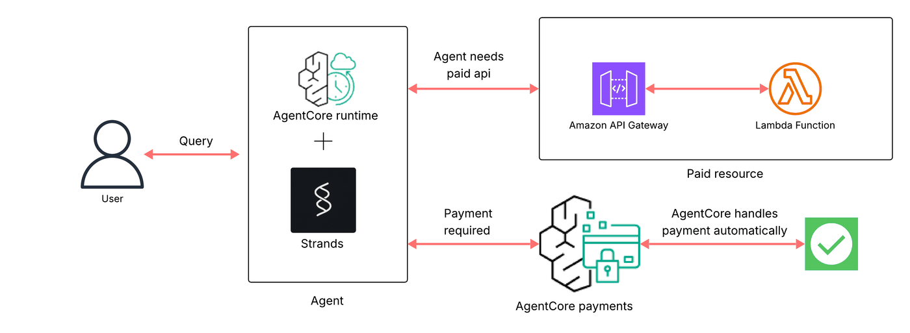
</div>

**Numbered flow (matches the diagram)**

1. **User** sends a query to the **Agent** (AgentCore Runtime + Strands).
2. The agent calls the paid API hosted on **Amazon API Gateway** → **AWS Lambda**.
3. The seller responds with **HTTP 402 Payment Required** and a payment requirement payload.
4. The agent forwards the requirement to **AgentCore Payments**, which selects the
   matching `PaymentInstrument`, checks the session budget, and signs the payment
   through the configured wallet provider (Coinbase CDP or Stripe via Privy).
5. The agent retries the request with the signed `X-PAYMENT` header. The seller
   verifies, settles on-chain through the x402 facilitator, and returns **200 OK** with the content.
6. The agent answers the user. The operator audits spend through `GetPaymentSession`.

### Use Case Key Features

* By design, the agent does not hold private keys. AgentCore Payments signs every charge via the
  configured `PaymentManager` and `PaymentConnector`
* Wallet-provider-agnostic — the exact same agent code runs against a Coinbase CDP
  instrument or a Stripe-via-Privy instrument
* Human-controlled budget via `maxSpendAmount` on the payment session
* IAM role separation: `ManagementRole` creates sessions, `ProcessPaymentRole` signs
  payments (explicit `Deny` in both directions — enforced, not documented)
* Full audit trail via `GetPaymentSession` — the operator sees exactly what the
  agent spent

### API Reference

The AgentCore Payments APIs used in this use case are described in the service's
OpenAPI specs (bundled with the repo for convenience):

| # | API | Plane | Purpose |
|---|-----|-------|---------|
| 1 | `CreatePaymentCredentialProvider` | Control | Store your wallet provider credentials securely |
| 2 | `CreatePaymentManager` | Control | Top-level payment processing resource |
| 3 | `CreatePaymentConnector` | Control | Bind a Credential Provider to a Manager |
| 4 | `CreatePaymentInstrument` | Data | Provision an embedded wallet under a Manager for a user |
| 5 | `GetPaymentInstrument` | Data | Read the service-assigned vendor `userId` back (§7) |
| 6 | `CreatePaymentSession` | Data | Create a budget-limited session scoped to the instrument |
| 7 | `ProcessPayment`       | Data | Generate a cryptographic proof for a single x402 charge |
| 8 | `GetPaymentSession`    | Data | Read session state + `availableLimits.availableSpendAmount` |
| 9 | `GetPaymentInstrumentBalance` | Data | On-chain USDC balance for the instrument's wallet |
| 10 | `ListPaymentInstruments` | Data | All instruments under a manager (filter by user) |
| 11 | `ListPaymentSessions`  | Data | All sessions under a manager (filter by user) |
| 12 | `DeletePaymentSession` | Data | Hard-delete a session — the revoke path |
| 13 | `DeletePaymentInstrument` | Data | Soft-delete an instrument (status flips to `DELETED`) |

The boto3 service references for `bedrock-agentcore-control` (CP) and
`bedrock-agentcore` (DP) have the full operation list and response
shapes.

For conceptual background and the full AgentCore Payments API surface,
see the public documentation:

- [AgentCore Payments overview](https://docs.aws.amazon.com/bedrock-agentcore/latest/devguide/payments.html)
- [How it works](https://docs.aws.amazon.com/bedrock-agentcore/latest/devguide/payments-how-it-works.html)
- [Core concepts](https://docs.aws.amazon.com/bedrock-agentcore/latest/devguide/payments-concepts.html)
- [Prerequisites](https://docs.aws.amazon.com/bedrock-agentcore/latest/devguide/payments-prerequisites.html)
- [IAM roles](https://docs.aws.amazon.com/bedrock-agentcore/latest/devguide/payments-iam-roles.html)
- [Set up a credential provider](https://docs.aws.amazon.com/bedrock-agentcore/latest/devguide/payments-setup-credential-provider.html)
- [Create a payment manager](https://docs.aws.amazon.com/bedrock-agentcore/latest/devguide/payments-create-manager.html)
- [Create a payment instrument](https://docs.aws.amazon.com/bedrock-agentcore/latest/devguide/payments-create-instrument.html)
- [Create a payment session](https://docs.aws.amazon.com/bedrock-agentcore/latest/devguide/payments-create-session.html)
- [Process a payment](https://docs.aws.amazon.com/bedrock-agentcore/latest/devguide/payments-process-payment.html) — plugin reference, network preferences, interrupt contract
- [Connect to Bazaar](https://docs.aws.amazon.com/bedrock-agentcore/latest/devguide/payments-connect-bazaar.html)

## Prerequisites

To run this notebook you will need:

* **AWS account** with Amazon Bedrock AgentCore Payments available in your chosen region
* **Amazon Bedrock** access enabled for **Anthropic Claude Sonnet 4.5** in your chosen region
* **Python 3.10+** and Jupyter Notebook (or JupyterLab)
* **AWS CLI v2** configured with credentials (`aws configure`)
* **AWS CDK v2** installed globally (`npm install -g aws-cdk`) — used to deploy the seller
* **Node.js 18+** — required by CDK
* **AgentCore Payments botocore service definitions** available to your boto3 install (so boto3 knows how to call the service)
* **AgentCore Payments IAM roles** — the four roles (`ControlPlaneRole`, `ManagementRole`, `ProcessPaymentRole`, `ResourceRetrievalRole`) are created for you by the setup cell in §2
* **A wallet provider account** — Coinbase CDP (API Key ID, API Key Secret, Wallet Secret) or Stripe via Privy (App ID, App Secret, Authorization Key ID, P-256 Authorization Private Key)
* **Testnet USDC** from [Circle Faucet](https://faucet.circle.com/) on both **Base Sepolia** and **Solana Devnet** — §5 creates one wallet per network and you fund them inside the notebook after provisioning

## 1. Install dependencies

Run the cell below to install every Python dependency the notebook,
seller, and agent runtime need.

```python
!pip install -r requirements.txt --quiet
```

## 2. Configure environment

The notebook reads everything from a `.env` file in this folder. Run the
cell below to:

1. Create the four IAM roles the notebook will assume into (idempotent —
   safe to re-run). `setup-roles.sh` writes the role ARNs directly into
   `.env` for you.
2. Open `.env` in an editor tab and list which values you still need to
   paste in. Save the file, then **re-run this cell** to continue.

You need values for:

- `AWS_REGION` — one of `us-east-1`, `us-west-2`, `eu-central-1`,
  `ap-southeast-2` (AgentCore Payments preview regions). Seeded from
  the template as `us-west-2`; change if you prefer a different region.
- `COINBASE_API_KEY_ID`, `COINBASE_API_KEY_SECRET`, `COINBASE_WALLET_SECRET`
  — from coinbase.com/developer-platform → Project → API Keys + Wallet.
  Enable *Delegated signing* under Project → Wallet → Embedded Wallets →
  Policies before you use them.
- `PRIVY_APP_ID`, `PRIVY_APP_SECRET`, `PRIVY_AUTHORIZATION_ID`,
  `PRIVY_AUTHORIZATION_PRIVATE_KEY` — from the Privy dashboard → App →
  API Keys + Authorization Keys. Strip the `wallet-auth:` prefix from
  the private key before pasting.
- `INSTRUMENT_EMAIL` — a real inbox you control. The Coinbase Wallet Hub
  and Privy both send verification mail there when you grant the agent
  signing delegation in §4.5.
- `SELLER_WALLET_ADDRESS`, `SELLER_SOLANA_WALLET_ADDRESS` — any testnet
  addresses you control (the seller only receives funds).

`USER_ID` is auto-generated for you the first time you run this cell.

---

#### Coinbase CDP — collect API + Wallet credentials

Open the [Coinbase Developer Platform Portal](https://portal.cdp.coinbase.com/) and:

1. Sign in (or create a free account) and select or create a **Project**.
2. Go to **API Keys** → **Create API key**. Copy:
   - **Key ID** → `COINBASE_API_KEY_ID`
   - **Key Secret** → `COINBASE_API_KEY_SECRET`
3. Go to **Wallet** → **Wallet Secret** → **Generate**. Copy the value
   to `COINBASE_WALLET_SECRET`.
4. Go to **Wallet** → **Embedded Wallets** → **Policies** and enable
   **Delegated signing**. AgentCore Payments cannot sign on the user's
   behalf without this.

#### Stripe via Privy — collect App + Authorization keys

Open the [Privy Dashboard](https://dashboard.privy.io/) and:

1. Sign in and select or create an **App**.
2. Go to **App settings** → **API Keys**. Copy:
   - **App ID** → `PRIVY_APP_ID`
   - **App secret** → `PRIVY_APP_SECRET`
3. Go to **App settings** → **Authorization Keys** → **Create new key**.
   Copy:
   - **Key ID** → `PRIVY_AUTHORIZATION_ID`
   - **Private key** → `PRIVY_AUTHORIZATION_PRIVATE_KEY`. The dashboard
     prefixes the value with `wallet-auth:` — strip the prefix before
     pasting.

```python
# Step 1: create the IAM roles. setup-roles.sh writes the four role
# ARNs to .env directly (idempotent — safe to re-run).
import shutil
import subprocess
from pathlib import Path

USE_CASE = Path(".").resolve()
ENV_FILE = USE_CASE / ".env"
TEMPLATE = USE_CASE / "env-sample.txt"

if not ENV_FILE.exists():
    shutil.copy2(TEMPLATE, ENV_FILE)
    print(f"✅ Seeded {ENV_FILE.name} from {TEMPLATE.name}")

roles_proc = subprocess.run(
    ["bash", "test/integration/setup-roles.sh"],
    check=False,
)
if roles_proc.returncode != 0:
    raise RuntimeError(
        f"setup-roles.sh exited {roles_proc.returncode} — fix the error from the previous step and re-run this cell."
    )

# Step 2: remind users which keys they need to fill in manually in .env.
# We check what's still empty and list exactly those; the user pastes
# values in the .env tab that opens (or opens it themselves if the
# `code` CLI isn't available), saves, and re-runs this cell.
REQUIRED_MANUAL = [
    ("COINBASE_API_KEY_ID", "Coinbase CDP API key ID (coinbase.com/developer-platform → Project → API Keys)"),
    ("COINBASE_API_KEY_SECRET", "Coinbase CDP API key secret"),
    ("COINBASE_WALLET_SECRET", "Coinbase CDP wallet secret (Project → Wallet; enable Delegated signing first)"),
    ("PRIVY_APP_ID", "Privy App ID (Privy dashboard → App → API Keys)"),
    ("PRIVY_APP_SECRET", "Privy App Secret"),
    ("PRIVY_AUTHORIZATION_ID", "Privy Authorization Key ID"),
    ("PRIVY_AUTHORIZATION_PRIVATE_KEY", "Privy P-256 Authorization Private Key (strip 'wallet-auth:' prefix)"),
    ("INSTRUMENT_EMAIL", "Real inbox you control — Coinbase Wallet Hub and Privy send verification here"),
    ("SELLER_WALLET_ADDRESS", "EVM payout address (Base Sepolia) — any testnet 0x… address you control"),
    ("SELLER_SOLANA_WALLET_ADDRESS", "Solana payout address (Solana Devnet) — any base58 address you control"),
]

# Parse current .env into a dict so we can see what's empty.
env_values = {}
for line in ENV_FILE.read_text().splitlines():
    if "=" in line and not line.lstrip().startswith("#"):
        k, v = line.split("=", 1)
        env_values[k.strip()] = v.strip()

missing = [(key, hint) for key, hint in REQUIRED_MANUAL if not env_values.get(key) or env_values[key].startswith("<")]

# Auto-generate USER_ID as a UUID on first run so sessions don't collide
# across notebook runs. Only writes if currently empty.
if not env_values.get("USER_ID"):
    import uuid
    from utils import write_env_updates

    write_env_updates({"USER_ID": f"pay-for-api-{uuid.uuid4()}"}, env_path=str(ENV_FILE))
    print("✅ Auto-wrote USER_ID as a fresh UUID")

if missing:
    print(f"\n⏳ Fill in these {len(missing)} values in {ENV_FILE.name}:\n")
    for key, hint in missing:
        print(f"   • {key}")
        print(f"       {hint}")
    print(
        f"\n   Opening {ENV_FILE.name} in an editor tab. Paste the values,\n"
        "   save, then re-run the NEXT cell (Environment check)."
    )
    # VS Code ships `code` on PATH; fall back to a manual instruction.
    try:
        subprocess.run(["code", str(ENV_FILE)], check=False)
    except FileNotFoundError:
        print(f"\n   Open manually: {ENV_FILE}")
else:
    print("\n✅ All required .env values are set. Move on to the next cell.")
```

```python
import os
from dotenv import load_dotenv

load_dotenv(override=True)

# ── AWS configuration ───────────────────────────────────────────────────────
# boto3 resolves the AgentCore Payments control-plane and data-plane
# endpoints from AWS_REGION, so no endpoint URLs are needed here.
AWS_REGION = os.environ.get("AWS_REGION", "us-west-2")

# ── IAM role ARNs (from setup-roles.sh) ───────────────────────────────────────
CONTROL_PLANE_ROLE_ARN = os.environ.get("CONTROL_PLANE_ROLE_ARN", "")
MANAGEMENT_ROLE_ARN = os.environ.get("MANAGEMENT_ROLE_ARN", "")
PROCESS_PAYMENT_ROLE_ARN = os.environ.get("PROCESS_PAYMENT_ROLE_ARN", "")
RESOURCE_RETRIEVAL_ROLE_ARN = os.environ.get("RESOURCE_RETRIEVAL_ROLE_ARN", "")

# ── Wallet provider secrets ─────────────────────────────────────────────────
# The notebook wires up BOTH providers side-by-side under the same
# Manager. Supply both credential sets in .env. You can leave one set
# empty to skip that provider — the setup cells check and warn.
COINBASE_API_KEY_ID = os.environ.get("COINBASE_API_KEY_ID", "")
COINBASE_API_KEY_SECRET = os.environ.get("COINBASE_API_KEY_SECRET", "")
COINBASE_WALLET_SECRET = os.environ.get("COINBASE_WALLET_SECRET", "")

PRIVY_APP_ID = os.environ.get("PRIVY_APP_ID", "")
PRIVY_APP_SECRET = os.environ.get("PRIVY_APP_SECRET", "")
PRIVY_AUTHORIZATION_ID = os.environ.get("PRIVY_AUTHORIZATION_ID", "")
PRIVY_AUTHORIZATION_PRIVATE_KEY = os.environ.get("PRIVY_AUTHORIZATION_PRIVATE_KEY", "")

# ── State populated by §4 / §5 ────────────────────────────────────────────
# One Manager. Two Connectors (one per provider). Four Instruments
# (EVM + SOL per provider). Two Sessions (one per provider).
MANAGER_ARN = os.environ.get("MANAGER_ARN", "")
MANAGER_ID = os.environ.get("MANAGER_ID", "")

CREDENTIAL_PROVIDER_ARN_CDP = os.environ.get("CREDENTIAL_PROVIDER_ARN_CDP", "")
CREDENTIAL_PROVIDER_ARN_PRIVY = os.environ.get("CREDENTIAL_PROVIDER_ARN_PRIVY", "")

CONNECTOR_ID_CDP = os.environ.get("CONNECTOR_ID_CDP", "")
CONNECTOR_ID_PRIVY = os.environ.get("CONNECTOR_ID_PRIVY", "")

PAYMENT_INSTRUMENT_ID_CDP_EVM = os.environ.get("PAYMENT_INSTRUMENT_ID_CDP_EVM", "")
WALLET_ADDRESS_CDP_EVM = os.environ.get("WALLET_ADDRESS_CDP_EVM", "")
PAYMENT_INSTRUMENT_ID_CDP_SOL = os.environ.get("PAYMENT_INSTRUMENT_ID_CDP_SOL", "")
WALLET_ADDRESS_CDP_SOL = os.environ.get("WALLET_ADDRESS_CDP_SOL", "")
PAYMENT_INSTRUMENT_ID_PRIVY_EVM = os.environ.get("PAYMENT_INSTRUMENT_ID_PRIVY_EVM", "")
WALLET_ADDRESS_PRIVY_EVM = os.environ.get("WALLET_ADDRESS_PRIVY_EVM", "")
PAYMENT_INSTRUMENT_ID_PRIVY_SOL = os.environ.get("PAYMENT_INSTRUMENT_ID_PRIVY_SOL", "")
WALLET_ADDRESS_PRIVY_SOL = os.environ.get("WALLET_ADDRESS_PRIVY_SOL", "")

SESSION_ID_CDP = os.environ.get("SESSION_ID_CDP", "")
SESSION_ID_PRIVY = os.environ.get("SESSION_ID_PRIVY", "")

SELLER_API_URL = os.environ.get("SELLER_API_URL", "").rstrip("/")

# Seller payout wallets — used at seller deploy time (§3) and checked
# here so users can catch typos before deploy. Not read by the agent.
SELLER_WALLET_ADDRESS = os.environ.get("SELLER_WALLET_ADDRESS", "")
SELLER_SOLANA_WALLET_ADDRESS = os.environ.get("SELLER_SOLANA_WALLET_ADDRESS", "")

# ── Session and user config ─────────────────────────────────────────────────
# USER_ID is auto-generated by §2. If we somehow land here without
# one set, fall through to a UUID so CreatePaymentInstrument's required
# header stays populated (the service rejects empty strings).
import uuid as _uuid

USER_ID = os.environ.get("USER_ID") or f"pay-for-api-{_uuid.uuid4()}"
INSTRUMENT_EMAIL = os.environ.get("INSTRUMENT_EMAIL", f"{USER_ID}@example.com")
SESSION_MAX_SPEND = os.environ.get("SESSION_MAX_SPEND", "1.00")
SESSION_EXPIRY_MINUTES = int(os.environ.get("SESSION_EXPIRY_MINUTES", "30"))


def _check(label: str, value: str, redact: bool = False, optional: bool = False) -> bool:
    ok = bool(value) and not value.startswith("<")
    display = "[redacted]" if redact and value else value
    if optional and not ok:
        display = display or "(will be set later)"
        print(f"  ⏳  {label}: {display}")
        return True
    icon = "✅" if ok else "❌ MISSING"
    print(f"  {icon}  {label}: {display}")
    return ok


_required_results = []


def _req(label: str, value: str, redact: bool = False) -> None:
    _required_results.append(_check(label, value, redact=redact, optional=False))


print("=== Environment check ===")
print("\n  AWS:")
_req("AWS_REGION", AWS_REGION)

print("\n  IAM roles (from setup-roles.sh):")
_req("CONTROL_PLANE_ROLE_ARN", CONTROL_PLANE_ROLE_ARN)
_req("MANAGEMENT_ROLE_ARN", MANAGEMENT_ROLE_ARN)
_req("PROCESS_PAYMENT_ROLE_ARN", PROCESS_PAYMENT_ROLE_ARN)
_req("RESOURCE_RETRIEVAL_ROLE_ARN", RESOURCE_RETRIEVAL_ROLE_ARN)

print("\n  Coinbase CDP secrets:")
_req("COINBASE_API_KEY_ID", COINBASE_API_KEY_ID)
_req("COINBASE_API_KEY_SECRET", COINBASE_API_KEY_SECRET, redact=True)
_req("COINBASE_WALLET_SECRET", COINBASE_WALLET_SECRET, redact=True)

print("\n  Stripe-via-Privy secrets:")
_req("PRIVY_APP_ID", PRIVY_APP_ID)
_req("PRIVY_APP_SECRET", PRIVY_APP_SECRET, redact=True)
_req("PRIVY_AUTHORIZATION_ID", PRIVY_AUTHORIZATION_ID)
_req("PRIVY_AUTHORIZATION_PRIVATE_KEY", PRIVY_AUTHORIZATION_PRIVATE_KEY, redact=True)

print("\n  Seller payout wallets (used by §3 deploy):")
_req("SELLER_WALLET_ADDRESS", SELLER_WALLET_ADDRESS)
_req("SELLER_SOLANA_WALLET_ADDRESS", SELLER_SOLANA_WALLET_ADDRESS)

print("\n  Wallet linked email (used by §4.5 CreatePaymentInstrument):")
_req("INSTRUMENT_EMAIL", INSTRUMENT_EMAIL)

print("\n  Populated later — ⏳ is expected on first run:")
print("  (§3 writes SELLER_API_URL; §4/§5 write Manager, Connector, Instrument, Session IDs)")
_check("MANAGER_ARN", MANAGER_ARN, optional=True)
_check("PAYMENT_INSTRUMENT_ID_CDP_EVM", PAYMENT_INSTRUMENT_ID_CDP_EVM, optional=True)
_check("PAYMENT_INSTRUMENT_ID_CDP_SOL", PAYMENT_INSTRUMENT_ID_CDP_SOL, optional=True)
_check("PAYMENT_INSTRUMENT_ID_PRIVY_EVM", PAYMENT_INSTRUMENT_ID_PRIVY_EVM, optional=True)
_check("PAYMENT_INSTRUMENT_ID_PRIVY_SOL", PAYMENT_INSTRUMENT_ID_PRIVY_SOL, optional=True)
_check("SELLER_API_URL", SELLER_API_URL, optional=True)

# Guard: if any required value is missing, halt here so Run All doesn't
# cascade into §3+ before the user has finished filling in .env.
if not all(_required_results):
    missing_count = _required_results.count(False)
    raise SystemExit(
        f"{missing_count} required value(s) missing from the previous step. Fill them in "
        f".env (see the list printed by §2), save, then re-run this cell."
    )
```

## 3. Deploy the Fun Facts seller

The seller is a AWS Lambda-backed Amazon API Gateway HTTP API packaged as an AWS CDK stack.
It serves two endpoints:

* `GET /health` — public, returns metadata about the API (price, network)
* `GET /facts?topic=<topic>` — paid; returns HTTP 402 unless a valid `X-PAYMENT`
  header is attached

The cell below invokes `deploy-seller.sh`, which (1) bootstraps CDK in this
account/region if needed, (2) runs `cdk deploy`, and (3) writes the resulting
API Gateway URL back to `.env` as `SELLER_API_URL`.

> 💡 **Tip:** set the `PAY_TO` environment variable before running this cell to
> specify the address that should receive settled funds from the seller. Without
> it the CDK deploys with a placeholder and the facilitator will reject proofs
> at verification time.

> ⚠️ **Cost notice:** This deploys an Amazon API Gateway HTTP API
> and an AWS Lambda function. Both are billed per-request and
> generally sit comfortably inside the AWS Free Tier for tutorial
> usage. Run §10 to tear them down when you are done.

```python
import pathlib
import subprocess

HERE = pathlib.Path(".").resolve()
DEPLOY = HERE / "test" / "integration" / "deploy-seller.sh"

if not DEPLOY.exists():
    raise FileNotFoundError(f"Expected {DEPLOY} — run this notebook from the 02-use-cases/01-pay-for-api directory.")

# Stream output so long CDK deploys don't look frozen
proc = subprocess.Popen(
    ["bash", str(DEPLOY)],
    cwd=str(HERE),
    stdout=subprocess.PIPE,
    stderr=subprocess.STDOUT,
    text=True,
    bufsize=1,
)
for line in proc.stdout:
    print(line, end="")
rc = proc.wait()
if rc != 0:
    raise RuntimeError(f"deploy-seller.sh failed with exit code {rc}")

# Reload the URL the script wrote to outputs.json
import json as _json

OUTPUTS_FILE = HERE / "seller" / "cdk" / "outputs.json"
if OUTPUTS_FILE.exists():
    outs = _json.loads(OUTPUTS_FILE.read_text())
    SELLER_API_URL = outs["AgentCorePaymentsFunFactsSellerStack"]["SellerApiUrl"].rstrip("/")
    print(f"\n✅ SELLER_API_URL: {SELLER_API_URL}")
else:
    print("\n⚠️  Could not read seller/cdk/outputs.json — paste the URL into .env manually.")
```

### Sanity-check the seller

Hit `/health` to confirm the seller is live. This endpoint requires no payment.

```python
import requests

health = requests.get(f"{SELLER_API_URL}/health", timeout=10)
health.raise_for_status()
print("Seller health:", health.json())
```

### Preview the 402 response

This is exactly what the agent will see on its first call. The `accepts[0]` entry
is the x402 payment requirement — the agent hands it to `ProcessPayment` in §6.

```python
from utils import pp

preview = requests.get(f"{SELLER_API_URL}/facts?topic=space", timeout=10)
print(f"Status: {preview.status_code}")

# The seller returns 402 with a JSON body describing the payment
# requirement. Some x402 middleware versions return `{}` when the
# Accept header is application/json vs an empty body when it is text
# — handle both.
try:
    body = preview.json()
except ValueError:
    body = {}
pp("402 response body", body)

# Multi-network accepts: one entry per configured payout wallet.
# Each entry has `scheme`, `price` (human-readable USD string),
# `network` (Chain Agnostic Improvement Proposal 2 (CAIP-2) identifier, for example `eip155:84532`), and `payTo`. The x402
# middleware converts `$0.01` into the on-chain atomic amount (the smallest indivisible unit of the token; for USDC this is 0.000001 USDC).
accepts = body.get("accepts") or []
if not accepts:
    print(
        "ℹ️  No `accepts[]` array in the 402 body.\n"
        "   This is expected for plain browser GETs against some x402\n"
        "   facilitator versions — the agent sends an `Accept-Payment`\n"
        "   header in §7 which triggers the full payment requirement\n"
        "   payload. You can skip this preview and continue."
    )
else:
    for i, entry in enumerate(accepts):
        print(
            f"  [{i}] scheme: {entry['scheme']} | "
            f"network: {entry['network']} | "
            f"price: {entry['price']} | "
            f"payTo: {entry['payTo'] or '(unset)'}"
        )
```

## 4. Set up AgentCore Payments

This section provisions everything AgentCore Payments needs:

1. **Two Credential Providers** — one for Coinbase CDP, one for Stripe via Privy.
2. **One Payment Manager** — the top-level payment resource.
3. **Two Payment Connectors** — one per provider, attached to the same Manager.
4. **Four Payment Instruments** — EVM + SOLANA per provider. The agent
   runs once per (provider, network) pair in §7.

Each step persists its output to `.env` so a kernel restart picks up
from where you left off.

### 4.1 Assume roles and build clients

```python
import boto3
from boto3.session import Session
from utils import assume_role

missing_roles = [
    name
    for name, value in (
        ("CONTROL_PLANE_ROLE_ARN", CONTROL_PLANE_ROLE_ARN),
        ("MANAGEMENT_ROLE_ARN", MANAGEMENT_ROLE_ARN),
        ("RESOURCE_RETRIEVAL_ROLE_ARN", RESOURCE_RETRIEVAL_ROLE_ARN),
    )
    if not value
]
if missing_roles:
    raise RuntimeError(f"Missing IAM roles: {missing_roles}. Run `bash test/integration/setup-roles.sh`.")

boto_session = Session(region_name=AWS_REGION)

print("Assuming ControlPlaneRole...")
cp_session = assume_role(
    boto_session,
    CONTROL_PLANE_ROLE_ARN,
    session_name="pay-for-api-cp",
)
cp_client = cp_session.client("bedrock-agentcore-control")
cred_client = cp_session.client("bedrock-agentcore-control")

print("\nAssuming ManagementRole...")
mgmt_session = assume_role(
    boto_session,
    MANAGEMENT_ROLE_ARN,
    session_name="pay-for-api-mgmt",
)
dp_client_mgmt = mgmt_session.client("bedrock-agentcore")

# INSTRUMENT_EMAIL was already loaded from .env in §2. CreatePaymentInstrument
# requires it for every wallet — Coinbase and Privy both send verification
# mail there when the user grants the signing delegation.
print(f"\n✅ Clients ready")
print(f"   INSTRUMENT_EMAIL: {INSTRUMENT_EMAIL}")
```

### 4.2 Create the Credential Providers

`PaymentCredentialProvider` is the security handoff for this use case.
The notebook reads the wallet provider secrets from `.env` once and
calls `CreatePaymentCredentialProvider` against AgentCore Identity.
The service stores the API keys, app secrets, and wallet or
authorization secrets in **AWS Secrets Manager** under **AWS KMS**
encryption, and surfaces only the secret ARN to the agent. After this
cell runs, the secret material lives in the AgentCore-managed vault.
The agent runtime obtains a short-lived vendor-specific token through
`GetResourcePaymentToken` at signing time and never receives the raw
secret. The local `.env` copies are no longer needed at runtime and
can be cleared by hand if you want to remove them from disk.

The notebook creates **one provider per vendor** so both can attach to
the same Manager later.

For details, see [Creating a payment credential provider](https://docs.aws.amazon.com/bedrock-agentcore/latest/devguide/resource-providers.html#creating-a-payment-credential-provider).

#### 4.2a Coinbase CDP

```python
import uuid
from utils import idempotent_create, write_env_updates


def _client_token() -> str:
    # AgentCore Payments requires `clientToken` >= 33 chars (the value is an idempotency token: passing the same string on retry returns the existing resource instead of creating a duplicate). UUID v4 (36 chars) is safe.
    return str(uuid.uuid4()) + "-" + str(uuid.uuid4())[:8]


if CREDENTIAL_PROVIDER_ARN_CDP:
    print(f"↷ CREDENTIAL_PROVIDER_ARN_CDP already set in .env, skipping Coinbase CDP credential provider create")
else:
    missing_cdp = [
        n
        for n, v in (
            ("COINBASE_API_KEY_ID", COINBASE_API_KEY_ID),
            ("COINBASE_API_KEY_SECRET", COINBASE_API_KEY_SECRET),
            ("COINBASE_WALLET_SECRET", COINBASE_WALLET_SECRET),
        )
        if not v
    ]
    if missing_cdp:
        raise RuntimeError(f"Missing Coinbase CDP secrets in .env: {missing_cdp}")

    CRED_PROVIDER_NAME_CDP = f"PayForApiCDP{uuid.uuid4().hex[:8]}"
    resp = idempotent_create(
        cred_client.create_payment_credential_provider,
        conflict_msg=f"Credential provider {CRED_PROVIDER_NAME_CDP} already exists",
        name=CRED_PROVIDER_NAME_CDP,
        credentialProviderVendor="CoinbaseCDP",
        providerConfigurationInput={
            "coinbaseCdpConfiguration": {
                "apiKeyId": COINBASE_API_KEY_ID,
                "apiKeySecret": COINBASE_API_KEY_SECRET,
                "walletSecret": COINBASE_WALLET_SECRET,
            }
        },
    )
    if resp is None:
        raise RuntimeError("Credential provider already exists — rename or delete it.")
    CREDENTIAL_PROVIDER_ARN_CDP = resp["credentialProviderArn"]
    print(f"✅ Coinbase CDP credential provider: {CREDENTIAL_PROVIDER_ARN_CDP}")

    write_env_updates(
        {
            "CRED_PROVIDER_NAME_CDP": CRED_PROVIDER_NAME_CDP,
            "CREDENTIAL_PROVIDER_ARN_CDP": CREDENTIAL_PROVIDER_ARN_CDP,
        }
    )
    print("💾 .env updated: CRED_PROVIDER_NAME_CDP, CREDENTIAL_PROVIDER_ARN_CDP")
```

#### 4.2b Stripe via Privy

```python
if CREDENTIAL_PROVIDER_ARN_PRIVY:
    print(f"↷ CREDENTIAL_PROVIDER_ARN_PRIVY already set in .env, skipping Privy credential provider create")
else:
    missing_privy = [
        n
        for n, v in (
            ("PRIVY_APP_ID", PRIVY_APP_ID),
            ("PRIVY_APP_SECRET", PRIVY_APP_SECRET),
            ("PRIVY_AUTHORIZATION_ID", PRIVY_AUTHORIZATION_ID),
            ("PRIVY_AUTHORIZATION_PRIVATE_KEY", PRIVY_AUTHORIZATION_PRIVATE_KEY),
        )
        if not v
    ]
    if missing_privy:
        raise RuntimeError(f"Missing Privy secrets in .env: {missing_privy}")

    CRED_PROVIDER_NAME_PRIVY = f"PayForApiPrivy{uuid.uuid4().hex[:8]}"
    resp = idempotent_create(
        cred_client.create_payment_credential_provider,
        conflict_msg=f"Credential provider {CRED_PROVIDER_NAME_PRIVY} already exists",
        name=CRED_PROVIDER_NAME_PRIVY,
        credentialProviderVendor="StripePrivy",
        providerConfigurationInput={
            "stripePrivyConfiguration": {
                "appId": PRIVY_APP_ID,
                "appSecret": PRIVY_APP_SECRET,
                "authorizationId": PRIVY_AUTHORIZATION_ID,
                "authorizationPrivateKey": PRIVY_AUTHORIZATION_PRIVATE_KEY,
            }
        },
    )
    if resp is None:
        raise RuntimeError("Credential provider already exists — rename or delete it.")
    CREDENTIAL_PROVIDER_ARN_PRIVY = resp["credentialProviderArn"]
    print(f"✅ Stripe Privy credential provider: {CREDENTIAL_PROVIDER_ARN_PRIVY}")

    write_env_updates(
        {
            "CRED_PROVIDER_NAME_PRIVY": CRED_PROVIDER_NAME_PRIVY,
            "CREDENTIAL_PROVIDER_ARN_PRIVY": CREDENTIAL_PROVIDER_ARN_PRIVY,
        }
    )
    print("💾 .env updated: CRED_PROVIDER_NAME_PRIVY, CREDENTIAL_PROVIDER_ARN_PRIVY")
```

### 4.3 Create the Payment Manager

`PaymentManager` is the top-level payment resource. It takes the ARN
of `RESOURCE_RETRIEVAL_ROLE_ARN` — the role AgentCore Payments assumes
at runtime to retrieve the credentials you stored above.

Manager creation is async — we poll `GetPaymentManager` until
`status == READY`.

```python
import re
from utils import wait_for_status

if MANAGER_ARN:
    print(f"↷ MANAGER_ARN already set in .env, skipping create:\n   {MANAGER_ARN}")
else:
    # PaymentManager names: letters + digits only, max 48 chars, no hyphens/underscores.
    MANAGER_NAME = f"PayForApi{uuid.uuid4().hex[:8]}"
    assert re.match(r"^[a-zA-Z][a-zA-Z0-9]{0,47}$", MANAGER_NAME), MANAGER_NAME

    resp = cp_client.create_payment_manager(
        name=MANAGER_NAME,
        description=f"AgentCore Payments Pay for API use case {MANAGER_NAME}",
        authorizerType="AWS_IAM",
        roleArn=RESOURCE_RETRIEVAL_ROLE_ARN,
        clientToken=_client_token(),
    )
    MANAGER_ID = resp["paymentManagerId"]
    MANAGER_ARN = resp["paymentManagerArn"]
    print(f"✅ Payment Manager created")
    print(f"   Manager ID:  {MANAGER_ID}")
    print(f"   Manager ARN: {MANAGER_ARN}")

    print("\nWaiting for PaymentManager to reach READY...")
    wait_for_status(
        cp_client.get_payment_manager,
        expected_status="READY",
        poll_interval=5,
        timeout=120,
        paymentManagerId=MANAGER_ID,
    )
    print("✅ PaymentManager is READY")

    write_env_updates(
        {
            "MANAGER_ID": MANAGER_ID,
            "MANAGER_ARN": MANAGER_ARN,
        }
    )
    print("💾 .env updated: MANAGER_ID, MANAGER_ARN")
```

### 4.4 Create the Payment Connectors

`PaymentConnector` binds a Credential Provider to a Manager. The
connector's `type` tells AgentCore Payments which signer to use. We
create **two** connectors under the same Manager — one per provider.

#### 4.4a Coinbase CDP connector

```python
if CONNECTOR_ID_CDP:
    print(f"↷ CONNECTOR_ID_CDP already set in .env, skipping Coinbase CDP connector create")
else:
    CONNECTOR_NAME_CDP = f"PayForApiCDPConn{uuid.uuid4().hex[:6]}"
    resp = cp_client.create_payment_connector(
        paymentManagerId=MANAGER_ID,
        name=CONNECTOR_NAME_CDP,
        description=f"AgentCore Payments CoinbaseCDP connector {CONNECTOR_NAME_CDP}",
        type="CoinbaseCDP",
        credentialProviderConfigurations=[{"coinbaseCDP": {"credentialProviderArn": CREDENTIAL_PROVIDER_ARN_CDP}}],
        clientToken=_client_token(),
    )
    CONNECTOR_ID_CDP = resp["paymentConnectorId"]
    print(f"✅ Coinbase CDP connector: {CONNECTOR_ID_CDP}")

    print("\nWaiting for CDP connector to reach READY...")
    wait_for_status(
        cp_client.get_payment_connector,
        expected_status="READY",
        poll_interval=5,
        timeout=120,
        paymentManagerId=MANAGER_ID,
        paymentConnectorId=CONNECTOR_ID_CDP,
    )
    print("✅ CDP connector is READY")

    write_env_updates({"CONNECTOR_ID_CDP": CONNECTOR_ID_CDP})
    print("💾 .env updated: CONNECTOR_ID_CDP")
```

#### 4.4b Stripe via Privy connector

```python
if CONNECTOR_ID_PRIVY:
    print(f"↷ CONNECTOR_ID_PRIVY already set in .env, skipping Privy connector create")
else:
    CONNECTOR_NAME_PRIVY = f"PayForApiPrivyConn{uuid.uuid4().hex[:6]}"
    resp = cp_client.create_payment_connector(
        paymentManagerId=MANAGER_ID,
        name=CONNECTOR_NAME_PRIVY,
        description=f"AgentCore Payments StripePrivy connector {CONNECTOR_NAME_PRIVY}",
        type="StripePrivy",
        credentialProviderConfigurations=[{"stripePrivy": {"credentialProviderArn": CREDENTIAL_PROVIDER_ARN_PRIVY}}],
        clientToken=_client_token(),
    )
    CONNECTOR_ID_PRIVY = resp["paymentConnectorId"]
    print(f"✅ Stripe Privy connector: {CONNECTOR_ID_PRIVY}")

    print("\nWaiting for Privy connector to reach READY...")
    wait_for_status(
        cp_client.get_payment_connector,
        expected_status="READY",
        poll_interval=5,
        timeout=120,
        paymentManagerId=MANAGER_ID,
        paymentConnectorId=CONNECTOR_ID_PRIVY,
    )
    print("✅ Privy connector is READY")

    write_env_updates({"CONNECTOR_ID_PRIVY": CONNECTOR_ID_PRIVY})
    print("💾 .env updated: CONNECTOR_ID_PRIVY")
```

### 4.5 Create four Payment Instruments

`EMBEDDED_CRYPTO_WALLET` is the only `paymentInstrumentType` available
today. `linkedAccounts` is required — AgentCore Payments uses the
email to resolve or create the vendor-side end-user that owns the
wallet.

The notebook creates **four** instruments, two per connector:

| Variable | Connector | `network` | Pay on |
|----------|-----------|-----------|--------|
| `PAYMENT_INSTRUMENT_ID_CDP_EVM`   | CoinbaseCDP | `ETHEREUM` | Base Sepolia |
| `PAYMENT_INSTRUMENT_ID_CDP_SOL`   | CoinbaseCDP | `SOLANA`   | Solana Devnet |
| `PAYMENT_INSTRUMENT_ID_PRIVY_EVM` | StripePrivy | `ETHEREUM` | Base Sepolia |
| `PAYMENT_INSTRUMENT_ID_PRIVY_SOL` | StripePrivy | `SOLANA`   | Solana Devnet |

All four share the same linked email and the same operator `USER_ID`
header. The service assigns each its own vendor-side `userId` — §6
reads that back via `GetPaymentInstrument` and threads it through
every subsequent data-plane call.

For Coinbase wallets the response includes a `redirectUrl` to the
**Coinbase Wallet Hub**. Open it to verify the linked email, top up
with USDC, and grant the signing delegation that lets AgentCore
Payments sign on your behalf.

Privy instruments do not return a `redirectUrl`. The Privy authorization
key you registered in §4.2b is the wallet owner, but the end-user
still needs to grant the signer on the wallet before `ProcessPayment`
works. We cover the Privy delegation flow separately — §7 skips the
Privy rows until that flow is wired up.

A small helper runs the same CreatePaymentInstrument + wait +
GetPaymentInstrument cycle for each of the four wallets.

#### 4.5a Coinbase CDP — ETHEREUM (Base Sepolia)

```python
def create_instrument(*, connector_id: str, network: str, env_key_id: str, env_key_wallet: str, label: str):
    """CreatePaymentInstrument + wait ACTIVE + re-fetch walletAddress.

    Returns (instrument_id, wallet_address, redirect_url).
    Persists the two env keys as soon as values are known.
    """
    print(f"\n── Creating {label} instrument ({network}) ──")
    resp = dp_client_mgmt.create_payment_instrument(
        paymentManagerArn=MANAGER_ARN,
        paymentConnectorId=connector_id,
        userId=USER_ID,
        paymentInstrumentType="EMBEDDED_CRYPTO_WALLET",
        paymentInstrumentDetails={
            "embeddedCryptoWallet": {
                "network": network,
                "linkedAccounts": [{"email": {"emailAddress": INSTRUMENT_EMAIL}}],
            }
        },
        clientToken=_client_token(),
    )
    instrument = resp["paymentInstrument"]
    instrument_id = instrument["paymentInstrumentId"]
    crypto = instrument["paymentInstrumentDetails"]["embeddedCryptoWallet"]
    wallet_address = crypto.get("walletAddress", "")
    redirect_url = crypto.get("redirectUrl")

    print(f"  paymentInstrumentId: {instrument_id}")
    print(f"  walletAddress:       {wallet_address or '(pending)'}")
    if redirect_url:
        print(f"  redirectUrl:         {redirect_url}")

    print(f"  Waiting for {label} instrument to become ACTIVE...")
    wait_for_status(
        dp_client_mgmt.get_payment_instrument,
        expected_status="ACTIVE",
        poll_interval=5,
        timeout=120,
        paymentManagerArn=MANAGER_ARN,
        paymentInstrumentId=instrument_id,
        userId=USER_ID,
    )
    refreshed = dp_client_mgmt.get_payment_instrument(
        paymentManagerArn=MANAGER_ARN,
        paymentInstrumentId=instrument_id,
        userId=USER_ID,
    )["paymentInstrument"]
    wallet_address = refreshed["paymentInstrumentDetails"]["embeddedCryptoWallet"].get("walletAddress", "")
    print(f"  ✅ {label} instrument ACTIVE")

    write_env_updates({env_key_id: instrument_id, env_key_wallet: wallet_address})
    print(f"💾 .env updated: {env_key_id}, {env_key_wallet}")
    return instrument_id, wallet_address, redirect_url


PAYMENT_INSTRUMENT_ID_CDP_EVM, WALLET_ADDRESS_CDP_EVM, REDIRECT_CDP_EVM = create_instrument(
    connector_id=CONNECTOR_ID_CDP,
    network="ETHEREUM",
    env_key_id="PAYMENT_INSTRUMENT_ID_CDP_EVM",
    env_key_wallet="WALLET_ADDRESS_CDP_EVM",
    label="CDP EVM",
)

print("\n" + "=" * 60)
print("  FUND THIS WALLET WITH BASE SEPOLIA USDC")
print("=" * 60)
print(f"  Address: {WALLET_ADDRESS_CDP_EVM or '(still provisioning)'}")
if REDIRECT_CDP_EVM:
    print(f"  Hub:     {REDIRECT_CDP_EVM}")
print("  Faucet:  https://faucet.circle.com/  (pick Base Sepolia)")
print("=" * 60)
```

##### Grant signing delegation in the Coinbase Wallet Hub

Each Coinbase EMBEDDED_CRYPTO_WALLET creation returns a `redirectUrl`
to the Coinbase Wallet Hub printed by the previous cell. Open it and:

1. **Sign in** with the email you set as `INSTRUMENT_EMAIL`. The hub
   sends a one-time passcode (OTP) to that address.

<div style="text-align:left">
    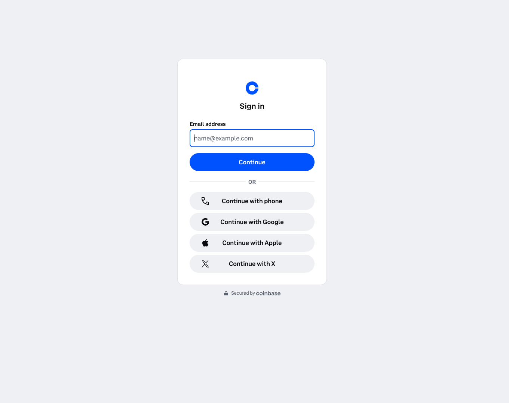
</div>

2. **Enter the OTP** in the hub.

<div style="text-align:left">
    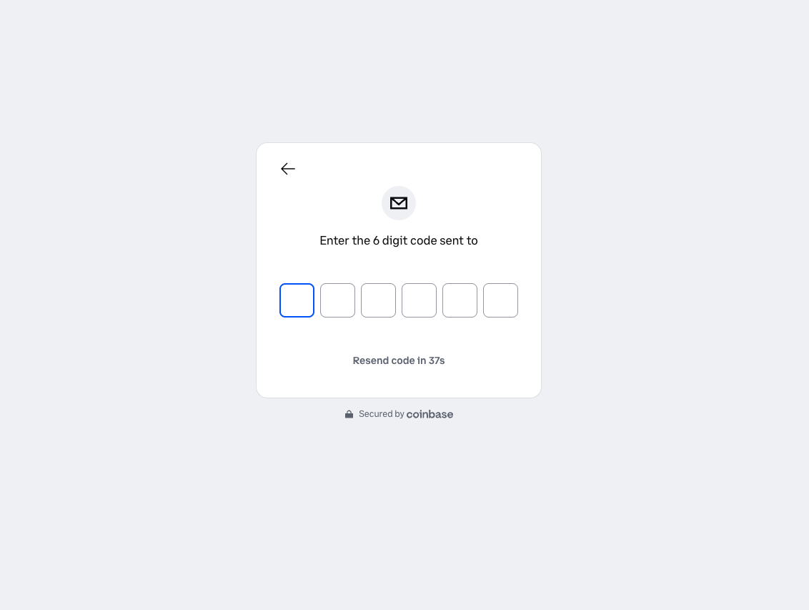
</div>

3. **Grant signing delegation** to the agent. Without this step,
   `ProcessPayment` returns *Delegated signing grant is not active*.
4. **Set the delegation duration** — how long the grant should
   remain active.

<div style="text-align:left">
    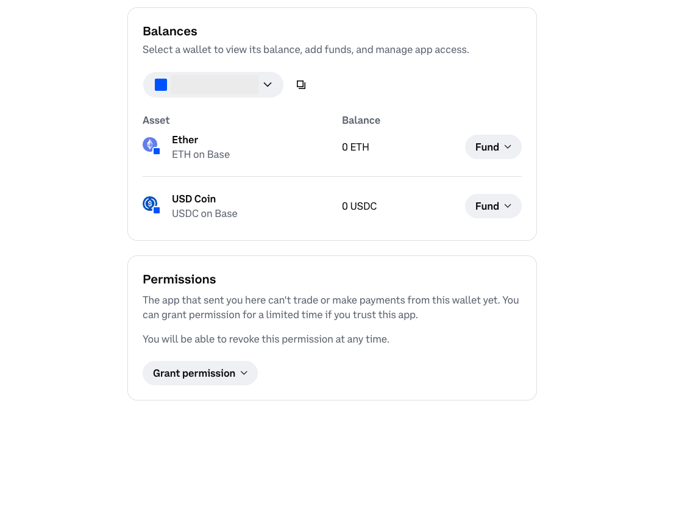
</div>

5. **Copy the EVM wallet address** printed by the previous cell.
6. **Request testnet USDC** from the
   [Circle faucet](https://faucet.circle.com/) on **Base Sepolia**
   using the copied address.
7. **Toggle to Solana** in the hub.
8. **Select Solana Devnet** in the network dropdown.
9. **Copy the Solana wallet address**.
10. **Request testnet USDC** from the same faucet under
    **Solana Devnet** using the copied Solana address.

Once both wallets show a balance, run §4.5b in the following section to create the
Solana instrument under the same delegation.

#### 4.5b Coinbase CDP — SOLANA (Solana Devnet)

```python
PAYMENT_INSTRUMENT_ID_CDP_SOL, WALLET_ADDRESS_CDP_SOL, REDIRECT_CDP_SOL = create_instrument(
    connector_id=CONNECTOR_ID_CDP,
    network="SOLANA",
    env_key_id="PAYMENT_INSTRUMENT_ID_CDP_SOL",
    env_key_wallet="WALLET_ADDRESS_CDP_SOL",
    label="CDP SOLANA",
)

print("\n" + "=" * 60)
print("  FUND THIS WALLET WITH SOLANA DEVNET USDC")
print("=" * 60)
print(f"  Address: {WALLET_ADDRESS_CDP_SOL or '(still provisioning)'}")
if REDIRECT_CDP_SOL:
    print(f"  Hub:     {REDIRECT_CDP_SOL}")
print("  Faucet:  https://faucet.circle.com/  (pick Solana Devnet)")
print("=" * 60)
```

#### 4.5c Stripe via Privy — ETHEREUM (Base Sepolia)

```python
PAYMENT_INSTRUMENT_ID_PRIVY_EVM, WALLET_ADDRESS_PRIVY_EVM, REDIRECT_PRIVY_EVM = create_instrument(
    connector_id=CONNECTOR_ID_PRIVY,
    network="ETHEREUM",
    env_key_id="PAYMENT_INSTRUMENT_ID_PRIVY_EVM",
    env_key_wallet="WALLET_ADDRESS_PRIVY_EVM",
    label="Privy EVM",
)

print("\n" + "=" * 60)
print("  Privy EVM wallet created.")
print("=" * 60)
print(f"  Address: {WALLET_ADDRESS_PRIVY_EVM or '(still provisioning)'}")
print("  Note:    Grant signing delegation via the Privy Wallet Hub")
print("           frontend (see §4.5e below) before §7 can spend from")
print("           this wallet. Once delegation is granted, §7 spends here too.")
print("=" * 60)
```

#### 4.5d Stripe via Privy — SOLANA (Solana Devnet)

```python
PAYMENT_INSTRUMENT_ID_PRIVY_SOL, WALLET_ADDRESS_PRIVY_SOL, REDIRECT_PRIVY_SOL = create_instrument(
    connector_id=CONNECTOR_ID_PRIVY,
    network="SOLANA",
    env_key_id="PAYMENT_INSTRUMENT_ID_PRIVY_SOL",
    env_key_wallet="WALLET_ADDRESS_PRIVY_SOL",
    label="Privy SOLANA",
)

print("\n" + "=" * 60)
print("  Privy Solana wallet created.")
print("=" * 60)
print(f"  Address: {WALLET_ADDRESS_PRIVY_SOL or '(still provisioning)'}")
print("  Note:    Grant signing delegation via the Privy Wallet Hub frontend (§4.5e).")
print("=" * 60)
```

##### Grant signing delegation in the Privy Wallet Hub

Privy embedded wallets need a separate **signing delegation** before
the agent can call `ProcessPayment` against them. The delegation is
granted from a small Next.js frontend maintained jointly by Privy and
the AWS AgentCore Bedrock team at
[privy-io/aws-agentcore-sdk](https://github.com/privy-io/aws-agentcore-sdk).

Run the four cells below in order:

1. **Clone** — pulls the frontend into `privy-delegation/`.
2. **Generate env** — writes `privy-delegation/.env.local` from the
   `PRIVY_APP_ID`, `PRIVY_APP_SECRET`, and `PRIVY_AUTHORIZATION_ID`
   you already have in `.env`, and pins the frontend to **testnet**
   so it reads Base Sepolia + Solana Devnet balances.
3. **Install** — runs `npm install` (idempotent).
4. **Start** — launches `npm run dev` in the background and waits
   until the server is up at `http://localhost:3000` (loopback only,
   no TLS needed for a local dev server).

Open [http://localhost:3000](http://localhost:3000) and:

1. **Log in** with the email you set as `INSTRUMENT_EMAIL`. Privy sends
   a one-time passcode (OTP) to that address.

<div style="text-align:left">
    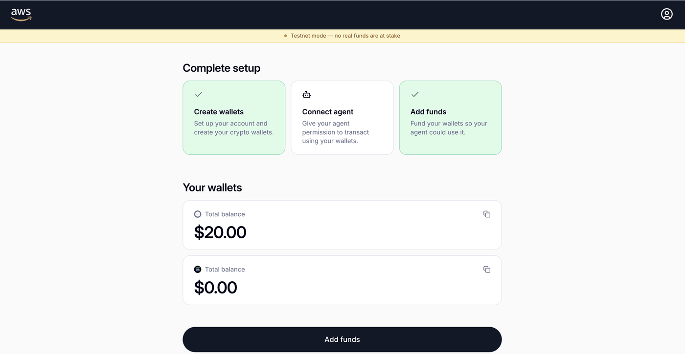
</div>
2. **View your wallets.** The hub queries Base Sepolia and Solana
   Devnet directly and shows USDC balances for both.
3. **Delegate access to the agent.** Choose **Delegate** for each wallet
   you want the agent to spend from. Without this, `ProcessPayment`
   returns `Delegated signing grant is not active`.

<div style="text-align:left">
    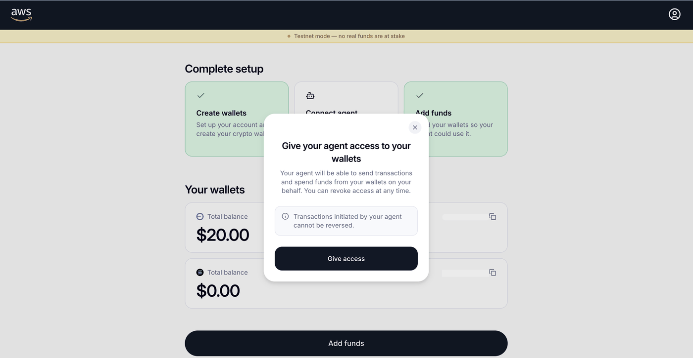
</div>
4. **Choose Receive** in the hub to copy the wallet address.
5. **Request testnet USDC** from the
   [Circle faucet](https://faucet.circle.com/) on **Base Sepolia** or
   **Solana Devnet** using the copied address. Card funding via
   Stripe is mainnet-only and is disabled when
   `NEXT_PUBLIC_NETWORK_MODE=testnet`.

Once both wallets show a balance and delegation is granted, you can
run the stop cell below to shut the frontend down and continue with §5.

```python
# Clone the Privy Wallet Hub frontend if it isn't already in this folder.
#
# The frontend lives upstream at privy-io/aws-agentcore-sdk and is
# jointly maintained by Privy and the AWS AgentCore Bedrock team. We
# clone it locally as `privy-delegation/` (the upstream repo dir name
# would be `aws-agentcore-sdk` — we pass an explicit target so every
# downstream cell can stay on the same path). Re-running this cell is
# a no-op once the folder exists.
import pathlib
import shutil
import subprocess

HUB_ROOT = pathlib.Path("privy-delegation").resolve()
PRIVY_REMOTE = "https://github.com/privy-io/aws-agentcore-sdk.git"

if HUB_ROOT.exists():
    print(f"↷ {HUB_ROOT.name}/ already present, skipping clone.")
else:
    if not shutil.which("git"):
        raise RuntimeError("git not found on PATH. Install git from https://git-scm.com/ and re-run this cell.")
    print(f"Cloning {PRIVY_REMOTE} into {HUB_ROOT.name}/ ...")
    subprocess.run(
        ["git", "clone", "--depth", "1", PRIVY_REMOTE, str(HUB_ROOT)],
        check=True,
    )
    print("✅ Clone complete.")
```

```python
# Generate privy-delegation/.env.local for the Privy Wallet Hub frontend.
#
# We map our parent .env keys onto the names the frontend expects and
# pin NETWORK_MODE=testnet so balances + transfers target Base Sepolia
# and Solana Devnet (matching the rest of this notebook). Re-running
# the cell overwrites .env.local idempotently.
import pathlib

HUB_ROOT = pathlib.Path("privy-delegation").resolve()
HUB_ENV = HUB_ROOT / ".env.local"

missing_for_hub = [
    n
    for n, v in (
        ("PRIVY_APP_ID", PRIVY_APP_ID),
        ("PRIVY_APP_SECRET", PRIVY_APP_SECRET),
        ("PRIVY_AUTHORIZATION_ID", PRIVY_AUTHORIZATION_ID),
    )
    if not v
]
if missing_for_hub:
    raise RuntimeError(f"Cannot write {HUB_ENV} — missing in parent .env: {missing_for_hub}")

HUB_ENV.write_text(
    f"# Generated by pay-for-api.ipynb. Do not commit.\n"
    f"# Mapped from the parent .env so the Privy Wallet Hub frontend\n"
    f"# reads the same App ID / App Secret / Signer ID this notebook uses.\n"
    f"NEXT_PUBLIC_PRIVY_APP_ID={PRIVY_APP_ID}\n"
    f"PRIVY_APP_SECRET={PRIVY_APP_SECRET}\n"
    f"NEXT_PUBLIC_PRIVY_SIGNER_ID={PRIVY_AUTHORIZATION_ID}\n"
    f"NEXT_PUBLIC_NETWORK_MODE=testnet\n"
)
print(f"✅ Wrote {HUB_ENV}")
print(f"   App ID:    {PRIVY_APP_ID}")
print(f"   Signer ID: {PRIVY_AUTHORIZATION_ID}")
print(f"   Network:   testnet (Base Sepolia + Solana Devnet)")
print()
print("Next: run the install + start cells that follow to bring the hub up.")
```

```python
# Install the Privy Wallet Hub frontend's Node dependencies. npm ships
# with Node.js, so no extra package manager setup is needed. This cell
# is idempotent — it skips the install if node_modules/ already exists.
import pathlib
import shutil
import subprocess

HUB_ROOT = pathlib.Path("privy-delegation").resolve()

if not shutil.which("npm"):
    raise RuntimeError(
        "npm not found on PATH. Install Node.js (which includes npm) "
        "from https://nodejs.org/ or via your package manager."
    )

if (HUB_ROOT / "node_modules").exists():
    print(f"↷ {HUB_ROOT.name}/node_modules already present, skipping install.")
else:
    print(f"Running npm install in {HUB_ROOT}...")
    subprocess.run(["npm", "install"], cwd=HUB_ROOT, check=True)
    print("✅ npm install complete.")
```

```python
# Start the Privy Wallet Hub frontend in the background and wait until
# the dev server is responding on http://localhost:3000. The PID is
# stored in HUB_DEV_PROCESS so the stop cell below can terminate it.
import os
import pathlib
import socket
import subprocess
import time

HUB_ROOT = pathlib.Path("privy-delegation").resolve()
HUB_PORT = 3000
HUB_URL = f"http://localhost:{HUB_PORT}"


def _port_open(host: str, port: int, timeout: float = 1.0) -> bool:
    with socket.socket(socket.AF_INET, socket.SOCK_STREAM) as s:
        s.settimeout(timeout)
        try:
            s.connect((host, port))
            return True
        except (ConnectionRefusedError, socket.timeout, OSError):
            return False


# Reuse an existing dev server if one is already running on 3000.
already_running = _port_open("127.0.0.1", HUB_PORT)
if already_running:
    print(f"↷ Something is already listening on port {HUB_PORT}; reusing it.")
    HUB_DEV_PROCESS = None
else:
    log_path = HUB_ROOT / "npm-dev.log"
    log_handle = open(log_path, "w")
    HUB_DEV_PROCESS = subprocess.Popen(
        ["npm", "run", "dev"],
        cwd=HUB_ROOT,
        stdout=log_handle,
        stderr=subprocess.STDOUT,
        # Detach into a new process group so the kernel does not kill
        # the dev server when this cell finishes.
        start_new_session=True,
    )
    print(f"Started npm dev (PID {HUB_DEV_PROCESS.pid}); logs: {log_path}")
    print(f"Waiting for {HUB_URL} to come up...")
    deadline = time.time() + 90  # Next.js cold start can take up to a minute
    while time.time() < deadline:
        if _port_open("127.0.0.1", HUB_PORT):
            break
        if HUB_DEV_PROCESS.poll() is not None:
            raise RuntimeError(f"npm dev exited early (rc={HUB_DEV_PROCESS.returncode}); see {log_path} for details.")
        time.sleep(1)
    else:
        raise RuntimeError(f"npm dev did not respond on port {HUB_PORT} within 90s. See {log_path} for details.")
    print(f"✅ Hub is up at {HUB_URL}")

print()
print(f"Open {HUB_URL} in your browser, sign in with INSTRUMENT_EMAIL,")
print("delegate each wallet, fund via the Circle faucet, then run the")
print("STOP cell below to shut the dev server down.")
```

```python
# Stop the Privy Wallet Hub frontend started above. Skip if the start
# cell reused an already-running server (HUB_DEV_PROCESS is None).
import os
import signal

proc = globals().get("HUB_DEV_PROCESS")
if proc is None:
    print("↷ No background npm dev process to stop (server was reused).")
elif proc.poll() is not None:
    print(f"↷ npm dev already exited (rc={proc.returncode}).")
else:
    # Killing the process group catches the Next.js dev server's
    # child workers as well as the npm wrapper.
    try:
        os.killpg(os.getpgid(proc.pid), signal.SIGTERM)
    except ProcessLookupError:
        pass
    try:
        proc.wait(timeout=10)
    except Exception:
        os.killpg(os.getpgid(proc.pid), signal.SIGKILL)
    print(f"✅ Stopped npm dev (PID {proc.pid}).")
```

## 5. Create payment sessions

A **payment session** is a budget-limited, time-bounded authorization
for the agent to spend. The operator (you, via the `ManagementRole`)
sets `maxSpendAmount` and `expiryTimeInMinutes`. Once created, the
agent can only spend within that budget — it cannot raise the limit
or extend the session.

Sessions are Manager-scoped, not connector- or instrument-scoped — a
single session covers every instrument the agent pays from. To keep
the CDP and Privy spend ledgers separate for the demo, the notebook creates **one
session per provider**: the CDP session covers the two CDP instruments
(EVM + SOL), the Privy session covers the two Privy instruments.

Notes:

* `expiryTimeInMinutes` is required (range 15–480).
* `clientToken` must be ≥ 33 characters. UUID v4 (36) satisfies this.
* `userId` is an HTTP header, not a body field.

### 5.1 Build session clients

```python
from datetime import datetime

boto_session = Session(region_name=AWS_REGION)

# ── Management client (ManagementRole — creates sessions) ─────────────
mgmt_session = assume_role(
    boto_session,
    MANAGEMENT_ROLE_ARN,
    session_name="pay-for-api-mgmt-session",
)
dp_client = mgmt_session.client("bedrock-agentcore")

# ── Agent client (ProcessPaymentRole — signs payments) ────────────────
agent_session = assume_role(
    boto_session,
    PROCESS_PAYMENT_ROLE_ARN,
    session_name="pay-for-api-agent",
)
dp_agent_client = agent_session.client("bedrock-agentcore")

print("\n✅ Session clients ready")
```

### 5.2 Coinbase CDP session

```python
resp = dp_client.create_payment_session(
    paymentManagerArn=MANAGER_ARN,
    userId=USER_ID,
    expiryTimeInMinutes=SESSION_EXPIRY_MINUTES,
    limits={"maxSpendAmount": {"value": SESSION_MAX_SPEND, "currency": "USD"}},
    clientToken=_client_token(),
)
SESSION_ID_CDP = resp["paymentSession"]["paymentSessionId"]
print(f"✅ Coinbase CDP session created")
print(f"   Session ID: {SESSION_ID_CDP}")
print(f"   Budget:     ${SESSION_MAX_SPEND} USD (covers CDP EVM + SOL)")
print(f"   Expires in: {SESSION_EXPIRY_MINUTES} minutes")

write_env_updates({"SESSION_ID_CDP": SESSION_ID_CDP})
print("💾 .env updated: SESSION_ID_CDP")
```

### 5.3 Stripe via Privy session

```python
resp = dp_client.create_payment_session(
    paymentManagerArn=MANAGER_ARN,
    userId=USER_ID,
    expiryTimeInMinutes=SESSION_EXPIRY_MINUTES,
    limits={"maxSpendAmount": {"value": SESSION_MAX_SPEND, "currency": "USD"}},
    clientToken=_client_token(),
)
SESSION_ID_PRIVY = resp["paymentSession"]["paymentSessionId"]
print(f"✅ Stripe Privy session created")
print(f"   Session ID: {SESSION_ID_PRIVY}")
print(f"   Budget:     ${SESSION_MAX_SPEND} USD (covers Privy EVM + SOL)")
print(f"   Expires in: {SESSION_EXPIRY_MINUTES} minutes")

write_env_updates({"SESSION_ID_PRIVY": SESSION_ID_PRIVY})
print("💾 .env updated: SESSION_ID_PRIVY")
```

## 6. Build the Fun Facts agent

this use case builds **one** minimal Strands agent pattern — one tool
(`http_request` from `strands-agents-tools`) plus an
`AgentCorePaymentsPlugin` configured for a specific (instrument,
session) pair. Since the plugin's `AgentCorePaymentsPluginConfig`
pins a single `payment_instrument_id` + `payment_session_id` + network
preference, we rebuild the agent from the same factory whenever we
want to pay on a different network. §6 runs it once on EVM and once
on Solana against the same seller.

The payment flow is identical on both runs:

1. The agent calls `http_request` `GET <seller>/facts?topic=<x>`
2. Seller returns **HTTP 402** with an x402 `accepts` array covering
   both Base Sepolia and Solana Devnet
3. `AgentCorePaymentsPlugin` intercepts and calls **`ProcessPayment`**
   against that run's (manager, session, instrument, user). The
   `network_preferences_config` passed into the factory decides which
   entry from `accepts[]` the plugin picks first.
4. Seller verifies and settles through the x402 facilitator, returns
   **200 OK** with the paid fact.

The agent flow is identical across wallet providers too — Coinbase CDP
or Stripe via Privy. The service picks the right signer.

> The plugin also registers three read-only management tools at runtime
> — `get_payment_instrument`, `list_payment_instruments`,
> `get_payment_session`. The system prompt below instructs the model to
> use only `http_request`; the plugin's tools are reserved for operator
> and debug flows. The plugin also exposes a
> `PaymentInstrumentConfigurationRequired` /
> `PaymentSessionConfigurationRequired` interrupt contract for agents
> that need to prompt the operator mid-run; see the [Strands SDK
> reference](https://docs.aws.amazon.com/bedrock-agentcore/latest/devguide/payments-process-payment.html)
> for the full configuration surface including `auto_payment=False`
> for human-in-the-loop flows.

```python
from strands import Agent
from strands.models.bedrock import BedrockModel
from strands_tools import http_request

from bedrock_agentcore.payments.integrations.config import (
    AgentCorePaymentsPluginConfig,
)
from bedrock_agentcore.payments.integrations.strands.plugin import (
    AgentCorePaymentsPlugin,
)

SYSTEM_PROMPT = (
    "You are a research agent backed by Amazon Bedrock AgentCore Payments. "
    "Your only tool is `http_request`. The AgentCorePaymentsPlugin watches "
    "every request and, when it sees an HTTP 402, silently calls "
    "ProcessPayment and retries with an `X-PAYMENT` header — you never "
    "handle private keys, assemble headers, or budget limits.\n"
    "\n"
    "The plugin also registers three read-only tools — "
    "`get_payment_instrument`, `list_payment_instruments`, "
    "`get_payment_session` — which the agent should not call. They exist for "
    "operator debug flows, not for you. Use only `http_request`.\n"
    "\n"
    "SELLER\n"
    "  Endpoint:  GET <seller>/facts?topic=<topic>\n"
    "  Topics:    space, oceans, ai, payments (anything else returns a "
    "random general fact)\n"
    "  Price:     $0.01 USDC per successful call\n"
    "  Response:  {'x402_content': {'data': '<JSON string>', ...}, "
    "'x402_meta': {...}}\n"
    "             `x402_content.data` is a JSON string; parse it to read "
    "`{'topic': ..., 'fact': ...}`.\n"
    "\n"
    "RULES\n"
    "  1. Make one `http_request` GET per topic the user asks about — if "
    "they ask for two, make two.\n"
    "  2. If the user names a topic outside the supported list, pick the "
    "closest supported one (e.g. volcanoes→space, whales→oceans) rather "
    "than letting the seller fall back silently.\n"
    "  3. Parse `x402_content.data` and quote the `fact` verbatim in your "
    "reply.\n"
    "  4. Always close with a one-line spend summary: "
    "`Total spent: $<0.01 × successful_calls>`.\n"
    "  5. If a call returns anything other than 200, explain the error in "
    "plain language and do not retry — the plugin already retried once."
)

# Shared Bedrock model — Claude Sonnet 4.5 via the cross-region US
# inference profile. We reuse the same BedrockModel instance across runs
# since it has no per-run state.
model = BedrockModel(
    model_id="us.anthropic.claude-sonnet-4-5-20250929-v1:0",
    region_name=AWS_REGION,
    temperature=0.7,
)


def resolve_payment_user_id(instrument_id: str) -> str:
    """Pull paymentInstrument.userId for the given instrument.

    The service assigns this value on CreatePaymentInstrument and every
    downstream op (ProcessPayment, GetPaymentSession,
    GetPaymentInstrumentBalance) must target it — the operator USER_ID
    on the request header is not what the service records.
    """
    resp = dp_client.get_payment_instrument(
        paymentManagerArn=MANAGER_ARN,
        paymentInstrumentId=instrument_id,
        userId=USER_ID,
    )
    return resp["paymentInstrument"]["userId"]


def build_agent(*, instrument_id: str, session_id: str, network_preferences: list[str], label: str) -> Agent:
    """Build a fresh Strands agent scoped to one (instrument, session).

    Because AgentCorePaymentsPluginConfig pins a single instrument and
    session, we rebuild the agent per run rather than holding multiple
    instances. `network_preferences` is a CAIP-2 list (priority order)
    telling the plugin which entry from the seller's 402 accepts[] to
    match against the instrument's network.
    """
    payment_user_id = resolve_payment_user_id(instrument_id)
    print(f"   {label} paymentUserId: {payment_user_id}")

    plugin = AgentCorePaymentsPlugin(
        config=AgentCorePaymentsPluginConfig(
            payment_manager_arn=MANAGER_ARN,
            user_id=payment_user_id,
            payment_instrument_id=instrument_id,
            payment_session_id=session_id,
            region=AWS_REGION,
            agent_name=f"pay-for-api-agent-{label.lower()}",
            network_preferences_config=network_preferences,
        )
    )
    return Agent(
        model=model,
        tools=[http_request],
        plugins=[plugin],
        system_prompt=SYSTEM_PROMPT,
    )


print("✅ Agent factory ready — §8 calls build_agent() once per network run")
```

## 7. Ask the agents to buy a fact (local run)

Run the EVM agent first, then the Solana agent. The plugin handles
402 → ProcessPayment → retry for any HTTP request the agent makes, on
whichever network the agent's instrument targets. Watch the logs: you
should see one `ProcessPayment` call per fact each agent buys.

```python
# One agent pattern, rebuilt per (provider, network). The plugin pins
# the (instrument, session, network preferences) triple, so each run
# is a fresh agent whose only job is to pay on that network via that
# provider.
#
# Privy wallets require a separate signing delegation, granted via the
# Privy Wallet Hub frontend (§4.5e). Once delegation is granted, set
# PRIVY_DELEGATION_WIRED_UP = True (default) so §7 spends from the Privy
# wallets too. Flip back to False to skip Privy rows during dev.
PRIVY_DELEGATION_WIRED_UP = True

runs = [
    {
        "label": "CDP EVM",
        "provider": "CoinbaseCDP",
        "network": "Base Sepolia",
        "instrument_id": PAYMENT_INSTRUMENT_ID_CDP_EVM,
        "session_id": SESSION_ID_CDP,
        "network_preferences": ["base-sepolia", "solana-devnet"],
        "topic": "space",
    },
    {
        "label": "CDP SOLANA",
        "provider": "CoinbaseCDP",
        "network": "Solana Devnet",
        "instrument_id": PAYMENT_INSTRUMENT_ID_CDP_SOL,
        "session_id": SESSION_ID_CDP,
        "network_preferences": ["solana-devnet", "base-sepolia"],
        "topic": "oceans",
    },
    {
        "label": "Privy EVM",
        "provider": "StripePrivy",
        "network": "Base Sepolia",
        "instrument_id": PAYMENT_INSTRUMENT_ID_PRIVY_EVM,
        "session_id": SESSION_ID_PRIVY,
        "network_preferences": ["base-sepolia", "solana-devnet"],
        "topic": "ai",
    },
    {
        "label": "Privy SOLANA",
        "provider": "StripePrivy",
        "network": "Solana Devnet",
        "instrument_id": PAYMENT_INSTRUMENT_ID_PRIVY_SOL,
        "session_id": SESSION_ID_PRIVY,
        "network_preferences": ["solana-devnet", "base-sepolia"],
        "topic": "payments",
    },
]

results = {}
for cfg in runs:
    label = cfg["label"]
    if not cfg["instrument_id"] or not cfg["session_id"]:
        print(f"\nℹ️  Skipping {label} — no instrument/session configured")
        continue
    if cfg["provider"] == "StripePrivy" and not PRIVY_DELEGATION_WIRED_UP:
        print(f"\nℹ️  Skipping {label} — Privy user delegation not yet wired up")
        continue
    print(f"\n── {label} run ({cfg['network']}) ──")
    agent = build_agent(
        instrument_id=cfg["instrument_id"],
        session_id=cfg["session_id"],
        network_preferences=cfg["network_preferences"],
        label=label.replace(" ", "-").lower(),
    )

    # Retry on transient Bedrock throttling. Claude Sonnet 4.5 in
    # us-west-2 occasionally returns ServiceUnavailableException
    # ("Too many connections") when back-to-back agent runs stack up.
    # A short exponential backoff handles the squeeze without failing
    # the notebook.
    import time
    from botocore.exceptions import ClientError

    attempt, max_attempts = 0, 4
    while True:
        try:
            results[label] = agent(
                f"Get me one interesting fact about {cfg['topic']} from the seller "
                f"at {SELLER_API_URL}. Tell me the total amount spent in USD at the end."
            )
            break
        except ClientError as exc:
            code = exc.response.get("Error", {}).get("Code", "")
            if code not in ("ServiceUnavailableException", "ThrottlingException"):
                raise
            attempt += 1
            if attempt >= max_attempts:
                raise
            wait = 2**attempt
            print(f"   ⚠️  Bedrock {code} — retry {attempt}/{max_attempts - 1} in {wait}s...")
            time.sleep(wait)
    print(f"\n── {label} response ──")
    print(results[label])

    # Short pause between runs so the next agent doesn't pile onto the
    # same Bedrock connection pool while the previous stream is closing.
    time.sleep(2)

# `result` retains the original single-run variable name so downstream
# cells (§8 Runtime invoke) keep working.
result = results.get("CDP EVM") or next(iter(results.values()), None)
```

## 8. Deploy the agent to AgentCore Runtime

The agent we ran in §7 works on a laptop. To run it as a managed service you
ship the same `Agent()` construction inside a container and deploy it to
**Amazon Bedrock AgentCore Runtime**. The `agent/` folder under this use case
has:

- `agent/container/` — the FastAPI wrapper plus the same agent code
- `agent/cdk/` — a CDK stack that builds the image locally via Docker,
  pushes it to the CDK bootstrap ECR, and provisions an AgentCore Runtime
  pointing at it

The stack also attaches a minimal IAM role: `bedrock:InvokeModel*` on the
Claude Sonnet 4.5 inference profile plus a handful of AgentCore Payments
data-plane ops the plugin needs (`ProcessPayment`, `GetPaymentSession`,
`GetPaymentInstrument`, `GetPaymentInstrumentBalance`,
`GetResourcePaymentToken`). Control-plane ops (`CreatePaymentManager`, etc.)
are *not* granted to the Runtime — those live with the operator.

Running this section requires:

- **AWS CDK v2** installed (`npm install -g aws-cdk`) — the only local tool needed;
  the container image is built in **AWS CodeBuild** so you do not need
  Docker on your laptop.

> ⚠️ **Cost notice:** This step provisions an Amazon ECR
> repository, an AWS CodeBuild build, an AgentCore Runtime, an
> AgentCore Memory resource, and the supporting CloudWatch log
> groups and X-Ray traces. CodeBuild billed-by-the-minute and the
> Runtime billed-by-the-invocation can add up if you leave the
> stack running. Run §10 to tear everything down when you are done.

```python
# Deploy the agent runtime via test/integration/deploy-agent.sh.
# The script creates a CDK venv, installs CDK deps, bootstraps
# CDK if needed, builds the Docker image, and runs `cdk deploy`.
# We stream its stdout so the (often multi-minute) build isn't silent.
import json
import subprocess
from pathlib import Path

HERE = Path(".").resolve()
AGENT_CDK_DIR = HERE / "agent" / "cdk"
DEPLOY = HERE / "test" / "integration" / "deploy-agent.sh"

if not DEPLOY.exists():
    raise FileNotFoundError(f"Expected {DEPLOY} — run this notebook from the 02-use-cases/01-pay-for-api directory.")

proc = subprocess.Popen(
    ["bash", str(DEPLOY)],
    cwd=str(HERE),
    stdout=subprocess.PIPE,
    stderr=subprocess.STDOUT,
    text=True,
    bufsize=1,
)
for line in proc.stdout:
    print(line, end="")
rc = proc.wait()
if rc != 0:
    raise RuntimeError(f"deploy-agent.sh failed with exit code {rc}")

cdk_outputs = json.loads((AGENT_CDK_DIR / "outputs.json").read_text())
outputs = cdk_outputs["AgentCorePaymentsBuyerAgentStack"]
AGENT_RUNTIME_ARN = outputs["AgentRuntimeArn"]
AGENT_RUNTIME_ID = outputs["AgentRuntimeId"]
print("\n✅ Runtime deployed")
print(f"   Runtime ARN:  {AGENT_RUNTIME_ARN}")
print(f"   Runtime ID:   {AGENT_RUNTIME_ID}")
```

### Enable Transaction Search (one-time, console step)

Before invoking the runtime, enable Transaction Search so the
**Observability** tab on the runtime page shows traces and span
details. This is a one-time setup per runtime.

1. Open the **Amazon Bedrock AgentCore** console → **Runtime**.
2. Choose **`pay_for_api_agent_runtime`** in the list.

<div style="text-align:left">
    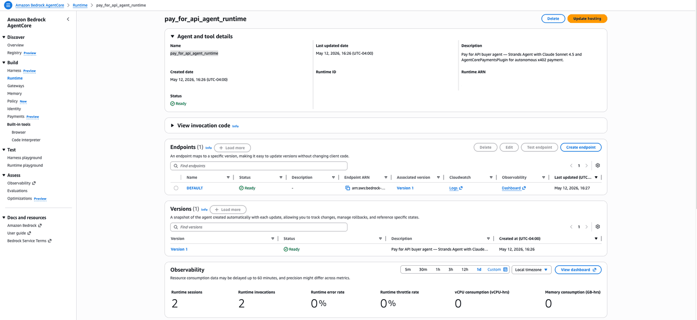
</div>

3. Open the **Log deliveries and tracing** tab.
4. Enable **Transaction Search**.
5. Choose **Save**.

<div style="text-align:left">
    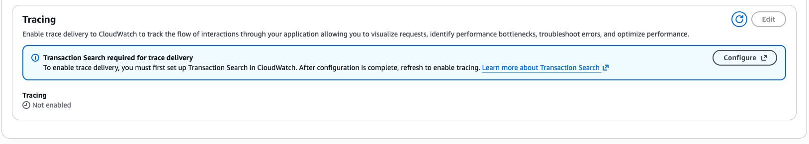
</div>


After saving, the panel confirms Transaction Search is enabled:

<div style="text-align:left">
    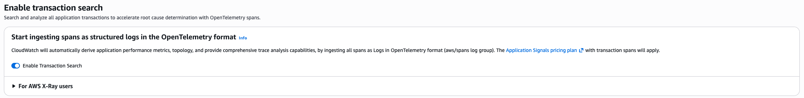
</div>


> Transaction Search takes a few minutes to start indexing after you
> save. If the Observability tab shows no data immediately, wait a
> minute and refresh.

```python
# Invoke the deployed runtime once per (provider, network) — same
# four-run matrix as §7's local pattern. The container constructs the
# Strands Agent + plugin per invocation based on the payload we send,
# so we can target any wallet by picking different IDs.
#
# Privy wallets require a signing delegation granted via the Privy
# Wallet Hub frontend (§4.5e). With delegation in place, the deployed
# runtime can call ProcessPayment against Privy instruments too.
import json as _json
import time as _time

PRIVY_DELEGATION_WIRED_UP = True

runtime_client = boto3.client("bedrock-agentcore", region_name=AWS_REGION)

runtime_runs = [
    {
        "label": "CDP EVM",
        "provider": "CoinbaseCDP",
        "instrument_id": PAYMENT_INSTRUMENT_ID_CDP_EVM,
        "session_id": SESSION_ID_CDP,
        "network_preferences": ["base-sepolia", "solana-devnet"],
        "topic": "space",
    },
    {
        "label": "CDP SOLANA",
        "provider": "CoinbaseCDP",
        "instrument_id": PAYMENT_INSTRUMENT_ID_CDP_SOL,
        "session_id": SESSION_ID_CDP,
        "network_preferences": ["solana-devnet", "base-sepolia"],
        "topic": "oceans",
    },
    {
        "label": "Privy EVM",
        "provider": "StripePrivy",
        "instrument_id": PAYMENT_INSTRUMENT_ID_PRIVY_EVM,
        "session_id": SESSION_ID_PRIVY,
        "network_preferences": ["base-sepolia", "solana-devnet"],
        "topic": "ai",
    },
    {
        "label": "Privy SOLANA",
        "provider": "StripePrivy",
        "instrument_id": PAYMENT_INSTRUMENT_ID_PRIVY_SOL,
        "session_id": SESSION_ID_PRIVY,
        "network_preferences": ["solana-devnet", "base-sepolia"],
        "topic": "payments",
    },
]

remote_results = {}
for cfg in runtime_runs:
    label = cfg["label"]
    if not cfg["instrument_id"] or not cfg["session_id"]:
        print(f"\n\u21b7 {label}: skipped (no instrument/session)")
        continue
    if cfg["provider"] == "StripePrivy" and not PRIVY_DELEGATION_WIRED_UP:
        print(f"\n\u21b7 {label}: skipped (Privy user delegation not wired up)")
        continue

    print(f"\n\u2500\u2500 {label} runtime invoke \u2500\u2500")
    payment_user_id = resolve_payment_user_id(cfg["instrument_id"])

    resp = runtime_client.invoke_agent_runtime(
        agentRuntimeArn=AGENT_RUNTIME_ARN,
        qualifier="DEFAULT",
        payload=_json.dumps(
            {
                "prompt": (
                    f"Get me one interesting fact about {cfg['topic']}. "
                    "Tell me the total amount spent in USD at the end."
                ),
                "sellerUrl": SELLER_API_URL,
                "managerArn": MANAGER_ARN,
                "instrumentId": cfg["instrument_id"],
                "sessionId": cfg["session_id"],
                "paymentUserId": payment_user_id,
                "networkPreferences": cfg["network_preferences"],
                "region": AWS_REGION,
            }
        ).encode(),
    )

    body = resp["response"]
    payload = b"".join(body.iter_chunks()) if hasattr(body, "iter_chunks") else body.read()
    remote_results[label] = _json.loads(payload)
    response_text = remote_results[label].get("response", remote_results[label])
    print(response_text)

    # Short pause between invocations so the runtime doesn't queue the
    # next call while the previous stream is still closing.
    _time.sleep(2)
```

### Inspect the runtime in the console

After the runtime returns, open the AgentCore console to see the
underlying spans and logs.

1. From the runtime detail page, choose **View dashboard** in the
   **Observability** section.

<div style="text-align:left">
    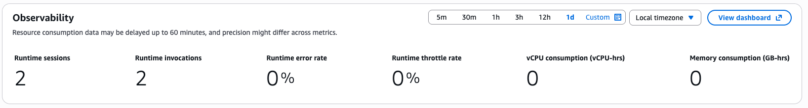
</div>

2. The CloudWatch GenAI Observability dashboard opens. Open the
   **Sessions** tab and choose the most recent **Session ID**.

<div style="text-align:left">
    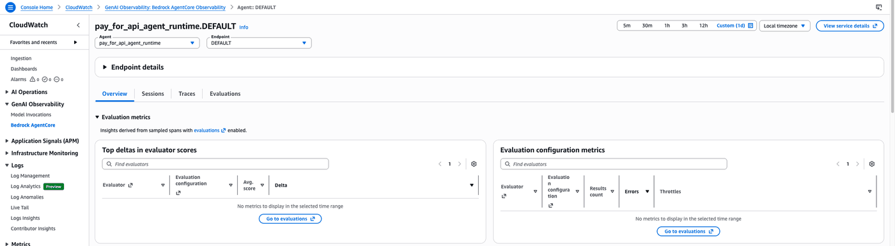
</div>

3. Choose the most recent **Trace ID** to explore the
   `POST /invocations` events: model invocations, tool calls,
   payment requirement (`402`), `ProcessPayment` span, and the
   final retry that returns `200 OK`.

<div style="text-align:left">
    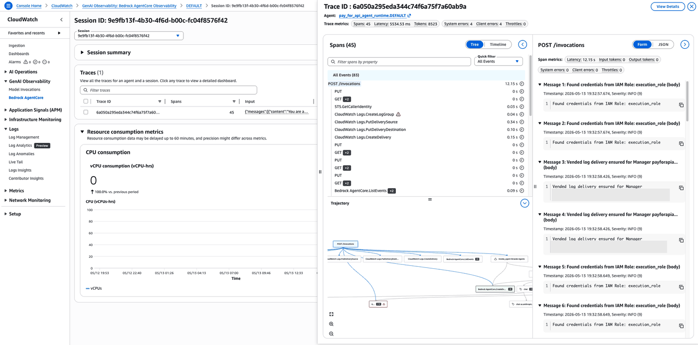
</div>

## 9. Inspect the data plane

Once the agent has spent, walk through the read-only data-plane APIs so
you can see exactly what the service recorded. Everything here runs
against the **management** client — the agent's `ProcessPaymentRole` has
an explicit `Deny` on these, which is how we enforce the audit boundary.

### 9.1 `GetPaymentSession` — session state and remaining budget

```python
# Wrap the whole inspect call in a try/except so an ExpiredTokenException
# (STS session rolled over past its 1-hour lifetime) surfaces a clear
# re-run hint instead of a raw boto3 traceback.
from botocore.exceptions import ClientError

try:
    # GetPaymentSession carries the running budget state — one per session.
    # We create one session per provider (§5), so inspect both.
    sessions_to_inspect = []
    if SESSION_ID_CDP:
        sessions_to_inspect.append(("CDP", SESSION_ID_CDP))
    if SESSION_ID_PRIVY:
        sessions_to_inspect.append(("Privy", SESSION_ID_PRIVY))

    for label, session_id in sessions_to_inspect:
        resp = dp_client.get_payment_session(
            paymentManagerArn=MANAGER_ARN,
            paymentSessionId=session_id,
            userId=USER_ID,
        )
        s = resp.get("paymentSession", {})
        budget = s.get("limits", {}).get("maxSpendAmount", {})
        avail = s.get("availableLimits", {}).get("availableSpendAmount", {})
        budget_val = budget.get("value", "?")
        budget_cur = budget.get("currency", "")
        avail_val = avail.get("value", "?")
        avail_cur = avail.get("currency", "")
        print(f"\n── {label} session ──")
        print(f"  Session ID:   {s.get('paymentSessionId', session_id)}")
        print(f"  Budget:       {budget_val} {budget_cur}")
        print(f"  Remaining:    {avail_val} {avail_cur}")
        print(f"  Expires in:   {s.get('expiryTimeInMinutes', '?')} minutes")
        print(f"  Created at:   {s.get('createdAt', '?')}")
except ClientError as _exc:
    if _exc.response.get("Error", {}).get("Code") == "ExpiredTokenException":
        print(
            "⏳  STS session credentials expired.\n"
            "   Re-run the §5.1 cell (Build session clients) to refresh "
            "`dp_client` / `dp_agent_client`,\n"
            "   then re-run THIS cell. (The fresh clients come up with "
            "auto-refreshing creds\n"
            "   via utils.assume_role, so this won't happen again in "
            "this kernel.)"
        )
        raise SystemExit("Re-run §5.1 (Build session clients), then re-run this cell.") from _exc
    raise
```

### 9.2 `GetPaymentInstrumentBalance` — on-chain USDC balance

`GetPaymentInstrumentBalance` asks AgentCore Payments for the on-chain
USDC balance of the instrument's wallet. AgentCore Payments maps the
instrument's network to a `chain`:

| `CryptoWalletNetwork` | `chain` (`BlockchainChainId`) |
|-----------------------|-------------------------------|
| `ETHEREUM`            | `BASE_SEPOLIA` (test) / `BASE` |
| `SOLANA`              | `SOLANA_DEVNET` / `SOLANA`     |

Token is always `USDC` today (the only value the `InstrumentBalanceToken`
enum accepts). The response's `tokenBalance.amount` is the atomic amount
(6 decimals for USDC).

> Higher-level SDK helpers may return a shorter `{amount, currency}`
> shape. The direct boto3 call this notebook uses returns the fuller
> `tokenBalance` structure — both are correct, prefer the SDK helper
> when available.

```python
# Wrap the whole inspect call in a try/except so an ExpiredTokenException
# (STS session rolled over past its 1-hour lifetime) surfaces a clear
# re-run hint instead of a raw boto3 traceback.
from botocore.exceptions import ClientError

try:
    # GetPaymentInstrumentBalance needs (paymentManagerArn, paymentConnectorId,
    # paymentInstrumentId, chain, token). Chain is an enum — BASE_SEPOLIA or
    # SOLANA_DEVNET here; token is USDC across the board. We loop over every
    # (provider, network) instrument that actually got created.
    wallets = [
        ("CDP EVM", CONNECTOR_ID_CDP, PAYMENT_INSTRUMENT_ID_CDP_EVM, WALLET_ADDRESS_CDP_EVM, "BASE_SEPOLIA"),
        ("CDP SOLANA", CONNECTOR_ID_CDP, PAYMENT_INSTRUMENT_ID_CDP_SOL, WALLET_ADDRESS_CDP_SOL, "SOLANA_DEVNET"),
        ("Privy EVM", CONNECTOR_ID_PRIVY, PAYMENT_INSTRUMENT_ID_PRIVY_EVM, WALLET_ADDRESS_PRIVY_EVM, "BASE_SEPOLIA"),
        (
            "Privy SOLANA",
            CONNECTOR_ID_PRIVY,
            PAYMENT_INSTRUMENT_ID_PRIVY_SOL,
            WALLET_ADDRESS_PRIVY_SOL,
            "SOLANA_DEVNET",
        ),
    ]

    for label, connector_id, instrument_id, wallet_address, chain in wallets:
        if not instrument_id or not connector_id:
            print(f"\n↷ {label}: skipped (no instrument)")
            continue
        payment_user_id = resolve_payment_user_id(instrument_id)
        resp = dp_client.get_payment_instrument_balance(
            paymentManagerArn=MANAGER_ARN,
            paymentConnectorId=connector_id,
            paymentInstrumentId=instrument_id,
            userId=payment_user_id,
            chain=chain,
            token="USDC",
        )
        # Convert an atomic amount (the smallest indivisible unit a token uses on chain — for USDC, one atomic unit is 0.000001 USDC) to a human-readable token amount.
        # `amount` is a string of base units (e.g. "19990000"); divide
        # by 10**decimals to get USDC, e.g. 19.99.
        bal = resp.get("tokenBalance", {})
        amount = int(bal.get("amount", "0")) / (10 ** int(bal.get("decimals", 6)))
        print(f"\n── {label} ({chain}) ──")
        print(f"  Wallet:  {wallet_address}")
        print(f"  Balance: {amount:.6f} {bal.get('token', 'USDC')}")
except ClientError as _exc:
    if _exc.response.get("Error", {}).get("Code") == "ExpiredTokenException":
        print(
            "⏳  STS session credentials expired.\n"
            "   Re-run the §5.1 cell (Build session clients) to refresh "
            "`dp_client` / `dp_agent_client`,\n"
            "   then re-run THIS cell. (The fresh clients come up with "
            "auto-refreshing creds\n"
            "   via utils.assume_role, so this won't happen again in "
            "this kernel.)"
        )
        raise SystemExit("Re-run §5.1 (Build session clients), then re-run this cell.") from _exc
    raise
```

### 9.3 `ListPaymentInstruments` — the instruments under this manager

`ListPaymentInstruments` enumerates every instrument the caller is
authorised to see under a given `paymentManagerArn`. Filters:

- `paymentConnectorId` (optional) — narrow to a single connector.
- `userId` (header, required in practice — forward the vendor-assigned
  userId from §4.5's instrument summary rather than USER_ID) — narrow
  to a single vendor-level user.

The response is a list of `PaymentInstrumentSummary` objects. Note the
`userId` on each summary — for Coinbase wallets that is the CDP end-user
UUID the service assigned, which is what you pass to every downstream op.

```python
# Wrap the whole inspect call in a try/except so an ExpiredTokenException
# (STS session rolled over past its 1-hour lifetime) surfaces a clear
# re-run hint instead of a raw boto3 traceback.
from botocore.exceptions import ClientError

try:
    # ListPaymentInstruments enumerates every instrument under a Manager.
    # The summary is thin — no walletAddress/network — so we hydrate each
    # entry with GetPaymentInstrument. We also pass paymentConnectorId so
    # each provider's list is scoped to only its own instruments.
    for label, connector_id, instrument_id in (
        ("CDP", CONNECTOR_ID_CDP, PAYMENT_INSTRUMENT_ID_CDP_EVM),
        ("Privy", CONNECTOR_ID_PRIVY, PAYMENT_INSTRUMENT_ID_PRIVY_EVM),
    ):
        if not instrument_id or not connector_id:
            print(f"\n\u21b7 {label}: skipped (no instrument)")
            continue
        payment_user_id = resolve_payment_user_id(instrument_id)
        resp = dp_client.list_payment_instruments(
            paymentManagerArn=MANAGER_ARN,
            paymentConnectorId=connector_id,
            userId=payment_user_id,
            maxResults=20,
        )
        summaries = resp.get("paymentInstruments", [])
        print(f"\n\u2500\u2500 {label} instruments ({len(summaries)}) \u2500\u2500")
        for i, summary in enumerate(summaries, start=1):
            # Hydrate each entry to pull walletAddress + network.
            full = dp_client.get_payment_instrument(
                paymentManagerArn=MANAGER_ARN,
                paymentInstrumentId=summary["paymentInstrumentId"],
                userId=payment_user_id,
            )["paymentInstrument"]
            crypto = full.get("paymentInstrumentDetails", {}).get("embeddedCryptoWallet", {})
            address = crypto.get("walletAddress", "(no address)")
            network = crypto.get("network", "?")
            status = full.get("status", "?")
            print(f"  [{i}] {full['paymentInstrumentId']}  ({network}, {status})\n      Wallet: {address}")
except ClientError as _exc:
    if _exc.response.get("Error", {}).get("Code") == "ExpiredTokenException":
        print(
            "⏳  STS session credentials expired.\n"
            "   Re-run the §5.1 cell (Build session clients) to refresh "
            "`dp_client` / `dp_agent_client`,\n"
            "   then re-run THIS cell. (The fresh clients come up with "
            "auto-refreshing creds\n"
            "   via utils.assume_role, so this won't happen again in "
            "this kernel.)"
        )
        raise SystemExit("Re-run §5.1 (Build session clients), then re-run this cell.") from _exc
    raise
```

### 9.4 `ListPaymentSessions` — the sessions under this manager

`ListPaymentSessions` is the same idea for sessions. Scoped by
`paymentManagerArn` + optional `userId` header. The summary includes
`expiryTimeInMinutes` and the `createdAt` / `updatedAt` timestamps so you
can build an audit view without fetching each session individually.

```python
# Wrap the whole inspect call in a try/except so an ExpiredTokenException
# (STS session rolled over past its 1-hour lifetime) surfaces a clear
# re-run hint instead of a raw boto3 traceback.
from botocore.exceptions import ClientError

try:
    # ListPaymentSessions is the same idea for sessions. The summary omits
    # `limits` and `availableLimits` so we hydrate via GetPaymentSession for
    # an at-a-glance audit view.
    for label, instrument_id in (
        ("CDP", PAYMENT_INSTRUMENT_ID_CDP_EVM),
        ("Privy", PAYMENT_INSTRUMENT_ID_PRIVY_EVM),
    ):
        if not instrument_id:
            print(f"\n\u21b7 {label}: skipped (no instrument)")
            continue
        payment_user_id = resolve_payment_user_id(instrument_id)
        resp = dp_client.list_payment_sessions(
            paymentManagerArn=MANAGER_ARN,
            userId=payment_user_id,
            maxResults=20,
        )
        summaries = resp.get("paymentSessions", [])
        print(f"\n\u2500\u2500 {label} sessions ({len(summaries)}) \u2500\u2500")
        for i, summary in enumerate(summaries, start=1):
            full = dp_client.get_payment_session(
                paymentManagerArn=MANAGER_ARN,
                paymentSessionId=summary["paymentSessionId"],
                userId=payment_user_id,
            )["paymentSession"]
            budget = full.get("limits", {}).get("maxSpendAmount", {})
            avail = full.get("availableLimits", {}).get("availableSpendAmount", {})
            print(
                f"  [{i}] {full['paymentSessionId']}\n"
                f"      Budget:    {budget.get('value', '?')} {budget.get('currency', '')}\n"
                f"      Remaining: {avail.get('value', '?')} {avail.get('currency', '')}\n"
                f"      Expires:   {full.get('expiryTimeInMinutes', '?')} min\n"
                f"      Created:   {full.get('createdAt', '?')}"
            )
except ClientError as _exc:
    if _exc.response.get("Error", {}).get("Code") == "ExpiredTokenException":
        print(
            "⏳  STS session credentials expired.\n"
            "   Re-run the §5.1 cell (Build session clients) to refresh "
            "`dp_client` / `dp_agent_client`,\n"
            "   then re-run THIS cell. (The fresh clients come up with "
            "auto-refreshing creds\n"
            "   via utils.assume_role, so this won't happen again in "
            "this kernel.)"
        )
        raise SystemExit("Re-run §5.1 (Build session clients), then re-run this cell.") from _exc
    raise
```

## 10. Cleanup

This use case provisioned the following billable AWS resources. Run
the cells in this section in order to remove them and stop incurring
charges:

| Resource | Created in | Cleaned up by |
|----------|------------|---------------|
| Fun Facts seller (Amazon API Gateway HTTP API + AWS Lambda function) | §3 | §10 *Tear down the seller stack* |
| AgentCore Runtime + Amazon ECR repository + AWS CodeBuild project | §8 | §10 *Tear down the agent runtime* |
| AgentCore Memory resource | §8 | §10 *Tear down the agent runtime* (deleted with the agent stack) |
| Payment Manager, Connectors, Instruments, Sessions, Credential Providers | §4 + §5 | §10 *Tear down AgentCore Payments resources* |
| CloudWatch log groups + X-Ray traces | populated by §7 + §8 | retained — delete by hand from the console if you need to clear historical logs |
| Four IAM roles (`AgentCorePayments*Role`) | `setup-roles.sh` in §2 | retained — these have no standing cost. Run `aws iam delete-role` on each if you want a clean slate |

### Revoke the payment session

`DeletePaymentSession` hard-deletes the session server-side. The record
is removed permanently; there is no undelete. It is the revoke path
for a session you no longer want the agent to be able to spend against.

```python
import botocore.exceptions


def _safe_delete(fn, label: str, **kwargs) -> None:
    try:
        fn(**kwargs)
        print(f"  ✅ Deleted: {label}")
    except botocore.exceptions.ClientError as exc:
        code = exc.response["Error"]["Code"]
        msg = exc.response["Error"].get("Message", "")
        # Some cleanup paths return AccessDenied with "not found" in the
        # message when the parent resource was already torn down. Treat
        # it the same as ResourceNotFoundException — benign no-op.
        if code == "ResourceNotFoundException" or (code == "AccessDeniedException" and "not found" in msg.lower()):
            print(f"  ⚠️  Not found: {label}")
        elif code == "ExpiredTokenException":
            print(
                "⏳  STS session credentials expired.\n"
                "   Re-run the §4.1 cell (Assume roles + build clients) to "
                "refresh `dp_client_mgmt`,\n"
                "   then re-run THIS cell. (Fresh clients come up with "
                "auto-refreshing creds via\n"
                "   utils.assume_role, so this won't happen again in this "
                "kernel.)"
            )
            raise SystemExit("Re-run §4.1 (Assume roles + build clients), then re-run this cell.") from exc
        else:
            raise


if not MANAGER_ARN:
    print("ℹ️  Nothing to tear down — MANAGER_ARN is unset.")
else:
    # 1. Soft-delete every instrument first — Manager / Connector cleanup
    #    requires no ACTIVE instruments.
    for label, connector_id, instrument_id in (
        ("CDP EVM", CONNECTOR_ID_CDP, PAYMENT_INSTRUMENT_ID_CDP_EVM),
        ("CDP SOLANA", CONNECTOR_ID_CDP, PAYMENT_INSTRUMENT_ID_CDP_SOL),
        ("Privy EVM", CONNECTOR_ID_PRIVY, PAYMENT_INSTRUMENT_ID_PRIVY_EVM),
        ("Privy SOLANA", CONNECTOR_ID_PRIVY, PAYMENT_INSTRUMENT_ID_PRIVY_SOL),
    ):
        if not instrument_id or not connector_id:
            continue
        payment_user_id = resolve_payment_user_id(instrument_id)
        _safe_delete(
            dp_client_mgmt.delete_payment_instrument,
            f"Instrument {label} ({instrument_id})",
            paymentManagerArn=MANAGER_ARN,
            paymentConnectorId=connector_id,
            paymentInstrumentId=instrument_id,
            userId=payment_user_id,
        )

    # 2. Connectors.
    for label, connector_id in (
        ("CDP", CONNECTOR_ID_CDP),
        ("Privy", CONNECTOR_ID_PRIVY),
    ):
        if not connector_id:
            continue
        _safe_delete(
            cp_client.delete_payment_connector,
            f"{label} connector {connector_id}",
            paymentManagerId=MANAGER_ID,
            paymentConnectorId=connector_id,
            clientToken=_client_token(),
        )

    # 3. Manager.
    _safe_delete(
        cp_client.delete_payment_manager,
        f"Manager {MANAGER_ID}",
        paymentManagerId=MANAGER_ID,
        clientToken=_client_token(),
    )

    # 4. Credential Providers.
    for label, name in (
        ("CDP", os.environ.get("CRED_PROVIDER_NAME_CDP", "")),
        ("Privy", os.environ.get("CRED_PROVIDER_NAME_PRIVY", "")),
    ):
        if not name:
            continue
        _safe_delete(
            cred_client.delete_payment_credential_provider,
            f"{label} Credential Provider {name}",
            name=name,
        )
    # Clear the just-cleaned-up IDs from .env so a subsequent notebook
    # run doesn't try to reuse them.
    from utils import write_env_updates

    write_env_updates(
        {
            "MANAGER_ID": "",
            "MANAGER_ARN": "",
            "CRED_PROVIDER_NAME_CDP": "",
            "CREDENTIAL_PROVIDER_ARN_CDP": "",
            "CRED_PROVIDER_NAME_PRIVY": "",
            "CREDENTIAL_PROVIDER_ARN_PRIVY": "",
            "CONNECTOR_ID_CDP": "",
            "CONNECTOR_ID_PRIVY": "",
            "PAYMENT_INSTRUMENT_ID_CDP_EVM": "",
            "WALLET_ADDRESS_CDP_EVM": "",
            "PAYMENT_INSTRUMENT_ID_CDP_SOL": "",
            "WALLET_ADDRESS_CDP_SOL": "",
            "PAYMENT_INSTRUMENT_ID_PRIVY_EVM": "",
            "WALLET_ADDRESS_PRIVY_EVM": "",
            "PAYMENT_INSTRUMENT_ID_PRIVY_SOL": "",
            "WALLET_ADDRESS_PRIVY_SOL": "",
            "SESSION_ID_CDP": "",
            "SESSION_ID_PRIVY": "",
        }
    )
    print("\n✅ AgentCore Payments resources cleaned up.")
    print("💾 .env cleared of Manager/Connector/Instrument/Session IDs.")
```

### Tear down the seller stack

> ⚠️ **WARNING:** Run only when you are done with the use case. Destroying the
> seller invalidates `SELLER_API_URL` in your `.env`.

```python
!bash test/integration/destroy-seller.sh
```

### Tear down the agent runtime

Only if you deployed the agent to AgentCore Runtime in §8. Skip this
if you ran the agent locally only.

```python
!bash test/integration/destroy-agent.sh
```

### Tear down AgentCore Payments resources

If you ran the setup in §4 and want to delete everything you created,
run the cell below. Order matters: soft-delete both Instruments →
Connector → Manager → Credential Provider.

```python
import botocore.exceptions


def _safe_delete(fn, label: str, **kwargs) -> None:
    try:
        fn(**kwargs)
        print(f"  ✅ Deleted: {label}")
    except botocore.exceptions.ClientError as exc:
        code = exc.response["Error"]["Code"]
        msg = exc.response["Error"].get("Message", "")
        # Some cleanup paths return AccessDenied with "not found" in the
        # message when the parent resource was already torn down. Treat
        # it the same as ResourceNotFoundException — benign no-op.
        if code == "ResourceNotFoundException" or (code == "AccessDeniedException" and "not found" in msg.lower()):
            print(f"  ⚠️  Not found: {label}")
        elif code == "ExpiredTokenException":
            print(
                "⏳  STS session credentials expired.\n"
                "   Re-run the §4.1 cell (Assume roles + build clients) to "
                "refresh `dp_client_mgmt`,\n"
                "   then re-run THIS cell. (Fresh clients come up with "
                "auto-refreshing creds via\n"
                "   utils.assume_role, so this won't happen again in this "
                "kernel.)"
            )
            raise SystemExit("Re-run §4.1 (Assume roles + build clients), then re-run this cell.") from exc
        else:
            raise


if not MANAGER_ARN:
    print("ℹ️  Nothing to tear down — MANAGER_ARN is unset.")
else:
    # 1. Soft-delete every instrument first — Manager / Connector
    #    cleanup requires no ACTIVE instruments. If the Manager itself
    #    is already gone (e.g. a prior cleanup run), skip gracefully.
    for label, connector_id, instrument_id in (
        ("CDP EVM", CONNECTOR_ID_CDP, PAYMENT_INSTRUMENT_ID_CDP_EVM),
        ("CDP SOLANA", CONNECTOR_ID_CDP, PAYMENT_INSTRUMENT_ID_CDP_SOL),
        ("Privy EVM", CONNECTOR_ID_PRIVY, PAYMENT_INSTRUMENT_ID_PRIVY_EVM),
        ("Privy SOLANA", CONNECTOR_ID_PRIVY, PAYMENT_INSTRUMENT_ID_PRIVY_SOL),
    ):
        if not instrument_id or not connector_id:
            continue
        try:
            payment_user_id = resolve_payment_user_id(instrument_id)
        except botocore.exceptions.ClientError as exc:
            code = exc.response.get("Error", {}).get("Code", "")
            msg = exc.response.get("Error", {}).get("Message", "")
            # The upstream Manager might have been torn down in a prior
            # run — the service returns "AccessDenied: Payment manager
            # not found" or "ResourceNotFoundException" depending on the
            # path. Either way, nothing to clean up for this row.
            if code in ("AccessDeniedException", "ResourceNotFoundException") or "not found" in msg.lower():
                print(f"  ⚠️  Skipping {label} — already deleted ({code})")
                continue
            raise
        _safe_delete(
            dp_client_mgmt.delete_payment_instrument,
            f"Instrument {label} ({instrument_id})",
            paymentManagerArn=MANAGER_ARN,
            paymentConnectorId=connector_id,
            paymentInstrumentId=instrument_id,
            userId=payment_user_id,
        )

    # 2. Connectors → Manager → Credential Providers.
    for label, connector_id in (
        ("CDP", CONNECTOR_ID_CDP),
        ("Privy", CONNECTOR_ID_PRIVY),
    ):
        if not connector_id:
            continue
        _safe_delete(
            cp_client.delete_payment_connector,
            f"{label} connector ({connector_id})",
            paymentManagerId=MANAGER_ID,
            paymentConnectorId=connector_id,
            clientToken=_client_token(),
        )

    _safe_delete(
        cp_client.delete_payment_manager,
        f"Manager {MANAGER_ID}",
        paymentManagerId=MANAGER_ID,
        clientToken=_client_token(),
    )

    for label, name in (
        ("CDP", CRED_PROVIDER_NAME_CDP),
        ("Privy", CRED_PROVIDER_NAME_PRIVY),
    ):
        if not name:
            continue
        _safe_delete(
            cred_client.delete_payment_credential_provider,
            f"{label} credential provider ({name})",
            name=name,
        )
    # Clear the just-cleaned-up IDs from .env so a subsequent notebook
    # run doesn't try to reuse them.
    from utils import write_env_updates

    write_env_updates(
        {
            "MANAGER_ID": "",
            "MANAGER_ARN": "",
            "CRED_PROVIDER_NAME_CDP": "",
            "CREDENTIAL_PROVIDER_ARN_CDP": "",
            "CRED_PROVIDER_NAME_PRIVY": "",
            "CREDENTIAL_PROVIDER_ARN_PRIVY": "",
            "CONNECTOR_ID_CDP": "",
            "CONNECTOR_ID_PRIVY": "",
            "PAYMENT_INSTRUMENT_ID_CDP_EVM": "",
            "WALLET_ADDRESS_CDP_EVM": "",
            "PAYMENT_INSTRUMENT_ID_CDP_SOL": "",
            "WALLET_ADDRESS_CDP_SOL": "",
            "PAYMENT_INSTRUMENT_ID_PRIVY_EVM": "",
            "WALLET_ADDRESS_PRIVY_EVM": "",
            "PAYMENT_INSTRUMENT_ID_PRIVY_SOL": "",
            "WALLET_ADDRESS_PRIVY_SOL": "",
            "SESSION_ID_CDP": "",
            "SESSION_ID_PRIVY": "",
        }
    )
    print("\n✅ AgentCore Payments resources cleaned up.")
    print("💾 .env cleared of Manager/Connector/Instrument/Session IDs.")
```

### Remove local build artifacts

`cdk deploy` leaves behind local artifacts: `.venv/` (the Python
environment each CDK app creates for itself), `cdk.out/` (synthesized
templates), `__pycache__/`, and `outputs.json`. The seller Lambda
leaves a hefty `seller/lambda/node_modules/` from `npm install`
(x402 facilitator deps). The Privy Wallet Hub frontend (§4.5e) is
cloned at runtime, so the entire `privy-delegation/` folder gets
removed here — the next notebook run will re-clone it. None of these
hold cloud state, so clearing them is safe and makes the next run
start fresh.

```python
import pathlib
import shutil

ROOT = pathlib.Path(".").resolve()

# Dirs live under seller/cdk/ and agent/cdk/ (+ a few scattered
# __pycache__ directories from helper imports). We target exact paths
# rather than globbing so we never touch source trees.
targets = [
    ROOT / "seller" / "cdk" / ".venv",
    ROOT / "seller" / "cdk" / "cdk.out",
    ROOT / "seller" / "cdk" / "__pycache__",
    ROOT / "seller" / "cdk" / "outputs.json",
    # Seller Lambda — npm install pulls down the x402 facilitator
    # deps (~16k files). Gitignored, but local-only weight on disk.
    ROOT / "seller" / "lambda" / "node_modules",
    ROOT / "seller" / "lambda" / "package-lock.json",
    ROOT / "agent" / "cdk" / ".venv",
    ROOT / "agent" / "cdk" / "cdk.out",
    ROOT / "agent" / "cdk" / "__pycache__",
    ROOT / "agent" / "cdk" / "outputs.json",
    ROOT / "__pycache__",
    ROOT / "test" / "integration" / "__pycache__",
    # Privy Wallet Hub frontend (§4.5e). The clone cell pulls a fresh
    # copy of privy-io/aws-agentcore-sdk on each notebook run, so it
    # is safe to delete the entire folder here — anything in there is
    # either a vendored upstream tree or runtime build output.
    ROOT / "privy-delegation",
]

for path in targets:
    if not path.exists():
        print(f"  ↷ skip (absent): {path.relative_to(ROOT)}")
        continue
    if path.is_dir():
        shutil.rmtree(path)
    else:
        path.unlink()
    print(f"  🗑️  removed: {path.relative_to(ROOT)}")

print("\n✅ Local CDK artifacts removed.")
```

## Next Steps

Go deeper with the public AgentCore Payments documentation:

- [AgentCore Payments overview](https://docs.aws.amazon.com/bedrock-agentcore/latest/devguide/payments.html)
- [How it works](https://docs.aws.amazon.com/bedrock-agentcore/latest/devguide/payments-how-it-works.html)
- [Core concepts](https://docs.aws.amazon.com/bedrock-agentcore/latest/devguide/payments-concepts.html)
- [Process a payment](https://docs.aws.amazon.com/bedrock-agentcore/latest/devguide/payments-process-payment.html) — plugin reference, interrupt contract, network preferences
- [Connect to Bazaar](https://docs.aws.amazon.com/bedrock-agentcore/latest/devguide/payments-connect-bazaar.html) — make the seller discoverable through the AgentCore Registry
- [Agents that transact (announcement blog)](https://aws.amazon.com/blogs/machine-learning/agents-that-transact-introducing-amazon-bedrock-agentcore-payments-built-with-coinbase-and-stripe/)

# Congratulations!

You have built an agent that autonomously pays for metered access to an HTTP
API using **Amazon Bedrock AgentCore Payments** — first as a local Strands
agent, then packaged into a container and deployed to **AgentCore Runtime**.

Here is what we covered:

* **Self-contained setup** — the notebook provisioned a full AgentCore
  Payments stack inline (Credential Provider → Manager → Connector →
  Instrument → Session) without requiring any pre-existing infrastructure
* **CDK seller stack** — a minimal API Gateway + Lambda that charges
  $0.01 per call
* **IAM role separation** — `ManagementRole` creates sessions;
  `ProcessPaymentRole` signs payments (enforced by IAM `Deny`, not
  documentation)
* **Local agent with the plugin** — one Strands agent, one
  `http_request` tool, `AgentCorePaymentsPlugin` handling 402 →
  ProcessPayment → retry automatically
* **Same agent in Runtime** — identical agent code wrapped in a FastAPI
  container and deployed via CDK (`agent/cdk/`). The notebook invoked
  the deployed runtime with the same prompt it used locally.
* **Vendor-rooted identity** — every data-plane op runs under
  `paymentInstrument.userId`, the CDP UUID or Privy DID the service
  assigned at Create time. No tenant mapping, no DynamoDB.
* **Budget enforcement** — `maxSpendAmount` set by the operator before
  the agent runs
* **Spend verification** — `GetPaymentSession` confirms exactly what the
  agent spent

**Ideas to extend this use case:**

* Add streaming responses from the Runtime (`InvokeAgentRuntime` supports
  chunked output) so the UI sees tokens as they arrive
* Attach conversation memory via `AgentCoreMemorySessionManager` so the
  agent remembers prior topics
* Swap the static Fun Facts data for a real upstream — Bedrock summarizer,
  third-party feed, or AgentCore Registry lookup
