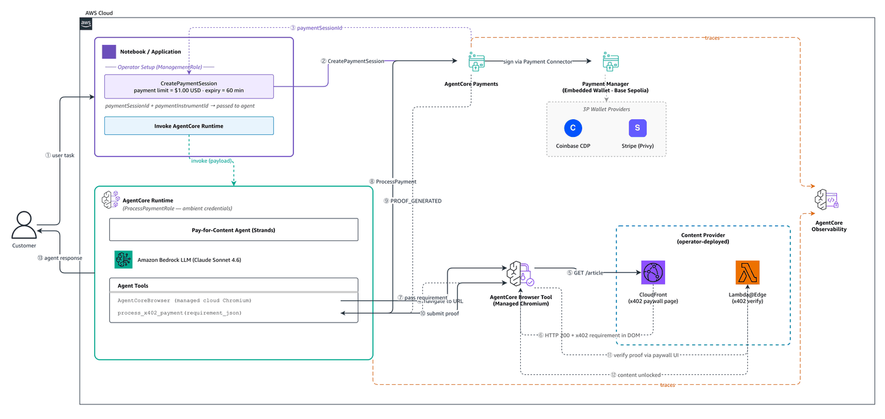
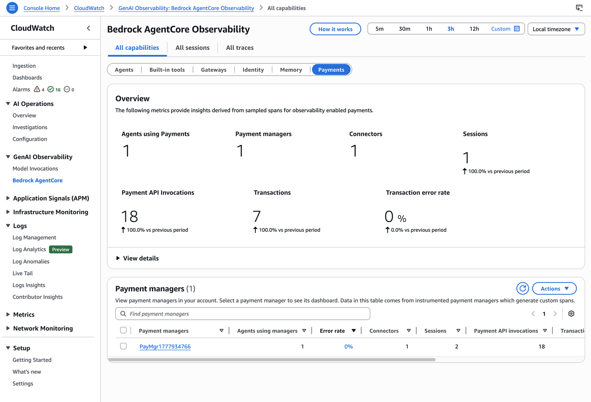
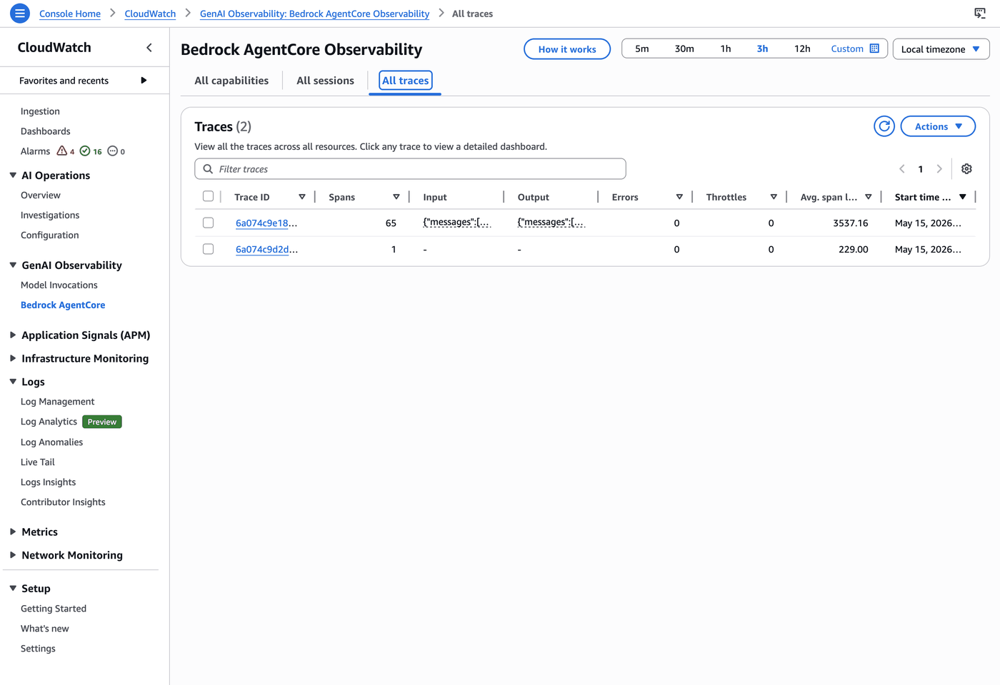
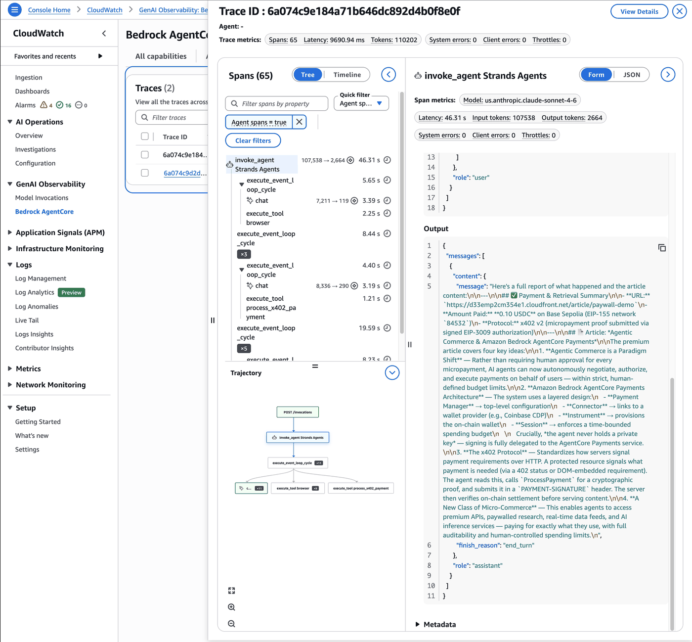

# Pay for Content — Browser Use Case (Amazon Bedrock AgentCore Runtime)

## Overview

In this use case we will build a Strands agent that autonomously pays for and retrieves
content sitting behind a human-facing paywall, using **Amazon Bedrock AgentCore payments**
and the **Amazon Bedrock AgentCore Browser Tool**, **deployed on Amazon Bedrock AgentCore Runtime**. The agent launches
a managed cloud browser, navigates to a paywalled page, reads the embedded x402 payment
requirement from the DOM, generates a cryptographic proof via AgentCore payments, interacts
with the paywall UI, and returns the unlocked content — all without any human involvement
in the payment step.

### Use Case Details

| Information        | Details                                                       |
|:-------------------|:--------------------------------------------------------------|
| Use case type      | Agentic browser automation with autonomous micropayment       |
| Agent type         | Single                                                        |
| Hosting            | AgentCore Runtime (managed microVM, role-segregated)          |
| Payment protocol   | x402 (HTTP 402 Payment Required)                              |
| Agentic Framework  | Strands Agents                                                |
| LLM model          | Anthropic Claude Sonnet 4.6                                   |
| Complexity         | Intermediate                                                  |
| SDK used           | boto3 + AgentCore SDK + AgentCorePaymentsPlugin (Strands)     |
| Wallet type        | Embedded crypto wallet (AgentCore-provisioned, Coinbase CDP)  |
| Network            | Base Sepolia testnet (`eip155:84532`); Solana Devnet available |

### Architecture

The agent runs on AgentCore Runtime under `ProcessPaymentRole`. The notebook (app backend)
runs locally under `ManagementRole`, creates a payment session with a budget, then calls
`InvokeAgentRuntime` with the session/instrument context. The deployed agent uses
`AgentCoreBrowser` (a managed cloud Chromium session) to navigate to a paywall page,
reads the x402 requirement from an embedded `<script>` element, calls `ProcessPayment` to
generate a USDC proof on Base Sepolia, then submits that proof through the page's JavaScript
payment handler. Once the x402 facilitator verifies the on-chain transaction, the content
unlocks and the agent returns it to the caller.

```
Notebook (ManagementRole)              AgentCore Runtime (ProcessPaymentRole)
  │                                     ┌─────────────────────────────────────┐
  │ create_payment_session(budget=$1)   │  agent/payment_agent.py             │
  │                                     │  BedrockAgentCoreApp                │
  │ InvokeAgentRuntime(                 │   ├─ AgentCoreBrowser ──→ Browser   │
  │   manager_arn, session_id,    ────► │   ├─ process_x402_payment           │
  │   instrument_id, paywall_url)       │   └─ AgentCorePaymentsPlugin        │
  │                                     │                                     │
  │◄── unlocked content ──────────────  │  Plugin/PaymentManager call:        │
  │                                     │     ProcessPayment                  │
  │ get_payment_session(check spend)    │  Cannot: CreateSession              │
  │                                     │  Cannot: Override budget            │
  │                                     └─────────────────────────────────────┘
```

<div style="text-align:left">
    
</div>

### Use Case Key Features

* End-to-end agentic browser automation with real on-chain micropayments
* **Hosted on AgentCore Runtime** — managed microVM, ECR-deployed container, automatic scaling
* **Role segregation enforced at infrastructure level** — Runtime container assumes `ProcessPaymentRole` directly
* AgentCore Browser Tool provides a managed cloud Chromium session — no local browser required
* Agent never holds private keys; payment signing is delegated to AgentCore payments
* Human-controlled payment limits via `maxSpendAmount` on the payment session, set by the app backend
* **Built-in observability** — Runtime traces and metrics in CloudWatch GenAI Observability
* x402 v2 protocol with `PAYMENT-SIGNATURE` header and USDC on Base Sepolia testnet
* Provider-agnostic design — swap wallet provider config without changing agent logic

## Prerequisites

To execute this use case you will need:
* Python 3.10+
* Node.js 20+ (for the AgentCore CLI)
* AWS credentials configured (`aws configure`)
* Amazon Bedrock AgentCore access
* Coinbase CDP account — `CDP_API_KEY_NAME`, `CDP_API_KEY_PRIVATE_KEY`, and `CDP_WALLET_SECRET` from the CDP dashboard
  (this example uses Coinbase CDP; StripePrivy is also supported — swap the credential provider config in Step 3a)
  > **Required:** Enable **Delegated Signing** in your CDP project before running the agent.
  > Go to [portal.cdp.coinbase.com](https://portal.cdp.coinbase.com) → your project → **Wallet** → **Embedded Wallets** → **Policies** → enable **Delegated signing**.
  > Without this, `ProcessPayment` will fail with a delegated signing error.
* IAM roles created — run `bash setup_roles.sh` once if not already done. This use case's
  `setup_roles.sh` configures `ProcessPaymentRole` to also serve as the AgentCore Runtime
  execution role (ECR, CloudWatch, X-Ray, Bedrock model invocation, browser tool).
* AgentCore CLI installed: `npm install -g @aws/agentcore`
* [AWS CDK](https://docs.aws.amazon.com/cdk/v2/guide/getting_started.html) installed (used by the CLI)

  > **Content provider:** Deploy the CDK stack before running the agent: `cd content-provider && PAY_TO=0x<your-wallet> bash deploy.sh`. Set `CONTENT_DISTRIBUTION_URL` in `.env` to the printed CloudFront URL.
  > `AgentCoreBrowser` is a cloud-managed browser — it cannot reach `localhost`.

```python
!pip install -r requirements.txt --quiet
```

## Step 1 — Configure Your Environment

We load all required values from a `.env` file. Copy `.env.sample` to `.env` and fill
in the values. Step 3 will populate MANAGER_ARN, PAYMENT_CONNECTOR_ID, and PAYMENT_INSTRUMENT_ID on first run.

```python
import os
from dotenv import load_dotenv

load_dotenv(override=True)

REGION = os.environ.get("AWS_REGION", "us-west-2")

# ── Endpoints ────────────────────────────────────────────────────────────────
# CP: credential provider, manager + connector setup. Built from REGION; override CP_ENDPOINT to point at a different host.
CP_ENDPOINT = os.environ.get("CP_ENDPOINT", f"https://bedrock-agentcore-control.{REGION}.amazonaws.com")
# DP: instrument, session, process payment
DP_ENDPOINT = os.environ.get("DP_ENDPOINT", f"https://bedrock-agentcore.{REGION}.amazonaws.com")

# ── Coinbase CDP credentials ──────────────────────────────────────────────────
CDP_API_KEY_NAME = os.environ["CDP_API_KEY_NAME"]
CDP_API_KEY_PRIVATE_KEY = os.environ["CDP_API_KEY_PRIVATE_KEY"]
CDP_WALLET_SECRET = os.environ["CDP_WALLET_SECRET"]

# ── Embedded wallet identity ───────────────────────────────────────────────────
WALLET_EMAIL = os.environ.get("WALLET_EMAIL", "")  # email linkedAccount for embedded wallet

# ── IAM roles ────────────────────────────────────────────────────────────────
MANAGEMENT_ROLE_ARN = os.environ["MANAGEMENT_ROLE_ARN"]
PROCESS_PAYMENT_ROLE_ARN = os.environ["PROCESS_PAYMENT_ROLE_ARN"]
CONTROL_PLANE_ROLE_ARN = os.environ["CONTROL_PLANE_ROLE_ARN"]
RESOURCE_RETRIEVAL_ROLE_ARN = os.environ["RESOURCE_RETRIEVAL_ROLE_ARN"]

# ── Provisioned resource IDs (populated by Step 3 — skip provisioning on re-runs) ──
MANAGER_ARN = os.environ.get("MANAGER_ARN", "")
PAYMENT_CONNECTOR_ID = os.environ.get("PAYMENT_CONNECTOR_ID", "")
PAYMENT_INSTRUMENT_ID = os.environ.get("PAYMENT_INSTRUMENT_ID", "")
SESSION_ID = os.environ.get("SESSION_ID", "")

# ── Session config ────────────────────────────────────────────────────────────
USER_ID = os.environ.get("USER_ID", "test-user-12345")
SESSION_MAX_SPEND = os.environ.get("SESSION_MAX_SPEND", "1.00")
SESSION_EXPIRY_MINUTES = int(os.environ.get("SESSION_EXPIRY_MINUTES", "60"))

# ── Network / blockchain ───────────────────────────────────────────────────────
# base-sepolia:  eip155:84532                              (default, e2e tested)
# solana-devnet: solana:EtWTRABZaYq6iMfeYKouRu166VU2xqa1  (placeholder, not yet tested)
NETWORK_ALIAS = os.environ.get("NETWORK", "base-sepolia")
NETWORK_MAP = {
    "base-sepolia": {
        "caip2": "eip155:84532",
        "botocore_net": "ETHEREUM",
        "usdc_address": "0x036CbD53842c5426634e7929541eC2318f3dCF7e",
    },
    "solana-devnet": {
        "caip2": "solana:EtWTRABZaYq6iMfeYKouRu166VU2xqa1",
        "botocore_net": "SOLANA",
        "usdc_address": "4zMMC9srt5Ri5X14GAgXhaHii3GnPAEERYPJgZJDncDU",  # pragma: allowlist secret
    },
    "base-mainnet": {
        "caip2": "eip155:8453",
        "botocore_net": "ETHEREUM",
        "usdc_address": "0x833589fCD6eDb6E08f4c7C32D4f71b54bdA02913",
    },
}
if NETWORK_ALIAS not in NETWORK_MAP:
    raise ValueError(f"Unknown NETWORK '{NETWORK_ALIAS}'. Valid: {list(NETWORK_MAP)}")
ACTIVE_NETWORK = NETWORK_MAP[NETWORK_ALIAS]

# ── Content provider ──────────────────────────────────────────────────────────
CONTENT_DISTRIBUTION_URL = os.environ.get(
    "CONTENT_DISTRIBUTION_URL",
    "",
)
PAYWALL_DEMO_URL = f"{CONTENT_DISTRIBUTION_URL}/article/paywall-demo"

print(f"✅ Region:        {REGION}")
print(f"✅ CP:            {CP_ENDPOINT}")
print(f"✅ DP:            {DP_ENDPOINT}")
print(f"✅ Network:       {NETWORK_ALIAS} ({ACTIVE_NETWORK['caip2']})")
print(f"✅ Content URL:   {CONTENT_DISTRIBUTION_URL}")
print(f"✅ Payment limit: ${SESSION_MAX_SPEND} USD")
if MANAGER_ARN:
    print(f"✅ Manager ARN:   {MANAGER_ARN} (loaded from .env — Step 3 will be skipped)")
if SESSION_ID:
    print(f"✅ Session ID:    {SESSION_ID} (loaded from .env — Step 4 will be skipped)")
```

## Step 2 — Initialize AWS Clients

The notebook (app backend) needs two AWS clients. The agent runs on AgentCore Runtime
and uses its execution role's ambient credentials directly — there is no `ProcessPaymentRole`
client constructed here.

| Client | Endpoint | Service name | Used for |
|:-------|:---------|:-------------|:---------|
| `cp_client` | CP (`bedrock-agentcore-control`) | `bedrock-agentcore-control` | `CreatePaymentCredentialProvider`, `CreatePaymentManager`, `CreatePaymentConnector` |
| `mgmt_client` | DP (`bedrock-agentcore`) | `bedrock-agentcore` | `CreatePaymentInstrument`, `CreatePaymentSession`, `GetPaymentSession`, `InvokeAgentRuntime` |

**IAM role separation:**
* `ControlPlaneRole` — credential provider, payment manager, payment connector (control plane)
* `ManagementRole` — creates and manages payment sessions, invokes the deployed agent. Explicit Deny on `ProcessPayment`.
* `ProcessPaymentRole` — the AgentCore Runtime execution role. The container assumes it on launch. Can call `ProcessPayment` and use the browser tool, but has explicit Deny on session/instrument management.

The notebook never needs `ProcessPaymentRole` itself — only Runtime does. The wallet
balance check (Step 3e) does briefly assume it locally for verification only.

```python
import os
from boto3.session import Session
from datetime import datetime

base_session = Session(region_name=REGION)
sts = base_session.client("sts")
ACCOUNT_ID = sts.get_caller_identity()["Account"]
print(f"✅ AWS account: {ACCOUNT_ID}")


def assume_role(role_arn: str, session_name: str) -> Session:
    creds = sts.assume_role(RoleArn=role_arn, RoleSessionName=session_name)["Credentials"]
    sess = Session(
        aws_access_key_id=creds["AccessKeyId"],
        aws_secret_access_key=creds["SecretAccessKey"],
        aws_session_token=creds["SessionToken"],
        region_name=REGION,
    )
    assumed_arn = sess.client("sts").get_caller_identity()["Arn"]
    print(f"  → {assumed_arn}")
    return sess


# ── Control plane client (ControlPlaneRole) ───────────────────────────────────
print("\nAssuming ControlPlaneRole...")
cp_session = assume_role(CONTROL_PLANE_ROLE_ARN, f"cp-setup-{int(datetime.now().timestamp())}")
cp_client = cp_session.client("bedrock-agentcore-control", endpoint_url=CP_ENDPOINT)
print("✅ CP client ready (CreatePaymentCredentialProvider / CreatePaymentManager / CreatePaymentConnector)")

# ── Management client (ManagementRole) — sessions and InvokeAgentRuntime ─────
print("\nAssuming ManagementRole...")
mgmt_session = assume_role(MANAGEMENT_ROLE_ARN, f"payments-mgmt-{int(datetime.now().timestamp())}")
mgmt_client = mgmt_session.client("bedrock-agentcore", endpoint_url=DP_ENDPOINT)
print("✅ Management client ready (CreatePaymentSession / GetPaymentSession / InvokeAgentRuntime)")
```

## Step 3 — Provision Embedded Wallet Resources

These cells run once per user to create the AgentCore payments resource stack:
**CredentialProvider → PaymentManager → PaymentConnection → EmbeddedCryptoWallet Instrument**

If you already have `MANAGER_ARN`, `PAYMENT_CONNECTOR_ID`, and `PAYMENT_INSTRUMENT_ID`
from a previous run, set them in `.env` and skip to Step 4.

> **Embedded wallet:** AgentCore provisions the on-chain wallet — no pre-existing CDP
> wallet is required. The `linkedAccounts` email field ties the wallet to a user identity.
> Coinbase embedded wallets are provisioned synchronously (no OTP/email verification step).
> OTP verification is only required for StripePrivy embedded wallets.

```python
import uuid
import time

# ── 3a. Create Credential Provider ────────────────────────────────────────────
# The credential provider stores your Coinbase CDP API keys securely.
# For StripePrivy: set credentialProviderVendor="StripePrivy" and
# replace coinbaseCdpConfiguration with stripePlatformConfiguration.
#
# IMPORTANT (Coinbase CDP): Delegated Signing must be enabled in your CDP project
# before ProcessPayment will succeed. Go to portal.cdp.coinbase.com → your project → Wallet → Embedded Wallets → Policies → enable Delegated signing.
cred_resp = cp_client.create_payment_credential_provider(
    name=f"CoinbaseCdp{int(time.time())}",
    credentialProviderVendor="CoinbaseCDP",  # or "StripePrivy"
    providerConfigurationInput={
        "coinbaseCdpConfiguration": {
            "apiKeyId": CDP_API_KEY_NAME,
            "apiKeySecret": CDP_API_KEY_PRIVATE_KEY,
            "walletSecret": CDP_WALLET_SECRET,
        }
    },
)
CREDENTIAL_PROVIDER_ARN = cred_resp["credentialProviderArn"]
print(f"✅ Credential Provider: {CREDENTIAL_PROVIDER_ARN}")
```

```python
# ── 3b. Create Payment Manager ────────────────────────────────────────────────
mgr_resp = cp_client.create_payment_manager(
    name=f"PayMgr{int(time.time())}",
    description="AgentCore payments - Pay for Content Browser use case",
    authorizerType="AWS_IAM",
    roleArn=RESOURCE_RETRIEVAL_ROLE_ARN,
    clientToken=str(uuid.uuid4()),
)
MANAGER_ARN = mgr_resp["paymentManagerArn"]
MANAGER_ID = mgr_resp["paymentManagerId"]
print(f"✅ Payment Manager ARN: {MANAGER_ARN}")
print(f"   Manager ID:          {MANAGER_ID}")
```

```python
# ── 3c. Create Payment Connector ─────────────────────────────────────────────
# Links the manager to the credential provider.
# For StripePrivy: set type="StripePrivy" and update credentialProviderConfigurations accordingly.
conn_resp = cp_client.create_payment_connector(
    paymentManagerId=MANAGER_ID,
    name=f"CoinbaseConn{int(time.time())}",
    description="Coinbase CDP connector for embedded wallet",
    type="CoinbaseCDP",  # or "StripePrivy"
    credentialProviderConfigurations=[{"coinbaseCDP": {"credentialProviderArn": CREDENTIAL_PROVIDER_ARN}}],
    clientToken=str(uuid.uuid4()),
)
PAYMENT_CONNECTOR_ID = conn_resp["paymentConnectorId"]
print(f"✅ Payment Connector ID: {PAYMENT_CONNECTOR_ID}")
```

```python
# ── 3d. Create Embedded Crypto Wallet Instrument ──────────────────────────────
# EMBEDDED_CRYPTO_WALLET: AgentCore provisions the wallet — no pre-existing CDP
# wallet needed. The linkedAccounts email ties the wallet to a user identity.
linked_accounts = []
if WALLET_EMAIL:
    linked_accounts = [{"email": {"emailAddress": WALLET_EMAIL}}]

inst_resp = mgmt_client.create_payment_instrument(
    paymentManagerArn=MANAGER_ARN,
    paymentConnectorId=PAYMENT_CONNECTOR_ID,
    userId=USER_ID,
    paymentInstrumentType="EMBEDDED_CRYPTO_WALLET",
    paymentInstrumentDetails={
        "embeddedCryptoWallet": {
            "network": ACTIVE_NETWORK["botocore_net"],  # "ETHEREUM" or "SOLANA"
            "linkedAccounts": linked_accounts,
        }
    },
    clientToken=str(uuid.uuid4()),
)
instrument = inst_resp["paymentInstrument"]
PAYMENT_INSTRUMENT_ID = instrument["paymentInstrumentId"]
wallet_details = instrument.get("paymentInstrumentDetails", {}).get("embeddedCryptoWallet", {})
wallet_address = wallet_details.get("walletAddress", "<pending>")
# WalletHub URL — user opens this to fund wallet and grant signing permission
WALLET_HUB_URL = wallet_details.get("redirectUrl", "")

print(f"✅ Payment Instrument ID: {PAYMENT_INSTRUMENT_ID}")
print(f"   Wallet Address:        {wallet_address}")
print(f"   Network:               {ACTIVE_NETWORK['caip2']}")
if WALLET_HUB_URL:
    print(f"   WalletHub URL:         {WALLET_HUB_URL}")
print()
print("📋 Save these values to .env for future runs:")
print(f"   MANAGER_ARN={MANAGER_ARN}")
print(f"   PAYMENT_CONNECTOR_ID={PAYMENT_CONNECTOR_ID}")
print(f"   PAYMENT_INSTRUMENT_ID={PAYMENT_INSTRUMENT_ID}")
```

### WalletHub — Fund wallet and grant signing permission

AgentCore has provisioned the embedded wallet. Before the agent can make payments,
you must complete setup in **WalletHub**:

1. **Open the WalletHub URL** printed above. Log in with `WALLET_EMAIL`, review the wallet, and click **Grant signing permission**. The agent cannot sign transactions until this step is complete.
2. Fund the wallet using the wallet address printed above:
   - **Base Sepolia:** go to https://faucet.circle.com → select *Base Sepolia* → paste the wallet address
   - **Solana Devnet:** go to https://faucet.circle.com → select *Solana Devnet* → paste the wallet address
3. **If no WalletHub URL was returned and the instrument status is `ACTIVE`**, the wallet is already authorized for signing. Funding via the faucet is still required before payments succeed.

Once funded, press Enter in the cell below to continue.

```python
input("Press Enter after you've funded the wallet and granted signing permission in WalletHub...")
```

### Step 3e — Verify Wallet Balance

After funding the wallet via WalletHub and the testnet faucet, verify the USDC balance
before attempting a payment. If the balance shows 0, the faucet transaction may still be
pending — wait a minute and re-run this cell.

This is the only cell where the notebook briefly assumes `ProcessPaymentRole` locally —
solely to call `GetPaymentInstrumentBalance` for verification. The actual payment will
execute inside the deployed Runtime container under the same role. This API supports both
Coinbase CDP and StripePrivy wallets on Ethereum and Solana networks.

```python
# Briefly assume ProcessPaymentRole here just to call GetPaymentInstrumentBalance.
# The deployed agent on Runtime will use this same role's permissions automatically.
print("Assuming ProcessPaymentRole for balance check...")
balance_check_session = assume_role(PROCESS_PAYMENT_ROLE_ARN, f"balance-check-{int(datetime.now().timestamp())}")
balance_check_client = balance_check_session.client("bedrock-agentcore", endpoint_url=DP_ENDPOINT)

try:
    balance_resp = balance_check_client.get_payment_instrument_balance(
        paymentManagerArn=MANAGER_ARN,
        paymentConnectorId=PAYMENT_CONNECTOR_ID,
        paymentInstrumentId=PAYMENT_INSTRUMENT_ID,
        userId=USER_ID,
        chain="BASE_SEPOLIA",
        token="USDC",
    )
    token_balance = balance_resp.get("tokenBalance", {})
    if token_balance:
        amount_units = int(token_balance.get("amount", 0))
        decimals = token_balance.get("decimals", 6)
        readable = amount_units / (10**decimals)
        print(
            f"✅ Wallet balance: {readable:.6f} {token_balance.get('token', 'USDC')} on {token_balance.get('chain', 'unknown')}"
        )
    else:
        print("⚠️  Balance returned empty — faucet may still be pending")
    print(f"   Instrument ID: {PAYMENT_INSTRUMENT_ID}")
except Exception as e:
    print(f"⚠️  GetPaymentInstrumentBalance failed: {e}")
    print("   Verify bedrock-agentcore:GetPaymentInstrumentBalance is in the ProcessPaymentRole policy.")
    print("   Continue to Step 4 if the wallet is funded.")
```

## Step 4 — Create a Payment Session

A payment session enforces payment limits and a time-bound authorization for the agent to spend.
The notebook creates the session via `ManagementRole` — the agent only uses
`ProcessPaymentRole` and cannot create or modify sessions.

Set `SESSION_MAX_SPEND` and `SESSION_EXPIRY_MINUTES` in `.env` to control the payment limits.

```python
import uuid

session_response = mgmt_client.create_payment_session(
    paymentManagerArn=MANAGER_ARN,
    # userId maps to the X-Amzn-Bedrock-AgentCore-Payments-User-Id HTTP header
    userId=USER_ID,
    expiryTimeInMinutes=SESSION_EXPIRY_MINUTES,
    limits={
        "maxSpendAmount": {
            "value": SESSION_MAX_SPEND,  # must be a string
            "currency": "USD",  # USD not USDC — service converts for budget enforcement
        }
    },
    clientToken=str(uuid.uuid4()),
)

payment_session = session_response["paymentSession"]
SESSION_ID = payment_session["paymentSessionId"]

print("✅ Payment session created")
print(f"   Session ID:  {SESSION_ID}")
print(f"   Payment limit: ${SESSION_MAX_SPEND} USD")
print(f"   Expires:     {SESSION_EXPIRY_MINUTES} minutes from now")

if "availableLimits" in payment_session:
    available = payment_session["availableLimits"]["availableSpendAmount"]
    print(f"   Available:   {available['value']} {available['currency']}")
```

> **Note: two valid x402 browser patterns**
>
> The [AgentCore Browser docs](https://docs.aws.amazon.com/bedrock-agentcore/latest/devguide/payments-browser.html) show the browser pattern using raw Playwright with HTTP 402 response interception (`page.on("response", ...)` → `PaymentClient.process_payment` → `page.route()` to inject auth headers on retry). That pattern fits API endpoints accessed through a browser.
>
> This notebook uses a different pattern because real consumer paywalls — NYT, FT, Substack, and similar sites — don't return HTTP 402. They render the page normally (HTTP 200), display the article preview, and hide the premium content behind a payment UI. To reflect that, the content provider here returns HTTP 200 with the x402 requirement embedded in the page DOM (the rendered HTML structure) — specifically inside a `<script id="x402-requirement">` tag that the agent reads after the page loads.
>
> Because there's no HTTP 402 on the response, the plugin's auto-intercept hook doesn't fire. Instead, the agent reads the requirement directly from the page and calls `PaymentManager.generate_payment_header` to produce the proof. The underlying `ProcessPayment` API is the same — only the source of the requirement differs.

## Step 4b — Enable Payment Manager Observability

Per the [AgentCore Payments observability doc](https://docs.aws.amazon.com/bedrock-agentcore/latest/devguide/payments-observability.html), Payment Manager telemetry is **opt-in per resource** via vended log delivery. Enabling it makes the Payment Manager show up in the **AgentCore Observability → Payments** dashboard with sessions, transactions, and per-API metrics.

This is the 4-step setup the doc describes (Steps 0–4) plus the agent-side wiring needed to populate the *Agents using Payments* counter.

> **Browser caveat:** AgentCore Browser does not currently support per-resource vended log delivery (`PutDeliverySource` rejects browser ARNs with: *valid resource types are runtime / gateway / memory / payment-manager / code-interpreter / workload-identity*). Browser-tool actions still appear as spans inside the agent trace via the OTEL distro — `browser session start`, `navigate`, `cleanup` — but no separate Browser-service dashboard exists today.

```python
# Run the 4-step vended log delivery setup against the Payment Manager.
# This is idempotent: it skips any step whose resource already exists.
import boto3

logs = boto3.client("logs", region_name=REGION)

LG_NAME = f"/aws/vendedlogs/bedrock-agentcore/{MANAGER_ARN.split('/')[-1].split('-')[0]}"
LG_ARN = f"arn:aws:logs:{REGION}:{ACCOUNT_ID}:log-group:{LG_NAME}"

# Step 0 — log group
try:
    logs.create_log_group(logGroupName=LG_NAME)
    logs.put_retention_policy(logGroupName=LG_NAME, retentionInDays=30)
    print(f"✅ Created log group {LG_NAME}")
except logs.exceptions.ResourceAlreadyExistsException:
    print(f"  ↻ Log group exists: {LG_NAME}")

# Step 1 — application logs delivery source
try:
    logs.put_delivery_source(
        name="payforcontent-payments-logs",
        resourceArn=MANAGER_ARN,
        logType="APPLICATION_LOGS",
    )
    print("✅ Logs delivery source created")
except logs.exceptions.ConflictException:
    print("  ↻ Logs delivery source exists")

# Step 2 — traces delivery source
try:
    logs.put_delivery_source(
        name="payforcontent-payments-traces",
        resourceArn=MANAGER_ARN,
        logType="TRACES",
    )
    print("✅ Traces delivery source created")
except logs.exceptions.ConflictException:
    print("  ↻ Traces delivery source exists")

# Step 3a — CloudWatch Logs delivery destination
try:
    logs.put_delivery_destination(
        name="payforcontent-payments-logs-dest",
        deliveryDestinationType="CWL",
        deliveryDestinationConfiguration={"destinationResourceArn": LG_ARN},
    )
    print("✅ Logs delivery destination created")
except logs.exceptions.ConflictException:
    print("  ↻ Logs delivery destination exists")

# Step 3b — X-Ray traces destination
try:
    logs.put_delivery_destination(
        name="payforcontent-payments-traces-dest",
        deliveryDestinationType="XRAY",
    )
    print("✅ Traces delivery destination created")
except logs.exceptions.ConflictException:
    print("  ↻ Traces delivery destination exists")

# Step 4a — wire logs source → destination
try:
    logs.create_delivery(
        deliverySourceName="payforcontent-payments-logs",
        deliveryDestinationArn=f"arn:aws:logs:{REGION}:{ACCOUNT_ID}:delivery-destination:payforcontent-payments-logs-dest",
    )
    print("✅ Logs delivery created")
except logs.exceptions.ConflictException:
    print("  ↻ Logs delivery exists")

# Step 4b — wire traces source → destination
try:
    logs.create_delivery(
        deliverySourceName="payforcontent-payments-traces",
        deliveryDestinationArn=f"arn:aws:logs:{REGION}:{ACCOUNT_ID}:delivery-destination:payforcontent-payments-traces-dest",
    )
    print("✅ Traces delivery created")
except logs.exceptions.ConflictException:
    print("  ↻ Traces delivery exists")

print()
print("Payment Manager observability enabled. After your first invoke,")
print("the AgentCore Observability → Payments tab will populate with this manager.")
```

## Step 5 — Deploy the Agent to AgentCore Runtime

The agent code lives in [`agent/payment_agent.py`](agent/payment_agent.py). It's a
Strands agent wrapped in `BedrockAgentCoreApp` and decorated with `@app.entrypoint`.
It accepts the payment session, instrument, manager ARN, user ID, and target paywall URL
from the invocation payload — there is no `assume_role` inside the agent.

We use the **AgentCore CLI** (`agentcore`) to package the agent into a container, push to
ECR via CodeBuild (no local Docker required), and create an `AgentRuntime` with
`ProcessPaymentRole` as the execution role.

**Build choice — Container, not CodeZip.** This use case needs Playwright (for
`AgentCoreBrowser`), and Playwright bundles a Node.js driver binary that loses its
executable bit when packaged as a CodeZip artifact. The Container build runs in CodeBuild,
preserves file modes, and lets us re-`chmod` the Playwright driver in a Dockerfile step.

**Lifecycle settings.** `idleRuntimeSessionTimeout=600` (10 min) and `maxLifetime=1800`
(30 min) — generous headroom for the 1–3 minute browser flow without holding microVMs
longer than necessary.

**Python 3.13.** The CLI defaults to PYTHON_3_14 today, but the Strands + anyio combination
hits a `weakref.NoneType` bug there. We pin to PYTHON_3_13.

```python
import subprocess
import shutil
import json as _json

AGENT_NAME = os.environ.get("AGENT_NAME", "PayForContentBrowserAgent")
PROJECT_NAME = os.environ.get("AGENT_PROJECT_NAME", "payforcontent")
RUNTIME_DIR = PROJECT_NAME


def run(cmd, **kw):
    """Run a command and surface stdout/stderr on failure."""
    result = subprocess.run(cmd, capture_output=True, text=True, **kw)
    if result.returncode != 0:
        print("stdout:", result.stdout[-500:])
        print("stderr:", result.stderr[-500:])
        raise RuntimeError(f"Command failed: {' '.join(cmd)}")
    return result


# ── 5a. Scaffold the project (idempotent) ─────────────────────────────────────
if not os.path.isdir(RUNTIME_DIR):
    print(f"Scaffolding {RUNTIME_DIR}/ ...")
    run(
        [
            "agentcore",
            "create",
            "--name",
            AGENT_NAME,
            "--project-name",
            PROJECT_NAME,
            "--defaults",
            "--no-agent",  # we add our own BYO agent below
            "--skip-git",
            "--skip-python-setup",
            "--skip-install",
            "--json",
        ]
    )

    # 5a.i. Add the agent as Container build pointing at our existing code
    run(
        [
            "agentcore",
            "add",
            "agent",
            "--type",
            "byo",
            "--name",
            AGENT_NAME,
            "--build",
            "Container",
            "--language",
            "Python",
            "--framework",
            "Strands",
            "--model-provider",
            "Bedrock",
            "--code-location",
            f"app/{AGENT_NAME}",
            "--entrypoint",
            "main.py",
            "--network-mode",
            "PUBLIC",
            "--protocol",
            "HTTP",
            "--idle-timeout",
            "600",
            "--max-lifetime",
            "1800",
            "--json",
        ],
        cwd=RUNTIME_DIR,
    )

# ── 5b. Copy the agent code, requirements, and Dockerfile into the scaffold ──
agent_dst = os.path.join(RUNTIME_DIR, "app", AGENT_NAME)
os.makedirs(agent_dst, exist_ok=True)
shutil.copy("agent/payment_agent.py", os.path.join(agent_dst, "main.py"))
shutil.copy("agent/requirements.txt", os.path.join(agent_dst, "requirements.txt"))
shutil.copy("agent/Dockerfile", os.path.join(agent_dst, "Dockerfile"))
print(f"✅ Copied agent + Dockerfile into {agent_dst}/")

# ── 5c. Pin executionRoleArn + Python 3.13 in the runtime config ─────────────
config_path = os.path.join(RUNTIME_DIR, "agentcore", "agentcore.json")
with open(config_path) as f:
    project_config = _json.load(f)

found = False
for runtime in project_config.get("runtimes", []):
    if runtime.get("name") == AGENT_NAME:
        runtime["executionRoleArn"] = PROCESS_PAYMENT_ROLE_ARN
        runtime["runtimeVersion"] = "PYTHON_3_13"
        found = True
        break
if not found:
    raise RuntimeError(f"Could not find runtime '{AGENT_NAME}' in {config_path}")

with open(config_path, "w") as f:
    _json.dump(project_config, f, indent=2)
print(f"✅ executionRoleArn = {PROCESS_PAYMENT_ROLE_ARN}")
print("✅ runtimeVersion   = PYTHON_3_13")

# ── 5d. Set the deployment target (account + region) ─────────────────────────
targets_path = os.path.join(RUNTIME_DIR, "agentcore", "aws-targets.json")
with open(targets_path, "w") as f:
    _json.dump(
        [
            {
                "name": "default",
                "description": "Pay for Content (Browser Use) — Runtime deployment",
                "account": ACCOUNT_ID,
                "region": REGION,
            }
        ],
        f,
        indent=2,
    )
print(f"✅ Deployment target: {ACCOUNT_ID} / {REGION}")

# ── 5e. Install CDK npm deps the CLI needs at deploy time ────────────────────
cdk_dir = os.path.join(RUNTIME_DIR, "agentcore", "cdk")
if not os.path.isdir(os.path.join(cdk_dir, "node_modules")):
    print(f"Installing CDK npm deps in {cdk_dir}/ ...")
    run(["npm", "install", "--silent"], cwd=cdk_dir)
    print("✅ CDK deps installed")
```

### 5f — Deploy to AWS

`agentcore deploy` synthesizes the CDK stack, kicks off CodeBuild (which builds the
Docker image and pushes to ECR), then creates the AgentRuntime.

> **First deploy can take 5–10 minutes** (CodeBuild image build dominates).

```python
print("Deploying to AgentCore Runtime — this can take 5-10 minutes (CodeBuild)...")
run(["agentcore", "deploy", "--yes"], cwd=RUNTIME_DIR)
print("✅ Agent deployed")
```

```python
# Capture the deployed agent runtime ARN.
# `agentcore status --json` returns a list of resources; we pick our agent.
# The CLI may append a non-JSON upgrade notice after the JSON document, so we
# locate the first JSON value and let the decoder consume just that.
status_proc = subprocess.run(
    ["agentcore", "status", "--type", "agent", "--json"],
    cwd=RUNTIME_DIR,
    capture_output=True,
    text=True,
    check=True,
)
stdout = status_proc.stdout
start = next((i for i, ch in enumerate(stdout) if ch in "{["), -1)
if start < 0:
    raise RuntimeError(f"Could not find JSON in agentcore status output:\n{stdout}")
status, _ = _json.JSONDecoder().raw_decode(stdout[start:])
entries = status if isinstance(status, list) else status.get("resources", [])

agent_runtime_arn = None
for entry in entries:
    name = entry.get("name") or entry.get("agentName")
    if name == AGENT_NAME:
        agent_runtime_arn = (
            entry.get("identifier") or entry.get("agentRuntimeArn") or entry.get("runtimeArn") or entry.get("arn")
        )
        break

if not agent_runtime_arn:
    print("Raw status output:")
    print(_json.dumps(status, indent=2))
    raise RuntimeError("Could not locate agent runtime ARN in status output")

AGENT_RUNTIME_ARN = agent_runtime_arn
print(f"✅ Agent Runtime ARN: {AGENT_RUNTIME_ARN}")
```

## Step 6 — Invoke the Deployed Agent

Call `InvokeAgentRuntime` with the payment context in the payload. The agent runs in its
microVM, drives the browser, processes the payment under `ProcessPaymentRole`, and returns
the unlocked content.

The container's ambient credentials are `ProcessPaymentRole` — the agent code never calls
`sts:AssumeRole`. Role separation is enforced by the Runtime infrastructure, not by code.

```python
import json

invoke_payload = {
    "prompt": (
        f"Please retrieve the premium article from {PAYWALL_DEMO_URL}. "
        f"Pay for it using x402 and give me a summary of what it contains."
    ),
    "paywall_url": PAYWALL_DEMO_URL,
    "payment_manager_arn": MANAGER_ARN,
    "user_id": USER_ID,
    "payment_session_id": SESSION_ID,
    "payment_instrument_id": PAYMENT_INSTRUMENT_ID,
}

response = mgmt_client.invoke_agent_runtime(
    agentRuntimeArn=AGENT_RUNTIME_ARN,
    payload=json.dumps(invoke_payload).encode("utf-8"),
    contentType="application/json",
    accept="application/json",
)

result_bytes = (
    response["response"].read() if hasattr(response.get("response"), "read") else response.get("response", b"")
)
result = json.loads(result_bytes.decode("utf-8")) if result_bytes else {}
print(result.get("response", result))
```

### Verify the payment was recorded

Check the session under `ManagementRole` to confirm the agent's spend was captured.

```python
session_check = mgmt_client.get_payment_session(
    paymentManagerArn=MANAGER_ARN,
    paymentSessionId=SESSION_ID,
    userId=USER_ID,
)

session_data = session_check["paymentSession"]
print("✅ Session verified")
print(f"   Session ID:  {session_data['paymentSessionId']}")
print(f"   Payment limit: ${SESSION_MAX_SPEND} USD")
if "availableLimits" in session_data:
    remaining = session_data["availableLimits"]["availableSpendAmount"]
    print(f"   Remaining:   {remaining['value']} {remaining['currency']}")
```

## Step 7 — Observability

AgentCore emits structured telemetry for every layer in this use case. Once Step 4b ran, all four signals below show up in the **AgentCore Observability** dashboard:

| Layer | Source | Where it shows |
|---|---|---|
| Runtime | `agentcore deploy` enables OTEL via the container's `opentelemetry-instrument` CMD | Bedrock AgentCore → All traces |
| Agent (Strands) | Strands emits OTEL spans through the Runtime distro | Inside each trace's waterfall |
| Browser tool | Strands `AgentCoreBrowser` tool emits client-side spans (start session, navigate, cleanup) | Inside each trace's waterfall (no separate Browser dashboard yet) |
| Payment Manager | Vended logs + X-Ray spans (Step 4b setup) | Bedrock AgentCore → **Payments** tab |

### Agent attribution (`payment_agent_name`)

The dashboard's *Agents using Payments* counter increments **only when each Payments API call carries the `X-Amzn-Bedrock-AgentCore-Payments-Agent-Name` HTTP header**. The SDK injects it automatically when you construct `PaymentManager` and `AgentCorePaymentsPluginConfig` with `agent_name=`. Our `agent/payment_agent.py` reads `AGENT_NAME` from the container environment and passes it to both, so every span carries `payment_agent_name=PayForContentBrowserAgent` and the dashboard attributes activity back to this agent.

### Where to look

1. Open the [CloudWatch GenAI Observability console](https://console.aws.amazon.com/cloudwatch/home#gen-ai-observability:agent-core) in `us-west-2`.
2. **Payments tab** — populated Payment Managers table, sessions count, API invocation count, error rate, *Agents using Payments* attribution.
3. **All traces tab** — list of trace IDs across all your agents.
4. Click into a trace to see the full waterfall: `execute_event_loop_cycle` → `chat` → `execute_tool browser` → `execute_tool process_x402_payment` → `ProcessPayment`.

Below is what a successful Pay for Content session looks like in the dashboard:

<div style="text-align:left">
    <strong>Payments tab</strong><br/>
    
</div>

<div style="text-align:left">
    <strong>All traces</strong><br/>
    
</div>

<div style="text-align:left">
    <strong>Trace detail (one invocation)</strong><br/>
    
</div>

> **Note:** Wallet addresses and proof signatures appear in trace inputs/outputs.
> When sharing screenshots, redact wallet addresses and the `PAYMENT-SIGNATURE` header value.

The Runtime also publishes metrics to the `bedrock-agentcore` CloudWatch namespace:
session count, invocation duration, tool error rate. You can build alarms on these for
budget overruns or sustained payment failures.

## Cleanup

The payment session you created in Step 4 has a built-in expiry (60 minutes by default).
Once expired, the agent can no longer spend through it.

The AgentCore Runtime deployment incurs charges for compute, storage, and ECR. Tear it
down when done:

```bash
cd PayForContentRuntime && agentcore remove all -y
```

This removes the AgentRuntime, the ECR repository, the CodeBuild project, and the
CloudWatch log groups created by the CLI.

You can also delete the payment manager, connector, instrument, and credential provider
via the AWS CLI or boto3 if you want a fully clean account.

```python
# Verify the session's remaining limit and time before expiry.
# The session will automatically stop accepting payments after expiry; no API call required.
session_check = mgmt_client.get_payment_session(
    paymentManagerArn=MANAGER_ARN,
    paymentSessionId=SESSION_ID,
    userId=USER_ID,
)
session_data = session_check["paymentSession"]
print(f"Session ID:    {session_data['paymentSessionId']}")
if "availableLimits" in session_data:
    remaining = session_data["availableLimits"]["availableSpendAmount"]
    print(f"Remaining:     {remaining['value']} {remaining['currency']}")
```

## Shared responsibility

| Concern                       | AWS / AgentCore                                          | You (the customer)                                  |
|:------------------------------|:---------------------------------------------------------|:----------------------------------------------------|
| Runtime container isolation   | microVM per session, automatic teardown                  | Set `idleTimeout`, `maxLifetime` to your workload   |
| Payment signing keys          | Held in AgentCore identity / Coinbase CDP delegated      | Enable Delegated Signing in CDP project             |
| Spend limits                  | Service enforces `maxSpendAmount` per session            | Set per-session budget appropriate for the task     |
| IAM role segregation          | Runtime assumes the execution role you specified         | Author least-privilege role policies (see `setup_roles.sh`) |
| Observability ingestion       | Traces + metrics emitted automatically                   | Build alarms on the metrics you care about          |
| Wallet funding                | Embedded wallet provisioned by AgentCore                 | Fund via faucet (testnet) or onramp (production)    |
| Browser session security      | Containerized Chromium, ephemeral, optional recording    | Avoid logging in to production accounts via the agent |

# Congratulations!

You've deployed an end-to-end agentic payment use case on AgentCore Runtime — managed
hosting, role-segregated execution, and built-in observability. The agent autonomously
browsed a paywalled page, paid via x402, and returned the unlocked content, all while
the spend was capped by a session you created.
