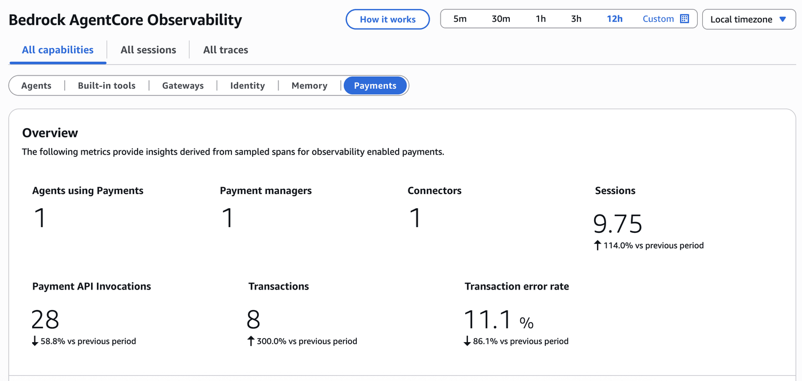

# Pay for Data — Heurist Finance Agent

## Overview

A finance research agent that pays for real-time market data using **Amazon Bedrock AgentCore payments**. The agent calls paid [Heurist](https://heurist.xyz) endpoints for live prices, SEC filings, and macro indicators, analyzes the data with AgentCore Code Interpreter, and returns charts and reports as S3 presigned URLs — all without any manual payment code in the tools.

The agent is deployed to **AgentCore Runtime**: a managed container endpoint with HTTPS invocation, SigV4 auth, and automatic observability via CloudWatch.

### Use Case Details

| Information | Details |
|:---|:---|
| Use case type | Agentic data retrieval with autonomous micropayments |
| Agent type | Single |
| Payment protocol | x402 (HTTP 402 Payment Required) |
| Agentic framework | [Strands Agents](https://strandsagents.com/) |
| LLM model | Claude Sonnet 4.6 on Amazon Bedrock (configurable) |
| SDK used | `bedrock-agentcore[strands-agents]` (public PyPI) |
| Wallet type | Embedded crypto wallet (Coinbase CDP) |
| Payment network | Base Sepolia testnet (USDC) — swap to mainnet via `NETWORK` in `.env` |

### Architecture

```
Notebook (ManagementRole)                AgentCore Runtime (ProcessPaymentRole)
  |                                        +------------------------------+
  | create_payment_session(budget=$X)      |  runtime_agent.py            |
  |                                        |  BedrockAgentCoreApp         |
  |-- invoke_agent_runtime(           -->  |  + AgentCorePaymentsPlugin   |
  |     manager_arn, session_id,           |                              |
  |     instrument_id, prompt)             |  http_request -> 402         |
  |                                        |  -> ProcessPayment -> retry  |
  |<-- {response, artifacts: [{url}]} ---  |  -> Code Interpreter         |
  |                                        |  -> export to S3             |
  | get_payment_session(check spend)       +------------------------------+
                                                      |
                                                      v
                                          CloudWatch GenAI Observability
                                          (automatic via OpenTelemetry)
```

### AgentCore Capabilities Demonstrated

| Capability | How it is used here |
|:---|:---|
| **Payment manager** | Central resource that authorizes and tracks all payment activity. |
| **Payment instrument** | An embedded crypto wallet (Coinbase CDP, USDC on Base). |
| **Payment session** | A time-bounded, budget-capped authorization (`maxSpendAmount`). |
| **Payment processing** | End-to-end x402 negotiation, proof generation, retry, and on-chain settlement. |
| **AgentCore Runtime** | Managed container hosting with HTTPS endpoint and SigV4 auth. |
| **AgentCore Code Interpreter** | Remote sandboxed Python environment for pandas/matplotlib analysis. |
| **Observability** | Automatic OTel traces + logs in CloudWatch GenAI dashboard. |

### Notebook Flow

| Step | What happens |
|------|-------------|
| 1 | Configure credentials and confirm AWS identity |
| 2 | Sync the Heurist tool catalog |
| 3 | Create the S3 artifacts bucket |
| 4 | Provision embedded wallet resources (CredentialProvider → Manager → Connector → Instrument) |
| 5 | Fund the wallet and complete WalletHub delegation |
| 6 | Enable Payment Manager observability (vended log delivery) |
| 7 | Deploy to AgentCore Runtime |
| 8 | Grant execution role permissions |
| 9 | Invoke the deployed agent |
| 10 | View observability in CloudWatch |
| 11 | Cleanup |

**Before running:**
1. `pip install -r requirements.txt`
2. `cp .env.example .env` and fill in your Coinbase CDP credentials and IAM role ARNs
3. Ensure Node.js 20+, Docker, and AWS CDK are installed
4. Enable **Delegated Signing** in your CDP project: [portal.cdp.coinbase.com](https://portal.cdp.coinbase.com) → your project → **Wallet** → **Embedded Wallets** → **Policies** → enable **Delegated signing**.

See [`README.md`](README.md) for full setup details.

## Install dependencies

```python
%pip install -r requirements.txt --quiet
```

## Step 1 — Configure credentials

Load credentials from `.env` and confirm AWS identity. Copy `.env.example` to `.env` and fill in your values.

This step only validates region, account, and role ARNs — payment resource IDs will be populated in Step 4.

```python
import os
import json
import time
import uuid
from datetime import datetime
from dotenv import load_dotenv
import boto3
from boto3.session import Session

load_dotenv(override=True)

REGION = os.environ.get("AWS_REGION", "us-west-2")

# ── Endpoints ──────────────────────────────────────────────────────────────
CP_ENDPOINT = os.environ.get("CP_ENDPOINT", f"https://bedrock-agentcore-control.{REGION}.amazonaws.com")
DP_ENDPOINT = os.environ.get("DP_ENDPOINT", f"https://bedrock-agentcore.{REGION}.amazonaws.com")

# ── Coinbase CDP credentials (required for embedded wallet) ────────────────
CDP_API_KEY_NAME = os.environ["CDP_API_KEY_NAME"]
CDP_API_KEY_PRIVATE_KEY = os.environ["CDP_API_KEY_PRIVATE_KEY"]
CDP_WALLET_SECRET = os.environ["CDP_WALLET_SECRET"]
WALLET_EMAIL = os.environ.get("WALLET_EMAIL", "")

# ── IAM roles ──────────────────────────────────────────────────────────────
MANAGEMENT_ROLE_ARN = os.environ["MANAGEMENT_ROLE_ARN"]
PROCESS_PAYMENT_ROLE_ARN = os.environ["PROCESS_PAYMENT_ROLE_ARN"]
CONTROL_PLANE_ROLE_ARN = os.environ["CONTROL_PLANE_ROLE_ARN"]
RESOURCE_RETRIEVAL_ROLE_ARN = os.environ["RESOURCE_RETRIEVAL_ROLE_ARN"]

# ── Previously provisioned resource IDs (loaded from .env on re-runs) ──────
MANAGER_ARN = os.environ.get("MANAGER_ARN", "")
PAYMENT_CONNECTOR_ID = os.environ.get("PAYMENT_CONNECTOR_ID", "")
PAYMENT_INSTRUMENT_ID = os.environ.get("PAYMENT_INSTRUMENT_ID", "")

# ── Session config ─────────────────────────────────────────────────────────
USER_ID = os.environ.get("USER_ID", "heurist-demo-user")
SESSION_MAX_SPEND = os.environ.get("SESSION_MAX_SPEND", "0.25")
SESSION_EXPIRY_MINUTES = int(os.environ.get("SESSION_EXPIRY_MINUTES", "60"))

# ── Network / blockchain ───────────────────────────────────────────────────
# base-mainnet: eip155:8453   (default — mainnet, real USDC settled on-chain)
# base-sepolia: eip155:84532  (testnet — free faucet, but Heurist Sepolia x402 currently fails EIP-712 simulation)
NETWORK_ALIAS = os.environ.get("NETWORK", "base-mainnet")
NETWORK_MAP = {
    "base-sepolia": {
        "caip2": "eip155:84532",
        "botocore_net": "ETHEREUM",
        "usdc_address": "0x036CbD53842c5426634e7929541eC2318f3dCF7e",
        "chain_enum": "BASE_SEPOLIA",
    },
    "base-mainnet": {
        "caip2": "eip155:8453",
        "botocore_net": "ETHEREUM",
        "usdc_address": "0x833589fCD6eDb6E08f4c7C32D4f71b54bdA02913",
        "chain_enum": "BASE_MAINNET",
    },
}
if NETWORK_ALIAS not in NETWORK_MAP:
    raise ValueError(f"Unknown NETWORK '{NETWORK_ALIAS}'. Valid: {list(NETWORK_MAP)}")
ACTIVE_NETWORK = NETWORK_MAP[NETWORK_ALIAS]

# ── Bedrock model ──────────────────────────────────────────────────────────
BEDROCK_MODEL_ID = os.environ.get("BEDROCK_MODEL_ID", "us.anthropic.claude-sonnet-4-6")

# ── AWS clients ────────────────────────────────────────────────────────────
base_session = Session(region_name=REGION)
sts = base_session.client("sts")
ACCOUNT_ID = sts.get_caller_identity()["Account"]


def assume_role(role_arn: str, session_name: str) -> Session:
    creds = sts.assume_role(RoleArn=role_arn, RoleSessionName=session_name)["Credentials"]
    sess = Session(
        aws_access_key_id=creds["AccessKeyId"],
        aws_secret_access_key=creds["SecretAccessKey"],
        aws_session_token=creds["SessionToken"],
        region_name=REGION,
    )
    assumed_arn = sess.client("sts").get_caller_identity()["Arn"]
    print(f"  → {assumed_arn}")
    return sess


# Control-plane client: CreatePaymentCredentialProvider / Manager / Connector
print("Assuming ControlPlaneRole...")
cp_session = assume_role(CONTROL_PLANE_ROLE_ARN, f"cp-setup-{int(datetime.now().timestamp())}")
cp_client = cp_session.client("bedrock-agentcore-control", endpoint_url=CP_ENDPOINT)
print("✅ CP client ready")

# Management client: CreatePaymentSession / GetPaymentSession / InvokeAgentRuntime
print("Assuming ManagementRole...")
mgmt_session = assume_role(MANAGEMENT_ROLE_ARN, f"heurist-mgmt-{int(datetime.now().timestamp())}")
mgmt_client = mgmt_session.client("bedrock-agentcore", endpoint_url=DP_ENDPOINT)
print("✅ Management client ready")

print(f"\nRegion:   {REGION}")
print(f"Account:  {ACCOUNT_ID}")
print(f"Network:  {NETWORK_ALIAS} ({ACTIVE_NETWORK['caip2']})")
print(f"Model:    {BEDROCK_MODEL_ID}")
if MANAGER_ARN:
    print(f"Manager ARN loaded from .env — Step 4 will be skipped: {MANAGER_ARN}")
```

## Step 2 — Sync the Heurist tool catalog

Fetches the current registry of x402-enabled endpoints from the Heurist mesh and caches it locally. The Runtime container image bundles this cache at build time — the deployed agent reads the catalog without calling the Heurist registry at startup.

Re-run this cell before deploying to ensure the container has a current catalog.

```python
import sys

sys.path.insert(0, "agent")
from catalog import fetch_live_catalog, get_tools_for_agents
from config import DEFAULT_HEURIST_AGENT_IDS

HEURIST_AGENT_IDS = (
    tuple(a.strip() for a in os.environ.get("HEURIST_AGENT_IDS", "").split(",") if a.strip())
    or DEFAULT_HEURIST_AGENT_IDS
)

catalog = fetch_live_catalog()
selected = get_tools_for_agents(HEURIST_AGENT_IDS)

print(f"Agents in registry: {catalog['count']}")
print(f"Selected agents:    {', '.join(HEURIST_AGENT_IDS)}")
print(f"Loaded paid tools:  {len(selected)}")
print()
for t in selected:
    print(f"  {t['agent_id']:30s}  {t['tool_name']:35s}  ${t['price_usd']:.3f}")
```

## Step 3 — Create the S3 artifacts bucket

Charts, reports, and CSVs produced by the agent in Code Interpreter are uploaded to S3. The agent returns presigned download URLs valid for `CI_ARTIFACTS_TTL` seconds (default: 1 hour).

The bucket is private; no public access is granted. Skip this cell if you already have a bucket — just set `ARTIFACTS_BUCKET` to its name.

```python
ARTIFACTS_BUCKET = os.environ.get(
    "ARTIFACTS_BUCKET",
    f"heurist-finance-artifacts-{ACCOUNT_ID}-{REGION}",
)

s3 = boto3.client("s3", region_name=REGION)
try:
    if REGION == "us-east-1":
        s3.create_bucket(Bucket=ARTIFACTS_BUCKET)
    else:
        s3.create_bucket(
            Bucket=ARTIFACTS_BUCKET,
            CreateBucketConfiguration={"LocationConstraint": REGION},
        )
    s3.put_public_access_block(
        Bucket=ARTIFACTS_BUCKET,
        PublicAccessBlockConfiguration={
            "BlockPublicAcls": True,
            "IgnorePublicAcls": True,
            "BlockPublicPolicy": True,
            "RestrictPublicBuckets": True,
        },
    )
    print(f"Created bucket: {ARTIFACTS_BUCKET}")
except s3.exceptions.BucketAlreadyOwnedByYou:
    print(f"Bucket already exists: {ARTIFACTS_BUCKET}")

print(f"Artifacts will be stored at: s3://{ARTIFACTS_BUCKET}/heurist-finance-artifacts/")
```

## Step 4 — Provision embedded wallet resources

These cells run **once per user** to create the AgentCore payments resource stack:
**CredentialProvider → PaymentManager → PaymentConnector → EmbeddedCryptoWallet Instrument**

If you already have `MANAGER_ARN`, `PAYMENT_CONNECTOR_ID`, and `PAYMENT_INSTRUMENT_ID` from a previous run, set them in `.env` and skip to Step 5.

> **Prerequisite:** Enable **Delegated Signing** in your CDP project before running these cells.
> Go to [portal.cdp.coinbase.com](https://portal.cdp.coinbase.com) → your project → **Wallet** → **Embedded Wallets** → **Policies** → enable **Delegated signing**.
> Without this, `ProcessPayment` will fail with a delegated signing error.

```python
# ── 4a. Credential Provider ────────────────────────────────────────────────
# Stores your Coinbase CDP API keys securely in AgentCore.
# For StripePrivy: set credentialProviderVendor="StripePrivy" and
# replace coinbaseCdpConfiguration with stripePlatformConfiguration.
if MANAGER_ARN:
    print(f"MANAGER_ARN already set — skipping credential provider creation.")
    print(f"  Manager ARN: {MANAGER_ARN}")
    CREDENTIAL_PROVIDER_ARN = "(loaded from .env — not re-created)"
else:
    cred_resp = cp_client.create_payment_credential_provider(
        name=f"HeuristCdp{int(time.time())}",
        credentialProviderVendor="CoinbaseCDP",
        providerConfigurationInput={
            "coinbaseCdpConfiguration": {
                "apiKeyId": CDP_API_KEY_NAME,
                "apiKeySecret": CDP_API_KEY_PRIVATE_KEY,
                "walletSecret": CDP_WALLET_SECRET,
            }
        },
    )
    CREDENTIAL_PROVIDER_ARN = cred_resp["credentialProviderArn"]
    print(f"✅ Credential Provider: {CREDENTIAL_PROVIDER_ARN}")
```

```python
# ── 4b. Payment Manager ────────────────────────────────────────────────────
if MANAGER_ARN:
    print(f"Reusing Manager ARN from .env: {MANAGER_ARN}")
    MANAGER_ID = MANAGER_ARN.split("/")[-1]
else:
    mgr_resp = cp_client.create_payment_manager(
        name=f"HeuristPayMgr{int(time.time())}",
        description="AgentCore payments - Heurist Finance Agent",
        authorizerType="AWS_IAM",
        roleArn=RESOURCE_RETRIEVAL_ROLE_ARN,
        clientToken=str(uuid.uuid4()),
    )
    MANAGER_ARN = mgr_resp["paymentManagerArn"]
    MANAGER_ID = mgr_resp["paymentManagerId"]
    print(f"✅ Payment Manager ARN: {MANAGER_ARN}")
    print(f"   Manager ID:          {MANAGER_ID}")
    print("\n📋 Save to .env:")
    print(f"   MANAGER_ARN={MANAGER_ARN}")
```

```python
# ── 4c. Payment Connector ──────────────────────────────────────────────────
if PAYMENT_CONNECTOR_ID:
    print(f"Reusing Payment Connector from .env: {PAYMENT_CONNECTOR_ID}")
else:
    conn_resp = cp_client.create_payment_connector(
        paymentManagerId=MANAGER_ID,
        name=f"HeuristCoinbaseConn{int(time.time())}",
        description="Coinbase CDP connector for Heurist Finance Agent",
        type="CoinbaseCDP",
        credentialProviderConfigurations=[{"coinbaseCDP": {"credentialProviderArn": CREDENTIAL_PROVIDER_ARN}}],
        clientToken=str(uuid.uuid4()),
    )
    PAYMENT_CONNECTOR_ID = conn_resp["paymentConnectorId"]
    print(f"✅ Payment Connector ID: {PAYMENT_CONNECTOR_ID}")
    print("\n📋 Save to .env:")
    print(f"   PAYMENT_CONNECTOR_ID={PAYMENT_CONNECTOR_ID}")
```

```python
# ── 4d. Embedded Crypto Wallet Instrument ──────────────────────────────────
# AgentCore provisions the on-chain wallet — no pre-existing CDP wallet needed.
# WALLET_EMAIL ties the wallet to a user identity via linkedAccounts.
if PAYMENT_INSTRUMENT_ID:
    print(f"Reusing Payment Instrument from .env: {PAYMENT_INSTRUMENT_ID}")
    WALLET_HUB_URL = ""
else:
    linked_accounts = []
    if WALLET_EMAIL:
        linked_accounts = [{"email": {"emailAddress": WALLET_EMAIL}}]

    inst_resp = mgmt_client.create_payment_instrument(
        paymentManagerArn=MANAGER_ARN,
        paymentConnectorId=PAYMENT_CONNECTOR_ID,
        userId=USER_ID,
        paymentInstrumentType="EMBEDDED_CRYPTO_WALLET",
        paymentInstrumentDetails={
            "embeddedCryptoWallet": {
                "network": ACTIVE_NETWORK["botocore_net"],
                "linkedAccounts": linked_accounts,
            }
        },
        clientToken=str(uuid.uuid4()),
    )
    instrument = inst_resp["paymentInstrument"]
    PAYMENT_INSTRUMENT_ID = instrument["paymentInstrumentId"]
    wallet_details = instrument.get("paymentInstrumentDetails", {}).get("embeddedCryptoWallet", {})
    WALLET_ADDRESS = wallet_details.get("walletAddress", "<pending>")
    WALLET_HUB_URL = wallet_details.get("redirectUrl", "")

    print(f"✅ Payment Instrument ID: {PAYMENT_INSTRUMENT_ID}")
    print(f"   Wallet Address:        {WALLET_ADDRESS}")
    print(f"   Network:               {ACTIVE_NETWORK['caip2']}")
    if WALLET_HUB_URL:
        print(f"   WalletHub URL:         {WALLET_HUB_URL}")
    print("\n📋 Save to .env:")
    print(f"   PAYMENT_INSTRUMENT_ID={PAYMENT_INSTRUMENT_ID}")
```

## Step 5 — Fund the wallet and grant signing delegation

AgentCore has provisioned the embedded wallet. Before the agent can make payments, complete **two** setup actions:

### 5a — Grant signing permission (WalletHub)

1. Open the **WalletHub URL** printed above in your browser.
2. Log in with the `WALLET_EMAIL` you configured.
3. Review the wallet and click **Grant signing permission**.

The agent cannot sign transactions until this step is complete. This is what enables [Coinbase CDP Delegated Signing](https://portal.cdp.coinbase.com) — AgentCore calls `ProcessPayment` which generates a transaction proof on your behalf without ever holding your private key.

> **If no WalletHub URL was returned and the instrument status is `ACTIVE`**, the wallet is already authorized. Proceed directly to funding.

### 5b — Fund the wallet

Send testnet USDC to the wallet address:
- **Base Sepolia:** go to https://faucet.circle.com → select *Base Sepolia* → paste the wallet address

For mainnet (`NETWORK=base-mainnet`), fund via an onramp or send USDC from another wallet.

### 5c — Verify the balance

After funding (faucet transactions take ~30 seconds), run the cell below to confirm the balance. Re-run if it shows 0 — the transaction may still be pending.

```python
# Briefly assume ProcessPaymentRole to call GetPaymentInstrumentBalance.
# The deployed Runtime container uses this same role automatically.
print("Assuming ProcessPaymentRole for balance check...")
pp_session = assume_role(
    PROCESS_PAYMENT_ROLE_ARN,
    f"heurist-balance-check-{int(datetime.now().timestamp())}",
)
pp_client = pp_session.client("bedrock-agentcore", endpoint_url=DP_ENDPOINT)

try:
    balance_resp = pp_client.get_payment_instrument_balance(
        paymentManagerArn=MANAGER_ARN,
        paymentConnectorId=PAYMENT_CONNECTOR_ID,
        paymentInstrumentId=PAYMENT_INSTRUMENT_ID,
        userId=USER_ID,
        chain=ACTIVE_NETWORK["chain_enum"],
        token="USDC",
    )
    token_balance = balance_resp.get("tokenBalance", {})
    if token_balance:
        amount_units = int(token_balance.get("amount", 0))
        decimals = token_balance.get("decimals", 6)
        readable = amount_units / (10**decimals)
        print(
            f"✅ Wallet balance: {readable:.6f} {token_balance.get('token', 'USDC')} on {token_balance.get('chain', ACTIVE_NETWORK['chain_enum'])}"
        )
        if readable == 0:
            print("   ⚠️  Balance is 0 — faucet transaction may still be pending. Wait ~30s and re-run.")
    else:
        print("⚠️  Balance returned empty — faucet may still be pending.")
    print(f"   Instrument ID: {PAYMENT_INSTRUMENT_ID}")
except Exception as e:
    print(f"⚠️  GetPaymentInstrumentBalance failed: {e}")
    print("   Ensure bedrock-agentcore:GetPaymentInstrumentBalance is in the ProcessPaymentRole policy.")
    print("   Continue to Step 6 if the wallet is funded.")
```

## Step 6 — Enable Payment Manager observability

Payment Manager telemetry is **opt-in** via vended log delivery. Enabling it makes the Payment Manager show up in the **AgentCore Observability → Payments** dashboard with sessions, transactions, per-API metrics, and the *Agents using Payments* attribution counter.

This cell is **idempotent** — it skips resources that already exist. Run it once after creating the manager.

```python
logs = boto3.client("logs", region_name=REGION)

# Use the manager's short ID (first segment before the first hyphen group)
# as a DNS-safe log group component.
mgr_short_id = MANAGER_ARN.split("/")[-1].split("-")[0]
LG_NAME = f"/aws/vendedlogs/bedrock-agentcore/heurist-{mgr_short_id}"
LG_ARN = f"arn:aws:logs:{REGION}:{ACCOUNT_ID}:log-group:{LG_NAME}"

SRC_LOGS_NAME = f"heurist-payments-logs-{mgr_short_id}"
SRC_TRACES_NAME = f"heurist-payments-traces-{mgr_short_id}"
DST_LOGS_NAME = f"heurist-payments-logs-dest-{mgr_short_id}"
DST_TRACES_NAME = f"heurist-payments-traces-dest-{mgr_short_id}"

# Step 0 — log group
try:
    logs.create_log_group(logGroupName=LG_NAME)
    logs.put_retention_policy(logGroupName=LG_NAME, retentionInDays=30)
    print(f"✅ Created log group {LG_NAME}")
except logs.exceptions.ResourceAlreadyExistsException:
    print(f"   ↻ Log group exists: {LG_NAME}")

# Step 1 — application logs delivery source
try:
    logs.put_delivery_source(
        name=SRC_LOGS_NAME,
        resourceArn=MANAGER_ARN,
        logType="APPLICATION_LOGS",
    )
    print(f"✅ Logs delivery source created ({SRC_LOGS_NAME})")
except logs.exceptions.ConflictException:
    print(f"   ↻ Logs delivery source exists ({SRC_LOGS_NAME})")

# Step 2 — traces delivery source
try:
    logs.put_delivery_source(
        name=SRC_TRACES_NAME,
        resourceArn=MANAGER_ARN,
        logType="TRACES",
    )
    print(f"✅ Traces delivery source created ({SRC_TRACES_NAME})")
except logs.exceptions.ConflictException:
    print(f"   ↻ Traces delivery source exists ({SRC_TRACES_NAME})")

# Step 3a — CloudWatch Logs delivery destination
try:
    logs.put_delivery_destination(
        name=DST_LOGS_NAME,
        deliveryDestinationType="CWL",
        deliveryDestinationConfiguration={"destinationResourceArn": LG_ARN},
    )
    print(f"✅ Logs delivery destination created ({DST_LOGS_NAME})")
except logs.exceptions.ConflictException:
    print(f"   ↻ Logs delivery destination exists ({DST_LOGS_NAME})")

# Step 3b — X-Ray traces destination
try:
    logs.put_delivery_destination(
        name=DST_TRACES_NAME,
        deliveryDestinationType="XRAY",
    )
    print(f"✅ Traces delivery destination created ({DST_TRACES_NAME})")
except logs.exceptions.ConflictException:
    print(f"   ↻ Traces delivery destination exists ({DST_TRACES_NAME})")

# Step 4a — wire logs source → destination
try:
    logs.create_delivery(
        deliverySourceName=SRC_LOGS_NAME,
        deliveryDestinationArn=(f"arn:aws:logs:{REGION}:{ACCOUNT_ID}:delivery-destination:{DST_LOGS_NAME}"),
    )
    print("✅ Logs delivery created")
except logs.exceptions.ConflictException:
    print("   ↻ Logs delivery exists")

# Step 4b — wire traces source → destination
try:
    logs.create_delivery(
        deliverySourceName=SRC_TRACES_NAME,
        deliveryDestinationArn=(f"arn:aws:logs:{REGION}:{ACCOUNT_ID}:delivery-destination:{DST_TRACES_NAME}"),
    )
    print("✅ Traces delivery created")
except logs.exceptions.ConflictException:
    print("   ↻ Traces delivery exists")

print()
print("Payment Manager observability enabled.")
print("After your first invocation, the AgentCore Observability → Payments tab will populate.")
```

## Step 7 — Deploy to AgentCore Runtime

The `@aws/agentcore` CLI scaffolds a project, builds a Docker image, pushes it to ECR, and deploys via CDK. First deploy takes ~5–10 minutes.

> **Prerequisites:** Node.js 20+, Docker running, AWS CDK installed
>
> **Cost notice:** This creates billable AWS resources (ECR, Runtime endpoint, CloudWatch logs). Run the cleanup section when finished.

```python
import subprocess
import shutil

# The agent source of truth lives in `agent/`. The CLI scaffolds a separate
# project directory called `payfordata/` whose layout the AgentCore service
# expects (agentcore.json, aws-targets.json, cdk/). On every deploy we copy
# the contents of `agent/` into `payfordata/app/HeuristFinanceAgent/`.
PROJECT_NAME = "payfordata"  # CLI project name — stays lowercase
AGENT_NAME = "HeuristFinanceAgent"  # the deployed agent's name


def run(cmd, **kw):
    result = subprocess.run(cmd, capture_output=True, text=True, **kw)
    if result.returncode != 0:
        print("stdout:", result.stdout[-1000:])
        print("stderr:", result.stderr[-1000:])
        raise RuntimeError(f"Command failed: {' '.join(cmd)}")
    return result


# ── 7a. Scaffold the CLI project (idempotent) ──────────────────────────────
if not os.path.isdir(PROJECT_NAME):
    print(f"Scaffolding {PROJECT_NAME}/ ...")
    run(
        [
            "agentcore",
            "create",
            "--name",
            AGENT_NAME,
            "--project-name",
            PROJECT_NAME,
            "--defaults",
            "--no-agent",
            "--skip-git",
            "--skip-python-setup",
            "--skip-install",
            "--json",
        ]
    )
    run(
        [
            "agentcore",
            "add",
            "agent",
            "--type",
            "byo",
            "--name",
            AGENT_NAME,
            "--build",
            "Container",
            "--language",
            "Python",
            "--framework",
            "Strands",
            "--model-provider",
            "Bedrock",
            "--code-location",
            f"app/{AGENT_NAME}",
            "--entrypoint",
            "main.py",
            "--network-mode",
            "PUBLIC",
            "--protocol",
            "HTTP",
            "--idle-timeout",
            "600",
            "--max-lifetime",
            "1800",
            "--json",
        ],
        cwd=PROJECT_NAME,
    )
    print(f"✅ Scaffolded {PROJECT_NAME}/")
else:
    print(f"{PROJECT_NAME}/ already exists — skipping create")

# ── 7b. Stage `agent/` into the build context ──────────────────────────────
# Everything inside `agent/` ships in the container image. We copy on every
# deploy so changes to the agent code are picked up.
build_ctx = f"{PROJECT_NAME}/app/{AGENT_NAME}"
os.makedirs(build_ctx, exist_ok=True)

# Refresh the catalog cache before copying so the image has up-to-date tool URLs.
print("Refreshing Heurist catalog cache...")
run(["python3", "agent/sync_registry.py"])

for fname in (
    "main.py",
    "catalog.py",
    "config.py",
    "sync_registry.py",
    "catalog_live_cache.json",
    "requirements.txt",
    "Dockerfile",
):
    src = os.path.join("agent", fname)
    dst = os.path.join(build_ctx, fname)
    if os.path.exists(src):
        shutil.copy(src, dst)
print(f"✅ Staged agent/* → {build_ctx}/")

# ── 7c. Write the container .env (service config only — no payment creds) ──
runtime_env = f"""# Runtime config bundled in container image.
# Payment credentials are NOT here — they come from the invocation payload.
CI_ARTIFACTS_BUCKET={ARTIFACTS_BUCKET}
CI_ARTIFACTS_PREFIX=heurist-finance-artifacts
CI_ARTIFACTS_TTL=3600
AWS_REGION={REGION}
BEDROCK_MODEL_ID={BEDROCK_MODEL_ID}
AGENT_NAME={AGENT_NAME}
HEURIST_AGENT_IDS={",".join(HEURIST_AGENT_IDS)}

# Skip strands_tools.http_request interactive confirmation prompt for
# POST/PUT/DELETE. Required because the Runtime container has no TTY.
BYPASS_TOOL_CONSENT=true

# Bedrock max output tokens per agent turn. 60_000 gives multi-step workflows
# (data fetch + Code Interpreter + chart export + markdown report) room to
# complete; the SDK default of 4k otherwise raises MaxTokensReachedException
# mid-run. Lower this if you only need short Q&A — Bedrock charges per output
# token, so a 60k cap is a worst-case ~$0.90 per turn for Claude Sonnet 4.6
# (US$0.015 per 1k output tokens). Each agent turn typically uses far less.
AGENT_MAX_TOKENS=32000
"""
with open(f"{build_ctx}/.env", "w") as f:
    f.write(runtime_env)
print(f"✅ Wrote {build_ctx}/.env")

# ── 7d. Pin executionRoleArn + runtime version in agentcore.json ───────────
config_path = os.path.join(PROJECT_NAME, "agentcore", "agentcore.json")
with open(config_path) as f:
    project_config = json.load(f)
for runtime in project_config.get("runtimes", []):
    if runtime.get("name") == AGENT_NAME:
        runtime["executionRoleArn"] = PROCESS_PAYMENT_ROLE_ARN
        runtime["runtimeVersion"] = "PYTHON_3_13"
        break
with open(config_path, "w") as f:
    json.dump(project_config, f, indent=2)
print(f"✅ executionRoleArn = {PROCESS_PAYMENT_ROLE_ARN}")
print("✅ runtimeVersion   = PYTHON_3_13")

# ── 7e. Set the deployment target (account + region) ───────────────────────
targets_path = os.path.join(PROJECT_NAME, "agentcore", "aws-targets.json")
with open(targets_path, "w") as f:
    json.dump(
        [
            {
                "name": "default",
                "description": "Heurist Finance Agent — Runtime deployment",
                "account": ACCOUNT_ID,
                "region": REGION,
            }
        ],
        f,
        indent=2,
    )
print(f"✅ Deployment target: {ACCOUNT_ID} / {REGION}")

# ── 7f. Install CDK npm deps (the CLI needs them at deploy time) ───────────
cdk_dir = os.path.join(PROJECT_NAME, "agentcore", "cdk")
if os.path.isdir(cdk_dir) and not os.path.isdir(os.path.join(cdk_dir, "node_modules")):
    print(f"Installing CDK npm deps in {cdk_dir}/ ...")
    run(["npm", "install", "--silent"], cwd=cdk_dir)
    print("✅ CDK deps installed")
```

```python
# Deploy (~5-10 min first time — CodeBuild builds the container image)
print("Deploying to AgentCore Runtime — this can take 5–10 minutes (CodeBuild)...")
run(["agentcore", "deploy", "--yes"], cwd=PROJECT_NAME)
print("✅ Agent deployed")
```

```python
# Capture the deployed agent runtime ARN
status_proc = subprocess.run(
    ["agentcore", "status", "--type", "agent", "--json"],
    cwd=PROJECT_NAME,
    capture_output=True,
    text=True,
    check=True,
)
status = json.loads(status_proc.stdout)
entries = status if isinstance(status, list) else status.get("resources", [])

AGENT_RUNTIME_ARN = None
for entry in entries:
    name = entry.get("name") or entry.get("agentName")
    if name == AGENT_NAME:
        AGENT_RUNTIME_ARN = entry.get("agentRuntimeArn") or entry.get("runtimeArn") or entry.get("arn")
        break

if not AGENT_RUNTIME_ARN:
    print("Raw status output:")
    print(json.dumps(status, indent=2))
    raise RuntimeError("Could not locate agent runtime ARN in status output")

print(f"✅ Agent Runtime ARN: {AGENT_RUNTIME_ARN}")
```

## Step 8 — Grant execution role permissions

The `PROCESS_PAYMENT_ROLE_ARN` you specified becomes the container's execution role. Attach three additional policies:

1. **Payment data-plane** — `ProcessPayment` and read operations (scoped to the payment manager)
2. **Code Interpreter** — `StartCodeInterpreterSession`, `InvokeCodeInterpreter`, `StopCodeInterpreterSession`
3. **S3 artifacts** — `PutObject` + `GetObject` scoped to the artifacts bucket prefix

The execution role cannot create payment sessions or instruments — that authority stays with `ManagementRole`.

```python
iam = boto3.client("iam")

# Derive the role name from the ARN
RUNTIME_ROLE_NAME = PROCESS_PAYMENT_ROLE_ARN.split("/")[-1]
print(f"Execution role: {RUNTIME_ROLE_NAME}")

# ── 8-0. Ensure AgentCore Runtime can assume the execution role ────────────
# The Runtime infrastructure assumes this role when it launches the container.
# If the trust policy doesn't include bedrock-agentcore.amazonaws.com the CDK
# stack fails with: 'Role validation failed — trust policy allows assumption
# by this service' (BedrockAgentCoreControl, Status Code: 400).
import json as _json

current_trust = iam.get_role(RoleName=RUNTIME_ROLE_NAME)["Role"]["AssumeRolePolicyDocument"]
principals = [s.get("Principal", {}) for s in current_trust.get("Statement", [])]
service_principals = [p.get("Service", "") for p in principals if isinstance(p, dict)]
service_principal_flat = [s for item in service_principals for s in ([item] if isinstance(item, str) else item)]
if "bedrock-agentcore.amazonaws.com" not in service_principal_flat:
    current_trust["Statement"].append(
        {
            "Sid": "AllowAgentCoreRuntimeService",
            "Effect": "Allow",
            "Principal": {"Service": "bedrock-agentcore.amazonaws.com"},
            "Action": "sts:AssumeRole",
        }
    )
    iam.update_assume_role_policy(
        RoleName=RUNTIME_ROLE_NAME,
        PolicyDocument=_json.dumps(current_trust),
    )
    print("✅ Added bedrock-agentcore.amazonaws.com to execution role trust policy")
else:
    print("   ↻ bedrock-agentcore.amazonaws.com already in trust policy")

# 1. Payment data-plane (note the bare payment-manager/* ARN — without it the
#    plugin's GetPaymentInstrument call hits AccessDeniedException since the
#    instrument-scoped resource pattern doesn't cover the manager itself).
iam.put_role_policy(
    RoleName=RUNTIME_ROLE_NAME,
    PolicyName="HeuristPaymentDataPlaneAccess",
    PolicyDocument=json.dumps(
        {
            "Version": "2012-10-17",
            "Statement": [
                {
                    "Sid": "PaymentDataPlaneAccess",
                    "Effect": "Allow",
                    "Action": [
                        "bedrock-agentcore:ProcessPayment",
                        "bedrock-agentcore:GetPaymentInstrument",
                        "bedrock-agentcore:GetPaymentInstrumentBalance",
                        "bedrock-agentcore:GetPaymentSession",
                        "bedrock-agentcore:GetResourcePaymentToken",
                    ],
                    "Resource": [
                        f"arn:aws:bedrock-agentcore:{REGION}:{ACCOUNT_ID}:payment-manager/*",
                        f"arn:aws:bedrock-agentcore:{REGION}:{ACCOUNT_ID}:payment-manager/*/instrument/*",
                        f"arn:aws:bedrock-agentcore:{REGION}:{ACCOUNT_ID}:payment-manager/*/session/*",
                    ],
                }
            ],
        }
    ),
)
print("✅ Payment data-plane permissions added")

# 2. Code Interpreter
iam.put_role_policy(
    RoleName=RUNTIME_ROLE_NAME,
    PolicyName="HeuristCodeInterpreterAccess",
    PolicyDocument=json.dumps(
        {
            "Version": "2012-10-17",
            "Statement": [
                {
                    "Sid": "CodeInterpreterAccess",
                    "Effect": "Allow",
                    "Action": [
                        "bedrock-agentcore:StartCodeInterpreterSession",
                        "bedrock-agentcore:StopCodeInterpreterSession",
                        "bedrock-agentcore:InvokeCodeInterpreter",
                    ],
                    "Resource": f"arn:aws:bedrock-agentcore:{REGION}:{ACCOUNT_ID}:code-interpreter/*",
                }
            ],
        }
    ),
)
print("✅ Code Interpreter permissions added")

# 3. S3 artifacts
iam.put_role_policy(
    RoleName=RUNTIME_ROLE_NAME,
    PolicyName="HeuristS3ArtifactsAccess",
    PolicyDocument=json.dumps(
        {
            "Version": "2012-10-17",
            "Statement": [
                {
                    "Sid": "S3ArtifactsReadWrite",
                    "Effect": "Allow",
                    "Action": ["s3:PutObject", "s3:GetObject"],
                    "Resource": f"arn:aws:s3:::{ARTIFACTS_BUCKET}/heurist-finance-artifacts/*",
                }
            ],
        }
    ),
)
print(f"✅ S3 artifact permissions added (bucket: {ARTIFACTS_BUCKET})")

# 4. Bedrock — include cross-region inference-profile ARNs.
#    Claude Sonnet 4.6 in us-west-2 is fronted by a CRIS profile, so granting
#    only foundation-model/* gives an AccessDeniedException on InvokeModelWithResponseStream.
iam.put_role_policy(
    RoleName=RUNTIME_ROLE_NAME,
    PolicyName="HeuristBedrockInvoke",
    PolicyDocument=json.dumps(
        {
            "Version": "2012-10-17",
            "Statement": [
                {
                    "Sid": "BedrockModelInvocation",
                    "Effect": "Allow",
                    "Action": [
                        "bedrock:InvokeModel",
                        "bedrock:InvokeModelWithResponseStream",
                    ],
                    "Resource": [
                        "arn:aws:bedrock:*::foundation-model/*",
                        f"arn:aws:bedrock:*:{ACCOUNT_ID}:inference-profile/*",
                        f"arn:aws:bedrock:*:{ACCOUNT_ID}:application-inference-profile/*",
                    ],
                }
            ],
        }
    ),
)
print("✅ Bedrock model invocation permissions added (incl. inference profiles)")

print()
print("Permissions summary:")
print("  Payment:          ProcessPayment, GetPaymentInstrument, GetPaymentSession")
print("  Code Interpreter: StartSession, StopSession, InvokeCodeInterpreter")
print("  S3:               PutObject + GetObject (artifacts bucket prefix only)")
print("  Bedrock:          InvokeModel(WithResponseStream) on foundation-model + inference-profile/*")
print("  Not granted:      CreateSession, CreateInstrument (ManagementRole only)")
```

## Step 9 — Invoke the deployed agent

Create a fresh payment session (the app backend controls the budget via `ManagementRole`), then invoke the deployed agent. The response includes the research summary and presigned S3 URLs for any charts or reports.

```json
{
  "response": "<markdown research summary>",
  "artifacts": [
    {"name": "chart.png", "url": "https://...", "expires_in": 3600}
  ]
}
```

```python
# Create a fresh payment session for this invocation
session_response = mgmt_client.create_payment_session(
    paymentManagerArn=MANAGER_ARN,
    userId=USER_ID,
    expiryTimeInMinutes=SESSION_EXPIRY_MINUTES,
    limits={
        "maxSpendAmount": {
            "value": SESSION_MAX_SPEND,
            "currency": "USD",
        }
    },
    clientToken=str(uuid.uuid4()),
)

payment_session = session_response["paymentSession"]
SESSION_ID = payment_session["paymentSessionId"]

print("✅ Payment session created")
print(f"   Session ID:     {SESSION_ID}")
print(f"   Budget:         ${SESSION_MAX_SPEND} USD")
print(f"   Expires:        {SESSION_EXPIRY_MINUTES} minutes from now")
if "availableLimits" in payment_session:
    available = payment_session["availableLimits"]["availableSpendAmount"]
    print(f"   Available:      {available['value']} {available['currency']}")
```

```python
# Invoke the deployed agent via InvokeAgentRuntime
# Includes retry logic for cold-start handling: AgentCore Runtime containers
# may exceed the 120s init timeout on first invoke after idle. The first
# attempt warms the container; subsequent attempts hit it warm.
from botocore.config import Config as BotoConfig
from botocore.exceptions import ClientError

invoke_payload = {
    "prompt": (
        "Use FredMacroAgent to fetch the latest US GDP growth rate and unemployment rate. "
        "Use Code Interpreter to create a bar chart comparing them and a markdown summary. "
        "Save both as artifacts."
    ),
    "payment_manager_arn": MANAGER_ARN,
    "user_id": USER_ID,
    "payment_session_id": SESSION_ID,
    "payment_instrument_id": PAYMENT_INSTRUMENT_ID,
}

# Use a dedicated client with a shorter read timeout so cold-start failures
# return quickly (180s) instead of blocking for the full 25-minute default.
# Once warm, agent responses arrive well within 180s for simple prompts.
# For complex multi-step workflows (10+ tool calls + Code Interpreter),
# increase read_timeout to 900.
invoke_client = mgmt_session.client(
    "bedrock-agentcore",
    endpoint_url=DP_ENDPOINT,
    config=BotoConfig(read_timeout=900, connect_timeout=10, retries={"max_attempts": 0}),
)

MAX_RETRIES = 3
result = None

for attempt in range(1, MAX_RETRIES + 1):
    print(f"Invoking {AGENT_NAME} (attempt {attempt}/{MAX_RETRIES})...")
    try:
        response = invoke_client.invoke_agent_runtime(
            agentRuntimeArn=AGENT_RUNTIME_ARN,
            payload=json.dumps(invoke_payload).encode("utf-8"),
            contentType="application/json",
            accept="application/json",
        )
        raw = response.get("response", b"")
        result_bytes = raw.read() if hasattr(raw, "read") else raw
        result = json.loads(result_bytes.decode("utf-8")) if result_bytes else {}
        break
    except ClientError as e:
        msg = e.response.get("Error", {}).get("Message", "")
        if "initialization time exceeded" in msg.lower() and attempt < MAX_RETRIES:
            print(f"  ⏳ Container cold-starting — retrying in 15s (attempt {attempt})...")
            time.sleep(15)
        else:
            raise

print("\n── Response ──────────────────────────────────────────────────")
print(result.get("response", result))

artifacts = result.get("artifacts", [])
if artifacts:
    print("\n── Artifacts ─────────────────────────────────────────────────")
    for a in artifacts:
        print(f"  {a['name']}  (expires in {a['expires_in']}s)")
        print(f"  {a['url']}")
```

```python
# Check session spend
session_check = mgmt_client.get_payment_session(
    paymentManagerArn=MANAGER_ARN,
    paymentSessionId=SESSION_ID,
    userId=USER_ID,
)

session_data = session_check["paymentSession"]
budget = session_data.get("limits", {}).get("maxSpendAmount", {})
budget_val = float(budget.get("value", 0))
available = session_data.get("availableLimits", {}).get("availableSpendAmount", {})
avail_val = float(available.get("value", budget_val)) if available.get("value") else budget_val
spent = budget_val - avail_val

print("Session spend summary:")
print(f"  Budget:    ${budget_val:.4f} {budget.get('currency', 'USD')}")
print(f"  Remaining: ${avail_val:.4f} {available.get('currency', 'USD')}")
print(f"  Spent:     ${spent:.4f} USD")
```

## Step 10 — Observability

AgentCore Runtime automatically instruments the container with OpenTelemetry. Traces and logs appear in **CloudWatch GenAI Observability** immediately after the first invocation.



Each invocation produces a unified trace with spans for:
- **LLM calls** — model ID, token counts, latency
- **Tool calls** — `http_request` invocations including x402 retry attempts
- **Agent turns** — full prompt → tool use → response cycle
- **Code Interpreter** — `StartCodeInterpreterSession`, `InvokeCodeInterpreter`, `StopCodeInterpreterSession` as child spans via W3C `traceparent` propagation
- **Payment calls** — `ProcessPayment`, `GetPaymentInstrument` as boto3 child spans

The **Payments tab** is populated by the vended log delivery you configured in Step 6 — sessions, transactions, per-API metrics, and *Agents using Payments* attribution (driven by the `AGENT_NAME` env var you set in the container).

> **Note:** Payment manager vended logs (`ProcessPayment`, `CreateSession` events) are configured separately via vended log delivery (Step 6). See the [AgentCore Payments observability doc](https://docs.aws.amazon.com/bedrock-agentcore/latest/devguide/payments-observability.html) for details.

```python
print("CloudWatch GenAI Observability dashboard:")
print(f"  https://{REGION}.console.aws.amazon.com/cloudwatch/home?region={REGION}#gen-ai-observability/agent-core")
print()
print("Stream live logs:")
print(f"  cd {PROJECT_NAME} && agentcore logs")
```

## Step 11 — Cleanup

> ⚠️ The following cells permanently delete the Runtime deployment and the S3 artifacts bucket. Download any artifacts you want to keep before proceeding.

```python
# Remove the AgentCore Runtime stack (ECR image, CloudWatch logs, CDK stack)
run(["agentcore", "remove", "all", "-y"], cwd=PROJECT_NAME)
print("✅ Runtime stack removed")
```

```python
# Remove the scaffolded project directory
if os.path.exists(PROJECT_NAME):
    shutil.rmtree(PROJECT_NAME)
    print(f"Removed {PROJECT_NAME}/")
else:
    print(f"{PROJECT_NAME}/ already removed")

# Empty and delete the S3 artifacts bucket
s3_resource = boto3.resource("s3")
bucket = s3_resource.Bucket(ARTIFACTS_BUCKET)
try:
    bucket.objects.all().delete()
    bucket.delete()
    print(f"Deleted S3 bucket: {ARTIFACTS_BUCKET}")
except Exception as e:
    print(f"Could not delete bucket: {e}")
```

### AWS resource cleanup

Payment sessions expire automatically when `expiryTimeInMinutes` elapses — no manual deletion required.

To clean up the payment manager, connector, instrument, and credential provider, use the AWS CLI or boto3:

```python
# Example — delete in reverse order
mgmt_client.delete_payment_instrument(paymentManagerArn=MANAGER_ARN, paymentInstrumentId=PAYMENT_INSTRUMENT_ID, userId=USER_ID)
cp_client.delete_payment_connector(paymentManagerId=MANAGER_ID, paymentConnectorId=PAYMENT_CONNECTOR_ID)
cp_client.delete_payment_manager(paymentManagerId=MANAGER_ID)
cp_client.delete_payment_credential_provider(credentialProviderArn=CREDENTIAL_PROVIDER_ARN)
```

---

## Shared Responsibility

| Responsibility | AWS | You |
|:---|:---:|:---:|
| Securing the AgentCore payments service infrastructure | ✅ | |
| Encrypting payment credentials at rest | ✅ | |
| Enforcing payment session limits at the service level | ✅ | |
| Settling on-chain transactions (Coinbase CDP) | ✅ | |
| Managing Runtime container compute and networking | ✅ | |
| Configuring IAM roles with least-privilege permissions | | ✅ |
| Setting appropriate `maxSpendAmount` payment limits | | ✅ |
| Enabling Delegated Signing in the CDP project | | ✅ |
| Protecting AWS credentials from exposure | | ✅ |
| Funding the payment instrument with sufficient USDC | | ✅ |
| Monitoring agent spend and session usage | | ✅ |
| Validating prompts to prevent prompt injection | | ✅ |
| Reviewing Heurist endpoint terms of service | | ✅ |

> **Security note:** Never commit `.env` files or payment credentials to source control.
> Use AWS Secrets Manager for shared deployments.
> Payment sessions are time-bounded and budget-capped — set conservative `maxSpendAmount` limits when running agents in automated or unattended contexts.
