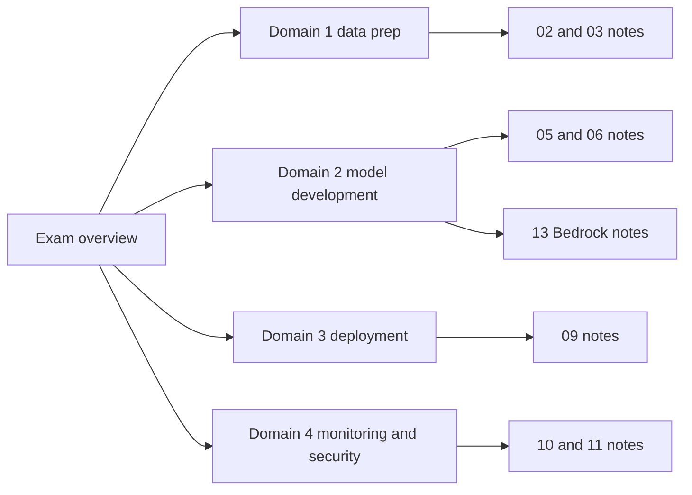

## Current Exam Shape

| Domain | Weight | Local starting point |
| --- | ---: | --- |
| Domain 1: Data Preparation for Machine Learning | 28% | [Domain 1: Data Preparation For Machine Learning](ex:00-exam-guide/domain-1-data-preparation) |
| Domain 2: ML Model Development | 26% | [Domain 2: ML Model Development](ex:00-exam-guide/domain-2-model-development) |
| Domain 3: Deployment and Orchestration of ML Workflows | 22% | [Domain 3: Deployment And Orchestration Of ML Workflows](ex:00-exam-guide/domain-3-deployment-orchestration) |
| Domain 4: ML Solution Monitoring, Maintenance, and Security | 24% | [Domain 4: ML Solution Monitoring, Maintenance, And Security](ex:00-exam-guide/domain-4-monitoring-security) |

## Study Flow



## Scope Rules

- Prefer the official exam guide and official AWS service docs over third-party summaries.
- Treat services in AWS full shutdown or sunset as lifecycle caveats even if a service appears in a static certification service list.
- Keep supplemental notes, but do not let them crowd out current in-scope services.

## Related Notes

```ex-cards
[{"title": "MLA-C01 In-Scope Services", "href": "ex:00-exam-guide/in-scope-services", "body": ""}, {"title": "MLA-C01 Out-Of-Scope Services", "href": "ex:00-exam-guide/out-of-scope-services", "body": ""}, {"title": "MLA-C01 Study Roadmap", "href": "ex:00-exam-guide/study-roadmap", "body": ""}]
```

## Sources

```ex-sources
[{"title": "https://docs.aws.amazon.com/aws-certification/latest/machine-learning-engineer-associate-01/machine-learning-engineer-associate-01.html", "href": "https://docs.aws.amazon.com/aws-certification/latest/machine-learning-engineer-associate-01/machine-learning-engineer-associate-01.html"}, {"title": "https://docs.aws.amazon.com/aws-certification/latest/machine-learning-engineer-associate-01/mla-01-in-scope-services.html", "href": "https://docs.aws.amazon.com/aws-certification/latest/machine-learning-engineer-associate-01/mla-01-in-scope-services.html"}, {"title": "https://docs.aws.amazon.com/aws-certification/latest/machine-learning-engineer-associate-01/mla-01-out-of-scope-services.html", "href": "https://docs.aws.amazon.com/aws-certification/latest/machine-learning-engineer-associate-01/mla-01-out-of-scope-services.html"}]
```
