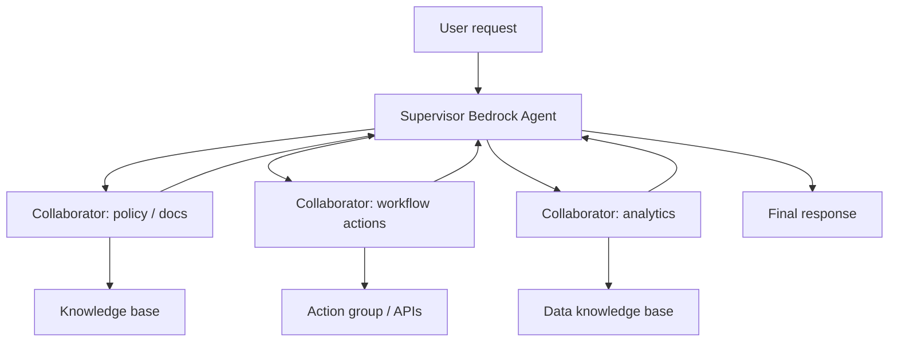

## When To Use

- Use multi-agent collaboration when one agent cannot reliably handle all subtasks.
- Use a supervisor agent when one central agent should plan, route, and interact with the user.
- Use collaborator agents when each domain has distinct tools, prompts, knowledge bases, and guardrails.
- Use a simpler single-agent design when responsibilities overlap heavily or the task is narrow.

## Core Concepts

- Multi-agent collaboration lets multiple Bedrock Agents plan and solve complex tasks together.
- A supervisor agent receives the user prompt and routes work to collaborator agents.
- Collaborator agents are domain specialists with their own instructions and can use the standard Bedrock Agent capabilities.
- Each agent can have tools, action groups, knowledge bases, and guardrails.
- Clear, non-overlapping roles reduce routing confusion and improve result quality.

## AWS Services And Features

- Agents for Amazon Bedrock
- Bedrock Agent supervisor/collaborator configuration
- Action groups
- Knowledge bases
- Guardrails
- Traces
- Agent aliases and versions

## Implementation Patterns



- Hierarchical routing: supervisor determines intent -> assigns subtask -> gathers answer -> responds.
- Parallel specialist pattern: supervisor fans out independent subtasks -> merges outputs.
- RAG + action pattern: document specialist retrieves policy -> workflow specialist performs or recommends action.

## Tradeoffs And Pitfalls

- Overlapping collaborator responsibilities make routing harder and can increase cost.
- Multi-agent collaboration adds latency because multiple agents may run.
- Each collaborator still needs least-privilege tools and clear guardrail boundaries.
- Debugging should inspect supervisor and collaborator traces.
- Start with one agent unless the task naturally separates into specialist domains.

## Decision Triggers

- "Multiple specialized agents collaborate" points to Bedrock multi-agent collaboration.
- "Supervisor routes to domain experts" points to supervisor/collaborator agent architecture.
- "Each specialist has its own knowledge base and tools" points to Bedrock collaborator agents.
- "Need custom routing beyond managed collaboration" points to [Agent Squad in Amazon Bedrock](ex:14-agentic-ai/agent-squad) or custom agents on AgentCore.

## Related Notes

```ex-cards
[{"title": "Agents for Amazon Bedrock", "href": "ex:13-bedrock/bedrock-agents", "body": ""}, {"title": "Agent Squad in Amazon Bedrock", "href": "ex:14-agentic-ai/agent-squad", "body": ""}, {"title": "Amazon Bedrock AgentCore", "href": "ex:13-bedrock/bedrock-agentcore", "body": ""}, {"title": "Agentic AI Current Innovation Map", "href": "ex:14-agentic-ai/agentic-ai-current-innovation-map", "body": ""}, {"title": "Agentic RAG Patterns", "href": "ex:14-agentic-ai/agentic-rag-patterns", "body": ""}]
```

## Sources

```ex-sources
[{"title": "https://docs.aws.amazon.com/bedrock/latest/userguide/agents-multi-agent-collaboration.html", "href": "https://docs.aws.amazon.com/bedrock/latest/userguide/agents-multi-agent-collaboration.html"}, {"title": "https://docs.aws.amazon.com/bedrock/latest/userguide/agents.html", "href": "https://docs.aws.amazon.com/bedrock/latest/userguide/agents.html"}]
```
