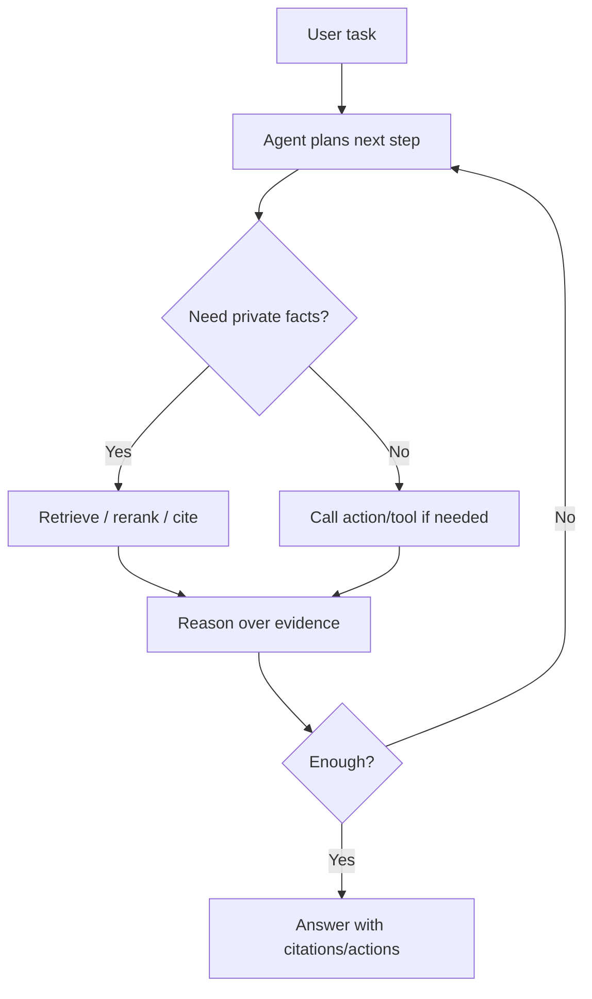

## When To Use

- Use plain RAG when the main task is grounded Q&A over private or changing content.
- Use agentic RAG when the system must decide when to retrieve, query structured stores, call tools, ask follow-up questions, and synthesize across multiple steps.
- Use Bedrock Knowledge Bases for managed ingestion, retrieval, response generation, citations, multimodal retrieval, structured data query generation, and reranking.
- Use Bedrock Agents when RAG must be combined with action groups and managed orchestration.

## Core Concepts

- RAG improves relevance and accuracy by retrieving information from data sources before generation.
- Bedrock Knowledge Bases can return relevant sources, augment prompts, generate responses, provide citations, retrieve multimodal content, transform natural language into structured queries, and use reranking models.
- Agentic RAG adds planning: the model decides whether to retrieve, which source/tool to query, whether to rerank, and whether more context or an action is needed.
- Evaluation should check faithfulness, citation coverage, retrieval relevance, answer correctness, harmfulness, latency, and cost.

## AWS Services And Features

- Amazon Bedrock Knowledge Bases
- Agents for Amazon Bedrock
- Bedrock Knowledge Base retrieval and `RetrieveAndGenerate`
- Bedrock reranking models
- Bedrock multimodal embeddings/retrieval
- Bedrock Evaluations
- AgentCore Observability and Evaluations for custom agent traces

## Implementation Patterns



- Managed Bedrock pattern: Bedrock Agent -> Knowledge Base -> action group -> final response.
- Custom pattern: custom agent -> Retrieve/RetrieveAndGenerate tool -> MCP/API tools -> evaluation/tracing.
- Structured-data pattern: natural language -> generated SQL/query over structured store -> evidence -> response.
- Multimodal pattern: image/text query -> multimodal embedding retrieval -> answer with visual/document evidence.

## Tradeoffs And Pitfalls

- Agentic RAG adds latency and cost because retrieval and tool calls may repeat across turns.
- Poor metadata and chunking still produce poor answers even with an agent.
- Agents can over-retrieve; constrain retrieval with task-specific instructions, metadata filters, and rerankers.
- Citations are not proof by themselves; evaluate whether cited chunks actually support claims.
- Do not use agentic RAG when deterministic search plus a short synthesis prompt is enough.

## Decision Triggers

- "Ground answers in private documents with citations" points to Bedrock Knowledge Bases.
- "Agent should use private docs and then submit/update a workflow" points to Bedrock Agents with a knowledge base and action group.
- "Need custom retrieval, reranking, and non-Bedrock tools" points to custom RAG plus AgentCore/MCP.
- "Structured store natural language query" points to Knowledge Bases structured data query generation or a custom SQL tool.

## Related Notes

```ex-cards
[{"title": "Bedrock RAG Decision Guide", "href": "ex:13-bedrock/bedrock-rag-decision-guide", "body": ""}, {"title": "Amazon Bedrock Knowledge Bases (deep dive notes)", "href": "ex:13-bedrock/bedrock-knowledge-base", "body": ""}, {"title": "Pre Retrieval Knowledge Base", "href": "ex:13-bedrock/pre-retrieval-knowledge-base", "body": ""}, {"title": "Optimizing Vector Store And Embeddings", "href": "ex:13-bedrock/optimizing-vector-store-and-embeddings", "body": ""}, {"title": "Agents for Amazon Bedrock", "href": "ex:13-bedrock/bedrock-agents", "body": ""}, {"title": "Model Context Protocol (MCP)", "href": "ex:14-agentic-ai/model-context-protocol-mcp", "body": ""}, {"title": "Bedrock AgentCore Production Patterns", "href": "ex:13-bedrock/bedrock-agentcore-production-patterns", "body": ""}]
```

## Sources

```ex-sources
[{"title": "https://docs.aws.amazon.com/bedrock/latest/userguide/knowledge-base.html", "href": "https://docs.aws.amazon.com/bedrock/latest/userguide/knowledge-base.html"}, {"title": "https://docs.aws.amazon.com/bedrock/latest/userguide/kb-how-retrieval.html", "href": "https://docs.aws.amazon.com/bedrock/latest/userguide/kb-how-retrieval.html"}, {"title": "https://docs.aws.amazon.com/bedrock/latest/userguide/agents.html", "href": "https://docs.aws.amazon.com/bedrock/latest/userguide/agents.html"}, {"title": "https://docs.aws.amazon.com/bedrock-agentcore/latest/devguide/what-is-bedrock-agentcore.html", "href": "https://docs.aws.amazon.com/bedrock-agentcore/latest/devguide/what-is-bedrock-agentcore.html"}]
```
