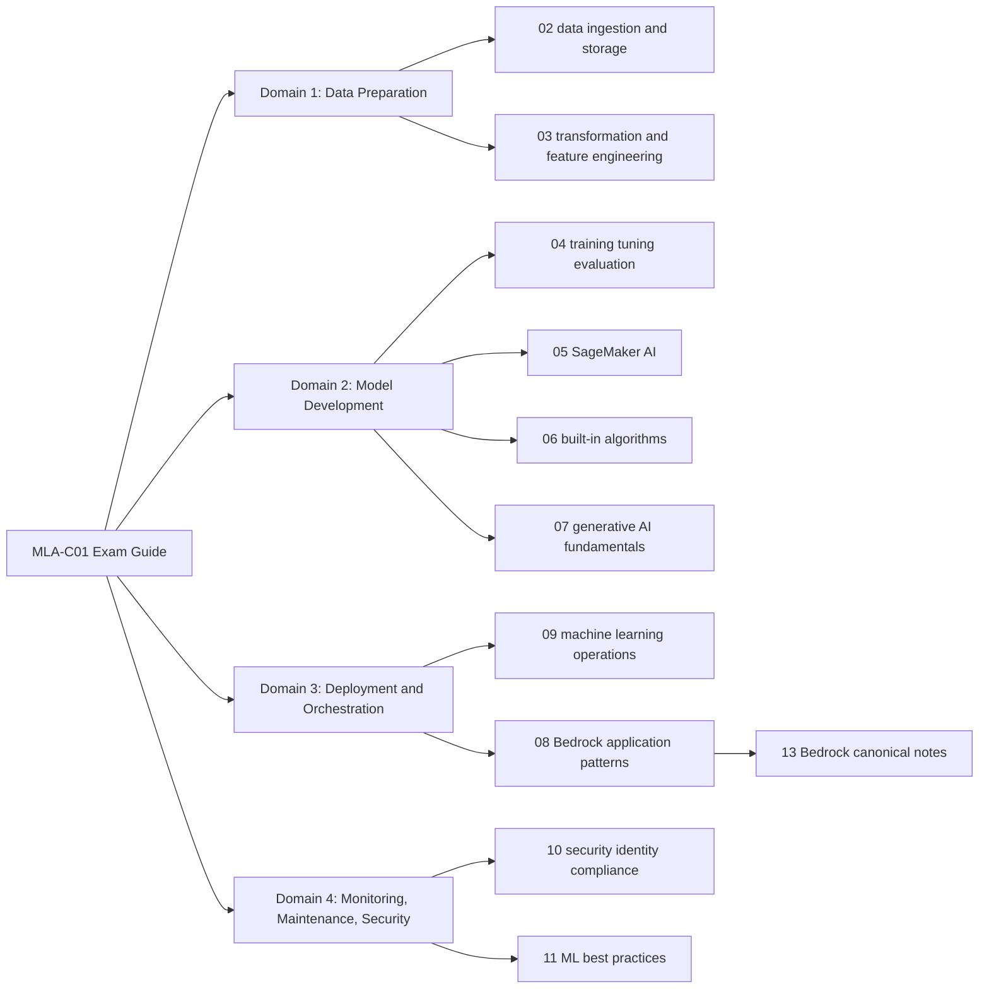

## Objective

Improve this vault as a study system for the AWS Certified Machine Learning Engineer - Associate (MLA-C01) exam by:

- Creating a standard note format.
- Updating notes against current AWS MLA-C01 and AWS service documentation.
- Updating `README.md` so it reflects the actual repository structure and source-of-truth workflow.
- Adding missing exam-relevant notes.

This plan is intentionally implementation-ready. It describes the target file structure, note schema, concrete sections, source policy, missing note paths, update order, and validation checks.

## Sources Checked

Use these as the primary source-of-truth during implementation:

- AWS MLA-C01 exam guide: https://docs.aws.amazon.com/aws-certification/latest/machine-learning-engineer-associate-01/machine-learning-engineer-associate-01.html
- AWS MLA-C01 domain 1: https://docs.aws.amazon.com/aws-certification/latest/machine-learning-engineer-associate-01/machine-learning-engineer-associate-01-domain1.html
- AWS MLA-C01 domain 2: https://docs.aws.amazon.com/aws-certification/latest/machine-learning-engineer-associate-01/machine-learning-engineer-associate-01-domain2.html
- AWS MLA-C01 domain 3: https://docs.aws.amazon.com/aws-certification/latest/machine-learning-engineer-associate-01/machine-learning-engineer-associate-01-domain3.html
- AWS MLA-C01 domain 4: https://docs.aws.amazon.com/aws-certification/latest/machine-learning-engineer-associate-01/machine-learning-engineer-associate-01-domain4.html
- AWS MLA-C01 in-scope services: https://docs.aws.amazon.com/aws-certification/latest/machine-learning-engineer-associate-01/mla-01-in-scope-services.html
- AWS MLA-C01 out-of-scope services: https://docs.aws.amazon.com/aws-certification/latest/machine-learning-engineer-associate-01/mla-01-out-of-scope-services.html
- Amazon SageMaker AI docs: https://docs.aws.amazon.com/sagemaker/
- Next generation Amazon SageMaker docs: https://docs.aws.amazon.com/next-generation-sagemaker/latest/userguide/what-is-sagemaker.html
- AWS Data Pipeline status: https://docs.aws.amazon.com/datapipeline/latest/DeveloperGuide/DocHistory.html
- SageMaker Training Compiler status: https://docs.aws.amazon.com/sagemaker/latest/dg/training-compiler-enable.html
- Amazon Elastic Inference status: https://docs.aws.amazon.com/sdk-for-go/api/service/elasticinference/
- Amazon Bedrock AgentCore release notes: https://docs.aws.amazon.com/bedrock-agentcore/latest/devguide/release-notes.html
- Bedrock Automated Reasoning checks docs: https://docs.aws.amazon.com/bedrock/latest/userguide/guardrails-automated-reasoning-checks.html
- SageMaker AI built-in algorithms: https://docs.aws.amazon.com/sagemaker/latest/dg/algos.html
- Amazon SageMaker Studio Classic maintenance status: https://docs.aws.amazon.com/sagemaker/latest/dg/studio.html
- SageMaker Edge Manager end of life: https://docs.aws.amazon.com/sagemaker/latest/dg/edge-eol.html
- Amazon Forecast API notice: https://docs.aws.amazon.com/forecast/latest/dg/API_ListForecasts.html
- Amazon Managed Service for Apache Flink rename notice: https://aws.amazon.com/about-aws/whats-new/2023/08/amazon-managed-service-apache-flink/
- AWS Glue Data Quality docs: https://docs.aws.amazon.com/glue/latest/dg/glue-data-quality.html
- Amazon Bedrock prompt caching: https://docs.aws.amazon.com/bedrock/latest/userguide/prompt-caching.html
- Amazon Bedrock prompt management: https://docs.aws.amazon.com/bedrock/latest/userguide/prompt-management.html
- Amazon Bedrock intelligent prompt routing: https://docs.aws.amazon.com/bedrock/latest/userguide/prompt-routing.html
- Amazon Bedrock evaluations: https://docs.aws.amazon.com/bedrock/latest/userguide/evaluation.html
- Amazon S3 Vectors with Bedrock Knowledge Bases: https://docs.aws.amazon.com/AmazonS3/latest/userguide/s3-vectors-bedrock-kb.html
- Amazon SageMaker Role Manager: https://docs.aws.amazon.com/sagemaker/latest/dg/role-manager.html
- Amazon SageMaker model customization: https://docs.aws.amazon.com/sagemaker/latest/dg/customize-model.html
- Amazon Q Developer rename from CodeWhisperer: https://docs.aws.amazon.com/amazonq/latest/qdeveloper-ug/service-rename.html
- AWS CodeCommit current availability: https://docs.aws.amazon.com/codecommit/latest/userguide/history.html
- AWS CodeCommit GA return announcement: https://aws.amazon.com/blogs/devops/aws-codecommit-returns-to-general-availability/

## Current Repo Findings

The vault is useful and broad, but it needed a consistent AWS ML/AI knowledge-base structure with MLA-C01 preserved as a certification track.

| Finding | Evidence | Impact |
| --- | --- | --- |
| 226 Markdown files exist | `find . -name '*.md'` count | Enough content to standardize before adding many new files |
| README is stale | It lists directories through `common`, but the repo now has `12-sql`, `13-bedrock`, and `14-agentic-ai` | New users cannot understand the actual scope |
| No YAML title metadata | `rg --files-with-matches '^title:' -g '*.md'` returned 0 | Harder to query in Obsidian and automate coverage checks |
| 95 Markdown files do not have a top-level `#` heading | `rg --files-without-match '^# ' -g '*.md'` | Notes render inconsistently and are harder to skim |
| 185 Markdown files lack a source/resource section | `rg --files-without-match '^(## )?(Sources|References|Additional Resources)\\b' -g '*.md'` | Currentness cannot be audited |
| Decision guidance is uneven | Most older notes lacked `Decision Triggers` or certification-specific tips | Practical and study value varied widely by note |
| Duplicate topic files exist | `bedrock-agents.md`, `bedrock-guardrails.md`, `chunking-strategies.md`, and `feature-engineering.md` exist in multiple directories | Users may read stale or conflicting versions |
| Some notes are legacy, out-of-scope, or naming-stale for MLA-C01 | `Data Pipeline`, `Elastic Inference`, `Forecast`, `AppConfig`, `Greengrass`, `Shield`, `DataZone`, `Kinesis Data Analytics`, `Studio Classic`, `Edge Manager`, and `CodeWhisperer` appear locally | Study time can drift away from current exam scope or learn outdated service names |
| Existing untracked files are present | `responsible-ai-aws.md`, `well-architected-tool-generative-ai-lens.md`, `bedrock-prompt-caching.md`, `pre-retrieval-knowledge-base.md`, `.DS_Store` | Implementation must preserve user-created work |

## Deep Research Addendum

This second pass changes the implementation plan in several concrete ways.

### Research Methods

- Used local repo inspection with `rg`, `find`, `sed`, and `git status`.
- Checked the official AWS MLA-C01 exam guide, domain pages, in-scope service list, and out-of-scope service list.
- Checked current AWS service documentation for SageMaker AI, next-generation SageMaker, Bedrock, Glue, Forecast, Data Pipeline, Elastic Inference, CodeCommit, and Amazon Q Developer.
- Used Context7 for SageMaker Python SDK and Bedrock documentation discovery. Context7 was useful for confirming current Bedrock and SDK-facing implementation surfaces, but official AWS docs remain the source of truth for the plan.
- Used Exa only to discover official AWS URLs and extract the full current in-scope service list; the plan should still cite AWS pages directly.

### Source-Backed Corrections From The First Pass

| Correction | Source-backed fact | Plan impact |
| --- | --- | --- |
| CodeCommit should not be marked deprecated now | AWS CodeCommit is available to new customers again as of November 25, 2025, and the AWS DevOps blog says it returned to full GA effective November 24, 2025 | Keep CodeCommit references where they help CI/CD context, but mark them `supplemental` because CodeCommit is not listed in the current MLA-C01 in-scope service list |
| Kinesis Data Analytics naming is stale | AWS renamed Amazon Kinesis Data Analytics to Amazon Managed Service for Apache Flink on August 30, 2023; service endpoints/API/IAM names were not otherwise changed | Rename or redirect `02-data-ingestion-and-storage/kinesis-data-analytics.md` to a canonical `managed-service-for-apache-flink.md` note |
| SageMaker Studio note is likely stale | The previous Studio experience is now SageMaker Studio Classic, existing workloads only; all new domains use the updated Studio | Rewrite `05-sagemaker-ai/sagemaker-studio.md` around current Studio and move Studio Classic content into a lifecycle note |
| SageMaker Edge Manager references are stale | Edge Manager was no longer accessible after April 26, 2024 | Update `sagemaker-neo.md` and `sagemaker-on-the-edge.md` so Edge Manager is historical and alternatives are ONNX and AWS IoT Greengrass V2, while also noting Greengrass is out-of-scope for MLA-C01 |
| Training Compiler should be legacy, not current exam emphasis | AWS says there will be no new releases or versions and existing DLCs no longer receive patches/updates | Merge duplicate Training Compiler notes and mark as `legacy` |
| Elastic Inference should be legacy | AWS stopped onboarding new Elastic Inference customers after April 15, 2023 | Keep only as historical context; prefer Inference Recommender, endpoint sizing, serverless inference, async inference, and accelerators |
| Forecast should be legacy/supplemental | Amazon Forecast docs state it is no longer available to new customers, and Forecast is absent from current MLA-C01 in-scope ML service list | Keep only as historical context; prefer SageMaker DeepAR for exam forecasting |
| Current SageMaker built-in algorithm list has gaps in this repo | Current SageMaker AI docs include AutoGluon-Tabular, CatBoost, LightGBM, TabTransformer, Text Classification - TensorFlow, Image Classification - TensorFlow, Object Detection - TensorFlow, and JumpStart models/templates | Add or refresh standalone notes for missing algorithms and update the built-in algorithm cheat sheet |
| Bedrock notes need current feature classification | Current docs cover prompt caching, prompt management, intelligent prompt routing, Flows, evaluations, Guardrails with Automated Reasoning checks, and S3 Vectors integration for Knowledge Bases | Keep `13-bedrock` canonical and update the untracked Bedrock notes rather than discarding them |
| Amazon Q/CodeWhisperer naming is stale | CodeWhisperer became part of Amazon Q Developer on April 30, 2024 | Update transformer/application notes that mention CodeWhisperer |

### Current High-Risk Stale References Found Locally

These files need targeted source-refresh before broad formatting cleanup:

| Local file | Stale or risky reference | Required update |
| --- | --- | --- |
| `05-sagemaker-ai/sagemaker-studio.md` | Treats Studio as the older unified IDE without distinguishing current Studio vs Studio Classic | Rewrite with current Studio, Studio Classic maintenance, and next-generation SageMaker context |
| `05-sagemaker-ai/sagemaker-neo.md` | Mentions Edge Manager as active and Greengrass as a primary path | Mark Edge Manager EOL; explain Greengrass as replacement context but out-of-scope for MLA-C01 |
| `09-machine-learning-operations/sagemaker-on-the-edge.md` | Mentions Edge Manager and Greengrass heavily | Mark as `supplemental` or `out-of-scope-adjacent`; connect to Domain 3 only through SageMaker Neo deployment optimization |
| `02-data-ingestion-and-storage/kinesis-data-analytics.md` | Uses old Kinesis Data Analytics name | Rename/redirect to Amazon Managed Service for Apache Flink |
| `05-sagemaker-ai/sagemaker-training-techniques.md` | Says SMDDP works with Training Compiler in an exam tip while another line says Training Compiler is deprecated | Resolve contradiction; Training Compiler should not be emphasized as a current optimization path |
| `05-sagemaker-ai/sagemaker-training-compiler.md` and `04-model-training-tuning-and-evaluation/training-compiler.md` | Present Training Compiler as current | Merge and mark `legacy` |
| `05-sagemaker-ai/sagemaker-elastic-inference.md` | Presents Elastic Inference as current and exam-relevant | Mark `legacy`; redirect to Inference Recommender and modern endpoint choices |
| `01-ai-services/forecast.md` | Presents Amazon Forecast as current | Mark `legacy` and deprioritize |
| `05-sagemaker-ai/sagemaker-projects.md`, `09-machine-learning-operations/code-pipeline.md`, `09-machine-learning-operations/git.md` | Mention CodeCommit | Refresh, but do not remove solely for lifecycle reasons; CodeCommit is GA again, just not in official MLA-C01 service scope |
| `07-generative-ai-model-fundamentals/application-of-transformers.md` | Mentions CodeWhisperer | Update to Amazon Q Developer |
| `02-data-ingestion-and-storage/data-lake-lakehouses-warehouses.md` | Mentions Glue Elastic Views | Verify or replace; Glue Elastic Views has historically been a risky/stale reference |

### Official In-Scope Coverage Matrix

Use this matrix to drive the missing-note backlog. `Standalone` means a local file exists and can become canonical. `Incidental` means the service is mentioned but lacks a real study note. `Missing` means no meaningful local coverage was found.

| Official category | Standalone local coverage | Incidental or weak coverage | Missing or needs new canonical note |
| --- | --- | --- | --- |
| Analytics | Athena, Data Firehose, EMR, Glue, Kinesis, Lake Formation, OpenSearch, Redshift | Glue DataBrew, Glue Data Quality, Amazon Managed Service for Apache Flink, QuickSight | `glue-databrew.md`, `glue-data-quality.md`, `managed-service-for-apache-flink.md`, `quicksight.md` |
| Application Integration | EventBridge, MWAA, Step Functions | SNS, SQS | `sns.md`, `sqs.md` |
| Cloud Financial Management | None standalone | Budgets, Cost Explorer in scattered notes | `billing-and-cost-management.md`, `budgets.md`, `cost-explorer.md` or one `aws-cost-management-for-ml.md` |
| Compute | Batch, EC2 | Lambda | `lambda-for-ml-workflows.md`, `serverless-application-repository.md` |
| Containers | ECR, ECS, EKS | None | No urgent gap after source refresh |
| Database | DocumentDB, DynamoDB, ElastiCache, Neptune, RDS | None | No urgent gap after source refresh |
| Developer Tools | CDK, CodeBuild, CodeDeploy, CodePipeline | X-Ray | `codeartifact.md`, `x-ray.md` |
| Machine Learning | A2I, Bedrock, Comprehend, Kendra, Lex, Mechanical Turk, Personalize, Polly, Rekognition, SageMaker, Textract, Transcribe, Translate | Amazon Q, CodeGuru, DevOps Guru | `comprehend-medical.md`, `fraud-detector.md`, `healthlake.md`, `lookout-for-equipment.md`, `lookout-for-metrics.md`, `lookout-for-vision.md`, `amazon-q.md`, `codeguru.md`, `devops-guru.md` |
| Management and Governance | CloudFormation, CloudTrail, CloudWatch, Systems Manager | Organizations, Service Catalog, Config | `aws-auto-scaling.md`, `aws-chatbot.md`, `compute-optimizer.md`, `aws-config.md`, `organizations.md`, `service-catalog.md`, `trusted-advisor.md` |
| Media | None standalone | None | `kinesis-video-streams.md` |
| Migration and Transfer | DataSync | None | No urgent gap |
| Networking and Content Delivery | VPC | API Gateway, CloudFront, Direct Connect | `api-gateway.md`, `cloudfront.md`, `direct-connect.md` |
| Security, Identity, and Compliance | IAM, KMS, Macie, Secrets Manager | None | Add `sagemaker-role-manager.md` and `private-ml-networking.md` as concept notes even though Role Manager is a SageMaker feature |
| Storage | EBS, EFS, S3 | FSx, S3 Glacier | `fsx.md`, `s3-glacier.md`, `storage-gateway.md` |

### Exam-First Content Priority Changes

The next implementation pass should prioritize notes that map directly to task statements, not raw service count.

| Priority | Why | Concrete files |
| --- | --- | --- |
| P0 | Prevent learning outdated facts | `sagemaker-studio.md`, `sagemaker-neo.md`, `sagemaker-on-the-edge.md`, `kinesis-data-analytics.md`, `sagemaker-training-compiler.md`, `training-compiler.md`, `sagemaker-elastic-inference.md`, `forecast.md` |
| P1 | Cover official Domain 1 and Domain 4 gaps | `glue-data-quality.md`, `glue-databrew.md`, `managed-service-for-apache-flink.md`, `quicksight.md`, `data-classification-pii-phi-data-residency.md`, `class-imbalance-and-resampling.md`, `bias-metrics-ci-dpl.md`, `sagemaker-role-manager.md`, `private-ml-networking.md` |
| P2 | Cover official Domain 2 algorithm gaps | `autogluon-tabular.md`, `catboost.md`, `tabtransformer.md`, `text-classification-tensorflow.md`, `image-classification-tensorflow.md`, `object-detection-tensorflow.md`, refresh `sagemaker-built-in-algorithms-cheat-sheet.md` |
| P3 | Cover official Domain 3/4 operations gaps | `lambda-for-ml-workflows.md`, `sns.md`, `sqs.md`, `x-ray.md`, `compute-optimizer.md`, `trusted-advisor.md`, `aws-cost-management-for-ml.md`, `endpoint-autoscaling-metrics.md` |
| P4 | Keep Bedrock current without over-weighting it | Refresh `13-bedrock/*`, especially prompt caching, prompt management, intelligent prompt routing, model evaluations, automated reasoning checks, S3 Vectors for Knowledge Bases |

## Current Folder Coverage

| Directory | Files | Plan |
| --- | ---: | --- |
| `01-ai-services` | 11 | Keep, add missing in-scope AI/ML service notes, mark Forecast status |
| `02-data-ingestion-and-storage` | 40 | Keep, split true data sources from out-of-scope/legacy notes via metadata |
| `03-data-transformation-integrity-and-feature-engineering` | 11 | Keep, add exam domain mapping and consolidate duplicated feature engineering content |
| `04-model-training-tuning-and-evaluation` | 11 | Keep, fill metric/baseline/convergence gaps |
| `05-sagemaker-ai` | 26 | Keep as central SageMaker AI section, update naming and deprecated features |
| `06-sagemaker-built-in-algorithms` | 20 | Keep, verify algorithm availability against SageMaker AI docs |
| `07-generative-ai-model-fundamentals` | 8 | Keep as concept support for Bedrock and SageMaker foundation model notes |
| `08-building-gen-ai-apps-with-bedrock` | 8 | Merge or convert to application-pattern notes; avoid duplicate canonical Bedrock content |
| `09-machine-learning-operations` | 27 | Keep, add missing orchestration, cost, observability, and CI/CD notes |
| `10-security-identity-and-compliance` | 9 | Keep, add missing governance/network/security notes and mark Shield out-of-scope |
| `11-machine-learning-best-practices` | 6 | Keep, standardize with domain mapping |
| `12-sql` | 5 | Keep as supporting content; link from data prep notes rather than treat as a primary exam domain |
| `13-bedrock` | 23 | Make canonical Bedrock section |
| `14-agentic-ai` | 2 | Treat as supplemental unless mapped to official Bedrock task statements |
| `common` | 18 | Keep for ML fundamentals and cross-link heavily |

## Source-Of-Truth Model

The official exam domains should drive structure and priority:

| Domain | Weight | Existing Coverage | Gap Pattern |
| --- | ---: | --- | --- |
| Domain 1: Data Preparation for ML | 28% | Strong storage, Kinesis, Glue, Spark, feature engineering coverage | Needs official exam blueprint note, data integrity/bias/PII/data residency notes, data quality notes |
| Domain 2: ML Model Development | 26% | Strong algorithms, metrics, tuning, SageMaker basics | Needs current SageMaker AI naming, baseline/convergence notes, model selection decision guides |
| Domain 3: Deployment and Orchestration | 22% | Strong CodePipeline/Build/Deploy, EKS/ECS, SageMaker inference coverage | Missing Lambda, SNS, SQS, CodeArtifact, X-Ray, API Gateway as standalone notes |
| Domain 4: Monitoring, Maintenance, Security | 24% | CloudWatch, CloudTrail, IAM, KMS, VPC, Macie exist | Missing cost governance, Compute Optimizer, Trusted Advisor, AWS Config, Organizations, Service Catalog, monitoring dashboards |

## Target Information Architecture

Keep the current numbered topic folders to avoid a disruptive migration. Add a small exam-guide layer that maps the topic folders to the official blueprint.

New directory:

```text
00-exam-guide/
  exam-overview.md
  domain-1-data-preparation.md
  domain-2-model-development.md
  domain-3-deployment-orchestration.md
  domain-4-monitoring-security.md
  in-scope-services.md
  out-of-scope-services.md
  study-roadmap.md
```

Canonical ownership decisions:

| Topic | Canonical Location | Handling |
| --- | --- | --- |
| Bedrock core services | `13-bedrock/` | Keep as the canonical Bedrock section |
| Building gen AI apps with Bedrock | `08-building-gen-ai-apps-with-bedrock/` | Convert to scenario and workflow notes that link to canonical `13-bedrock` notes |
| Agentic AI frameworks | `14-agentic-ai/` | Mark as supplemental unless directly mapped to Bedrock task statements |
| Feature engineering | `03-data-transformation-integrity-and-feature-engineering/feature-engineering.md` | Make this canonical; turn `02-data-ingestion-and-storage/feature-engineering.md` into a data-prep index or merge |
| SQL | `12-sql/` | Keep as support material; link from Athena, Redshift, Glue, and data prep domain notes |

Mermaid map to add to the README or `00-exam-guide/exam-overview.md`:



## Standard Note Format

Add this standard to the README and optionally create `NOTE_TEMPLATE.md`.

### Frontmatter

Every note should start with this metadata:

```yaml
---
title: "Amazon SageMaker Feature Store"
scope: "AWS Machine Learning and AI"
certifications:
  - "MLA-C01"
status: "draft"
domain:
  - "1.2"
  - "1.3"
service:
  - "Amazon SageMaker AI"
tags:
  - aws
  - mla-c01
  - domain-1
  - sagemaker
aliases:
  - "SageMaker Feature Store"
last_verified: "2026-05-15"
source_type: "aws-official"
---
```

Allowed `status` values:

| Status | Meaning |
| --- | --- |
| `reviewed` | Verified against current AWS docs and mapped to exam tasks |
| `draft` | Useful but not yet fully verified |
| `stale` | Needs source refresh before study use |
| `legacy` | AWS service or feature is maintenance mode, no new releases, or no longer available to new customers |
| `supplemental` | Useful background but not directly in current MLA-C01 scope |
| `out-of-scope` | Listed as out-of-scope by the current AWS exam guide |

### Body Sections

Use these headings in this order:

```markdown
# <Title>

## Knowledge Relevance

## When To Use

## Core Concepts

## AWS Services And Features

## Implementation Patterns

## Tradeoffs And Pitfalls

## Decision Triggers

## Related Notes

## Sources
```

Implementation details:

- `Exam Relevance`: Map to official domain task IDs, such as `Domain 1, Task 1.2`.
- `When To Use`: Provide short decision bullets. Example: "Use Feature Store when online/offline feature reuse matters."
- `AWS Services And Features`: Use current service names. Prefer "Amazon SageMaker AI" when referring to the renamed original SageMaker ML service.
- `Implementation Patterns`: Include practical AWS flow diagrams or command/API-level shape when useful.
- `Tradeoffs And Pitfalls`: Include cost, latency, security, scale, region, deprecation, and operational caveats.
- `Exam Triggers`: Short scenario cues likely to map to an answer choice.
- `Related Notes`: Use Obsidian wikilinks for local notes, for example `[[sagemaker-feature-store]]`.
- `Sources`: Use direct AWS docs first, then AWS blogs/whitepapers only when docs are insufficient.

### Markdown Style Rules

- One `#` H1 per note.
- No emoji in headings for standardized notes.
- Use language tags on code blocks, such as `json`, `python`, `bash`, or `mermaid`.
- Avoid standalone horizontal rules as section separators unless they improve readability.
- Prefer Obsidian wikilinks for local notes and regular Markdown links for external sources.
- Include `last_verified` whenever AWS docs are checked.

## README Update Plan

Replace the current README with a certification-aware AWS ML/AI knowledge-base guide:

1. Title and purpose.
2. Current exam overview:
   - Exam: AWS Certified Machine Learning Engineer - Associate (MLA-C01).
   - Duration: 130 minutes.
   - Format: 65 questions.
   - Passing score: 720.
   - Domain weights: 28%, 26%, 22%, 24%.
3. "How this vault is organized":
   - Official exam guide layer: `00-exam-guide/`.
   - Topic folders: `01` through `14` plus `common`.
   - Canonical Bedrock section: `13-bedrock/`.
4. "Study paths":
   - Fast domain review.
   - SageMaker AI/MLOps review.
   - Bedrock/gen AI review.
   - Security/monitoring review.
5. "Note status legend":
   - `reviewed`, `draft`, `stale`, `legacy`, `supplemental`, `out-of-scope`.
6. "How to add or update a note":
   - Use the standard frontmatter and body sections.
   - Check official AWS docs first.
   - Add `last_verified`.
   - Add domain mapping.
7. "Validation checks":
   - List the commands in the Quality Gates section below.

## Content Update Plan

### 1. Establish Exam Guide Layer

Create:

- `00-exam-guide/exam-overview.md`
- `00-exam-guide/domain-1-data-preparation.md`
- `00-exam-guide/domain-2-model-development.md`
- `00-exam-guide/domain-3-deployment-orchestration.md`
- `00-exam-guide/domain-4-monitoring-security.md`
- `00-exam-guide/in-scope-services.md`
- `00-exam-guide/out-of-scope-services.md`
- `00-exam-guide/study-roadmap.md`

Each domain note should include:

```markdown
# Domain 1: Data Preparation For Machine Learning

## Weight
28% of scored content.

## Task Statements
- Task 1.1: Ingest and store data.
- Task 1.2: Transform data and perform feature engineering.
- Task 1.3: Ensure data integrity and prepare data for modeling.

## Local Notes
- [[s3]]
- [[glue]]
- [[feature-engineering]]

## Missing Or Weak Notes
- [[class-imbalance-and-resampling]]
- [[data-classification-pii-phi-data-residency]]

## Sources
- https://docs.aws.amazon.com/aws-certification/latest/machine-learning-engineer-associate-01/machine-learning-engineer-associate-01-domain1.html
```

### 2. Normalize Existing Notes

First pass: metadata and shape only.

- Add frontmatter to every `.md` note.
- Add missing H1 headings to the 95 files without H1.
- Add `Sources` section to every note, even if initially marked `source_type: "needs-verification"`.
- Add `status: "draft"` to unverified notes.
- Add `domain` mapping where obvious.

Second pass: content update.

- Update content against AWS docs.
- Move or merge duplicates.
- Change status from `draft` to `reviewed` only after source verification.

Suggested mechanical audit commands:

```bash
rg --files-without-match '^# ' -g '*.md'
rg --files-without-match '^(## )?(Sources|References|Additional Resources)\b' -g '*.md'
rg --files-without-match '^---$' -g '*.md'
```

### 3. Update Current AWS Naming

Apply current naming consistently:

- Use "Amazon SageMaker AI" for the original ML build/train/deploy service where AWS docs now use that name.
- Explain in `05-sagemaker-ai/sagemaker-studio.md` or a new `05-sagemaker-ai/sagemaker-ai-vs-next-generation-sagemaker.md` that the next generation SageMaker includes SageMaker Unified Studio, data and AI governance, and access to SageMaker AI.
- Keep existing filenames stable unless a rename is worth the churn.

High-priority files:

- `README.md`
- `05-sagemaker-ai/sagemaker-studio.md`
- `05-sagemaker-ai/sagemaker-domains.md`
- `05-sagemaker-ai/sagemaker-feature-store.md`
- `05-sagemaker-ai/sagemaker-pipelines.md`
- `05-sagemaker-ai/sagemaker-model-monitor.md`
- `05-sagemaker-ai/sagemaker-clarify.md`
- `06-sagemaker-built-in-algorithms/sagemaker-built-in-algorithms-cheat-sheet.md`

### 4. Mark Legacy, Supplemental, Out-Of-Scope, And Rename Notes

Do not delete useful notes immediately. Mark them clearly and link to current alternatives.

| File | Proposed Status | Reason | Replacement or Study Action |
| --- | --- | --- | --- |
| `02-data-ingestion-and-storage/data-pipelines.md` | `legacy` | AWS Data Pipeline is no longer available to new customers | Prefer Glue, Step Functions, or MWAA |
| `02-data-ingestion-and-storage/kinesis-data-analytics.md` | `stale` | Service name changed to Amazon Managed Service for Apache Flink; old endpoints/API/IAM names still exist but study wording should use the current service name | Create `02-data-ingestion-and-storage/managed-service-for-apache-flink.md`; keep the old file as a redirect-style note if preserving links matters |
| `05-sagemaker-ai/sagemaker-studio.md` | `stale` | Existing content likely describes Studio Classic behavior; Studio Classic is no longer available for onboarding and all new domains use the updated Studio | Rewrite around current Studio and move Studio Classic lifecycle details into a scoped subsection or separate note |
| `05-sagemaker-ai/sagemaker-neo.md` | `stale` until refreshed, then `reviewed` | SageMaker Neo remains useful for optimization context, but Edge Manager references are stale | Remove active Edge Manager workflow language; mention Edge Manager only as EOL context and prefer ONNX/Greengrass V2 as replacement context |
| `09-machine-learning-operations/sagemaker-on-the-edge.md` | `supplemental` | Edge Manager is EOL and AWS IoT Greengrass is out-of-scope for MLA-C01 | Keep only as edge background; do not make it a primary exam note |
| `05-sagemaker-ai/sagemaker-elastic-inference.md` | `legacy` | Elastic Inference no longer onboards new customers | Prefer modern SageMaker inference instance selection, serverless inference, inference recommender |
| `05-sagemaker-ai/sagemaker-training-compiler.md` | `legacy` | No new releases or versions | Keep caveat; emphasize distributed training, compiler alternatives, DLC support policy |
| `04-model-training-tuning-and-evaluation/training-compiler.md` | `legacy` | Duplicate of SageMaker Training Compiler | Merge into `05-sagemaker-ai/sagemaker-training-compiler.md` |
| `01-ai-services/forecast.md` | `legacy` | Amazon Forecast is no longer available to new customers and is not listed in current in-scope MLA-C01 services | Keep only as historical/supplemental if desired |
| `07-generative-ai-model-fundamentals/application-of-transformers.md` | `stale` | Mentions CodeWhisperer, which is now part of Amazon Q Developer | Update wording to Amazon Q Developer and link to `01-ai-services/amazon-q.md` |
| `05-sagemaker-ai/sagemaker-projects.md`, `09-machine-learning-operations/code-pipeline.md`, `09-machine-learning-operations/git.md` | `supplemental` for CodeCommit content | CodeCommit is GA again, but it is not in the current MLA-C01 in-scope services list | Keep AWS-native CI/CD context where useful; avoid treating CodeCommit as a core exam service |
| `02-data-ingestion-and-storage/amazon-datazone.md` | `out-of-scope` | Listed out-of-scope in current MLA-C01 guide | Link from next-gen SageMaker/governance notes only if useful |
| `09-machine-learning-operations/aws-appconfig.md` | `out-of-scope` | Listed out-of-scope in current MLA-C01 guide | Do not prioritize for exam study |
| `09-machine-learning-operations/greengrass.md` | `out-of-scope` | Listed out-of-scope in current MLA-C01 guide | Keep as supplemental edge context if needed |
| `10-security-identity-and-compliance/shield.md` | `out-of-scope` | Listed out-of-scope in current MLA-C01 guide | Deprioritize; focus on IAM, KMS, Macie, Secrets Manager |
| `02-data-ingestion-and-storage/qldb.md` | `supplemental` | Not listed in current in-scope service list | Keep only if useful for audit-trail context |

## Missing Notes To Add

Priority 0: exam navigation and coverage.

| New File | Purpose |
| --- | --- |
| `00-exam-guide/exam-overview.md` | Official exam facts, scoring, domain weights, source links |
| `00-exam-guide/domain-1-data-preparation.md` | Domain 1 task-to-note map |
| `00-exam-guide/domain-2-model-development.md` | Domain 2 task-to-note map |
| `00-exam-guide/domain-3-deployment-orchestration.md` | Domain 3 task-to-note map |
| `00-exam-guide/domain-4-monitoring-security.md` | Domain 4 task-to-note map |
| `00-exam-guide/in-scope-services.md` | Current official in-scope service checklist |
| `00-exam-guide/out-of-scope-services.md` | Current official out-of-scope checklist |
| `00-exam-guide/study-roadmap.md` | Recommended review order and weak-area checklist |

Priority 1: in-scope services with no standalone note or only incidental mentions.

| New File | Exam Area |
| --- | --- |
| `02-data-ingestion-and-storage/glue-databrew.md` | In-scope Analytics service; visual data preparation and profiling |
| `03-data-transformation-integrity-and-feature-engineering/glue-data-quality.md` | In-scope Analytics feature; data quality rules, checks, and integrity |
| `02-data-ingestion-and-storage/managed-service-for-apache-flink.md` | In-scope Analytics service and current name for Kinesis Data Analytics |
| `02-data-ingestion-and-storage/quicksight.md` | Dashboards and monitoring/cost/performance reporting |
| `09-machine-learning-operations/sns.md` | Application integration and async ML workflows |
| `09-machine-learning-operations/sqs.md` | Application integration and decoupled processing |
| `09-machine-learning-operations/lambda-for-ml-workflows.md` | Serverless preprocessing, inference wrappers, pipeline glue |
| `09-machine-learning-operations/serverless-application-repository.md` | Compute service in-scope; low priority but should be acknowledged |
| `09-machine-learning-operations/codeartifact.md` | CI/CD dependency artifact management |
| `09-machine-learning-operations/x-ray.md` | Tracing and observability |
| `09-machine-learning-operations/aws-cost-management-for-ml.md` | Billing and Cost Management, Budgets, Cost Explorer, cost allocation, and optimization triggers |
| `09-machine-learning-operations/aws-auto-scaling.md` | In-scope Management and Governance service; endpoint and workload scaling context |
| `01-ai-services/comprehend-medical.md` | In-scope AI service |
| `01-ai-services/fraud-detector.md` | In-scope ML service |
| `01-ai-services/healthlake.md` | In-scope ML/health data service |
| `01-ai-services/lookout-for-equipment.md` | In-scope ML service |
| `01-ai-services/lookout-for-metrics.md` | In-scope ML service |
| `01-ai-services/lookout-for-vision.md` | In-scope ML service |
| `01-ai-services/amazon-q.md` | In-scope ML service |
| `09-machine-learning-operations/codeguru.md` | In-scope ML/developer tooling |
| `09-machine-learning-operations/devops-guru.md` | In-scope ML/operations service |
| `09-machine-learning-operations/aws-chatbot.md` | Management and governance in-scope |
| `09-machine-learning-operations/compute-optimizer.md` | Rightsizing and cost optimization |
| `10-security-identity-and-compliance/aws-config.md` | Governance and compliance checks |
| `10-security-identity-and-compliance/organizations.md` | Multi-account governance |
| `10-security-identity-and-compliance/service-catalog.md` | Governed infrastructure templates |
| `09-machine-learning-operations/trusted-advisor.md` | Cost/performance/security recommendations |
| `02-data-ingestion-and-storage/kinesis-video-streams.md` | Media in-scope service |
| `09-machine-learning-operations/api-gateway.md` | Secure model/application API front door |
| `09-machine-learning-operations/cloudfront.md` | Edge delivery/caching for ML and gen AI apps |
| `10-security-identity-and-compliance/direct-connect.md` | Private connectivity tradeoffs |
| `02-data-ingestion-and-storage/fsx.md` | Training data storage, FSx for Lustre/ONTAP |
| `02-data-ingestion-and-storage/s3-glacier.md` | Archive storage and data lifecycle |
| `02-data-ingestion-and-storage/storage-gateway.md` | Hybrid storage ingestion |

Priority 2: SageMaker built-in algorithm gaps.

| New File | Why It Matters |
| --- | --- |
| `06-sagemaker-built-in-algorithms/autogluon-tabular.md` | Current built-in option for tabular classification/regression decision questions |
| `06-sagemaker-built-in-algorithms/catboost.md` | Current built-in option for tabular classification/regression decision questions |
| `06-sagemaker-built-in-algorithms/tabtransformer.md` | Current built-in option for tabular classification/regression with categorical feature handling |
| `06-sagemaker-built-in-algorithms/text-classification-tensorflow.md` | Current built-in textual analysis algorithm that complements BlazingText |
| `06-sagemaker-built-in-algorithms/image-classification-tensorflow.md` | Current image processing algorithm to distinguish from older image classification coverage |
| `06-sagemaker-built-in-algorithms/object-detection-tensorflow.md` | Current image processing algorithm to distinguish from older object detection coverage |

Also refresh `06-sagemaker-built-in-algorithms/sagemaker-built-in-algorithms-cheat-sheet.md` so it maps current AWS use-case categories to local notes.

Priority 3: exam concepts that should be standalone and cross-linked.

| New File | Why It Matters |
| --- | --- |
| `common/class-imbalance-and-resampling.md` | Domain 1 explicitly calls out class imbalance and resampling |
| `common/bias-metrics-ci-dpl.md` | Domain 1 mentions CI and DPL; connects to SageMaker Clarify |
| `10-security-identity-and-compliance/data-classification-pii-phi-data-residency.md` | Domain 1 and security tasks include classification, masking, compliance |
| `03-data-transformation-integrity-and-feature-engineering/encoding-techniques.md` | One-hot, binary, label encoding, tokenization |
| `03-data-transformation-integrity-and-feature-engineering/data-quality-validation.md` | Glue Data Quality, DataBrew, data integrity |
| `04-model-training-tuning-and-evaluation/model-baselines-and-convergence.md` | Domain 2 performance analysis gap |
| `04-model-training-tuning-and-evaluation/model-selection-decision-guide.md` | Algorithm/service selection scenario guide |
| `09-machine-learning-operations/deployment-mode-decision-guide.md` | Real-time, async, batch, serverless, multi-model, multi-container |
| `09-machine-learning-operations/endpoint-autoscaling-metrics.md` | Invocations, latency, CPU, concurrency, scale policies |
| `09-machine-learning-operations/cicd-tests-for-ml-pipelines.md` | Unit/integration/E2E tests in ML CI/CD |
| `09-machine-learning-operations/retraining-triggers-and-drift-response.md` | Drift detection, EventBridge, retraining workflows |
| `10-security-identity-and-compliance/sagemaker-role-manager.md` | Domain 4 specifically mentions SageMaker Role Manager |
| `10-security-identity-and-compliance/private-ml-networking.md` | VPC endpoints, subnets, security groups, private S3 access |

Priority 4: consolidation notes.

| File | Purpose |
| --- | --- |
| `13-bedrock/bedrock-application-patterns.md` | Merge common patterns from `08-building-gen-ai-apps-with-bedrock` without duplicating feature references |
| `13-bedrock/bedrock-rag-decision-guide.md` | Consolidate RAG, chunking, pre-retrieval, vector store notes |
| `05-sagemaker-ai/sagemaker-ai-current-capabilities.md` | Current SageMaker AI landscape and renamed service explanation |

## Deduplication Plan

Handle duplicates in this order:

1. `feature-engineering.md`
   - Canonical file: `03-data-transformation-integrity-and-feature-engineering/feature-engineering.md`.
   - Convert `02-data-ingestion-and-storage/feature-engineering.md` into a shorter index that links to the canonical note, or merge unique content and remove the duplicate only if explicitly approved.
2. `chunking-strategies.md`
   - Canonical file: `13-bedrock/chunking-strategies.md`.
   - Convert `08-building-gen-ai-apps-with-bedrock/chunking-strategies.md` into an application-pattern note or redirect-style note.
3. `bedrock-agents.md`
   - Canonical file: `13-bedrock/bedrock-agents.md`.
   - Keep `08-building-gen-ai-apps-with-bedrock/bedrock-agents.md` only for scenario walkthroughs.
4. `bedrock-guardrails.md`
   - Canonical file: `13-bedrock/bedrock-guardrails.md`.
   - Move scenario content from `08-building-gen-ai-apps-with-bedrock/bedrock-guardrails.md` into examples.
5. `training-compiler.md`
   - Canonical file: `05-sagemaker-ai/sagemaker-training-compiler.md`.
   - Merge `04-model-training-tuning-and-evaluation/training-compiler.md` content if any unique parts remain.

Use this pattern for duplicate stubs if files are retained:

```markdown
# <Topic>

> [!info]
> Canonical note: [[canonical-note-name]].

This note only covers <specific scenario/use case>. For the core service details, use [[canonical-note-name]].
```

## Implementation Phases

### Phase 1: Standards And Indexes

Files to edit/create:

- `README.md`
- `NOTE_TEMPLATE.md`
- `00-exam-guide/*.md`

Implementation details:

- Add the standard frontmatter and body template to `NOTE_TEMPLATE.md`.
- Update README with folder map, exam domain weights, status legend, source policy, and validation commands.
- Add `00-exam-guide` notes with links to current official AWS pages.

Exit criteria:

- README reflects all existing folders.
- New `00-exam-guide` directory exists.
- Note template exists.

### Phase 2: Mechanical Normalization

Files to edit:

- All existing `.md` notes, in small batches by directory.

Implementation details:

- Add frontmatter to each note.
- Add H1 where missing.
- Add or normalize `Sources` section.
- Preserve content unless a stale claim is obvious and source-backed.
- Set `status: "draft"` by default.
- Set `status: "legacy"`, `status: "out-of-scope"`, or `status: "supplemental"` only when supported by official docs.

Exit criteria:

```bash
rg --files-without-match '^# ' -g '*.md'
rg --files-without-match '^(## )?(Sources|References|Additional Resources)\b' -g '*.md'
```

The expected output should be empty or limited to explicitly exempted files.

### Phase 3: Source Refresh

Files to prioritize:

- `05-sagemaker-ai/*.md`
- `06-sagemaker-built-in-algorithms/*.md`
- `13-bedrock/*.md`
- `09-machine-learning-operations/*.md`
- `10-security-identity-and-compliance/*.md`

Implementation details:

- Check AWS docs for each note.
- Update stale service names, caveats, feature status, and exam scope.
- Set `last_verified` to the current date for notes checked against AWS docs.
- Set `status: "reviewed"` only after updating the source list.

High-risk stale claims to verify:

- SageMaker AI vs next generation SageMaker naming.
- SageMaker Studio vs Studio Classic.
- SageMaker Training Compiler support status.
- Elastic Inference availability.
- Forecast availability.
- Data Pipeline status.
- Kinesis Data Analytics vs Amazon Managed Service for Apache Flink naming.
- SageMaker Neo vs Edge Manager EOL.
- CodeWhisperer vs Amazon Q Developer naming.
- Glue Elastic Views references.
- Bedrock AgentCore feature and region status.
- Bedrock Guardrails Automated Reasoning availability and limitations.

### Phase 4: Missing Notes

Add Priority 1 service notes first, then Priority 2 built-in algorithm notes, then Priority 3 concept notes.

For every new note:

- Use `NOTE_TEMPLATE.md`.
- Add official AWS source URLs.
- Add at least one `Exam Triggers` section.
- Link from the relevant `00-exam-guide/domain-*.md` note.
- Link from README only when the note is a major study entry point.

### Phase 5: Deduplication And Navigation

Implementation details:

- Merge duplicate content into canonical files.
- Keep redirect-style notes only if deleting would break useful links.
- Add `Related Notes` sections to major notes.
- Add `00-exam-guide/in-scope-services.md` checklist links to local files.

### Phase 6: Final Validation

Run:

```bash
git status --short
rg --files-without-match '^# ' -g '*.md'
rg --files-without-match '^(## )?(Sources|References|Additional Resources)\b' -g '*.md'
rg -n 'Elastic Inference|Training Compiler|Data Pipeline|Amazon Forecast|AWS AppConfig|AWS IoT Greengrass|AWS Shield|Amazon DataZone|Kinesis Data Analytics|Studio Classic|Edge Manager|CodeWhisperer|Glue Elastic Views' -g '*.md'
rg -n 'TODO|needs-verification|source_type: "needs-verification"' -g '*.md' --glob '!README.md' --glob '!PLAN_NOTES_IMPROVEMENT.md'
```

Expected result:

- Only intentional files changed.
- Legacy/out-of-scope terms appear only in notes with clear status warnings or in source/scope references.
- No notes without H1.
- No notes without a source section, except explicitly exempted template/support files.

## Suggested Implementation Order

1. Update README and add `NOTE_TEMPLATE.md`.
2. Add `00-exam-guide/` notes and service-scope checklists.
3. Normalize the four untracked note files currently present so user work is preserved:
   - `11-machine-learning-best-practices/responsible-ai-aws.md`
   - `11-machine-learning-best-practices/well-architected-tool-generative-ai-lens.md`
   - `13-bedrock/bedrock-prompt-caching.md`
   - `13-bedrock/pre-retrieval-knowledge-base.md`
4. Normalize and refresh `13-bedrock/` because it already has the newest shape.
5. Normalize and refresh `05-sagemaker-ai/` and `06-sagemaker-built-in-algorithms/`.
6. Normalize and refresh `09-machine-learning-operations/` and `10-security-identity-and-compliance/`.
7. Add missing Priority 1 in-scope service notes.
8. Add missing Priority 2 SageMaker built-in algorithm notes and refresh the algorithm cheat sheet.
9. Add missing Priority 3 concept notes.
10. Deduplicate `08` vs `13` Bedrock and duplicated feature-engineering notes.
11. Run final validation commands and update README status if needed.

## Risks And Decisions

| Risk | Decision |
| --- | --- |
| Full standardization touches many files | Do it in directory batches and keep commits/PRs scoped if this becomes implementation work |
| Some notes are useful but out-of-scope | Mark status instead of deleting by default |
| AWS docs change frequently | Use `last_verified` and official source URLs on every note |
| Bedrock and AgentCore move quickly | Keep AgentCore and agentic AI notes marked `supplemental` unless the official exam guide clearly maps them |
| README could become too long | Keep README as navigation; put detailed maps in `00-exam-guide/` |
| Untracked files already exist | Preserve them and include them in normalization only if implementation proceeds |

## Done Definition

The improvement work is done when:

- README accurately reflects all folders and the current MLA-C01 guide.
- Every note has frontmatter, one H1, exam/domain metadata, status, and sources.
- `00-exam-guide/` provides the official domain and service-scope map.
- Missing Priority 1 service notes exist.
- Priority 2 built-in algorithm notes exist or are tracked as explicit follow-up.
- Priority 3 concept notes exist or are tracked as explicit follow-up.
- Legacy and out-of-scope notes are clearly marked.
- Duplicate notes are merged or converted to scoped scenario notes.
- Validation commands pass with only documented exceptions.
