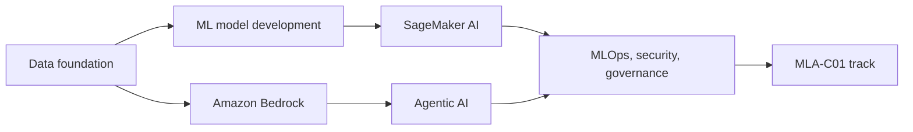

MLA-C01 is preserved as a certification track, not the only purpose of the repo. Notes that still map to the AWS Certified Machine Learning Engineer - Associate exam keep the `MLA-C01` certification metadata and `mla-c01` tag so they remain useful for exam review.

## Primary Knowledge Paths

| Path | Start Here | Purpose |
| --- | --- | --- |
| AWS AI services | `01-ai-services/` | Applied AI services for language, search, personalization, moderation, forecasting, contact center, and domain-specific workflows |
| Data foundation for AI | `02-data-ingestion-and-storage/`, `03-data-transformation-integrity-and-feature-engineering/`, `12-sql/` | Data ingestion, storage, transformation, quality, feature engineering, analytics, and retrieval foundations |
| ML model development | `04-model-training-tuning-and-evaluation/`, `common/` | Core ML concepts, training, tuning, metrics, model selection, and evaluation |
| SageMaker AI | `05-sagemaker-ai/`, `06-sagemaker-built-in-algorithms/` | Build, train, customize, deploy, govern, and operate ML models on Amazon SageMaker AI |
| Generative AI and Bedrock | `07-generative-ai-model-fundamentals/`, `08-building-gen-ai-apps-with-bedrock/`, `13-bedrock/` | Foundation models, Bedrock APIs, model access, customization, guardrails, knowledge bases, agents, and production patterns |
| Agentic AI | `14-agentic-ai/`, `13-bedrock/bedrock-agentcore.md` | Agent design, MCP, AgentCore, multi-agent systems, Claude on AWS, agentic RAG, memory, tools, and observability |
| MLOps, security, and governance | `09-machine-learning-operations/`, `10-security-identity-and-compliance/`, `11-machine-learning-best-practices/` | Production operations, monitoring, deployment, governance, responsible AI, compliance, and human review |
| MLA-C01 certification review | `00-exam-guide/` | Official exam overview, domain maps, scope checklists, and study roadmap for AWS Certified Machine Learning Engineer - Associate |



## How This Vault Is Organized

| Folder | Purpose |
| --- | --- |
| `00-exam-guide/` | MLA-C01 certification overview, domain maps, scope checklists, and study roadmap |
| `01-ai-services/` | AWS AI and ML application services |
| `02-data-ingestion-and-storage/` | Data sources, streaming, storage, lake, warehouse, and database services |
| `03-data-transformation-integrity-and-feature-engineering/` | Data transformation, Glue, Spark, quality, feature engineering, and integrity topics |
| `04-model-training-tuning-and-evaluation/` | Training, tuning, metrics, model selection, and evaluation concepts |
| `05-sagemaker-ai/` | Amazon SageMaker AI capabilities for build, train, tune, deploy, and govern workflows |
| `06-sagemaker-built-in-algorithms/` | SageMaker AI built-in algorithms and algorithm selection notes |
| `07-generative-ai-model-fundamentals/` | Foundation model and transformer fundamentals |
| `08-building-gen-ai-apps-with-bedrock/` | Bedrock application scenarios that link to canonical Bedrock notes |
| `09-machine-learning-operations/` | MLOps, orchestration, CI/CD, deployment, cost, and observability |
| `10-security-identity-and-compliance/` | IAM, network isolation, encryption, governance, compliance, and data protection |
| `11-machine-learning-best-practices/` | Responsible AI, Well-Architected guidance, A2I, and human review |
| `12-sql/` | SQL support material for Athena, Redshift, Glue, and analytics tasks |
| `13-bedrock/` | Canonical Amazon Bedrock and Bedrock AgentCore feature notes |
| `14-agentic-ai/` | Current agentic AI, MCP, Claude, RAG, and agent framework notes |
| `common/` | Cross-cutting ML fundamentals |

## Certification Track: MLA-C01

The AWS Certified Machine Learning Engineer - Associate track remains useful for structured review. AWS describes the certification as validating technical ability to implement and operationalize ML workloads in production.

| Item | Value |
| --- | --- |
| Certification | AWS Certified Machine Learning Engineer - Associate |
| Exam code | MLA-C01 |
| Duration | 130 minutes |
| Question count | 65 questions |
| Passing score | 720 |
| Domain 1 | Data Preparation for Machine Learning, 28% |
| Domain 2 | ML Model Development, 26% |
| Domain 3 | Deployment and Orchestration of ML Workflows, 22% |
| Domain 4 | ML Solution Monitoring, Maintenance, and Security, 24% |

## Note Status Legend

| Status | Meaning |
| --- | --- |
| `reviewed` | Verified against current AWS docs and linked to applicable AWS services, concepts, or certification tracks |
| `draft` | Useful and normalized, but not yet promoted to the fully reviewed set |
| `stale` | Needs source refresh before relying on it for current implementation or certification study |
| `legacy` | AWS service or feature is no longer available to new customers, has no new releases, or is in shutdown/sunset status |
| `supplemental` | Useful background, emerging topic, or advanced material outside a specific certification's core testable scope |
| `out-of-scope` | Out of scope for a specific certification track; keep it if it is still useful for the broader AWS ML/AI knowledge base |

## How To Add Or Update A Note

1. Start from `NOTE_TEMPLATE.md`.
2. Use current AWS service names, such as Amazon SageMaker AI and Amazon Bedrock AgentCore.
3. Add frontmatter with `title`, `scope`, `status`, `domain`, `service`, `tags`, `aliases`, `last_verified`, and `source_type`.
4. Add `certifications` only when the note maps to a certification track, such as `MLA-C01`.
5. Include these sections: `Knowledge Relevance`, `When To Use`, `Core Concepts`, `AWS Services And Features`, `Implementation Patterns`, `Tradeoffs And Pitfalls`, `Decision Triggers`, `Related Notes`, and `Sources`.
6. Cite official AWS docs first. Use AWS blogs, whitepapers, release notes, or third-party sources only when AWS docs are insufficient.
7. Mark lifecycle caveats clearly. Do not delete legacy notes unless the repo owner asks for that cleanup.

## Validation Checks

Run the repo validator first:

```bash
python3 scripts/validate_notes.py
```

Use strict section checks when intentionally migrating inherited notes to the full `NOTE_TEMPLATE.md` layout:

```bash
python3 scripts/validate_notes.py --strict-sections
```

Useful focused spot checks:

```bash
rg --files-without-match '^# ' -g '*.md'
rg --files-without-match '^(## )?(Sources|References|Additional Resources)\b' -g '*.md'
rg -n '^exam: ' -g '*.md'
rg -n 'Elastic Inference|Training Compiler|Data Pipeline|Amazon Forecast|AWS AppConfig|AWS IoT Greengrass|AWS Shield|Amazon DataZone|Kinesis Data Analytics|Studio Classic|Edge Manager|CodeWhisperer|Glue Elastic Views' -g '*.md'
rg -n 'TODO|needs-verification|source_type: "needs-verification"' -g '*.md' --glob '!README.md' --glob '!PLAN_NOTES_IMPROVEMENT.md'
```

## Sources

```ex-sources
[{"title": "https://aws.amazon.com/ai/", "href": "https://aws.amazon.com/ai/"}, {"title": "https://aws.amazon.com/ai/machine-learning/", "href": "https://aws.amazon.com/ai/machine-learning/"}, {"title": "https://docs.aws.amazon.com/sagemaker/latest/dg/whatis.html", "href": "https://docs.aws.amazon.com/sagemaker/latest/dg/whatis.html"}, {"title": "https://docs.aws.amazon.com/bedrock/latest/userguide/what-is-bedrock.html", "href": "https://docs.aws.amazon.com/bedrock/latest/userguide/what-is-bedrock.html"}, {"title": "https://docs.aws.amazon.com/bedrock-agentcore/latest/devguide/what-is-bedrock-agentcore.html", "href": "https://docs.aws.amazon.com/bedrock-agentcore/latest/devguide/what-is-bedrock-agentcore.html"}, {"title": "https://aws.amazon.com/certification/certified-machine-learning-engineer-associate/", "href": "https://aws.amazon.com/certification/certified-machine-learning-engineer-associate/"}, {"title": "https://docs.aws.amazon.com/aws-certification/latest/machine-learning-engineer-associate-01/machine-learning-engineer-associate-01.html", "href": "https://docs.aws.amazon.com/aws-certification/latest/machine-learning-engineer-associate-01/machine-learning-engineer-associate-01.html"}, {"title": "https://docs.aws.amazon.com/aws-certification/latest/machine-learning-engineer-associate-01/mla-01-in-scope-services.html", "href": "https://docs.aws.amazon.com/aws-certification/latest/machine-learning-engineer-associate-01/mla-01-in-scope-services.html"}, {"title": "https://docs.aws.amazon.com/aws-certification/latest/machine-learning-engineer-associate-01/mla-01-out-of-scope-services.html", "href": "https://docs.aws.amazon.com/aws-certification/latest/machine-learning-engineer-associate-01/mla-01-out-of-scope-services.html"}]
```
