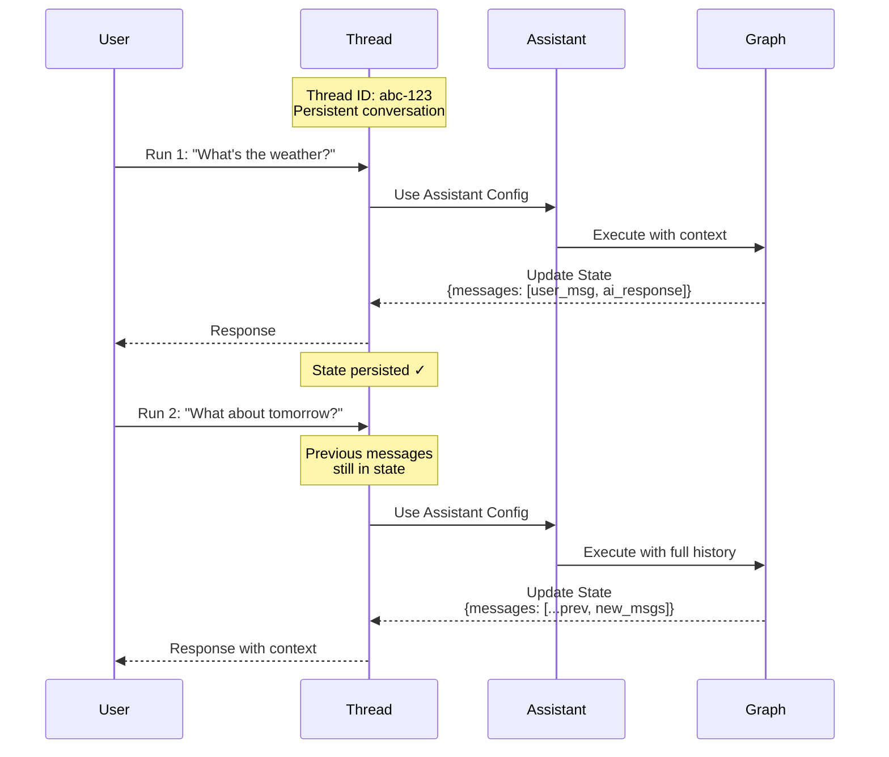

This guide shows you how to create, view, and inspect _threads_. Threads work with [assistants](lc:langsmith/assistants) to enable [stateful](lc:oss/python/langgraph/persistence) execution of your [deployed graphs](lc:langsmith/deployment).

## Understand threads

A thread is a persistent conversation container that maintains state across multiple runs. Each time you execute a run on a thread, the graph processes the input with the thread's current state and updates that state with new information.

Threads enable stateful interactions by preserving conversation history and context between runs. Without threads, each run would be stateless, with no memory of previous interactions. Threads are particularly useful for:

- Multi-turn conversations where the assistant needs to remember what was discussed.
- Long-running tasks that require maintaining context across multiple steps.
- User-specific state management where each user has their own conversation history.

The diagram illustrates how a thread maintains state across two runs. The second run has access to the messages from the first run, allowing the assistant to understand that the context of "What about tomorrow?" refers to the weather query from the first run:



- A thread maintains a persistent conversation with a unique thread ID.
- Each run applies the assistant's configuration to the graph execution.
- State is updated after each run and persists for subsequent runs.
- Later runs have access to the full conversation history.


> [!NOTE]
>
> - **[Assistants](lc:langsmith/assistants)** define the configuration (model, prompts, tools) for how your graph executes. When creating a run, you can specify either a **graph ID** (e.g., `"agent"`) to use the default assistant, or an **assistant ID** (UUID) to use a specific configuration.
> - **Threads** maintain the state and conversation history.
> - **Runs** combine an assistant and thread to execute your graph with a specific configuration and state.


> [!TIP]
>
> Best practice: When tracing runs in a thread (conversation), ensure that `thread_id` is set on all runs—both parent and child runs. This is required for thread filtering, token counting, and thread-level evaluations to work correctly.


## Create a thread

To run your graph with state persistence, you must first create a thread:

#### Tab: SDK

### Empty thread

To create a new thread, use one of:

```lc-tabs
[
 {
  "label": "Python",
  "lang": "python",
  "code": "from langgraph_sdk import get_client\n\n# Initialize the client with your deployment URL\nclient = get_client(url=<DEPLOYMENT_URL>)\n\n# Create an empty thread\n# This creates a new thread with no initial state\nthread = await client.threads.create()\n\nprint(thread)"
 },
 {
  "label": "cURL",
  "lang": "bash",
  "code": "curl --request POST \\\n    --url <DEPLOYMENT_URL>/threads \\\n    --header 'Content-Type: application/json' \\\n    --data '{}'"
 }
]
```

For more information, refer to the `Python`[ThreadsClient.create] and `JS`[ThreadsClient.create] SDK docs, or the [REST API](https://docs.langchain.com/langsmith/agent-server-api/threads/create-thread) reference.

Output:

```json
{
  "thread_id": "123e4567-e89b-12d3-a456-426614174000",
  "created_at": "2025-05-12T14:04:08.268Z",
  "updated_at": "2025-05-12T14:04:08.268Z",
  "metadata": {},
  "status": "idle",
  "values": {}
}
```

### Copy thread

Alternatively, if you already have a thread in your application whose state you wish to copy, you can use the `copy` method. This will create an independent thread whose history is identical to the original thread at the time of the operation:

```lc-tabs
[
 {
  "label": "Python",
  "lang": "python",
  "code": "# Copy an existing thread\n# The new thread will have the same state as the original at the time of copying\ncopied_thread = await client.threads.copy(thread[\"thread_id\"])"
 },
 {
  "label": "cURL",
  "lang": "bash",
  "code": "curl --request POST --url <DEPLOYMENT_URL>/threads/thread[\"thread_id\"]/copy \\\n--header 'Content-Type: application/json'"
 }
]
```

For more information, refer to the `Python`[ThreadsClient.copy] and `JS`[ThreadsClient.copy] SDK docs, or the [REST API](https://docs.langchain.com/langsmith/agent-server-api/threads/copy-thread) reference.

### Prepopulated state

You can create a thread with an arbitrary pre-defined state by providing a list of `supersteps` into the `create` method. The `supersteps` describe a sequence of state updates that establish the initial state of the thread. This is useful when you want to:

- Create a thread with existing conversation history.
- Migrate conversations from another system.
- Set up test scenarios with specific initial states.
- Resume conversations from a previous session.

For more information on checkpoints and state management, refer to the [LangGraph persistence documentation](lc:oss/python/langgraph/persistence).

```lc-tabs
[
 {
  "label": "Python",
  "lang": "python",
  "code": "from langgraph_sdk import get_client\n\n# Initialize the client\nclient = get_client(url=<DEPLOYMENT_URL>)\n\n# Create a thread with pre-populated conversation history\n# The supersteps define a sequence of state updates that build up the initial state\nthread = await client.threads.create(\n  graph_id=\"agent\",  # Specify which graph this thread is for\n  supersteps=[\n    {\n      updates: [\n        {\n          values: {},\n          as_node: '__input__',  # Initial input node\n        },\n      ],\n    },\n    {\n      updates: [\n        {\n          values: {\n            messages: [\n              {\n                type: 'human',\n                content: 'hello',\n              },\n            ],\n          },\n          as_node: '__start__',  # User's first message\n        },\n      ],\n    },\n    {\n      updates: [\n        {\n          values: {\n            messages: [\n              {\n                content: 'Hello! How can I assist you today?',\n                type: 'ai',\n              },\n            ],\n          },\n          as_node: 'call_model',  # Assistant's response\n        },\n      ],\n    },\n  ])\n\nprint(thread)"
 },
 {
  "label": "cURL",
  "lang": "bash",
  "code": "curl --request POST \\\n    --url <DEPLOYMENT_URL>/threads \\\n    --header 'Content-Type: application/json' \\\n    --data '{\"metadata\":{\"graph_id\":\"agent\"},\"supersteps\":[{\"updates\":[{\"values\":{},\"as_node\":\"__input__\"}]},{\"updates\":[{\"values\":{\"messages\":[{\"type\":\"human\",\"content\":\"hello\"}]},\"as_node\":\"__start__\"}]},{\"updates\":[{\"values\":{\"messages\":[{\"content\":\"Hello\\u0021 How can I assist you today?\",\"type\":\"ai\"}]},\"as_node\":\"call_model\"}]}]}'"
 }
]
```

Output:

```json
{
  "thread_id": "f15d70a1-27d4-4793-a897-de5609920b7d",
  "created_at": "2025-05-12T15:37:08.935038+00:00",
  "updated_at": "2025-05-12T15:37:08.935046+00:00",
  "metadata": {
    "graph_id": "agent"
  },
  "status": "idle",
  "config": {},
  "values": {
    "messages": [
      {
        "content": "hello",
        "additional_kwargs": {},
        "response_metadata": {},
        "type": "human",
        "name": null,
        "id": "8701f3be-959c-4b7c-852f-c2160699b4ab",
        "example": false
      },
      {
        "content": "Hello! How can I assist you today?",
        "additional_kwargs": {},
        "response_metadata": {},
        "type": "ai",
        "name": null,
        "id": "4d8ea561-7ca1-409a-99f7-6b67af3e1aa3",
        "example": false,
        "tool_calls": [],
        "invalid_tool_calls": [],
        "usage_metadata": null
      }
    ]
  }
}
```

#### Tab: UI

You can also create threads directly from the [LangSmith UI](https://smith.langchain.com):

1. Navigate to your [deployment](lc:langsmith/deployment).
2. Select the **Threads** tab.
3. Click **+ New thread**.
4. Optionally provide metadata or initial state for the thread.
5. Click **Create thread**.

The newly created thread will appear in the threads table and can be used for runs immediately.

## List threads

#### Tab: SDK

To list threads, use the `search` method. This will list the threads in the application that match the provided filters:

### Filter by thread status

Use the `status` field to filter threads based on their status. Supported values are `idle`, `busy`, `interrupted`, and `error`. For example, to view `idle` threads:

```lc-tabs
[
 {
  "label": "Python",
  "lang": "python",
  "code": "# Search for idle threads\n# The status filter accepts: idle, busy, interrupted, error\nprint(await client.threads.search(status=\"idle\", limit=1))"
 },
 {
  "label": "cURL",
  "lang": "bash",
  "code": "curl --request POST \\\n--url <DEPLOYMENT_URL>/threads/search \\\n--header 'Content-Type: application/json' \\\n--data '{\"status\": \"idle\", \"limit\": 1}'"
 }
]
```

For more information, refer to the `Python`[ThreadsClient.search] and `JS`[ThreadsClient.search] SDK docs, or the [REST API](https://docs.langchain.com/langsmith/agent-server-api/threads/search-threads) reference.

Output:

```json
[
  {
    "thread_id": "cacf79bb-4248-4d01-aabc-938dbd60ed2c",
    "created_at": "2024-08-14T17:36:38.921660+00:00",
    "updated_at": "2024-08-14T17:36:38.921660+00:00",
    "metadata": {
      "graph_id": "agent"
    },
    "status": "idle",
    "config": {
      "configurable": {}
    }
  }
]
```

### Filter by metadata

The `search` method allows you to filter on metadata. This is useful for finding threads associated with specific graphs, users, or custom metadata you've added to threads.

Common metadata fields you can filter on include:

| Metadata key | Description |
|---|---|
| `graph_id` | The graph (deployment) the thread belongs to. |
| `assistant_id` | The [assistant](lc:langsmith/assistants) used to create runs on the thread. |
| `langgraph_auth_user_id` | The authenticated user who owns the thread (set automatically when using [custom auth](lc:langsmith/custom-auth)). |
| `cron_id` | The [cron job](lc:langsmith/cron-jobs) that created runs on the thread. |

You can also filter on any custom metadata you attach when creating or updating threads.

#### Filter by graph

```lc-tabs
[
 {
  "label": "Python",
  "lang": "python",
  "code": "print(await client.threads.search(metadata={\"graph_id\": \"agent\"}, limit=1))"
 },
 {
  "label": "cURL",
  "lang": "bash",
  "code": "curl --request POST \\\n--url <DEPLOYMENT_URL>/threads/search \\\n--header 'Content-Type: application/json' \\\n--data '{\"metadata\": {\"graph_id\": \"agent\"}, \"limit\": 1}'"
 }
]
```

Output:

```json
[
  {
    "thread_id": "cacf79bb-4248-4d01-aabc-938dbd60ed2c",
    "created_at": "2024-08-14T17:36:38.921660+00:00",
    "updated_at": "2024-08-14T17:36:38.921660+00:00",
    "metadata": {
      "graph_id": "agent"
    },
    "status": "idle",
    "config": {
      "configurable": {}
    }
  }
]
```

#### Filter by assistant

```lc-tabs
[
 {
  "label": "Python",
  "lang": "python",
  "code": "print(await client.threads.search(\n    metadata={\"assistant_id\": \"fe096781-5601-53d2-b2f6-0d3403f7e9ca\"},\n    limit=1,\n))"
 },
 {
  "label": "cURL",
  "lang": "bash",
  "code": "curl --request POST \\\n--url <DEPLOYMENT_URL>/threads/search \\\n--header 'Content-Type: application/json' \\\n--data '{\"metadata\": {\"assistant_id\": \"fe096781-5601-53d2-b2f6-0d3403f7e9ca\"}, \"limit\": 1}'"
 }
]
```

#### Filter by cron job

```lc-tabs
[
 {
  "label": "Python",
  "lang": "python",
  "code": "print(await client.threads.search(\n    metadata={\"cron_id\": \"8b98a268-e49a-4228-a0d3-1a354e3a54d0\"},\n    limit=10,\n))"
 },
 {
  "label": "cURL",
  "lang": "bash",
  "code": "curl --request POST \\\n--url <DEPLOYMENT_URL>/threads/search \\\n--header 'Content-Type: application/json' \\\n--data '{\"metadata\": {\"cron_id\": \"8b98a268-e49a-4228-a0d3-1a354e3a54d0\"}, \"limit\": 10}'"
 }
]
```

### Sorting

The SDK also supports sorting threads by `thread_id`, `status`, `created_at`, and `updated_at` using the `sort_by` and `sort_order` parameters.

#### Tab: UI

You can also view and manage threads in a deployment via the [LangSmith UI](https://smith.langchain.com):

1. Navigate to your [deployment](lc:langsmith/deployment).
2. Select the **Threads** tab.

This will load a table of all threads in your deployment.

**Filter by thread status:** Select a status in the top bar to filter threads by `idle`, `busy`, `interrupted`, or `error`.

**Sort threads:** Click on the arrow icon for any column header to sort by that property (`thread_id`, `status`, `created_at`, or `updated_at`).

## Inspect threads

#### Tab: SDK

### Get thread

To view a specific thread given its `thread_id`, use the `get`[ThreadsClient.get] method:

```lc-tabs
[
 {
  "label": "Python",
  "lang": "python",
  "code": "# Retrieve a specific thread by its ID\n# Returns the thread metadata including status, creation time, and metadata\nprint((await client.threads.get(thread[\"thread_id\"])))"
 },
 {
  "label": "cURL",
  "lang": "bash",
  "code": "curl --request GET \\\n--url <DEPLOYMENT_URL>/threads/thread[\"thread_id\"] \\\n--header 'Content-Type: application/json'"
 }
]
```

Output:

```json
{
  "thread_id": "cacf79bb-4248-4d01-aabc-938dbd60ed2c",
  "created_at": "2024-08-14T17:36:38.921660+00:00",
  "updated_at": "2024-08-14T17:36:38.921660+00:00",
  "metadata": {
    "graph_id": "agent"
  },
  "status": "idle",
  "config": {
    "configurable": {}
  }
}
```

For more information, refer to the `Python`[ThreadsClient.get] and `JS`[ThreadsClient.get] SDK docs, or the [REST API](https://docs.langchain.com/langsmith/agent-server-api/threads/get-thread) reference.

### Inspect thread state

To view the current state of a given thread, use the `get_state`[ThreadsClient.get_state] method. This returns the current values, next nodes to execute, and checkpoint information:

```lc-tabs
[
 {
  "label": "Python",
  "lang": "python",
  "code": "# Get the current state of a thread\n# Returns values, next nodes, tasks, checkpoint info, and metadata\nprint((await client.threads.get_state(thread[\"thread_id\"])))"
 },
 {
  "label": "cURL",
  "lang": "bash",
  "code": "curl --request GET \\\n--url <DEPLOYMENT_URL>/threads/thread[\"thread_id\"]/state \\\n--header 'Content-Type: application/json'"
 }
]
```

Output:

```json
{
  "values": {
    "messages": [
      {
        "content": "hello",
        "additional_kwargs": {},
        "response_metadata": {},
        "type": "human",
        "name": null,
        "id": "8701f3be-959c-4b7c-852f-c2160699b4ab",
        "example": false
      },
      {
        "content": "Hello! How can I assist you today?",
        "additional_kwargs": {},
        "response_metadata": {},
        "type": "ai",
        "name": null,
        "id": "4d8ea561-7ca1-409a-99f7-6b67af3e1aa3",
        "example": false,
        "tool_calls": [],
        "invalid_tool_calls": [],
        "usage_metadata": null
      }
    ]
  },
  "next": [],
  "tasks": [],
  "metadata": {
    "thread_id": "f15d70a1-27d4-4793-a897-de5609920b7d",
    "checkpoint_id": "1f02f46f-7308-616c-8000-1b158a9a6955",
    "graph_id": "agent_with_quite_a_long_name",
    "source": "update",
    "step": 1,
    "writes": {
      "call_model": {
        "messages": [
          {
            "content": "Hello! How can I assist you today?",
            "type": "ai"
          }
        ]
      }
    },
    "parents": {}
  },
  "created_at": "2025-05-12T15:37:09.008055+00:00",
  "checkpoint": {
    "checkpoint_id": "1f02f46f-733f-6b58-8001-ea90dcabb1bd",
    "thread_id": "f15d70a1-27d4-4793-a897-de5609920b7d",
    "checkpoint_ns": ""
  },
  "parent_checkpoint": {
    "checkpoint_id": "1f02f46f-7308-616c-8000-1b158a9a6955",
    "thread_id": "f15d70a1-27d4-4793-a897-de5609920b7d",
    "checkpoint_ns": ""
  },
  "checkpoint_id": "1f02f46f-733f-6b58-8001-ea90dcabb1bd",
  "parent_checkpoint_id": "1f02f46f-7308-616c-8000-1b158a9a6955"
}
```

For more information, refer to the `Python`[ThreadsClient.get_state] and `JS`[ThreadsClient.get_state] SDK docs, or the [REST API](https://docs.langchain.com/langsmith/agent-server-api/threads/get-thread-state) reference.

Optionally, to view the state of a thread at a given checkpoint, pass in the checkpoint ID. This is useful for inspecting the thread state at a specific point in its execution history.

First, get the checkpoint ID from the thread's history:

```lc-tabs
[
 {
  "label": "Python",
  "lang": "python",
  "code": "# Get the thread history to find checkpoint IDs\nhistory = await client.threads.get_history(thread_id=thread[\"thread_id\"])\ncheckpoint_id = history[0][\"checkpoint_id\"]  # Get the most recent checkpoint"
 },
 {
  "label": "cURL",
  "lang": "bash",
  "code": "# Get the thread history to find checkpoint IDs\ncurl --request POST \\\n--url <DEPLOYMENT_URL>/threads/thread[\"thread_id\"]/history \\\n--header 'Content-Type: application/json' \\\n--data '{\"limit\": 1}'"
 }
]
```

Then use the checkpoint ID to get the state at that specific point:

```lc-tabs
[
 {
  "label": "Python",
  "lang": "python",
  "code": "# Get thread state at a specific checkpoint\n# Useful for inspecting historical state or debugging\nthread_state = await client.threads.get_state(\n  thread_id=thread[\"thread_id\"],\n  checkpoint_id=checkpoint_id\n)"
 },
 {
  "label": "cURL",
  "lang": "bash",
  "code": "curl --request GET \\\n--url <DEPLOYMENT_URL>/threads/thread[\"thread_id\"]/state/<CHECKPOINT_ID> \\\n--header 'Content-Type: application/json'"
 }
]
```

### Inspect full thread history

To view a thread's history, use the `get_history`[ThreadsClient.get_history] method. This returns a list of every state the thread experienced, allowing you to trace the full execution path:

```lc-tabs
[
 {
  "label": "Python",
  "lang": "python",
  "code": "# Get the full history of a thread\n# Returns a list of all state snapshots from the thread's execution\nhistory = await client.threads.get_history(\n  thread_id=thread[\"thread_id\"],\n  limit=10  # Optional: limit the number of states returned\n)\n\nfor state in history:\n    print(f\"Checkpoint: {state['checkpoint_id']}\")\n    print(f\"Step: {state['metadata']['step']}\")"
 },
 {
  "label": "cURL",
  "lang": "bash",
  "code": "curl --request POST \\\n--url <DEPLOYMENT_URL>/threads/thread[\"thread_id\"]/history \\\n--header 'Content-Type: application/json' \\\n--data '{\"limit\": 10}'"
 }
]
```

This method is particularly useful for:
- Debugging execution flow by seeing how state evolved.
- Understanding decision points in your graph's execution.
- Auditing conversation history and state changes.
- Replaying or analyzing past interactions.

For more information, refer to the `Python`[ThreadsClient.get_history] and `JS`[ThreadsClient.get_history] SDK docs, or the [REST API](https://docs.langchain.com/langsmith/agent-server-api/threads/get-thread-history) reference.

#### Tab: UI

You can also view and inspect threads in the [LangSmith UI](https://smith.langchain.com):

1. Navigate to your [deployment](lc:langsmith/deployment).
2. Select the **Threads** tab to view all threads.
3. Click on a thread to inspect its current state.

To view the full thread history and perform detailed debugging, click **Open in Studio** to open the thread in [Studio](lc:langsmith/studio). Studio provides a visual interface for exploring the thread's execution history, state changes, and checkpoint details.
