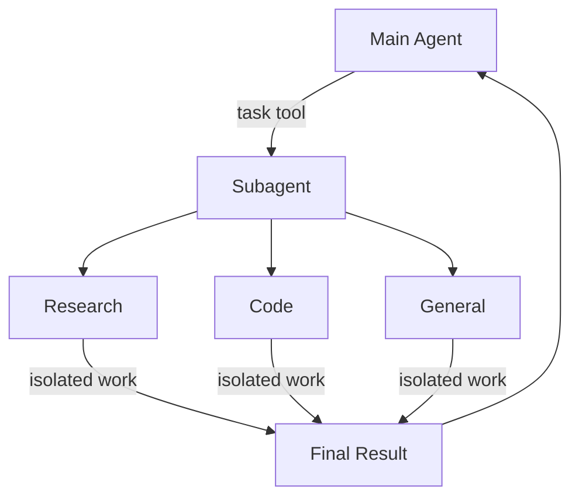

A deep agent can create subagents to delegate work. You can specify custom subagents in the `subagents` parameter. Subagents are useful for [context quarantine](https://www.dbreunig.com/2025/06/26/how-to-fix-your-context.html#context-quarantine) (keeping the main agent's context clean) and for providing specialized instructions.

This page covers **synchronous** subagents, where the supervisor blocks until the subagent finishes. For long-running tasks, parallel workstreams, or cases where you need mid-flight steering and cancellation, see [Async subagents](lc:oss/python/deepagents/async-subagents).



## Why use subagents?

Subagents solve the **context bloat problem**. When agents use tools with large outputs (web search, file reads, database queries), the context window fills up quickly with intermediate results. Subagents isolate this detailed work—the main agent receives only the final result, not the dozens of tool calls that produced it.

**When to use subagents:**
- ✅ Multi-step tasks that would clutter the main agent's context
- ✅ Specialized domains that need custom instructions or tools
- ✅ Tasks requiring different model capabilities
- ✅ When you want to keep the main agent focused on high-level coordination

**When NOT to use subagents:**
- ❌ Simple, single-step tasks
- ❌ When you need to maintain intermediate context
- ❌ When the overhead outweighs benefits

## Configuration

`subagents` should be a list of dictionaries or `CompiledSubAgent` objects. There are two types:

### Default subagent

Deep Agents automatically adds a synchronous `general-purpose` subagent unless you already provide a synchronous subagent with that name.

The `general-purpose` subagent has filesystem tools by default and can be customized with additional tools/middleware.

- To replace it, pass your own subagent named `general-purpose`.
- To rename or re-prompt the auto-added version, set `general_purpose_subagent=GeneralPurposeSubagentProfile(...)` on the active [harness profile](lc:oss/python/deepagents/profiles#harness-profiles).
- To disable it, see [Running without subagents](#running-without-subagents) below.

### Running without subagents

To run an agent without the `task` tool, do two things:

1. Set `general_purpose_subagent=GeneralPurposeSubagentProfile(enabled=False)` on the active [harness profile](lc:oss/python/deepagents/profiles#harness-profiles).
2. Pass no synchronous subagents via `subagents=` on `create_deep_agent`.

Deep Agents only attaches `SubAgentMiddleware` (and the `task` tool) when at least one synchronous subagent exists. With neither the default nor a caller-provided one, the agent runs without delegation.

Async subagents are unaffected—they flow through their own middleware and tools, described in [Async subagents](lc:oss/python/deepagents/async-subagents).


> [!TIP]
>
> Don't reach for `excluded_middleware` here—`SubAgentMiddleware` is required scaffolding and listing it raises `ValueError`. The `general_purpose_subagent.enabled = False` knob is the supported path.


## Custom subagents

You can define specialized subagents with specific tool by using the `subagents` parameter. For example to serve as a code reviewer, web researcher, or test runner.

For most use cases, define subagents as dictionaries with [SubAgent dictionaries](#subagent-dictionary-based). For complex workflows, use a [`CompiledSubAgent`](#compiledsubagent):

### SubAgent (Dictionary-based)

Define subagents as dictionaries matching the `SubAgent` spec with the following fields:


| Field | Type | Description |
|-------|------|-------------|
| `name` | `str` | Required. Unique identifier for the subagent. The main agent uses this name when calling the `task()` tool. The subagent name becomes metadata for `AIMessage`s and for streaming, which helps to differentiate between agents. |
| `description` | `str` | Required. Description of what this subagent does. Be specific and action-oriented. The main agent uses this to decide when to delegate. |
| `system_prompt` | `str` | Required. Instructions for the subagent. Custom subagents must define their own. Include tool usage guidance and output format requirements.<br></br>Does not inherit from main agent. |
| `tools` | `list[Callable]` | Optional. Tools the subagent can use. Keep this minimal and include only what's needed.<br></br>Inherits from main agent by default. When specified, overrides the inherited tools entirely. |
| `model` | `str` \| `BaseChatModel` | Optional. Overrides the main agent's model. Omit to use the main agent's model.<br></br>Inherits from main agent by default. You can pass either a model identifier string like `'openai:gpt-5.5'` (using the `'provider:model'` format) or a LangChain chat model object (`init_chat_model("gpt-5.5")` or `ChatOpenAI(model="gpt-5.5")`). |
| `middleware` | `list[Middleware]` | Optional. Additional middleware for custom behavior, logging, or rate limiting.<br></br>Does not inherit from the main agent. Merged into the [synchronous subagent stack](lc:oss/python/deepagents/customization#synchronous-subagent-stack): an instance whose `.name` matches a default replaces it in place, anything else lands after the last core middleware entry and before profile, prompt-caching, and memory. See [Override a default middleware instance](lc:oss/python/deepagents/customization#override-a-default-middleware-instance). For example, include a `FilesystemMiddleware` instance with a `tools` allowlist here to restrict the subagent's filesystem tools independently of the main agent. For more information, see the "Restricting filesystem tools" section under [Virtual filesystem access](lc:oss/python/deepagents/overview#virtual-filesystem-access). |
| `interrupt_on` | `dict[str, bool \| InterruptOnConfig]` | Optional. Configure [human-in-the-loop](lc:oss/python/deepagents/human-in-the-loop) for specific tools. Options:`True`, `False`, or an `InterruptOnConfig` with `allowed_decisions`. Requires checkpointer.<br></br>Inherits from main agent by default. Subagent value overrides the default. |
| `skills` | `list[str]` | Optional. [Skills](lc:oss/python/deepagents/skills) source paths. When specified, the subagent will load skills from these directories (e.g., `["/skills/research/", "/skills/web-search/"]`). This allows subagents to have different skill sets than the main agent.<br></br>Does not inherit from main agent. Only the general-purpose subagent inherits the main agent's skills. When a subagent has skills, it runs its own independent `SkillsMiddleware` instance. Skill state is fully isolated—a subagent's loaded skills are not visible to the parent, and vice versa. |
| `response_format` | `ResponseFormat` | Optional. [Structured output](lc:oss/python/langchain/structured-output) schema for the subagent. When set, the parent receives the subagent's result as JSON instead of free-form text. Accepts Pydantic models, `ToolStrategy(...)`, `ProviderStrategy(...)`, or a raw schema type. See [Structured output](#structured-output). |
| `permissions` | `list[FilesystemPermission]` | Optional. [Filesystem permission rules](lc:oss/python/deepagents/permissions) for the subagent. When set, **replaces** the parent agent's permissions entirely.<br></br>Inherits from main agent by default. |


### CompiledSubAgent

For complex workflows, use a prebuilt LangGraph graph as a `CompiledSubAgent`:

| Field | Type | Description |
|-------|------|-------------|
| `name` | `str` | Required. Unique identifier for the subagent. The subagent name becomes metadata for `AIMessage`s and for streaming, which helps to differentiate between agents. |
| `description` | `str` | Required. What this subagent does. |
| `runnable` | `Runnable` | Required. A compiled LangGraph graph (must call `.compile()` first). |

## Using SubAgent


```python

from typing import Literal

from deepagents import create_deep_agent
from tavily import TavilyClient

tavily_client = TavilyClient(api_key=os.environ["TAVILY_API_KEY"])

def internet_search(
    query: str,
    max_results: int = 5,
    topic: Literal["general", "news", "finance"] = "general",
    include_raw_content: bool = False,
):
    """Run a web search"""
    return tavily_client.search(
        query,
        max_results=max_results,
        include_raw_content=include_raw_content,
        topic=topic,
    )

research_subagent = {
    "name": "research-agent",
    "description": "Used to research more in depth questions",
    "system_prompt": "You are a great researcher",
    "tools": [internet_search],
    "model": "openai:gpt-5.5",  # Optional override, defaults to main agent model
}
subagents = [research_subagent]

agent = create_deep_agent(
    model="google_genai:gemini-3.6-flash",
    subagents=subagents,
)
```


## Using CompiledSubAgent

For more complex use cases, you can provide your custom subagents with `CompiledSubAgent`.
You can create a custom subagent using LangChain's `create_agent` or by making a custom LangGraph graph using the [graph API](lc:oss/python/langgraph/graph-api).

If you're creating a custom LangGraph graph, make sure that the graph has a [state key called `"messages"`](lc:oss/python/langgraph/quickstart#2-define-state):


```lc-tabs
[
 {
  "label": "Google",
  "lang": "python",
  "code": "from deepagents import CompiledSubAgent, create_deep_agent\nfrom langchain.agents import create_agent\n\n\ndef internet_search(query: str) -> str:\n    \"\"\"Run a web search.\"\"\"\n    return f\"search results for {query}\"\n\n\nresearch_instructions = \"You are a research coordinator.\"\nyour_model = \"openai:gpt-5.5\"\nspecialized_tools: list = []\n\n# Create a custom agent graph\ncustom_graph = create_agent(\n    model=your_model,\n    tools=specialized_tools,\n    system_prompt=\"You are a specialized agent for data analysis...\",\n)\n\n# Use it as a custom subagent\ncustom_subagent = CompiledSubAgent(\n    name=\"data-analyzer\",\n    description=\"Specialized agent for complex data analysis tasks\",\n    runnable=custom_graph,\n)\n\nsubagents = [custom_subagent]\n\nagent = create_deep_agent(\n    model=\"google_genai:gemini-3.6-flash\",\n    tools=[internet_search],\n    system_prompt=research_instructions,\n    subagents=subagents,\n)"
 },
 {
  "label": "OpenAI",
  "lang": "python",
  "code": "from deepagents import CompiledSubAgent, create_deep_agent\nfrom langchain.agents import create_agent\n\n\ndef internet_search(query: str) -> str:\n    \"\"\"Run a web search.\"\"\"\n    return f\"search results for {query}\"\n\n\nresearch_instructions = \"You are a research coordinator.\"\nyour_model = \"openai:gpt-5.5\"\nspecialized_tools: list = []\n\n# Create a custom agent graph\ncustom_graph = create_agent(\n    model=your_model,\n    tools=specialized_tools,\n    system_prompt=\"You are a specialized agent for data analysis...\",\n)\n\n# Use it as a custom subagent\ncustom_subagent = CompiledSubAgent(\n    name=\"data-analyzer\",\n    description=\"Specialized agent for complex data analysis tasks\",\n    runnable=custom_graph,\n)\n\nsubagents = [custom_subagent]\n\nagent = create_deep_agent(\n    model=\"openai:gpt-5.5\",\n    tools=[internet_search],\n    system_prompt=research_instructions,\n    subagents=subagents,\n)"
 },
 {
  "label": "Anthropic",
  "lang": "python",
  "code": "from deepagents import CompiledSubAgent, create_deep_agent\nfrom langchain.agents import create_agent\n\n\ndef internet_search(query: str) -> str:\n    \"\"\"Run a web search.\"\"\"\n    return f\"search results for {query}\"\n\n\nresearch_instructions = \"You are a research coordinator.\"\nyour_model = \"openai:gpt-5.5\"\nspecialized_tools: list = []\n\n# Create a custom agent graph\ncustom_graph = create_agent(\n    model=your_model,\n    tools=specialized_tools,\n    system_prompt=\"You are a specialized agent for data analysis...\",\n)\n\n# Use it as a custom subagent\ncustom_subagent = CompiledSubAgent(\n    name=\"data-analyzer\",\n    description=\"Specialized agent for complex data analysis tasks\",\n    runnable=custom_graph,\n)\n\nsubagents = [custom_subagent]\n\nagent = create_deep_agent(\n    model=\"anthropic:claude-sonnet-4-6\",\n    tools=[internet_search],\n    system_prompt=research_instructions,\n    subagents=subagents,\n)"
 },
 {
  "label": "OpenRouter",
  "lang": "python",
  "code": "from deepagents import CompiledSubAgent, create_deep_agent\nfrom langchain.agents import create_agent\n\n\ndef internet_search(query: str) -> str:\n    \"\"\"Run a web search.\"\"\"\n    return f\"search results for {query}\"\n\n\nresearch_instructions = \"You are a research coordinator.\"\nyour_model = \"openai:gpt-5.5\"\nspecialized_tools: list = []\n\n# Create a custom agent graph\ncustom_graph = create_agent(\n    model=your_model,\n    tools=specialized_tools,\n    system_prompt=\"You are a specialized agent for data analysis...\",\n)\n\n# Use it as a custom subagent\ncustom_subagent = CompiledSubAgent(\n    name=\"data-analyzer\",\n    description=\"Specialized agent for complex data analysis tasks\",\n    runnable=custom_graph,\n)\n\nsubagents = [custom_subagent]\n\nagent = create_deep_agent(\n    model=\"openrouter:z-ai/glm-5.2\",\n    tools=[internet_search],\n    system_prompt=research_instructions,\n    subagents=subagents,\n)"
 },
 {
  "label": "Fireworks",
  "lang": "python",
  "code": "from deepagents import CompiledSubAgent, create_deep_agent\nfrom langchain.agents import create_agent\n\n\ndef internet_search(query: str) -> str:\n    \"\"\"Run a web search.\"\"\"\n    return f\"search results for {query}\"\n\n\nresearch_instructions = \"You are a research coordinator.\"\nyour_model = \"openai:gpt-5.5\"\nspecialized_tools: list = []\n\n# Create a custom agent graph\ncustom_graph = create_agent(\n    model=your_model,\n    tools=specialized_tools,\n    system_prompt=\"You are a specialized agent for data analysis...\",\n)\n\n# Use it as a custom subagent\ncustom_subagent = CompiledSubAgent(\n    name=\"data-analyzer\",\n    description=\"Specialized agent for complex data analysis tasks\",\n    runnable=custom_graph,\n)\n\nsubagents = [custom_subagent]\n\nagent = create_deep_agent(\n    model=\"fireworks:accounts/fireworks/models/glm-5p2\",\n    tools=[internet_search],\n    system_prompt=research_instructions,\n    subagents=subagents,\n)"
 },
 {
  "label": "Baseten",
  "lang": "python",
  "code": "from deepagents import CompiledSubAgent, create_deep_agent\nfrom langchain.agents import create_agent\n\n\ndef internet_search(query: str) -> str:\n    \"\"\"Run a web search.\"\"\"\n    return f\"search results for {query}\"\n\n\nresearch_instructions = \"You are a research coordinator.\"\nyour_model = \"openai:gpt-5.5\"\nspecialized_tools: list = []\n\n# Create a custom agent graph\ncustom_graph = create_agent(\n    model=your_model,\n    tools=specialized_tools,\n    system_prompt=\"You are a specialized agent for data analysis...\",\n)\n\n# Use it as a custom subagent\ncustom_subagent = CompiledSubAgent(\n    name=\"data-analyzer\",\n    description=\"Specialized agent for complex data analysis tasks\",\n    runnable=custom_graph,\n)\n\nsubagents = [custom_subagent]\n\nagent = create_deep_agent(\n    model=\"baseten:zai-org/GLM-5.2\",\n    tools=[internet_search],\n    system_prompt=research_instructions,\n    subagents=subagents,\n)"
 },
 {
  "label": "Ollama",
  "lang": "python",
  "code": "from deepagents import CompiledSubAgent, create_deep_agent\nfrom langchain.agents import create_agent\n\n\ndef internet_search(query: str) -> str:\n    \"\"\"Run a web search.\"\"\"\n    return f\"search results for {query}\"\n\n\nresearch_instructions = \"You are a research coordinator.\"\nyour_model = \"openai:gpt-5.5\"\nspecialized_tools: list = []\n\n# Create a custom agent graph\ncustom_graph = create_agent(\n    model=your_model,\n    tools=specialized_tools,\n    system_prompt=\"You are a specialized agent for data analysis...\",\n)\n\n# Use it as a custom subagent\ncustom_subagent = CompiledSubAgent(\n    name=\"data-analyzer\",\n    description=\"Specialized agent for complex data analysis tasks\",\n    runnable=custom_graph,\n)\n\nsubagents = [custom_subagent]\n\nagent = create_deep_agent(\n    model=\"ollama:north-mini-code-1.0\",\n    tools=[internet_search],\n    system_prompt=research_instructions,\n    subagents=subagents,\n)"
 }
]
```


## Dynamic subagents

By default, the main agent delegates to subagents through `task` tool calls (it can issue several in a single turn to run them in parallel). With an [interpreter](lc:oss/python/deepagents/interpreters) attached, the agent can instead dispatch subagents **from code**—using loops, branches, and parallel batches to fan work out across many items and synthesize the results programmatically. This is called [dynamic subagents](lc:oss/python/deepagents/dynamic-subagents).

Reach for dynamic subagents when work spans many independent units (reviewing every file in a directory, triaging a batch of tickets), needs multiple perspectives, or benefits from recursive analysis.


> [!WARNING]
>
> Dynamic subagents use the interpreter runtime, which is in [**beta**](lc:oss/python/versioning). APIs and lifecycle behavior may change between releases.


### Enable dynamic subagents

Dynamic subagents become available as soon as the agent has both subagents and the interpreter middleware. Install the QuickJS interpreter package, then add `CodeInterpreterMiddleware` to your agent.


```lc-tabs
[
 {
  "label": "pip",
  "lang": "bash",
  "code": "pip install -U \"deepagents[quickjs]\""
 },
 {
  "label": "uv",
  "lang": "bash",
  "code": "uv add \"deepagents[quickjs]\""
 },
 {
  "label": "Google",
  "lang": "python",
  "code": "from deepagents import create_deep_agent\nfrom langchain_quickjs import CodeInterpreterMiddleware\n\nagent = create_deep_agent(\n    model=\"google_genai:gemini-3.6-flash\",\n    subagents=[{\n        \"name\": \"reviewer\",\n        \"description\": \"Reviews code for security issues, citing lines and severity\",\n        \"system_prompt\": \"You are a security-focused code reviewer. Report issues with line numbers and severity.\",\n    }],\n    middleware=[CodeInterpreterMiddleware()],\n)"
 },
 {
  "label": "OpenAI",
  "lang": "python",
  "code": "from deepagents import create_deep_agent\nfrom langchain_quickjs import CodeInterpreterMiddleware\n\nagent = create_deep_agent(\n    model=\"openai:gpt-5.5\",\n    subagents=[{\n        \"name\": \"reviewer\",\n        \"description\": \"Reviews code for security issues, citing lines and severity\",\n        \"system_prompt\": \"You are a security-focused code reviewer. Report issues with line numbers and severity.\",\n    }],\n    middleware=[CodeInterpreterMiddleware()],\n)"
 },
 {
  "label": "Anthropic",
  "lang": "python",
  "code": "from deepagents import create_deep_agent\nfrom langchain_quickjs import CodeInterpreterMiddleware\n\nagent = create_deep_agent(\n    model=\"anthropic:claude-sonnet-4-6\",\n    subagents=[{\n        \"name\": \"reviewer\",\n        \"description\": \"Reviews code for security issues, citing lines and severity\",\n        \"system_prompt\": \"You are a security-focused code reviewer. Report issues with line numbers and severity.\",\n    }],\n    middleware=[CodeInterpreterMiddleware()],\n)"
 },
 {
  "label": "OpenRouter",
  "lang": "python",
  "code": "from deepagents import create_deep_agent\nfrom langchain_quickjs import CodeInterpreterMiddleware\n\nagent = create_deep_agent(\n    model=\"openrouter:z-ai/glm-5.2\",\n    subagents=[{\n        \"name\": \"reviewer\",\n        \"description\": \"Reviews code for security issues, citing lines and severity\",\n        \"system_prompt\": \"You are a security-focused code reviewer. Report issues with line numbers and severity.\",\n    }],\n    middleware=[CodeInterpreterMiddleware()],\n)"
 },
 {
  "label": "Fireworks",
  "lang": "python",
  "code": "from deepagents import create_deep_agent\nfrom langchain_quickjs import CodeInterpreterMiddleware\n\nagent = create_deep_agent(\n    model=\"fireworks:accounts/fireworks/models/glm-5p2\",\n    subagents=[{\n        \"name\": \"reviewer\",\n        \"description\": \"Reviews code for security issues, citing lines and severity\",\n        \"system_prompt\": \"You are a security-focused code reviewer. Report issues with line numbers and severity.\",\n    }],\n    middleware=[CodeInterpreterMiddleware()],\n)"
 },
 {
  "label": "Baseten",
  "lang": "python",
  "code": "from deepagents import create_deep_agent\nfrom langchain_quickjs import CodeInterpreterMiddleware\n\nagent = create_deep_agent(\n    model=\"baseten:zai-org/GLM-5.2\",\n    subagents=[{\n        \"name\": \"reviewer\",\n        \"description\": \"Reviews code for security issues, citing lines and severity\",\n        \"system_prompt\": \"You are a security-focused code reviewer. Report issues with line numbers and severity.\",\n    }],\n    middleware=[CodeInterpreterMiddleware()],\n)"
 },
 {
  "label": "Ollama",
  "lang": "python",
  "code": "from deepagents import create_deep_agent\nfrom langchain_quickjs import CodeInterpreterMiddleware\n\nagent = create_deep_agent(\n    model=\"ollama:north-mini-code-1.0\",\n    subagents=[{\n        \"name\": \"reviewer\",\n        \"description\": \"Reviews code for security issues, citing lines and severity\",\n        \"system_prompt\": \"You are a security-focused code reviewer. Report issues with line numbers and severity.\",\n    }],\n    middleware=[CodeInterpreterMiddleware()],\n)"
 }
]
```


> [!NOTE]
>
> Dynamic subagent dispatch is on by default whenever the agent has subagents and the interpreter middleware. Pass `CodeInterpreterMiddleware(subagents=False)` to require dispatch through the normal `task` tool path. Interpreters require `langchain-quickjs>=0.2.0` and Python `>=3.11`.


### Trigger dynamic orchestration

Dynamic dispatch is implicit: the agent decides to fan work out from code based on the shape of the task, not a per-call flag.


> [!TIP]
>
> **The word "workflow" is a useful trigger.** The built-in interpreter system prompt treats a "workflow" as a signal to organize work through the interpreter—dispatching subagents with `task()` from code. Phrasing a request as a "workflow" is a deliberate lever you can pull to opt into dynamic orchestration: include it when you want the agent to fan work out from code. For a single, direct delegation, phrase the request plainly instead.


For example, phrasing the request as a "workflow" opts into fan-out from code:


```python
result = agent.invoke({
    "messages": [{"role": "user", "content": "Run a workflow that reviews every file in src/routes/ and summarizes the top risks."}]
})
```


For configuration, advanced orchestration patterns, and safety notes, see [Dynamic subagents](lc:oss/python/deepagents/dynamic-subagents).

### Use with a coding agent

The fastest way to try dynamic subagents is with `dcode`, the LangChain terminal coding agent built on a Deep Agent. It ships with the code interpreter enabled, so dynamic subagents work out of the box with nothing to wire up.

Install `dcode`:

```bash
curl -LsSf https://langch.in/dcode | bash
```

Run it:

```bash
dcode
```

To trigger dynamic subagents, ask for a "workflow". Instead of grinding through the work itself or managing fan-out through its native `task` tool, the agent writes an orchestration script that calls the built-in `task()` global and runs it in the code interpreter. For example: "Run a workflow to review every file in src/ for SQL injection."

As subagents spawn, `dcode` shows them live in the dynamic subagents panel, grouped into phases by dispatch.

  

`dcode` is the fastest way to try this, but you can also use dynamic subagents in the coding agent of your choice over [ACP](lc:oss/python/deepagents/acp) (for example, Zed).

## Streaming

Deep Agents support streaming updates from both the coordinator and every delegated subagent.

Use [`stream_events`](lc:oss/python/deepagents/event-streaming) to get typed projections—separate iterators for subagents, messages, tool calls, and values—so you can consume each independently.


### Stream subagent progress

The simplest pattern is to iterate `stream.subagents` to track each delegated task as it starts, runs, and completes. Each subagent handle exposes `.name`, `.messages`, `.tool_calls`, and `.output`.


```lc-tabs
[
 {
  "label": "Google",
  "lang": "python",
  "code": "from deepagents import (\n    create_deep_agent\n)\n\nagent = create_deep_agent(\n    model=\"google_genai:gemini-3.6-flash\",\n    system_prompt=(\n        \"You are a project coordinator with no research knowledge. \"\n        \"For every user request, you must call the task() tool with \"\n        \"subagent_type set to research-agent. Never answer research \"\n        \"questions yourself.\"\n    ),\n    subagents=[\n        {\n            \"name\": \"research-agent\",\n            \"description\": (\n                \"Delegate research to this subagent. Give one topic at a time.\"\n            ),\n            \"system_prompt\": (\n                \"You are a great researcher. Return a brief summary.\"\n            ),\n        },\n    ],\n    name=\"main-agent\",\n)\n\nif __name__ == \"__main__\":\n    stream = agent.stream_events(\n        {\n            \"messages\": [\n                {\n                    \"role\": \"user\",\n                    \"content\": \"Research one recent advance in quantum computing.\",\n                }\n            ]\n        },\n        version=\"v3\",\n    )\n\n    coordinator_messages: list[str] = []\n    subagent_handles = []\n\n    for name, item in stream.interleave(\"messages\", \"subagents\"):\n        if name == \"messages\":\n            print(\"[coordinator]\", item.text)\n            coordinator_messages.append(item.text)\n        else:\n            print(f\"[{item.name}] started\")\n            subagent_handles.append(item)\n            for message in item.messages:\n                print(f\"[{item.name}]\", message.text)\n            print(f\"[{item.name}] status: {item.status}\")"
 },
 {
  "label": "OpenAI",
  "lang": "python",
  "code": "from deepagents import (\n    create_deep_agent\n)\n\nagent = create_deep_agent(\n    model=\"openai:gpt-5.5\",\n    system_prompt=(\n        \"You are a project coordinator with no research knowledge. \"\n        \"For every user request, you must call the task() tool with \"\n        \"subagent_type set to research-agent. Never answer research \"\n        \"questions yourself.\"\n    ),\n    subagents=[\n        {\n            \"name\": \"research-agent\",\n            \"description\": (\n                \"Delegate research to this subagent. Give one topic at a time.\"\n            ),\n            \"system_prompt\": (\n                \"You are a great researcher. Return a brief summary.\"\n            ),\n        },\n    ],\n    name=\"main-agent\",\n)\n\nif __name__ == \"__main__\":\n    stream = agent.stream_events(\n        {\n            \"messages\": [\n                {\n                    \"role\": \"user\",\n                    \"content\": \"Research one recent advance in quantum computing.\",\n                }\n            ]\n        },\n        version=\"v3\",\n    )\n\n    coordinator_messages: list[str] = []\n    subagent_handles = []\n\n    for name, item in stream.interleave(\"messages\", \"subagents\"):\n        if name == \"messages\":\n            print(\"[coordinator]\", item.text)\n            coordinator_messages.append(item.text)\n        else:\n            print(f\"[{item.name}] started\")\n            subagent_handles.append(item)\n            for message in item.messages:\n                print(f\"[{item.name}]\", message.text)\n            print(f\"[{item.name}] status: {item.status}\")"
 },
 {
  "label": "Anthropic",
  "lang": "python",
  "code": "from deepagents import (\n    create_deep_agent\n)\n\nagent = create_deep_agent(\n    model=\"anthropic:claude-sonnet-4-6\",\n    system_prompt=(\n        \"You are a project coordinator with no research knowledge. \"\n        \"For every user request, you must call the task() tool with \"\n        \"subagent_type set to research-agent. Never answer research \"\n        \"questions yourself.\"\n    ),\n    subagents=[\n        {\n            \"name\": \"research-agent\",\n            \"description\": (\n                \"Delegate research to this subagent. Give one topic at a time.\"\n            ),\n            \"system_prompt\": (\n                \"You are a great researcher. Return a brief summary.\"\n            ),\n        },\n    ],\n    name=\"main-agent\",\n)\n\nif __name__ == \"__main__\":\n    stream = agent.stream_events(\n        {\n            \"messages\": [\n                {\n                    \"role\": \"user\",\n                    \"content\": \"Research one recent advance in quantum computing.\",\n                }\n            ]\n        },\n        version=\"v3\",\n    )\n\n    coordinator_messages: list[str] = []\n    subagent_handles = []\n\n    for name, item in stream.interleave(\"messages\", \"subagents\"):\n        if name == \"messages\":\n            print(\"[coordinator]\", item.text)\n            coordinator_messages.append(item.text)\n        else:\n            print(f\"[{item.name}] started\")\n            subagent_handles.append(item)\n            for message in item.messages:\n                print(f\"[{item.name}]\", message.text)\n            print(f\"[{item.name}] status: {item.status}\")"
 },
 {
  "label": "OpenRouter",
  "lang": "python",
  "code": "from deepagents import (\n    create_deep_agent\n)\n\nagent = create_deep_agent(\n    model=\"openrouter:z-ai/glm-5.2\",\n    system_prompt=(\n        \"You are a project coordinator with no research knowledge. \"\n        \"For every user request, you must call the task() tool with \"\n        \"subagent_type set to research-agent. Never answer research \"\n        \"questions yourself.\"\n    ),\n    subagents=[\n        {\n            \"name\": \"research-agent\",\n            \"description\": (\n                \"Delegate research to this subagent. Give one topic at a time.\"\n            ),\n            \"system_prompt\": (\n                \"You are a great researcher. Return a brief summary.\"\n            ),\n        },\n    ],\n    name=\"main-agent\",\n)\n\nif __name__ == \"__main__\":\n    stream = agent.stream_events(\n        {\n            \"messages\": [\n                {\n                    \"role\": \"user\",\n                    \"content\": \"Research one recent advance in quantum computing.\",\n                }\n            ]\n        },\n        version=\"v3\",\n    )\n\n    coordinator_messages: list[str] = []\n    subagent_handles = []\n\n    for name, item in stream.interleave(\"messages\", \"subagents\"):\n        if name == \"messages\":\n            print(\"[coordinator]\", item.text)\n            coordinator_messages.append(item.text)\n        else:\n            print(f\"[{item.name}] started\")\n            subagent_handles.append(item)\n            for message in item.messages:\n                print(f\"[{item.name}]\", message.text)\n            print(f\"[{item.name}] status: {item.status}\")"
 },
 {
  "label": "Fireworks",
  "lang": "python",
  "code": "from deepagents import (\n    create_deep_agent\n)\n\nagent = create_deep_agent(\n    model=\"fireworks:accounts/fireworks/models/glm-5p2\",\n    system_prompt=(\n        \"You are a project coordinator with no research knowledge. \"\n        \"For every user request, you must call the task() tool with \"\n        \"subagent_type set to research-agent. Never answer research \"\n        \"questions yourself.\"\n    ),\n    subagents=[\n        {\n            \"name\": \"research-agent\",\n            \"description\": (\n                \"Delegate research to this subagent. Give one topic at a time.\"\n            ),\n            \"system_prompt\": (\n                \"You are a great researcher. Return a brief summary.\"\n            ),\n        },\n    ],\n    name=\"main-agent\",\n)\n\nif __name__ == \"__main__\":\n    stream = agent.stream_events(\n        {\n            \"messages\": [\n                {\n                    \"role\": \"user\",\n                    \"content\": \"Research one recent advance in quantum computing.\",\n                }\n            ]\n        },\n        version=\"v3\",\n    )\n\n    coordinator_messages: list[str] = []\n    subagent_handles = []\n\n    for name, item in stream.interleave(\"messages\", \"subagents\"):\n        if name == \"messages\":\n            print(\"[coordinator]\", item.text)\n            coordinator_messages.append(item.text)\n        else:\n            print(f\"[{item.name}] started\")\n            subagent_handles.append(item)\n            for message in item.messages:\n                print(f\"[{item.name}]\", message.text)\n            print(f\"[{item.name}] status: {item.status}\")"
 },
 {
  "label": "Baseten",
  "lang": "python",
  "code": "from deepagents import (\n    create_deep_agent\n)\n\nagent = create_deep_agent(\n    model=\"baseten:zai-org/GLM-5.2\",\n    system_prompt=(\n        \"You are a project coordinator with no research knowledge. \"\n        \"For every user request, you must call the task() tool with \"\n        \"subagent_type set to research-agent. Never answer research \"\n        \"questions yourself.\"\n    ),\n    subagents=[\n        {\n            \"name\": \"research-agent\",\n            \"description\": (\n                \"Delegate research to this subagent. Give one topic at a time.\"\n            ),\n            \"system_prompt\": (\n                \"You are a great researcher. Return a brief summary.\"\n            ),\n        },\n    ],\n    name=\"main-agent\",\n)\n\nif __name__ == \"__main__\":\n    stream = agent.stream_events(\n        {\n            \"messages\": [\n                {\n                    \"role\": \"user\",\n                    \"content\": \"Research one recent advance in quantum computing.\",\n                }\n            ]\n        },\n        version=\"v3\",\n    )\n\n    coordinator_messages: list[str] = []\n    subagent_handles = []\n\n    for name, item in stream.interleave(\"messages\", \"subagents\"):\n        if name == \"messages\":\n            print(\"[coordinator]\", item.text)\n            coordinator_messages.append(item.text)\n        else:\n            print(f\"[{item.name}] started\")\n            subagent_handles.append(item)\n            for message in item.messages:\n                print(f\"[{item.name}]\", message.text)\n            print(f\"[{item.name}] status: {item.status}\")"
 },
 {
  "label": "Ollama",
  "lang": "python",
  "code": "from deepagents import (\n    create_deep_agent\n)\n\nagent = create_deep_agent(\n    model=\"ollama:north-mini-code-1.0\",\n    system_prompt=(\n        \"You are a project coordinator with no research knowledge. \"\n        \"For every user request, you must call the task() tool with \"\n        \"subagent_type set to research-agent. Never answer research \"\n        \"questions yourself.\"\n    ),\n    subagents=[\n        {\n            \"name\": \"research-agent\",\n            \"description\": (\n                \"Delegate research to this subagent. Give one topic at a time.\"\n            ),\n            \"system_prompt\": (\n                \"You are a great researcher. Return a brief summary.\"\n            ),\n        },\n    ],\n    name=\"main-agent\",\n)\n\nif __name__ == \"__main__\":\n    stream = agent.stream_events(\n        {\n            \"messages\": [\n                {\n                    \"role\": \"user\",\n                    \"content\": \"Research one recent advance in quantum computing.\",\n                }\n            ]\n        },\n        version=\"v3\",\n    )\n\n    coordinator_messages: list[str] = []\n    subagent_handles = []\n\n    for name, item in stream.interleave(\"messages\", \"subagents\"):\n        if name == \"messages\":\n            print(\"[coordinator]\", item.text)\n            coordinator_messages.append(item.text)\n        else:\n            print(f\"[{item.name}] started\")\n            subagent_handles.append(item)\n            for message in item.messages:\n                print(f\"[{item.name}]\", message.text)\n            print(f\"[{item.name}] status: {item.status}\")"
 }
]
```


### LangSmith tracing

As your deep agent runs, all runs executed by a subagent or the coordinator will have the agent name in their metadata under the `lc_agent_name` key—for example, `{'lc_agent_name': 'research-agent'}`. This lets you identify and filter runs by subagent in LangSmith.


> [!TIP]
>
> Open the run in [LangSmith](https://smith.langchain.com) to compare the coordinator trace with each subagent run. Follow the [observability quickstart](lc:langsmith/observability-quickstart) to get set up. We recommend you also set up [LangSmith Engine](lc:langsmith/engine) which monitors your traces, detects issues, and proposes fixes.


## Filter by subagent in LangSmith

Because each subagent's `name` is written to the `lc_agent_name` metadata key on every run it produces, you can use LangSmith's metadata filtering to isolate all runs from a specific subagent — useful for debugging, monitoring, or comparing subagent behavior over time.

### Filter in the LangSmith UI

1. Open your tracing project in [LangSmith](https://smith.langchain.com).
2. Switch the view to **Runs** on the Tracing project page to see individual spans.
3. Click **Add filter** and select **Metadata**.
4. Set the **Key** to `lc_agent_name` and the **Value** to the subagent name, for example `coordinator`.


This shows only the runs produced by that subagent. You can save the filter as a named view for reuse. For a full reference on filtering options, see [Filter traces](lc:langsmith/filter-traces-in-application).

### Filter programmatically with the SDK

Use the `has` comparator in the LangSmith filter query language to match runs by metadata key-value pair:

```python
from langsmith import Client

client = Client()

runs = client.list_runs(
    project_name="<your-project>",
    filter='has(metadata, \'{"lc_agent_name": "research-agent"}\')',
)

for run in runs:
    print(run.name, run.start_time, run.status)
```

To fetch runs from _any_ named subagent (excluding the main agent), filter for runs that have the `lc_agent_name` key at all:

```python
runs = client.list_runs(
    project_name="<your-project>",
    filter="has(metadata, 'lc_agent_name')",
)
```

For the full filter query language reference, see [Trace query syntax](lc:langsmith/trace-query-syntax).

## Structured output

Subagents support [structured output](lc:oss/python/langchain/structured-output), so the parent agent receives predictable, parseable JSON instead of free-form text.


> [!NOTE]
>
> Structured output for subagents requires `deepagents>=0.5.3`.


Pass `response_format` on the subagent config. When the subagent finishes, its structured response is JSON-serialized and returned as the `ToolMessage` content to the parent agent. The schema accepts anything supported by `create_agent`: Pydantic models, `ToolStrategy(...)`, `ProviderStrategy(...)`, or a raw schema type.


```lc-tabs
[
 {
  "label": "Google",
  "lang": "python",
  "code": "from pydantic import BaseModel, Field\n\nfrom deepagents import create_deep_agent\n\n\ndef web_search(query: str) -> str:\n    \"\"\"Search the web.\"\"\"\n    return f\"web results for {query}\"\n\n\nclass ResearchFindings(BaseModel):\n    \"\"\"Structured findings from a research task.\"\"\"\n\n    summary: str = Field(description=\"Summary of findings\")\n    confidence: float = Field(description=\"Confidence score from 0 to 1\")\n    sources: list[str] = Field(description=\"List of source URLs\")\n\n\nresearch_subagent = {\n    \"name\": \"researcher\",\n    \"description\": \"Researches topics and returns structured findings\",\n    \"system_prompt\": \"Research the given topic thoroughly. Return your findings.\",\n    \"tools\": [web_search],\n    \"response_format\": ResearchFindings,\n}\n\nagent = create_deep_agent(\n    model=\"google_genai:gemini-3.6-flash\",\n    subagents=[research_subagent],\n)\n\nasync def main():\n    result = await agent.ainvoke(\n        {\"messages\": [{\"role\": \"user\", \"content\": \"Research recent advances in quantum computing\"}]}\n    )\n    return result\n\nresult = asyncio.run(main())\n\n# The parent's ToolMessage contains JSON-serialized structured data:\n# '{\"summary\": \"...\", \"confidence\": 0.87, \"sources\": [\"https://...\"]}'"
 },
 {
  "label": "OpenAI",
  "lang": "python",
  "code": "from pydantic import BaseModel, Field\n\nfrom deepagents import create_deep_agent\n\n\ndef web_search(query: str) -> str:\n    \"\"\"Search the web.\"\"\"\n    return f\"web results for {query}\"\n\n\nclass ResearchFindings(BaseModel):\n    \"\"\"Structured findings from a research task.\"\"\"\n\n    summary: str = Field(description=\"Summary of findings\")\n    confidence: float = Field(description=\"Confidence score from 0 to 1\")\n    sources: list[str] = Field(description=\"List of source URLs\")\n\n\nresearch_subagent = {\n    \"name\": \"researcher\",\n    \"description\": \"Researches topics and returns structured findings\",\n    \"system_prompt\": \"Research the given topic thoroughly. Return your findings.\",\n    \"tools\": [web_search],\n    \"response_format\": ResearchFindings,\n}\n\nagent = create_deep_agent(\n    model=\"openai:gpt-5.5\",\n    subagents=[research_subagent],\n)\n\nasync def main():\n    result = await agent.ainvoke(\n        {\"messages\": [{\"role\": \"user\", \"content\": \"Research recent advances in quantum computing\"}]}\n    )\n    return result\n\nresult = asyncio.run(main())\n\n# The parent's ToolMessage contains JSON-serialized structured data:\n# '{\"summary\": \"...\", \"confidence\": 0.87, \"sources\": [\"https://...\"]}'"
 },
 {
  "label": "Anthropic",
  "lang": "python",
  "code": "from pydantic import BaseModel, Field\n\nfrom deepagents import create_deep_agent\n\n\ndef web_search(query: str) -> str:\n    \"\"\"Search the web.\"\"\"\n    return f\"web results for {query}\"\n\n\nclass ResearchFindings(BaseModel):\n    \"\"\"Structured findings from a research task.\"\"\"\n\n    summary: str = Field(description=\"Summary of findings\")\n    confidence: float = Field(description=\"Confidence score from 0 to 1\")\n    sources: list[str] = Field(description=\"List of source URLs\")\n\n\nresearch_subagent = {\n    \"name\": \"researcher\",\n    \"description\": \"Researches topics and returns structured findings\",\n    \"system_prompt\": \"Research the given topic thoroughly. Return your findings.\",\n    \"tools\": [web_search],\n    \"response_format\": ResearchFindings,\n}\n\nagent = create_deep_agent(\n    model=\"anthropic:claude-sonnet-4-6\",\n    subagents=[research_subagent],\n)\n\nasync def main():\n    result = await agent.ainvoke(\n        {\"messages\": [{\"role\": \"user\", \"content\": \"Research recent advances in quantum computing\"}]}\n    )\n    return result\n\nresult = asyncio.run(main())\n\n# The parent's ToolMessage contains JSON-serialized structured data:\n# '{\"summary\": \"...\", \"confidence\": 0.87, \"sources\": [\"https://...\"]}'"
 },
 {
  "label": "OpenRouter",
  "lang": "python",
  "code": "from pydantic import BaseModel, Field\n\nfrom deepagents import create_deep_agent\n\n\ndef web_search(query: str) -> str:\n    \"\"\"Search the web.\"\"\"\n    return f\"web results for {query}\"\n\n\nclass ResearchFindings(BaseModel):\n    \"\"\"Structured findings from a research task.\"\"\"\n\n    summary: str = Field(description=\"Summary of findings\")\n    confidence: float = Field(description=\"Confidence score from 0 to 1\")\n    sources: list[str] = Field(description=\"List of source URLs\")\n\n\nresearch_subagent = {\n    \"name\": \"researcher\",\n    \"description\": \"Researches topics and returns structured findings\",\n    \"system_prompt\": \"Research the given topic thoroughly. Return your findings.\",\n    \"tools\": [web_search],\n    \"response_format\": ResearchFindings,\n}\n\nagent = create_deep_agent(\n    model=\"openrouter:z-ai/glm-5.2\",\n    subagents=[research_subagent],\n)\n\nasync def main():\n    result = await agent.ainvoke(\n        {\"messages\": [{\"role\": \"user\", \"content\": \"Research recent advances in quantum computing\"}]}\n    )\n    return result\n\nresult = asyncio.run(main())\n\n# The parent's ToolMessage contains JSON-serialized structured data:\n# '{\"summary\": \"...\", \"confidence\": 0.87, \"sources\": [\"https://...\"]}'"
 },
 {
  "label": "Fireworks",
  "lang": "python",
  "code": "from pydantic import BaseModel, Field\n\nfrom deepagents import create_deep_agent\n\n\ndef web_search(query: str) -> str:\n    \"\"\"Search the web.\"\"\"\n    return f\"web results for {query}\"\n\n\nclass ResearchFindings(BaseModel):\n    \"\"\"Structured findings from a research task.\"\"\"\n\n    summary: str = Field(description=\"Summary of findings\")\n    confidence: float = Field(description=\"Confidence score from 0 to 1\")\n    sources: list[str] = Field(description=\"List of source URLs\")\n\n\nresearch_subagent = {\n    \"name\": \"researcher\",\n    \"description\": \"Researches topics and returns structured findings\",\n    \"system_prompt\": \"Research the given topic thoroughly. Return your findings.\",\n    \"tools\": [web_search],\n    \"response_format\": ResearchFindings,\n}\n\nagent = create_deep_agent(\n    model=\"fireworks:accounts/fireworks/models/glm-5p2\",\n    subagents=[research_subagent],\n)\n\nasync def main():\n    result = await agent.ainvoke(\n        {\"messages\": [{\"role\": \"user\", \"content\": \"Research recent advances in quantum computing\"}]}\n    )\n    return result\n\nresult = asyncio.run(main())\n\n# The parent's ToolMessage contains JSON-serialized structured data:\n# '{\"summary\": \"...\", \"confidence\": 0.87, \"sources\": [\"https://...\"]}'"
 },
 {
  "label": "Baseten",
  "lang": "python",
  "code": "from pydantic import BaseModel, Field\n\nfrom deepagents import create_deep_agent\n\n\ndef web_search(query: str) -> str:\n    \"\"\"Search the web.\"\"\"\n    return f\"web results for {query}\"\n\n\nclass ResearchFindings(BaseModel):\n    \"\"\"Structured findings from a research task.\"\"\"\n\n    summary: str = Field(description=\"Summary of findings\")\n    confidence: float = Field(description=\"Confidence score from 0 to 1\")\n    sources: list[str] = Field(description=\"List of source URLs\")\n\n\nresearch_subagent = {\n    \"name\": \"researcher\",\n    \"description\": \"Researches topics and returns structured findings\",\n    \"system_prompt\": \"Research the given topic thoroughly. Return your findings.\",\n    \"tools\": [web_search],\n    \"response_format\": ResearchFindings,\n}\n\nagent = create_deep_agent(\n    model=\"baseten:zai-org/GLM-5.2\",\n    subagents=[research_subagent],\n)\n\nasync def main():\n    result = await agent.ainvoke(\n        {\"messages\": [{\"role\": \"user\", \"content\": \"Research recent advances in quantum computing\"}]}\n    )\n    return result\n\nresult = asyncio.run(main())\n\n# The parent's ToolMessage contains JSON-serialized structured data:\n# '{\"summary\": \"...\", \"confidence\": 0.87, \"sources\": [\"https://...\"]}'"
 },
 {
  "label": "Ollama",
  "lang": "python",
  "code": "from pydantic import BaseModel, Field\n\nfrom deepagents import create_deep_agent\n\n\ndef web_search(query: str) -> str:\n    \"\"\"Search the web.\"\"\"\n    return f\"web results for {query}\"\n\n\nclass ResearchFindings(BaseModel):\n    \"\"\"Structured findings from a research task.\"\"\"\n\n    summary: str = Field(description=\"Summary of findings\")\n    confidence: float = Field(description=\"Confidence score from 0 to 1\")\n    sources: list[str] = Field(description=\"List of source URLs\")\n\n\nresearch_subagent = {\n    \"name\": \"researcher\",\n    \"description\": \"Researches topics and returns structured findings\",\n    \"system_prompt\": \"Research the given topic thoroughly. Return your findings.\",\n    \"tools\": [web_search],\n    \"response_format\": ResearchFindings,\n}\n\nagent = create_deep_agent(\n    model=\"ollama:north-mini-code-1.0\",\n    subagents=[research_subagent],\n)\n\nasync def main():\n    result = await agent.ainvoke(\n        {\"messages\": [{\"role\": \"user\", \"content\": \"Research recent advances in quantum computing\"}]}\n    )\n    return result\n\nresult = asyncio.run(main())\n\n# The parent's ToolMessage contains JSON-serialized structured data:\n# '{\"summary\": \"...\", \"confidence\": 0.87, \"sources\": [\"https://...\"]}'"
 }
]
```


Without `response_format`, the parent receives the subagent's last message text as-is. With it, the parent always gets valid JSON matching the schema, which is useful when the parent needs to process the result programmatically or pass it to downstream tools.

For full details on schema types and strategies (tool calling vs. provider-native), see [Structured output](lc:oss/python/langchain/structured-output).

## The general-purpose subagent

In addition to any user-defined subagents, every deep agent has access to a `general-purpose` subagent at all times. This subagent:

- Uses its own [default system prompt with profile overlays applied](lc:oss/python/deepagents/customization#system-prompt)
- Has access to all the same tools
- Uses the same model (unless overridden)
- Inherits skills from the main agent (when skills are configured)

### Override the general-purpose subagent

Include a subagent with `name="general-purpose"` in your `subagents` list to replace the default. Use this to configure a different model, tools, or system prompt for the general-purpose subagent:


```lc-tabs
[
 {
  "label": "Google",
  "lang": "python",
  "code": "from deepagents import create_deep_agent\n\n\ndef internet_search(query: str) -> str:\n    \"\"\"Run a web search.\"\"\"\n    return f\"search results for {query}\"\n\n\n# Main agent uses Gemini; general-purpose subagent uses GPT\nagent = create_deep_agent(\n    model=\"google_genai:gemini-3.6-flash\",\n    tools=[internet_search],\n    subagents=[\n        {\n            \"name\": \"general-purpose\",\n            \"description\": \"General-purpose agent for research and multi-step tasks\",\n            \"system_prompt\": \"You are a general-purpose assistant.\",\n            \"tools\": [internet_search],\n            \"model\": \"openai:gpt-5.5\",  # Different model for delegated tasks\n        },\n    ],\n)"
 },
 {
  "label": "OpenAI",
  "lang": "python",
  "code": "from deepagents import create_deep_agent\n\n\ndef internet_search(query: str) -> str:\n    \"\"\"Run a web search.\"\"\"\n    return f\"search results for {query}\"\n\n\n# Main agent uses Gemini; general-purpose subagent uses GPT\nagent = create_deep_agent(\n    model=\"openai:gpt-5.5\",\n    tools=[internet_search],\n    subagents=[\n        {\n            \"name\": \"general-purpose\",\n            \"description\": \"General-purpose agent for research and multi-step tasks\",\n            \"system_prompt\": \"You are a general-purpose assistant.\",\n            \"tools\": [internet_search],\n            \"model\": \"openai:gpt-5.5\",  # Different model for delegated tasks\n        },\n    ],\n)"
 },
 {
  "label": "Anthropic",
  "lang": "python",
  "code": "from deepagents import create_deep_agent\n\n\ndef internet_search(query: str) -> str:\n    \"\"\"Run a web search.\"\"\"\n    return f\"search results for {query}\"\n\n\n# Main agent uses Gemini; general-purpose subagent uses GPT\nagent = create_deep_agent(\n    model=\"anthropic:claude-sonnet-4-6\",\n    tools=[internet_search],\n    subagents=[\n        {\n            \"name\": \"general-purpose\",\n            \"description\": \"General-purpose agent for research and multi-step tasks\",\n            \"system_prompt\": \"You are a general-purpose assistant.\",\n            \"tools\": [internet_search],\n            \"model\": \"openai:gpt-5.5\",  # Different model for delegated tasks\n        },\n    ],\n)"
 },
 {
  "label": "OpenRouter",
  "lang": "python",
  "code": "from deepagents import create_deep_agent\n\n\ndef internet_search(query: str) -> str:\n    \"\"\"Run a web search.\"\"\"\n    return f\"search results for {query}\"\n\n\n# Main agent uses Gemini; general-purpose subagent uses GPT\nagent = create_deep_agent(\n    model=\"openrouter:z-ai/glm-5.2\",\n    tools=[internet_search],\n    subagents=[\n        {\n            \"name\": \"general-purpose\",\n            \"description\": \"General-purpose agent for research and multi-step tasks\",\n            \"system_prompt\": \"You are a general-purpose assistant.\",\n            \"tools\": [internet_search],\n            \"model\": \"openai:gpt-5.5\",  # Different model for delegated tasks\n        },\n    ],\n)"
 },
 {
  "label": "Fireworks",
  "lang": "python",
  "code": "from deepagents import create_deep_agent\n\n\ndef internet_search(query: str) -> str:\n    \"\"\"Run a web search.\"\"\"\n    return f\"search results for {query}\"\n\n\n# Main agent uses Gemini; general-purpose subagent uses GPT\nagent = create_deep_agent(\n    model=\"fireworks:accounts/fireworks/models/glm-5p2\",\n    tools=[internet_search],\n    subagents=[\n        {\n            \"name\": \"general-purpose\",\n            \"description\": \"General-purpose agent for research and multi-step tasks\",\n            \"system_prompt\": \"You are a general-purpose assistant.\",\n            \"tools\": [internet_search],\n            \"model\": \"openai:gpt-5.5\",  # Different model for delegated tasks\n        },\n    ],\n)"
 },
 {
  "label": "Baseten",
  "lang": "python",
  "code": "from deepagents import create_deep_agent\n\n\ndef internet_search(query: str) -> str:\n    \"\"\"Run a web search.\"\"\"\n    return f\"search results for {query}\"\n\n\n# Main agent uses Gemini; general-purpose subagent uses GPT\nagent = create_deep_agent(\n    model=\"baseten:zai-org/GLM-5.2\",\n    tools=[internet_search],\n    subagents=[\n        {\n            \"name\": \"general-purpose\",\n            \"description\": \"General-purpose agent for research and multi-step tasks\",\n            \"system_prompt\": \"You are a general-purpose assistant.\",\n            \"tools\": [internet_search],\n            \"model\": \"openai:gpt-5.5\",  # Different model for delegated tasks\n        },\n    ],\n)"
 },
 {
  "label": "Ollama",
  "lang": "python",
  "code": "from deepagents import create_deep_agent\n\n\ndef internet_search(query: str) -> str:\n    \"\"\"Run a web search.\"\"\"\n    return f\"search results for {query}\"\n\n\n# Main agent uses Gemini; general-purpose subagent uses GPT\nagent = create_deep_agent(\n    model=\"ollama:north-mini-code-1.0\",\n    tools=[internet_search],\n    subagents=[\n        {\n            \"name\": \"general-purpose\",\n            \"description\": \"General-purpose agent for research and multi-step tasks\",\n            \"system_prompt\": \"You are a general-purpose assistant.\",\n            \"tools\": [internet_search],\n            \"model\": \"openai:gpt-5.5\",  # Different model for delegated tasks\n        },\n    ],\n)"
 }
]
```


When you provide a subagent with the general-purpose name, the default general-purpose subagent is not added. Your spec fully replaces it.

To remove the built-in general-purpose subagent entirely instead of replacing it, set the active harness profile's general-purpose subagent `enabled` flag to `False`.

### When to use it

The general-purpose subagent is ideal for context isolation without specialized behavior. The main agent can delegate a complex multi-step task to this subagent and get a concise result back without bloat from intermediate tool calls.

### [Example](#)
Instead of the main agent making 10 web searches and filling its context with results, it delegates to the general-purpose subagent: `task(name="general-purpose", task="Research quantum computing trends")`. The subagent performs all the searches internally and returns only a summary.

### Skills inheritance

When configuring [skills](lc:oss/python/deepagents/skills) with `create_deep_agent`:

- **General-purpose subagent**: Automatically inherits skills from the main agent
- **Custom subagents**: Do NOT inherit skills by default—use the `skills` parameter to give them their own skills


> [!NOTE]
>
> Only subagents configured with skills get a `SkillsMiddleware` instance—custom subagents without a `skills` parameter do not. When present, skill state is fully isolated in both directions: the parent's skills are not visible to the child, and the child's skills are not propagated back to the parent.


```python
from deepagents import create_deep_agent

research_subagent = {
    "name": "researcher",
    "description": "Research assistant with specialized skills",
    "system_prompt": "You are a researcher.",
    "tools": [web_search],
    "skills": ["/skills/research/", "/skills/web-search/"],  # Subagent-specific skills
}

agent = create_deep_agent(
    model="google_genai:gemini-3.6-flash",
    skills=["/skills/main/"],  # Main agent and GP subagent get these
    subagents=[research_subagent],  # Researcher gets only its own skills
)
```


## Best practices

### Write clear descriptions

The main agent uses descriptions to decide which subagent to call. Be specific:

✅ **Good:** `"Analyzes financial data and generates investment insights with confidence scores"`

❌ **Bad:** `"Does finance stuff"`

### Keep system prompts detailed

Include specific guidance on how to use tools and format outputs:


```python
research_subagent = {
    "name": "research-agent",
    "description": "Conducts in-depth research using web search and synthesizes findings",
    "system_prompt": """You are a thorough researcher. Your job is to:

    1. Break down the research question into searchable queries
    2. Use internet_search to find relevant information
    3. Synthesize findings into a comprehensive but concise summary
    4. Cite sources when making claims

    Output format:
    - Summary (2-3 paragraphs)
    - Key findings (bullet points)
    - Sources (with URLs)

    Keep your response under 500 words to maintain clean context.""",
    "tools": [internet_search],
}
```


### Minimize tool sets

Only give subagents the tools they need. This improves focus and security:


```python
# ✅ Good: Focused tool set
email_agent = {
    "name": "email-sender",
    "tools": [send_email, validate_email],  # Only email-related
}
```


```python
# ❌ Bad: Too many tools
email_agent = {
    "name": "email-sender",
    "tools": [send_email, web_search_tool, database_query, format_document],  # Unfocused
}
```


### Choose models by task

Different models excel at different tasks:


```python
subagents = [
    {
        "name": "contract-reviewer",
        "description": "Reviews legal documents and contracts",
        "system_prompt": "You are an expert legal reviewer...",
        "tools": [read_document, analyze_contract],
        "model": "google_genai:gemini-3.6-flash",  # Large context for long documents
    },
    {
        "name": "financial-analyst",
        "description": "Analyzes financial data and market trends",
        "system_prompt": "You are an expert financial analyst...",
        "tools": [get_stock_price, analyze_fundamentals],
        "model": "openai:gpt-5.5",  # Better for numerical analysis
    },
]
```


### Return concise results

Instruct subagents to return summaries, not raw data:


```python
data_analyst = {
    "system_prompt": """Analyze the data and return:
    1. Key insights (3-5 bullet points)
    2. Overall confidence score
    3. Recommended next actions

    Do NOT include:
    - Raw data
    - Intermediate calculations
    - Detailed tool outputs

    Keep response under 300 words."""
}
```


## Common patterns

### Multiple specialized subagents

Create specialized subagents for different domains:


```lc-tabs
[
 {
  "label": "Google",
  "lang": "python",
  "code": "from deepagents import create_deep_agent\n\nsubagents = [\n    {\n        \"name\": \"data-collector\",\n        \"description\": \"Gathers raw data from various sources\",\n        \"system_prompt\": \"Collect comprehensive data on the topic\",\n        \"tools\": [web_search_tool, api_call, database_query],\n    },\n    {\n        \"name\": \"data-analyzer\",\n        \"description\": \"Analyzes collected data for insights\",\n        \"system_prompt\": \"Analyze data and extract key insights\",\n        \"tools\": [statistical_analysis],\n    },\n    {\n        \"name\": \"report-writer\",\n        \"description\": \"Writes polished reports from analysis\",\n        \"system_prompt\": \"Create professional reports from insights\",\n        \"tools\": [format_document],\n    },\n]\n\nagent = create_deep_agent(\n    model=\"google_genai:gemini-3.6-flash\",\n    system_prompt=\"You coordinate data analysis and reporting. Use subagents for specialized tasks.\",\n    subagents=subagents,\n)"
 },
 {
  "label": "OpenAI",
  "lang": "python",
  "code": "from deepagents import create_deep_agent\n\nsubagents = [\n    {\n        \"name\": \"data-collector\",\n        \"description\": \"Gathers raw data from various sources\",\n        \"system_prompt\": \"Collect comprehensive data on the topic\",\n        \"tools\": [web_search_tool, api_call, database_query],\n    },\n    {\n        \"name\": \"data-analyzer\",\n        \"description\": \"Analyzes collected data for insights\",\n        \"system_prompt\": \"Analyze data and extract key insights\",\n        \"tools\": [statistical_analysis],\n    },\n    {\n        \"name\": \"report-writer\",\n        \"description\": \"Writes polished reports from analysis\",\n        \"system_prompt\": \"Create professional reports from insights\",\n        \"tools\": [format_document],\n    },\n]\n\nagent = create_deep_agent(\n    model=\"openai:gpt-5.5\",\n    system_prompt=\"You coordinate data analysis and reporting. Use subagents for specialized tasks.\",\n    subagents=subagents,\n)"
 },
 {
  "label": "Anthropic",
  "lang": "python",
  "code": "from deepagents import create_deep_agent\n\nsubagents = [\n    {\n        \"name\": \"data-collector\",\n        \"description\": \"Gathers raw data from various sources\",\n        \"system_prompt\": \"Collect comprehensive data on the topic\",\n        \"tools\": [web_search_tool, api_call, database_query],\n    },\n    {\n        \"name\": \"data-analyzer\",\n        \"description\": \"Analyzes collected data for insights\",\n        \"system_prompt\": \"Analyze data and extract key insights\",\n        \"tools\": [statistical_analysis],\n    },\n    {\n        \"name\": \"report-writer\",\n        \"description\": \"Writes polished reports from analysis\",\n        \"system_prompt\": \"Create professional reports from insights\",\n        \"tools\": [format_document],\n    },\n]\n\nagent = create_deep_agent(\n    model=\"anthropic:claude-sonnet-4-6\",\n    system_prompt=\"You coordinate data analysis and reporting. Use subagents for specialized tasks.\",\n    subagents=subagents,\n)"
 },
 {
  "label": "OpenRouter",
  "lang": "python",
  "code": "from deepagents import create_deep_agent\n\nsubagents = [\n    {\n        \"name\": \"data-collector\",\n        \"description\": \"Gathers raw data from various sources\",\n        \"system_prompt\": \"Collect comprehensive data on the topic\",\n        \"tools\": [web_search_tool, api_call, database_query],\n    },\n    {\n        \"name\": \"data-analyzer\",\n        \"description\": \"Analyzes collected data for insights\",\n        \"system_prompt\": \"Analyze data and extract key insights\",\n        \"tools\": [statistical_analysis],\n    },\n    {\n        \"name\": \"report-writer\",\n        \"description\": \"Writes polished reports from analysis\",\n        \"system_prompt\": \"Create professional reports from insights\",\n        \"tools\": [format_document],\n    },\n]\n\nagent = create_deep_agent(\n    model=\"openrouter:z-ai/glm-5.2\",\n    system_prompt=\"You coordinate data analysis and reporting. Use subagents for specialized tasks.\",\n    subagents=subagents,\n)"
 },
 {
  "label": "Fireworks",
  "lang": "python",
  "code": "from deepagents import create_deep_agent\n\nsubagents = [\n    {\n        \"name\": \"data-collector\",\n        \"description\": \"Gathers raw data from various sources\",\n        \"system_prompt\": \"Collect comprehensive data on the topic\",\n        \"tools\": [web_search_tool, api_call, database_query],\n    },\n    {\n        \"name\": \"data-analyzer\",\n        \"description\": \"Analyzes collected data for insights\",\n        \"system_prompt\": \"Analyze data and extract key insights\",\n        \"tools\": [statistical_analysis],\n    },\n    {\n        \"name\": \"report-writer\",\n        \"description\": \"Writes polished reports from analysis\",\n        \"system_prompt\": \"Create professional reports from insights\",\n        \"tools\": [format_document],\n    },\n]\n\nagent = create_deep_agent(\n    model=\"fireworks:accounts/fireworks/models/glm-5p2\",\n    system_prompt=\"You coordinate data analysis and reporting. Use subagents for specialized tasks.\",\n    subagents=subagents,\n)"
 },
 {
  "label": "Baseten",
  "lang": "python",
  "code": "from deepagents import create_deep_agent\n\nsubagents = [\n    {\n        \"name\": \"data-collector\",\n        \"description\": \"Gathers raw data from various sources\",\n        \"system_prompt\": \"Collect comprehensive data on the topic\",\n        \"tools\": [web_search_tool, api_call, database_query],\n    },\n    {\n        \"name\": \"data-analyzer\",\n        \"description\": \"Analyzes collected data for insights\",\n        \"system_prompt\": \"Analyze data and extract key insights\",\n        \"tools\": [statistical_analysis],\n    },\n    {\n        \"name\": \"report-writer\",\n        \"description\": \"Writes polished reports from analysis\",\n        \"system_prompt\": \"Create professional reports from insights\",\n        \"tools\": [format_document],\n    },\n]\n\nagent = create_deep_agent(\n    model=\"baseten:zai-org/GLM-5.2\",\n    system_prompt=\"You coordinate data analysis and reporting. Use subagents for specialized tasks.\",\n    subagents=subagents,\n)"
 },
 {
  "label": "Ollama",
  "lang": "python",
  "code": "from deepagents import create_deep_agent\n\nsubagents = [\n    {\n        \"name\": \"data-collector\",\n        \"description\": \"Gathers raw data from various sources\",\n        \"system_prompt\": \"Collect comprehensive data on the topic\",\n        \"tools\": [web_search_tool, api_call, database_query],\n    },\n    {\n        \"name\": \"data-analyzer\",\n        \"description\": \"Analyzes collected data for insights\",\n        \"system_prompt\": \"Analyze data and extract key insights\",\n        \"tools\": [statistical_analysis],\n    },\n    {\n        \"name\": \"report-writer\",\n        \"description\": \"Writes polished reports from analysis\",\n        \"system_prompt\": \"Create professional reports from insights\",\n        \"tools\": [format_document],\n    },\n]\n\nagent = create_deep_agent(\n    model=\"ollama:north-mini-code-1.0\",\n    system_prompt=\"You coordinate data analysis and reporting. Use subagents for specialized tasks.\",\n    subagents=subagents,\n)"
 }
]
```


**Workflow:**
1. Main agent creates high-level plan
2. Delegates data collection to data-collector
3. Passes results to data-analyzer
4. Sends insights to report-writer
5. Compiles final output

Each subagent works with clean context focused only on its task.

## Context management

When you invoke a parent agent with [runtime context](lc:oss/python/langchain/runtime), that context automatically propagates to all subagents. Each subagent run receives the same runtime context you passed on the parent `invoke` / `ainvoke` call.

This means tools running inside any subagent can access the same context values you provided to the parent:


```lc-tabs
[
 {
  "label": "Google",
  "lang": "python",
  "code": "from dataclasses import dataclass\n\nfrom deepagents import create_deep_agent\nfrom langchain.messages import HumanMessage\nfrom langchain.tools import ToolRuntime, tool\n\n\n@dataclass\nclass Context:\n    user_id: str\n    session_id: str\n\n\n@tool\ndef get_user_data(query: str, runtime: ToolRuntime[Context]) -> str:\n    \"\"\"Fetch data for the current user.\"\"\"\n    user_id = runtime.context.user_id\n    return f\"Data for user {user_id}: {query}\"\n\n\nresearch_subagent = {\n    \"name\": \"researcher\",\n    \"description\": \"Conducts research for the current user\",\n    \"system_prompt\": \"You are a research assistant.\",\n    \"tools\": [get_user_data],\n}\n\nagent = create_deep_agent(\n    model=\"google_genai:gemini-3.6-flash\",\n    subagents=[research_subagent],\n    context_schema=Context,\n)\n\n# Context flows to the researcher subagent and its tools automatically\nresult = agent.invoke(\n    {\"messages\": [HumanMessage(\"Look up my recent activity\")]},\n    context=Context(user_id=\"user-123\", session_id=\"abc\"),\n)"
 },
 {
  "label": "OpenAI",
  "lang": "python",
  "code": "from dataclasses import dataclass\n\nfrom deepagents import create_deep_agent\nfrom langchain.messages import HumanMessage\nfrom langchain.tools import ToolRuntime, tool\n\n\n@dataclass\nclass Context:\n    user_id: str\n    session_id: str\n\n\n@tool\ndef get_user_data(query: str, runtime: ToolRuntime[Context]) -> str:\n    \"\"\"Fetch data for the current user.\"\"\"\n    user_id = runtime.context.user_id\n    return f\"Data for user {user_id}: {query}\"\n\n\nresearch_subagent = {\n    \"name\": \"researcher\",\n    \"description\": \"Conducts research for the current user\",\n    \"system_prompt\": \"You are a research assistant.\",\n    \"tools\": [get_user_data],\n}\n\nagent = create_deep_agent(\n    model=\"openai:gpt-5.5\",\n    subagents=[research_subagent],\n    context_schema=Context,\n)\n\n# Context flows to the researcher subagent and its tools automatically\nresult = agent.invoke(\n    {\"messages\": [HumanMessage(\"Look up my recent activity\")]},\n    context=Context(user_id=\"user-123\", session_id=\"abc\"),\n)"
 },
 {
  "label": "Anthropic",
  "lang": "python",
  "code": "from dataclasses import dataclass\n\nfrom deepagents import create_deep_agent\nfrom langchain.messages import HumanMessage\nfrom langchain.tools import ToolRuntime, tool\n\n\n@dataclass\nclass Context:\n    user_id: str\n    session_id: str\n\n\n@tool\ndef get_user_data(query: str, runtime: ToolRuntime[Context]) -> str:\n    \"\"\"Fetch data for the current user.\"\"\"\n    user_id = runtime.context.user_id\n    return f\"Data for user {user_id}: {query}\"\n\n\nresearch_subagent = {\n    \"name\": \"researcher\",\n    \"description\": \"Conducts research for the current user\",\n    \"system_prompt\": \"You are a research assistant.\",\n    \"tools\": [get_user_data],\n}\n\nagent = create_deep_agent(\n    model=\"anthropic:claude-sonnet-4-6\",\n    subagents=[research_subagent],\n    context_schema=Context,\n)\n\n# Context flows to the researcher subagent and its tools automatically\nresult = agent.invoke(\n    {\"messages\": [HumanMessage(\"Look up my recent activity\")]},\n    context=Context(user_id=\"user-123\", session_id=\"abc\"),\n)"
 },
 {
  "label": "OpenRouter",
  "lang": "python",
  "code": "from dataclasses import dataclass\n\nfrom deepagents import create_deep_agent\nfrom langchain.messages import HumanMessage\nfrom langchain.tools import ToolRuntime, tool\n\n\n@dataclass\nclass Context:\n    user_id: str\n    session_id: str\n\n\n@tool\ndef get_user_data(query: str, runtime: ToolRuntime[Context]) -> str:\n    \"\"\"Fetch data for the current user.\"\"\"\n    user_id = runtime.context.user_id\n    return f\"Data for user {user_id}: {query}\"\n\n\nresearch_subagent = {\n    \"name\": \"researcher\",\n    \"description\": \"Conducts research for the current user\",\n    \"system_prompt\": \"You are a research assistant.\",\n    \"tools\": [get_user_data],\n}\n\nagent = create_deep_agent(\n    model=\"openrouter:z-ai/glm-5.2\",\n    subagents=[research_subagent],\n    context_schema=Context,\n)\n\n# Context flows to the researcher subagent and its tools automatically\nresult = agent.invoke(\n    {\"messages\": [HumanMessage(\"Look up my recent activity\")]},\n    context=Context(user_id=\"user-123\", session_id=\"abc\"),\n)"
 },
 {
  "label": "Fireworks",
  "lang": "python",
  "code": "from dataclasses import dataclass\n\nfrom deepagents import create_deep_agent\nfrom langchain.messages import HumanMessage\nfrom langchain.tools import ToolRuntime, tool\n\n\n@dataclass\nclass Context:\n    user_id: str\n    session_id: str\n\n\n@tool\ndef get_user_data(query: str, runtime: ToolRuntime[Context]) -> str:\n    \"\"\"Fetch data for the current user.\"\"\"\n    user_id = runtime.context.user_id\n    return f\"Data for user {user_id}: {query}\"\n\n\nresearch_subagent = {\n    \"name\": \"researcher\",\n    \"description\": \"Conducts research for the current user\",\n    \"system_prompt\": \"You are a research assistant.\",\n    \"tools\": [get_user_data],\n}\n\nagent = create_deep_agent(\n    model=\"fireworks:accounts/fireworks/models/glm-5p2\",\n    subagents=[research_subagent],\n    context_schema=Context,\n)\n\n# Context flows to the researcher subagent and its tools automatically\nresult = agent.invoke(\n    {\"messages\": [HumanMessage(\"Look up my recent activity\")]},\n    context=Context(user_id=\"user-123\", session_id=\"abc\"),\n)"
 },
 {
  "label": "Baseten",
  "lang": "python",
  "code": "from dataclasses import dataclass\n\nfrom deepagents import create_deep_agent\nfrom langchain.messages import HumanMessage\nfrom langchain.tools import ToolRuntime, tool\n\n\n@dataclass\nclass Context:\n    user_id: str\n    session_id: str\n\n\n@tool\ndef get_user_data(query: str, runtime: ToolRuntime[Context]) -> str:\n    \"\"\"Fetch data for the current user.\"\"\"\n    user_id = runtime.context.user_id\n    return f\"Data for user {user_id}: {query}\"\n\n\nresearch_subagent = {\n    \"name\": \"researcher\",\n    \"description\": \"Conducts research for the current user\",\n    \"system_prompt\": \"You are a research assistant.\",\n    \"tools\": [get_user_data],\n}\n\nagent = create_deep_agent(\n    model=\"baseten:zai-org/GLM-5.2\",\n    subagents=[research_subagent],\n    context_schema=Context,\n)\n\n# Context flows to the researcher subagent and its tools automatically\nresult = agent.invoke(\n    {\"messages\": [HumanMessage(\"Look up my recent activity\")]},\n    context=Context(user_id=\"user-123\", session_id=\"abc\"),\n)"
 },
 {
  "label": "Ollama",
  "lang": "python",
  "code": "from dataclasses import dataclass\n\nfrom deepagents import create_deep_agent\nfrom langchain.messages import HumanMessage\nfrom langchain.tools import ToolRuntime, tool\n\n\n@dataclass\nclass Context:\n    user_id: str\n    session_id: str\n\n\n@tool\ndef get_user_data(query: str, runtime: ToolRuntime[Context]) -> str:\n    \"\"\"Fetch data for the current user.\"\"\"\n    user_id = runtime.context.user_id\n    return f\"Data for user {user_id}: {query}\"\n\n\nresearch_subagent = {\n    \"name\": \"researcher\",\n    \"description\": \"Conducts research for the current user\",\n    \"system_prompt\": \"You are a research assistant.\",\n    \"tools\": [get_user_data],\n}\n\nagent = create_deep_agent(\n    model=\"ollama:north-mini-code-1.0\",\n    subagents=[research_subagent],\n    context_schema=Context,\n)\n\n# Context flows to the researcher subagent and its tools automatically\nresult = agent.invoke(\n    {\"messages\": [HumanMessage(\"Look up my recent activity\")]},\n    context=Context(user_id=\"user-123\", session_id=\"abc\"),\n)"
 }
]
```


### Per-subagent context

All subagents receive the same parent context. To pass configuration that is specific to a particular subagent, use **namespaced keys** (prefix keys with the subagent name, for example `researcher:max_depth`) in a flat `context` mapping, **or** model those settings as separate fields on your context type:


```lc-tabs
[
 {
  "label": "Google",
  "lang": "python",
  "code": "from dataclasses import dataclass\n\nfrom deepagents import create_deep_agent\nfrom langchain.messages import HumanMessage\nfrom langchain.tools import ToolRuntime, tool\n\n\n@dataclass\nclass Context:\n    user_id: str\n    researcher_max_depth: int | None = None\n    fact_checker_strict_mode: bool | None = None\n\n\n@tool\ndef verify_claim(claim: str, runtime: ToolRuntime[Context]) -> str:\n    \"\"\"Verify a factual claim.\"\"\"\n    strict_mode = runtime.context.fact_checker_strict_mode or False\n    if strict_mode:\n        return strict_verification(claim)\n    return basic_verification(claim)\n\n\nagent = create_deep_agent(\n    model=\"google_genai:gemini-3.6-flash\",\n    subagents=[\n        {\n            \"name\": \"fact-checker\",\n            \"description\": \"Verifies factual claims\",\n            \"system_prompt\": \"You verify claims carefully.\",\n            \"tools\": [verify_claim],\n        },\n    ],\n    context_schema=Context,\n)\n\nresult = agent.invoke(\n    {\"messages\": [HumanMessage(\"Research this and verify the claims\")]},\n    context=Context(\n        user_id=\"user-123\",\n        researcher_max_depth=3,\n        fact_checker_strict_mode=True,\n    ),\n)"
 },
 {
  "label": "OpenAI",
  "lang": "python",
  "code": "from dataclasses import dataclass\n\nfrom deepagents import create_deep_agent\nfrom langchain.messages import HumanMessage\nfrom langchain.tools import ToolRuntime, tool\n\n\n@dataclass\nclass Context:\n    user_id: str\n    researcher_max_depth: int | None = None\n    fact_checker_strict_mode: bool | None = None\n\n\n@tool\ndef verify_claim(claim: str, runtime: ToolRuntime[Context]) -> str:\n    \"\"\"Verify a factual claim.\"\"\"\n    strict_mode = runtime.context.fact_checker_strict_mode or False\n    if strict_mode:\n        return strict_verification(claim)\n    return basic_verification(claim)\n\n\nagent = create_deep_agent(\n    model=\"openai:gpt-5.5\",\n    subagents=[\n        {\n            \"name\": \"fact-checker\",\n            \"description\": \"Verifies factual claims\",\n            \"system_prompt\": \"You verify claims carefully.\",\n            \"tools\": [verify_claim],\n        },\n    ],\n    context_schema=Context,\n)\n\nresult = agent.invoke(\n    {\"messages\": [HumanMessage(\"Research this and verify the claims\")]},\n    context=Context(\n        user_id=\"user-123\",\n        researcher_max_depth=3,\n        fact_checker_strict_mode=True,\n    ),\n)"
 },
 {
  "label": "Anthropic",
  "lang": "python",
  "code": "from dataclasses import dataclass\n\nfrom deepagents import create_deep_agent\nfrom langchain.messages import HumanMessage\nfrom langchain.tools import ToolRuntime, tool\n\n\n@dataclass\nclass Context:\n    user_id: str\n    researcher_max_depth: int | None = None\n    fact_checker_strict_mode: bool | None = None\n\n\n@tool\ndef verify_claim(claim: str, runtime: ToolRuntime[Context]) -> str:\n    \"\"\"Verify a factual claim.\"\"\"\n    strict_mode = runtime.context.fact_checker_strict_mode or False\n    if strict_mode:\n        return strict_verification(claim)\n    return basic_verification(claim)\n\n\nagent = create_deep_agent(\n    model=\"anthropic:claude-sonnet-4-6\",\n    subagents=[\n        {\n            \"name\": \"fact-checker\",\n            \"description\": \"Verifies factual claims\",\n            \"system_prompt\": \"You verify claims carefully.\",\n            \"tools\": [verify_claim],\n        },\n    ],\n    context_schema=Context,\n)\n\nresult = agent.invoke(\n    {\"messages\": [HumanMessage(\"Research this and verify the claims\")]},\n    context=Context(\n        user_id=\"user-123\",\n        researcher_max_depth=3,\n        fact_checker_strict_mode=True,\n    ),\n)"
 },
 {
  "label": "OpenRouter",
  "lang": "python",
  "code": "from dataclasses import dataclass\n\nfrom deepagents import create_deep_agent\nfrom langchain.messages import HumanMessage\nfrom langchain.tools import ToolRuntime, tool\n\n\n@dataclass\nclass Context:\n    user_id: str\n    researcher_max_depth: int | None = None\n    fact_checker_strict_mode: bool | None = None\n\n\n@tool\ndef verify_claim(claim: str, runtime: ToolRuntime[Context]) -> str:\n    \"\"\"Verify a factual claim.\"\"\"\n    strict_mode = runtime.context.fact_checker_strict_mode or False\n    if strict_mode:\n        return strict_verification(claim)\n    return basic_verification(claim)\n\n\nagent = create_deep_agent(\n    model=\"openrouter:z-ai/glm-5.2\",\n    subagents=[\n        {\n            \"name\": \"fact-checker\",\n            \"description\": \"Verifies factual claims\",\n            \"system_prompt\": \"You verify claims carefully.\",\n            \"tools\": [verify_claim],\n        },\n    ],\n    context_schema=Context,\n)\n\nresult = agent.invoke(\n    {\"messages\": [HumanMessage(\"Research this and verify the claims\")]},\n    context=Context(\n        user_id=\"user-123\",\n        researcher_max_depth=3,\n        fact_checker_strict_mode=True,\n    ),\n)"
 },
 {
  "label": "Fireworks",
  "lang": "python",
  "code": "from dataclasses import dataclass\n\nfrom deepagents import create_deep_agent\nfrom langchain.messages import HumanMessage\nfrom langchain.tools import ToolRuntime, tool\n\n\n@dataclass\nclass Context:\n    user_id: str\n    researcher_max_depth: int | None = None\n    fact_checker_strict_mode: bool | None = None\n\n\n@tool\ndef verify_claim(claim: str, runtime: ToolRuntime[Context]) -> str:\n    \"\"\"Verify a factual claim.\"\"\"\n    strict_mode = runtime.context.fact_checker_strict_mode or False\n    if strict_mode:\n        return strict_verification(claim)\n    return basic_verification(claim)\n\n\nagent = create_deep_agent(\n    model=\"fireworks:accounts/fireworks/models/glm-5p2\",\n    subagents=[\n        {\n            \"name\": \"fact-checker\",\n            \"description\": \"Verifies factual claims\",\n            \"system_prompt\": \"You verify claims carefully.\",\n            \"tools\": [verify_claim],\n        },\n    ],\n    context_schema=Context,\n)\n\nresult = agent.invoke(\n    {\"messages\": [HumanMessage(\"Research this and verify the claims\")]},\n    context=Context(\n        user_id=\"user-123\",\n        researcher_max_depth=3,\n        fact_checker_strict_mode=True,\n    ),\n)"
 },
 {
  "label": "Baseten",
  "lang": "python",
  "code": "from dataclasses import dataclass\n\nfrom deepagents import create_deep_agent\nfrom langchain.messages import HumanMessage\nfrom langchain.tools import ToolRuntime, tool\n\n\n@dataclass\nclass Context:\n    user_id: str\n    researcher_max_depth: int | None = None\n    fact_checker_strict_mode: bool | None = None\n\n\n@tool\ndef verify_claim(claim: str, runtime: ToolRuntime[Context]) -> str:\n    \"\"\"Verify a factual claim.\"\"\"\n    strict_mode = runtime.context.fact_checker_strict_mode or False\n    if strict_mode:\n        return strict_verification(claim)\n    return basic_verification(claim)\n\n\nagent = create_deep_agent(\n    model=\"baseten:zai-org/GLM-5.2\",\n    subagents=[\n        {\n            \"name\": \"fact-checker\",\n            \"description\": \"Verifies factual claims\",\n            \"system_prompt\": \"You verify claims carefully.\",\n            \"tools\": [verify_claim],\n        },\n    ],\n    context_schema=Context,\n)\n\nresult = agent.invoke(\n    {\"messages\": [HumanMessage(\"Research this and verify the claims\")]},\n    context=Context(\n        user_id=\"user-123\",\n        researcher_max_depth=3,\n        fact_checker_strict_mode=True,\n    ),\n)"
 },
 {
  "label": "Ollama",
  "lang": "python",
  "code": "from dataclasses import dataclass\n\nfrom deepagents import create_deep_agent\nfrom langchain.messages import HumanMessage\nfrom langchain.tools import ToolRuntime, tool\n\n\n@dataclass\nclass Context:\n    user_id: str\n    researcher_max_depth: int | None = None\n    fact_checker_strict_mode: bool | None = None\n\n\n@tool\ndef verify_claim(claim: str, runtime: ToolRuntime[Context]) -> str:\n    \"\"\"Verify a factual claim.\"\"\"\n    strict_mode = runtime.context.fact_checker_strict_mode or False\n    if strict_mode:\n        return strict_verification(claim)\n    return basic_verification(claim)\n\n\nagent = create_deep_agent(\n    model=\"ollama:north-mini-code-1.0\",\n    subagents=[\n        {\n            \"name\": \"fact-checker\",\n            \"description\": \"Verifies factual claims\",\n            \"system_prompt\": \"You verify claims carefully.\",\n            \"tools\": [verify_claim],\n        },\n    ],\n    context_schema=Context,\n)\n\nresult = agent.invoke(\n    {\"messages\": [HumanMessage(\"Research this and verify the claims\")]},\n    context=Context(\n        user_id=\"user-123\",\n        researcher_max_depth=3,\n        fact_checker_strict_mode=True,\n    ),\n)"
 }
]
```


### Identifying which subagent called a tool

When the same tool is shared between the parent and multiple subagents, you can use the `lc_agent_name` metadata (the same value used in [streaming](#streaming)) to determine which agent initiated the call:


```python

# :snippet-start: subagents-shared-lookup-py
from langchain.tools import ToolRuntime, tool

@tool
def shared_lookup(query: str, runtime: ToolRuntime) -> str:
    """Look up information."""
    agent_name = runtime.config.get("metadata", {}).get("lc_agent_name")
    if agent_name == "fact-checker":
        return strict_lookup(query)
    return general_lookup(query)
```


You can combine both patterns—read agent-specific settings from `runtime.context` and read `lc_agent_name` from `runtime.config` metadata when branching tool behavior.


```python
from dataclasses import dataclass

from langchain.tools import ToolRuntime, tool

@dataclass
class Context:
    user_id: str
    researcher_max_depth: int | None = None
    fact_checker_strict_mode: bool | None = None

@tool
def flexible_search(query: str, runtime: ToolRuntime[Context]) -> str:
    """Search with agent-specific settings."""
    agent_name = runtime.config.get("metadata", {}).get("lc_agent_name", "unknown")
    ctx = runtime.context
    if agent_name == "researcher":
        max_results = ctx.researcher_max_depth or 5
    else:
        max_results = 5
    include_raw = False

    return perform_search(query, max_results=max_results, include_raw=include_raw)
```


## Troubleshooting

### Subagent not being called

**Problem**: Main agent tries to do work itself instead of delegating.

**Solutions**:

1. **Make descriptions more specific:**

   
```python
# ✅ Good
good_subagent = {
    "name": "research-specialist",
    "description": "Conducts in-depth research on specific topics using web search. Use when you need detailed information that requires multiple searches.",
}
```


   
```python
# ❌ Bad
bad_subagent = {
    "name": "helper",
    "description": "helps with stuff",
}
```


2. **Instruct main agent to delegate:**

   
```lc-tabs
[
 {
  "label": "Google",
  "lang": "python",
  "code": "from deepagents import create_deep_agent\n\nagent = create_deep_agent(\n    model=\"google_genai:gemini-3.6-flash\",\n    system_prompt=\"\"\"...your instructions...\n\n    IMPORTANT: For complex tasks, delegate to your subagents using the task() tool.\n    This keeps your context clean and improves results.\"\"\",\n    subagents=[\n        {\n            \"name\": \"research-agent\",\n            \"description\": \"Conducts research\",\n            \"system_prompt\": \"You are a researcher.\",\n        },\n    ],\n)"
 },
 {
  "label": "OpenAI",
  "lang": "python",
  "code": "from deepagents import create_deep_agent\n\nagent = create_deep_agent(\n    model=\"openai:gpt-5.5\",\n    system_prompt=\"\"\"...your instructions...\n\n    IMPORTANT: For complex tasks, delegate to your subagents using the task() tool.\n    This keeps your context clean and improves results.\"\"\",\n    subagents=[\n        {\n            \"name\": \"research-agent\",\n            \"description\": \"Conducts research\",\n            \"system_prompt\": \"You are a researcher.\",\n        },\n    ],\n)"
 },
 {
  "label": "Anthropic",
  "lang": "python",
  "code": "from deepagents import create_deep_agent\n\nagent = create_deep_agent(\n    model=\"anthropic:claude-sonnet-4-6\",\n    system_prompt=\"\"\"...your instructions...\n\n    IMPORTANT: For complex tasks, delegate to your subagents using the task() tool.\n    This keeps your context clean and improves results.\"\"\",\n    subagents=[\n        {\n            \"name\": \"research-agent\",\n            \"description\": \"Conducts research\",\n            \"system_prompt\": \"You are a researcher.\",\n        },\n    ],\n)"
 },
 {
  "label": "OpenRouter",
  "lang": "python",
  "code": "from deepagents import create_deep_agent\n\nagent = create_deep_agent(\n    model=\"openrouter:z-ai/glm-5.2\",\n    system_prompt=\"\"\"...your instructions...\n\n    IMPORTANT: For complex tasks, delegate to your subagents using the task() tool.\n    This keeps your context clean and improves results.\"\"\",\n    subagents=[\n        {\n            \"name\": \"research-agent\",\n            \"description\": \"Conducts research\",\n            \"system_prompt\": \"You are a researcher.\",\n        },\n    ],\n)"
 },
 {
  "label": "Fireworks",
  "lang": "python",
  "code": "from deepagents import create_deep_agent\n\nagent = create_deep_agent(\n    model=\"fireworks:accounts/fireworks/models/glm-5p2\",\n    system_prompt=\"\"\"...your instructions...\n\n    IMPORTANT: For complex tasks, delegate to your subagents using the task() tool.\n    This keeps your context clean and improves results.\"\"\",\n    subagents=[\n        {\n            \"name\": \"research-agent\",\n            \"description\": \"Conducts research\",\n            \"system_prompt\": \"You are a researcher.\",\n        },\n    ],\n)"
 },
 {
  "label": "Baseten",
  "lang": "python",
  "code": "from deepagents import create_deep_agent\n\nagent = create_deep_agent(\n    model=\"baseten:zai-org/GLM-5.2\",\n    system_prompt=\"\"\"...your instructions...\n\n    IMPORTANT: For complex tasks, delegate to your subagents using the task() tool.\n    This keeps your context clean and improves results.\"\"\",\n    subagents=[\n        {\n            \"name\": \"research-agent\",\n            \"description\": \"Conducts research\",\n            \"system_prompt\": \"You are a researcher.\",\n        },\n    ],\n)"
 },
 {
  "label": "Ollama",
  "lang": "python",
  "code": "from deepagents import create_deep_agent\n\nagent = create_deep_agent(\n    model=\"ollama:north-mini-code-1.0\",\n    system_prompt=\"\"\"...your instructions...\n\n    IMPORTANT: For complex tasks, delegate to your subagents using the task() tool.\n    This keeps your context clean and improves results.\"\"\",\n    subagents=[\n        {\n            \"name\": \"research-agent\",\n            \"description\": \"Conducts research\",\n            \"system_prompt\": \"You are a researcher.\",\n        },\n    ],\n)"
 }
]
```


### Context still getting bloated

**Problem**: Context fills up despite using subagents.

**Solutions**:

1. **Instruct subagent to return concise results:**

   
```python
system_prompt = """...

IMPORTANT: Return only the essential summary.
Do NOT include raw data, intermediate search results, or detailed tool outputs.
Your response should be under 500 words."""
```


2. **Use filesystem for large data:**

   
```python
system_prompt = """When you gather large amounts of data:
1. Save raw data to /data/raw_results.txt
2. Process and analyze the data
3. Return only the analysis summary

This keeps context clean."""
```


### Wrong subagent being selected

**Problem**: Main agent calls inappropriate subagent for the task.

**Solution**: Differentiate subagents clearly in descriptions:


```python
subagents = [
    {
        "name": "quick-researcher",
        "description": "For simple, quick research questions that need 1-2 searches. Use when you need basic facts or definitions.",
        "system_prompt": "You are the quick-researcher subagent.",
    },
    {
        "name": "deep-researcher",
        "description": "For complex, in-depth research requiring multiple searches, synthesis, and analysis. Use for comprehensive reports.",
        "system_prompt": "You are the deep-researcher subagent.",
    },
]
```
