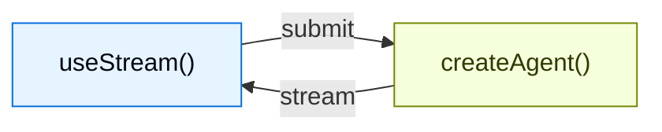

Build rich, interactive frontends for agents created with `createAgent`. These
patterns cover everything from basic message rendering to advanced workflows
like human-in-the-loop approval, queued submissions, durable stream rejoin, and
time travel debugging.

LangChain frontend SDKs are built for **agent applications**, not only
token-streaming chatbots. The same hook that renders messages also exposes the
agent's durable thread state, tool-call lifecycle, interrupts, checkpoint
history, and custom state values, so your UI can become a control plane for
long-running agent work.


> [!NOTE]
>
> These patterns use the v1 frontend SDK packages. If you are using an earlier version, see the migration guides for [React](https://github.com/langchain-ai/langgraphjs/blob/main/libs/sdk-react/docs/v1-migration.md), [Vue](https://github.com/langchain-ai/langgraphjs/blob/main/libs/sdk-vue/docs/v1-migration.md), [Svelte](https://github.com/langchain-ai/langgraphjs/blob/main/libs/sdk-svelte/docs/v1-migration.md), and [Angular](https://github.com/langchain-ai/langgraphjs/blob/main/libs/sdk-angular/docs/v1-migration.md).


## Architecture

Every pattern follows the same architecture: a `createAgent` backend streams state to a frontend via the SDK stream API.



On the backend, `createAgent` produces a compiled LangGraph graph that exposes a streaming API. On the frontend, the stream handle connects to that API and provides reactive state — messages, tool calls, interrupts, values, and thread metadata — that you render with any framework.

## Why use the LangChain frontend SDKs?

Most AI UI libraries help you append streamed text to a chat transcript.
LangChain's SDKs expose the richer runtime semantics that production agents
need:

| Capability | What it enables in your UI |
| --- | --- |
| **Durable threads** | Reload a page, switch devices, or rejoin a run without losing the conversation state. |
| **Typed agent state** | Render any state key, not just messages: todos, pipeline outputs, citations, sandbox files, metrics, or custom business objects. |
| **Tool-call lifecycle** | Show pending, completed, and failed tool calls as purpose-built UI cards instead of raw JSON. |
| **Interrupts** | Pause execution for human approval, edits, or missing information, then resume from the exact point where the agent stopped. |
| **Checkpoints** | Build edit, retry, branch, audit, and time-travel flows from persisted state snapshots. |
| **Nested execution** | Visualize deep agents, subagents, and graph nodes without flattening everything into one unreadable stream. |
| **Framework-native reactivity** | Use the same protocol from React, Vue, Svelte, or Angular while keeping idiomatic hooks, composables, stores, or signals. |

These primitives let you design UIs where users can inspect, steer, pause,
resume, and fork agent work while it is happening.

```lc-tabs
[
 {
  "label": "agent.py",
  "lang": "python",
  "code": "from langchain import create_agent\nfrom langgraph.checkpoint.memory import MemorySaver\n\nagent = create_agent(\n    model=\"openai:gpt-5.5\",\n    tools=[get_weather, search_web],\n    checkpointer=MemorySaver(),\n)"
 },
 {
  "label": "Chat.tsx",
  "lang": "tsx",
  "code": "function Chat() {\n  const stream = useStream<GraphState>({\n    apiUrl: \"http://localhost:2024\",\n    assistantId: \"agent\",\n  });\n\n  return (\n\n      {stream.messages.map((msg) => (\n\n      ))}\n\n  );\n}"
 }
]
```


React, Vue, and Svelte use `useStream`. Angular uses `injectStream`:

```ts

```

## Type inference

Pass a type parameter to `useStream` (or `injectStream` in Angular) for type-safe access to `stream.messages`, `stream.toolCalls`, `stream.interrupt`, `stream.values`, and other reactive state.


Define a TypeScript interface that matches your agent's state schema and pass it as the type parameter:

```ts

interface AgentState {
  messages: BaseMessage[];
}

const stream = useStream<AgentState>({
  apiUrl: "http://localhost:2024",
  assistantId: "agent",
});
```

Use the graph name from `langgraph.json` as `assistantId`. In the pattern examples throughout this guide, replace `typeof myAgent` with your interface name (for example, `AgentState`).

If your agent exposes custom state keys, extend the interface:

```ts

interface AgentState {
  messages: BaseMessage[];
  todos: Todo[];
}
```


## Patterns

### Render messages and output

  ### [Markdown messages](#)
Parse and render streamed markdown with proper formatting and code highlighting.

  ### [Structured output](#)
Render typed agent responses as custom UI components instead of plain text.

  ### [Reasoning tokens](#)
Display model thinking processes in collapsible blocks.

  ### [Generative UI](#)
Render AI-generated user interfaces from natural language prompts using json-render.

### Display agent actions

  ### [Tool calling](#)
Show tool calls as rich, type-safe UI cards with loading and error states.

  ### [Headless tools](#)
Run browser and device APIs on the client while keeping typed tool schemas on the agent.

  ### [Human-in-the-loop](#)
Pause the agent for human review with approve, reject, and edit workflows.

### Manage conversations

  ### [Branching chat](#)
Edit messages, regenerate responses, and navigate conversation branches.

  ### [Message queues](#)
Queue multiple messages while the agent processes them sequentially.

### Advanced streaming

  ### [Join & rejoin streams](#)
Disconnect from and reconnect to running agent streams without losing progress.

  ### [Time travel](#)
Inspect, navigate, and resume from any checkpoint in the conversation history.

## Choosing a frontend pattern

Start from the UX question your application needs to answer:

| If users need to... | Start with |
| --- | --- |
| Understand what the agent is doing | [Tool calling](lc:oss/python/langchain/frontend/tool-calling) and [reasoning tokens](lc:oss/python/langchain/frontend/reasoning-tokens) |
| Safely approve sensitive actions | [Human-in-the-loop](lc:oss/python/langchain/frontend/human-in-the-loop) |
| Send work while a run is active | [Message queues](lc:oss/python/langchain/frontend/message-queues) |
| Leave and come back to long-running work | [Join & rejoin streams](lc:oss/python/langchain/frontend/join-rejoin) |
| Edit or retry from an earlier turn | [Branching chat](lc:oss/python/langchain/frontend/branching-chat) and [time travel](lc:oss/python/langchain/frontend/time-travel) |
| Render state as an application, not a chat | [Structured output](lc:oss/python/langchain/frontend/structured-output), [generative UI](lc:oss/python/langchain/frontend/generative-ui), and [Deep Agents frontend patterns](lc:oss/python/deepagents/frontend/overview) |

## Integrations

The stream API is UI-agnostic. Use it with any component library or generative UI
framework. Component libraries can own the presentation layer while LangChain's
SDK owns the agent runtime state, resumability, interrupts, and checkpoint
semantics underneath.

  ### [AI Elements](#)
Composable shadcn/ui components for AI chat: `Conversation`, `Message`, `Tool`, `Reasoning`.

  ### [assistant-ui](#)
Headless React framework with built-in thread management, branching, and attachment support.

  ### [OpenUI](#)
Generative UI library for data-rich reports and dashboards using the openui-lang component DSL.
