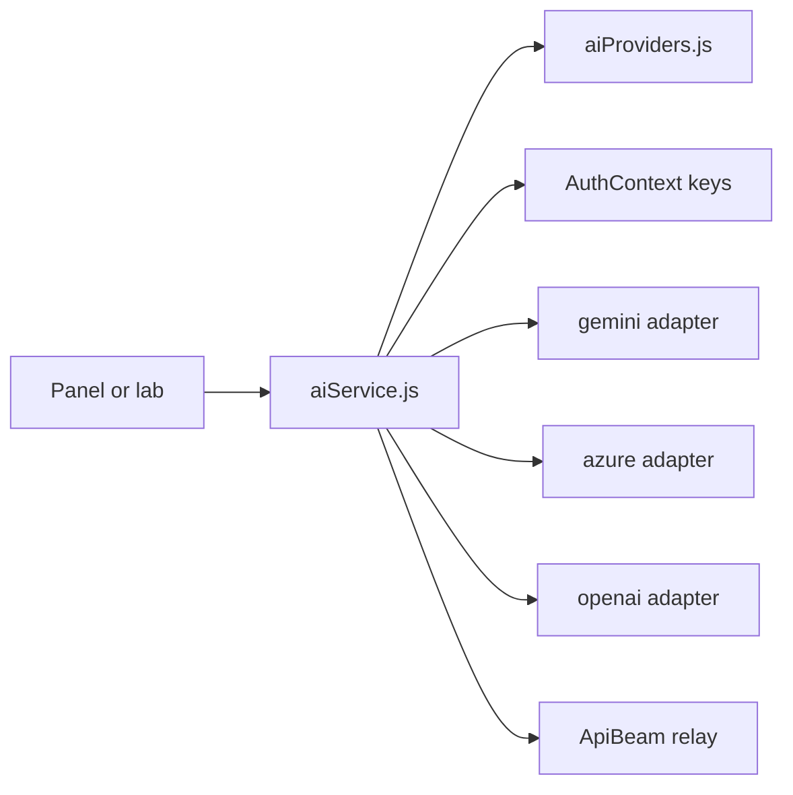

# AI providers & services

AI calls are orchestrated in the browser, not on the server. A user brings their own key, stores it in the app, and the SPA calls the provider directly. The serverless layer is involved only where a key genuinely cannot be user-supplied.

## The registry

`src/config/aiProviders.js` is the single source of truth. Its own header states the contract: add a model by appending one entry, and the service layer, the credential store and every settings UI pick it up without further change.

Each entry declares an **adapter**, which is the part that decides how the call is made:

| Adapter | Shape of the call | Providers using it |
|---|---|---|
| `gemini` | Google Generative Language REST API, key only | Google Gemini |
| `azure` | Azure OpenAI deployment — endpoint, key, optional deployment name | Azure OpenAI |
| `openai` | Any OpenAI-compatible `/chat/completions` endpoint | OpenAI, GLM, Kimi, Grok, Groq, DeepSeek |

Because most modern providers speak the OpenAI chat-completions dialect, they share one adapter and differ only by default endpoint and default model. An entry also carries display metadata (label, icon, brand colour, monogram), a `docsUrl` pointing at where the user obtains a key, and a `fields` array describing which credentials to prompt for.

## Dispatch

`src/services/aiService.js` is the dispatcher. It resolves the selected provider, reads the stored credentials from `AuthContext`, branches on the adapter, and normalises the response.

### JSON safety

A great deal of this app asks a model for structured output and then renders it. Models wrap JSON in markdown fences and sometimes truncate it. `aiService.js` routes every response expected to be JSON through `extractJSON` and a safe parse, rather than calling `JSON.parse` on raw model output. Follow that path when you add a feature that expects structured output — the failure it prevents is a blank panel, not an error message.

## ApiBeam: the browser-session relay

`api_beam/` holds a browser extension plus a NestJS relay server. Together they route AI calls through a tab the user is already logged into, instead of through a paid API key. The SPA treats it as one more provider option.

This is an independently deployed sub-project. Its relay runs on its own host and has its own setup and troubleshooting runbooks in `README/documentation/`.

## Voice

Two separate paths, for two different reasons:

- **Retell** powers the mock interviewer. Keys and agent ids come from `VITE_RETELL_*` environment variables and are read in `aiService.js`. There are separate agent ids for the English and Hinglish interviewers.
- **Gemini Live** powers the data-science interviewer. Its key must not reach the browser, so `api/gemini-live-token.js` mints a short-lived, single-use credential server-side and the client connects with that.

## Where server-side AI still happens

| Path | Why it is on the server |
|---|---|
| `api/gemini-live-token.js` | Issues ephemeral Live API credentials without exposing `GEMINI_API_KEY` |
| `api/copilot.js` | Emulates an external product's copilot SSE contract for the vendored editor |
| `supabase/functions/ai-chat/` | Deno edge function holding its own `GEMINI_API_KEY` secret |
| `supabase/functions/web-search/` | Wraps Tavily so the search key stays server-side |

## Prompts

`src/prompts/` holds the two long-form system prompts that define a persona rather than a single call: `dataScienceInterviewerPrompt.js` and `emotionalSupportPrompt.js`. Shorter task prompts live next to the feature that issues them.

The Job Scout agent keeps its prompts separately, under `services/job-scout/src/job_scout/graph/prompts/`, because it is a separate Python service.

## Adding a provider

See [Extending the app](doc:extending). If the provider speaks the OpenAI dialect, it is a single registry entry and no other file changes.
