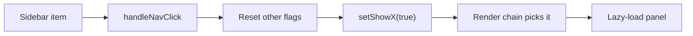

# App shell & navigation

There is no React Router in this project. Navigation is a state machine, and understanding it is the difference between a five-minute change and an afternoon of confusion.

## The model

`src/App.jsx` holds one boolean per destination:

```javascript
const [showExamsDocs, setShowExamsDocs] = useViewState(savedViews.showExamsDocs ?? false);
```

`useViewState` is a thin wrapper that keeps the flag in React state and lets a persistence effect mirror it into `localStorage` under `genai_active_views`, so a reload returns you to the panel you were on.

The render tree is a long chained ternary. Whichever flag is true wins, and the order of the chain is the priority order:

```javascript
showStrandsDocs ? <ErrorBoundary><StrandsDocs onClose={...} /></ErrorBoundary> :
showExamsDocs   ? <ErrorBoundary><ExamsDocs   onClose={...} /></ErrorBoundary> :
showApiHub      ? <ErrorBoundary><ApiHub      onClose={...} /></ErrorBoundary> :
...
```

Every panel is `React.lazy()`-loaded, which is what keeps Monaco, Three.js, ReactFlow, D3 and the simulators out of the first-paint download.

> [!WARNING]
> Because the chain is ordered, two flags set at once silently resolves to whichever appears first. This is why every navigation handler resets the other flags before setting its own.

## The pieces

| File | Role |
|---|---|
| `src/config/sidebarRegistry.js` | What each nav id looks like — icon, label, description, default visibility — plus the default grouping and the layout-migration logic |
| `src/config/sidebarNav.js` | Shared `getActiveNavId` and nav-click switch, consumed by the redesigned sidebar |
| `src/components/Sidebar.jsx` | The legacy sidebar, which keeps its own inline copy of that logic |
| `src/components/SidebarModern.jsx` | The redesigned sidebar, which calls into `sidebarNav.js` instead |
| `src/App.jsx` | Owns the flags, the reset, and the render chain |


## From click to panel



The reverse direction matters too. `getActiveId()` derives *which nav item is highlighted* from the same flags, so the sidebar stays in sync without storing a separate "current page" value.

## Groups, layouts and migrations

`DEFAULT_SIDEBAR_LAYOUT` in `sidebarRegistry.js` defines the section order and which ids each section holds. Admins can customise the layout, and a customised layout is persisted.

That persistence creates a trap the codebase solves explicitly. A saved layout naming only the sections that existed when it was saved would leave every newly-shipped item as an orphan under "More tools". `resolveEffectiveLayout()` therefore merges a saved layout with the current one and re-homes new items — every section added since the registry shipped has a small migration block, and they all follow the same shape:

```javascript
groups.forEach((group) => {
  group.itemIds = group.itemIds.filter((id) => id !== "documentation");
});
let aboutGroup = groups.find((group) => group.id === "about");
if (!aboutGroup) {
  aboutGroup = { id: "about", label: "About", itemIds: [] };
  groups.push(aboutGroup);
}
aboutGroup.label = "About";
aboutGroup.itemIds.push("documentation");
```

Any orphan id — one present in the registry but in no group — is appended to "More tools" as a fallback, so a forgotten migration degrades rather than disappearing.

## Visibility

`resolveItemVisibility(itemId, { overrides, allowAimlForAll })` returns `"all"` or `"admin"`. Explicit overrides win, then the legacy `allowAimlForAll` flag for one item, then the registry default.

`Sidebar.jsx` checks visibility twice: once when rendering the list, and again inside `handleNavClick`. The second check is deliberate defence in depth, so a stale walkthrough target cannot open a restricted panel.

## Global search

`src/utils/buildSearchIndex.js` flattens the curriculum plus a short static `SECTIONS` list into one searchable array, scored with a quick-open-style fuzzy matcher. Interview-prep lesson data is deliberately excluded — it is roughly 14 MB and is lazy-fetched by the palette on first open instead.


Note that the static `SECTIONS` list covers only a handful of destinations. Most panels are reachable from the sidebar but are not in the search index; adding one there is optional, not part of the wiring ritual.

## Adding a destination

See [Extending the app](doc:extending) for the full checklist. The short version is that a new panel touches five files, and missing any one of them produces a specific, recognisable symptom.
