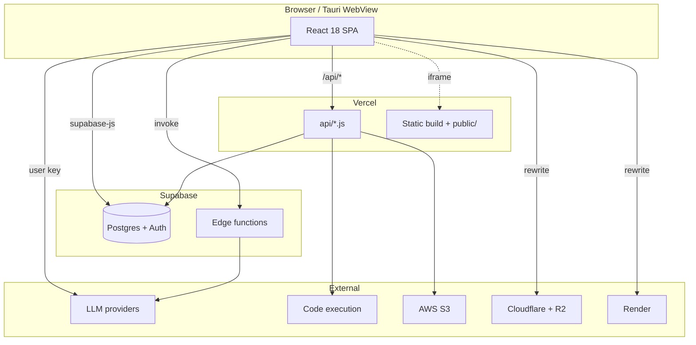
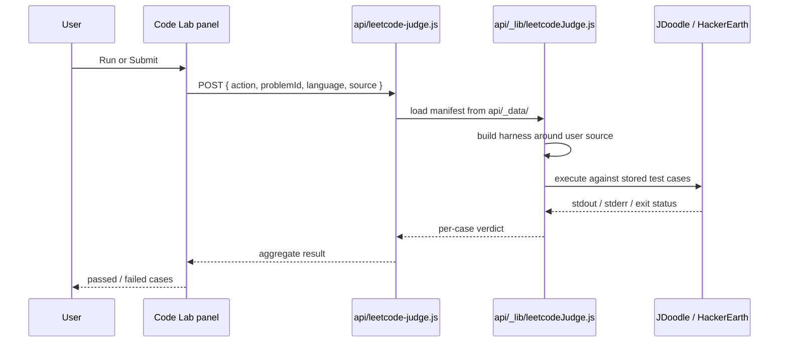

# Architecture

The application is deliberately client-heavy. The browser holds the navigation state, selects the AI provider, and talks to Supabase directly; the serverless layer exists mostly to keep third-party credentials off the client.

## High-level shape

## Layers, and what each is responsible for

### The SPA

`src/main.jsx` mounts `src/App.jsx`. The providers nest in a fixed order — `AuthProvider`, `ThemeProvider`, `ProjectsProvider` — and everything below reads from them.

`App.jsx` is roughly 2,300 lines and holds one `useState` boolean per panel. There is no router library and no route table. See [App shell & navigation](doc:app-shell) for how a sidebar click becomes a rendered panel.

### The serverless layer

`api/*.js` are plain Node handlers with a `(req, res)` signature. There is no framework, no shared middleware, and no auth layer on most of them. They exist for three reasons:

1. **Credential custody** — JDoodle, HackerEarth, YouTube, Gemini Live and S3 keys must not reach the browser.
2. **Server-side caching** — `api/exam.js` writes scraped results back to Supabase using a service-role key that bypasses RLS.
3. **API emulation** — `api/graphql.js` and `api/copilot.js` implement just enough of an external product's contract for the vendored `public/editor/` bundle to run against this backend.

> [!IMPORTANT]
> Vercel's Hobby plan caps a deployment at 12 serverless functions, and `api/` sits exactly at that limit. This constraint is load-bearing: `api/leetcode-judge.js` is a merge of two former handlers, and shared code was moved under `api/_lib/` specifically so it stops counting as a function. Adding a 13th file directly under `api/` breaks the deploy.

### Local development has no separate backend

`vite.config.js` registers an `apiMiddleware()` plugin. During `vite dev` it intercepts any `/api/*` request, dynamically imports the matching handler from `api/`, and invokes it in-process. There is no need for `vercel dev`.

The same plugin reproduces the production rewrites: `/graphql` maps to `api/graphql.js`, and `/api/copilot/*` and `/api/auth/*` collapse onto single handlers with the full URL preserved.

### The data layer

Supabase provides Postgres, auth, and three Deno edge functions. The client talks to it directly with `supabase-js`; access control is Row Level Security, not application code.

`src/config/supabaseClient.js` carries a comment that states the rule plainly: the optimistically-read persisted session is *a UI hint only* and must never be used for an authorisation decision. See [Data & persistence](doc:data-layer).

### The AI layer

Provider selection happens in the browser. `src/config/aiProviders.js` is a registry of providers and the adapter each one speaks; `src/services/aiService.js` dispatches on that adapter. User credentials are held in `AuthContext`, not in environment variables. See [AI providers & services](doc:ai-layer).

### The edge

Three Cloudflare Workers back onto R2 object storage:

| Worker | Purpose |
|---|---|
| `docs-cdn-worker/` | Serves the documentation archives; `vercel.json` rewrites `/langchain/*`, `/strands/*`, `/agentcore/*`, `/datascience/*` and friends to it so they stay same-origin |
| `av-cdn-worker/` | Serves images for the article archive |
| `jobscout-keepwarm-worker/` | Pings the Render service every 10 minutes so its cold boot never lands on a visitor |

## Request lifecycle: judging a Code Lab submission

The manifests in `api/_data/` are committed. That is deliberate: the raw corpus they are generated from is gitignored and absent in production, so the build step that regenerates them silently no-ops there and the committed copies are used instead.

## What is deliberately *not* here

- No Kubernetes, Helm or Terraform. `public/k8sgames/` is a game about Kubernetes, not infrastructure.
- No RAG pipeline, vector store or embeddings anywhere in the SPA. Several labs *teach* retrieval concepts through simulation; none of them run one.
- No message queue or background job system. The only recurring job is the Cloudflare keep-warm cron.
- No root Dockerfile. Dockerfiles exist only inside `services/job-scout/` and `themissingmanual/`.
