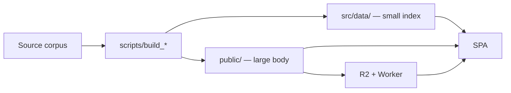

# Content pipeline

A large share of what this app shows is not written as React. It is generated at build time by scripts in `scripts/`, which read source corpora and emit either a JavaScript data module under `src/data/` or a JSON/markdown payload under `public/`.

This is the part of the repository most likely to surprise you: a page can be missing not because a component is broken, but because a generator never ran.

## The shape



The split between the two outputs is deliberate and is the rule to follow when adding a generator:

- **Small index → `src/data/`.** Navigation trees, catalogues, manifests. Bundled, so navigation is instant.
- **Large body → `public/` or R2.** Page prose, datasets, archives. Fetched on demand, so it never enters the entry chunk.

## The root build chain

`npm run build` runs the generators in order before Vite:

```bash
build:apibeam-extension   # packages the browser extension into public/downloads/
build:reference           # 215 reference sheets → src/data/referenceData.js
build:manual-path         # The Missing Manual learning path
build:interview-index     # interview-prep index
build:codelab             # Code Lab guard data
build:codelab-map         # Code Lab topic map
validate:codelab          # fails the build on a malformed manifest
vite build                # the SPA itself
```

`predev` runs `build:apibeam-extension` automatically, so `npm run dev` picks that one up for free. The others do not run on `dev`, which is why a fresh clone needs `npm run build:reference` before the first `npm run dev` — see [Local setup](doc:local-setup).

## Generators not in the chain

Several `build:*` scripts are run on demand rather than every build, because their inputs change rarely and their outputs are committed:

| Script | Produces |
|---|---|
| `build:langchain`, `build:strands`, `build:exams`, `build:apihub` | Documentation archives for the in-app viewers |
| `build:aifs`, `build:aifs-path` | The AI-from-Scratch course and its path |
| `build:datascience`, `build:chaivisual` | Course content plus a mirror |
| `build:av`, `upload:av`, `deploy:av-cdn` | The article archive, its R2 upload and the worker deploy |
| `build:aws-simulator`, `build:flow-design`, `build:claude-certificate`, `build:git` | Sub-project bundles copied into `public/` |

## Distribution through R2

The documentation archives are far too large to commit or bundle. They are uploaded to R2 (`scripts/upload_docs_archive.mjs`, `scripts/upload_av_archive.mjs`) and served by `docs-cdn-worker`.

`vercel.json` then rewrites the documentation prefixes to that worker, so the browser fetches them **same-origin**:

```json
{ "source": "/langchain/(.*)", "destination": "https://docs-cdn.gen-ai-academy.workers.dev/langchain/$1" }
```

`src/utils/fetchMarkdown.js` exists because of this arrangement. Vite serves `index.html` for unknown paths and a CDN can serve an error page, so the helper rejects anything that looks like an HTML document rather than passing a fallback page to the markdown renderer as prose.


## Scripts that cannot run on a fresh clone

Some generators read source directories that `.gitignore` excludes while their *output* is committed:

| Missing input | Affected scripts | What happens |
|---|---|---|
| `dsanew/` (raw Code Lab corpus) | `build:codelab`, `verify:codelab` | Silently no-ops; the committed manifests in `src/data/codelab/` and `api/_data/` are used |
| `flow-design/` | `build:flow-design` | Fails; `public/flow-design/` already holds the built output |
| `Git Visualizer/` | `build:git` | Fails; `public/git-visualizer/` already holds the built output |

This is expected, not broken. Production deliberately relies on the committed outputs.

## Validation

`validate:codelab` runs inside the build chain and fails it on a malformed manifest — the one generator step that is a gate rather than a transform. `tests/` holds four `node --test` files, of which `leetcodeJudge.test.mjs` and `codelabTopicMap.test.mjs` are wired to npm scripts (`test:codelab`, `test:codelab-map`); `concurrencyQuest.test.mjs` and `examScraper.test.mjs` have no script and must be run directly with `node --test`.

## Adding a source

See [Extending the app](doc:extending) for the full checklist.
