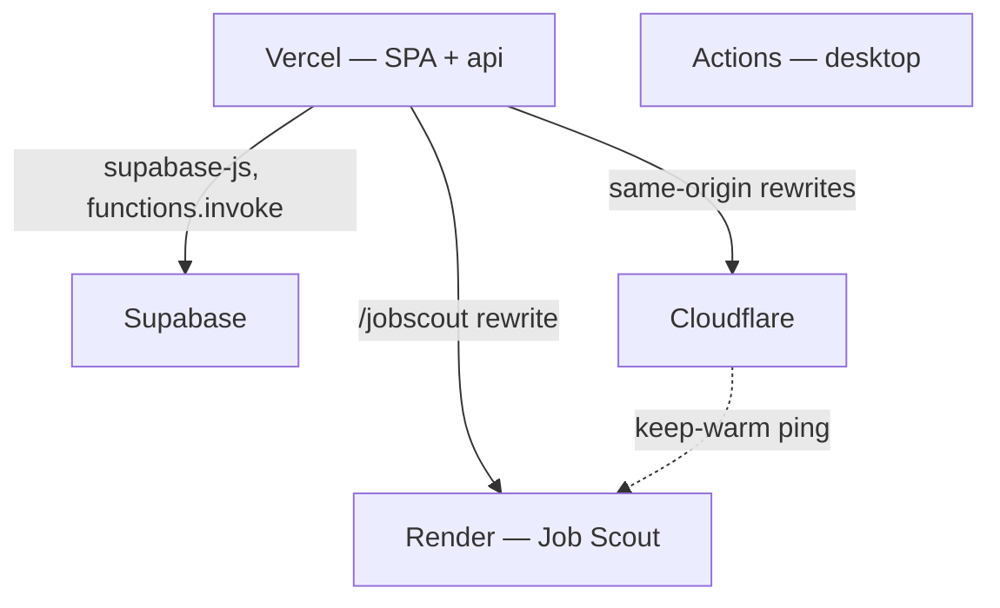

# Deployment

Five independent targets. Only the first is touched by a root `npm run build`.



## Vercel — the primary deploy

Builds with the root `build` script and serves `dist/` plus `api/*.js`.

Two parts of `vercel.json` are load-bearing:

**Function exclusions.** Without this, large directories get pulled into every function bundle and the deploy fails on size:

```json
"functions": {
  "api/**/*.js": {
    "excludeFiles": "{public/**,dist/**,reference/**,themissingmanual/**,src/**,services/**,system-design-simulator/**,course_data*,scraped_data.json}"
  }
}
```

**Rewrites.** These make third-party origins look same-origin to the browser: documentation prefixes to `docs-cdn-worker`, `/jobscout/` and `/_next/` to Render, `/notion-api/` to Notion, and `/graphql`, `/api/copilot/:path*`, `/api/auth/:path*` onto single handlers.

`.vercelignore` additionally keeps `services/`, `flow-design/`, `Git Visualizer/` and `codeflow/` out of the upload entirely.

> [!IMPORTANT]
> `api/` holds exactly twelve functions and the Hobby plan allows twelve. A new file directly under `api/` fails the deploy. Put shared code in `api/_lib/`.

## Supabase

```bash
supabase secrets set TAVILY_API_KEY=YOUR_TAVILY_API_KEY
supabase functions deploy web-search
```

Migrations in `supabase/migrations/` are applied to the project. Remember that they cover only part of the live schema — see [Data & persistence](doc:data-layer).

## Cloudflare

Each worker directory has its own `wrangler.jsonc` and deploys with `npx wrangler deploy`:

- `docs-cdn-worker/` — serves documentation archives from R2
- `av-cdn-worker/` — serves archive images from R2 (`npm run deploy:av-cdn`)
- `jobscout-keepwarm-worker/` — pings the Render service every 10 minutes

Uploading new archive content is a separate step from deploying the worker: `npm run upload:av`, or `scripts/upload_docs_archive.mjs`.

## Render — Job Scout

`render.yaml` is a Blueprint for one Docker service built from `services/job-scout/`. The file is unusually well commented, and the comments encode decisions worth preserving:

- **Free plan, Singapore region.** 512 MB / 0.1 CPU; measured at 172 MB resident but a 286-second cold boot.
- **No `healthCheckPath`.** Render would poll during the long cold boot, get 502s from nginx while the Python process is still starting, and mark the deploy failed. With no health check it waits for the port bind, which nginx does in about a second.
- **Keep the only free service.** The 750 free instance-hours per month are shared across the workspace, and one continuously-running service already uses about 744.
- **`GRADIO_ROOT_PATH` must be set** to `https://<your-vercel-domain>/jobscout` after the first deploy. Gradio derives the API root it hands the browser from the `Host` header, and Vercel's external rewrites replace `Host` with the destination's — so without this the wizard advertises the Render domain, leaves the app's origin, and fails the service's CORS rule.

Secrets are declared with `sync: false`, meaning they are prompted for at Blueprint creation and stored only in Render. No secret value is written into the repository. Behavioural settings that are *not* secrets — model names, limits, ratios — are pinned in the file where they are reviewable.

## Desktop installers

`.github/workflows/desktop-build.yml` runs on `workflow_dispatch` or a `v*` tag push. It builds on `windows-latest` with Node 22 and a stable Rust toolchain, caching the `src-tauri` target directory.

## Production considerations

| Concern | Where it stands |
|---|---|
| Secrets | Server-side only, except the Supabase anon key, which is public by design. The hardcoded admin password in `AuthInterface.jsx` is a real exposure — see [Troubleshooting](doc:troubleshooting) |
| Access control | Entirely Row Level Security. A missing policy is the failure mode, not a missing API check |
| Scaling | The SPA is static; functions scale per-request; the Render free instance does not scale and sleeps |
| Caching | `vercel.json` sets immutable caching on `/assets/`, one-hour stale-while-revalidate on `/data/` and `/reference/`, and no-cache on `/` |
| Observability | No centralised telemetry in the SPA. Job Scout has Opik tracing behind `OPIK_ENABLED` |
| Health checks | Deliberately absent on Render, for the reason above |
