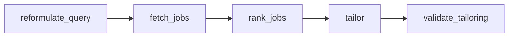

# Career

Six destinations: a question bank, three different interviewers, a Python job agent, and a quiz. This section touches more external services than any other.

## Interview Prep

Tool home `interview`, then `src/components/InterviewPrep.jsx` behind `showInterviewPrep`. It accepts an `initialLessonId` so search results and other panels can deep-link into a specific lesson.

The index is built by `npm run build:interview-index` (`scripts/build_interview_index.mjs`), which *is* in the root build chain.

The lesson bodies are roughly 14 MB and live in `public/data/interview-prep.json`. They are deliberately excluded from `buildSearchIndex()` — the palette lazy-fetches them on first open and merges them client-side, so editing the curriculum does not force a 14 MB recomputation.

## AI Interviewer

Tool home `interviewer`, then `src/pages/interviewer/InterviewerPage.jsx` behind `showAIInterviewer`.

Voice is Retell, configured entirely through client environment variables read in `src/services/aiService.js`:

| Variable | Purpose |
|---|---|
| `VITE_RETELL_API_KEY` | Retell API key |
| `VITE_RETELL_AGENT_ID` | English interview agent |
| `VITE_RETELL_HINDI_AGENT_ID` | Hinglish interview agent |

`retell_agents.json` at the repo root records the agent configuration.

## Gemini Interview

Sets `showGeminiInterviewer`; the panel is `src/pages/gemini-interviewer/GeminiInterviewerPage.jsx`, with `src/services/geminiLiveService.js`.

This one deliberately does **not** follow the Retell pattern. Its key must not reach the browser, so `api/gemini-live-token.js` mints a short-lived, single-use credential server-side and the client connects with that. `GEMINI_LIVE_SETUP.md` at the repo root covers running it locally.

The persona is a long-form system prompt in `src/prompts/dataScienceInterviewerPrompt.js`.

## Emotional Support

Sets `showEmotionalSupport`; the panel is `src/pages/emotional-support/EmotionalSupportPage.jsx`, driven by `src/prompts/emotionalSupportPrompt.js`.

## Job Scout

Sets `showJobScout`; the panel is `src/pages/jobscout/JobScoutPage.jsx`.

The panel is a thin wrapper. The actual product is `services/job-scout/` — a Python graph agent deployed separately to Render and reached through the `/jobscout/` rewrite in `vercel.json`.

Its graph runs as a sequence of nodes:

Each node lives in `services/job-scout/src/job_scout/graph/nodes/`, with prompts alongside in `graph/prompts/` and shared state in `graph/state.py`. Tracing is Opik, behind `OPIK_ENABLED`.

> [!WARNING]
> The Render free instance has a measured 286-second cold boot and sleeps after 15 minutes idle. `jobscout-keepwarm-worker/` pings it every 10 minutes so that boot never lands on a visitor. If the first request hangs for minutes, that worker is the thing to check. See [Deployment](doc:deployment) for the `GRADIO_ROOT_PATH` requirement that makes the rewrite work at all.

`JOB_AGENT_PLAN.md` and `JOB_AGENT_DEPLOY.md` at the repo root record the design and the deployment measurements.

## Quiz

Tool home `quiz`, then `src/components/QuizApp.jsx` behind `showQuiz`, with `src/components/quiz/ExamPractice.jsx`.

Results persist to `quiz_sessions`, `user_quizzes` and `quiz_metrics` — none of which have a migration in `supabase/migrations/`. See [Data & persistence](doc:data-layer) for the full list of tables the client uses without a migration.
