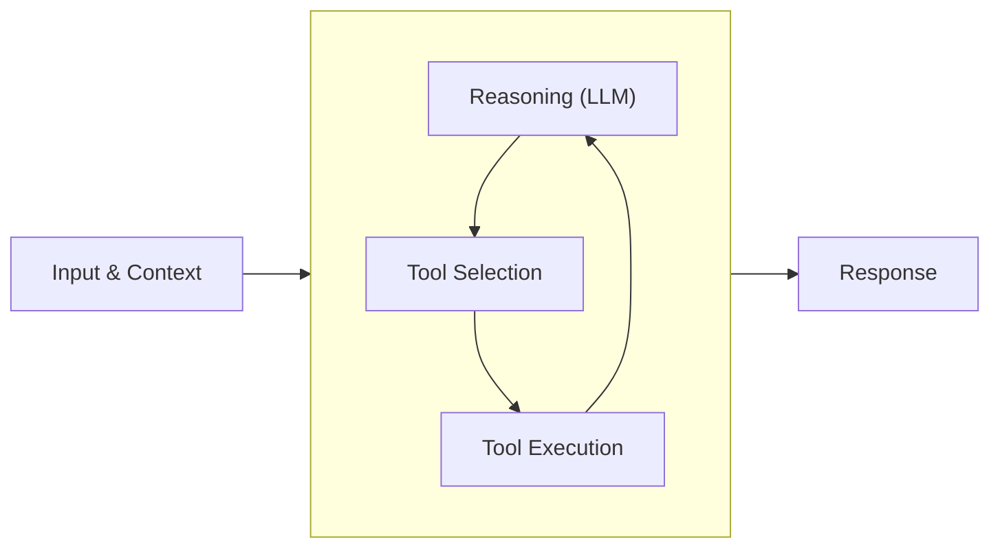

A language model can answer questions. An agent can *do things*. The agent loop is what makes that difference possible.

When a model receives a request it cannot fully address with its training alone, it needs to reach out into the world: read files, query databases, call APIs, execute code. The agent loop is the orchestration layer that enables this. It manages the cycle of reasoning and action that allows a model to tackle problems requiring multiple steps, external information, or real-world side effects.

This is the foundational concept in Strands. Everything else builds on top of it.

## How the Loop Works

The agent loop operates on a simple principle: invoke the model, check if it wants to use a tool, execute the tool if so, then invoke the model again with the result. Repeat until the model produces a final response.



The diagram shows the recursive structure at the heart of the loop. The model reasons, selects a tool, the tool executes, and the result feeds back into the model for another round of reasoning. This cycle continues until the model decides it has enough information to respond.

What makes this powerful is the accumulation of context. Each iteration through the loop adds to the conversation history. The model sees not just the original request, but every tool it has called and every result it has received. This accumulated context enables sophisticated multi-step reasoning.

## A Concrete Example

Consider a request to analyze a codebase for security vulnerabilities. This is not something a model can do from memory. It requires an agent that can read files, search code, and synthesize findings. The agent loop handles this through successive iterations:

1.  The model receives the request to analyze a codebase. It first needs to understand the structure. It requests a file listing tool with the repository root as input.
    
2.  The model now sees the directory structure in its context. It identifies the main application entry point and requests the file reader tool to examine it.
    
3.  The model sees the application code. It notices database queries and decides to examine the database module for potential SQL injection. It requests the file reader again.
    
4.  The model sees the database module and identifies a vulnerability: user input concatenated directly into SQL queries. To assess the scope, it requests a code search tool to find all call sites of the vulnerable function.
    
5.  The model sees 12 call sites in the search results. It now has everything it needs. Rather than requesting another tool, it produces a terminal response: a report detailing the vulnerability, affected locations, and remediation steps.
    

Each iteration followed the same pattern. The model received context, decided whether to act or respond, and either continued the loop or exited it. The key insight is that the model made these decisions autonomously based on its evolving understanding of the task.

## Messages and Conversation History

Messages flow through the agent loop with two roles: user and assistant. Each message contains content that can take different forms.

**User messages** contain the initial request and any follow-up instructions. User message content can include:

-   Text input from the user
-   Tool results from previous tool executions
-   Media such as files, images, audio, or video

**Assistant messages** are the model’s outputs. Assistant message content can include:

-   Text responses for the user
-   Tool use requests for the execution system
-   Reasoning traces (when supported by the model)

The conversation history accumulates all three message types across loop iterations. This history is the model’s working memory for the task. The conversation manager applies strategies to keep this history within the model’s context window while preserving the most relevant information. See [Conversation Management](lc:user-guide/concepts/agents/conversation-management) for details on available strategies.

## Tool Execution

When the model requests a tool, the execution system validates the request against the tool’s schema, locates the tool in the registry, executes it with error handling, and formats the result as a tool result message.

The execution system captures both successful results and failures. When a tool fails, the error information goes back to the model as an error result rather than throwing an exception that terminates the loop. This gives the model an opportunity to recover or try alternatives.

## Loop Lifecycle

The agent loop has well-defined entry and exit points. Understanding these helps predict agent behavior and handle edge cases.

### Starting the Loop

When an agent receives a request, it initializes by registering tools, setting up the conversation manager, and preparing metrics collection. The user’s input becomes the first message in the conversation history, and the loop begins its first iteration.

### Stop Reasons

Each model invocation ends with a stop reason that determines what happens next:

-   **End turn**: The model has finished its response and has no further actions to take. This is the normal successful termination. The loop exits and returns the model’s final message.
-   **Tool use**: The model wants to execute one or more tools before continuing. The loop executes the requested tools, appends the results to the conversation history, and invokes the model again.
-   **Cancelled**: The agent was stopped externally via `agent.cancel()`. See [Cancellation](#cancellation) below.
-   **Limit turns** (`limit_turns``limitTurns`): The per-invocation turn budget was exhausted. See [Invocation Limits](#invocation-limits).
-   **Limit total tokens** (`limit_total_tokens``limitTotalTokens`): The cumulative token budget was exhausted. See [Invocation Limits](#invocation-limits).
-   **Limit output tokens** (`limit_output_tokens``limitOutputTokens`): The output token budget was exhausted. See [Invocation Limits](#invocation-limits).
-   **Max tokens**: The model’s response was truncated because it hit the token limit. This is unrecoverable within the current loop. The model cannot continue from a partial response, and the loop terminates with an error.
-   **Stop sequence**: The model encountered a configured stop sequence. Like end turn, this terminates the loop normally.
-   **Content filtered**: The response was blocked by safety mechanisms.
-   **Guardrail intervention**: A guardrail policy stopped generation.

The limit stop reasons indicate graceful budget exhaustion. The agent’s message history remains in a valid state, and you can reinvoke with a higher budget or different prompt.

Both content filtered and guardrail intervention terminate the loop and should be handled according to application requirements.

### Extending the Loop

The agent emits lifecycle events at key points: before and after each invocation, before and after each model call, and before and after each tool execution. These events enable observation, metrics collection, and behavior modification without changing the core loop logic. See [Hooks](lc:user-guide/concepts/agents/hooks) for details on subscribing to these events.

### Cancellation

The `agent.cancel()` method provides a way to stop the loop from outside, such as on a client disconnect, a timeout, or a UI “Stop” button. Calling `cancel()` sets an internal signal that the agent checks at key checkpoints. The cancel signal clears automatically when the invocation completes, so the agent is immediately reusable.

```sa-tabs
[
 {
  "label": "Python",
  "body": "The agent checks for cancellation at four checkpoints:\n\n| Checkpoint | Behavior | Note |\n| --- | --- | --- |\n| Model response streaming | Partial output is discarded | Usage metrics may be inaccurate since the stream is closed before the model sends its final metadata event |\n| Before tool execution | Tool calls are skipped with error results added to maintain valid conversation state |  |\n| During MCP tool execution | The in-flight MCP request is cancelled without closing the shared MCP session | Remote cancellation is best-effort; the agent stops locally even if the server does not acknowledge cancellation |\n| After tool execution | The agent stops before the next model call | Non-MCP tools finish before cancellation is observed |\n\nThe agent returns a result with `stop_reason=\"cancelled\"`. `cancel()` is thread-safe and idempotent. Calling it multiple times or from different threads is safe.\n\n```python\nimport threading\nimport time\n\nfrom strands import Agent\n\n\ndef timeout_watchdog(agent: Agent, timeout: float) -> None:\n    \"\"\"Cancel the agent after a timeout period.\"\"\"\n    time.sleep(timeout)\n    agent.cancel()\n\n\nagent = Agent()\n\n# Cancel from a background thread after 30 seconds\nwatchdog = threading.Thread(target=timeout_watchdog, args=(agent, 30.0))\nwatchdog.start()\n\nresult = agent(\"Analyze this large dataset\")\nwatchdog.join()\n\nif result.stop_reason == \"cancelled\":\n    print(\"Agent was cancelled due to timeout\")\n```\n\nCancellation differs from [interrupts](lc:user-guide/concepts/interrupts) in that it stops the agent entirely rather than pausing for human input. Interrupts allow the agent to resume from where it left off; cancellation does not."
 },
 {
  "label": "TypeScript",
  "body": "The agent checks for cancellation at four checkpoints:\n\n| Checkpoint | Behavior | Note |\n| --- | --- | --- |\n| Top of each loop cycle | Agent stops before the next model invocation |  |\n| During model response streaming | Partial output is discarded | Usage metrics may be inaccurate since the stream is closed before the model sends its final metadata event |\n| Before tool execution | All pending tool calls are skipped with error results |  |\n| Between sequential tool executions | Remaining tool calls are skipped with error results |  |\n\nThe agent returns a result with `stopReason: 'cancelled'`. `cancel()` is idempotent \u2014 calling it multiple times is safe.\n\n```typescript\nconst agent = new Agent()\n\n// Cancel after 30 seconds\nsetTimeout(() => agent.cancel(), 30_000)\n\nconst result = await agent.invoke('Analyze this large dataset')\n\nif (result.stopReason === 'cancelled') {\n  console.log('Agent was cancelled due to timeout')\n}\n```\n\n#### External cancellation signals\n\nYou can also pass your own `AbortSignal` into `invoke()` or `stream()` via the `cancelSignal` option. The agent composes it with its internal controller using `AbortSignal.any()`, so both `agent.cancel()` and the external signal can trigger cancellation independently. This is useful for declarative timeouts, custom `AbortController` workflows, or framework-driven cancellation on client disconnect.\n\n```typescript\n// Timeout-based cancellation\nconst timedResult = await agent.invoke('Analyze this large dataset', {\n  cancelSignal: AbortSignal.timeout(5000),\n})\n\n// Custom AbortController \u2014 call controller.abort() from anywhere to cancel\nconst controller = new AbortController()\nconst controllerResult = await agent.invoke('Hello', {\n  cancelSignal: controller.signal,\n})\n```\n\n#### Cancellation within tool execution\n\nThe SDK automatically checks for cancellation before and between tool invocations (see checkpoints above). However, once a tool callback is running, cancellation is **cooperative** \u2014 only the tool itself can respond mid-execution. Tools can participate by forwarding the signal to APIs that accept `AbortSignal`, or by polling `cancelSignal.aborted` between steps. If a tool does neither, it runs to completion and the agent resumes cancellation handling after the tool returns.\n\n```typescript\nconst myTool = tool({\n  name: 'long_running_task',\n  description: 'A task that respects cancellation',\n  inputSchema: z.object({ url: z.string() }),\n  callback: async (input, context) => {\n    // Forward the cancel signal to APIs that accept AbortSignal\n    const response = await fetch(input.url, {\n      signal: context?.agent.cancelSignal,\n    })\n    return response.text()\n  },\n})\n```"
 }
]
```

### Invocation Limits

To cap how much work an agent does in a single invocation, pass a `limits` object. You can bound turns (loop iterations), output tokens, or total tokens. All three are optional.

```sa-tabs
[
 {
  "label": "Python",
  "body": "```python\nfrom strands import Agent\n\nagent = Agent()\n\nresult = agent(\n    \"Summarize this document\",\n    limits={\n        \"turns\": 5,\n        \"output_tokens\": 2000,\n        \"total_tokens\": 10000,\n    },\n)\n\nif result.stop_reason == \"limit_turns\":\n    print(\"Hit turn budget\")\nelif result.stop_reason == \"limit_total_tokens\":\n    print(\"Hit token budget\")\n```\n\nThe same parameter works with `invoke_async` and `stream_async`. Each cap must be a positive `int`."
 },
 {
  "label": "TypeScript",
  "body": "```typescript\nconst agent = new Agent()\n\nconst result = await agent.invoke('Summarize this document', {\n  limits: {\n    turns: 5,\n    outputTokens: 2000,\n    totalTokens: 10000,\n  },\n})\n\nif (result.stopReason === 'limitTurns') {\n  console.log('Hit turn budget')\n} else if (result.stopReason === 'limitTotalTokens') {\n  console.log('Hit token budget')\n}\n```\n\nThe same option works with `stream`. Each cap must be a positive finite number."
 }
]
```

Limits are checked at the top of each loop iteration, not mid-call. A single turn can overshoot the token budget, but the check fires before the next turn starts. Tools requested by the previous turn always run to completion before the limit check fires. The agent’s message history stays in a valid, reinvokable state.

Limits apply to the current invocation only. A reused agent starts each call with fresh counters.

When multiple caps trip simultaneously, the reported stop reason follows priority order: turns, then total tokens, then output tokens.

## Concurrent Invocations

Sometimes more than one request targets the same agent instance at once: a retried API call, a double-submitted form, two web requests that happen to share an agent.

```sa-tabs
[
 {
  "label": "Python",
  "body": "An agent mutates its conversation history as each invocation runs, so by default it processes one invocation at a time and rejects overlap. The `concurrent_invocation_mode` constructor parameter controls this behavior. It accepts a `ConcurrentInvocationMode` enum \u2014 either `THROW` (the default) or `UNSAFE_REENTRANT`.\n\nIn the default `THROW` mode, invoking an agent that is already running raises `ConcurrencyException`:\n\n```python\nfrom strands import Agent\nfrom strands.types.exceptions import ConcurrencyException\n\nagent = Agent()\n\ntry:\n    result = agent(\"Summarize this report\")\nexcept ConcurrencyException:\n    # Another invocation is already running on this agent instance\n    ...\n```\n\nFor most applications this is the behavior you want. One agent instance maps to one conversation, and letting invocations overlap would interleave their messages and corrupt the history.\n\n#### Deduplicating retried requests\n\nWhen a retry arrives for a request that is still running, returning the original\u2019s result beats both erroring and starting the work twice. Pass `idempotency_token` to any invocation method (`__call__`, `invoke_async`, `stream_async`) to identify the logical request, for example `agent(\"Process order 1234\", idempotency_token=\"order-1234\")`.\n\nIf a call with the same token is already in flight, the new call waits for the original and returns the same `AgentResult`. Tokens are compared by equality, so any stable identifier works: an order ID, a request UUID, or the prompt string itself.\n\nIf the tokens differ while an invocation is in flight, the new call raises `ConcurrencyException` \u2014 deduplication only applies to matching tokens.\n\nA deduplicated call gets the final result only, not the original\u2019s streamed events. Its `callback_handler` still fires once with that result, so output consumers are not left empty-handed.\n\nIf the original ends without producing a result, for instance when it is cancelled mid-flight, the waiting calls raise `IdempotencyAbortedError` so they can decide whether to retry:\n\n```python\nfrom strands import Agent\nfrom strands.types.exceptions import IdempotencyAbortedError\n\nagent = Agent()\n\ntry:\n    result = agent(\"Process order 1234\", idempotency_token=\"order-1234\")\nexcept IdempotencyAbortedError:\n    # The original was aborted before producing a result\n    ...\n```\n\n#### Allowing concurrent invocations\n\nTo run multiple invocations on one agent at the same time, set the concurrency mode when you construct it:\n\n```python\nfrom strands import Agent\nfrom strands.types.agent import ConcurrentInvocationMode\n\nagent = Agent(concurrent_invocation_mode=ConcurrentInvocationMode.UNSAFE_REENTRANT)\n```\n\nThis removes the single-invocation guard entirely: overlapping calls neither raise nor deduplicate, and an idempotency token is ignored. Nothing protects the conversation history from concurrent mutation, so interleaved invocations can corrupt it. Reach for this only when each invocation works on isolated state, or when you handle synchronization yourself. To run independent work in parallel, a separate agent per task is safer than sharing one."
 },
 {
  "label": "TypeScript",
  "body": "TypeScript rejects overlapping invocations: invoking an agent that is already running throws `ConcurrentInvocationError`. It does not offer a configurable concurrency mode or idempotency-token deduplication of retries; both are available only in the Python SDK."
 }
]
```

## Common Problems

### Context Window Exhaustion

Each loop iteration adds messages to the conversation history. For complex tasks requiring many tool calls, this history can exceed the model’s context window. When this happens, the agent cannot continue.

Symptoms include errors from the model provider about input length, or degraded model performance as the context fills with less relevant earlier messages.

Solutions:

-   Reduce tool output verbosity. Return summaries or relevant excerpts rather than complete data.
-   Simplify tool schemas. Deeply nested schemas consume tokens in both the tool configuration and the model’s reasoning.
-   Configure a conversation manager with appropriate strategies. The default sliding window strategy works for many applications, but summarization or custom approaches may be needed for long-running tasks. See [Conversation Management](lc:user-guide/concepts/agents/conversation-management) for available options.
-   Decompose large tasks into subtasks, each handled with a fresh context.

### Inappropriate Tool Selection

When the model consistently picks the wrong tool, the problem is usually ambiguous tool descriptions. Review the descriptions from the model’s perspective. If two tools have overlapping descriptions, the model has no basis for choosing between them. See [Tools Overview](lc:user-guide/concepts/tools) for guidance on writing effective descriptions.

### MaxTokensReachedException

When the model’s response exceeds the configured token limit, the loop raises a `MaxTokensReachedException`. This typically occurs when:

-   The model attempts to generate an unusually long response
-   The context window is nearly full, leaving insufficient space for the response
-   Tool results push the conversation close to the token limit

Handle this exception by reducing context size, increasing the token limit, or breaking the task into smaller steps.

## What Comes Next

The agent loop is the execution primitive. Higher-level patterns build on top of it:

-   [Conversation Management](lc:user-guide/concepts/agents/conversation-management) strategies that maintain coherent long-running interactions
-   [Hooks](lc:user-guide/concepts/agents/hooks) for observing, modifying, and extending agent behavior
-   Multi-agent architectures where agents coordinate through shared tools or message passing
-   Evaluation frameworks that assess agent performance on complex tasks

Understanding the loop deeply makes these advanced patterns more approachable. The same principles apply at every level: clear tool contracts, accumulated context, and autonomous decision-making within defined boundaries.

## Related pages

- [Hooks](lc:user-guide/concepts/agents/hooks) (3 shared tags)
- [Steering (Interventions)](lc:user-guide/concepts/agents/interventions/steering) (3 shared tags)
- [Interrupts](lc:user-guide/concepts/interrupts) (3 shared tags)
- [Interventions](lc:user-guide/concepts/agents/interventions) (3 shared tags)
- [Plugins](lc:user-guide/concepts/plugins) (2 shared tags)
- [Tool Executors](lc:user-guide/concepts/tools/executors) (2 shared tags)
- [GoalLoop](lc:user-guide/concepts/plugins/goal-loop) (2 shared tags)
- [Creating a Custom Model Provider](lc:user-guide/concepts/model-providers/custom_model_provider) (1 shared tag)
- [Retry Strategies](lc:user-guide/concepts/agents/retry-strategies) (1 shared tag)
- [Bidirectional Streaming Hooks](lc:user-guide/concepts/bidirectional-streaming/hooks) (1 shared tag)


## Implementation

### Python

- [harness-sdk/strands-py/src/strands/agent/agent.py](https://github.com/strands-agents/harness-sdk/blob/main/strands-py/src/strands/agent/agent.py)
- [harness-sdk/strands-py/src/strands/event_loop/event_loop.py](https://github.com/strands-agents/harness-sdk/blob/main/strands-py/src/strands/event_loop/event_loop.py)

### TypeScript

- [harness-sdk/strands-ts/src/agent/agent.ts](https://github.com/strands-agents/harness-sdk/blob/main/strands-ts/src/agent/agent.ts)
