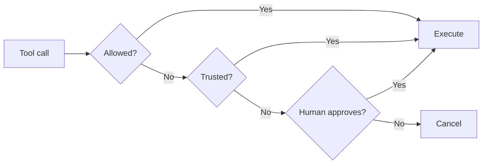

The `HumanInTheLoop` intervention handler pauses agent execution before tool calls to request human approval. It provides a configurable, drop-in way to add human oversight without writing custom interrupt logic. Pass it to `interventions` and choose how you want to collect the human’s response.

## How It Works

The handler uses the [`confirm` action](lc:user-guide/concepts/agents/interventions) to pause for human input. Under the hood it builds on the SDK’s [interrupt mechanism](lc:user-guide/concepts/interrupts), but abstracts away the manual interrupt/resume loop when you provide an `ask` option.



## Usage

### Interrupt/Resume Mode (Default)

Without an `ask` option, the handler raises an interrupt and the agent pauses. The caller presents the interrupt to the user, collects their response, and resumes the agent. This is the same [interrupt/resume pattern](lc:user-guide/concepts/interrupts#hooks) used throughout the SDK. For stateless deployments, combine with a [session manager](lc:user-guide/concepts/agents/session-management) to persist state between requests.

```sa-tabs
[
 {
  "label": "Python",
  "body": "```python\nagent = Agent(\n    tools=[delete_files],\n    interventions=[HumanInTheLoop()],\n)\n\n# Agent pauses with stop_reason 'interrupt' when a tool needs approval\nresult = agent(\"Delete the temp files\")\n\nif result.stop_reason == \"interrupt\":\n    # Present the interrupt to the user (web UI, Slack, etc.)\n    print(result.interrupts[0].reason)\n\n    # Resume with the human's response\n    result = agent(\n        [\n            {\n                \"interruptResponse\": {\n                    \"interruptId\": result.interrupts[0].id,\n                    \"response\": \"yes\",  # 'y', 'yes', or True -> approved\n                }\n            }\n        ]\n    )\n```"
 },
 {
  "label": "TypeScript",
  "body": "```typescript\nimport { Agent, tool, InterruptResponseContent } from '@strands-agents/sdk'\nimport { HumanInTheLoop } from '@strands-agents/sdk/vended-interventions/hitl'\nimport { z } from 'zod'\n\nconst deleteFiles = tool({\n  name: 'delete_files',\n  description: 'Delete files at the given paths',\n  inputSchema: z.object({ paths: z.array(z.string()) }),\n  callback: (input) => `Deleted ${input.paths.length} files`,\n})\n\nconst agent = new Agent({\n  tools: [deleteFiles],\n  interventions: [new HumanInTheLoop()],\n})\n\n// Agent pauses with stopReason 'interrupt' when a tool needs approval\nlet result = await agent.invoke('Delete the temp files')\n\nif (result.stopReason === 'interrupt') {\n  // Present the interrupt to the user (web UI, Slack, etc.)\n  console.log(result.interrupts![0].reason)\n\n  // Resume with the human's response\n  result = await agent.invoke([\n    new InterruptResponseContent({\n      interruptId: result.interrupts![0].id,\n      response: 'yes', // 'y', 'yes', or true \u2192 approved\n    }),\n  ])\n}\n```"
 }
]
```

### Stdio Mode

For CLI applications, pass `ask="stdio"``ask: 'stdio'` to prompt the user inline via stdin. The agent blocks until the user responds, so no interrupt handling is needed on the caller side.

```sa-tabs
[
 {
  "label": "Python",
  "body": "```python\nagent = Agent(\n    tools=[delete_files],\n    interventions=[HumanInTheLoop(ask=\"stdio\")],\n)\n\nagent(\"Delete the temp files\")\n# Terminal prompt:\n# Tool \"delete_files\" requires human approval. Input: {...} (y/n):\n```"
 },
 {
  "label": "TypeScript",
  "body": "```typescript\nimport { Agent, tool } from '@strands-agents/sdk'\nimport { HumanInTheLoop } from '@strands-agents/sdk/vended-interventions/hitl'\nimport { z } from 'zod'\n\n// const deleteFiles = tool({ ... }) \u2014 same as above\n\nconst agent = new Agent({\n  tools: [deleteFiles],\n  interventions: [new HumanInTheLoop({ ask: 'stdio' })],\n})\n\nawait agent.invoke('Delete the temp files')\n// Terminal prompt:\n// Tool \"delete_files\" requires human approval. Input: {...} (y/n):\n```"
 }
]
```

### Custom UI Callback

For web UIs, Slack bots, or other custom interfaces, pass a function to `ask`. The function receives a prompt string describing the tool call and must return the user’s response.

```sa-tabs
[
 {
  "label": "Python",
  "body": "```python\nasync def ask(prompt: str) -> str:\n    # Your UI: Slack DM, web modal, push notification, etc.\n    return await ask_user_via_slack(prompt)\n\nagent = Agent(\n    tools=[delete_files],\n    interventions=[HumanInTheLoop(ask=ask)],\n)\n\nagent(\"Delete the temp files\")\n```"
 },
 {
  "label": "TypeScript",
  "body": "```typescript\nimport { Agent, tool } from '@strands-agents/sdk'\nimport { HumanInTheLoop } from '@strands-agents/sdk/vended-interventions/hitl'\nimport { z } from 'zod'\n\n// const deleteFiles = tool({ ... }) \u2014 same as above\n\nconst agent = new Agent({\n  tools: [deleteFiles],\n  interventions: [\n    new HumanInTheLoop({\n      ask: async (prompt) => {\n        // Your UI: Slack DM, web modal, push notification, etc.\n        return await askUserViaSlack(prompt)\n      },\n    }),\n  ],\n})\n\nawait agent.invoke('Delete the temp files')\n```"
 }
]
```

## Configuration

| Parameter | Type | Default | Description |
| --- | --- | --- | --- |
| `allowed_tools``allowedTools` | `list[str]``string[]` | `None``undefined` | Tools that bypass approval. Supports `"*"` (all) and `"!tool_name"` (negation). |
| `enable_trust``enableTrust` | `bool``boolean` | `False``false` | When enabled, trust responses are remembered for the session. |
| `evaluate_trust``evaluateTrust` | Function | Accepts `"t"` or `"trust"` | Custom validator for trust responses. Only evaluated when trust is enabled. |
| `evaluate` | Function | Accepts `True, "y", or "yes"``true, 'y', or 'yes'` | Custom validator for approval responses. |
| `ask` | `Function or "stdio"``Function or 'stdio'` | `None``undefined` | Pass a function for custom UIs, `"stdio"` for CLI prompting, or omit for interrupt/resume. |

### Allowed Tools

Use the allowed tools list to skip approval for safe, read-only tools:

```sa-tabs
[
 {
  "label": "Python",
  "body": "```python\nagent = Agent(\n    tools=[read_file, delete_files],\n    interventions=[\n        HumanInTheLoop(\n            ask=\"stdio\",\n            # Pattern syntax:\n            #   \"read_file\"             -> runs without approval\n            #   \"*\"                     -> all tools run freely (disables handler)\n            #   [\"*\", \"!delete_files\"]  -> all except delete_files\n            allowed_tools=[\"read_file\"],\n        ),\n    ],\n)\n\nagent(\"Read config.json then delete /tmp/old-logs\")\n# Only delete_files prompts; read_file executes immediately\n```"
 },
 {
  "label": "TypeScript",
  "body": "```typescript\nimport { Agent, tool } from '@strands-agents/sdk'\nimport { HumanInTheLoop } from '@strands-agents/sdk/vended-interventions/hitl'\nimport { z } from 'zod'\n\n// const deleteFiles = tool({ ... }) \u2014 same as above\n// const readFile = tool({ ... })\n\nconst agent = new Agent({\n  tools: [readFile, deleteFiles],\n  interventions: [\n    new HumanInTheLoop({\n      ask: 'stdio',\n      // Pattern syntax:\n      //   'read_file'             \u2192 runs without approval\n      //   '*'                     \u2192 all tools run freely (disables handler)\n      //   ['*', '!delete_files']  \u2192 all except delete_files\n      allowedTools: ['read_file'],\n    }),\n  ],\n})\n\nawait agent.invoke('Read config.json then delete /tmp/old-logs')\n// Only delete_files prompts; read_file executes immediately\n```"
 }
]
```

### Trust Mode

When trust is enabled, a human can respond with `'t'` or `'trust'` to approve the current tool call AND remember that decision for the rest of the session. Subsequent calls to the same tool skip the prompt entirely. Trust works in all modes: interrupt/resume, stdio, and custom callbacks.

Trust state is stored in `agent.state``agent.appState` and persists across turns within a session but resets when the agent is re-created. Negated tools (`"!tool_name"`) cannot be trusted and always prompt.

```sa-tabs
[
 {
  "label": "Python",
  "body": "```python\nagent = Agent(\n    tools=[delete_files],\n    interventions=[\n        HumanInTheLoop(\n            ask=\"stdio\",\n            enable_trust=True,\n        ),\n    ],\n)\n\nagent(\"Delete all log files in /tmp\")\n# First call: user responds 't' -> approved AND remembered\n# Subsequent calls: no prompt needed for the session\n```"
 },
 {
  "label": "TypeScript",
  "body": "```typescript\nimport { Agent, tool } from '@strands-agents/sdk'\nimport { HumanInTheLoop } from '@strands-agents/sdk/vended-interventions/hitl'\nimport { z } from 'zod'\n\n// const deleteFiles = tool({ ... }) \u2014 same as above\n\nconst agent = new Agent({\n  tools: [deleteFiles],\n  interventions: [\n    new HumanInTheLoop({\n      ask: 'stdio',\n      enableTrust: true,\n    }),\n  ],\n})\n\nawait agent.invoke('Delete all log files in /tmp')\n// First call: user responds 't' \u2192 approved AND remembered\n// Subsequent calls: no prompt needed for the session\n```"
 }
]
```

### Custom Evaluate

By default, the handler accepts `True, "y", or "yes"``true, 'y', or 'yes'` as approval. Use `evaluate` to define your own approval logic, for example requiring the user to type “confirm”:

```sa-tabs
[
 {
  "label": "Python",
  "body": "```python\nagent = Agent(\n    tools=[delete_files],\n    interventions=[\n        HumanInTheLoop(\n            ask=\"stdio\",\n            # Only approve if the user types \"confirm\"\n            evaluate=lambda response: isinstance(response, str) and response.lower() == \"confirm\",\n        ),\n    ],\n)\n\nagent(\"Delete the temp files\")\n# Prompt: Tool \"delete_files\" requires human approval. Input: {...}\n# User must type \"confirm\" to approve (not just \"y\" or \"yes\")\n```"
 },
 {
  "label": "TypeScript",
  "body": "```typescript\nimport { Agent, tool } from '@strands-agents/sdk'\nimport { HumanInTheLoop } from '@strands-agents/sdk/vended-interventions/hitl'\nimport { z } from 'zod'\n\n// const deleteFiles = tool({ ... }) \u2014 same as above\n\nconst agent = new Agent({\n  tools: [deleteFiles],\n  interventions: [\n    new HumanInTheLoop({\n      ask: 'stdio',\n      // Only approve if the user types \"confirm\"\n      evaluate: (response) =>\n        typeof response === 'string' && response.toLowerCase() === 'confirm',\n    }),\n  ],\n})\n\nawait agent.invoke('Delete the temp files')\n// Prompt: Tool \"delete_files\" requires human approval. Input: {...}\n// User must type \"confirm\" to approve (not just \"y\" or \"yes\")\n```"
 }
]
```

## When to Use

Use `HumanInTheLoop` when you want tool-level approval gating with minimal code: it handles allow-lists, trust, and collection mode out of the box. Use [raw interrupts](lc:user-guide/concepts/interrupts) when you need full control: custom interrupt shapes, multi-step interactions, or workflows beyond simple approve/deny.

## Related Topics

-   [Interventions](lc:user-guide/concepts/agents/interventions): The intervention handler framework that HITL is built on
-   [Interrupts](lc:user-guide/concepts/interrupts): Low-level interrupt/resume mechanism
-   [Agent State](lc:user-guide/concepts/agents/state): How trust decisions persist via `agent.state``agent.appState`
-   [Session Management](lc:user-guide/concepts/agents/session-management): Persisting interrupt state across sessions

## Related pages

- [Cedar Authorization](lc:user-guide/concepts/agents/interventions/cedar-authorization) (2 shared tags)
- [Interventions](lc:user-guide/concepts/agents/interventions) (2 shared tags)
- [Creating a Custom Model Provider](lc:user-guide/concepts/model-providers/custom_model_provider) (1 shared tag)
- [Tool Executors](lc:user-guide/concepts/tools/executors) (1 shared tag)
- [Available Sandboxes](lc:user-guide/concepts/sandbox/available-sandboxes) (1 shared tag)
- [Building a Custom Sandbox](lc:user-guide/concepts/sandbox/custom-sandbox) (1 shared tag)
- [Sandbox](lc:user-guide/concepts/sandbox) (1 shared tag)
- [Agent Loop](lc:user-guide/concepts/agents/agent-loop) (1 shared tag)
- [Hooks](lc:user-guide/concepts/agents/hooks) (1 shared tag)
- [Steering (Interventions)](lc:user-guide/concepts/agents/interventions/steering) (1 shared tag)


## Implementation

### Python

- [harness-sdk/strands-py/src/strands/vended_interventions/hitl/hitl.py](https://github.com/strands-agents/harness-sdk/blob/main/strands-py/src/strands/vended_interventions/hitl/hitl.py)

### TypeScript

- [harness-sdk/strands-ts/src/vended-interventions/hitl/hitl.ts](https://github.com/strands-agents/harness-sdk/blob/main/strands-ts/src/vended-interventions/hitl/hitl.ts)
