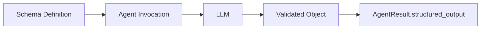

## Introduction

Structured output enables you to get type-safe, validated responses from language models using schema definitions. Instead of receiving raw text that you need to parse, you can define the exact structure you want and receive a validated object that matches your schema. This transforms unstructured LLM outputs into reliable, program-friendly data structures that integrate seamlessly with your application’s type system and validation rules.

In Python, structured output uses [Pydantic](https://docs.pydantic.dev/latest/concepts/models/) models. In TypeScript, it uses [Zod](https://zod.dev/) schemas for runtime validation and type inference.



Key benefits:

-   **Type Safety**: Get typed objects instead of raw strings
-   **Automatic Validation**: Schema validation ensures responses match your structure
-   **Clear Documentation**: Schema serves as documentation of expected output
-   **IDE Support**: IDE type hinting from LLM-generated responses
-   **Error Prevention**: Catch malformed responses early

## Basic Usage

Define an output structure using a schema and pass it to `structured_output_model``structuredOutputSchema`. Then, access the validated output from the `AgentResult`.

```sa-tabs
[
 {
  "label": "Python",
  "body": "```python\nfrom pydantic import BaseModel, Field\nfrom strands import Agent\n\n# 1) Define the Pydantic model\nclass PersonInfo(BaseModel):\n    \"\"\"Model that contains information about a Person\"\"\"\n    name: str = Field(description=\"Name of the person\")\n    age: int = Field(description=\"Age of the person\")\n    occupation: str = Field(description=\"Occupation of the person\")\n\n# 2) Pass the model to the agent\nagent = Agent()\nresult = agent(\n    \"John Smith is a 30 year-old software engineer\",\n    structured_output_model=PersonInfo\n)\n\n# 3) Access the `structured_output` from the result\nperson_info: PersonInfo = result.structured_output\nprint(f\"Name: {person_info.name}\")      # \"John Smith\"\nprint(f\"Age: {person_info.age}\")        # 30\nprint(f\"Job: {person_info.occupation}\") # \"software engineer\"\n```"
 },
 {
  "label": "TypeScript",
  "body": "```typescript\n// 1) Define the Zod schema\nconst PersonSchema = z.object({\n  name: z.string().describe('Name of the person'),\n  age: z.number().describe('Age of the person'),\n  occupation: z.string().describe('Occupation of the person'),\n})\n\ntype Person = z.infer<typeof PersonSchema>\n\n// 2) Pass the schema to the agent\nconst agent = new Agent({\n  structuredOutputSchema: PersonSchema,\n})\n\nconst result = await agent.invoke('John Smith is a 30 year-old software engineer')\n\n// 3) Access the `structuredOutput` from the result\n// TypeScript infers the type from the schema\nconst person = result.structuredOutput as Person\nconsole.log(`Name: ${person.name}`) // \"John Smith\"\nconsole.log(`Age: ${person.age}`) // 30\nconsole.log(`Job: ${person.occupation}`) // \"software engineer\"\n```"
 }
]
```

Async Support

Structured Output is supported with async in both Python and TypeScript:

```sa-tabs
[
 {
  "label": "Python",
  "body": "```python\nimport asyncio\nagent = Agent()\nresult = asyncio.run(\n    agent.invoke_async(\n        \"John Smith is a 30 year-old software engineer\",\n        structured_output_model=PersonInfo\n    )\n)\n```"
 },
 {
  "label": "TypeScript",
  "body": "```typescript\n// Agent.invoke() is already async in TypeScript\nconst agent = new Agent({ structuredOutputSchema: PersonSchema })\nconst result = await agent.invoke('John Smith is a 30 year-old software engineer')\n```"
 }
]
```

## More Information

### How It Works

The structured output system converts your schema definitions into tool specifications that guide the language model to produce correctly formatted responses. All of the model providers supported in Strands can work with Structured Output.

Strands accepts the `structured_output_model``structuredOutputSchema` parameter in agent invocations, which manages the conversion, validation, and response processing automatically. The validated result is available in the `AgentResult.structured_output``AgentResult.structuredOutput` field.

### Error Handling

When structured output validation fails, Strands throws a custom exception that can be caught and handled appropriately:

```sa-tabs
[
 {
  "label": "Python",
  "body": "```python\nfrom pydantic import ValidationError\nfrom strands.types.exceptions import StructuredOutputException\n\ntry:\n    result = agent(prompt, structured_output_model=MyModel)\nexcept StructuredOutputException as e:\n    print(f\"Structured output failed: {e}\")\n```"
 },
 {
  "label": "TypeScript",
  "body": "```typescript\ntry {\n  const result = await agent.invoke('some prompt')\n} catch (error) {\n  if (error instanceof StructuredOutputError) {\n    console.log(`Structured output failed: ${error.message}`)\n  }\n}\n```"
 }
]
```

### Migration from Legacy API

> [!WARNING] Deprecated API (Python Only)
>
> The `Agent.structured_output()` and `Agent.structured_output_async()` methods are deprecated in Python. Use the new `structured_output_model` parameter approach instead.

#### Before (Deprecated)

```sa-tabs
[
 {
  "label": "Python",
  "body": "```python\n# Old approach - deprecated\nresult = agent.structured_output(PersonInfo, \"John is 30 years old\")\nprint(result.name)  # Direct access to model fields\n```"
 },
 {
  "label": "TypeScript",
  "body": "```typescript\n// No deprecated API in TypeScript\n```"
 }
]
```

#### After (Recommended)

```sa-tabs
[
 {
  "label": "Python",
  "body": "```python\n# New approach - recommended\nresult = agent(\"John is 30 years old\", structured_output_model=PersonInfo)\nprint(result.structured_output.name)  # Access via structured_output field\n```"
 },
 {
  "label": "TypeScript",
  "body": "```typescript\n// TypeScript approach\nconst agent = new Agent({ structuredOutputSchema: PersonSchema })\nconst result = await agent.invoke('John is 30 years old')\nconsole.log(result.structuredOutput.name)  // Access via structuredOutput field\n```"
 }
]
```

### Best Practices

-   **Keep schemas focused**: Define specific schemas for clear purposes
-   **Use descriptive field names**: Include helpful descriptions with field metadata
-   **Handle errors gracefully**: Implement proper error handling strategies with fallbacks

### Related Documentation

For Python, refer to Pydantic documentation:

-   [Models and schema definition](https://docs.pydantic.dev/latest/concepts/models/)
-   [Field types and constraints](https://docs.pydantic.dev/latest/concepts/fields/)
-   [Custom validators](https://docs.pydantic.dev/latest/concepts/validators/)

For TypeScript, refer to Zod documentation:

-   [Zod documentation](https://zod.dev/)
-   [Schema types](https://zod.dev/?id=primitives)
-   [Schema methods](https://zod.dev/?id=strings)

## Cookbook

### Auto Retries with Validation

Automatically retry validation when initial extraction fails due to schema validation:

```sa-tabs
[
 {
  "label": "Python",
  "body": "```python\nfrom strands.agent import Agent\nfrom pydantic import BaseModel, field_validator\n\n\nclass Name(BaseModel):\n    first_name: str\n\n    @field_validator(\"first_name\")\n    @classmethod\n    def validate_first_name(cls, value: str) -> str:\n        if not value.endswith('abc'):\n            raise ValueError(\"You must append 'abc' to the end of my name\")\n        return value\n\n\nagent = Agent()\nresult = agent(\"What is Aaron's name?\", structured_output_model=Name)\n```"
 },
 {
  "label": "TypeScript",
  "body": "```typescript\nconst NameSchema = z.object({\n  firstName: z.string().refine((val) => val.endsWith('abc'), {\n    message: \"You must append 'abc' to the end of my name\",\n  }),\n})\n\nconst agent = new Agent({ structuredOutputSchema: NameSchema })\nconst result = await agent.invoke(\"What is Aaron's name?\")\n```"
 }
]
```

### Streaming Structured Output

Stream agent execution while using structured output. The structured output is available in the final result:

```sa-tabs
[
 {
  "label": "Python",
  "body": "```python\nfrom strands import Agent\nfrom pydantic import BaseModel, Field\n\nclass WeatherForecast(BaseModel):\n    \"\"\"Weather forecast data.\"\"\"\n    location: str\n    temperature: int\n    condition: str\n    humidity: int\n    wind_speed: int\n    forecast_date: str\n\nstreaming_agent = Agent()\n\nasync for event in streaming_agent.stream_async(\n    \"Generate a weather forecast for Seattle: 68\u00b0F, partly cloudy, 55% humidity, 8 mph winds, for tomorrow\",\n    structured_output_model=WeatherForecast\n):\n    if \"data\" in event:\n        print(event[\"data\"], end=\"\", flush=True)\n    elif \"result\" in event:\n        print(f'The forecast for today is: {event[\"result\"].structured_output}')\n```"
 },
 {
  "label": "TypeScript",
  "body": "```typescript\nconst WeatherForecastSchema = z.object({\n  location: z.string(),\n  temperature: z.number(),\n  condition: z.string(),\n  humidity: z.number(),\n  windSpeed: z.number(),\n  forecastDate: z.string(),\n})\n\ntype WeatherForecast = z.infer<typeof WeatherForecastSchema>\n\nconst agent = new Agent({ structuredOutputSchema: WeatherForecastSchema })\n\nfor await (const event of agent.stream(\n  'Generate a weather forecast for Seattle: 68\u00b0F, partly cloudy, 55% humidity, 8 mph winds, for tomorrow'\n)) {\n  if (event.type === 'agentResultEvent') {\n    const forecast = event.result.structuredOutput as WeatherForecast\n    console.log(`The forecast is: ${JSON.stringify(forecast)}`)\n  }\n}\n```"
 }
]
```

### Combining with Tools

Combine structured output with tool usage to format tool execution results:

```sa-tabs
[
 {
  "label": "Python",
  "body": "```python\nfrom strands import Agent\nfrom strands_tools import calculator\nfrom pydantic import BaseModel, Field\n\nclass MathResult(BaseModel):\n    operation: str = Field(description=\"the performed operation\")\n    result: int = Field(description=\"the result of the operation\")\n\ntool_agent = Agent(\n    tools=[calculator]\n)\nres = tool_agent(\"What is 42 + 8\", structured_output_model=MathResult)\n```"
 },
 {
  "label": "TypeScript",
  "body": "```typescript\nconst calculatorTool = tool({\n  name: 'calculator',\n  description: 'Perform basic arithmetic operations',\n  inputSchema: z.object({\n    operation: z.enum(['add', 'subtract', 'multiply', 'divide']),\n    a: z.number(),\n    b: z.number(),\n  }),\n  callback: (input) => {\n    const ops = {\n      add: input.a + input.b,\n      subtract: input.a - input.b,\n      multiply: input.a * input.b,\n      divide: input.a / input.b,\n    }\n    return ops[input.operation]\n  },\n})\n\nconst MathResultSchema = z.object({\n  operation: z.string().describe('the performed operation'),\n  result: z.number().describe('the result of the operation'),\n})\n\nconst agent = new Agent({\n  tools: [calculatorTool],\n  structuredOutputSchema: MathResultSchema,\n})\nconst result = await agent.invoke('What is 42 + 8')\n```"
 }
]
```

### Multiple Output Types

Reuse a single agent instance with different structured output schemas for varied extraction tasks:

```sa-tabs
[
 {
  "label": "Python",
  "body": "```python\nfrom strands import Agent\nfrom pydantic import BaseModel, Field\nfrom typing import Optional\n\nclass Person(BaseModel):\n    \"\"\"A person's basic information\"\"\"\n    name: str = Field(description=\"Full name\")\n    age: int = Field(description=\"Age in years\", ge=0, le=150)\n    email: str = Field(description=\"Email address\")\n    phone: Optional[str] = Field(description=\"Phone number\", default=None)\n\nclass Task(BaseModel):\n    \"\"\"A task or todo item\"\"\"\n    title: str = Field(description=\"Task title\")\n    description: str = Field(description=\"Detailed description\")\n    priority: str = Field(description=\"Priority level: low, medium, high\")\n    completed: bool = Field(description=\"Whether task is completed\", default=False)\n\n\nagent = Agent()\nperson_res = agent(\"Extract person: John Doe, 35, john@test.com\", structured_output_model=Person)\ntask_res = agent(\"Create task: Review code, high priority, completed\", structured_output_model=Task)\n```"
 },
 {
  "label": "TypeScript",
  "body": "```typescript\nconst PersonSchema = z.object({\n  name: z.string().describe('Full name'),\n  age: z.number().min(0).max(150).describe('Age in years'),\n  email: z.string().email().describe('Email address'),\n  phone: z.string().optional().describe('Phone number'),\n})\n\nconst TaskSchema = z.object({\n  title: z.string().describe('Task title'),\n  description: z.string().describe('Detailed description'),\n  priority: z.enum(['low', 'medium', 'high']).describe('Priority level'),\n  completed: z.boolean().default(false).describe('Whether task is completed'),\n})\n\ntype Person = z.infer<typeof PersonSchema>\ntype Task = z.infer<typeof TaskSchema>\n\nconst personAgent = new Agent({ structuredOutputSchema: PersonSchema })\nconst taskAgent = new Agent({ structuredOutputSchema: TaskSchema })\n\nconst personResult = await personAgent.invoke(\n  'Extract person: John Doe, 35, john@test.com'\n)\nconst taskResult = await taskAgent.invoke(\n  'Create task: Review code, high priority, completed'\n)\n```"
 }
]
```

### Using Conversation History

Extract structured information from prior conversation context without repeating questions:

```sa-tabs
[
 {
  "label": "Python",
  "body": "```python\nfrom strands import Agent\nfrom pydantic import BaseModel\nfrom typing import Optional\n\nagent = Agent()\n\n# Build up conversation context\nagent(\"What do you know about Paris, France?\")\nagent(\"Tell me about the weather there in spring.\")\n\nclass CityInfo(BaseModel):\n    city: str\n    country: str\n    population: Optional[int] = None\n    climate: str\n\n# Extract structured information from the conversation\nresult = agent(\n    \"Extract structured information about Paris from our conversation\",\n    structured_output_model=CityInfo\n)\n\nprint(f\"City: {result.structured_output.city}\")     # \"Paris\"\nprint(f\"Country: {result.structured_output.country}\") # \"France\"\n```"
 },
 {
  "label": "TypeScript",
  "body": "```typescript\nconst CityInfoSchema = z.object({\n  city: z.string(),\n  country: z.string(),\n  population: z.number().optional(),\n  climate: z.string(),\n})\n\ntype CityInfo = z.infer<typeof CityInfoSchema>\n\nconst agent = new Agent({ structuredOutputSchema: CityInfoSchema })\n\n// Build up conversation context\nawait agent.invoke('What do you know about Paris, France?')\nawait agent.invoke('Tell me about the weather there in spring.')\n\n// Extract structured information from the conversation\nconst result = await agent.invoke(\n  'Extract structured information about Paris from our conversation'\n)\n\nconst cityInfo = result.structuredOutput as CityInfo\nconsole.log(`City: ${cityInfo.city}`) // \"Paris\"\nconsole.log(`Country: ${cityInfo.country}`) // \"France\"\n```"
 }
]
```

### Agent-Level Defaults

You can also set a default structured output schema that applies to all agent invocations:

```sa-tabs
[
 {
  "label": "Python",
  "body": "```python\nclass PersonInfo(BaseModel):\n    name: str\n    age: int\n    occupation: str\n\n# Set default structured output model for all invocations\nagent = Agent(structured_output_model=PersonInfo)\nresult = agent(\"John Smith is a 30 year-old software engineer\")\n\nprint(f\"Name: {result.structured_output.name}\")      # \"John Smith\"\nprint(f\"Age: {result.structured_output.age}\")        # 30\nprint(f\"Job: {result.structured_output.occupation}\") # \"software engineer\"\n```"
 },
 {
  "label": "TypeScript",
  "body": "```typescript\nconst PersonSchema = z.object({\n  name: z.string(),\n  age: z.number(),\n  occupation: z.string(),\n})\n\ntype Person = z.infer<typeof PersonSchema>\n\n// Set default structured output schema for all invocations\nconst agent = new Agent({ structuredOutputSchema: PersonSchema })\nconst result = await agent.invoke('John Smith is a 30 year-old software engineer')\n\nconst person = result.structuredOutput as Person\nconsole.log(`Name: ${person.name}`) // \"John Smith\"\nconsole.log(`Age: ${person.age}`) // 30\nconsole.log(`Job: ${person.occupation}`) // \"software engineer\"\n```"
 }
]
```

> [!NOTE] Note
>
> Since this is on the agent init level, not the invocation level, the expectation is that the agent will attempt structured output for each invocation.

### Overriding Agent Defaults

Even when you set a default schema at the agent initialization level, you can override it for specific invocations:

```sa-tabs
[
 {
  "label": "Python",
  "body": "```python\nclass PersonInfo(BaseModel):\n    name: str\n    age: int\n    occupation: str\n\nclass CompanyInfo(BaseModel):\n    name: str\n    industry: str\n    employees: int\n\n# Agent with default PersonInfo model\nagent = Agent(structured_output_model=PersonInfo)\n\n# Override with CompanyInfo for this specific call\nresult = agent(\n    \"TechCorp is a software company with 500 employees\",\n    structured_output_model=CompanyInfo\n)\n\nprint(f\"Company: {result.structured_output.name}\")      # \"TechCorp\"\nprint(f\"Industry: {result.structured_output.industry}\") # \"software\"\nprint(f\"Size: {result.structured_output.employees}\")    # 500\n```"
 },
 {
  "label": "TypeScript",
  "body": "```typescript\nconst PersonSchema = z.object({\n  name: z.string(),\n  age: z.number(),\n  occupation: z.string(),\n})\n\nconst CompanySchema = z.object({\n  name: z.string(),\n  industry: z.string(),\n  employees: z.number(),\n})\n\ntype Company = z.infer<typeof CompanySchema>\n\n// Agent with default PersonInfo schema\nconst personAgent = new Agent({ structuredOutputSchema: PersonSchema })\n\n// Create a new agent with CompanyInfo schema for this specific use case\nconst companyAgent = new Agent({ structuredOutputSchema: CompanySchema })\nconst result = await companyAgent.invoke(\n  'TechCorp is a software company with 500 employees'\n)\n\nconst company = result.structuredOutput as Company\nconsole.log(`Company: ${company.name}`) // \"TechCorp\"\nconsole.log(`Industry: ${company.industry}`) // \"software\"\nconsole.log(`Size: ${company.employees}`) // 500\n```"
 }
]
```

## Related pages

- [LiteLLM](lc:user-guide/concepts/model-providers/litellm) (1 shared tag)
- [OpenAI](lc:user-guide/concepts/model-providers/openai) (1 shared tag)
- [Writer](lc:user-guide/concepts/model-providers/writer) (1 shared tag)
- [Anthropic](lc:user-guide/concepts/model-providers/anthropic) (1 shared tag)


## Implementation

### Python

- [harness-sdk/strands-py/src/strands/agent/agent.py](https://github.com/strands-agents/harness-sdk/blob/main/strands-py/src/strands/agent/agent.py)

### TypeScript

- [harness-sdk/strands-ts/src/tools/structured-output-tool.ts](https://github.com/strands-agents/harness-sdk/blob/main/strands-ts/src/tools/structured-output-tool.ts)
