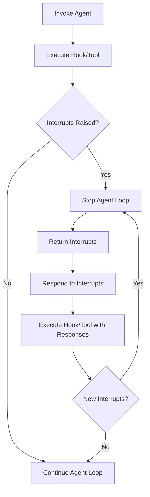

The interrupt system enables human-in-the-loop workflows by allowing users to pause agent execution and request human input before continuing. When an interrupt is raised, the agent stops its loop and returns control to the user. The user in turn provides a response to the agent. The agent then continues its execution starting from the point of interruption. Users can raise interrupts from either hook callbacks or tool definitions. The general flow looks as follows:



## Hooks

Users can raise interrupts within their [hook callbacks](lc:user-guide/concepts/agents/hooks) to pause agent execution at specific life-cycle events in the agentic loop.

```sa-tabs
[
 {
  "label": "Python",
  "body": "Only the `BeforeToolCallEvent` is interruptible. Interrupting on a `BeforeToolCallEvent` allows users to intercept tool calls before execution to request human approval or additional inputs.\n\n```python\nimport json\nfrom typing import Any\n\nfrom strands import Agent, tool\nfrom strands.hooks import BeforeToolCallEvent, HookProvider, HookRegistry\n\n\n@tool\ndef delete_files(paths: list[str]) -> bool:\n    # Implementation here\n    pass\n\n\n@tool\ndef inspect_files(paths: list[str]) -> dict[str, Any]:\n    # Implementation here\n    pass\n\n\nclass ApprovalHook(HookProvider):\n    def __init__(self, app_name: str) -> None:\n        self.app_name = app_name\n\n    def register_hooks(self, registry: HookRegistry, **kwargs: Any) -> None:\n        registry.add_callback(BeforeToolCallEvent, self.approve)\n\n    def approve(self, event: BeforeToolCallEvent) -> None:\n        if event.tool_use[\"name\"] != \"delete_files\":\n            return\n\n        approval = event.interrupt(f\"{self.app_name}-approval\", reason={\"paths\": event.tool_use[\"input\"][\"paths\"]})\n        if approval.lower() != \"y\":\n            event.cancel_tool = \"User denied permission to delete files\"\n\n\nagent = Agent(\n    hooks=[ApprovalHook(\"myapp\")],\n    system_prompt=\"You delete files older than 5 days\",\n    tools=[delete_files, inspect_files],\n    callback_handler=None,\n)\n\npaths = [\"a/b/c.txt\", \"d/e/f.txt\"]\nresult = agent(f\"paths=<{paths}>\")\n\nwhile True:\n    if result.stop_reason != \"interrupt\":\n        break\n\n    responses = []\n    for interrupt in result.interrupts:\n        if interrupt.name == \"myapp-approval\":\n            user_input = input(f\"Do you want to delete {interrupt.reason['paths']} (y/N): \")\n            responses.append({\n                \"interruptResponse\": {\n                    \"interruptId\": interrupt.id,\n                    \"response\": user_input\n                }\n            })\n\n    result = agent(responses)\n\nprint(f\"MESSAGE: {json.dumps(result.message)}\")\n```"
 },
 {
  "label": "TypeScript",
  "body": "Both `BeforeToolCallEvent` and `BeforeToolsEvent` are interruptible. Interrupting on a `BeforeToolCallEvent` allows users to intercept individual tool calls before execution, while `BeforeToolsEvent` allows intercepting the entire batch of tool calls before any execute.\n\n#### BeforeToolCallEvent\n\n```typescript\nimport { Agent, tool, BeforeToolCallEvent } from '@strands-agents/sdk'\nimport { z } from 'zod'\n\nconst deleteFiles = tool({\n  name: 'delete_files',\n  description: 'Delete files at the given paths',\n  inputSchema: z.object({ paths: z.array(z.string()) }),\n  callback: (input) => {\n    // Implementation here\n    return true\n  },\n})\n\nconst inspectFiles = tool({\n  name: 'inspect_files',\n  description: 'Inspect files at the given paths',\n  inputSchema: z.object({ paths: z.array(z.string()) }),\n  callback: (input) => {\n    // Implementation here\n    return {}\n  },\n})\n\nconst agent = new Agent({\n  systemPrompt: 'You delete files older than 5 days',\n  tools: [deleteFiles, inspectFiles],\n})\n\nagent.addHook(BeforeToolCallEvent, (event) => {\n  if (event.toolUse.name !== 'delete_files') return\n\n  const approval = event.interrupt<string>({\n    name: 'myapp-approval',\n    reason: { paths: (event.toolUse.input as { paths: string[] }).paths },\n  })\n  if (approval.toLowerCase() !== 'y') {\n    event.cancel = 'User denied permission to delete files'\n  }\n})\n\nconst paths = ['a/b/c.txt', 'd/e/f.txt']\nlet result = await agent.invoke(`paths=<${JSON.stringify(paths)}>`)\n\nwhile (result.stopReason === 'interrupt') {\n  const responses = result.interrupts!.map((interrupt) => ({\n    interruptResponse: {\n      interruptId: interrupt.id,\n      // In a real app, collect user input here\n      response: 'y',\n    },\n  }))\n\n  result = await agent.invoke(responses)\n}\n\nconsole.log('MESSAGE:', JSON.stringify(result.lastMessage))\n```\n\n#### BeforeToolsEvent\n\n```typescript\nimport { Agent, BeforeToolsEvent } from '@strands-agents/sdk'\n\nconst agent = new Agent({\n  tools: [\n    /* ... */\n  ],\n})\n\nagent.addHook(BeforeToolsEvent, (event) => {\n  const dangerousTools = event.message.content\n    .filter((block) => block.type === 'toolUseBlock')\n    .filter((block) => ['delete_files'].includes(block.name))\n\n  if (dangerousTools.length > 0) {\n    const response = event.interrupt<{ approved: boolean }>({\n      name: 'batch_approval',\n      reason: `Approve ${dangerousTools.length} dangerous tool calls?`,\n    })\n    if (!response.approved) {\n      event.cancel = 'Batch cancelled by user'\n    }\n  }\n})\n```"
 }
]
```

### Components

Interrupts in Strands are comprised of the following components:

```sa-tabs
[
 {
  "label": "Python",
  "body": "-   `event.interrupt` - Raises an interrupt with a unique name and optional reason\n    -   The `name` must be unique across all interrupt calls configured on the `BeforeToolCallEvent`. In the example above, we demonstrate using `app_name` to namespace the interrupt call. This is particularly helpful if you plan to vend your hooks to other users.\n    -   You can assign additional context for raising the interrupt to the `reason` field. Note, the `reason` must be JSON-serializable.\n-   `result.stop_reason` - Check if agent stopped due to \u201cinterrupt\u201d\n-   `result.interrupts` - List of interrupts that were raised\n    -   Each `interrupt` contains the user provided name and reason, along with an instance id.\n-   `interruptResponse` - Content block type for configuring the interrupt responses.\n    -   Each `response` is uniquely identified by their interrupt\u2019s id and will be returned from the associated interrupt call when invoked the second time around. Note, the `response` must be JSON-serializable.\n-   `event.cancel_tool` - Cancel tool execution based on interrupt response\n    -   You can either set `cancel_tool` to `True` or provide a custom cancellation message.\n\nFor additional details on each of these components, refer to the [Python API Reference](lc:api/python/strands.types.interrupt)."
 },
 {
  "label": "TypeScript",
  "body": "-   [`BeforeToolCallEvent`](https://strandsagents.com/docs/api/typescript/BeforeToolCallEvent/) / [`BeforeToolsEvent`](https://strandsagents.com/docs/api/typescript/BeforeToolsEvent/): hook events that expose the ability to interrupt via the `interrupt` method\n    -   `event.interrupt({ name, reason? })`: halts the agent loop. `name` is a string identifier and `reason` is an optional JSON-serializable value providing context for why the interrupt was raised.\n    -   The `name` must be unique across all interrupt calls configured on the same event. In the example above, we demonstrate using a namespace prefix for the interrupt call. This is particularly helpful if you plan to vend your hooks to other users.\n    -   `event.cancel`: cancel tool execution based on the interrupt response. Set to `true` for a default message or provide a custom cancellation message string.\n-   [`AgentResult`](https://strandsagents.com/docs/api/typescript/AgentResult/): returned by `invoke()` / `stream()`, contains interrupt information when the agent pauses\n    -   `result.stopReason`: check if agent stopped due to `'interrupt'`\n    -   `result.interrupts`: array of `Interrupt` objects, each containing the user-provided `name` and `reason`, along with a unique `id`\n-   `InterruptResponseContent`: content block type for resuming from an interrupt\n    -   Pass an array of these to `agent.invoke()` to resume. Each response is keyed by the interrupt\u2019s `id` and will be returned from the associated `interrupt()` call when the tool/hook re-executes. The `response` must be JSON-serializable."
 }
]
```

### Rules

Strands enforces the following rules for interrupts:

```sa-tabs
[
 {
  "label": "Python",
  "body": "-   All hooks configured on the interrupted event will execute\n-   All hooks configured on the interrupted event are allowed to raise an interrupt\n-   A single hook can raise multiple interrupts but only one at a time\n    -   In other words, within a single hook, you can interrupt, respond to that interrupt, and then proceed to interrupt again.\n-   All tools running concurrently are interruptible\n-   All tools running concurrently that are not interrupted will execute"
 },
 {
  "label": "TypeScript",
  "body": "-   All hooks configured on the interrupted event will execute\n-   All hooks configured on the interrupted event are allowed to raise an interrupt\n-   A single hook can raise multiple interrupts but only one at a time\n    -   In other words, within a single hook, you can interrupt, respond to that interrupt, and then proceed to interrupt again.\n-   When an interrupt fires from `BeforeToolCallEvent`, `AfterToolCallEvent` does not fire for that tool, but `AfterToolsEvent` always fires\n-   When an interrupt fires mid-batch, completed tool results are preserved so the agent skips the model call on resume and only executes remaining tools\n-   Both assistant and tool result messages are appended only after tool execution completes, preventing dangling `toolUse` blocks without matching results"
 }
]
```

## Tools

Users can also raise interrupts from their tool definitions.

```sa-tabs
[
 {
  "label": "Python",
  "body": "```python\nfrom typing import Any\n\nfrom strands import Agent, tool\nfrom strands.types.tools import ToolContext\n\n\nclass DeleteTool:\n    def __init__(self, app_name: str) -> None:\n        self.app_name = app_name\n\n    @tool(context=True)\n    def delete_files(self, tool_context: ToolContext, paths: list[str]) -> bool:\n        approval = tool_context.interrupt(f\"{self.app_name}-approval\", reason={\"paths\": paths})\n        if approval.lower() != \"y\":\n            return False\n\n        # Implementation here\n\n        return True\n\n\n@tool\ndef inspect_files(paths: list[str]) -> dict[str, Any]:\n    # Implementation here\n    pass\n\n\nagent = Agent(\n    system_prompt=\"You delete files older than 5 days\",\n    tools=[DeleteTool(\"myapp\").delete_files, inspect_files],\n    callback_handler=None,\n)\n\n...\n```\n\nInterrupts are not supported in [direct tool calls](lc:user-guide/concepts/tools#direct-method-calls) (i.e., calls such as `agent.tool.my_tool()`)."
 },
 {
  "label": "TypeScript",
  "body": "The tool callback receives a `context` parameter (the second argument) which provides the `interrupt` method.\n\n```typescript\nimport { Agent, tool } from '@strands-agents/sdk'\nimport { z } from 'zod'\n\nconst deleteFiles = tool({\n  name: 'delete_files',\n  description: 'Delete files at the given paths',\n  inputSchema: z.object({ paths: z.array(z.string()) }),\n  callback: (input, context) => {\n    const approval = context.interrupt<string>({\n      name: 'myapp-approval',\n      reason: { paths: input.paths },\n    })\n    if (approval.toLowerCase() !== 'y') return false\n\n    // Implementation here\n\n    return true\n  },\n})\n\nconst inspectFiles = tool({\n  name: 'inspect_files',\n  description: 'Inspect files at the given paths',\n  inputSchema: z.object({ paths: z.array(z.string()) }),\n  callback: (input) => {\n    // Implementation here\n    return {}\n  },\n})\n\nconst agent = new Agent({\n  systemPrompt: 'You delete files older than 5 days',\n  tools: [deleteFiles, inspectFiles],\n})\n\n// ...\n```"
 }
]
```

### Components

Tool interrupts work like hook interrupts, with two differences: tools receive `context` instead of `event`, and interrupt names need only be unique within a tool definition rather than across all hooks on an event. For more on tool context, see [ToolContext](lc:user-guide/concepts/tools/custom-tools#toolcontext).

```sa-tabs
[
 {
  "label": "Python",
  "body": "-   `tool_context` - Strands object that defines the interrupt call\n-   `tool_context.interrupt` - Raises an interrupt with a unique name and optional reason\n    -   The `name` must be unique only among interrupt calls configured in the same tool definition. It is still advisable however to namespace your interrupts so as to more easily distinguish the calls when constructing responses outside the agent."
 },
 {
  "label": "TypeScript",
  "body": "-   [`ToolContext`](https://strandsagents.com/docs/api/typescript/ToolContext/): the second argument passed to the tool callback, providing access to the `interrupt` method\n    -   `context.interrupt({ name, reason? })`: halts the agent loop. `name` is a string identifier and `reason` is an optional JSON-serializable value.\n    -   The `name` must be unique only among interrupt calls configured in the same tool definition. It is still advisable however to namespace your interrupts so as to more easily distinguish the calls when constructing responses outside the agent."
 }
]
```

### Rules

Strands enforces the following rules for tool interrupts:

```sa-tabs
[
 {
  "label": "Python",
  "body": "-   All tools running concurrently will execute\n-   All tools running concurrently are interruptible\n-   A single tool can raise multiple interrupts but only one at a time\n    -   In other words, within a single tool, you can interrupt, respond to that interrupt, and then proceed to interrupt again."
 },
 {
  "label": "TypeScript",
  "body": "-   A single tool can raise multiple interrupts but only one at a time\n    -   In other words, within a single tool, you can interrupt, respond to that interrupt, and then proceed to interrupt again.\n-   When an interrupt fires mid-batch, completed tool results are preserved so the agent skips the model call on resume and only executes remaining tools"
 }
]
```

## Session Management

Users can session manage their interrupts and respond back at a later time under a new agent session. Additionally, users can session manage the responses to avoid repeated interrupts on subsequent tool calls.

```sa-tabs
[
 {
  "label": "Python",
  "body": "```python\n##### server.py #####\n\nimport json\nfrom typing import Any\n\nfrom strands import Agent, tool\nfrom strands.agent import AgentResult\nfrom strands.hooks import BeforeToolCallEvent, HookProvider, HookRegistry\nfrom strands.session import FileSessionManager\nfrom strands.types.agent import AgentInput\n\n\n@tool\ndef delete_files(paths: list[str]) -> bool:\n    # Implementation here\n    pass\n\n\n@tool\ndef inspect_files(paths: list[str]) -> dict[str, Any]:\n    # Implementation here\n    pass\n\n\nclass ApprovalHook(HookProvider):\n    def __init__(self, app_name: str) -> None:\n        self.app_name = app_name\n\n    def register_hooks(self, registry: HookRegistry, **kwargs: Any) -> None:\n        registry.add_callback(BeforeToolCallEvent, self.approve)\n\n    def approve(self, event: BeforeToolCallEvent) -> None:\n        if event.tool_use[\"name\"] != \"delete_files\":\n            return\n\n        if event.agent.state.get(f\"{self.app_name}-approval\") == \"t\":  # (t)rust\n            return\n\n        approval = event.interrupt(f\"{self.app_name}-approval\", reason={\"paths\": event.tool_use[\"input\"][\"paths\"]})\n        if approval.lower() not in [\"y\", \"t\"]:\n            event.cancel_tool = \"User denied permission to delete files\"\n\n        event.agent.state.set(f\"{self.app_name}-approval\", approval.lower())\n\n\ndef server(prompt: AgentInput) -> AgentResult:\n    agent = Agent(\n        hooks=[ApprovalHook(\"myapp\")],\n        session_manager=FileSessionManager(session_id=\"myapp\", storage_dir=\"/path/to/storage\"),\n        system_prompt=\"You delete files older than 5 days\",\n        tools=[delete_files, inspect_files],\n        callback_handler=None,\n    )\n    return agent(prompt)\n\n##### client.py #####\n\ndef client(paths: list[str]) -> AgentResult:\n    result = server(f\"paths=<{paths}>\")\n\n    while True:\n        if result.stop_reason != \"interrupt\":\n            break\n\n        responses = []\n        for interrupt in result.interrupts:\n            if interrupt.name == \"myapp-approval\":\n                user_input = input(f\"Do you want to delete {interrupt.reason['paths']} (t/y/N): \")\n                responses.append({\n                    \"interruptResponse\": {\n                        \"interruptId\": interrupt.id,\n                        \"response\": user_input\n                    }\n                })\n\n        result = server(responses)\n\n    return result\n\n\npaths = [\"a/b/c.txt\", \"d/e/f.txt\"]\nresult = client(paths)\nprint(f\"MESSAGE: {json.dumps(result.message)}\")\n```"
 },
 {
  "label": "TypeScript",
  "body": "```typescript\nimport {\n  Agent,\n  tool,\n  SessionManager,\n  FileStorage,\n  BeforeToolCallEvent,\n} from '@strands-agents/sdk'\nimport { z } from 'zod'\n\nconst deleteFiles = tool({\n  name: 'delete_files',\n  description: 'Delete files at the given paths',\n  inputSchema: z.object({ paths: z.array(z.string()) }),\n  callback: (input) => {\n    // Implementation here\n    return true\n  },\n})\n\nconst inspectFiles = tool({\n  name: 'inspect_files',\n  description: 'Inspect files at the given paths',\n  inputSchema: z.object({ paths: z.array(z.string()) }),\n  callback: (input) => {\n    // Implementation here\n    return {}\n  },\n})\n\n// Server function \u2014 creates a fresh agent with session management each call\nasync function server(\n  prompt: string | { interruptResponse: { interruptId: string; response: unknown } }[]\n) {\n  const agent = new Agent({\n    systemPrompt: 'You delete files older than 5 days',\n    tools: [deleteFiles, inspectFiles],\n    sessionManager: new SessionManager({\n      sessionId: 'myapp',\n      storage: { snapshot: new FileStorage('/path/to/storage') },\n    }),\n  })\n\n  agent.addHook(BeforeToolCallEvent, (event) => {\n    if (event.toolUse.name !== 'delete_files') return\n\n    // Check if user already trusted this approval\n    if (event.agent.appState.get('myapp-approval') === 't') return\n\n    const approval = event.interrupt<string>({\n      name: 'myapp-approval',\n      reason: { paths: (event.toolUse.input as { paths: string[] }).paths },\n    })\n    if (!['y', 't'].includes(approval.toLowerCase())) {\n      event.cancel = 'User denied permission to delete files'\n    }\n\n    event.agent.appState.set('myapp-approval', approval.toLowerCase())\n  })\n\n  return agent.invoke(prompt)\n}\n\n// Client function\nasync function client(paths: string[]) {\n  let result = await server(`paths=<${JSON.stringify(paths)}>`)\n\n  while (result.stopReason === 'interrupt') {\n    const responses = result.interrupts!.map((interrupt) => ({\n      interruptResponse: {\n        interruptId: interrupt.id,\n        // In a real app, collect user input here\n        response: 'y',\n      },\n    }))\n\n    result = await server(responses)\n  }\n\n  return result\n}\n\nconst paths = ['a/b/c.txt', 'd/e/f.txt']\nconst result = await client(paths)\nconsole.log('MESSAGE:', JSON.stringify(result.lastMessage))\n```"
 }
]
```

### Components

Session managing interrupts involves the following key components:

```sa-tabs
[
 {
  "label": "Python",
  "body": "-   `session_manager` - Automatically persists the agent interrupt state between tear down and start up\n    -   See [Session Management](lc:user-guide/concepts/agents/session-management) for more.\n-   `agent.state` - General purpose key-value store that can be used to persist interrupt responses\n    -   On subsequent tool calls, you can reference the responses stored in `agent.state` to decide whether another interrupt is necessary. See [Agent State](lc:user-guide/concepts/agents/state#agent-state) for more."
 },
 {
  "label": "TypeScript",
  "body": "-   `sessionManager` - Automatically persists the agent interrupt state between tear down and start up\n    -   See [Session Management](lc:user-guide/concepts/agents/session-management) for more.\n-   `agent.appState` - General purpose key-value store that can be used to persist interrupt responses\n    -   On subsequent tool calls, you can reference the responses stored in `appState` to decide whether another interrupt is necessary. See [Agent State](lc:user-guide/concepts/agents/state#agent-state) for more."
 }
]
```

## MCP Elicitation

To collect additional information from a user during an MCP tool call, use elicitation. An MCP server sends an elicitation request to the connecting client, which is handled by an elicitation callback. See [MCP Elicitation](lc:user-guide/concepts/tools/mcp-tools#elicitation) for details.

## Multi-Agents

Interrupts are supported in multi-agent patterns, enabling human-in-the-loop workflows across agent orchestration systems. The interfaces mirror those used for single-agent interrupts. You can raise interrupts from `BeforeNodeCallEvent` hooks executed before each node or from within the nodes themselves. Session management is also supported, allowing you to persist and resume your interrupted multi-agents.

### Swarm

A [Swarm](lc:user-guide/concepts/multi-agent/swarm) is a collaborative agent orchestration system where multiple agents work together as a team to solve complex tasks. The following example demonstrates interrupting your swarm invocation through a `BeforeNodeCallEvent` hook.

```sa-tabs
[
 {
  "label": "Python",
  "body": "```python\nimport json\n\nfrom strands import Agent\nfrom strands.hooks import BeforeNodeCallEvent, HookProvider, HookRegistry\nfrom strands.multiagent import Swarm, Status\n\n\nclass ApprovalHook(HookProvider):\n    def __init__(self, app_name: str) -> None:\n        self.app_name = app_name\n\n    def register_hooks(self, registry: HookRegistry) -> None:\n        registry.add_callback(BeforeNodeCallEvent, self.approve)\n\n    def approve(self, event: BeforeNodeCallEvent) -> None:\n        if event.node_id != \"cleanup\":\n            return\n\n        approval = event.interrupt(f\"{self.app_name}-approval\", reason={\"resources\": \"example\"})\n        if approval.lower() != \"y\":\n            event.cancel_node = \"User denied permission to cleanup resources\"\n\n\nswarm = Swarm(\n    [\n        Agent(name=\"cleanup\", system_prompt=\"You clean up resources older than 5 days.\", callback_handler=None),\n    ],\n    hooks=[ApprovalHook(\"myapp\")],\n)\n\nresult = swarm(\"Clean up my resources\")\nwhile result.status == Status.INTERRUPTED:\n    responses = []\n    for interrupt in result.interrupts:\n        if interrupt.name == \"myapp-approval\":\n            user_input = input(f\"Do you want to cleanup {interrupt.reason['resources']} (y/N): \")\n            responses.append({\n                \"interruptResponse\": {\n                    \"interruptId\": interrupt.id,\n                    \"response\": user_input,\n                },\n            })\n\n    result = swarm(responses)\n\nprint(f\"MESSAGE: {json.dumps(result.results['cleanup'].result.message, indent=2)}\")\n```"
 },
 {
  "label": "TypeScript",
  "body": "```typescript\nimport { Agent, Swarm, Status, BeforeNodeCallEvent } from '@strands-agents/sdk'\n\nconst cleanupAgent = new Agent({\n  id: 'cleanup',\n  systemPrompt: 'You clean up resources older than 5 days.',\n})\n\nconst swarm = new Swarm({ nodes: [cleanupAgent], start: 'cleanup' })\n\nswarm.addHook(BeforeNodeCallEvent, (event) => {\n  if (event.nodeId !== 'cleanup') return\n\n  const approval = event.interrupt<string>({\n    name: 'myapp-approval',\n    reason: { resources: 'example' },\n  })\n  if (approval.toLowerCase() !== 'y') {\n    event.cancel = 'User denied permission to cleanup resources'\n  }\n})\n\nlet result = await swarm.invoke('Clean up my resources')\n\nwhile (result.status === Status.INTERRUPTED) {\n  const responses = result.interrupts!.map((interrupt) => ({\n    interruptResponse: {\n      interruptId: interrupt.id,\n      // In a real app, collect user input here\n      response: 'y',\n    },\n  }))\n\n  result = await swarm.invoke(responses)\n}\n\nconsole.log('MESSAGE:', JSON.stringify(result.results, null, 2))\n```"
 }
]
```

Swarms also support interrupts raised from within the nodes themselves following any of the single-agent interrupt patterns outlined above.

#### Components

```sa-tabs
[
 {
  "label": "Python",
  "body": "-   `event.interrupt` - Raises an interrupt with a unique name and optional reason\n    -   The `name` must be unique across all interrupt calls configured on the `BeforeNodeCallEvent`. In the example above, we demonstrate using `app_name` to namespace the interrupt call. This is particularly helpful if you plan to vend your hooks to other users.\n    -   You can assign additional context for raising the interrupt to the `reason` field. Note, the `reason` must be JSON-serializable.\n-   `result.status` - Check if the swarm stopped due to `Status.INTERRUPTED`\n-   `result.interrupts` - List of interrupts that were raised\n    -   Each `interrupt` contains the user provided name and reason, along with an instance id.\n-   `interruptResponse` - Content block type for configuring the interrupt responses.\n    -   Each `response` is uniquely identified by their interrupt\u2019s id and will be returned from the associated interrupt call when invoked the second time around. Note, the `response` must be JSON-serializable.\n-   `event.cancel_node` - Cancel node execution based on interrupt response\n    -   You can either set `cancel_node` to `True` or provide a custom cancellation message."
 },
 {
  "label": "TypeScript",
  "body": "-   `BeforeNodeCallEvent`: orchestrator hook event that exposes the ability to interrupt before a node runs\n    -   `event.interrupt({ name, reason? })`: halts the orchestrator. `name` is a string identifier and `reason` is an optional JSON-serializable value providing context for why the interrupt was raised.\n    -   The `name` must be unique across all interrupt calls configured on the same event. In the example above, we demonstrate using a namespace prefix for the interrupt call. This is particularly helpful if you plan to vend your hooks to other users.\n    -   `event.cancel`: cancel node execution based on the interrupt response. Set to `true` for a default message or provide a custom cancellation message string.\n-   `MultiAgentResult`: returned by `invoke()` / `stream()`, contains interrupt information when the orchestrator pauses\n    -   `result.status`: check if the swarm stopped due to `Status.INTERRUPTED`\n    -   `result.interrupts`: array of `Interrupt` objects, each with `name`, `reason`, and a unique `id`. Each interrupt\u2019s `source` field is `'multiagent-hook'` when raised from `BeforeNodeCallEvent`.\n-   `InterruptResponseContent`: content block type for resuming from an interrupt\n    -   Pass an array of these to `swarm.invoke()` to resume. The orchestrator routes each response to the node that raised the matching interrupt."
 }
]
```

#### Rules

Strands enforces the following rules for interrupts in swarm:

-   All hooks configured on the interrupted event will execute
-   All hooks configured on the interrupted event are allowed to raise an interrupt
-   A single hook can raise multiple interrupts but only one at a time
    -   In other words, within a single hook, you can interrupt, respond to that interrupt, and then proceed to interrupt again.
-   A single node can raise multiple interrupts following any of the single-agent interrupt patterns outlined above.

### Graph

A [Graph](lc:user-guide/concepts/multi-agent/graph) is a deterministic agent orchestration system based on a directed graph, where agents are nodes executed according to edge dependencies. The following example demonstrates interrupting your graph invocation through a `BeforeNodeCallEvent` hook.

```sa-tabs
[
 {
  "label": "Python",
  "body": "```python\nimport json\n\nfrom strands import Agent\nfrom strands.hooks import BeforeNodeCallEvent, HookProvider, HookRegistry\nfrom strands.multiagent import GraphBuilder, Status\n\n\nclass ApprovalHook(HookProvider):\n    def __init__(self, app_name: str) -> None:\n        self.app_name = app_name\n\n    def register_hooks(self, registry: HookRegistry) -> None:\n        registry.add_callback(BeforeNodeCallEvent, self.approve)\n\n    def approve(self, event: BeforeNodeCallEvent) -> None:\n        if event.node_id != \"cleanup\":\n            return\n\n        approval = event.interrupt(f\"{self.app_name}-approval\", reason={\"resources\": \"example\"})\n        if approval.lower() != \"y\":\n            event.cancel_node = \"User denied permission to cleanup resources\"\n\n\ninspector_agent = Agent(name=\"inspector\", system_prompt=\"You inspect resources.\", callback_handler=None)\ncleanup_agent = Agent(name=\"cleanup\", system_prompt=\"You clean up resources older than 5 days.\", callback_handler=None)\n\nbuilder = GraphBuilder()\nbuilder.add_node(inspector_agent, \"inspector\")\nbuilder.add_node(cleanup_agent, \"cleanup\")\nbuilder.add_edge(\"inspector\", \"cleanup\")\nbuilder.set_entry_point(\"inspector\")\nbuilder.set_hook_providers([ApprovalHook(\"myapp\")])\ngraph = builder.build()\n\nresult = graph(\"Inspect and clean up my resources\")\nwhile result.status == Status.INTERRUPTED:\n    responses = []\n    for interrupt in result.interrupts:\n        if interrupt.name == \"myapp-approval\":\n            user_input = input(f\"Do you want to cleanup {interrupt.reason['resources']} (y/N): \")\n            responses.append({\n                \"interruptResponse\": {\n                    \"interruptId\": interrupt.id,\n                    \"response\": user_input,\n                },\n            })\n\n    result = graph(responses)\n\nprint(f\"MESSAGE: {json.dumps(result.results['cleanup'].result.message, indent=2)}\")\n```"
 },
 {
  "label": "TypeScript",
  "body": "```typescript\nimport { Agent, Graph, Status, BeforeNodeCallEvent } from '@strands-agents/sdk'\n\nconst inspectorAgent = new Agent({\n  id: 'inspector',\n  systemPrompt: 'You inspect resources.',\n})\nconst cleanupAgent = new Agent({\n  id: 'cleanup',\n  systemPrompt: 'You clean up resources older than 5 days.',\n})\n\nconst graph = new Graph({\n  nodes: [inspectorAgent, cleanupAgent],\n  edges: [['inspector', 'cleanup']],\n})\n\ngraph.addHook(BeforeNodeCallEvent, (event) => {\n  if (event.nodeId !== 'cleanup') return\n\n  const approval = event.interrupt<string>({\n    name: 'myapp-approval',\n    reason: { resources: 'example' },\n  })\n  if (approval.toLowerCase() !== 'y') {\n    event.cancel = 'User denied permission to cleanup resources'\n  }\n})\n\nlet result = await graph.invoke('Inspect and clean up my resources')\n\nwhile (result.status === Status.INTERRUPTED) {\n  const responses = result.interrupts!.map((interrupt) => ({\n    interruptResponse: {\n      interruptId: interrupt.id,\n      // In a real app, collect user input here\n      response: 'y',\n    },\n  }))\n\n  result = await graph.invoke(responses)\n}\n\nconsole.log('MESSAGE:', JSON.stringify(result.results, null, 2))\n```"
 }
]
```

Graphs also support interrupts raised from within the nodes themselves following any of the single-agent interrupt patterns outlined above.

#### Components

```sa-tabs
[
 {
  "label": "Python",
  "body": "-   `event.interrupt` - Raises an interrupt with a unique name and optional reason\n    -   The `name` must be unique across all interrupt calls configured on the `BeforeNodeCallEvent`. In the example above, we demonstrate using `app_name` to namespace the interrupt call. This is particularly helpful if you plan to vend your hooks to other users.\n    -   You can assign additional context for raising the interrupt to the `reason` field. Note, the `reason` must be JSON-serializable.\n-   `result.status` - Check if the graph stopped due to `Status.INTERRUPTED`\n-   `result.interrupts` - List of interrupts that were raised\n    -   Each `interrupt` contains the user provided name and reason, along with an instance id.\n-   `interruptResponse` - Content block type for configuring the interrupt responses\n    -   Each `response` is uniquely identified by their interrupt\u2019s id and will be returned from the associated interrupt call when invoked the second time around. Note, the `response` must be JSON-serializable.\n-   `event.cancel_node` - Cancel node execution based on interrupt response\n    -   You can either set `cancel_node` to `True` or provide a custom cancellation message."
 },
 {
  "label": "TypeScript",
  "body": "-   `BeforeNodeCallEvent`: orchestrator hook event that exposes the ability to interrupt before a node runs\n    -   `event.interrupt({ name, reason? })`: halts the orchestrator. `name` is a string identifier and `reason` is an optional JSON-serializable value providing context for why the interrupt was raised.\n    -   The `name` must be unique across all interrupt calls configured on the same event. In the example above, we demonstrate using a namespace prefix for the interrupt call. This is particularly helpful if you plan to vend your hooks to other users.\n    -   `event.cancel`: cancel node execution based on the interrupt response. Set to `true` for a default message or provide a custom cancellation message string.\n-   `MultiAgentResult`: returned by `invoke()` / `stream()`, contains interrupt information when the orchestrator pauses\n    -   `result.status`: check if the graph stopped due to `Status.INTERRUPTED`\n    -   `result.interrupts`: array of `Interrupt` objects, each with `name`, `reason`, and a unique `id`. Each interrupt\u2019s `source` field is `'multiagent-hook'` when raised from `BeforeNodeCallEvent`.\n-   `InterruptResponseContent`: content block type for resuming from an interrupt\n    -   Pass an array of these to `graph.invoke()` to resume. The orchestrator routes each response to the node that raised the matching interrupt; concurrent nodes already in flight run to completion."
 }
]
```

#### Rules

Strands enforces the following rules for interrupts in graph:

-   All hooks configured on the interrupted event will execute
-   All hooks configured on the interrupted event are allowed to raise an interrupt
-   A single hook can raise multiple interrupts but only one at a time
    -   In other words, within a single hook, you can interrupt, respond to that interrupt, and then proceed to interrupt again.
-   A single node can raise multiple interrupts following any of the single-agent interrupt patterns outlined above
-   All nodes running concurrently will execute
-   All nodes running concurrently are interruptible

## Related pages

- [Agent Loop](lc:user-guide/concepts/agents/agent-loop) (3 shared tags)
- [Hooks](lc:user-guide/concepts/agents/hooks) (3 shared tags)
- [Steering (Interventions)](lc:user-guide/concepts/agents/interventions/steering) (3 shared tags)
- [Interventions](lc:user-guide/concepts/agents/interventions) (3 shared tags)
- [Plugins](lc:user-guide/concepts/plugins) (2 shared tags)
- [Retry Strategies](lc:user-guide/concepts/agents/retry-strategies) (2 shared tags)
- [Tool Executors](lc:user-guide/concepts/tools/executors) (2 shared tags)
- [GoalLoop](lc:user-guide/concepts/plugins/goal-loop) (2 shared tags)
- [Creating a Custom Model Provider](lc:user-guide/concepts/model-providers/custom_model_provider) (1 shared tag)
- [Bidirectional Streaming Hooks](lc:user-guide/concepts/bidirectional-streaming/hooks) (1 shared tag)


## Implementation

### Python

- [harness-sdk/strands-py/src/strands/interrupt.py](https://github.com/strands-agents/harness-sdk/blob/main/strands-py/src/strands/interrupt.py)
- [harness-sdk/strands-py/src/strands/types/interrupt.py](https://github.com/strands-agents/harness-sdk/blob/main/strands-py/src/strands/types/interrupt.py)

### TypeScript

- [harness-sdk/strands-ts/src/interrupt.ts](https://github.com/strands-agents/harness-sdk/blob/main/strands-ts/src/interrupt.ts)
- [harness-sdk/strands-ts/src/types/interrupt.ts](https://github.com/strands-agents/harness-sdk/blob/main/strands-ts/src/types/interrupt.ts)
