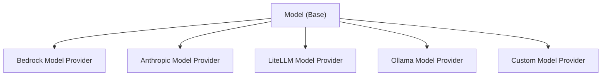

Strands Agents SDK provides an extensible interface for implementing custom model providers, allowing organizations to integrate their own LLM services while keeping implementation details private to their codebase.

## Model Provider Functionality

Custom model providers in Strands Agents support two primary interaction modes:

### Conversational Interaction

The standard conversational mode where agents exchange messages with the model. This is the default interaction pattern that is used when you call an agent directly:

```sa-tabs
[
 {
  "label": "Python",
  "body": "```python\nagent = Agent(model=your_custom_model)\nresponse = agent(\"Hello, how can you help me today?\")\n```"
 },
 {
  "label": "TypeScript",
  "body": "```typescript\nconst yourCustomModel = new YourCustomModel()\n\nconst agent = new Agent({ model: yourCustomModel })\nconst response = await agent.invoke('Hello, how can you help me today?')\n```"
 }
]
```

This invokes the underlying model provided to the agent.

## Model Provider Architecture

Strands Agents uses an abstract `Model` class that defines the standard interface all model providers must implement:



## Implementation Overview

The process for implementing a custom model provider is similar across both languages:

```sa-tabs
[
 {
  "label": "Python",
  "body": "In Python, you extend the `Model` class from `strands.models` and implement the required abstract methods:\n\n-   `stream()`: Core method that handles model invocation and returns streaming events\n-   `update_config()`: Updates the model configuration\n-   `get_config()`: Returns the current model configuration\n\nThe Python implementation uses async generators to yield `StreamEvent` objects."
 },
 {
  "label": "TypeScript",
  "body": "In TypeScript, you extend the `Model` class from `@strands-agents/sdk` and implement the required abstract methods:\n\n-   `stream()`: Core method that handles model invocation and returns streaming events\n-   `updateConfig()`: Updates the model configuration\n-   `getConfig()`: Returns the current model configuration\n\nThe TypeScript implementation uses async iterables to yield `ModelStreamEvent` objects.\n\n**TypeScript Model Reference**: The `Model` abstract class is available in the TypeScript SDK at `src/models/model.ts`. You can extend this class to create custom model providers that integrate with your own LLM services."
 }
]
```

## Implementing a Custom Model Provider

### 1\. Create Your Model Class

Create a new module in your codebase that extends the Strands Agents `Model` class.

```sa-tabs
[
 {
  "label": "Python",
  "body": "Create a new Python module that extends the `Model` class. Set up a `ModelConfig` to hold the configurations for invoking the model.\n\nyour\\_org/models/custom\\_model.py\n\n```python\nimport logging\nimport os\nfrom typing import Any, Iterable, Optional, TypedDict\nfrom typing_extensions import Unpack\n\nfrom custom.model import CustomModelClient\n\nfrom strands.models import Model\nfrom strands.types.content import Messages\nfrom strands.types.streaming import StreamEvent\nfrom strands.types.tools import ToolSpec\n\nlogger = logging.getLogger(__name__)\n\n\nclass CustomModel(Model):\n    \"\"\"Your custom model provider implementation.\"\"\"\n\n    class ModelConfig(TypedDict):\n        \"\"\"\n        Configuration your model.\n\n        Attributes:\n            model_id: ID of Custom model.\n            params: Model parameters (e.g., max_tokens).\n        \"\"\"\n        model_id: str\n        params: Optional[dict[str, Any]]\n        # Add any additional configuration parameters specific to your model\n\n    def __init__(\n        self,\n        api_key: str,\n        *,\n        **model_config: Unpack[ModelConfig]\n    ) -> None:\n        \"\"\"Initialize provider instance.\n\n        Args:\n            api_key: The API key for connecting to your Custom model.\n            **model_config: Configuration options for Custom model.\n        \"\"\"\n        self.config = CustomModel.ModelConfig(**model_config)\n        logger.debug(\"config=<%s> | initializing\", self.config)\n\n        self.client = CustomModelClient(api_key)\n\n    @override\n    def update_config(self, **model_config: Unpack[ModelConfig]) -> None:\n        \"\"\"Update the Custom model configuration with the provided arguments.\n\n        Can be invoked by tools to dynamically alter the model state for subsequent invocations by the agent.\n\n        Args:\n            **model_config: Configuration overrides.\n        \"\"\"\n        self.config.update(model_config)\n\n\n    @override\n    def get_config(self) -> ModelConfig:\n        \"\"\"Get the Custom model configuration.\n\n        Returns:\n            The Custom model configuration.\n        \"\"\"\n        return self.config\n```"
 },
 {
  "label": "TypeScript",
  "body": "Create a TypeScript module that extends the `Model` class. Define an interface for your model configuration to ensure type safety.\n\nsrc/models/custom-model.ts\n\n```typescript\n// Mock client for documentation purposes\ninterface CustomModelClient {\n  streamCompletion: (request: any) => AsyncIterable<any>\n}\n\n/**\n * Configuration interface for the custom model.\n */\nexport interface CustomModelConfig extends BaseModelConfig {\n  apiKey?: string\n  modelId?: string\n  maxTokens?: number\n  temperature?: number\n  topP?: number\n  // Add any additional configuration parameters specific to your model\n}\n\n/**\n * Custom model provider implementation.\n *\n * Note: In practice, you would extend the Model abstract class from the SDK.\n * This example shows the interface implementation for documentation purposes.\n */\nexport class CustomModel {\n  private client: CustomModelClient\n  private config: CustomModelConfig\n\n  constructor(config: CustomModelConfig) {\n    this.config = { ...config }\n    // Initialize your custom model client\n    this.client = {\n      streamCompletion: async function* () {\n        yield { type: 'message_start', role: 'assistant' }\n      },\n    }\n  }\n\n  updateConfig(config: Partial<CustomModelConfig>): void {\n    this.config = { ...this.config, ...config }\n  }\n\n  getConfig(): CustomModelConfig {\n    return { ...this.config }\n  }\n\n  async *stream(\n    messages: Message[],\n    options?: {\n      systemPrompt?: string | string[]\n      toolSpecs?: ToolSpec[]\n      toolChoice?: any\n    }\n  ): AsyncIterable<ModelStreamEvent> {\n    // Implementation in next section\n    // This is a placeholder that yields nothing\n    if (false) yield {} as ModelStreamEvent\n  }\n}\n```"
 }
]
```

### 2\. Implement the `stream` Method

The core of the model interface is the `stream` method that serves as the single entry point for all model interactions. This method handles request formatting, model invocation, and response streaming.

```sa-tabs
[
 {
  "label": "Python",
  "body": "The `stream` method accepts three parameters:\n\n-   [`Messages`](lc:api/python/strands.types.content#Messages): A list of Strands Agents messages, containing a [Role](lc:api/python/strands.types.content#Role) and a list of [ContentBlocks](lc:api/python/strands.types.content#ContentBlock).\n-   [`list[ToolSpec]`](/docs/api/python/strands.types.tools#ToolSpec): List of tool specifications that the model can decide to use.\n-   `SystemPrompt`: A system prompt string given to the Model to prompt it how to answer the user.\n\n```python\n    @override\n    async def stream(\n        self,\n        messages: Messages,\n        tool_specs: Optional[list[ToolSpec]] = None,\n        system_prompt: Optional[str] = None,\n        **kwargs: Any\n    ) -> AsyncIterable[StreamEvent]:\n        \"\"\"Stream responses from the Custom model.\n\n        Args:\n            messages: List of conversation messages\n            tool_specs: Optional list of available tools\n            system_prompt: Optional system prompt\n            **kwargs: Additional keyword arguments for future extensibility\n\n        Returns:\n            Iterator of StreamEvent objects\n        \"\"\"\n        logger.debug(\"messages=<%s> tool_specs=<%s> system_prompt=<%s> | formatting request\",\n                    messages, tool_specs, system_prompt)\n\n        # Format the request for your model API\n        request = {\n            \"messages\": messages,\n            \"tools\": tool_specs,\n            \"system_prompt\": system_prompt,\n            **self.config,  # Include model configuration\n        }\n\n        logger.debug(\"request=<%s> | invoking model\", request)\n\n        # Invoke your model\n        try:\n            response = await self.client(**request)\n        except OverflowException as e:\n            raise ContextWindowOverflowException() from e\n\n        logger.debug(\"response received | processing stream\")\n\n        # Process and yield streaming events\n        # If your model doesn't return a MessageStart event, create one\n        yield {\n            \"messageStart\": {\n                \"role\": \"assistant\"\n            }\n        }\n\n        # Process each chunk from your model's response\n        async for chunk in response[\"stream\"]:\n            # Convert your model's event format to Strands Agents StreamEvent\n            if chunk.get(\"type\") == \"text_delta\":\n                yield {\n                    \"contentBlockDelta\": {\n                        \"delta\": {\n                            \"text\": chunk.get(\"text\", \"\")\n                        }\n                    }\n                }\n            elif chunk.get(\"type\") == \"message_stop\":\n                yield {\n                    \"messageStop\": {\n                        \"stopReason\": \"end_turn\"\n                    }\n                }\n\n        logger.debug(\"stream processing complete\")\n```\n\nFor more complex implementations, you may want to create helper methods to organize your code:\n\n```python\n    def _format_request(\n        self,\n        messages: Messages,\n        tool_specs: Optional[list[ToolSpec]] = None,\n        system_prompt: Optional[str] = None\n    ) -> dict[str, Any]:\n        \"\"\"Optional helper method to format requests for your model API.\"\"\"\n        return {\n            \"messages\": messages,\n            \"tools\": tool_specs,\n            \"system_prompt\": system_prompt,\n            **self.config,\n        }\n\n    def _format_chunk(self, event: Any) -> Optional[StreamEvent]:\n        \"\"\"Optional helper method to format your model's response events.\"\"\"\n        if event.get(\"type\") == \"text_delta\":\n            return {\n                \"contentBlockDelta\": {\n                    \"delta\": {\n                        \"text\": event.get(\"text\", \"\")\n                    }\n                }\n            }\n        elif event.get(\"type\") == \"message_stop\":\n            return {\n                \"messageStop\": {\n                    \"stopReason\": \"end_turn\"\n                }\n            }\n        return None\n```\n\n> Note: `stream` must be implemented async. If your client does not support async invocation, you may consider wrapping the relevant calls in a thread so as not to block the async event loop. For an example on how to achieve this, you can check out the [BedrockModel](https://github.com/strands-agents/harness-sdk/blob/main/strands-py/src/strands/models/bedrock.py) provider implementation."
 },
 {
  "label": "TypeScript",
  "body": "The `stream` method is the core interface that handles model invocation and returns streaming events. This method must be implemented as an async generator.\n\n```typescript\n// Implementation of the stream method and helper methods\n\nexport class CustomModelStreamExample {\n  private config: CustomModelConfig\n  private client: CustomModelClient\n\n  constructor(config: CustomModelConfig) {\n    this.config = config\n    this.client = {\n      streamCompletion: async function* () {\n        yield { type: 'message_start', role: 'assistant' }\n      },\n    }\n  }\n\n  updateConfig(config: Partial<CustomModelConfig>): void {\n    this.config = { ...this.config, ...config }\n  }\n\n  getConfig(): CustomModelConfig {\n    return { ...this.config }\n  }\n\n  async *stream(\n    messages: Message[],\n    options?: {\n      systemPrompt?: string | string[]\n      toolSpecs?: ToolSpec[]\n      toolChoice?: any\n    }\n  ): AsyncIterable<ModelStreamEvent> {\n    // 1. Format messages for your model's API\n    const formattedMessages = this.formatMessages(messages)\n    const formattedTools = options?.toolSpecs\n      ? this.formatTools(options.toolSpecs)\n      : undefined\n\n    // 2. Prepare the API request\n    const request = {\n      model: this.config.modelId,\n      messages: formattedMessages,\n      systemPrompt: options?.systemPrompt,\n      tools: formattedTools,\n      maxTokens: this.config.maxTokens,\n      temperature: this.config.temperature,\n      topP: this.config.topP,\n      stream: true,\n    }\n\n    // 3. Call your model's API and stream responses\n    const response = await this.client.streamCompletion(request)\n\n    // 4. Convert API events to Strands ModelStreamEvent format\n    for await (const chunk of response) {\n      yield this.convertToModelStreamEvent(chunk)\n    }\n  }\n\n  private formatMessages(messages: Message[]): any[] {\n    return messages.map((message) => ({\n      role: message.role,\n      content: this.formatContent(message.content),\n    }))\n  }\n\n  private formatContent(content: ContentBlock[]): any {\n    // Convert Strands content blocks to your model's format\n    return content.map((block) => {\n      if (block.type === 'textBlock') {\n        return { type: 'text', text: block.text }\n      }\n      // Handle other content types...\n      return block\n    })\n  }\n\n  private formatTools(toolSpecs: ToolSpec[]): any[] {\n    return toolSpecs.map((tool) => ({\n      name: tool.name,\n      description: tool.description,\n      parameters: tool.inputSchema,\n    }))\n  }\n\n  private convertToModelStreamEvent(chunk: any): ModelStreamEvent {\n    // Convert your model's streaming response to ModelStreamEvent\n\n    if (chunk.type === 'message_start') {\n      const event: ModelMessageStartEventData = {\n        type: 'modelMessageStartEvent',\n        role: chunk.role,\n      }\n      return event\n    }\n\n    if (chunk.type === 'content_block_delta') {\n      if (chunk.delta.type === 'text_delta') {\n        const event: ModelContentBlockDeltaEventData = {\n          type: 'modelContentBlockDeltaEvent',\n          delta: {\n            type: 'textDelta',\n            text: chunk.delta.text,\n          },\n        }\n        return event\n      }\n    }\n\n    if (chunk.type === 'message_stop') {\n      const event: ModelMessageStopEventData = {\n        type: 'modelMessageStopEvent',\n        stopReason: this.mapStopReason(chunk.stopReason),\n      }\n      return event\n    }\n\n    throw new Error(`Unsupported chunk type: ${chunk.type}`)\n  }\n\n  private mapStopReason(\n    reason: string\n  ): 'endTurn' | 'maxTokens' | 'toolUse' | 'stopSequence' {\n    const stopReasonMap: Record<\n      string,\n      'endTurn' | 'maxTokens' | 'toolUse' | 'stopSequence'\n    > = {\n      end_turn: 'endTurn',\n      max_tokens: 'maxTokens',\n      tool_use: 'toolUse',\n      stop_sequence: 'stopSequence',\n    }\n    return stopReasonMap[reason] || 'endTurn'\n  }\n}\n```"
 }
]
```

### 3\. Understanding StreamEvent Types

Your custom model provider needs to convert your model’s response events to Strands Agents streaming event format.

```sa-tabs
[
 {
  "label": "Python",
  "body": "The Python SDK uses dictionary-based [StreamEvent](lc:api/python/strands.types.streaming#StreamEvent) format:\n\n-   [`messageStart`](lc:api/python/strands.types.streaming#MessageStartEvent): Event signaling the start of a message in a streaming response. This should have the `role`: `assistant`\n\n```python\n{\n    \"messageStart\": {\n        \"role\": \"assistant\"\n    }\n}\n```\n\n-   [`contentBlockStart`](lc:api/python/strands.types.streaming#ContentBlockStartEvent): Event signaling the start of a content block. If this is the first event of a tool use request, then set the `toolUse` key to have the value [ContentBlockStartToolUse](lc:api/python/strands.types.content#ContentBlockStartToolUse)\n\n```python\n{\n    \"contentBlockStart\": {\n        \"start\": {\n            \"name\": \"someToolName\", # Only include name and toolUseId if this is the start of a ToolUseContentBlock\n            \"toolUseId\": \"uniqueToolUseId\"\n        }\n    }\n}\n```\n\n-   [`contentBlockDelta`](lc:api/python/strands.types.streaming#ContentBlockDeltaEvent): Event continuing a content block. This event can be sent several times, and each piece of content will be appended to the previously sent content.\n\n```python\n{\n    \"contentBlockDelta\": {\n        \"delta\": { # Only include one of the following keys in each event\n            \"text\": \"Some text\", # String response from a model\n            \"reasoningContent\": { # Dictionary representing the reasoning of a model.\n                \"redactedContent\": b\"Some encrypted bytes\",\n                \"signature\": \"verification token\",\n                \"text\": \"Some reasoning text\"\n            },\n            \"toolUse\": { # Dictionary representing a toolUse request. This is a partial json string.\n                \"input\": \"Partial json serialized response\"\n            }\n        }\n    }\n}\n```\n\n-   [`contentBlockStop`](lc:api/python/strands.types.streaming#ContentBlockStopEvent): Event marking the end of a content block. Once this event is sent, all previous events between the previous [ContentBlockStartEvent](lc:api/python/strands.types.streaming#ContentBlockStartEvent) and this one can be combined to create a [ContentBlock](lc:api/python/strands.types.content#ContentBlock)\n\n```python\n{\n    \"contentBlockStop\": {}\n}\n```\n\n-   [`messageStop`](lc:api/python/strands.types.streaming#MessageStopEvent): Event marking the end of a streamed response, and the [StopReason](lc:api/python/strands.types.event_loop#StopReason). No more content block events are expected after this event is returned.\n\n```python\n{\n    \"messageStop\": {\n        \"stopReason\": \"end_turn\"\n    }\n}\n```\n\n-   [`metadata`](lc:api/python/strands.types.streaming#MetadataEvent): Event representing the metadata of the response. This contains the input, output, and total token count, along with the latency of the request.\n\n```python\n{\n    \"metrics\": {\n        \"latencyMs\": 123 # Latency of the model request in milliseconds.\n    },\n    \"usage\": {\n        \"inputTokens\": 234, # Number of tokens sent in the request to the model.\n        \"outputTokens\": 234, # Number of tokens that the model generated for the request.\n        \"totalTokens\": 468 # Total number of tokens (input + output).\n    }\n}\n```\n\n-   [`redactContent`](lc:api/python/strands.types.streaming#RedactContentEvent): Event that is used to redact the users input message, or the generated response of a model. This is useful for redacting content if a guardrail gets triggered.\n\n```python\n{\n    \"redactContent\": {\n        \"redactUserContentMessage\": \"User input Redacted\",\n        \"redactAssistantContentMessage\": \"Assistant output Redacted\"\n    }\n}\n```"
 },
 {
  "label": "TypeScript",
  "body": "The TypeScript SDK uses data interface types for `ModelStreamEvent`. Create events as plain objects matching these interfaces:\n\n-   `ModelMessageStartEvent`: Signals the start of a message response\n\n```typescript\nconst messageStart: ModelMessageStartEventData = {\n  type: 'modelMessageStartEvent',\n  role: 'assistant',\n}\n```\n\n-   `ModelContentBlockStartEvent`: Signals the start of a content block\n\n```typescript\n// For text blocks\nconst textBlockStart: ModelContentBlockStartEventData = {\n  type: 'modelContentBlockStartEvent',\n}\n\n// For tool use blocks\nconst toolUseStart: ModelContentBlockStartEventData = {\n  type: 'modelContentBlockStartEvent',\n  start: {\n    type: 'toolUseStart',\n    toolUseId: 'tool_123',\n    name: 'calculator',\n  },\n}\n```\n\n-   `ModelContentBlockDeltaEvent`: Provides incremental content\n\n```typescript\n// For text\nconst textDelta: ModelContentBlockDeltaEventData = {\n  type: 'modelContentBlockDeltaEvent',\n  delta: { type: 'textDelta', text: 'Hello' },\n}\n\n// For tool input\nconst toolInputDelta: ModelContentBlockDeltaEventData = {\n  type: 'modelContentBlockDeltaEvent',\n  delta: { type: 'toolUseInputDelta', input: '{\"x\": 1' },\n}\n\n// For reasoning content\nconst reasoningDelta: ModelContentBlockDeltaEventData = {\n  type: 'modelContentBlockDeltaEvent',\n  delta: {\n    type: 'reasoningContentDelta',\n    text: 'thinking...',\n    signature: 'sig',\n    redactedContent: new Uint8Array([]),\n  },\n}\n```\n\n-   `ModelContentBlockStopEvent`: Signals the end of a content block\n\n```typescript\nconst blockStop: ModelStreamEvent = {\n  type: 'modelContentBlockStopEvent',\n}\n```\n\n-   `ModelMessageStopEvent`: Signals the end of the message with stop reason\n\n```typescript\nconst messageStop: ModelMessageStopEventData = {\n  type: 'modelMessageStopEvent',\n  stopReason: 'endTurn', // Or 'maxTokens', 'toolUse', 'stopSequence'\n}\n```\n\n-   `ModelMetadataEvent`: Provides usage and metrics information\n\n```typescript\nconst metadata: ModelMetadataEventData = {\n  type: 'modelMetadataEvent',\n  usage: {\n    inputTokens: 234,\n    outputTokens: 234,\n    totalTokens: 468,\n  },\n  metrics: {\n    latencyMs: 123,\n  },\n}\n```"
 }
]
```

### 4\. Use Your Custom Model Provider

Once implemented, you can use your custom model provider in your applications for regular agent invocation:

```sa-tabs
[
 {
  "label": "Python",
  "body": "```python\nfrom strands import Agent\nfrom your_org.models.custom_model import CustomModel\n\n# Initialize your custom model provider\ncustom_model = CustomModel(\n    api_key=\"your-api-key\",\n    model_id=\"your-model-id\",\n    params={\n        \"max_tokens\": 2000,\n        \"temperature\": 0.7,\n    },\n)\n\n# Create a Strands agent using your model\nagent = Agent(model=custom_model)\n\n# Use the agent as usual\nresponse = agent(\"Hello, how are you today?\")\n```"
 },
 {
  "label": "TypeScript",
  "body": "```typescript\nasync function usageExample() {\n  // Initialize your custom model provider\n  const customModel = new YourCustomModel({\n    maxTokens: 2000,\n    temperature: 0.7,\n  })\n\n  // Create a Strands agent using your model\n  const agent = new Agent({ model: customModel })\n\n  // Use the agent as usual\n  const response = await agent.invoke('Hello, how are you today?')\n}\n```"
 }
]
```

## Key Implementation Considerations

### 1\. Stream Interface

The model interface centers around a single `stream` method that:

-   Accepts `messages`, `tool_specs`, and `system_prompt` directly as parameters
-   Handles request formatting, model invocation, and response processing internally
-   Provides debug logging for better observability

### 2\. Message Formatting

Strands Agents’ internal `Message`, `ToolSpec`, and `SystemPrompt` types must be converted to your model API’s expected format:

-   Strands Agents uses a structured message format with role and content fields
-   Your model API might expect a different structure
-   Handle the message content conversion in your `stream()` method

### 3\. Streaming Response Handling

Strands Agents expects streaming responses to be formatted according to its `StreamEvent` protocol:

-   `messageStart`: Indicates the start of a response message
-   `contentBlockStart`: Indicates the start of a content block
-   `contentBlockDelta`: Contains incremental content updates
-   `contentBlockStop`: Indicates the end of a content block
-   `messageStop`: Indicates the end of the response message with a stop reason
-   `metadata`: Indicates information about the response like input\_token count, output\_token count, and latency
-   `redactContent`: Used to redact either the user’s input, or the model’s response

Convert your API’s streaming format to match these expectations in your `stream()` method.

### 4\. Tool Support

If your model API supports tools or function calling:

-   Format tool specifications appropriately in `stream()`
-   Handle tool-related events in response processing
-   Ensure proper message formatting for tool calls and results

### 5\. Error Handling

Implement robust error handling for API communication:

-   Context window overflows
-   Connection errors
-   Authentication failures
-   Rate limits and quotas
-   Malformed responses

### 6\. Configuration Management

The built-in `get_config` and `update_config` methods allow for the model’s configuration to be changed at runtime:

-   `get_config` exposes the current model config
-   `update_config` allows for at-runtime updates to the model config
    -   For example, changing model\_id with a tool call

## Related pages

- [Tool Executors](lc:user-guide/concepts/tools/executors) (1 shared tag)
- [Available Sandboxes](lc:user-guide/concepts/sandbox/available-sandboxes) (1 shared tag)
- [Building a Custom Sandbox](lc:user-guide/concepts/sandbox/custom-sandbox) (1 shared tag)
- [Human in the Loop](lc:user-guide/concepts/agents/interventions/human-in-the-loop) (1 shared tag)
- [Sandbox](lc:user-guide/concepts/sandbox) (1 shared tag)
- [Cedar Authorization](lc:user-guide/concepts/agents/interventions/cedar-authorization) (1 shared tag)
- [Agent Loop](lc:user-guide/concepts/agents/agent-loop) (1 shared tag)
- [Hooks](lc:user-guide/concepts/agents/hooks) (1 shared tag)
- [Steering (Interventions)](lc:user-guide/concepts/agents/interventions/steering) (1 shared tag)
- [Agents as Tools with Strands Agents SDK](lc:user-guide/concepts/multi-agent/agents-as-tools) (1 shared tag)


## Implementation

### Python

- [harness-sdk/strands-py/src/strands/models/model.py](https://github.com/strands-agents/harness-sdk/blob/main/strands-py/src/strands/models/model.py)

### TypeScript

- [harness-sdk/strands-ts/src/models/model.ts](https://github.com/strands-agents/harness-sdk/blob/main/strands-ts/src/models/model.ts)
